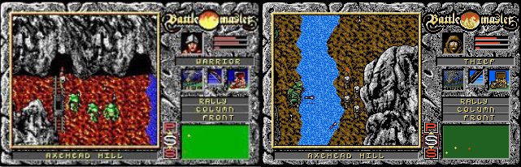
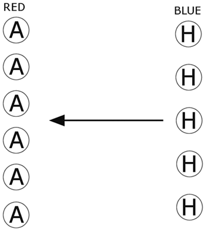
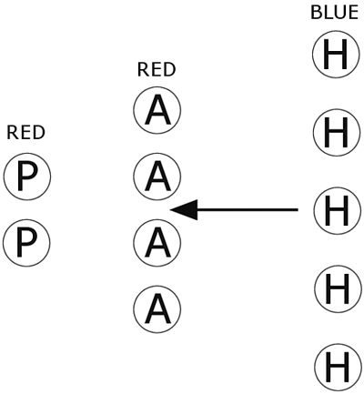
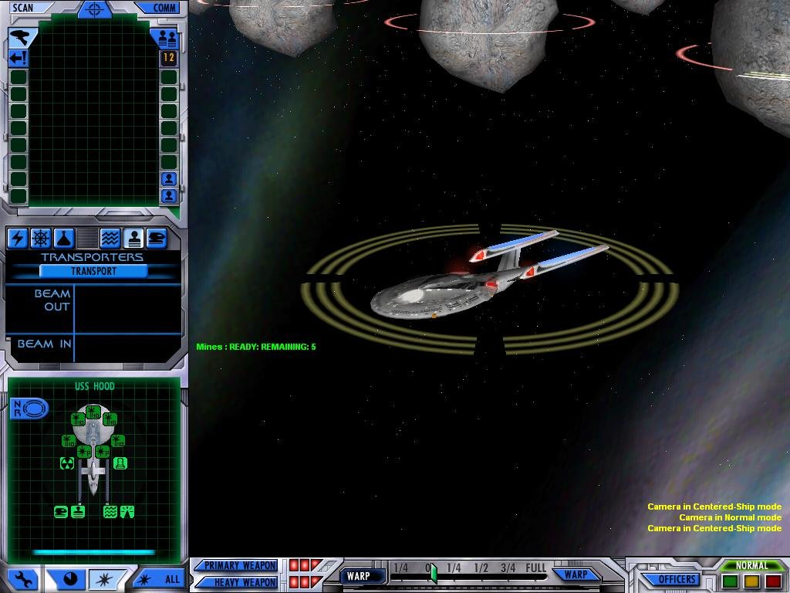
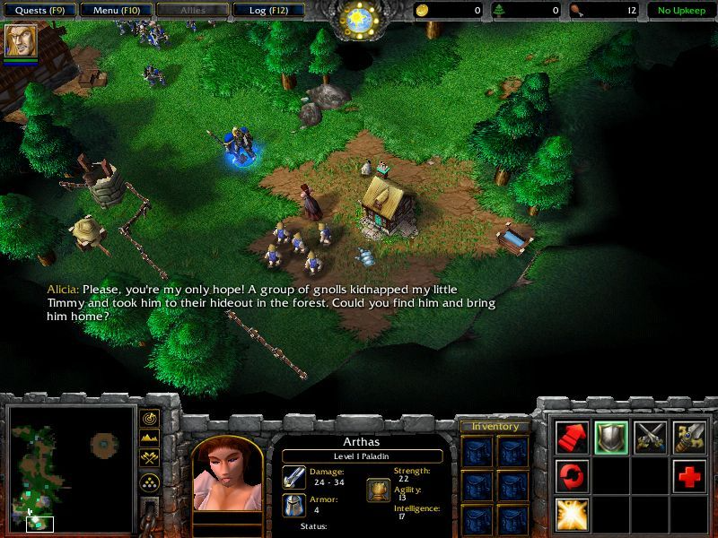
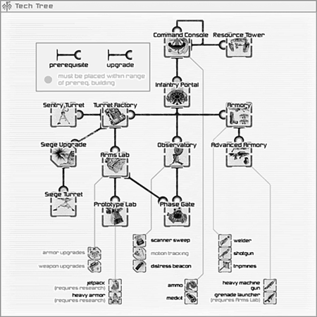
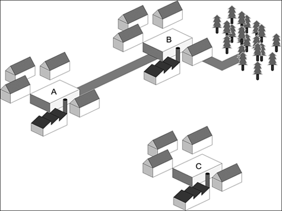

The origin of strategy games is rooted in their close cousins, board games. If there is any format of game that is closest to the original pre-computer form (where that existed), it is the strategy game. This chapter is the most PC-centric chapter in the entire book, but for good reason: Most strategy games are released for the PC. Console efforts so far have been few and far between.

策略游戏起源于它们的近亲——桌游。如果说有什么游戏形式最接近电脑前的原始形式（如果有的话），那就是策略游戏了。本章是全书中最以 PC 为中心的一章，但这是有道理的：大多数策略游戏都是针对 PC 发布的，而在游戏机上的策略游戏少之又少。

The benefits that the computer has brought to the strategy game genre include the capability to impartially manage complex rule-sets that would be next to impossible for a human to manage without bogging down the game to a level at which it is no longer fun to play.

电脑给策略游戏带来的好处包括，它可以公正地管理复杂的规则集，而人类几乎不可能管理这些规则集，否则就会使游戏陷入困境，玩起来不再有趣。

On the computer, the strategy game has since diversified into two main forms: classical turn-based strategy games and real-time strategy games. Chronologically, the real-time strategy game arrived on the scene after the turn-based strategy game. Our discussion considers both of these forms.

在电脑上，战略游戏后来发展成两种主要形式：传统的回合制战略游戏和即时战略游戏。从时间上看，即时战略游戏是在回合制战略游戏之后出现的。我们的讨论将考虑这两种形式。

The archetypal example of a computer strategy game is the [Civilization](https://en.wikipedia.org/wiki/Civilization_(series)) series, originally developed by Sid Meier, before splitting off into the watered-down Call to Power offshoots. Fortunately, games such as Alpha Centauri and [Civilization III](https://en.wikipedia.org/wiki/Civilization_III) from Firaxis rescued the franchise from a quiet demise.

电脑策略游戏的典型代表是[《文明》](https://en.wikipedia.org/wiki/Civilization_(series))系列，该系列最初由席德·梅尔开发，后来又衍生出《权力的呼唤》（Call to Power）等掺水的分支游戏。幸运的是，Firaxis 公司推出的[《半人马座阿尔法》](https://en.wikipedia.org/wiki/Sid_Meier%27s_Alpha_Centauri)和[《文明三》](https://en.wikipedia.org/wiki/Civilization_III)等游戏将该系列游戏从悄然消亡中拯救出来。

Intriguingly, the computer game [Civilization III](https://en.wikipedia.org/wiki/Civilization_III) has made a rare transition: from a computer game to a board game. [Civilization III: The Board Game](https://boardgamegeek.com/boardgame/3633/sid-meiers-civilization-the-boardgame) was released in October 2002, featuring three sets of rules (basic, standard, and advanced) and 784 plastic miniature pieces. Not surprisingly, Civilization III: The Board Game is significantly more complex than [Advanced Civilization](https://en.wikipedia.org/wiki/Advanced_Civilization), the board game that the original Sid Meier's [Civilization](https://en.wikipedia.org/wiki/Civilization_(series)) game was based on in the first place. This is good evidence that although translating and enhancing board games to the computer is an excellent method of producing compelling and fun strategy games, the converse is not necessarily true.

耐人寻味的是，电脑游戏[《文明三》](https://en.wikipedia.org/wiki/Civilization_III)罕见地实现了从电脑游戏到桌游的转变。[《文明三：棋盘游戏》](https://boardgamegeek.com/boardgame/3633/sid-meiers-civilization-the-boardgame)于 2002 年 10 月发行，有三套规则（基本规则、标准规则和高级规则）和 784 个塑料小棋子。毫不奇怪，[《文明三：棋盘游戏》](https://boardgamegeek.com/boardgame/3633/sid-meiers-civilization-the-boardgame)要比[《高级文明》](https://en.wikipedia.org/wiki/Advanced_Civilization)复杂得多，而[《高级文明》](https://en.wikipedia.org/wiki/Advanced_Civilization)正是席德·梅尔的[《文明》](https://en.wikipedia.org/wiki/Civilization_(series))游戏的原型。这充分证明，虽然将桌游转换到电脑上并对其进行改进，是制作引人入胜且有趣的策略游戏的绝佳方法，但反之亦然。

However, the comparative simplicity of the rules of computer-based strategy games (compared to other genres) lends itself to a good analysis of the effectiveness of the rules of play. In essence, strategy games are the easiest genre in which to generate a consistent and balanced rule-set. That is not to say that they are easier to design. However, the rules are easier to analyze for balance, mainly due to the discrete turn-based nature of the gameplay that most strategy games exhibit.

不过，电脑策略游戏的规则相对简单（与其他类型游戏相比），这就为分析游戏规则的有效性提供了很好的依据。从本质上讲，策略游戏是最容易产生一致且平衡的规则集的游戏类型。这并不是说它们更容易设计。然而，主要由于大多数策略游戏都具有离散的回合制游戏性质，因此更容易对规则进行平衡分析。

As a general rule, pure strategy games tend to be turn-based rather than real-time. Strategic thinking, at least in the arena of gameplay, does not lend itself well to real-time action. The player often prefers to mull over his moves, considering the impact of one choice over another. In board games, this can result in frustrating "analysis paralysis," in which one player spends a large amount of time min-maxing his move and breaks the flow of the game. Fortunately, computers are infinitely patient, so this sort of behavior should be tolerated—although it should not be required by the game design.

一般来说，纯策略游戏倾向于回合制而非即时制。至少在游戏领域，战略思维并不适合实时操作。玩家通常更喜欢琢磨自己的行动，考虑一个选择对另一个选择的影响。在桌游中，这可能会导致令人沮丧的“分析瘫痪”，即一名玩家花费大量时间对自己的棋步进行最小化，从而破坏了游戏的流畅性。幸运的是，计算机有无限的耐心，因此这种行为应该被容忍——尽管游戏设计不应该要求这样做。


译者注：min-max，是一种策略，通常用于游戏理论和决策过程中，尤其是在那些涉及竞争和优化决策的场景中。这个术语是由数学家约翰·冯·诺伊曼在博弈论的背景下提出的。

在"min-max"策略中，玩家尝试最小化可能的最大损失（minimize the maximum loss），或者在某些情况下，最大化可能的最小收益（maximize the minimum gain）。换句话说，玩家在制定策略时会考虑最坏的情况，并试图在这个最坏情况下实现最佳结果。


An offshoot of the turn-based strategy game concept is the real-time strategy (RTS) genre. [Westwood](https://en.wikipedia.org/wiki/Westwood_Studios)'s [Dune II](https://en.wikipedia.org/wiki/Dune_II) is considered to be the first true real-time strategy game, although we believe that the game [Battle Master](https://en.wikipedia.org/wiki/Battle_Master) (screens from which are shown in Figure 10.1), released in 1990 for the Commodore Amiga and Atari ST computers, marks the true origin of the RTS genre.

回合制战略游戏概念的一个分支是实时战略（RTS）类型。[西木工作室](https://en.wikipedia.org/wiki/Westwood_Studios)的[《沙丘二》](https://en.wikipedia.org/wiki/Dune_II)被认为是第一款真正意义上的即时战略游戏，不过我们认为，1990 年在 Commodore Amiga 和 Atari ST 电脑上发布的游戏[《Battle Master》](https://en.wikipedia.org/wiki/Battle_Master)（其画面如图 10.1 所示）才是即时战略类型的真正起源。

Figure 10.1. Battle Master. 图 10.1. 《Battle Master》。

RTS games are differentiated from pure strategy games in that time is a constant pressure. There are no "turns" during which the player can ponder his moves—everything happens at once. Consequently, reaction time and quick action are as important as strategic thinking.

RTS 游戏不同于纯粹的策略游戏，因为时间是一种持续的压力。游戏中没有“回合”，玩家无暇仔细琢磨自己的行动，所有事情都是一气呵成。因此，反应时间和快速行动与战略思维同样重要。

Although the RTS game breathed new life into the strategy genre, and although titles such as [Dune II](https://en.wikipedia.org/wiki/Dune_II), [Warcraft](https://en.wikipedia.org/wiki/Warcraft), and [Age of Empires](https://en.wikipedia.org/wiki/Age_of_Empires) propelled it into mass-market acceptance, there has been little innovation to maintain this momentum over the past few years.

尽管 RTS 游戏为战略类型游戏注入了新的活力，尽管[《沙丘二》](https://en.wikipedia.org/wiki/Dune_II)、[《魔兽争霸》](https://en.wikipedia.org/wiki/Warcraft)和[《帝国时代》](https://en.wikipedia.org/wiki/Age_of_Empires)等游戏推动了战略类型游戏进入大众市场，但在过去几年中，几乎没有什么创新来保持这种势头。

Aside from growing more complex, prettier, and larger over the years, the fundamental design of the RTS has remained virtually unchanged since the beginning.

多年来，RTS 除了变得更复杂、更漂亮、更庞大之外，其基本设计从一开始就几乎没有变化。

# The Common Elements of Strategy Games 策略游戏的共同要素

Strategy games, whether turn-based or real-time, all feature a core management mechanic. The primary factors that influence whether a strategy game is compelling are listed here:

策略游戏，无论是回合制还是即时制，都有一个核心管理机制。下面列出了影响策略游戏是否引人注目的主要因素：

* **The theme.** For example, not many people will be interested in managing a colony of nematodes. Strategy games tend to have themes with sweeping importance, such as conquest (Age of Kings), exploration (Sid Meier's Colonization), or trade (the Tycoon series of games).\

**主题。** 例如，没有多少人会对管理线虫群感兴趣。策略游戏的主题往往具有广泛的重要性，如征服（《国王时代》）、探索（《席德·梅尔的殖民》）或贸易（《大亨》系列游戏）。

* **The presentation layer.** By nature, strategy games often have extremely complicated underlying mechanics. Consequently, the design of the player interface to the game is critical. The interface can organize and simplify this complexity for a player or, if not handled well, can make the game overwhelming and confusing.\ 

**表现层。** 从本质上讲，策略游戏的基本机制往往极其复杂。因此，游戏玩家界面的设计至关重要。界面可以为玩家组织和简化这种复杂性，否则，如果处理不当，就会使游戏变得令人不知所措和困惑。

* **The perspective.** Strategy games have traditionally used only a few perspectives for the player to experience the game world. Most strategy games tend toward grand-scale manipulation of the game world, but a few require the player to control a small group or a single avatar. The games that implement the latter option tend to place a greater emphasis on arcade action and real-time activities.\

**视角。** 策略游戏传统上只使用几个视角让玩家体验游戏世界。大多数战略游戏都倾向于大范围地操纵游戏世界，但也有少数游戏要求玩家控制一个小团体或单个化身。采用后一种方式的游戏往往更强调街机操作和实时活动。

## Themes 主题

Strategy game themes are often derived from one or more of the following basic activities, which lend themselves well to implementation on a range of scales: conquest, exploration, and trade. More often than not, a strategy game blends these three activities. The extent to which any particular activity is dominant over the other determines the overall flavor of the game. However, the three activities are usually mutually interdependent.

策略游戏的主题通常来自于以下一种或多种基本活动，这些活动非常适合在各种规模的游戏中实施：征服、探索和贸易。更常见的情况是，策略游戏融合了这三种活动。某项活动对其他活动的主导程度决定了游戏的整体风格。不过，这三种活动通常是相互依存的。

For example, [Starcraft](https://en.wikipedia.org/wiki/StarCraft) uses conquest as its primary mechanism. Exploration and trade do feature in the game, but only as an enabler for the player to conquer more effectively. The player must explore the area to be conquered and set up resource-processing plants to allow resources to be traded for weapons and units.

例如，[《星际争霸》](https://en.wikipedia.org/wiki/StarCraft)以征服为主要机制。探索和贸易的确是游戏的特色，但只是作为玩家更有效征服的辅助手段。玩家必须探索要征服的地区，并建立资源加工厂，以便用资源换取武器和单位。

Sid Meier's Colonization is primarily about exploration; the basic goal of the player is to explore the new world. Secondary aims are to settle colonies and subsequently defend those colonies from attacks by the displaced natives and the other colonizing nationalities. In this game, the three primary activities of conquest, exploration, and trade are quite evenly distributed. However, the enabler for conquest and trade is exploration. You can't trade or conquer before you've explored who to conquer or trade with.

席德·梅尔的殖民游戏以探索为主；玩家的基本目标是探索新世界。次要目标是建立殖民地，然后保卫这些殖民地，抵御流离失所的当地人和其他殖民国家的攻击。在这款游戏中，征服、探索和贸易这三项主要活动的分布相当均匀。然而，征服和贸易的推动力是探索。在探索出征服或贸易对象之前，你无法进行贸易或征服。

Hasbro's [Monopoly Tycoon](https://en.wikipedia.org/wiki/Monopoly_Tycoon) focuses on trade as the game's main activities. Players are required to trade to increase their value, while simultaneously preventing their opponents from increasing their value. Exploration is not really used in [Monopoly](https://en.wikipedia.org/wiki/Monopoly_(game)), but it could be argued that the competitive nature of the game implies that conquest is a small part of it: You can win only by defeating your opponents.

孩之宝公司的[《垄断大亨》](https://en.wikipedia.org/wiki/Monopoly_Tycoon)将贸易作为游戏的主要活动。玩家需要通过贸易来提高自身价值，同时阻止对手提高自身价值。[《大富翁》](https://en.wikipedia.org/wiki/Monopoly_(game))中并没有真正使用探索，但可以说，游戏的竞争性质意味着征服是游戏的一小部分：只有击败对手才能获胜。

As we've mentioned, the roots of the strategy game can easily be traced back to the board game. In fact, board games make an excellent starting point to discuss the features of computer strategy games—their rule-sets are simple enough to grasp in entirety, and observations on the effectiveness of these rule-sets scale well to apply equally effectively to the more complex computer strategy game. Consequently, we examine each of these three core activities in more detail, using board games as examples.

正如我们所提到的，策略游戏的根源很容易追溯到桌游。事实上，桌游是讨论电脑策略游戏特点的绝佳切入点——它们的规则集非常简单，足以让人完全掌握，而对这些规则集有效性的观察也同样适用于更为复杂的电脑策略游戏。因此，我们将以桌游为例，对这三种核心活动逐一进行更详细的研究。

### Conquest 征服

Conquest is the most immediately engaging activity in strategy games. On many levels, it directly appeals to the (mostly male) players' psyches and allows the player to command great armies, lead crack squads into dangerous territory, or become the evil dictator that they always dreamed of being. Consequently, due to the mainly male player demographic, the majority of computer strategy games released to this point have been heavily based around conquest.

征服是策略游戏中最能直接吸引玩家的活动。在许多层面上，它直接迎合了玩家（大多为男性）的心理，让玩家可以指挥强大的军队，带领精锐部队进入危险的领土，或者成为他们一直梦想成为的邪恶独裁者。因此，由于玩家以男性为主，迄今为止推出的大多数电脑战略游戏都以征服为主要内容。

Conquest—at least, in the physical sense—is facilitated by allowing the player to engage in conflict with one or more foes. The mechanisms for regulating and resolving conflict between entities in strategy games have been well-studied and understood. In fact, Game Theory, a respected scientific field, is devoted entirely to understanding and resolving the outcome of conflict under known conditions.

征服——至少是物理意义上的征服——是通过允许玩家与一个或多个敌人发生冲突来实现的。在策略游戏中，调节和解决实体间冲突的机制已经得到了很好的研究和理解。事实上，博弈论作为一个备受推崇的科学领域，完全致力于理解和解决已知条件下的冲突结果。

The essence of conflict is a contest between two or more opponents, each with an inherent set of attributes that are used to determine the outcome. Often, to achieve game balance, these conflict relationships are resolved with the use of an SPS (Scissors-Paper-Stone) mechanism, with an early example coming from [The Ancient Art of War](https://en.wikipedia.org/wiki/The_Ancient_Art_of_War): knights beat barbarians, barbarians beat archers, archers beat knights. This approach is simple and—if implemented well—guarantees a fair relationship between all the conflicting entities. The use of the SPS mechanism is also a telling reminder of the board-game origin of the modern computer strategy game, although the computer allows for much more complex relationships, including compound relationships. Computers are ideal for handling this sort of complexity automatically—board games that attempt to implement this level of detail in their rules seem to get bogged down in a morass of rules. Of course, some people like tabletop war-games that last for weeks on end—but they are in the minority. Much of this material was covered in Chapter 8, "The Internal Economy of Games and Game Balancing," but we'll be extending that discussion here to cover the specifics of conflict in strategy games.

冲突的本质是两个或两个以上对手之间的较量，每个对手都有一套固有属性，用来决定胜负。通常情况下，为了实现游戏平衡，这些冲突关系是通过使用 SPS（剪刀-纸-石头）机制来解决的，早期的例子来自[《战争上古艺术》](https://en.wikipedia.org/wiki/The_Ancient_Art_of_War)：骑士击败野蛮人，野蛮人击败弓箭手，弓箭手击败骑士。这种方法简单易行，如果实施得当，可以保证所有冲突实体之间的公平关系。SPS 机制的使用也让人联想到现代电脑策略游戏的桌游起源，尽管电脑允许更复杂的关系，包括复合关系。计算机非常适合自动处理这种复杂性——试图在规则中实现这种细节的桌游似乎会陷入规则的泥潭。当然，有些人喜欢持续数周的桌面战争游戏，但他们毕竟是少数。[第八章](chapter-8.md)“游戏的内部经济和游戏平衡”中已经介绍了其中的许多内容，但我们将在此延伸讨论策略游戏中冲突的具体细节。

Consider an imaginary contest between two players, each with a squad of men, as shown in Figure 10.2. The red player has a squad of archers, and the blue player has a squad of horsemen. Typically, in a one-on-one battle between the two squads, the blue player will be victorious. That is because the horsemen can ride down the archers en masse before they can cause too much damage. Archers are less effective at close range; consequently, as long as the blue player can get through the initial barrage of arrows, he is assured victory. In terms of unit equality, we can say that one horseman will strongly tend to beat one archer. Given no other variation is parameters, this rule is inviolate: Horsemen beat archers.

如图 10.2 所示，假设有两个玩家在比赛，每个玩家都有一队人马。红色方有一队弓箭手，蓝色方有一队骑兵。通常情况下，在两个小队一对一的战斗中，蓝方玩家会取得胜利。这是因为骑兵可以在弓箭手造成过多伤害之前将其一举击倒。弓箭手在近距离的效果较差；因此，只要蓝方玩家能穿过最初的箭雨，就能确保胜利。在单位相等的情况下，我们可以说一个骑兵极有可能击败一个弓箭手。在没有其他参数变化的情况下，这一规则是不可动摇的：骑兵击败弓箭手。

Figure 10.2. Red versus blue: Blue is victorious! 图 10.2. 红色对蓝色：蓝方获胜！

The red player is obviously not impressed by the outcome of this skirmish and decides to replace his archers with peasants. The peasants line up in formation, as shown in Figure 10.3, and are soundly beaten by the horsemen, who can deal out damage far more efficiently than the peasants. The result is the same: Blue wins. From this, we can say with certainty that, given no other variation in parameters, horsemen beat peasants.

红方显然对这场小规模战斗的结果不以为然，决定用农民替换弓箭手。农民排成队列，如图 10.3 所示，结果被骑兵打得落花流水，因为骑兵的伤害效率远高于农民。结果还是一样：蓝方获胜。由此，我们可以肯定地说，在参数没有其他变化的情况下，骑兵会击败农民。

Figure 10.3. Red versus blue: Blue is victorious again! 图 10.3. 红色对蓝色：蓝方再次获胜！

However, let's assume that the red player replaces two thirds of his archers with peasants. He places his peasants in a row facing the horsemen, and his archers remain at a safe distance behind the peasants, as shown in Figure 10.4. Now, to reach the archers, the blue player's horseman must first defeat the peasants. While they are doing so, the archers are free to rain arrows on the horsemen, causing much more damage than the archers from the previous encounter. The delay caused by the peasants allows the archers to pick off the horsemen. The net result: Red victory. This is an example of compound SPS effects—in other words, the whole is greater than the sum. Archers alone get slaughtered by the heavily armed and faster horsemen, as do peasants. When used together, their combined strength and weakness overlap to create more than a match for the beleaguered horsemen.

然而，我们假设红方将三分之二的弓箭手换成了农民。如图 10.4 所示，他将农民面向骑兵排成一排，而弓箭手则保持在农民后面的安全距离。现在，蓝方玩家的骑兵要想接近弓箭手，必须先打败农民。此时，弓箭手可以自由地向骑兵射出箭雨，造成的伤害比之前遭遇的弓箭手要高得多。农民造成的延迟让弓箭手得以射杀骑兵。最终结果：红方获胜。这是一个 SPS 复合效果的例子——换句话说，整体大于总和。弓箭手和农民一样，都会被全副武装、速度更快的骑兵屠杀。当他们一起使用时，他们的强项和弱项叠加在一起，就能与被围困的骑兵相抗衡。

Figure 10.4. Red versus blue: Red is victorious! 图 10.4. 红色对蓝色：红色获胜！

This is an obviously simplified example, but the results scale up from the squad level to the scale of grand armies—the same rules apply. Of course, this result brings some additional complications to the SPS model. With combination effects such as this, you now have to consider placement and other factors—consider the result if the red player had switched the positions of the archers and peasants, as shown in Figure 10.5. Then the compound effect would have been wasted—instead of each type of unit covering for the others weakness, the converse would be true.

这显然是一个简化的示例，但其结果可以从小队级扩展到大军级——规则依然适用。当然，这一结果给 SPS 模型带来了一些额外的复杂因素。考虑一下如果红方调换弓箭手和农民的位置，结果会如何，如图 10.5 所示。那么复合效果就会被浪费——不是每种单位都能弥补其他单位的弱点，而是发生相反的情况。

Figure 10.5. Red versus blue: Red's big mistake! 图 10.5. 红色与蓝色： 红方的大错！

A detailed discussion of the relative merits of formations is beyond the scope of this book, but it is interesting to realize that explicit formation rules do not need to be explicitly implemented in the game design. In fact, outside of a few remote situations, you should never explicitly design such a high-level set of rules into your game. Concentrate on the lower-level individual unit parameters, and the higher-level features such as formation effectiveness will emerge from those.

详细讨论阵型的相对优点超出了本书的讨论范围，但值得注意的是，明确的阵型规则并不需要在游戏设计中明确实施。事实上，除了极少数情况外，你不应该在游戏中明确设计这样一套高层次的规则。将注意力集中在低级别的单个单位参数上，而诸如编队效果等高级别的特征将从这些参数中产生。

In the four red versus blue examples we have just discussed, you will notice that there is no need for the conflict-resolution rules to be explicitly built in. Instead, the following set of individual unit rules will produce the desired results:

在我们刚才讨论的四个红蓝对战的例子中，你会注意到没有必要明确内置冲突解决规则。相反，下面这套单个单位规则就能产生所需的结果：

* Archers are lightly armored and move at a reasonably quick rate. They need a minimum combat distance of 10 yards, and they deal average damage per second.\
弓箭手是轻装甲部队，移动速度相当快。他们需要 10 码的最小战斗距离，每秒造成的伤害是普通水平。

* Horsemen are heavily armored and move quickly. They can engage only in close combat, and they deal above average damage per second.\
骑兵身披重甲，移动迅速。他们只能进行近战，每秒造成的伤害高于普通水平。

* Peasants are medium armored and move slowly. They can engage only in close combat, and they deal average damage per second.\
农民有中等装甲，移动缓慢。他们只能近战，每秒造成的伤害是普通水平。

Assume that a unit dealing above average damage causes only slightly greater damage than a unit dealing average damage. A factor of 1.5 differentiating the two damage levels would be suitable. Any greater than that, and there is a fair chance that the defending peasants in Figure 10.4 would be finished off quickly enough to allow the horsemen through to defeat the archers.

假设造成高于普通伤害的单位造成的伤害仅略高于造成普通伤害的单位。将这两种伤害等级区分为 1.5 倍是合适的。如果超过这个系数，图 10.4 中防守的农民很有可能很快就会被干掉，从而允许骑兵通过去击败弓箭手。

The nature of the parameters used to define the abilities very much depends on the nature of the units and the environment they are in. For example, the turning arc of an individual foot soldier is not really an important consideration and can be safely ignored. However, in Taldren's Starfleet Command III, shown in Figure 10.6, the turning arc of a starship is an extremely important factor—you cannot fire on an opponent if your available weapon is facing the wrong way. This can make the difference between victory and defeat if your starship cannot turn quickly enough to return fire. Of course, this could have made for an extremely frustrating and arbitrary game if the designers had not had the foresight to build in an exception clause: The player has the option of choosing to perform a high-risk "rapid turn" (which brings to mind images of shaking cameras and aging actors throwing themselves around a set in synchronization), the success of which depends on the skill of the helmsman and the amount of time since that particular maneuver was last performed.

用于定义能力的参数的性质在很大程度上取决于部队的性质和所处的环境。例如，单个步兵的转弯弧度并不是一个重要的考虑因素，可以放心地忽略不计。然而，在图 10.6 所示的 Taldren 的《星际舰队指令 III》中，星舰的转弯弧度是一个极其重要的因素——如果你的可用武器朝向错误，你就无法向对手开火。如果你的星舰不能迅速转向以进行还击，那么这将决定胜负。当然，如果设计者没有先见之明，没有在游戏中加入例外条款，这可能会使游戏变得极其令人沮丧和武断：玩家可以选择进行高风险的“快速转向”（这会让人联想到晃动的摄像机和老态龙钟的演员们在布景中同步旋转的画面），成功与否取决于舵手的技能和上次进行该特定操作的时间。

Figure 10.6. Taldren's Starfleet Command III. 图 10.6. 塔尔德伦的《星际舰队指令 III》。

Conflict does not necessarily have to involve physical combat. Whereas RTS games and "simpler" strategy games tend to focus on the combat aspects, the more advanced and progressive games tend to keep combat as a "last resort" option, more closely mirroring reality. For example, Civilization III uses diplomacy as another method of introducing conflict to the game. In real life, diplomacy is considered to be the "polite face" of war; in Civilization III, it is no different. The response of the enemy leaders to your diplomatic overtures depends in large part on whether you have the force to back up your tough words. Of course, diplomacy isn't all about trash-talk and "who-has-the-biggest-missile" contests—it also allows for the formation of diplomatic alliances and missions of peace. Somehow, though (and maybe it's just the way we play the game), the fine words of friendship are soon forgotten once the alliance has outlived its usefulness.

冲突并不一定涉及肉搏。RTS 游戏和“较简单”的战略游戏倾向于把重点放在战斗方面，而更先进、更前卫的游戏则倾向于把战斗作为 “最后手段”，更加贴近现实。例如，《文明 III》将外交作为游戏中引入冲突的另一种方法。在现实生活中，外交被认为是战争的“礼貌面孔”；在《文明 III》中也不例外。敌方领导人对你的外交姿态的反应在很大程度上取决于你是否有足够的武力来支持你的强硬言论。当然，外交并不全是垃圾话和“谁拥有最大的导弹”的竞赛——它还允许建立外交联盟和和平使命。但不知何故（也许这只是我们玩游戏的方式），一旦联盟失去作用，美好的友谊之词很快就会被遗忘。

The use of diplomacy is more suited to a slower-paced strategy game—designed to be played over a long period of (game) time. The extra nuance and depth that it can add to an otherwise bog-standard strategy game is well worth the extra time and effort spent designing and implementing a worthwhile diplomacy system. Diplomacy gives the player an extra degree of freedom, and this allows for the creation of more devious and interesting game plans than would be possible otherwise. Diplomacy, in this case, is a catch-all term we are using to also include actions such as espionage and spying.

外交的使用更适合节奏较慢的策略游戏——设计为长（游戏）时间进行。外交系统可以为一款普通的策略游戏增添细微差别和深度，因此值得花费额外的时间和精力来设计和实施一个有价值的外交系统。外交为玩家提供了额外的自由度，这使得玩家可以创造出比其他方式更狡猾、更有趣的游戏计划。在这里，“外交”是一个包罗万象的术语，也包括间谍和刺探等行为。

### Exploration 探索

Games that focus on exploration often use the conquest activity in almost equal parts. Consider [XCom: Enemy Unknown](https://en.wikipedia.org/wiki/XCOM:_Enemy_Unknown), which depicted the secretive invasion of Earth by aliens. In this way, it was both familiar and unfamiliar. Players were aware of the map of the Earth, but the location of hidden alien bases and UFO landing sites was a mystery until the player sent out a squad of XCOM soldiers to investigate the site.

以探索为主题的游戏通常会在几乎相同的部分中使用征服活动。比如[《幽浮：未知敌人》](https://en.wikipedia.org/wiki/XCOM:_Enemy_Unknown)，它描述了外星人秘密入侵地球的故事。这样，它既熟悉又陌生。玩家知道地球的地图，但隐藏的外星人基地和不明飞行物着陆点的位置却是个谜，直到玩家派出一队 XCOM 士兵前往调查。

Like conflict, exploration isn't just a physical phenomenon. XCOM is a particularly good example of this. First, investigating alien bases and landing sites requires physical exploration—the entire area is shrouded in darkness, revealed only when the player's soldiers gain line of sight (LOS) on an area. This approach to implementing exploration is used in most strategy games (known as "the fog of war"), with minor variations here and there, as shown in Figure 10.7. The physical exploration of the area reveals aliens scouting the area, who do not hesitate to fire on the soldiers using their superior weaponry. In Figure 10.7, the bright area shown is the currently visible area, the dimmed area is the explored but not currently visible region, and the black area is land that remains unexplored.

与冲突一样，探索也不仅仅是一种物理现象。XCOM 就是一个特别好的例子。首先，调查外星基地和着陆点需要物理探索——整个区域都笼罩在黑暗之中，只有当玩家的士兵获得某个区域的视线（LOS）时才会显现出来。如图 10.7 所示，大多数战略游戏都采用了这种探索方法（称为 “战争迷雾”），只是在某些地方略有不同。在对该区域进行物理探索时，会发现有外星人在侦察该区域，他们会毫不犹豫地使用优势武器向士兵开火。在图 10.7 中，明亮区域为当前可见区域，暗淡区域为已探索但当前不可见区域，黑色区域为未探索区域。

Figure 10.7. The fog of war (from Warcraft III). 图 10.7. 战争迷雾（来自《魔兽争霸三》）。

If the soldiers defeat the aliens at a site cleanly enough to be able to recover some of their advanced technology, the second form of exploration comes into effect. The XCOM squad takes the technology back to the base, and the player can assign researchers to unlock the secrets of the alien technology. When they have discovered how the alien technology functions, the XCOM experts can duplicate it, giving the player a better chance against the stronger aliens with even better technology.

如果士兵们在某一地点干净利落地击败了外星人，从而能够回收一些外星人的先进技术，那么第二种探索方式就会生效。XCOM 小队将技术带回基地，玩家可以指派研究人员解开外星技术的秘密。当他们发现了外星技术的功能之后，XCOM 专家就可以复制这种技术，从而让玩家有更大的机会对抗拥有更先进技术的更强大的外星人。

Again, this is a common mechanism for allowing the exploration of nonphysical frontiers—in this case, the frontiers of science. Like the fog of war, this mechanism has also been around long enough to acquire its own name: the "tech-tree." An example of this, from the game Natural Selection ([www.naturalselection.org](www.naturalselection.org)), is shown in Figure 10.8.

同样，这也是一种允许探索非物理疆界的常见机制——这里指的是科学疆界。和战争迷雾一样，这种机制也存在了很长时间，以至于有了自己的名字：“科技树”。图 10.8 是游戏《自然选择》（www.naturalselection.org）中的一个例子。

Figure 10.8. A tech-tree from Natural Selection. 图 10.8. 《自然选择》中的科技树。

[XCom: Enemy Unknown](https://en.wikipedia.org/wiki/XCOM:_Enemy_Unknown) was by no means the first computer strategy game to implement a tech-tree, and it has been used in virtually every computer strategy game ever since. Usually, when a particular mechanism has been used this much, it becomes stale through overuse. Fortunately, though, in the case of the tech-tree, it is such a general concept that it rarely seems stale. Of course, it's also true that no one has come up with a better idea yet.

[《幽浮：未知敌人》](https://en.wikipedia.org/wiki/XCOM:_Enemy_Unknown)绝不是第一款采用科技树的电脑策略游戏，从那以后，几乎所有的电脑策略游戏都采用了科技树。通常情况下，当一种特定的机制被使用得如此之多时，它就会因为过度使用而变得陈旧。不过幸运的是，就技术树而言，它是一个非常普遍的概念，因此很少显得陈旧。当然，也确实还没有人提出更好的想法。

The tech-tree serves other purposes in a game as well. Mainly, it serves as a means of limiting and rationing the spread of technology. This can be used to pace the game effectively so that the progression from (for example) stone age to iron age to machine age can be managed in a somewhat realistic fashion.

科技树在游戏中还有其他作用。主要是作为限制和配给技术传播的一种手段。这可以有效地控制游戏的节奏，使从石器时代（例如）到铁器时代再到机器时代的发展在一定程度上符合现实。

Of course, this technique can also be misused. In most RTS games, the single-player campaigns limit which technology upgrades are available on a certain level. This is a rather heavy-handed way of ensuring that the campaign balance is maintained and that the difficulty level progresses smoothly. This approach prevents the more experienced player from blitzing the earlier levels by upgrading his units to a greater level than the (usually scripted) computer opposition.

当然，这种技巧也可能被滥用。在大多数 RTS 游戏中，单人战役都会限制在某一关卡可以获得哪些技术升级。这是一种相当笨拙的方式，目的是确保战役的平衡性和难度的顺利进行。这种方法可以防止经验丰富的玩家将自己的单位升级到比电脑对手（通常是程序设定好的）更高的水平，从而在较早的关卡中大获全胜。

The problem with this approach is that the implementation of an artificial upgrade barrier really jars the suspension of disbelief. The player ends up wondering why she could not upgrade her units to the next level, especially when it was possible to do so on the previous level. There are methods available to alleviate this problem, although none of them is an ideal solution.

这种方法的问题在于，人为设置升级障碍确实会破坏玩家的信任感。玩家最终会想，为什么不能将自己的单位升级到下一级，尤其是在上一级可以升级的情况下。有一些方法可以缓解这个问题，尽管它们都不是理想的解决方案。

The first and most obvious method is to maintain consistency. When a player has gained the knowledge of an upgrade, then that knowledge should never be taken away temporarily (for example, with levels of an RTS that disallow certain units without a good reason, even though the player previously was able to create those units).

第一个也是最明显的方法是保持一致性。当玩家获得了升级的知识后，这种知识就不应该被暂时剥夺（例如，在 RTS 的关卡中，虽然玩家之前可以创建某些单位，但在没有充分理由的情况下，这些关卡不允许玩家创建这些单位）。

The second method by which the designer can justify preventing access to certain units is to provide an excuse. For example, the pre-mission blurb could state, "Advanced cybermarines are not available in this environment, due to the risk of the increased power consumption of their enhanced exoskeleton armor causing a chain reaction in the methanogenic gas atmosphere," or "Flying units are disallowed in this mission due to the risk of being detected by the enemy's early warning system." What works for Star Trek script writers will also work for you as a designer.

设计者阻止使用某些单位的第二种方法是提供一个借口。例如，任务前的介绍可以这样说：“在这种环境下无法使用先进的网络陆战队员，因为它们的增强型外骨骼装甲的耗电量增加，有可能在甲烷气体环境中引起连锁反应”，或者“由于有被敌人的预警系统发现的风险，在这次任务中不允许使用飞行单位”。对《星际迷航》编剧有用的东西，对作为设计师的你也同样有用。

The third—and, in our opinion, best—method is not to disallow any previously accessible upgrades. Instead, vary the shadow costs of the units that you want to prevent the use of on a level-by-level basis. For example, if the advanced cybermarine requires a larger quantity of a certain resource, then make that resource extremely scarce. Better still, make it a choice between a certain unit or structure that is required to achieve victory. Be upfront about this: State it in the mission objectives. Then, if the player wastes all his resources on building cybermarines instead of achieving the mission, he will have only himself to blame. Another way that the shadow costs can be varied for a particular unit (or class of units) is to make sure that the enemy is extremely proficient in taking out that kind of unit. For example, if you want to disallow flying units, then arm the computer opponent with extremely effective antiaircraft weaponry; above all, make it clear to the player that this is why his strategy is failing. (We find that opponent taunts are a wonderfully sarcastic way to achieve this.)

第三种方法，也是我们认为最好的一种方法，就是不禁止任何以前可以使用的升级。取而代之的是，逐级改变你想阻止使用的单位的影子成本。例如，如果先进的网络陆战队员需要更多的某种资源，那么就让这种资源变得极其稀缺。更好的办法是，在取得胜利所需的某种单位或建筑之间做出选择。这一点要提前说明：在任务目标中说明这一点。这样一来，如果玩家把所有资源都浪费在建造网络陆战队员上，而不是去完成任务，那就只能怪他自己了。另一种可以改变特定单位（或单位类别）影子成本的方法是，确保敌人非常精通如何消灭这类单位。例如，如果你想禁止飞行单位，那么就用极其有效的防空武器来武装电脑对手；最重要的是，要让玩家明白，这就是他的战略失败的原因。(我们发现，对手的嘲讽是实现这一目的的绝妙讽刺方式）。

Many other variations of this method can be used, and they are all preferable to the first two methods. The key benefit of this third method is that it does not directly prevent the player from deploying a certain kind of unit—it just makes sure that it is not wise to do so under certain circumstances. This is a restriction that the player can actually appreciate and accept as part of the game, rather than something that appears to be an arbitrary decision by the game designer to hack a mission into place.

这种方法还可以有许多其他变体，它们都比前两种方法更可取。第三种方法的主要优点在于，它并不直接阻止玩家部署某种单位，而只是确保在某些情况下这样做是不明智的。玩家可以真正理解并接受这种限制，并将其视为游戏的一部分，而不是游戏设计者为完成任务而随意做出的决定。

### Trade 贸易

The whole conflict/trade/exploration (physical and tech-tree–based) concept is the basic overarching play mechanic of strategy games—particularly turn-based games. In real-time games, the higher-level aspects of conflict are toned down to a more visceral level and the importance of trade is greatly diminished.

整个冲突/贸易/探索（基于物理和科技树）概念是策略游戏——尤其是回合制游戏——的基本玩法机制。在即时制游戏中，冲突的高级层面被淡化到更直观的程度，贸易的重要性也大大降低。

Usually in RTS, trade is handled simply: Resources such as gold or oil are mined using worker units and are directly exchanged for more units. In this way, an extremely simplistic wartime economy is set up. The important thing to realize is that the economics of a strategy game do not need to be realistic—they must be merely consistent with the world in which it is based. For example, to be completely realistic, the troops in [Warcraft](https://en.wikipedia.org/wiki/Warcraft) would require supply lines to maintain them. However, this is not feasible because it would add unnecessary complexity to the game. Instead, resources are decentralized and can be used from anywhere on the map: Food produced on farms is magically eaten by units, even if they are on the other side of the world.

通常在即时战略游戏中，贸易的处理很简单：使用工人单位开采黄金或石油等资源，然后直接换取更多的单位。这样，一个极其简单的战时经济就建立起来了。重要的是要认识到，战略游戏的经济学并不一定要逼真——它们必须与游戏所基于的世界相一致。例如，如果要完全逼真，[《魔兽争霸》](https://en.wikipedia.org/wiki/Warcraft)中的部队就需要补给线来维持。然而，这并不可行，因为这会给游戏增加不必要的复杂性。相反，资源是分散的，可以在地图上的任何地方使用：农场生产的食物会被部队神奇地吃掉，即使它们在世界的另一端。

This decentralization of resources can cause certain balance problems in games if they are not carefully handled. For example, one particular weakness of this genre of game (which we first spotted in [Age of Empires](https://en.wikipedia.org/wiki/Age_of_Empires)) is the "amoeba problem."

如果处理不当，资源的这种分散性可能会在游戏中造成某些平衡问题。例如，这种类型游戏的一个特殊弱点（我们在[《帝国时代》](https://en.wikipedia.org/wiki/Age_of_Empires)中首次发现）就是 “变形虫问题”。

In [Age of Empires](https://en.wikipedia.org/wiki/Age_of_Empires), it is possible to send a lone peasant into an inaccessible area and build a structure, such as a barracks. Assuming that it is not spotted, this structure can immediately start producing troops right on the enemy doorstep, with no regard for supply lines or resource distribution. Clearly, this amoebic invasion is unrealistic and effectively weakens the game. Players of [Age of Empires](https://en.wikipedia.org/wiki/Age_of_Empires) and other similar games generally have certain expectations of adherence to reality, and this exceeds those expectations.

在[《帝国时代》](https://en.wikipedia.org/wiki/Age_of_Empires)中，玩家可以派一个孤独的农民到一个人迹罕至的地方建造一个建筑，比如兵营。如果没有被发现，这个建筑就可以在敌人家门口立即开始生产部队，而无需考虑补给线或资源分配。显然，这种变形虫式的入侵是不现实的，而且实际上削弱了游戏的可玩性。[《帝国时代》](https://en.wikipedia.org/wiki/Age_of_Empires)和其他类似游戏的玩家一般都对游戏是否贴近现实有一定的期望，而这款游戏却超出了他们的期望。

Unfortunately, forcing players of an RTS to deal with supply-line issues is not a good solution. In his regular design column for U.K.–based Develop magazine, Dave Morris postulated a potential solution for this: Reward the player for maintaining the supply line (by enabling units to heal/self-repair in the field), but don't explicitly punish the player for not maintaining the supply line. It's difficult enough having to handle the battle, without having to handle the supply as well. A solution for this (which has been at least partially implemented in one RTS to date) is to use influence maps to indicate the areas to which resources are distributed. Two out of the three races in [Starcraft](https://en.wikipedia.org/wiki/StarCraft) use a limited form of influence map to indicate where their influence has spread. The Protoss power beacons (used to provide power to the Protoss structures) have a limited radius of power distribution, and the Zerg Creep provides a nutrient-rich building surface for the Zerg to grow their organic structures. Interestingly, the human player has no such restrictions.

遗憾的是，强迫 RTS 玩家处理补给线问题并不是一个好的解决方案。戴夫·莫里斯在他为英国《Develop》杂志定期撰写的设计专栏中提出了一个潜在的解决方案：奖励维持补给线的玩家（通过让单位在战场上治疗/自我修复），但不要明确惩罚不维持补给线的玩家。要处理战斗已经很困难了，还得处理补给问题。解决这个问题的方法（迄今为止至少有一款 RTS 已部分实现）是使用势力范围图来指示资源分配的区域。在[《星际争霸》](https://en.wikipedia.org/wiki/StarCraft)的三个种族中，有两个种族使用了有限形式的势力范围图来指示其势力范围的分布。神族动力信标（用于为神族建筑提供能源）有一个有限的能源分布半径，而虫族菌毯则为虫族提供了一个营养丰富的建筑表面，供虫族生长有机建筑。有趣的是，人族却没有这样的限制。

Slower-paced strategy games allow the player to focus a lot more on trade and other aspects of resource distribution, and allow this to become a much more integral part of the game. For example, consider the territory map shown in Figure 10.9.

节奏较慢的策略游戏可以让玩家更加关注贸易和资源分配的其他方面，并使其成为游戏中更加不可或缺的一部分。例如，请看图 10.9 所示的领土地图。

Figure 10.9. Resource distribution across a territory. 图 10.9. 领土上的资源分布。

Town B has access to a forest—it has a road (supply line) leading directly to the forest, providing a ready source of lumber. This allows Town B to build wood-based units, such as catapults. Town A is linked to Town B via a road. This means that there is a readily available supply route between Town A and Town B. Hence, Town A has exactly the same production capabilities as Town B. Anything that is available to Town A is also available to Town B, and vice versa. Town C is a newly built town. No roads have been built to Town C, so it will not have access to the resources of Towns A and B until a linking road is built.

城镇 B 可以进入森林——它有一条直接通往森林的道路（补给线），可以提供现成的木材来源。这使得 B 城镇可以建造木制单位，如弹投石机。城镇 A 通过一条公路与城镇 B 相连。这意味着 A 镇和 B 镇之间有一条现成的供应路线。因此，A 镇的生产能力与 B 镇完全相同。C 镇是一个新建的城镇。C 镇尚未修建道路，因此在修建连接道路之前，它无法获得 A 镇和 B 镇的资源。

This is the approach taken by [Civilization III](https://en.wikipedia.org/wiki/Civilization_III). Of course, it's still not an entirely accurate solution—materials are assumed to travel instantaneously along the roads. (It's interesting to note, though, that previous iterations of the [Civilization](https://en.wikipedia.org/wiki/Civilization_(series)) series did implement trade caravans, but [Civilization III](https://en.wikipedia.org/wiki/Civilization_III) abstracted these to improve gameplay.)

这就是[《文明三》](https://en.wikipedia.org/wiki/Civilization_III)所采用的方法。当然，这仍然不是一个完全准确的解决方案——物资沿道路运输被假定为瞬时发生。(不过值得注意的是，[《文明》](https://en.wikipedia.org/wiki/Civilization_(series))系列的前几代作品中确实有贸易商队，但[《文明三》](https://en.wikipedia.org/wiki/Civilization_III)中为了提升游戏性将这一部分进行了抽象化处理。）

Not only do supply lines make gameplay that much more involving—it's not just a case of cranking out units and killing the world—but they also add a dimension to the range of possible attacks that a player can perform on an enemy. If you want to sack an enemy city, it makes sense to cut off the supply lines to the rest of the enemy empire (by destroying the road), thus preventing the soon-to-be attacked city from building the more advanced units to defend itself. In [Civilization III](https://en.wikipedia.org/wiki/Civilization_III), destroying the road also serves another purpose: It slows down the passage of reinforcement units from other cities and thus increases the chances of a successful siege.

补给线不仅让游戏的参与性大大增加——不仅仅是制造单位和杀戮世界，而且还为玩家可能对敌人发动的攻击范围增加了一个维度。如果你想洗劫敌方的一座城市，那么切断通往敌方帝国其他地方的补给线（通过摧毁道路），从而阻止即将被攻击的城市建造更先进的单位来保卫自己，这是很有意义的。在[《文明三》](https://en.wikipedia.org/wiki/Civilization_III)中，摧毁道路还有另一个作用：它可以减缓其他城市增援部队的通行速度，从而增加攻城成功的几率。

The depth of your economy depends on the pace of the game. However you choose to implement your economy, you should realize that the economy is the cornerstone of your game—even if it appears to be just a minor part of your design, the economy provides you with the easiest and most flexible range of methods for altering the game balance, by altering the costs (both direct and shadow) of performing operations within the game world.

经济的深度取决于游戏的节奏。无论你选择如何实现经济，你都应该意识到经济是游戏的基石——即使它在你的设计中似乎只是一个次要部分，但经济通过改变在游戏世界中进行操作的成本（包括直接成本和影子成本），为你提供了改变游戏平衡的最简单、最灵活的方法。

Remember, though, that when it comes to the true costs of operations, the raw unit of the economy is a function of effort and effectiveness. Effort is the amount of raw material (including time) required of the player to produce a unit; effectiveness is the usefulness of that unit relative to all other units available in the game.

但请记住，当涉及到操作的真实成本时，经济的原始单位是耗费和效率的函数。耗费是指玩家生产一个单位所需的原材料量（包括时间）；效率是指该单位相对于游戏中所有其他单位的有用性。

### Setting 背景设定

The choice of setting for your strategy game, although not as important as the underlying gameplay mechanisms behind it, is still a vital consideration. If the same underlying gameplay is dressed up with a different setting, it can feel like a totally different game. The core mechanics of a strategy game are the closest thing we have to a universal game-construction kit. You can transplant them into many different settings and get a different game.

策略游戏的设定选择虽然不如其背后的基本游戏机制那么重要，但仍然是一个重要的考虑因素。如果用不同的设定来包装同样的基本玩法，就会让人感觉是完全不同的游戏。策略游戏的核心机制是我们拥有的最具通用性的游戏构建工具。你可以把它们移植到许多不同的设定中，获得不同的游戏。

The choice of setting is highly dependent on your target market. Thus far, the three most common settings for strategy games have been historical, sci-fi, and contemporary (the latter particularly in the case of business-based strategy games).

选择何种设定在很大程度上取决于你的目标市场。迄今为止，策略游戏最常见的三种背景分别是历史、科幻和现代（后者尤其适用于以商业为基础的战略游戏）。

For games with a more militaristic setting, the present day is not necessarily the best choice, unless you're willing to court controversy and risk negative public opinion. Although this could gain your game some degree of notoriety, unless the game itself is a superlative addition to the gaming world (think Grand Theft Auto III), the disadvantages of such exposure will greatly outweigh any advantages—especially when it comes to your next game.

对于军国主义色彩较浓的游戏来说，当代并不一定是最佳选择，除非你愿意引起争议，冒着负面舆论的风险。虽然这可能会让你的游戏获得一定程度的恶名，但除非游戏本身是游戏界的超级精品（想想《侠盗猎车手 3》），否则这种曝光的弊将远大于利——尤其是在下一款游戏时。

Sci-fi settings are a good choice, but unless you have a compelling world to present, you run the risk of falling flat. The danger with sci-fi is that it is so easy to add weird and fantastical components without stopping to think whether you should add them. This is the Star Trek syndrome, and we hate to think of the difficulties presented to game designers who have to design for the Star Trek universe.

科幻背景是一个不错的选择，但除非你有一个引人入胜的世界，否则就有可能平淡无奇。科幻游戏的危险在于，它很容易加入奇异和幻想的元素，而不考虑是否应该添加它们。这就是“星际迷航”综合症，我们不愿想象游戏设计师在为《星际迷航》宇宙设计时所面临的困难。

If you ever watch the Star Trek: The Next Generation series, you will understand what we mean: Captain Picard and crew always have a solution for a problem, no matter what the odds are. If they're not inverting the phase inducers, they're inducing the phase inverters to beat some otherwise insurmountable problem. The problem with technology is that it too easy to see it as a panacea—and that can cause consistency dilemmas. If a self-consistent futuristic technology is to allow one thing, such as autoregenerating force weapons, then why wouldn't the technology be adaptable to provide a force shield to protect a unit from harm indefinitely?

如果你看过《星际迷航：下一代》系列，你就会明白我们的意思：无论遇到什么困难，皮卡德船长和船员们总有办法解决问题。如果他们不是在反转相位感应器，就是在诱导相位反转器来打败一些原本无法解决的问题。技术的问题在于，人们很容易将其视为万能药——这可能会导致一致性困境。如果一种自洽的未来技术只允许做一件事，比如自动再生的力场武器，那么为什么这项技术不能适应地提供一个力场护盾，无限期地保护一个单位不受伤害呢？

Historical settings offer rich pickings for strategy game design. Consequently, many strategy games are set in the past—either portrayed accurately or set in the realms of mythology. The danger here is in mediocrity through familiarity. So many games have been set in the past that we are running out of room. There are not so many more areas of history left that resonate with the modern game player. However, we believe there is still room for original approaches within this area. For example, gangster games, such as Eidos' [Gangsters](https://en.wikipedia.org/wiki/Gangsters:_Organized_Crime) and [Gangsters II](https://en.wikipedia.org/wiki/Gangsters_2), were (at the time) fresh takes on 20th-century history.

历史背景为策略游戏设计提供了丰富的素材。因此，许多策略游戏都以过去为背景——或是准确描绘，或是以神话为背景。这里的危险在于因熟悉而平庸。以过去为背景的游戏太多了，我们已经没有空间了。能够引起现代游戏玩家共鸣的历史领域已经不多了。不过，我们认为在这一领域仍有原创空间。例如，黑帮游戏，如 Eidos 的[教父](https://en.wikipedia.org/wiki/Gangsters:_Organized_Crime)和[教父二](https://en.wikipedia.org/wiki/Gangsters_2)，（在当时）是对 20 世纪历史的全新诠释。

### Interaction Model 互动模式

For strategy games, the interaction model for the player tends to be on the large scale. Rarely will you find a strategy game with a single avatar, although the PC version of Battlezone (not to be confused with the original coin-op) is a notable exception. Generally, the player is given a godlike view of the game world, indirectly controlling the units under his command. The true interaction model, in this instance, is related to the scale of the world. How many units does the player indirectly control? Is it a small squad, or is it a large army?

对于策略游戏来说，玩家的互动模式往往是大规模的。虽然 PC 版的《终极战区》（不要与最初的投币游戏混淆）是个明显的例外，但很少能找到只有一个化身的策略游戏。一般来说，玩家在游戏世界中拥有上帝般的视角，间接控制着自己麾下的单位。在这种情况下，真正的互动模式与世界的规模有关。玩家间接控制多少个单位？是一个小队，还是一支大军？

The feel of a small squad is much more personal and intimate than a large army. The personalities of the units can be explored more, and the player tends to care more about the individual fates of his units. Also, with smaller groups, individual character progression (in terms of improvements in skill and ability) can be dealt with more thoroughly. The [XCOM](https://en.wikipedia.org/wiki/XCOM) series of games had particular strengths in the area—the player controlled several small squads of soldiers. This number (about 20 on average) was small enough for the player to be able to keep a handle on each individual member. Incidentally, in these games, the player could also build up a team of noncombat players because the scientists that research the alien technology are all recruited individually by the player.

与大部队相比，小分队给人的感觉更个性化、更亲切。部队的个性可以得到更多的发掘，玩家也会更关心部队的个人命运。此外，在小团队中，个人角色的发展（技能和能力的提高）可以得到更彻底的处理。[XCOM](https://en.wikipedia.org/wiki/XCOM) 系列游戏在这方面具有特别的优势——玩家控制着几个小队的士兵。这个小队的人数（平均约 20 人）少得足以让玩家控制每个成员。顺便提一下，在这些游戏中，玩家还可以组建一支非战斗队伍，因为研究外星技术的科学家都是由玩家单独招募的。

For larger-scale games, it would be too hard for the player to keep track of every single unit in the army. Some games do attempt to do so, and usually this is in one of two ways. The first of these methods is to dramatically simplify unit progression (such as Recruit, Veteran, and Elite, as in [Civilization III](https://en.wikipedia.org/wiki/Civilization_III)) so that it can be fairly easily understood. The other approach, which is taken by [《Warcraft III》](https://en.wikipedia.org/wiki/Warcraft_III:_Reign_of_Chaos), is to nominate certain units as Hero units. These units are easily distinguished from normal units and are effectively like a squad within an army. The player can easily focus his attention on the small number of heroes relative to the total number of units in his army.

对于规模较大的游戏来说，玩家很难跟踪军队中的每一个单位。有些游戏确实试图这样做，通常有两种方法。第一种方法是大幅简化单位的发展过程（如[《文明三》](https://en.wikipedia.org/wiki/Civilization_III)中的新兵、老兵和精英），使其相当容易理解。[《魔兽争霸三》](https://en.wikipedia.org/wiki/Warcraft_III:_Reign_of_Chaos)采用的另一种方法是将某些单位指定为英雄单位。这些单位很容易与普通单位区分开来，实际上就像是军队中的一个小队。玩家可以很容易地将注意力集中在相对于军队中单位总数来说数量较少的英雄单位上。

Yet another interaction model that is prevalent in strategy games is the abstraction model. In this form, there is no physical representation of the player—or the player's forces—in the game world. Instead, the player deals with the data and statistics both directly and indirectly. This last model is more often seen with business-based strategy games such as [RollerCoaster Tycoon](https://en.wikipedia.org/wiki/RollerCoaster_Tycoon). In this game, the player has no avatar. She deals directly with the game world and can see the results of her actions both by examining the visual representation of her theme park and by reading the statistics and reports provided. RollerCoaster Tycoon is also discussed in Chapter 14, "Construction and Management Simulations." RollerCoaster Tycoon is barely different from Age of Empires (as one example) in that respect. In both games, you build buildings and tell your units what to do. In RollerCoaster Tycoon, your units are simply repairmen, janitors, and other service people. In both games, you have no single avatar, but you view the whole world.

另一种在策略游戏中非常普遍的交互模式是抽象模式。在这种模式下，游戏世界中没有玩家或玩家部队的物理表现。相反，玩家直接或间接地处理数据和统计资料。最后一种模式多见于商业策略游戏，如[《过山车大亨》](https://en.wikipedia.org/wiki/RollerCoaster_Tycoon)。在这款游戏中，玩家没有化身。她直接与游戏世界打交道，可以通过查看其主题公园的可视化表现以及阅读提供的统计数据和报告来了解其行动的结果。[《过山车大亨》](https://en.wikipedia.org/wiki/RollerCoaster_Tycoon)在第十四章“建筑和管理模拟”中也有讨论。在这方面，[《过山车大亨》](https://en.wikipedia.org/wiki/RollerCoaster_Tycoon)与[《帝国时代》](https://en.wikipedia.org/wiki/Age_of_Empires)（举例来说）几乎没有什么不同。在这两款游戏中，你都要建造建筑物，并告诉你的单位该做什么。在[《过山车大亨》](https://en.wikipedia.org/wiki/RollerCoaster_Tycoon)中，你的单位只是修理工、清洁工和其他服务人员。在这两款游戏中，你都没有单独的化身，但你可以看到整个世界。

### Perspective 视角

Almost without exception, up until about the year 2000, the primary perspectives used for strategy games were either 2D top-down or, more recently, 3D isometric views, usually tile-based. With the advent of powerful 3D graphics cards, a few strategy games appeared in full 3D, but usually these were gimmicks. Mostly, the use of 3D is limited to isometric—the 3D hardware is used just to give it a little extra flair.

在 2000 年之前，策略游戏的主要视角几乎无一例外地都是二维俯视视角或最近的三维等距视角，通常都是基于格子的视角。随着功能强大的 3D 显卡的出现，一些策略游戏出现了全 3D 视角，但通常只是噱头。大多数情况下，3D 的使用仅限于等距视角——3D 硬件的使用只是为了给游戏增添一些额外的亮点。

Even with the most powerful graphics card, the most important part of a strategy game is the ability for the player to get the big picture. The player cannot strategize effectively if he is forced to focus on the view from one avatar's perspective—as in Activision's Battlezone. That's why real-life generals stand in little tents pushing toy soldiers around on 2D maps.

即使有最强大的显卡，策略游戏最重要的部分也是让玩家了解全局的能力。如果玩家被迫把注意力集中在一个化身的视角上，就无法有效地制定策略，动视公司的《终极战区》就是如此。这就是为什么现实生活中的将军们站在小帐篷里，推着玩具士兵在二维地图上走来走去。

Even the use of tile-based game worlds is almost always used within the strategy genre because it lends itself well to tactical thinking. (It also lends itself well to programming, but that's beyond the scope of this book.) If a player can think in terms of consistent regions as having particular properties, that allows her to form her internal mental model of the game world that much easier. By simplifying this, we remove one more obstacle separating the game and the player.

即使是基于格子的游戏世界，也几乎总是在战略类型中使用，因为它非常适合战术思考。(它也非常适合编程，但这超出了本书的范围）。如果玩家能将一致的区域视为具有特定属性的区域，那么她就能更容易地形成游戏世界的内部心智模型。通过简化，我们又消除了游戏和玩家之间的一个障碍。

### User Interface 用户界面

The user interface to a strategy game (as with many other game genres) can make or break it. The difficulty in the case of a strategy game is that often the game must seamlessly present the player with different scales of information. This is a difficult task to achieve without breaking the flow of the game.

策略游戏的用户界面（与许多其他类型的游戏一样）可以决定一款游戏的成败。策略游戏的难点在于，游戏通常必须向玩家无缝地呈现不同规模的信息。要在不破坏游戏流程的前提下实现这一点，难度可想而知。

Most strategy games take an approach based on a familiar paradigm. They present the data in windows, much in the same manner as a windowed operating system. Usually this is not a fully featured window system. Hence, it can be a little confusing to the novice player, who might not initially understand why he cannot perform the same actions with the game windows as he is allowed to with his operating system windows.

大多数策略游戏采用的方法都是我们熟悉的范式。它们在窗口中呈现数据，与窗口操作系统的方式基本相同。通常，这并不是一个功能齐全的窗口系统。因此，新手玩家可能会感到有些困惑，一开始可能不明白为什么他不能在游戏窗口中执行与操作系统窗口相同的操作。

This problem could be side-stepped by using the windows provided by the operating system to present the game, but, understandably, no designer wants her game to look like just another business or productivity application. It certainly does nothing for immersion.

这个问题可以通过使用操作系统提供的窗口来展示游戏来解决，但可以理解的是，没有哪个设计者希望自己的游戏看起来只是另一个商业或生产力应用程序。这肯定不利于游戏的沉浸感。

So, assuming that you take a windowed approach, try to ensure that, within reason, it behaves as the player would expect. Make buttons clear, concise, and recognizable. If possible, provide context-sensitive commands—that is, commands that appear only when appropriate. Another good thing to consider is the possibility of providing separate levels of command—a beginners mode and an advanced mode—so that the player can issue command with a finer grain as she becomes more experienced. Ensure that commands are well separated by area of functionality. [SimCity 4](https://en.wikipedia.org/wiki/SimCity_4) does a fantastic job with the user interface. All of the commands are separated by functionality into an intuitive nested sequence of menus. At the top level, the player can choose between mayor mode and god mode. Mayor mode provides standard commands (segregated into functional areas, such as roads, power, water, civic buildings, and land zoning) that pertain to the building of the city. God mode provides another unrelated set of commands that allow the player to unleash all sorts of fantastical and supernatural events upon her unsuspecting sims. Technically, [SimCity 4](https://en.wikipedia.org/wiki/SimCity_4) is a construction and management simulation, but for the purposes of our discussion here, the interface shares a lot in common with strategy games and is valid for this example.

因此，假设你采用窗口方式，请尽量确保在合理的范围内，它的行为符合玩家的预期。使按钮清晰、简洁、易识别。如果可能的话，提供上下文相关的命令，即只有在适当的时候才会出现的命令。还可以考虑提供不同级别的命令——初级模式和高级模式——这样玩家就可以根据自己的经验发出更精细的命令。确保按功能区域将命令很好地分开。[《模拟城市四》](https://en.wikipedia.org/wiki/SimCity_4)在用户界面方面做得非常出色。所有命令都按功能分隔成一个个直观的嵌套菜单。在顶层，玩家可以选择市长模式和上帝模式。市长模式提供与城市建设相关的标准命令（按功能区域划分，如道路、供电、供水、市政建筑和土地分区）。上帝模式则提供了另一套无关的命令，让玩家可以对毫无戒心的模拟市民发动各种奇幻和超自然事件。从技术上讲，[《模拟城市四》](https://en.wikipedia.org/wiki/SimCity_4)是一款建筑和管理模拟游戏，但就我们在此讨论的目的而言，该游戏的界面与策略游戏有很多共同之处，因此也适用于本示例。

Above all, remember to cater to both experienced and inexperienced players. Inexperienced players will want clear and easy ways to find commands, while more advanced players will merely want quick access. For the advanced players, provide keyboard shortcuts for every command in the game.

最重要的是，记住要同时满足有经验和无经验玩家的需求。没有经验的玩家会希望有清晰简便的方法来查找命令，而高级玩家则只希望能快速访问。对于高级玩家，应为游戏中的每个命令提供键盘快捷键。

### Designing Opponents 设计对手

Designing opponents in strategy games is a subject of much research and investigation. Various approaches have been tried, including standard hierarchical Finite State Machines (hFSMs), neural nets, and genetic algorithms.

在策略游戏中设计对手是一个需要进行大量研究和调查的课题。人们尝试了各种方法，包括标准分层有限状态机（hFSMs）、神经网络和遗传算法。

The problem with these latter two is that it is difficult to guarantee a consistent result, and it is even more difficult to diagnose why a particular result occurred. In the tight time constraints of most game-development cycles, no one really has the time to determine why an essentially opaque AI system isn't working properly.

后两种方法的问题在于，很难保证结果的一致性，而且更难诊断特定结果出现的原因。在大多数游戏开发周期时间紧迫的情况下，没有人真正有时间去确定为什么一个本质上不透明的人工智能系统不能正常工作。

The system that has had the most success so far is the goal-oriented hFSM system. With this approach, the AI chooses a top-level goal, such as "Take and hold this hill" or "Increase customer satisfaction," and delegates the tasks required to achieve the overall goal to subordinate hFSMs, which further delegate down to the individual unit level. It's similar to an army or any other hierarchical power structure, such as a corporation. The boss states the high-level goal and hands it down to his divisional managers. These managers translate the high-level goal into something meaningful for their division and then hand it down to their supervisors. The supervisors further transform these subgoals into meaningful tasks for their staff and partition out the work. From there, the staff members are free to interpret their tasks and to accomplish them as they see fit (within reason).

迄今为止，最成功的系统是以目标为导向的 hFSM 系统。采用这种方法时，人工智能会选择一个最高级别的目标，如“攻占并守住这座山头”或“提高客户满意度”，然后将实现总体目标所需的任务分配给下属的 hFSM，而 hFSM 会进一步将任务分配到各个单位。这类似于军队或任何其他等级权力结构，如公司。老板提出高层目标，并将其下达给各部门经理。这些经理将高层目标转化为对本部门有意义的目标，然后再下达给他们的主管。主管进一步将这些子目标转化为对其员工有意义的任务，并将工作分工。在此基础上，员工可以自由解释他们的任务，并按照他们认为合适的方式（在合理的范围内）完成任务。

This approach has several elegant and pleasing features, the most notable of which is a controlled use of emergence. This approach also lends itself well to design. It is conceivable to design the rough pattern of an AI opponent on paper in this fashion. Of course, unless you are extremely lucky or unbelievably talented, it will still require much tweaking after it is implemented, but it should be possible for you, the designer, to at least communicate your overall goals for the AI to the developers. For more fundamental information on balance and tuning, refer back to [Chapter 8](chapter-8.md).

这种方法有几个优雅而令人愉悦的特点，其中最显著的是有节制地使用涌现。这种方法也非常适合设计。可以想象，用这种方法可以在纸上设计出人工智能对手的大致模式。当然，除非你运气极佳或天赋异禀，否则在实现后仍需要进行大量调整，但作为设计者，你至少可以将你对人工智能的总体目标传达给开发人员。有关平衡和调整的更多基本信息，请参阅[第八章](chapter-8.md)。

> **Strategy Game Worksheet 策略游戏工作表**
> 
> When beginning the design of a strategy game, consider the following questions:
> 
> 开始设计策略游戏时，请考虑以下问题：
> 
> 1. Is the game turn-based or real-time? The answer to this question will have tremendous consequences for the nature and feel of the gameplay.\
>游戏是回合制还是实时制？这个问题的答案将对游戏的性质和感觉产生巨大影响。
> 
> 2. Is the game world 2D (as in checkers), 2.5D (as in [Starcraft](https://en.wikipedia.org/wiki/StarCraft)), or fully 3D (as in [Populous: The Beginning](https://en.wikipedia.org/wiki/Populous:_The_Beginning))? Will the game offer a perspective other than the usual aerial one?\
>游戏世界是 2D（如跳棋）、2.5D（如[《星际争霸》](https://en.wikipedia.org/wiki/StarCraft)），还是全 3D（如[《上帝也疯狂：开天辟地》](https://en.wikipedia.org/wiki/Populous:_The_Beginning)）？除了通常的空中视角，游戏还会提供其他视角吗？
>
> 3. Which of the classic themes (conquest, exploration, trade) will the game include? Remember that it can include any or all, and that "conquest" does not necessarily mean "combat."\
>游戏将包含哪些经典主题（征服、探索、贸易）？请记住，它可以包含任何主题，也可以包含所有主题，而且“征服”并不一定意味着“战斗”。
> 
> 4. Some games, like Go, are about control of territory rather than destruction of units per se. If this is true of your game, how is territory seized and how is it retained (or retaken)? What methods are used to indicate to the player who owns a particular region?\
> 有些游戏，如围棋，是关于领土的控制，而不是单位本身的破坏。如果你的游戏确实如此，那么领土是如何夺取的，又是如何保留（或夺回）的？用什么方法向玩家表明谁拥有某个特定区域？
> 
> 5. If the game involves units in combat, what are the units and what are their key characteristics (strength, speed, range, reloading time) and limitations? Is there a scissors-paper-stone model to balance them; if not, what discourages the player from always choosing the "most-effective" unit?\
> 如果游戏涉及战斗单位，那么有哪些单位，它们的主要特点（力量、速度、射程、装填时间）和限制是什么？是否有 “剪刀——石头——布”的平衡模式；如果没有，如何避免玩家总是选择“最有效”的单位？
> 
> 6. Is the player given a fixed number of units at the beginning, as with most strategy board games like chess, or is there a production mechanism? If there is a production mechanism, what are the production times and costs of each unit, and what (if anything) is consumed by production? If something is consumed by production, where does it come from in the first place?\
> 是像国际象棋等大多数策略棋类游戏一样，一开始就给玩家固定数量的单位，还是有一个生产机制？如果有生产机制，那么每个单位的生产时间和成本是多少？如果生产消耗了什么，那么它又从何而来？
> 
> 7. Real-time strategy games are prone to certain dominant strategies: the "tank rush" of [Command and Conquer](https://en.wikipedia.org/wiki/Command_%26_Conquer) and the race for resources in two-player [Dungeon Keeper](https://en.wikipedia.org/wiki/Dungeon_Keeper). In both cases, these blunt approaches tend to overwhelm more subtle strategic details. Can you devise means of predicting and avoiding them?\
> 即时战略游戏很容易出现某些优势策略：[《命令与征服》](https://en.wikipedia.org/wiki/Command_%26_Conquer)中的 “坦克快攻”和[《地下城守护者》](https://en.wikipedia.org/wiki/Dungeon_Keeper)中的双人资源竞赛。在这两种情况下，这些直截了当的方法往往会压倒更微妙的战略细节。你能设计出预测和避免它们的方法吗？
> 
> 8. Does the game include a technology tree? If so, what is it and what causes the player to move along it (time, expenditure, collection of points, and so on)? What does it add to the player's experience of the game?\
> 游戏包含科技树吗？如果有，它是什么？是什么原因导致玩家沿着它前进（时间、花费、收集点数等等）？它给玩家的游戏体验带来了什么？
> 
> 9. Does the game include logistics (maintenance of supply lines)? What supplies must be provided, and what happens if supply lines are broken?\
> 游戏是否包括后勤（补给线的维护）？必须提供哪些补给，如果补给线断了会怎样？
> 
> 10. What is the game's setting, if any? If the units are unfamiliar to the player, what visual cues or other cues will you use to indicate the difference between, for example, a dragoon, a cuirassier, and a grenadier?\
> 如果有，游戏的背景设定是什么？如果玩家不熟悉这些单位，你将使用什么视觉提示或其他提示来区分龙骑兵、铠甲兵和榴弹兵？
> 
> 11. Is the game a large-scale one, with hundreds or thousands of units, or a small-scale one with tens of units? How will this affect the player's perception of them? What user interface features will be needed to manage them?\
> 游戏是拥有成百上千个单位的大规模游戏，还是只有几十个单位的小规模游戏？这将如何影响玩家对它们的感知？管理它们需要哪些用户界面功能？
> 
> 12. How much can the player see? Will the game offer perfect information like chess, an exploration feature in which the landscape is unknown until explored, or a "fog of war" feature in which regions unobserved by a unit cannot be seen?\
> 玩家能看到多少？游戏会像国际象棋一样提供完全信息，还是会提供探索功能，即在探索之前对地形一无所知，还是会提供“战争迷雾”功能，即无法看到单位未观察到的区域？
> 
> 13. If you can get hold of a copy, take a look at the level editor supplied with [《Warcraft III》](https://en.wikipedia.org/wiki/Warcraft_III:_Reign_of_Chaos). Which of the level-building features (triggers, timed events, and so on) would you like to include in your game?\
> 如果你能得到一份副本，请看看[《魔兽争霸三》](https://en.wikipedia.org/wiki/Warcraft_III:_Reign_of_Chaos)附带的关卡编辑器。你希望在游戏中加入哪些关卡构建功能（触发器、定时事件等）？
> 
> 14. Strategy games require particularly powerful AI, especially if the game is supposed to play in general circumstances and not just pre-built and pre-balanced levels. Given the rules of the game, what goals should the AI work toward, and how should they choose the actions to achieve those goals?\
> 策略游戏需要特别强大的人工智能，尤其是如果游戏应该在一般情况下进行，而不仅仅是预建和预平衡的关卡。考虑到游戏规则，人工智能应该朝着什么目标努力，又应该如何选择行动来实现这些目标？

# Putting It Together 总结

Covering all aspects of the whole genre of strategy games in a single chapter is an impossible task. Thus, here we have focused on the core mechanic behind all strategy games: the triumvirate of conflict, exploration, and trade. An excellent example is [The Settlers of Catan](https://en.wikipedia.org/wiki/Catan), shown in Figure 10.10.

在一章中涵盖整个策略游戏类型的所有方面是不可能完成的任务。因此，在此我们将重点放在所有策略游戏背后的核心机制上：冲突、探索和贸易的三驾马车。图 10.10 所示的[《卡坦》](https://en.wikipedia.org/wiki/Catan)就是一个很好的例子。

Figure 10.10. The Settlers of Catan. Figure 10.10. 《卡坦》。

The rules of this board game are exceptionally concise and very well balanced. Trade, conflict, and exploration are all included in equal measure. Examination and understanding of these rules—how and why they work so well—will form an excellent basis for the design of your own strategy game, no matter what format or genre.

这款桌游的规则异常简洁，而且非常平衡。贸易、冲突和探索都包含在其中。研究和理解这些规则——它们是如何以及为何如此有效——将为你设计自己的策略游戏奠定良好的基础，无论游戏的形式或类型如何。

At any rate, [The Settlers of Catan](https://en.wikipedia.org/wiki/Catan) should be considered required coursework for anyone planning to design a strategy game.

无论如何，[《卡坦》](https://en.wikipedia.org/wiki/Catan)都应被视为计划设计策略游戏的人的必修课程。

The three elements of trade, conflict, and exploration are the foundation of the strategy game, the lowest level upon which the rest of the game is based. If you plan to design a strategy game, a good way to start is to examine the mechanics of a good board game. Board games are simple enough for a single person to grasp the entire rule-set and, consequently, lend themselves well to analysis.

贸易、冲突和探索这三个要素是策略游戏的基础，是游戏其余部分所依赖的最底层。如果你打算设计一款策略游戏，一个好的开始就是研究一款好的桌游的机制。桌游非常简单，一个人就能掌握全部规则，因此非常适合分析。