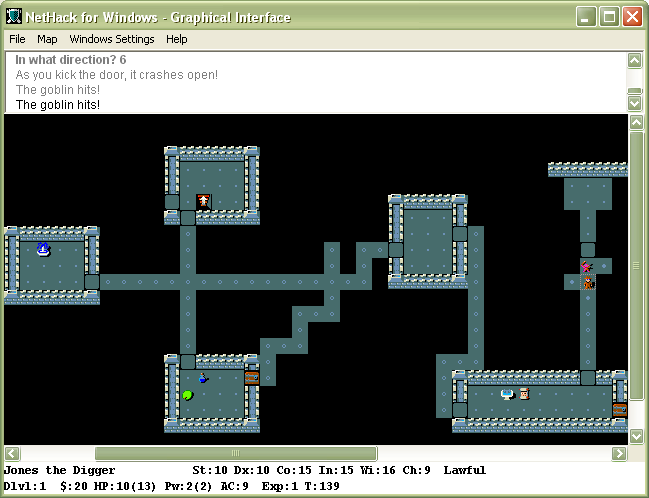

Computer role-playing games (CRPGs), like their cousin, the strategy game, are also another genre derived from pen-and-paper games. Role-playing games comprise an interestingly diverse genre, ranging from simple arcade-style games, such as the [Diablo](https://en.wikipedia.org/wiki/Diablo_(series)) series, to ponderous graphical adventure style games, such as [Anachronox](https://en.wikipedia.org/wiki/Anachronox). The two things that almost all role-playing games have in common are as follows:

电脑角色扮演游戏（CRPG）和它的表亲策略游戏一样，也是从纸笔游戏中衍生出来的另一种游戏类型。角色扮演游戏的类型多种多样，从简单的街机风格游戏（如[《暗黑破坏神》](https://en.wikipedia.org/wiki/Diablo_(series))系列）到复杂的图形冒险风格游戏（如[《源毒》](https://en.wikipedia.org/wiki/Anachronox)），不一而足。几乎所有角色扮演游戏都有以下两个共同点：

* Configurable player-characters that improve with experience\
可配置的玩家角色，随着经验的增加而不断改进
* Strong storylines\
强烈的故事情节

For example, it could be argued that the arcade game [Gauntlet](https://en.wikipedia.org/wiki/Gauntlet_(1985_video_game)) and the role-playing game [Diablo](https://en.wikipedia.org/wiki/Diablo_(series)) would be markedly more similar if [Diablo](https://en.wikipedia.org/wiki/Diablo_(series)) did not include the capability to configure the player's character. Similarly, [Anachronox](https://en.wikipedia.org/wiki/Anachronox) would be considered an arcade-adventure if the main character's abilities were static throughout the game. Consequently, this chapter will focus on discussing the elements of role-playing games that distinguish them from other genres.

例如，如果[《暗黑破坏神》](https://en.wikipedia.org/wiki/Diablo_(series))不包括配置玩家角色的功能，那么可以说街机游戏[《圣铠传说》](https://en.wikipedia.org/wiki/Gauntlet_(1985_video_game))和角色扮演游戏[《暗黑破坏神》](https://en.wikipedia.org/wiki/Diablo_(series))就明显更加相似。同样，如果主角的能力在整个游戏中一成不变，[《源毒》](https://en.wikipedia.org/wiki/Anachronox)也会被视为街机冒险游戏。因此，本章将重点讨论角色扮演游戏区别于其他类型游戏的要素。

For some players, the single most important part of the game (at least thus far in the development of CRPGs) is the story. In [Swords and Circuitry](https://www.amazon.com/Swords-Circuitry-Designers-Role-Playing-Development/dp/0761532994) (Premier Press), Neal and Jana Hallford describe several types of computer role-player. Each of these player types looks for something different out of their role-playing experience. Hallford names the "story-chaser" as one of the primary player types. There are several other player types mentioned in [Swords and Circuitry](https://www.amazon.com/Swords-Circuitry-Designers-Role-Playing-Development/dp/0761532994), but the area of CRPGs where the most potential for questions remains is the domain of the story-chaser. The story-chaser is primarily interested in progressing the story. For her, the game is merely a vehicle for the story, and every action and interaction is intended to progress the story line. The player steps into the story, and becomes a very real part of it. Usually, this involves the player becoming the central character in the story, with all the story events revolving around her.

对一些玩家来说，游戏中最重要的部分（至少在 CRPG 发展至今的过程中）就是故事。在[《剑与电》](https://book.douban.com/subject/2690975/)（Premier 出版社）一书中，尼尔和雅娜·霍尔福德描述了几种类型的电脑角色扮演者。每种类型的玩家都希望从角色扮演游戏中获得不同的体验。霍尔福德将“故事追逐者”列为主要玩家类型之一。[《剑与电》](https://book.douban.com/subject/2690975/)中还提到了其他几种玩家类型，但 CRPG 中最有可能出现问题的领域是“故事追逐者”的领域。追逐故事的玩家主要关注的是故事的进展。对她来说，游戏只是故事的载体，每一个动作和互动都是为了推动故事情节的发展。玩家走进故事，成为故事中非常真实的一部分。通常情况下，玩家会成为故事的中心人物，所有的故事事件都围绕着她展开。

This is where the role-playing part of the game comes in. The player has to be able to empathize with her character in order to feel as if she is that character, rather than an all-seeing goddess directing the hapless avatar according to her whims. That is, the player shouldn't feel as if she's playing [The Sims](https://en.wikipedia.org/wiki/The_Sims).

这就是游戏的角色扮演部分。玩家必须能够与自己的角色产生共鸣，才能感觉到自己就是那个角色，而不是一个全知全能的女神，按照自己的喜怒哀乐指挥着不幸的化身。也就是说，玩家不应该觉得自己是在玩[《模拟人生》](https://en.wikipedia.org/wiki/The_Sims)。

Another type of player mentioned in [Swords and Circuitry](https://www.amazon.com/Swords-Circuitry-Designers-Role-Playing-Development/dp/0761532994) is the character-advancement fanatic. This class of player isn't so much interested in the story, except where it is applicable to developing the player's avatar. We will also be discussing some issues pertaining to this player type in this chapter.

[《剑与电》](https://book.douban.com/subject/2690975/)中提到的另一种玩家类型是角色升级狂热者。这类玩家对故事并不太感兴趣，除非故事适用于玩家化身的发展。在本章中，我们还将讨论与这类玩家相关的一些问题。

Covering the entirety of role-playing games in a single chapter of a book such as this would be a futile task, especially when the job is handled much better elsewhere, such as the aforementioned [Swords and Circuitry](https://www.amazon.com/Swords-Circuitry-Designers-Role-Playing-Development/dp/0761532994). Therefore, in a similar vein to the other genre-specific chapters in this book, we will focus on what we view to be the most underserved areas of CRPG design.

要在一本书的一个章节中涵盖整个角色扮演游戏将是徒劳的，尤其是当这项工作在其他地方（如前面提到的[《剑与电》](https://book.douban.com/subject/2690975/)得到更好的处理时。因此，与本书中其他针对特定类型的章节类似，我们将把重点放在我们认为CRPG设计中最欠缺的领域。

# The Common Elements of Role-Playing Games 角色扮演游戏的共同要素

Because of the unique nature of CRPGs, there are two main elements that are key to creating a successful game. The first, and most important, of these features is the story. The second feature is the character development arc.

由于角色扮演游戏的独特性，有两大要素是制作一款成功游戏的关键。第一个，也是最重要的一个要素就是故事。第二个特点是角色发展弧线。

Of course, there are also secondary features that are implied by the inclusion of these primary features. For example, adventuring and exploring are a big part of most CRPGs, as is combat. However, in our opinion, these are secondary features simply because they are a means to an end: In order for the story to progress and the characters to develop, they have to have something to do. Hence, adventure, exploration, and combat are the mechanisms by which the two primary elements are expressed. This is the state of the art now. In the future, we may get true AI with dynamic story generators and the like. But for the time being, we, as game designers, will just have to wing it with the smoke and mirrors of scripted stories.

当然，在包含这些主要特征的同时，还隐含着一些次要特征。例如，冒险和探索是大多数 CRPG 的重要组成部分，战斗也是如此。不过，在我们看来，这些都是次要功能，因为它们只是达到目的的一种手段：为了让故事情节得以推进，让角色得以发展，他们必须有事可做。因此，冒险、探索和战斗是表现这两个主要元素的机制。这就是目前的技术水平。未来，我们可能会通过动态故事生成器等技术获得真正的人工智能。但就目前而言，作为游戏设计者，我们只能通过脚本故事的烟雾和镜像来实现。

CRPGs are, generally, based strongly around a story. There are certain exceptions to this. For example, the Rogue-like games—such as [Nethack](https://en.wikipedia.org/wiki/NetHack), shown in Figure 11.1—are based primarily around character development. In the case of [Nethack](https://en.wikipedia.org/wiki/NetHack), the story, such as it is, is randomly generated at the beginning of the game, and is solely used as an excuse to persuade the player to explore 20+ layers of dungeon.

一般来说，CRPG 都是以故事为基础的。但也有一些例外。例如，类Rogue游戏（如图 11.1 所示的[《迷宫骇客》](https://en.wikipedia.org/wiki/NetHack)主要以角色发展为基础。在[《迷宫骇客》](https://en.wikipedia.org/wiki/NetHack)中，故事是在游戏开始时随机生成的，只是用来作为说服玩家探索 20 多层地牢的借口。


译者注：有的媒体把Rogue-like音译成肉鸽类。


Figure 11.1. Nethack (Windows user interface shown). 图 11.1. 《迷宫骇客》（所示为 Windows 用户界面）。 

Although the story may be suspect, the character development and adventuring, exploration, and combat elements of the game are not. [Nethack](https://en.wikipedia.org/wiki/NetHack) offers an amazingly rich player experience, easily rivaling most of today's CRPGs. [Nethack](https://en.wikipedia.org/wiki/NetHack)'s basic game mechanic has been applied successfully to other products. For example, the original [Diablo](https://en.wikipedia.org/wiki/Diablo_(series)) from Blizzard owed more than a little of its success to the [Nethack](https://en.wikipedia.org/wiki/NetHack) design. In effect, [Diablo](https://en.wikipedia.org/wiki/Diablo_(series)) was a much simplified and extremely pretty version of [Nethack](https://en.wikipedia.org/wiki/NetHack).

尽管故事情节令人怀疑，但游戏中的角色发展和冒险、探索及战斗元素却并不令人怀疑。[《迷宫骇客》](https://en.wikipedia.org/wiki/NetHack)为玩家提供了令人惊叹的丰富体验，可以轻松与当今大多数 CRPG 相媲美。[《迷宫骇客》](https://en.wikipedia.org/wiki/NetHack)的基本游戏机制已成功应用于其他产品。例如，暴雪公司最初推出的[《暗黑破坏神》](https://en.wikipedia.org/wiki/Diablo_(series))的成功就与[《迷宫骇客》](https://en.wikipedia.org/wiki/NetHack)的设计不无关系。实际上，[《暗黑破坏神》](https://en.wikipedia.org/wiki/Diablo_(series))是[《迷宫骇客》](https://en.wikipedia.org/wiki/NetHack)）的简化版，而且非常漂亮。

## Themes 主题

The theme of a role-playing game can usually be boiled down to one simple statement: "Only YOU can save the world!"

角色扮演游戏的主题通常可以归结为一句话：“只有你能拯救世界！”

Generally, the whole raison-d'être behind a CRPG is to allow the player to experience a pivotal role in world-shattering events that he would ordinarily never see. Of course, usually the exposition of these events is not so blatant as the statement in the previous paragraph—at least not outside the realms of satire.

一般来说，CRPG 背后存在的全部理由就是让玩家在通常情况下看不到的震惊世界的事件中扮演关键角色。当然，通常情况下，对这些事件的描述不会像上一段中所说的那样明目张胆——至少在讽刺领域之外不是这样。


译者注：最后一句话“至少在讽刺领域之外不是这样”的意思是，游戏通常不会以一种非常直接或明显的方式呈现这些震撼世界的事件，除非是在讽刺类型的游戏中。讽刺类型的游戏可能会故意采用夸张或直白的方式来表达事件，以达到讽刺的效果。而其他类型的CRPG则更倾向于以一种更为微妙或艺术性的方式来叙述这些事件，让玩家沉浸其中，而不是直接告诉玩家发生了什么。


However, we find it slightly disturbing that in almost all the CRPGs that we have examined, the ultimate theme has been, "Only YOU can save the universe/world/city/tribe/whatever." In fact, we can only think of one recent game where the aim has not been to save the world, and that is [Planescape: Torment](https://en.wikipedia.org/wiki/Planescape:_Torment).

然而，我们发现，在我们研究过的几乎所有 CRPG 游戏中，最终的主题都是“只有你能拯救宇宙/世界/城市/部落/等等”，这让我们略感不安。事实上，我们只能想到最近的一款游戏不是以拯救世界为目的，那就是[《异域镇魂曲》](https://en.wikipedia.org/wiki/Planescape:_Torment)。

Surely there are some other themes out there. There must be plenty of worthwhile quests that don't culminate in the hero saving the world. In fact, why is it necessary for the hero to save anything? This is why [Planescape: Torment](https://en.wikipedia.org/wiki/Planescape:_Torment) was a breath of fresh air for the CRPG genre. Unfortunately, this doesn't seem to have been taken up by the rest of the CRPG industry. Even Bioware, the developers of [Planescape: Torment](https://en.wikipedia.org/wiki/Planescape:_Torment), resorted to the tried-and-trusted "save the world"-type storyline.

肯定还有其他主题。一定有很多有价值的任务并不以英雄拯救世界为最终目的。事实上，英雄又何必拯救什么呢？这就是为什么[《异域镇魂曲》](https://en.wikipedia.org/wiki/Planescape:_Torment)为 CRPG 类型带来了一股新鲜空气。遗憾的是，CRPG 行业的其他厂商似乎并没有意识到这一点。就连[《异域镇魂曲》](https://en.wikipedia.org/wiki/Planescape:_Torment)的开发商 Bioware 也采用了屡试不爽的“拯救世界”式故事情节。

Here are some alternatives to the "save the world" storyline:

下面是一些“拯救世界”故事情节的替代方案：

* Find and punish the person responsible for a loved one's murder ([Baldur's Gate](https://en.wikipedia.org/wiki/Baldur%27s_Gate)).\
找到并惩罚杀害亲人的凶手（[《博德之门》](https://en.wikipedia.org/wiki/Baldur%27s_Gate)）。
* Learn the secret behind your hidden parentage (Star Wars).\
了解隐藏在你父母背后的秘密（《星球大战》）。
* Rescue the kidnapped princess (Mario).\
营救被绑架的公主（马里奥）。
* Find and reassemble the long-lost pieces of the magic thingy ([Nox](https://en.wikipedia.org/wiki/Nox_(video_game))).\
找到并重新组装失落已久的魔法碎片（[《救世传说》](https://en.wikipedia.org/wiki/Nox_(video_game))）。
* Destroy the dangerous object (Lord of the Rings).\
摧毁危险物品（魔戒）。
* Kill the marauding monster (Beowulf).\
杀死掠夺的怪物（《贝奥武夫》）。
* Transport the valuable thingy past the people trying to seize it (Mad Max).\
将贵重物品运过试图夺取它的人（《疯狂的麦克斯》）。
* Try and get back home ([Nox](https://en.wikipedia.org/wiki/Nox_(video_game))).\
尝试回家（[《救世传说》](https://en.wikipedia.org/wiki/Nox_(video_game))）。

Note that although many of the preceding examples did end up with the main character saving the world, it was not (in most cases) the main thrust of the story—more an accidental side effect.

注意，虽然前面的许多例子最终都以主角拯救世界而告终，但（在大多数情况下）这并不是故事的主旨——更多的是意外的副作用。

When you design your role-playing game, try not to use the "save the world" storyline. However, if you do decide to stick with it, at the very least don't make it obvious to the player—at least, not at first. Of course, asking you to eschew the tried and trusted (and easy to sell) classic storyline is probably a bit too much to ask, really, but at least consider the possibility that "saving the world" doesn't have to be the ultimate goal of your game. Consider the success that [Planescape: Torment](https://en.wikipedia.org/wiki/Planescape:_Torment) achieved, critically if not commercially.

在设计角色扮演游戏时，尽量不要使用“拯救世界”的故事情节。但是，如果你决定坚持使用它，至少不要让玩家明显地感觉到——至少一开始不要。当然，要求你放弃久经考验、值得信赖（而且容易销售）的经典故事情节可能有点过分，但至少要考虑一下“拯救世界”不一定是游戏最终目标的可能性。想想[《异域镇魂曲》](https://en.wikipedia.org/wiki/Planescape:_Torment)所取得的成功，即使不是商业上的成功，也是评论界的成功。

## Setting 设定

To the casual observer, CRPGs would seem to have two main settings: Tolkien-esque fantasy or sci-fi. This is not far from the truth. However, this is not necessarily as much as a disadvantage as it first appears. The fields of fantasy and sci-fi, respectively, are extremely popular genres. Witness the number of successful sci-fi and fantasy films. Star Wars remains a classic space opera. Lord of the Rings became an instant classic both in book form and in the cinema. One of the reasons for the success of these (and many other works) is the enduring appeal of fantasy and sci-fi. As kids, we all dreamt of being in a fantastic world peopled by magical creatures. Our folklore and legend often speaks of supernatural creatures and the magic of faeries. Consequently, it's a natural assumption that our tendencies toward role-playing would also involve the fantastic and unreal.

对于普通观察者来说，CRPG 游戏似乎有两种主要背景：托尔金式奇幻或科幻。这与事实相差无几。然而，这并不一定像初看起来那么不利。奇幻和科幻分别是非常受欢迎的类型。科幻和奇幻电影的成功数量有目共睹。《星球大战》仍然是一部经典的太空歌剧。《指环王》在书籍和电影两方面都瞬间成为经典。这些作品（以及许多其他作品）取得成功的原因之一就是奇幻和科幻的持久魅力。孩提时代，我们都曾梦想过置身于一个充满神奇生物的梦幻世界。我们的民间传说经常提到超自然生物和精灵魔法。因此，我们的角色扮演倾向自然也会涉及奇幻和虚幻。

Far from being a straitjacket, the reliance of CRPGs on sci-fi and fantasy settings seems to be a logical choice based on both the nature of the game and the nature of the target audience for those games. We have often wondered about the feasibility of a role-playing game set in the modern-day real world. Without setting it in a fantastic environment, such as the world of 007, it would be difficult to generate player interest in a game that promises a role-playing experience similar to their own life. Generally, games-playing—particularly computer games-playing—is a form of escapism. The player wants to avoid the drudgery of everyday life and enjoy herself in another place entirely. In the case of CRPGs, why would a player choose a role in which she found herself emulating her own real life?

从游戏的性质和目标受众的性质来看，CRPG 依赖科幻和奇幻背景似乎并不是一种束缚，而是一种合乎逻辑的选择。我们经常在想，以现代真实世界为背景的角色扮演游戏是否可行？如果不把游戏设置在一个梦幻般的环境中，比如 007 的世界，就很难引起玩家对游戏的兴趣，因为游戏承诺的角色扮演体验与他们自己的生活相似。一般来说，玩游戏——尤其是玩电脑游戏——是一种逃避现实的方式。玩家希望避开日常生活中的琐事，在另一个完全不同的地方尽情享受。就 CRPG 而言，为什么玩家会选择一个自己觉得在模仿自己现实生活的角色呢？

Consequently, CRPGs attempt to take the player as far away from real life as possible, while still maintaining a consistent world. The easiest—and most logical—means to do this is to set the game in the future or in a mythical setting.

因此，CRPG 试图让玩家尽可能地远离现实生活，同时仍然保持一个连贯的世界。要做到这一点，最简单也是最合理的方法就是将游戏设定在未来或神话背景中。

This is not to say that you must choose only a sci-fi or fantasy setting for your CRPG. For example, there are plenty of real-world activities that only a few individuals get to experience. One can easily imagine a CRPG based around the progression from rookie to veteran of an L.A. street cop ([Sierra](https://en.wikipedia.org/wiki/Sierra_Entertainment)'s [Police Quest](https://en.wikipedia.org/wiki/Police_Quest) series do not count—they were pure adventure games). There are plenty of other similar professions that could (and should) be effectively given the CRPG treatment. However, the overwhelming majority of CRPGs are firmly entrenched in either the sci-fi or fantasy camp.

这并不是说你的 CRPG 必须只选择科幻或奇幻背景。例如，现实世界中有很多只有少数人才能体验到的活动。我们可以很容易地想象出一款以洛杉矶街头警察从菜鸟到老手的成长过程为背景的 CRPG（[雪乐山](https://en.wikipedia.org/wiki/Sierra_Entertainment) 的[《警察故事》](https://en.wikipedia.org/wiki/Police_Quest)系列不算，它们是纯粹的冒险游戏）。类似的职业还有很多，它们都可以（也应该）被有效地运用到 CRPG 中。然而，绝大多数 CRPG 都牢牢扎根于科幻或奇幻阵营。

Commonly, CRPGs pride themselves on the inordinate length of time required to complete them. It's not uncommon to see advertisements for CRPGs boasting "over 120 hours of gameplay." That's all well and good, but how many people—outside of a relatively small hardcore contingent—have both the time and the disposable income to invest in such a marathon game-playing session? Of course, usually the game experience is broken down into a number of serialized episodes (see Chapter 4, "Storytelling and Narrative") in order to make the game more manageable; but even with this concession, there are few players who are prepared to commit that much time to what is essentially a frivolous activity.

通常，CRPG 以完成游戏所需的超长时间为傲。在 CRPG 的广告中，“游戏时间超过 120 小时 ”的标语屡见不鲜。这一切都很好，但除了相对较少的铁杆玩家之外，有多少人有时间和可支配收入投入到如此马拉松式的游戏中呢？当然，为了使游戏更易于管理，游戏体验通常会被分解成若干个连续的情节（见第 4 章 “讲故事和叙事”）；但即使做出了这样的让步，也很少有玩家愿意投入这么多时间来进行本质上是无聊的活动。

Notwithstanding the inherent problems with games of this length, we must also consider the difficulty of creating a story compelling enough to keep the player intrigued for this length of time. The most important part of the story is the opening. If you manage to hook the player with a good opening, then the chances are you've got her for the rest of the game. If your opening is not engaging, then it doesn't matter how compelling the rest of the story is—you will have lost a large percentage of your audience.

So, given that CRPGs seem to be fixated around the aim of saving the world, the opening to the story is even more crucial. The player is likely to be starting the game with the preconception that his quest is to save the world, so why bother telling him? Lead him astray and confound his expectations. Above all, don't tell him straight out that his quest is to save the world! Numerous alternative introductions to a game's story are more effective, as we'll see in the examples that follow.

Opening a story is one of the trickiest parts of the entire process of story-writing. The balance between exposition and mystery has to be just right in order to induce the largest percentage of players to probe further. Too much mystery, and the player will have no reason to investigate further. He won't know what he's supposed to be doing, or why. And generally, he will have no impetus or desire to find out.

It's a similar situation if your story has too much initial exposition, or worse, badly delivered exposition. Telling the player too much about his initial situation can cause an initial reaction of "So what?". Let's examine some examples of opening stories in CRPGs, and analyze them based on these criteria.

### Nox

His name is Jack, an auto mechanic who lives in a trailer park in south central Florida. An unlikely hero, but that's what he becomes when a cosmic accident plucks him out of his easy chair and drops him on Nox, a world of magic, monsters, and an evil sorceress named Hecubah. All he wants is to go home, but to get back to Earth, he'll have to save the planet he landed on.

The opening movie for this game shows the sorceress, Hecubah, performing a ritual to retrieve a magical orb. As she does this, we can see that the orb is currently situated on top of a malfunctioning television belonging to the hero, Jack. As he hits the television, the orb starts to glow. Jack picks it up and is sucked into Hecubah's world, Nox, landing on a flying ship piloted by a mysterious Captain.

Humor is used well here. First, there is the clear contrast between Hecubah and the trailer-trash existence of Jack; second, during Hecubah's ritual, one of the candles goes out. She relights the candle, muttering to herself that she will kill all the candle-makers when she rules the world, and then recites the spell to herself in a normal voice, in order to work out how far she had gotten. The contrast between the overly dramatic spell ritual, and her matter-of-fact megalomaniacal comments are a good source of humor.

The story begins with our hero stranded in a strange world, wanting to return home. And initially, this is all the player knows. As we progress into the first few minutes of the game, we begin to discover the scope of the tasks required to allow Jack to return home. The emphasis here is not that Jack "must save the world," merely that "saving the world" is the only chance he has of getting home. Home is a concept that we are all familiar with, so this problem resonates well with the player. It's easy to empathize with Jack, and empathy is a good player hook. The player can relate to Jack—he is not some muscle-bound superhero or supreme wizard. He is just a normal guy who wants to get home.

### Anachronox

The first artifacts were found about three hundred years ago. Left by some long-dead alien race, strange mysterious devices were found all over the galaxy. Dubbed "MysTech" (short for Mysterium Technology), some of these ancient machines healed, some were weapons, and some have never been fully understood.

…

Sylvester "Sly" Boots sat in Rowdy's, a seedy bar on the seediest street in a section of Anachronox called the Bricks. After surviving an attack of a group of henchmen, a hairy old man admired Boots' handiwork and asked for his help. Soon Sly was joined by his lackey robot, an old flame turned mercenary, his holographic secretary, and a renegade scientist on a journey across space, across the dimensions, and beyond. Someone is causing the universe to folding in on itself, destroying all existence as we know it! And this group of people are the only ones that believe it is happening, and the only ones that can do something about it….

The opening story for Anachronox gives a little background on the world that the player finds himself in. It portrays human civilization as having advanced too far, too fast, by making use of advanced technology left by a long dead race. Now, the dregs of humanity are scattered across the universe. Sylvester "Sly" Boots is one of these dregs. After being thrown through his office window for outstanding debts to the local crime-lord, he desperately needs a source of money.

This is how the game opens. There are no grandiose quests to undertake, and the player is not told that he has to "save the world." Instead, the player's task is to find a job for the hero, so he can make some money. Assuming that the background story, involving MysTech and the bizarre world in which Sly is living, intrigues the player sufficiently, then this is a good hook. Like Jack from Nox, Sly is a just a normal guy who has had a bit of bad luck. Again, this kind of character is easy for a player to empathize with. His obvious imperfections mirror our own, allowing the player to relate to the character more easily.

### Arcanum: Of Steamworks and Magick Obscura

The steam-powered airship you are traveling on suddenly comes under attack from two mysterious airplanes. Stumbling through the wreckage at the crash site, you come across a dying gnome. He gives you a ring and implores you to "find the boy" and "save the world."

Although Arcanum is a fairly good example of a CRPG, the opening story breaks all the rules of engagement that we have discussed so far. The player is given no real impetus to perform the gnome's wishes, and after all, why should he? What if he does not want to role-play a world savior from the get-go? This opening stretches credibility, because it is unlikely that such a situation would occur.

Of course, this is a subjective view, but in our opinion, it would probably have been better to ease the player into the story with a little more subtlety. There is nothing inherently wrong with requiring the player to use a magic ring to save the world, but there is no reason why the game should reveal this to the player immediately. A little mystery and intrigue would go a long way in making the opening to this game more appealing. It may have been a better opening if instead of immediately revealing the overall quest to the player, it had been unfolded in a more piecemeal form. For example, the dying gnome could have asked for help to find "his boy," implying that his son was missing in the crash. This would have led the player to search for a young boy in the wreckage site. The player may then have found the (wrong) boy and returned to the gnome, who had by this time expired. This now leaves the player with an interesting dilemma: what to do with the boy he has rescued, who is now crying for his mommy and wants to go home.

Consider an analogous situation: Which of these two examples would be the better opener for a game?

You enter the inn after a tiring day's travel. Immediately, an old man runs up to you. "You have to help us! It's nearly sunset and the vampire in the castle will kill my granddaughter tonight."

You enter the inn after a tiring day's travel. The room silences as you enter, and all eyes turn toward you. You approach the bar, and the inn's customers return to nursing their drinks, resuming their muted conversation. In a dark corner, you notice an old man clawing and tugging and the robes of an affluent-looking merchant. You can overhear the merchant saying, "You sold it fair and square. If you don't have the money, you can't have it back. Get him away from me, Silas!" The merchant's companion shoves the old man away and stands over him menacingly.

The old man collapses in a heap in the corner and sobs to himself.

If you approach the old man, he avoids you. Asking the other bar customers what the problem is gets you nothing but icy stares or uncouth insults. Finally you ask the barman what's going on. "I ain't talkin' about it. It's bad luck, see? Just don't go out that door after dark if you wanna stay safe. I've got a nice room I can offer you for just 80 ducats…. Yeah, it may be expensive, but it's that or the outside, and you don't want that."

You approach the old man with and ask him what is wrong. He seems nervous, his eyes staring wildly. "Could you spare 20 ducats to keep an old man alive? I sold my cross, I'm stupid, I wasn't thinking. I don't want him to get me. Please, sire? Save an old man!"

At this point, the player can probably figure out that there is something strange going on. Especially if they have knowledge from elsewhere in a game that the prices are greatly inflated for the room and the cross. Buying the cross for the man will cause him to become more friendly and talkative, and he'll start to tell the player snippets about the "thing on the hill." At this point, the player will be able to talk to some more of the customers. (After they see the player buy and handle the cross, they'll know that the player is not a vampire.) However, they won't talk openly due to fear and superstition, but the player will get hints that there is a vampire in the castle on the hill, and that he takes a young girl from the town once a month. The customers may also hint that there are untold riches and treasures secreted in the vampire's castle (and it may or may not be true—they may just be trying to entice the player to kill the vampire).

In terms of the quest, there is little or no difference between the two methods of exposition. However, the latter example is more believable and certainly more engaging than the former full disclosure. It's okay to make the player work a little to find out what is going on. If done well, it only serves to draw the player further into the game world.

### Planescape: Torment

You awaken, frigid and confused. Scanning the room, all you see are stone tables like the one you are lying on and a sign that reads "The Mortuary". You aren't dead, so why are you here and, more importantly, who are you? Your thoughts are interrupted when a floating skull approaches you and starts talking! He informs you that you had just died again. What does he mean, again?

Planescape: Torment is fairly unique in the realm of CRPGs because of its focus on the main character. The opening of the game is a complete mystery to the player. After a short cut-scene showing snippets of a woman and some strange supernatural entities, the player wakes up to find himself lying on a mortuary slab, accompanied by a weird talking skull.

This opening is a particularly good example of minimizing exposition and maximizing mystery. From the opening, the player can surmise that his avatar once had a normal life, with a love, and that something strange has happened to cause him to become a cursed immortal. This is an interesting dichotomy because of the inherent human fascination with mortality. Who wouldn't want to be an immortal, no matter what the price? This is the question that this game poses. During the game, the player discovers that sometimes the price of immortality is too much to pay, and the overall goal of the game is to undo the damage that caused the avatar to become immortal in the first place, thus allowing the avatar to finally die.

### Fallout

Our existence: a subterranean fallout shelter modified to house 1000 people indefinitely after a nuclear holocaust. It's been nearly 80 years, and we still don't have any idea what's out there. Sure we've sent out volunteer scouts, but none of them returned….

Now our water recycler has failed. Rationing has begun, but someone needs to leave the vault to get a replacement microchip for the water recycler and look for other survivors.

We drew straws. You drew the short one….

At the beginning of this game, the player finds his avatar locked outside of his vault, Vault 13. The immediate priority is survival. It's dangerous outside the vault, and there is no hope (or reason) to attempt to return without the water chip. Fortunately for the player, it looks like the water chip will be easy to obtain. Vault 15 is only a day or two away, and provided that he can survive that long, it should be a reasonably easy matter to obtain a new chip.

The approach that is taken by the Fallout story is to allow the player to continue on what seems like a simple quest, and then to throw in complications at the last minute: The water chip cannot be obtained from Vault 15. It stands in ruins, and the control room lies under tons of rock. This "false ending" approach is used more than once in Fallout. When the avatar does finally get hold of another water chip and returns to the vault, he comes to the realization that Vault 15 was attacked—and that due to his actions, he has now revealed the location of his home vault to the same elements that attacked Vault 15. The adventure continues, and the avatar is now tasked with destroying the forces that threaten his home vault.

The opening to this game is again intriguing. The theme of returning home is a common one used in CRPGs to involve the player, and it is used here to good effect. The final twist at the end of the game, once the player has achieved all of his goals, is that he has been changed so much by his experiences in the outside world, he cannot return to his home vault. This bittersweet irony is a very good example of excellent story-telling in a role-playing game.

## Interaction Model

The interaction model for CRPGs is comprised of three main segments: character management, navigation and control, and inventory.

Each of these segments represents an important interface to the game. Although they are generally handled separately, they must integrate seamlessly in order to maintain the players' immersion into the game.

### Character Management

The player needs the ability to manage her characters. Most CRPGs use a system based on an old paper RPG to handle their game mechanic, and so it is during character generation and maintenance that the "bare bones" of the system are so often visible.

Character attributes are usually generated in terms of die rolls and displayed in a numeric form. Often, if the player does not like what is rolled, there is a button provided for re-rolling the dice. Although it does vary from game to game, there is a stock set of attributes that most games use: Strength, Dexterity, Wisdom, Stamina, Intelligence, and Charisma. These are based on the original AD&D (Advanced Dungeons and Dragons) character statistics. All the basic character development decisions, and some in-game decisions, are based on tests against some combination of these. These tests are usually done via simulated die roll. For example consider the following hypothetical situation: Jonny Rock, the warrior, wants to smash down a door. He has a strength of 17, and the GM rules that he must roll three D6 (six-sided dice). If he rolls higher than his strength, he fails to break the door. If he rolls lower than his strength, then the door splinters to pieces.

Sometimes—for example, in the case of the Fallout series—secondary attributes are calculated from the primary set. For Fallout 2, the primary set of attributes includes Strength, Perception, Endurance, Charisma, Agility, Intelligence, and Luck. The secondary set of attributes include Hit points (calculated from strength and endurance), Armor Class (based on agility), and several other derivations. Fallout is a particularly good example of a well thought-out base rule-set. In addition to skills being limited only by the abilities of the character, it also has an intriguing set of "traits" available—extra abilities that can be developed, but that usually come with a disadvantage as well as an advantage.

The use of attribute sets such as these clearly has roots in pen-and-paper role-playing games. This is a sensible foundation for a CRPG, but in many cases it is not done justice. One of the major design influences on pen-and-paper RPG rules was that they had to be simple enough for a human game master to understand and apply quickly. Computers suffer from no such restriction, yet we still see CRPGs slavishly following the pen-and-paper rules to the letter, even to the point of destroying the atmosphere. Even acclaimed games such as Baldur's Gate have been known to flash the words "Saving Roll" onscreen if your character had a lucky escape in combat. The player does not need this information—she does not need to be reminded that she is playing a computer game based on AD&D rules. That's irrelevant information that serves no purpose in the game. Of course, the player should have access to the basic information, such as their attributes and skills, but exposing the inner mechanics of the game system in this way is unnecessary and counterproductive.

We see no reason why the player should be directly exposed to the die rolls that govern the underlying system. The Fallout series uses a percentage-based system, which is kept out of the player's way fairly well. Generally, the player does not need to be told that she failed her saving roll by 3%. That reminds the player that she is only playing a statistics game. However, the player does need to know why she failed and how badly she failed; otherwise, she will not know whether her character just cannot perform that particular act, or whether the character didn't quite get it that time, but maybe will the next time. After all, the player is one step removed from the character, and cannot know what the character would know. Chances are, a character would be aware of whether the task is hopeless, or whether it's just a particularly difficult one that will take a while. Character-based feedback is a good way to indicate this: "Darn! I really screwed that one up!" or "Whew! Nearly had it there," for example.

Of course, there are players—those who are primarily focused on character advancement—who want and need to see all the numeric data, as opposed to the story-chasers who find that all the numeric data spoils the fantasy. Both types of player like CRPGs, but for different reasons, and it's tricky to serve both groups. The ideal solution would be a game that played both ways—one mode that showed the "arithmetical guts" of the game, and one that reduced the numbers to a minimum and converted them to power bars and other display mechanisms, as discussed previously.

CRPGs are also unique in that they allow the player's avatar to learn new skills, and continue to develop them as they play. One of our pet peeves about the skill system comes into effect when it is coupled with the class system. In case you are unfamiliar with the class system, this is an arbitrary set of restrictions that prevent characters of a certain class from learning particular skills. Sometimes there is a justifiable reason for this, and sometimes there is not. Either way, it seems like a particularly heavy-handed way of enforcing a degree of balance in the game. Worse still, some of these restrictions seem to be arbitrary. For example, in the AD&D third edition rules, clerics can not use bladed or piercing weapons. Therefore, if the cleric was in a threatening situation where the only weapon available was a knife and magic was not an option, he would be defenseless. In reality, of course, we would expect to be able to pick up the knife and start slashing.

Not all role-playing games restrict the player to a class-based system of skills. A better method is to allow the player to attempt to learn as many skills as she wants and be restricted only by the time available to her, and her avatar's aptitude in that skill as based on her primary attributes. In these cases, it still makes sense for a character to specialize, especially if like skills are interrelated and unpracticed skills gradually decline. For example, learning the skill of "basic mechanics" would provide a solid basis for developing the "lock-picking" skill, whereas learning "basic gardening" would not.

In this way, a player doesn't run into arbitrary restrictions, and can choose whether to turn her character into a narrow-but-deep specialist, or a wide-but-shallow jack-of-all-trades. The most important thing to realize here is that it is not for the game designer to arbitrarily restrict those choices. Of course, some restrictions do make sense. For example, a lawful, good paladin should be restricted from performing evil acts. But again, this should not be an arbitrary "thou-shalt-not" restriction. Instead, there should be dire consequences for performing these actions, such as a loss of patronage and protection from the paladin's god, or worse. In other words, the player should still have the choice to act out of character, if he is willing to face the dire consequences.

Another problem with the skills system as currently used in CRPGs is that, in most cases, it has not been adapted well to the computer, and still has its roots firmly in the turn-based nature of the original pen-and-paper rules. For example, if we consider a character that has a 10% chance of picking a lock, then we can conceive of a situation where the player is repeatedly clicking on the "Pick Lock" button until he succeeds. This is dull and unnecessary, especially on a computer.

A better method would be to display a progress bar. The speed with which the task progresses depends on the character's skill in that area—that is, it progresses quickly if the character has a high skill level, slowly for a low skill level, or not at all if the task is too hard. If the player needed to interrupt the task because it was taking too long, then he should be able to. For example, the progress bar could flash red if there is a chance of being interrupted, such as if a character is within range of the player's avatar and stands a chance of detecting the activity. Give the character a small amount of time—based on their dexterity and intelligence—of stopping before the check, or no chance of avoiding the check if their combined dexterity and intelligence is too low. This approach would be more immersive, and would heighten the tension and immediacy of the game.

### Navigation and Control

The range of actions that a player can take in a CRPG is usually much greater than any other form of game. Consequently, there is a corresponding increase in the complexity of the interface. For PC titles, this is handled by a combined mouse/iconic interface (for the most part—some titles resort to keyboard only), and similarly console titles tend to duplicate the functionality of a mouse using analog controllers. See Chapter 6, "Creating the User Experience," for more information on user interface design. Much of the advice in that chapter is directly applicable to CRPGs.

### Inventory

The inventory system for CRPGs has been a perennial sticking point for most gamers. It seems that the perfect inventory system has not yet been designed.

The difficulty with designing a good inventory system is in handling the complexity of everyday objects in a manageable fashion. Certain assumptions have to be made. Of course, it is theoretically possible to simulate physically accurate representations of packing objects into a limited space, but that would be overkill, and possibly difficult to administer.

The classic solution chosen for inventory management is to divide the player's carrying capacity into an array of boxes. Each box can carry one type of item, and assuming an item is small enough, several items of the same type will be stored in the same box, up to some maximum limit. An example here would be gold. If every pile of gold a character picked up in Diablo II went into a separate box, then there would soon be no room left in the inventory for other items.

Usually item weight is used as a secondary constraint. It does not matter how many boxes the player has free; his character can only carry so many "magical lead weights of righteous indignation."

The reason that the inventory is so important is that the player usually spends a disproportionate amount of time micromanaging the contents. Often, this micro-management breaks a cardinal rule of human-computer interaction: Don't force the player to perform a menial task best handled by the computer. For example, consider the situation in Figure 11.2. The player has found a staff, and cannot put it in his inventory because he doesn't have enough free boxes in the right configuration. The staff takes up 1x4 boxes, and the biggest space he has available is 1x3. If he moves the apple in the top space, however, he will have a space of 1x4 and will be able to store the staff. The question is, is that fun for the player? Probably not, and it should be handled automatically. To make matters worse, consider the alternative situation where only a 4x1 (horizontal) space is available. Why can't the staff simply rotate by 90 degrees and fit in the 4x1 gap at the bottom? Most CRPGs that we have played cannot handle that simple concept. Thus, the importance of the inventory interface is paradoxical. It is important, but it shouldn't be. It should be the least intrusive part of the game interface.

Figure 11.2. An inventory problem.

graphics/11fig02.gif

Even more fundamentally, this inventory abstraction is 2D. That's not to say that 3D would be better, but the major disadvantage with it being 2D is that the model strictly enforces placement rules as if the object storage area really was a 2D construct. It's almost as if the designers of CRPGs have entirely forgotten that storage packs really do have a volume.

Worse still is the hypothetical situation shown in Figure 11.3. We're not aware of any games that do this, but it does show the arbitrary absurdity of this fundamental problem with inventory management in most CRPGs. In the figure, the player has a 5x1 staff to fit in a 4x4 inventory. There are 16 spaces available in the inventory, but the player still has no way to fit the staff in. In reality, of course we could cram the staff in—even if it stuck out of the top of our pack.

Figure 11.3. Another inventory problem.

graphics/11fig03.gif

This section highlights various problems with the currently accepted abstraction of inventories used in most CRPGs. It's not as if there is anything fundamentally wrong that cannot be fixed; it's just that most inventories don't go far enough and force unnatural restrictions on what the player could reasonably expect to carry (for example, in Nox there is a hard limit on how many items of a certain type you can carry—even if you have space for more). The other main problem with the inventory conven tion is that it forces the player to do a lot of micromanagement that is otherwise unnecessary and is certainly not fun. Players want to role-play, not pack for a vacation.

## Perspective

Originally, CRPGs were essentially top-down affairs, as shown earlier in Figure 11.2. The gradual improvements of graphics technology (aside from a few anomalous entries such as Ultima Underworld II, shown in Figure 11.4) meant that many CRPGs are now presented in isometric 3D, as shown in Figure 11.5.

Figure 11.4. Ultima Underworld II.

graphics/11fig05.gif

Figure 11.5. Wasteland.

graphics/11fig04.jpg

Since the advent of hardware-assisted 3D technology, there have been many more instances of 3D-accelerated CRPGs. Some of these have been fully first-person 3D, such as Elder Scrolls III: Morrowind (although it does also provide a third-person view, shown in Figure 11.6). More CRPGs, however, have stuck to the classic third-person isometric approach, such as Baldur's Gate: Dark Alliance on the PS2, or Neverwinter Nights (shown in Figure 11.7).

Figure 11.6. Elder Scrolls III: Morrowind.

graphics/11fig06.gif

Figure 11.7. Neverwinter Nights.

graphics/11fig07.gif

> **CRPG Worksheet CRPG 工作表**
> 
> When beginning the design of a CRPG, consider the following questions:
> 
> 在设计CRPG时，考虑下列问题：
> 
> 1. Which type of game are you going to create? Is it going to be heavy on story (as in Planescape:Torment), or will character advancement and combat be the main thrust (as in Nethack)?
> 2. If it is story based, then how are you going to structure the quests? One big overarching quest with mini side-quests, or a more free-form approach? This will have an impact on the difficulty of production and the feel of the game.
> 3. What is the setting for your game? Are you going for the standard sci-fi/fantasy fare, or are you using something else? Are you using a licensed work? Are you convinced that what you have is different, yet recognizable enough to be compelling?
> 4. How will your world function? What are the underlying rules for the way the world works? Are they self-consistent and logical? Are they based on a pre-existing system (as in Baldur's Gate)?
> 5. Is the player going to be given a group of avatars, or will he be responsible for a single avatar? Will his character be configurable (as in Arcanum), or will he be forced to take a pre-defined role (as in Anachronox)?
> 6. What will be the primary focus of your game? Will it be uncovering the story, improving the player's character, or combat and exploration? The majority of games attempt to cover all these bases equally, but some exceptional ones have focused more on one aspect, such as Anachronox and Diablo II. This affects the pace of your game.
> 7. Considering interactivity with non-player characters: Is your game intended to be short, but deep (as in Fallout) or sprawling, but shallow (as in Diablo II)? This has an impact on whether your player considers herself to be immersed in a world, or playing a story.
> 8. What will be the perspective used in your game? Will you use standard isometric 3D (as in Fallout) or will you use a fully 3D engine (as in Elder Scrolls III: Morrowind)? Will you use something else entirely?
> 9. Is your game going to include a magic system? How is this magic system going to be constructed? Will it be based on pre-existing concepts, familiar regimes (such as Law/Chaos/Good/Evil), or something completely new? Will it be internally self-consistent or not? How will it be balanced with nonmagic forces within the game?
> 10. How will you handle inventory management within the game?
> 11. And finally, will your player's character end up saving the world? Are you sure you want to do that? Can you think of anything slightly more original (as in Planescape: Torment)?