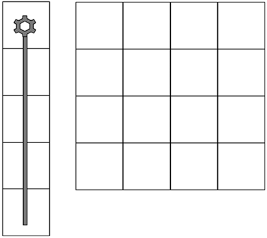
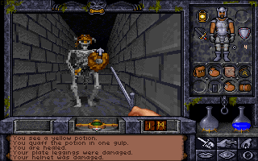
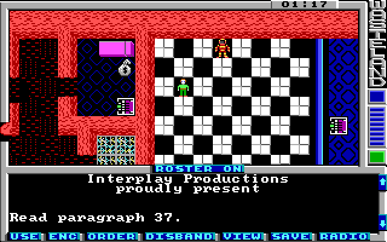
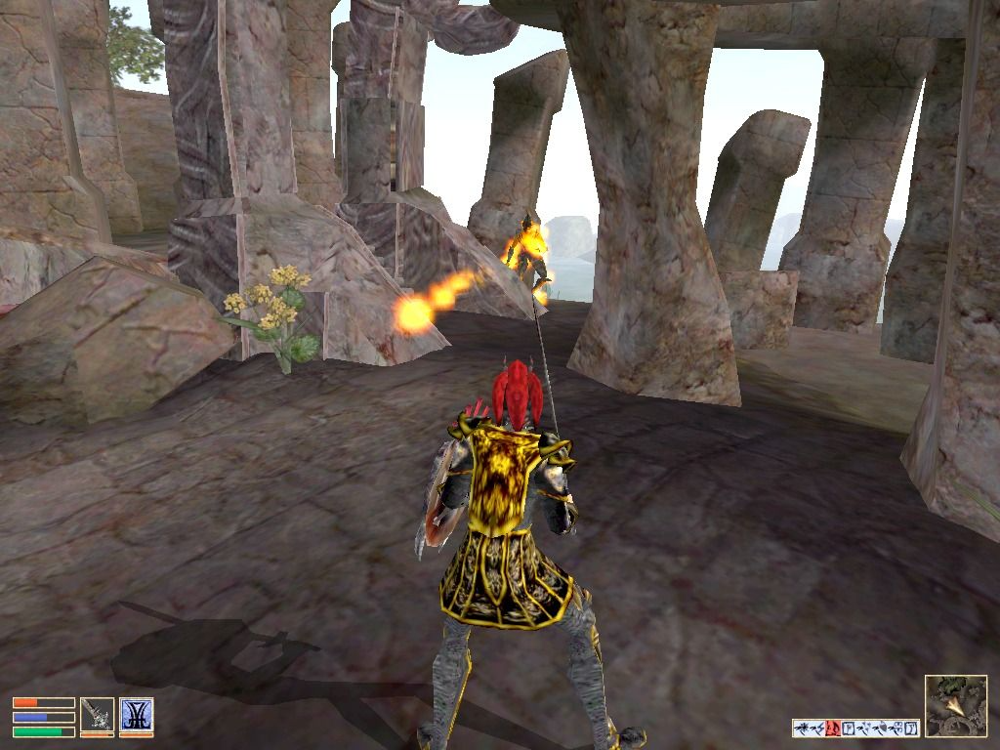
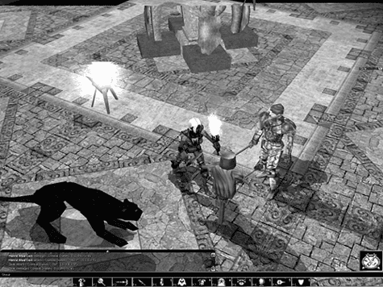

Computer role-playing games (CRPGs), like their cousin, the strategy game, are also another genre derived from pen-and-paper games. Role-playing games comprise an interestingly diverse genre, ranging from simple arcade-style games, such as the [Diablo](https://en.wikipedia.org/wiki/Diablo_(series)) series, to ponderous graphical adventure style games, such as [Anachronox](https://en.wikipedia.org/wiki/Anachronox). The two things that almost all role-playing games have in common are as follows:

电脑角色扮演游戏（CRPG）和它的表亲策略游戏一样，也是从纸笔游戏中衍生出来的另一种游戏类型。角色扮演游戏的类型多种多样，从简单的街机风格游戏（如[《暗黑破坏神》](https://en.wikipedia.org/wiki/Diablo_(series))系列）到复杂的图形冒险风格游戏（如[《源毒》](https://en.wikipedia.org/wiki/Anachronox)），不一而足。几乎所有角色扮演游戏都有以下两个共同点：

* Configurable player-characters that improve with experience\
可配置的玩家角色，随着经验的增加而不断改进

* Strong storylines\
强烈的故事情节

For example, it could be argued that the arcade game [Gauntlet](https://en.wikipedia.org/wiki/Gauntlet_(1985_video_game)) and the role-playing game [Diablo](https://en.wikipedia.org/wiki/Diablo_(series)) would be markedly more similar if [Diablo](https://en.wikipedia.org/wiki/Diablo_(series)) did not include the capability to configure the player's character. Similarly, [Anachronox](https://en.wikipedia.org/wiki/Anachronox) would be considered an arcade-adventure if the main character's abilities were static throughout the game. Consequently, this chapter will focus on discussing the elements of role-playing games that distinguish them from other genres.

例如，如果[《暗黑破坏神》](https://en.wikipedia.org/wiki/Diablo_(series))不包括配置玩家角色的功能，那么可以说街机游戏[《圣铠传说》](https://en.wikipedia.org/wiki/Gauntlet_(1985_video_game))和角色扮演游戏[《暗黑破坏神》](https://en.wikipedia.org/wiki/Diablo_(series))就明显更加相似。同样，如果主角的能力在整个游戏中一成不变，[《源毒》](https://en.wikipedia.org/wiki/Anachronox)也会被视为街机冒险游戏。因此，本章将重点讨论角色扮演游戏区别于其他类型游戏的要素。

For some players, the single most important part of the game (at least thus far in the development of CRPGs) is the story. In [Swords and Circuitry](https://www.amazon.com/Swords-Circuitry-Designers-Role-Playing-Development/dp/0761532994) (Premier Press), Neal and Jana Hallford describe several types of computer role-player. Each of these player types looks for something different out of their role-playing experience. Hallford names the "story-chaser" as one of the primary player types. There are several other player types mentioned in [Swords and Circuitry](https://www.amazon.com/Swords-Circuitry-Designers-Role-Playing-Development/dp/0761532994), but the area of CRPGs where the most potential for questions remains is the domain of the story-chaser. The story-chaser is primarily interested in progressing the story. For her, the game is merely a vehicle for the story, and every action and interaction is intended to progress the story line. The player steps into the story, and becomes a very real part of it. Usually, this involves the player becoming the central character in the story, with all the story events revolving around her.

对一些玩家来说，游戏中最重要的部分（至少在 CRPG 发展至今的过程中）就是故事。在[《剑与电》](https://book.douban.com/subject/2690975/)（Premier 出版社）一书中，尼尔和雅娜·霍尔福德描述了几种类型的电脑角色扮演者。每种类型的玩家都希望从角色扮演游戏中获得不同的体验。霍尔福德将“故事追逐者”列为主要玩家类型之一。[《剑与电》](https://book.douban.com/subject/2690975/)中还提到了其他几种玩家类型，但 CRPG 中最有可能出现问题的领域是“故事追逐者”的领域。追逐故事的玩家主要关注的是故事的进展。对她来说，游戏只是故事的载体，每一个动作和互动都是为了推动故事情节的发展。玩家走进故事，成为故事中非常真实的一部分。通常情况下，玩家会成为故事的中心人物，所有的故事事件都围绕着她展开。

This is where the role-playing part of the game comes in. The player has to be able to empathize with her character in order to feel as if she is that character, rather than an all-seeing goddess directing the hapless avatar according to her whims. That is, the player shouldn't feel as if she's playing [The Sims](https://en.wikipedia.org/wiki/The_Sims).

这就是游戏的角色扮演部分。玩家必须能够与自己的角色产生共鸣，才能感觉到自己就是那个角色，而不是一个全知全能的女神，按照自己的喜怒哀乐指挥着不幸的化身。也就是说，玩家不应该觉得自己是在玩[《模拟人生》](https://en.wikipedia.org/wiki/The_Sims)。

Another type of player mentioned in [Swords and Circuitry](https://www.amazon.com/Swords-Circuitry-Designers-Role-Playing-Development/dp/0761532994) is the character-advancement fanatic. This class of player isn't so much interested in the story, except where it is applicable to developing the player's avatar. We will also be discussing some issues pertaining to this player type in this chapter.

[《剑与电》](https://book.douban.com/subject/2690975/)中提到的另一种玩家类型是角色升级狂热者。这类玩家对故事并不太感兴趣，除非故事适用于玩家化身的发展。在本章中，我们还将讨论与这类玩家相关的一些问题。

Covering the entirety of role-playing games in a single chapter of a book such as this would be a futile task, especially when the job is handled much better elsewhere, such as the aforementioned [Swords and Circuitry](https://www.amazon.com/Swords-Circuitry-Designers-Role-Playing-Development/dp/0761532994). Therefore, in a similar vein to the other genre-specific chapters in this book, we will focus on what we view to be the most underserved areas of CRPG design.

要在一本书的一个章节中涵盖整个角色扮演游戏将是徒劳的，尤其是当这项工作在其他地方（如前面提到的[《剑与电》](https://book.douban.com/subject/2690975/)得到更好的处理时。因此，与本书中其他针对特定类型的章节类似，我们将把重点放在我们认为CRPG设计中最欠缺的领域。

# The Common Elements of Role-Playing Games 角色扮演游戏的共同要素

Because of the unique nature of CRPGs, there are two main elements that are key to creating a successful game. The first, and most important, of these features is the story. The second feature is the character development arc.

由于角色扮演游戏的独特性，有两大要素是制作一款成功游戏的关键。第一个，也是最重要的一个要素就是故事。第二个特点是角色发展弧线。

Of course, there are also secondary features that are implied by the inclusion of these primary features. For example, adventuring and exploring are a big part of most CRPGs, as is combat. However, in our opinion, these are secondary features simply because they are a means to an end: In order for the story to progress and the characters to develop, they have to have something to do. Hence, adventure, exploration, and combat are the mechanisms by which the two primary elements are expressed. This is the state of the art now. In the future, we may get true AI with dynamic story generators and the like. But for the time being, we, as game designers, will just have to wing it with the smoke and mirrors of scripted stories.

当然，在包含这些主要特征的同时，还隐含着一些次要特征。例如，冒险和探索是大多数 CRPG 的重要组成部分，战斗也是如此。不过，在我们看来，这些都是次要功能，因为它们只是达到目的的一种手段：为了让故事情节得以推进，让角色得以发展，他们必须有事可做。因此，冒险、探索和战斗是表现这两个主要元素的机制。这就是目前的技术水平。未来，我们可能会通过动态故事生成器等技术获得真正的人工智能。但就目前而言，作为游戏设计者，我们只能通过脚本故事的烟雾和镜像来实现。

CRPGs are, generally, based strongly around a story. There are certain exceptions to this. For example, the Rogue-like games—such as [Nethack](https://en.wikipedia.org/wiki/NetHack), shown in Figure 11.1—are based primarily around character development. In the case of [Nethack](https://en.wikipedia.org/wiki/NetHack), the story, such as it is, is randomly generated at the beginning of the game, and is solely used as an excuse to persuade the player to explore 20+ layers of dungeon.

一般来说，CRPG 都是以故事为基础的。但也有一些例外。例如，类Rogue游戏（如图 11.1 所示的[《迷宫骇客》](https://en.wikipedia.org/wiki/NetHack)主要以角色发展为基础。在[《迷宫骇客》](https://en.wikipedia.org/wiki/NetHack)中，故事是在游戏开始时随机生成的，只是用来作为说服玩家探索 20 多层地牢的借口。


译者注：有的媒体把Rogue-like音译成肉鸽类。


Figure 11.1. Nethack (Windows user interface shown). 图 11.1. 《迷宫骇客》（所示为 Windows 用户界面）。 

Although the story may be suspect, the character development and adventuring, exploration, and combat elements of the game are not. [Nethack](https://en.wikipedia.org/wiki/NetHack) offers an amazingly rich player experience, easily rivaling most of today's CRPGs. [Nethack](https://en.wikipedia.org/wiki/NetHack)'s basic game mechanic has been applied successfully to other products. For example, the original [Diablo](https://en.wikipedia.org/wiki/Diablo_(series)) from Blizzard owed more than a little of its success to the [Nethack](https://en.wikipedia.org/wiki/NetHack) design. In effect, [Diablo](https://en.wikipedia.org/wiki/Diablo_(series)) was a much simplified and extremely pretty version of [Nethack](https://en.wikipedia.org/wiki/NetHack).

尽管故事情节令人怀疑，但游戏中的角色发展和冒险、探索及战斗元素却并不令人怀疑。[《迷宫骇客》](https://en.wikipedia.org/wiki/NetHack)为玩家提供了令人惊叹的丰富体验，可以轻松与当今大多数 CRPG 相媲美。[《迷宫骇客》](https://en.wikipedia.org/wiki/NetHack)的基本游戏机制已成功应用于其他产品。例如，暴雪公司最初推出的[《暗黑破坏神》](https://en.wikipedia.org/wiki/Diablo_(series))的成功就与[《迷宫骇客》](https://en.wikipedia.org/wiki/NetHack)的设计不无关系。实际上，[《暗黑破坏神》](https://en.wikipedia.org/wiki/Diablo_(series))是[《迷宫骇客》](https://en.wikipedia.org/wiki/NetHack)）的简化版，而且非常漂亮。

## Themes 主题

The theme of a role-playing game can usually be boiled down to one simple statement: "Only YOU can save the world!"

角色扮演游戏的主题通常可以归结为一句话：“只有你能拯救世界！”

Generally, the whole raison-d'être behind a CRPG is to allow the player to experience a pivotal role in world-shattering events that he would ordinarily never see. Of course, usually the exposition of these events is not so blatant as the statement in the previous paragraph—at least not outside the realms of satire.

一般来说，CRPG 背后存在的全部理由就是让玩家在通常情况下看不到的震惊世界的事件中扮演关键角色。当然，通常情况下，对这些事件的描述不会像上一段中所说的那样明目张胆——至少在讽刺领域之外不是这样。


译者注：最后一句话“至少在讽刺领域之外不是这样”的意思是，游戏通常不会以一种非常直接或明显的方式呈现这些震撼世界的事件，除非是在讽刺类型的游戏中。讽刺类型的游戏可能会故意采用夸张或直白的方式来表达事件，以达到讽刺的效果。而其他类型的CRPG则更倾向于以一种更为微妙或艺术性的方式来叙述这些事件，让玩家沉浸其中，而不是直接告诉玩家发生了什么。


However, we find it slightly disturbing that in almost all the CRPGs that we have examined, the ultimate theme has been, "Only YOU can save the universe/world/city/tribe/whatever." In fact, we can only think of one recent game where the aim has not been to save the world, and that is [Planescape: Torment](https://en.wikipedia.org/wiki/Planescape:_Torment).

然而，我们发现，在我们研究过的几乎所有 CRPG 游戏中，最终的主题都是“只有你能拯救宇宙/世界/城市/部落/等等”，这让我们略感不安。事实上，我们只能想到最近的一款游戏不是以拯救世界为目的，那就是[《异域镇魂曲》](https://en.wikipedia.org/wiki/Planescape:_Torment)。

Surely there are some other themes out there. There must be plenty of worthwhile quests that don't culminate in the hero saving the world. In fact, why is it necessary for the hero to save anything? This is why [Planescape: Torment](https://en.wikipedia.org/wiki/Planescape:_Torment) was a breath of fresh air for the CRPG genre. Unfortunately, this doesn't seem to have been taken up by the rest of the CRPG industry. Even Bioware, the developers of [Planescape: Torment](https://en.wikipedia.org/wiki/Planescape:_Torment), resorted to the tried-and-trusted "save the world"-type storyline.

肯定还有其他主题。一定有很多有价值的任务并不以英雄拯救世界为最终目的。事实上，英雄又何必拯救什么呢？这就是为什么[《异域镇魂曲》](https://en.wikipedia.org/wiki/Planescape:_Torment)为 CRPG 类型带来了一股新鲜空气。遗憾的是，CRPG 行业的其他厂商似乎并没有意识到这一点。就连[《异域镇魂曲》](https://en.wikipedia.org/wiki/Planescape:_Torment)的开发商 Bioware 也采用了屡试不爽的“拯救世界”式故事情节。

Here are some alternatives to the "save the world" storyline:

下面是一些“拯救世界”故事情节的替代方案：

* Find and punish the person responsible for a loved one's murder ([Baldur's Gate](https://en.wikipedia.org/wiki/Baldur%27s_Gate)).\
找到并惩罚杀害亲人的凶手（[《博德之门》](https://en.wikipedia.org/wiki/Baldur%27s_Gate)）。

* Learn the secret behind your hidden parentage (Star Wars).\
了解隐藏在你父母背后的秘密（《星球大战》）。

* Rescue the kidnapped princess (Mario).\
营救被绑架的公主（马里奥）。

* Find and reassemble the long-lost pieces of the magic thingy ([Nox](https://en.wikipedia.org/wiki/Nox_(video_game))).\
找到并重新组装失落已久的魔法碎片（[《救世传说》](https://en.wikipedia.org/wiki/Nox_(video_game))）。

* Destroy the dangerous object (Lord of the Rings).\
摧毁危险物品（魔戒）。

* Kill the marauding monster (Beowulf).\
杀死掠夺的怪物（《贝奥武夫》）。

* Transport the valuable thingy past the people trying to seize it (Mad Max).\
将贵重物品运过试图夺取它的人（《疯狂的麦克斯》）。

* Try and get back home ([Nox](https://en.wikipedia.org/wiki/Nox_(video_game))).\
尝试回家（[《救世传说》](https://en.wikipedia.org/wiki/Nox_(video_game))）。

Note that although many of the preceding examples did end up with the main character saving the world, it was not (in most cases) the main thrust of the story—more an accidental side effect.

注意，虽然前面的许多例子最终都以主角拯救世界而告终，但（在大多数情况下）这并不是故事的主旨——更多的是意外的副作用。

When you design your role-playing game, try not to use the "save the world" storyline. However, if you do decide to stick with it, at the very least don't make it obvious to the player—at least, not at first. Of course, asking you to eschew the tried and trusted (and easy to sell) classic storyline is probably a bit too much to ask, really, but at least consider the possibility that "saving the world" doesn't have to be the ultimate goal of your game. Consider the success that [Planescape: Torment](https://en.wikipedia.org/wiki/Planescape:_Torment) achieved, critically if not commercially.

在设计角色扮演游戏时，尽量不要使用“拯救世界”的故事情节。但是，如果你决定坚持使用它，至少不要让玩家明显地感觉到——至少一开始不要。当然，要求你放弃久经考验、值得信赖（而且容易销售）的经典故事情节可能有点过分，但至少要考虑一下“拯救世界”不一定是游戏最终目标的可能性。想想[《异域镇魂曲》](https://en.wikipedia.org/wiki/Planescape:_Torment)所取得的成功，即使不是商业上的成功，也是评论界的成功。

## Setting 设定

To the casual observer, CRPGs would seem to have two main settings: Tolkien-esque fantasy or sci-fi. This is not far from the truth. However, this is not necessarily as much as a disadvantage as it first appears. The fields of fantasy and sci-fi, respectively, are extremely popular genres. Witness the number of successful sci-fi and fantasy films. Star Wars remains a classic space opera. Lord of the Rings became an instant classic both in book form and in the cinema. One of the reasons for the success of these (and many other works) is the enduring appeal of fantasy and sci-fi. As kids, we all dreamt of being in a fantastic world peopled by magical creatures. Our folklore and legend often speaks of supernatural creatures and the magic of faeries. Consequently, it's a natural assumption that our tendencies toward role-playing would also involve the fantastic and unreal.

对于普通观察者来说，CRPG 游戏似乎有两种主要背景：托尔金式奇幻或科幻。这与事实相差无几。然而，这并不一定像初看起来那么不利。奇幻和科幻分别是非常受欢迎的类型。科幻和奇幻电影的成功数量有目共睹。《星球大战》仍然是一部经典的太空歌剧。《指环王》在书籍和电影两方面都瞬间成为经典。这些作品（以及许多其他作品）取得成功的原因之一就是奇幻和科幻的持久魅力。孩提时代，我们都曾梦想过置身于一个充满神奇生物的梦幻世界。我们的民间传说经常提到超自然生物和精灵魔法。因此，我们的角色扮演倾向自然也会涉及奇幻和虚幻。

Far from being a straitjacket, the reliance of CRPGs on sci-fi and fantasy settings seems to be a logical choice based on both the nature of the game and the nature of the target audience for those games. We have often wondered about the feasibility of a role-playing game set in the modern-day real world. Without setting it in a fantastic environment, such as the world of 007, it would be difficult to generate player interest in a game that promises a role-playing experience similar to their own life. Generally, games-playing—particularly computer games-playing—is a form of escapism. The player wants to avoid the drudgery of everyday life and enjoy herself in another place entirely. In the case of CRPGs, why would a player choose a role in which she found herself emulating her own real life?

从游戏的性质和目标受众的性质来看，CRPG 依赖科幻和奇幻背景似乎并不是一种束缚，而是一种合乎逻辑的选择。我们经常在想，以现代真实世界为背景的角色扮演游戏是否可行？如果不把游戏设置在一个梦幻般的环境中，比如 007 的世界，就很难引起玩家对游戏的兴趣，因为游戏承诺的角色扮演体验与他们自己的生活相似。一般来说，玩游戏——尤其是玩电脑游戏——是一种逃避现实的方式。玩家希望避开日常生活中的琐事，在另一个完全不同的地方尽情享受。就 CRPG 而言，为什么玩家会选择一个自己觉得在模仿自己现实生活的角色呢？

Consequently, CRPGs attempt to take the player as far away from real life as possible, while still maintaining a consistent world. The easiest—and most logical—means to do this is to set the game in the future or in a mythical setting.

因此，CRPG 试图让玩家尽可能地远离现实生活，同时仍然保持一个连贯的世界。要做到这一点，最简单也是最合理的方法就是将游戏设定在未来或神话背景中。

This is not to say that you must choose only a sci-fi or fantasy setting for your CRPG. For example, there are plenty of real-world activities that only a few individuals get to experience. One can easily imagine a CRPG based around the progression from rookie to veteran of an L.A. street cop ([Sierra](https://en.wikipedia.org/wiki/Sierra_Entertainment)'s [Police Quest](https://en.wikipedia.org/wiki/Police_Quest) series do not count—they were pure adventure games). There are plenty of other similar professions that could (and should) be effectively given the CRPG treatment. However, the overwhelming majority of CRPGs are firmly entrenched in either the sci-fi or fantasy camp.

这并不是说你的 CRPG 必须只选择科幻或奇幻背景。例如，现实世界中有很多只有少数人才能体验到的活动。我们可以很容易地想象出一款以洛杉矶街头警察从菜鸟到老手的成长过程为背景的 CRPG（[雪乐山](https://en.wikipedia.org/wiki/Sierra_Entertainment) 的[《警察故事》](https://en.wikipedia.org/wiki/Police_Quest)系列不算，它们是纯粹的冒险游戏）。类似的职业还有很多，它们都可以（也应该）被有效地运用到 CRPG 中。然而，绝大多数 CRPG 都牢牢扎根于科幻或奇幻阵营。

Commonly, CRPGs pride themselves on the inordinate length of time required to complete them. It's not uncommon to see advertisements for CRPGs boasting "over 120 hours of gameplay." That's all well and good, but how many people—outside of a relatively small hardcore contingent—have both the time and the disposable income to invest in such a marathon game-playing session? Of course, usually the game experience is broken down into a number of serialized episodes (see [Chapter 4](chapter-4.md), "Storytelling and Narrative") in order to make the game more manageable; but even with this concession, there are few players who are prepared to commit that much time to what is essentially a frivolous activity.

通常，CRPG 以完成游戏所需的超长时间为傲。在 CRPG 的广告中，“游戏时间超过 120 小时”的标语屡见不鲜。这一切都很好，但除了相对较少的铁杆玩家之外，有多少人有时间和可支配收入投入到如此马拉松式的游戏中呢？当然，为了使游戏更易于管理，游戏体验通常会被分解成若干个连续的章节（见[第四章](chapter-4.md)“讲故事和叙事”）；但即使做出了这样的让步，也很少有玩家愿意投入这么多时间来进行本质上是无聊的活动。

Notwithstanding the inherent problems with games of this length, we must also consider the difficulty of creating a story compelling enough to keep the player intrigued for this length of time. The most important part of the story is the opening. If you manage to hook the player with a good opening, then the chances are you've got her for the rest of the game. If your opening is not engaging, then it doesn't matter how compelling the rest of the story is—you will have lost a large percentage of your audience.

尽管这种长度的游戏存在固有的问题，但我们还必须考虑到，要创造一个足够吸引人的故事，让玩家在这么长的时间里对游戏充满兴趣，难度可想而知。故事最重要的部分是开场。如果你能用一个好的开场吸引住玩家，那么你就有可能在游戏的其余部分吸引住她。如果开场不吸引人，那么不管后面的故事多么引人入胜，你都会失去很大一部分观众。

So, given that CRPGs seem to be fixated around the aim of saving the world, the opening to the story is even more crucial. The player is likely to be starting the game with the preconception that his quest is to save the world, so why bother telling him? Lead him astray and confound his expectations. Above all, don't tell him straight out that his quest is to save the world! Numerous alternative introductions to a game's story are more effective, as we'll see in the examples that follow.

因此，鉴于 CRPG 似乎都围绕着拯救世界这一目标，故事的开头就显得更加重要。玩家很可能在开始游戏时就先入为主地认为他的任务是拯救世界，那又何必告诉他呢？把他引入歧途，打破他的期望。最重要的是，不要直接告诉他他的任务是拯救世界！正如我们在下面的例子中看到的那样，许多其他的游戏故事开场白都更为有效。

Opening a story is one of the trickiest parts of the entire process of story-writing. The balance between exposition and mystery has to be just right in order to induce the largest percentage of players to probe further. Too much mystery, and the player will have no reason to investigate further. He won't know what he's supposed to be doing, or why. And generally, he will have no impetus or desire to find out.

故事的开头是整个故事写作过程中最棘手的部分之一。要想吸引最大比例的玩家进一步探究，就必须恰到好处地平衡阐述与神秘之间的关系。神秘感太强，玩家就没有理由进一步调查。他不知道自己应该做什么，也不知道为什么。一般来说，他也不会有动力或欲望去探究。

It's a similar situation if your story has too much initial exposition, or worse, badly delivered exposition. Telling the player too much about his initial situation can cause an initial reaction of "So what?". Let's examine some examples of opening stories in CRPGs, and analyze them based on these criteria.

如果你的故事有太多的阐述，或者更糟糕的是，阐述得不好，情况也差不多。告诉玩家太多他最初的情况会让玩家产生“那又怎样？”的最初反应。让我们来看看 CRPG 中开篇故事的一些例子，并根据这些标准对它们进行分析。

### Nox 《救世传说》

> His name is Jack, an auto mechanic who lives in a trailer park in south central Florida. An unlikely hero, but that's what he becomes when a cosmic accident plucks him out of his easy chair and drops him on Nox, a world of magic, monsters, and an evil sorceress named Hecubah. All he wants is to go home, but to get back to Earth, he'll have to save the planet he landed on.\
> 
> 他叫杰克，是一名汽车修理工，住在佛罗里达州中南部的一个拖车公园里。他不太可能成为英雄，但当一场宇宙事故把他从舒适的椅子上拉起，并把他扔到一个充满魔法、怪物和一个名叫赫库巴的邪恶女巫的世界——诺克斯时，他就成了英雄。他只想回家，但要回到地球，就必须拯救他降落的星球。

The opening movie for this game shows the sorceress, Hecubah, performing a ritual to retrieve a magical orb. As she does this, we can see that the orb is currently situated on top of a malfunctioning television belonging to the hero, Jack. As he hits the television, the orb starts to glow. Jack picks it up and is sucked into Hecubah's world, Nox, landing on a flying ship piloted by a mysterious Captain.

在游戏的开场电影中，女巫赫库巴正在举行一个仪式，以取回一个魔法球。在她进行仪式的过程中，我们可以看到这个球体目前正位于一台发生故障的电视机顶部，而这台电视机正是主人公杰克的。当他敲打到电视机时，球体开始发光。杰克捡起它，并被吸入赫库巴的世界诺克斯，降落在一艘由神秘船长驾驶的飞船上。

https://www.youtube.com/watch?v=-5pPxMQJ0Mg&ab_channel=IS4Retro

Humor is used well here. First, there is the clear contrast between Hecubah and the trailer-trash existence of Jack; second, during Hecubah's ritual, one of the candles goes out. She relights the candle, muttering to herself that she will kill all the candle-makers when she rules the world, and then recites the spell to herself in a normal voice, in order to work out how far she had gotten. The contrast between the overly dramatic spell ritual, and her matter-of-fact megalomaniacal comments are a good source of humor.

这里的幽默运用得很好。首先，“赫库巴”和“杰克”的流浪生活形成了鲜明的对比；其次，在“赫库巴”的仪式中，有一支蜡烛熄灭了。她重新点燃了蜡烛，喃喃自语道，当她统治世界时，她将杀死所有的蜡烛制造者，然后用正常的声音自言自语地念诵咒语，回想自己已经进行到了哪一步。过于戏剧化的咒语仪式与她平淡无奇的自大言论形成鲜明对比，是幽默的源泉。

The story begins with our hero stranded in a strange world, wanting to return home. And initially, this is all the player knows. As we progress into the first few minutes of the game, we begin to discover the scope of the tasks required to allow Jack to return home. The emphasis here is not that Jack "must save the world," merely that "saving the world" is the only chance he has of getting home. Home is a concept that we are all familiar with, so this problem resonates well with the player. It's easy to empathize with Jack, and empathy is a good player hook. The player can relate to Jack—he is not some muscle-bound superhero or supreme wizard. He is just a normal guy who wants to get home.

故事一开始，我们的主人公被困在一个陌生的世界，想要回家。玩家最初只知道这些。随着游戏开始几分钟的推进，我们开始发现让杰克回家所需的任务范围。这里强调的不是杰克“必须拯救世界”，而只是“拯救世界”是他回家的唯一机会。家是我们每个人都熟悉的概念，因此这个问题很容易引起玩家的共鸣。玩家很容易对杰克产生共鸣，而共鸣是吸引玩家的好方法。玩家可以与杰克产生共鸣——他不是什么肌肉发达的超级英雄或至高无上的巫师。他只是一个想回家的普通人。


译者注：《救世传说》的[介绍视频](https://www.youtube.com/watch?v=-5pPxMQJ0Mg&ab_channel=IS4Retro)


### Anachronox 《源毒》

> The first artifacts were found about three hundred years ago. Left by some long-dead alien race, strange mysterious devices were found all over the galaxy. Dubbed "MysTech" (short for Mysterium Technology), some of these ancient machines healed, some were weapons, and some have never been fully understood.\
> 大约三百年前，人们发现了第一批文物。银河系中到处都发现了一些早已消亡的外星种族留下的奇怪的神秘装置。这些古老的机器被称为“MysTech”（神秘科技的缩写），有些可以治病，有些是武器，还有些从未被完全理解。
>
> …
> 
> Sylvester "Sly" Boots sat in Rowdy's, a seedy bar on the seediest street in a section of [Anachronox](https://en.wikipedia.org/wiki/Anachronox) called the Bricks. After surviving an attack of a group of henchmen, a hairy old man admired Boots' handiwork and asked for his help. Soon Sly was joined by his lackey robot, an old flame turned mercenary, his holographic secretary, and a renegade scientist on a journey across space, across the dimensions, and beyond. Someone is causing the universe to folding in on itself, destroying all existence as we know it! And this group of people are the only ones that believe it is happening, and the only ones that can do something about it…\
> 西尔维斯特·斯莱·布茨坐在罗迪酒吧里，这是[《源毒》](https://en.wikipedia.org/wiki/Anachronox)最肮脏的街道上的一家肮脏酒吧，名叫“砖块”。在躲过一群小喽啰的袭击后，一个毛茸茸的老人欣赏了布茨的手艺，并请求他帮忙。很快，斯莱就和他的走狗机器人、一个从旧情人变成的雇佣兵、他的全息秘书和一个叛变的科学家一起踏上了穿越时空、跨越维度的旅程。有人正在导致宇宙自相残杀，摧毁我们所知的一切存在！而这群人是唯一相信这一切正在发生的人，也是唯一能对此有所作为的人……

The opening story for [Anachronox](https://en.wikipedia.org/wiki/Anachronox) gives a little background on the world that the player finds himself in. It portrays human civilization as having advanced too far, too fast, by making use of advanced technology left by a long dead race. Now, the dregs of humanity are scattered across the universe. Sylvester "Sly" Boots is one of these dregs. After being thrown through his office window for outstanding debts to the local crime-lord, he desperately needs a source of money.

[《源毒》](https://en.wikipedia.org/wiki/Anachronox)的开篇故事介绍了玩家所处世界的背景。故事描绘了人类文明利用一个早已死去的种族留下的先进技术，发展得太快太远。现在，人类的残渣散落在宇宙中。西尔维斯特·斯莱·布茨就是这些渣滓中的一员。由于欠下当地犯罪头子的债务，他被人从办公室窗户扔了出去，现在他急需一笔钱。

This is how the game opens. There are no grandiose quests to undertake, and the player is not told that he has to "save the world." Instead, the player's task is to find a job for the hero, so he can make some money. Assuming that the background story, involving MysTech and the bizarre world in which Sly is living, intrigues the player sufficiently, then this is a good hook. Like Jack from [Nox](https://en.wikipedia.org/wiki/Nox_(video_game)), Sly is a just a normal guy who has had a bit of bad luck. Again, this kind of character is easy for a player to empathize with. His obvious imperfections mirror our own, allowing the player to relate to the character more easily.

游戏就是这样开始的。游戏中没有宏大的任务，也没有告诉玩家必须“拯救世界”。相反，玩家的任务是为主人公找一份工作，这样他就能赚到一些钱。假设背景故事（涉及 MysTech 和斯莱所处的奇异世界）能让玩家产生足够的兴趣，那么这就是一个很好的钩子。就像[《救世传说》](https://en.wikipedia.org/wiki/Nox_(video_game))中的杰克一样，斯莱也是一个倒霉的普通人。同样，玩家很容易对这种角色产生共鸣。他身上显而易见的缺陷与我们自身的缺陷如出一辙，让玩家更容易与角色产生共鸣。

### Arcanum: Of Steamworks and Magick Obscura 《奥秘：蒸汽与魔法》

> The steam-powered airship you are traveling on suddenly comes under attack from two mysterious airplanes. Stumbling through the wreckage at the crash site, you come across a dying gnome. He gives you a ring and implores you to "find the boy" and "save the world."\
> 
> 你乘坐的蒸汽动力飞船突然遭到两架神秘飞机的袭击。在坠机地点的残骸中，你遇到了一个奄奄一息的侏儒。他给了你一枚戒指，恳求你“找到那个男孩”并“拯救世界”。

Although [Arcanum: Of Steamworks and Magick Obscura](https://en.wikipedia.org/wiki/Arcanum:_Of_Steamworks_and_Magick_Obscura)
 is a fairly good example of a CRPG, the opening story breaks all the rules of engagement that we have discussed so far. The player is given no real impetus to perform the gnome's wishes, and after all, why should he? What if he does not want to role-play a world savior from the get-go? This opening stretches credibility, because it is unlikely that such a situation would occur.

虽然[《奥秘：蒸汽与魔法》](https://en.wikipedia.org/wiki/Arcanum:_Of_Steamworks_and_Magick_Obscura)是一款相当不错的 CRPG，但开头的故事打破了我们迄今为止讨论过的所有游戏规则。玩家没有真正的动力去实现侏儒的愿望，毕竟他为什么要这样做呢？如果他从一开始就不想扮演世界的救世主呢？这样的开场令人难以置信，因为这种情况不太可能发生。

Of course, this is a subjective view, but in our opinion, it would probably have been better to ease the player into the story with a little more subtlety. There is nothing inherently wrong with requiring the player to use a magic ring to save the world, but there is no reason why the game should reveal this to the player immediately. A little mystery and intrigue would go a long way in making the opening to this game more appealing. It may have been a better opening if instead of immediately revealing the overall quest to the player, it had been unfolded in a more piecemeal form. For example, the dying gnome could have asked for help to find "his boy," implying that his son was missing in the crash. This would have led the player to search for a young boy in the wreckage site. The player may then have found the (wrong) boy and returned to the gnome, who had by this time expired. This now leaves the player with an interesting dilemma: what to do with the boy he has rescued, who is now crying for his mommy and wants to go home.

当然，这只是一种主观看法，但在我们看来，如果能更巧妙一些，让玩家更容易进入故事情节，可能会更好。要求玩家使用魔法戒指拯救世界本身并没有错，但游戏没有理由立即向玩家揭示这一点。如果有一点神秘感和阴谋性，会让这款游戏的开场更吸引人。如果不立即向玩家揭示整个任务，而是以更零散的形式展开，可能会是一个更好的开场。例如，奄奄一息的地精可以请求帮助寻找“他的儿子”，暗示他的儿子在坠机中失踪了。这就会引导玩家在残骸现场寻找一个小男孩。然后，玩家可能会找到那个（错误的）男孩，并回到侏儒身边，而此时侏儒已经过世了。这就给玩家留下了一个有趣的难题：如何处理他救出的男孩，他现在哭着要妈妈，想要回家。

Consider an analogous situation: Which of these two examples would be the better opener for a game?

考虑一个类似的情况：这两个例子哪一个更适合作为游戏的开场白？

1. You enter the inn after a tiring day's travel. Immediately, an old man runs up to you. "You have to help us! It's nearly sunset and the vampire in the castle will kill my granddaughter tonight."

    经过一天疲惫的旅途，你走进了客栈。随即，一位老人向您跑来。“你得帮帮我们！已经快日落了，城堡里的吸血鬼今晚会杀了我的孙女。”

2. You enter the inn after a tiring day's travel. The room silences as you enter, and all eyes turn toward you. You approach the bar, and the inn's customers return to nursing their drinks, resuming their muted conversation. In a dark corner, you notice an old man clawing and tugging and the robes of an affluent-looking merchant. You can overhear the merchant saying, "You sold it fair and square. If you don't have the money, you can't have it back. Get him away from me, Silas!" The merchant's companion shoves the old man away and stands over him menacingly.

    经过一天疲惫的旅途，你走进了客栈。你一进门，全场鸦雀无声，所有人的目光都投向了你。你走近吧台，客栈里的客人们又继续喝着酒，低声交谈着。在一个阴暗的角落里，你注意到一个老人在抓扯一个看起来很富裕的商人的长袍。你可以听到商人说："你卖得很公平。如果你没钱，就不能把它要回来。把他带走，塞拉斯！” 商人的同伴一把推开老人，气势汹汹地站在他身边。

    The old man collapses in a heap in the corner and sobs to himself.

    老人狼狈地倒在墙角，自顾自地啜泣着。

    If you approach the old man, he avoids you. Asking the other bar customers what the problem is gets you nothing but icy stares or uncouth insults. Finally you ask the barman what's going on. "I ain't talkin' about it. It's bad luck, see? Just don't go out that door after dark if you wanna stay safe. I've got a nice room I can offer you for just 80 ducats…. Yeah, it may be expensive, but it's that or the outside, and you don't want that."

    如果你走近老人，他会避开你。问酒吧里的其他客人有什么问题，得到的只是冷漠的目光或粗鲁的辱骂。最后，你问酒吧服务员发生了什么事。“我不会说的。这是厄运，明白吗？如果你想保平安，天黑后就别出门了。我有个不错的房间，只要 80 达卡特……。是的，可能是贵了点，但要不就得出去，你不会想出去的”。

    You approach the old man with and ask him what is wrong. He seems nervous, his eyes staring wildly. "Could you spare 20 ducats to keep an old man alive? I sold my cross, I'm stupid, I wasn't thinking. I don't want him to get me. Please, sire? Save an old man!"

    你走近老人，问他怎么了。他似乎很紧张，眼睛瞪得大大的。“你能拿出 20 个达卡特让一个老人活下去吗？我卖了我的十字架，我太傻了，我没想那么多。我不想让他抓到我。求求你，陛下？救救我这个老人吧！”

At this point, the player can probably figure out that there is something strange going on. Especially if they have knowledge from elsewhere in a game that the prices are greatly inflated for the room and the cross. Buying the cross for the man will cause him to become more friendly and talkative, and he'll start to tell the player snippets about the "thing on the hill." At this point, the player will be able to talk to some more of the customers. (After they see the player buy and handle the cross, they'll know that the player is not a vampire.) However, they won't talk openly due to fear and superstition, but the player will get hints that there is a vampire in the castle on the hill, and that he takes a young girl from the town once a month. The customers may also hint that there are untold riches and treasures secreted in the vampire's castle (and it may or may not be true—they may just be trying to entice the player to kill the vampire).

这时，玩家大概就能猜到其中的蹊跷了。特别是如果他们从游戏的其他地方了解到，房间和十字架的价格被抬得很高。帮老人买下十字架后，他会变得更加友好和健谈，并开始向玩家讲述有关“山上之物”的片段。这时，玩家就可以和更多的顾客交谈了。(当他们看到玩家购买和处理十字架后，就会知道玩家不是吸血鬼）。不过，由于恐惧和迷信，他们不会公开交谈，但玩家会得到暗示，山上的城堡里有一个吸血鬼，他每个月都会从镇上带走一个年轻女孩。客人们还会暗示说，吸血鬼的城堡里藏着数不尽的财富和宝藏（可能是真的，也可能是假的；他们可能只是想引诱玩家杀死吸血鬼）。

In terms of the quest, there is little or no difference between the two methods of exposition. However, the latter example is more believable and certainly more engaging than the former full disclosure. It's okay to make the player work a little to find out what is going on. If done well, it only serves to draw the player further into the game world.

就探险而言，这两种说明方法几乎没有区别。不过，后者比前者更可信，当然也比前者更吸引人。让玩家费点心思去了解发生了什么是可以的。如果做得好，只会让玩家进一步融入游戏世界。

### Planescape: Torment 《异域镇魂曲》

> You awaken, frigid and confused. Scanning the room, all you see are stone tables like the one you are lying on and a sign that reads "The Mortuary". You aren't dead, so why are you here and, more importantly, who are you? Your thoughts are interrupted when a floating skull approaches you and starts talking! He informs you that you had just died again. What does he mean, again?\
> 
> 你醒来时，浑身冰冷，神志不清。扫视整个房间，你只看到和你躺着的桌子一样的石桌和一个写着“停尸房”的牌子。你没有死，那你为什么会在这里，更重要的是，你是谁？一个漂浮的骷髅头走近你并开始说话，打断了你的思绪！他告诉你，你刚刚又死了一次。他又是什么意思？

[Planescape: Torment](https://en.wikipedia.org/wiki/Planescape:_Torment) is fairly unique in the realm of CRPGs because of its focus on the main character. The opening of the game is a complete mystery to the player. After a short cut-scene showing snippets of a woman and some strange supernatural entities, the player wakes up to find himself lying on a mortuary slab, accompanied by a weird talking skull.

[《异域镇魂曲》](https://en.wikipedia.org/wiki/Planescape:_Torment)在 CRPG 游戏领域是相当独特的，因为它把重点放在了主角身上。游戏的开场对玩家来说完全是个谜。在一个展示了一个女人和一些奇怪的超自然实体片段的简短过场动画之后，玩家醒来发现自己躺在停尸台上，身边还有一个会说话的奇怪骷髅头。

This opening is a particularly good example of minimizing exposition and maximizing mystery. From the opening, the player can surmise that his avatar once had a normal life, with a love, and that something strange has happened to cause him to become a cursed immortal. This is an interesting dichotomy because of the inherent human fascination with mortality. Who wouldn't want to be an immortal, no matter what the price? This is the question that this game poses. During the game, the player discovers that sometimes the price of immortality is too much to pay, and the overall goal of the game is to undo the damage that caused the avatar to become immortal in the first place, thus allowing the avatar to finally die.

这个开场是最大限度减少阐述、最大限度增加神秘感的一个特别好的例子。从开头，玩家可以推测出他的化身曾经拥有正常的生活和爱情，而奇怪的事情发生了，导致他变成了受诅咒的不死之身。这是一个有趣的对立面，因为人类对死亡有着固有的迷恋。谁不想成为长生不老之人，无论代价如何？这就是这款游戏提出的问题。在游戏过程中，玩家会发现有时长生不老的代价实在是太大了，而游戏的总体目标就是要消除导致化身成为长生不老的伤害，从而让化身最终死去。

### Fallout 《辐射》

> Our existence: a subterranean fallout shelter modified to house 1000 people indefinitely after a nuclear holocaust. It's been nearly 80 years, and we still don't have any idea what's out there. Sure we've sent out volunteer scouts, but none of them returned…\
> 
> 我们的存在：一个经过改造的地下防空洞，可以在核浩劫后无限期地容纳 1000 人。近 80 年过去了，我们仍然不知道外面情况如何。我们当然派出过志愿侦察员，但他们都没有返回...
> 
> Now our water recycler has failed. Rationing has begun, but someone needs to leave the vault to get a replacement microchip for the water recycler and look for other survivors.\
> 
> 现在，我们的水回收器也失灵了。定量配给已经开始，但需要有人离开保险库，去为水回收器更换芯片，并寻找其他幸存者。
> 
> We drew straws. You drew the short one…\
> 
> 我们抽签。你抽到了短的那根……

At the beginning of this game, the player finds his avatar locked outside of his vault, Vault 13. The immediate priority is survival. It's dangerous outside the vault, and there is no hope (or reason) to attempt to return without the water chip. Fortunately for the player, it looks like the water chip will be easy to obtain. Vault 15 is only a day or two away, and provided that he can survive that long, it should be a reasonably easy matter to obtain a new chip.

游戏开始时，玩家发现自己的化身被锁在 13 号保险库外面。当务之急是生存。保险库外面很危险，没有水芯片，就没有希望（或理由）试图返回。幸运的是，水芯片似乎很容易获得。距离 15 号金库只有一两天的路程，只要他能撑过这段时间，获得新的芯片应该是一件相当容易的事情。

The approach that is taken by the [Fallout](https://en.wikipedia.org/wiki/Fallout_(video_game)) story is to allow the player to continue on what seems like a simple quest, and then to throw in complications at the last minute: The water chip cannot be obtained from Vault 15. It stands in ruins, and the control room lies under tons of rock. This "false ending" approach is used more than once in Fallout. When the avatar does finally get hold of another water chip and returns to the vault, he comes to the realization that Vault 15 was attacked—and that due to his actions, he has now revealed the location of his home vault to the same elements that attacked Vault 15. The adventure continues, and the avatar is now tasked with destroying the forces that threaten his home vault.

[《辐射》](https://en.wikipedia.org/wiki/Fallout_(video_game))故事所采用的方法是让玩家继续进行看似简单的任务，然后在最后一刻抛出复杂的问题：玩家无法从 15 号金库获得水芯片。它矗立在废墟中，控制室被压在成吨的岩石下。这种“虚假结局”的方法在[《辐射》](https://en.wikipedia.org/wiki/Fallout_(video_game))中不止一次出现。当化身终于拿到另一块水芯片并返回保险库时，他意识到 15 号保险库遭到了攻击——而且由于他的行为，他已经向攻击 15 号保险库的势力暴露了他家保险库的位置。冒险还在继续，化身现在的任务是摧毁威胁他家保险库的势力。

The opening to this game is again intriguing. The theme of returning home is a common one used in CRPGs to involve the player, and it is used here to good effect. The final twist at the end of the game, once the player has achieved all of his goals, is that he has been changed so much by his experiences in the outside world, he cannot return to his home vault. This bittersweet irony is a very good example of excellent story-telling in a role-playing game.

这款游戏的开场再次引人入胜。在 CRPG 游戏中，“回家”是一个让玩家参与其中的常见主题，在本作中也得到了很好的运用。游戏结尾的最后一个转折点是，当玩家实现了所有目标之后，他在外面世界的经历让他发生了巨大的变化，他无法再回到自己的家。这种苦乐参半的反讽是角色扮演游戏中出色的故事讲述范例。

## Interaction Model 交互模式

The interaction model for CRPGs is comprised of three main segments: character management, navigation and control, and inventory.

CRPG 的交互模型主要由三个部分组成：角色管理、导航和控制以及库存。

Each of these segments represents an important interface to the game. Although they are generally handled separately, they must integrate seamlessly in order to maintain the players' immersion into the game.

每个部分都是游戏的重要界面。虽然它们通常是分开处理的，但必须无缝整合，以保持玩家对游戏的沉浸感。

### Character Management 角色管理

The player needs the ability to manage her characters. Most CRPGs use a system based on an old paper RPG to handle their game mechanic, and so it is during character generation and maintenance that the "bare bones" of the system are so often visible.

玩家需要管理角色的能力。大多数 CRPG 都使用基于旧式纸上 RPG 的系统来处理游戏机制，因此在角色生成和维护过程中，系统的“裸露部分”往往一览无余。

Character attributes are usually generated in terms of die rolls and displayed in a numeric form. Often, if the player does not like what is rolled, there is a button provided for re-rolling the dice. Although it does vary from game to game, there is a stock set of attributes that most games use: Strength, Dexterity, Wisdom, Stamina, Intelligence, and Charisma. These are based on the original AD&D (Advanced Dungeons and Dragons) character statistics. All the basic character development decisions, and some in-game decisions, are based on tests against some combination of these. These tests are usually done via simulated die roll. For example consider the following hypothetical situation: Jonny Rock, the warrior, wants to smash down a door. He has a strength of 17, and the GM rules that he must roll three D6 (six-sided dice). If he rolls higher than his strength, he fails to break the door. If he rolls lower than his strength, then the door splinters to pieces.

角色属性通常以掷骰子的方式生成，并以数字形式显示。通常情况下，如果玩家不喜欢掷出的骰子，系统会提供一个重新掷骰子的按钮。虽然不同游戏的属性各不相同，但大多数游戏都会使用一套固定的属性：力量、灵巧、智慧、耐力、智力和魅力。这些都是基于原始的 AD&D（高级龙与地下城）角色统计数据。所有基本的角色发展决策和一些游戏中的决策都基于对这些属性组合的测试。这些测试通常通过模拟掷骰子来完成。例如，请考虑以下假设情况：战士乔尼·洛克想要砸开一扇门。他的力量是 17，而游戏规则规定他必须掷三个 D6（六面骰子）。如果他掷出的骰子大于他的力量，他就无法砸开这扇门。如果他掷出的骰子低于他的力量，那么门就会四分五裂。

Sometimes—for example, in the case of the [Fallout](https://en.wikipedia.org/wiki/Fallout_(franchise)) series—secondary attributes are calculated from the primary set. For [Fallout 2](https://en.wikipedia.org/wiki/Fallout_2), the primary set of attributes includes Strength, Perception, Endurance, Charisma, Agility, Intelligence, and Luck. The secondary set of attributes include Hit points (calculated from strength and endurance), Armor Class (based on agility), and several other derivations. [Fallout](https://en.wikipedia.org/wiki/Fallout_(franchise)) is a particularly good example of a well thought-out base rule-set. In addition to skills being limited only by the abilities of the character, it also has an intriguing set of "traits" available—extra abilities that can be developed, but that usually come with a disadvantage as well as an advantage.

有时——例如在[《辐射》](https://en.wikipedia.org/wiki/Fallout_(franchise))系列中——次要属性是从主要属性中计算出来的。[《辐射二》](https://en.wikipedia.org/wiki/Fallout_2)的主要属性包括力量、感知、耐力、魅力、敏捷、智力和幸运。次级属性包括命中点数（根据力量和耐力计算）、装甲等级（根据敏捷计算）以及其他一些衍生属性。[《辐射》](https://en.wikipedia.org/wiki/Fallout_(franchise))是基础规则集考虑周全的一个特别好的例子。除了技能仅受角色能力的限制外，它还有一套耐人寻味的“特质”——可以开发的额外能力，但通常既有劣势也有优势。

The use of attribute sets such as these clearly has roots in pen-and-paper role-playing games. This is a sensible foundation for a CRPG, but in many cases it is not done justice. One of the major design influences on pen-and-paper RPG rules was that they had to be simple enough for a human game master to understand and apply quickly. Computers suffer from no such restriction, yet we still see CRPGs slavishly following the pen-and-paper rules to the letter, even to the point of destroying the atmosphere. Even acclaimed games such as [Baldur's Gate](https://en.wikipedia.org/wiki/Baldur%27s_Gate) have been known to flash the words "Saving Roll" onscreen if your character had a lucky escape in combat. The player does not need this information—she does not need to be reminded that she is playing a computer game based on AD&D rules. That's irrelevant information that serves no purpose in the game. Of course, the player should have access to the basic information, such as their attributes and skills, but exposing the inner mechanics of the game system in this way is unnecessary and counterproductive.

属性集的使用显然源于纸笔角色扮演游戏。这对于 CRPG 来说是一个合理的基础，但在很多情况下却没有得到很好的应用。影响纸笔角色扮演游戏规则设计的主要因素之一是，这些规则必须足够简单，以便人类游戏主持人能够理解并快速应用。计算机没有这样的限制，但我们仍然可以看到 CRPG 完全遵循纸笔规则，甚至不惜破坏游戏氛围。即使是像[《博德之门》](https://en.wikipedia.org/wiki/Baldur%27s_Gate)这样备受赞誉的游戏，如果你的角色在战斗中侥幸逃脱，屏幕上也会闪现“豁免检定”的字样。玩家并不需要这些信息——她不需要别人提醒她正在玩的是基于 AD&D 规则的电脑游戏。这是无关紧要的信息，在游戏中没有任何作用。当然，玩家应该能够获得基本信息，例如他们的属性和技能，但以这种方式暴露游戏系统的内部机制是不必要的，而且会适得其反。

We see no reason why the player should be directly exposed to the die rolls that govern the underlying system. The [Fallout](https://en.wikipedia.org/wiki/Fallout_(franchise)) series uses a percentage-based system, which is kept out of the player's way fairly well. Generally, the player does not need to be told that she failed her saving roll by 3%. That reminds the player that she is only playing a statistics game. However, the player does need to know why she failed and how badly she failed; otherwise, she will not know whether her character just cannot perform that particular act, or whether the character didn't quite get it that time, but maybe will the next time. After all, the player is one step removed from the character, and cannot know what the character would know. Chances are, a character would be aware of whether the task is hopeless, or whether it's just a particularly difficult one that will take a while. Character-based feedback is a good way to indicate this: "Darn! I really screwed that one up!" or "Whew! Nearly had it there," for example.

我们认为没有理由让玩家直接接触到支配底层系统的掷骰子。[《辐射》](https://en.wikipedia.org/wiki/Fallout_(franchise))系列使用的是基于百分比的系统，玩家可以很好地避开该系统。一般来说，玩家并不需要被告知她的豁免检定失败了 3%。这会提醒玩家她只是在玩一个统计游戏。不过，玩家确实需要知道失败的原因以及失败的严重程度；否则，她就不知道自己的角色是无法完成那个特定的行为，还是这次没有完全成功，但下次也许会成功。毕竟，玩家离角色只有一步之遥，无法知道角色会知道什么。角色很有可能会意识到任务是否没有希望，或者是否只是一个特别困难的任务，需要花费一些时间。基于角色的反馈是表明这一点的好方法：“该死！我真的搞砸了！“或”呼！差点就成功了”。

Of course, there are players—those who are primarily focused on character advancement—who want and need to see all the numeric data, as opposed to the story-chasers who find that all the numeric data spoils the fantasy. Both types of player like CRPGs, but for different reasons, and it's tricky to serve both groups. The ideal solution would be a game that played both ways—one mode that showed the "arithmetical guts" of the game, and one that reduced the numbers to a minimum and converted them to power bars and other display mechanisms, as discussed previously.

当然，也有一些玩家——主要关注角色发展的玩家——希望并需要看到所有的数字数据，而追逐故事的玩家则认为所有的数字数据会破坏幻想。这两类玩家都喜欢 CRPG，但原因各不相同，要同时满足这两类玩家的需求非常棘手。最理想的解决方案是游戏能以两种方式进行——一种模式是展示游戏的“算术内核”，另一种模式是将数字减少到最低限度，并将其转换为能量条和其他显示机制，如前所述。

CRPGs are also unique in that they allow the player's avatar to learn new skills, and continue to develop them as they play. One of our pet peeves about the skill system comes into effect when it is coupled with the class system. In case you are unfamiliar with the class system, this is an arbitrary set of restrictions that prevent characters of a certain class from learning particular skills. Sometimes there is a justifiable reason for this, and sometimes there is not. Either way, it seems like a particularly heavy-handed way of enforcing a degree of balance in the game. Worse still, some of these restrictions seem to be arbitrary. For example, in the AD&D third edition rules, clerics can not use bladed or piercing weapons. Therefore, if the cleric was in a threatening situation where the only weapon available was a knife and magic was not an option, he would be defenseless. In reality, of course, we would expect to be able to pick up the knife and start slashing.

CRPG 的独特之处还在于它允许玩家的化身学习新技能，并在游戏过程中不断发展这些技能。当技能系统与等级系统结合在一起时，我们对技能系统的憎恶就会显现出来。如果你对等级系统不熟悉的话，这就是一组任意设置的限制，这些限制会阻止某个等级的角色学习特定技能。有时有正当理由，有时没有。无论如何，这似乎都是一种在游戏中强制实现一定程度平衡的特别粗暴的方式。更糟糕的是，有些限制似乎是任意的。例如，在 AD&D 第三版规则中，圣职者不能使用带刃或穿刺的武器。因此，如果牧师遇到威胁，唯一可用的武器是一把刀，而魔法又无法使用，那么他将毫无还手之力。当然，在现实中，我们希望能够拿起刀开始砍杀。

Not all role-playing games restrict the player to a class-based system of skills. A better method is to allow the player to attempt to learn as many skills as she wants and be restricted only by the time available to her, and her avatar's aptitude in that skill as based on her primary attributes. In these cases, it still makes sense for a character to specialize, especially if like skills are interrelated and unpracticed skills gradually decline. For example, learning the skill of "basic mechanics" would provide a solid basis for developing the "lock-picking" skill, whereas learning "basic gardening" would not.

并非所有角色扮演游戏都将玩家限制在以等级为基础的技能系统中。更好的方法是让玩家尝试学习自己想要的技能，并且只受可用时间的限制，以及根据其主要属性判断其化身在该技能方面的能力。在这种情况下，角色的专业化仍然是有意义的，尤其是当相同的技能是相互关联的，而未练习的技能会逐渐衰退时。例如，学习“基本机械”技能会为发展“开锁”技能打下坚实的基础，而学习“基本园艺”技能则不会。

In this way, a player doesn't run into arbitrary restrictions, and can choose whether to turn her character into a narrow-but-deep specialist, or a wide-but-shallow jack-of-all-trades. The most important thing to realize here is that it is not for the game designer to arbitrarily restrict those choices. Of course, some restrictions do make sense. For example, a lawful, good paladin should be restricted from performing evil acts. But again, this should not be an arbitrary "thou-shalt-not" restriction. Instead, there should be dire consequences for performing these actions, such as a loss of patronage and protection from the paladin's god, or worse. In other words, the player should still have the choice to act out of character, if he is willing to face the dire consequences.

这样，玩家就不会受到武断的限制，可以选择将自己的角色打造成“窄而深”的专家，还是“宽而浅”的全才。这里最重要的一点是，游戏设计者不能任意限制这些选择。当然，有些限制是有道理的。例如，一个合法、善良的圣骑士应该受到限制，不能从事邪恶行为。但同样，这不应该是“汝不应”的任意限制。相反，做出这些行为应该会有可怕的后果，比如失去圣骑士神的庇护和保护，甚至更糟。换句话说，如果玩家愿意面对可怕的后果，他仍然可以选择做出与角色不符的行为。

Another problem with the skills system as currently used in CRPGs is that, in most cases, it has not been adapted well to the computer, and still has its roots firmly in the turn-based nature of the original pen-and-paper rules. For example, if we consider a character that has a 10% chance of picking a lock, then we can conceive of a situation where the player is repeatedly clicking on the "Pick Lock" button until he succeeds. This is dull and unnecessary, especially on a computer.

目前在 CRPG 中使用的技能系统的另一个问题是，在大多数情况下，它并没有很好地适应计算机，其根源仍然是最初的纸笔规则的回合制性质。例如，如果我们考虑到一个角色有 10%的几率开锁，那么我们就可以设想玩家反复点击“开锁”按钮直到成功的情况。这既枯燥又没有必要，尤其是在电脑上。

A better method would be to display a progress bar. The speed with which the task progresses depends on the character's skill in that area—that is, it progresses quickly if the character has a high skill level, slowly for a low skill level, or not at all if the task is too hard. If the player needed to interrupt the task because it was taking too long, then he should be able to. For example, the progress bar could flash red if there is a chance of being interrupted, such as if a character is within range of the player's avatar and stands a chance of detecting the activity. Give the character a small amount of time—based on their dexterity and intelligence—of stopping before the check, or no chance of avoiding the check if their combined dexterity and intelligence is too low. This approach would be more immersive, and would heighten the tension and immediacy of the game.

更好的方法是显示进度条。任务进展的速度取决于角色在该领域的技能，也就是说，如果角色的技能水平高，任务进展就快；如果技能水平低，任务进展就慢；如果任务太难，则根本不会进展。如果玩家需要中断任务，因为时间太长，那么他应该可以中断。例如，如果有可能被打断，比如有角色在玩家化身的范围内，并有可能发现玩家的活动，那么进度条就会闪烁红光。根据角色的灵巧程度和智力水平，给他们一点时间，让他们在检查之前停下来；如果他们的灵巧程度和智力水平都太低，则没有机会避免检查。这种方法更能让人身临其境，并能增强游戏的紧张感和即时性。

### Navigation and Control 导航和控制

The range of actions that a player can take in a CRPG is usually much greater than any other form of game. Consequently, there is a corresponding increase in the complexity of the interface. For PC titles, this is handled by a combined mouse/iconic interface (for the most part—some titles resort to keyboard only), and similarly console titles tend to duplicate the functionality of a mouse using analog controllers. See [Chapter 6](chapter-6.md), "Creating the User Experience," for more information on user interface design. Much of the advice in that chapter is directly applicable to CRPGs.

在 CRPG 中，玩家可以采取的行动范围通常比其他任何形式的游戏都要大得多。因此，界面的复杂性也相应增加。在 PC 游戏中，玩家可以使用鼠标/声控组合界面（大多数情况下——有些游戏只使用键盘），同样，游戏机游戏也倾向于使用模拟控制器来复制鼠标的功能。有关用户界面设计的更多信息，请参见[第六章](chapter-6.md)“创建用户体验”。该章中的许多建议都直接适用于 CRPG。

### Inventory 库存

The inventory system for CRPGs has been a perennial sticking point for most gamers. It seems that the perfect inventory system has not yet been designed.

对于大多数玩家来说，CRPG 游戏的库存系统一直是个棘手的问题。目前似乎还没有设计出完美的库存系统。

The difficulty with designing a good inventory system is in handling the complexity of everyday objects in a manageable fashion. Certain assumptions have to be made. Of course, it is theoretically possible to simulate physically accurate representations of packing objects into a limited space, but that would be overkill, and possibly difficult to administer.

设计一个好的库存系统的难点在于如何以可控的方式处理日常物品的复杂性。必须做出某些假设。当然，从理论上讲，在有限的空间内模拟物体包装的物理准确性是可能的，但这将是矫枉过正，而且可能难以管理。

The classic solution chosen for inventory management is to divide the player's carrying capacity into an array of boxes. Each box can carry one type of item, and assuming an item is small enough, several items of the same type will be stored in the same box, up to some maximum limit. An example here would be gold. If every pile of gold a character picked up in [Diablo II](https://en.wikipedia.org/wiki/Diablo_II) went into a separate box, then there would soon be no room left in the inventory for other items.

库存管理的经典解决方案是将玩家的运载能力划分为一系列箱子。每个箱子可以装载一种物品，如果物品足够小，那么同一箱子中就可以存放几件相同类型的物品，但最多不超过某个上限。黄金就是一个例子。如果角色在[《暗黑破坏神二》](https://en.wikipedia.org/wiki/Diablo_II)中拾取的每一堆黄金都放在一个单独的盒子里，那么库存中很快就没有空间再存放其他物品了。

Usually item weight is used as a secondary constraint. It does not matter how many boxes the player has free; his character can only carry so many "magical lead weights of righteous indignation."

物品重量通常被用作次要限制因素。玩家有多少空闲的箱子并不重要，他的角色只能携带这么多“义愤填膺的魔法铅块”。

The reason that the inventory is so important is that the player usually spends a disproportionate amount of time micromanaging the contents. Often, this micro-management breaks a cardinal rule of human-computer interaction: Don't force the player to perform a menial task best handled by the computer. For example, consider the situation in Figure 11.2. The player has found a staff, and cannot put it in his inventory because he doesn't have enough free boxes in the right configuration. The staff takes up 1x4 boxes, and the biggest space he has available is 1x3. If he moves the apple in the top space, however, he will have a space of 1x4 and will be able to store the staff. The question is, is that fun for the player? Probably not, and it should be handled automatically. To make matters worse, consider the alternative situation where only a 4x1 (horizontal) space is available. Why can't the staff simply rotate by 90 degrees and fit in the 4x1 gap at the bottom? Most CRPGs that we have played cannot handle that simple concept. Thus, the importance of the inventory interface is paradoxical. It is important, but it shouldn't be. It should be the least intrusive part of the game interface.

库存之所以如此重要，是因为玩家通常会花费过多的时间对物品进行微观管理。通常情况下，这种微观管理违反了人机交互的基本原则： 不要强迫玩家执行最适合由电脑处理的琐碎任务。例如，请看图 11.2 中的情况。玩家找到了一根法杖，但由于没有足够的空闲箱子，无法将其放入库存中。法杖占用了 1x4 的箱子，而他可用的最大空间是 1x3。但是，如果他把苹果移到最上面的空间，他就会有 1x4 的空间，就可以存放法杖了。问题是，这对玩家来说有趣吗？可能不会，而且应该自动处理。更糟糕的是，考虑到只有 4x1（水平）空间的另一种情况。为什么工作人员不能简单地旋转 90 度，以适应底部的 4x1 空间呢？我们玩过的大多数 CRPG 都无法处理这个简单的概念。因此，库存界面的重要性是自相矛盾的。它很重要，但又不应该重要。它应该是游戏界面中干扰最小的部分。

Figure 11.2. An inventory problem. 图 11.2. 库存问题。

Even more fundamentally, this inventory abstraction is 2D. That's not to say that 3D would be better, but the major disadvantage with it being 2D is that the model strictly enforces placement rules as if the object storage area really was a 2D construct. It's almost as if the designers of CRPGs have entirely forgotten that storage packs really do have a volume.

更重要的是，这种库存抽象是二维的。这并不是说 3D 模型会更好，但 2D 模型的主要缺点是，它严格执行放置规则，就好像物品存储区真的是 2D 结构一样。这就好像 CRPG 的设计师们完全忘记了存储包确实是有体积的一样。

Worse still is the hypothetical situation shown in Figure 11.3. We're not aware of any games that do this, but it does show the arbitrary absurdity of this fundamental problem with inventory management in most CRPGs. In the figure, the player has a 5x1 staff to fit in a 4x4 inventory. There are 16 spaces available in the inventory, but the player still has no way to fit the staff in. In reality, of course we could cram the staff in—even if it stuck out of the top of our pack.

更糟糕的是图 11.3 所示的假设情况。我们不知道有哪款游戏是这样做的，但它确实显示了大多数 CRPG 在库存管理方面存在的这个基本问题的荒谬性。在图中，玩家有一根 5x1 的法杖要放在 4x4 的库存中。库存中有 16 个可用空间，但玩家仍然没有办法把法杖放进去。在现实中，我们当然可以把法杖塞进去——即使它伸出了背包的顶部。

Figure 11.3. Another inventory problem. 图 11.3. 另一个库存问题。

This section highlights various problems with the currently accepted abstraction of inventories used in most CRPGs. It's not as if there is anything fundamentally wrong that cannot be fixed; it's just that most inventories don't go far enough and force unnatural restrictions on what the player could reasonably expect to carry (for example, in [Nox](https://en.wikipedia.org/wiki/Nox_(video_game)) there is a hard limit on how many items of a certain type you can carry—even if you have space for more). The other main problem with the inventory convention is that it forces the player to do a lot of micromanagement that is otherwise unnecessary and is certainly not fun. Players want to role-play, not pack for a vacation.

本节强调了目前大多数 CRPG 中使用的库存抽象概念所存在的各种问题。这并不是说有什么无法解决的根本性问题；只是大多数库存不够深入，对玩家可以合理预期携带的物品施加了不自然的限制（例如，在[《救世传说》](https://en.wikipedia.org/wiki/Nox_(video_game))中，玩家可以携带的某类物品的数量有硬性限制——即使玩家有足够的空间携带更多物品）。库存管理的另一个主要问题是，它迫使玩家进行大量的微观管理，而这些管理本来是不必要的，而且肯定也不好玩。玩家想要的是角色扮演，而不是打包去度假。

## Perspective 视角

Originally, CRPGs were essentially top-down affairs, as shown earlier in Figure 11.2. The gradual improvements of graphics technology (aside from a few anomalous entries such as [Ultima Underworld II: Labyrinth of Worlds](https://en.wikipedia.org/wiki/Ultima_Underworld_II:_Labyrinth_of_Worlds), shown in Figure 11.4) meant that many CRPGs are now presented in isometric 3D, as shown in Figure 11.5.

最初，CRPG 游戏基本上是自上而下的，如图 11.2 所示。随着图形技术的逐步改进（除了少数反常的作品，如图 11.4 所示的[《创世纪地下世界二：迷宫世界》 ](https://en.wikipedia.org/wiki/Ultima_Underworld_II:_Labyrinth_of_Worlds)），许多 CRPG 现在都采用等距 3D 呈现，如图 11.5 所示。

Figure 11.4. Ultima Underworld II. Figure 11.4. 《创世纪地下世界二》。

Figure 11.5. Wasteland. 图 11.5. 《荒野游侠》

Since the advent of hardware-assisted 3D technology, there have been many more instances of 3D-accelerated CRPGs. Some of these have been fully first-person 3D, such as [The Elder Scrolls III: Morrowind](https://en.wikipedia.org/wiki/The_Elder_Scrolls_III:_Morrowind) (although it does also provide a third-person view, shown in Figure 11.6). More CRPGs, however, have stuck to the classic third-person isometric approach, such as [Baldur's Gate: Dark Alliance](https://en.wikipedia.org/wiki/Baldur%27s_Gate:_Dark_Alliance) on the PS2, or [Neverwinter Nights](https://en.wikipedia.org/wiki/Neverwinter_Nights) (shown in Figure 11.7).

自从硬件辅助 3D 技术问世以来，3D 加速的 CRPG 游戏层出不穷。其中有些是完全第一人称的 3D 游戏，如[《上古卷轴三：晨风》](https://en.wikipedia.org/wiki/The_Elder_Scrolls_III:_Morrowind)（虽然它也提供了第三人称视角，如图 11.6 所示）。不过，更多的 CRPG 采用了经典的第三人称等距视角，如 PS2 上的[《博德之门：黑暗联盟》](https://en.wikipedia.org/wiki/Baldur%27s_Gate:_Dark_Alliance)或者[《无冬之夜》](https://en.wikipedia.org/wiki/Neverwinter_Nights)（如图 11.7 所示）。

Figure 11.6. Elder Scrolls III: Morrowind. 图 11.7. 《上古卷轴三：晨风》。

Figure 11.7. Neverwinter Nights. 图 11.7. 《无冬之夜》。

> **CRPG Worksheet CRPG 工作表**
> 
> When beginning the design of a CRPG, consider the following questions:
> 
> 在开始设计 CRPG 时，考虑下列问题：
> 
> 1. Which type of game are you going to create? Is it going to be heavy on story (as in [Planescape: Torment](https://en.wikipedia.org/wiki/Planescape:_Torment)), or will character advancement and combat be the main thrust (as in [Nethack](https://en.wikipedia.org/wiki/NetHack))?\
> 你打算制作哪种类型的游戏？是以故事为主（如 [《异域镇魂曲》](https://en.wikipedia.org/wiki/Planescape:_Torment)），还是以角色成长和战斗为主（如[《迷宫骇客》](https://en.wikipedia.org/wiki/NetHack)）？
> 
> 2. If it is story based, then how are you going to structure the quests? One big overarching quest with mini side-quests, or a more free-form approach? This will have an impact on the difficulty of production and the feel of the game.\
> 如果它以故事为基础，那么你打算如何安排任务？一个带有小型支线任务的大型总体任务，还是一种更加自由的方式？这将影响制作难度和游戏感觉。
> 
> 3. What is the setting for your game? Are you going for the standard sci-fi/fantasy fare, or are you using something else? Are you using a licensed work? Are you convinced that what you have is different, yet recognizable enough to be compelling?\
> 游戏的背景设定是什么？是采用标准的科幻/奇幻风格，还是采用其他风格？是否使用授权作品？你是否确信你所拥有的与众不同，但又有足够的辨识度来吸引人？
> 
> 4. How will your world function? What are the underlying rules for the way the world works? Are they self-consistent and logical? Are they based on a pre-existing system (as in [Baldur's Gate](https://en.wikipedia.org/wiki/Baldur%27s_Gate))?\
> 你的世界将如何运作？世界运行的基本规则是什么？它们是否自洽、合乎逻辑？它们是否基于已有的系统（如[《博德之门》](https://en.wikipedia.org/wiki/Baldur%27s_Gate)）？
> 
> 5. Is the player going to be given a group of avatars, or will he be responsible for a single avatar? Will his character be configurable (as in [Arcanum: Of Steamworks and Magick Obscura](https://en.wikipedia.org/wiki/Arcanum:_Of_Steamworks_and_Magick_Obscura)), or will he be forced to take a pre-defined role (as in [Anachronox](https://en.wikipedia.org/wiki/Anachronox))?\
> 玩家将获得一组化身，还是只负责一个化身？他的角色是可以配置的（如[《奥秘：蒸汽与魔法》](https://en.wikipedia.org/wiki/Arcanum:_Of_Steamworks_and_Magick_Obscura)），还是被迫扮演一个预先设定的角色（如[《源毒》](https://en.wikipedia.org/wiki/Anachronox)）？
> 
> 6. What will be the primary focus of your game? Will it be uncovering the story, improving the player's character, or combat and exploration? The majority of games attempt to cover all these bases equally, but some exceptional ones have focused more on one aspect, such as [Anachronox](https://en.wikipedia.org/wiki/Anachronox) and [Diablo II](https://en.wikipedia.org/wiki/Diablo_II). This affects the pace of your game.\
> 游戏的主要焦点是什么？是挖掘故事情节、完善玩家角色，还是战斗和探索？绝大多数游戏都试图涵盖所有这些方面，但也有一些出色的游戏更侧重于某一方面，如[《源毒》](https://en.wikipedia.org/wiki/Anachronox)和[《暗黑破坏神二》](https://en.wikipedia.org/wiki/Diablo_II)。这会影响游戏的节奏。
> 
> 7. Considering interactivity with non-player characters: Is your game intended to be short, but deep (as in [Fallout](https://en.wikipedia.org/wiki/Fallout_(franchise))) or sprawling, but shallow (as in [Diablo II](https://en.wikipedia.org/wiki/Diablo_II))? This has an impact on whether your player considers herself to be immersed in a world, or playing a story.\
> 考虑与非玩家角色的互动性：你的游戏是要短小但有深度（如[《辐射》](https://en.wikipedia.org/wiki/Fallout_(franchise))），还是要庞大但肤浅（如[《暗黑破坏神二》](https://en.wikipedia.org/wiki/Diablo_II)）？这将影响玩家是否认为自己沉浸在一个世界中，还是在玩一个故事。
>
> 8. What will be the perspective used in your game? Will you use standard isometric 3D (as in [Fallout](https://en.wikipedia.org/wiki/Fallout_(franchise))) or will you use a fully 3D engine (as in [The Elder Scrolls III: Morrowind](https://en.wikipedia.org/wiki/The_Elder_Scrolls_III:_Morrowind))? Will you use something else entirely?\
> 你的游戏将采用什么视角？是使用标准的等距三维视角（如[《辐射》](https://en.wikipedia.org/wiki/Fallout_(franchise))），还是使用全三维引擎（如[《上古卷轴三：晨风》](https://en.wikipedia.org/wiki/The_Elder_Scrolls_III:_Morrowind)）？你会使用其他完全不同的视角吗？
>
> 9. Is your game going to include a magic system? How is this magic system going to be constructed? Will it be based on pre-existing concepts, familiar regimes (such as Law/Chaos/Good/Evil), or something completely new? Will it be internally self-consistent or not? How will it be balanced with nonmagic forces within the game?\
> 你的游戏会包含魔法系统吗？如何构建这个魔法系统？是基于已有的概念、熟悉的制度（如“法则/混沌/善/恶”），还是全新的东西？它在内部是否自洽？它将如何与游戏中的非魔法力量平衡？
> 
> 10. How will you handle inventory management within the game?\
> 如何处理游戏中的库存管理？
> 
> 11. And finally, will your player's character end up saving the world? Are you sure you want to do that? Can you think of anything slightly more original (as in [Planescape: Torment](https://en.wikipedia.org/wiki/Planescape:_Torment))?\
> 最后，你的玩家角色最终会拯救世界吗？你确定要这么做吗？你能想出什么稍微新颖一点的点子吗（就像[《异域镇魂曲》](https://en.wikipedia.org/wiki/Planescape:_Torment)那样）？

# Putting It Together 总结

The design of a CRPG is not a small undertaking. Aside from the fact that putting together a complex and believable world is an extremely difficult task, the amount of effort that goes into the design is extremely high when compared to other types of games.

CRPG 的设计工作非同小可。除了组建一个复杂而可信的世界是一项极其艰巨的任务之外，与其他类型的游戏相比，设计所花费的精力也是极其巨大的。

A recent trend with CRPGs, evidenced by [Neverwinter Nights](https://en.wikipedia.org/wiki/Neverwinter_Nights), [The Elder Scrolls III: Morrowind](https://en.wikipedia.org/wiki/The_Elder_Scrolls_III:_Morrowind), and [Arcanum: Of Steamworks and Magick Obscura](https://en.wikipedia.org/wiki/Arcanum:_Of_Steamworks_and_Magick_Obscura), is the provision of an editor with the game to allow the more involved players to create their own scripted adventures in the game world.

最近，CRPG 游戏呈现出一种趋势，[《无冬之夜》](https://en.wikipedia.org/wiki/Neverwinter_Nights)、[《上古卷轴三：晨风》](https://en.wikipedia.org/wiki/The_Elder_Scrolls_III:_Morrowind)和[《奥秘：蒸汽与魔法》](https://en.wikipedia.org/wiki/Arcanum:_Of_Steamworks_and_Magick_Obscura)就是证明的例子，在游戏中提供了一个编辑器，让更多的玩家可以在游戏世界中创造自己的冒险脚本。

This is a trend to be encouraged, because it extends the longevity of the game, which in turn increases sales. [Neverwinter Nights](https://en.wikipedia.org/wiki/Neverwinter_Nights) has taken this to the extreme, and allows players to actively run the game, editing an adventure in real-time as other players journey through it.

这是一个值得鼓励的趋势，因为它可以延长游戏的寿命，进而提高销量。[《无冬之夜》](https://en.wikipedia.org/wiki/Neverwinter_Nights)将这一点发挥到了极致，允许玩家主动运行游戏，在其他玩家进行游戏时实时编辑冒险。

While this is currently the pinnacle of CRPG design, there is still a long way to go. There is, in our opinion, an overly heavy reliance on the old pen-and-paper rules. Although they are useful as a basis, there are better solutions available for CRPGs. It does nothing for casual players to see "+20 Pushback" appear onscreen during combat. It only reminds them that they are just playing a game.

虽然这是目前 CRPG 设计的顶峰，但还有很长的路要走。在我们看来，对旧式纸笔规则的依赖过于严重。虽然这些规则可以作为基础，但对于 CRPG 来说，还有更好的解决方案。在战斗过程中，看到屏幕上出现 “+20 推回 ”的字样对休闲玩家来说毫无用处。这只会提醒他们，他们只是在玩游戏。

Another, more fundamental problem, only partially solved by the active GMing allowed by [Neverwinter Nights](https://en.wikipedia.org/wiki/Neverwinter_Nights), is the scripted nature of gameplay. It isn't true role-playing. The player isn't allowed to do absolutely anything, as they would be in the pen-and-paper game. This latter problem isn't something that will be solved anytime soon; suffice it to say that until we have true AI and dynamic content generation technologies available to us, all CRPGs are really only fixed-story games. As a designer of CRPGs, it's your job to arrange the smoke and mirrors successfully so that players feel that they are in a living, breathing world with the freedom to do what they want.

另一个更根本的问题是游戏的脚本性质，[《无冬之夜》](https://en.wikipedia.org/wiki/Neverwinter_Nights)中允许的主动 GM 只能解决部分问题。这不是真正的角色扮演。玩家不能像在纸笔游戏中那样随心所欲。在我们拥有真正的人工智能和动态内容生成技术之前，所有的 CRPG 实际上都只是固定故事的游戏。作为 CRPG 的设计者，你的工作就是成功地安排好这些烟雾和镜像，让玩家感觉到他们是在一个活生生的世界里，可以自由地做他们想做的事情。

The true CRPG would allow the player to do absolutely anything, anytime, anyplace, but we're years, possibly decades, away from that level of technology.

真正的 CRPG 可以让玩家在任何时间、任何地点做任何事情，但我们离这种技术水平还有数年甚至数十年的距离。