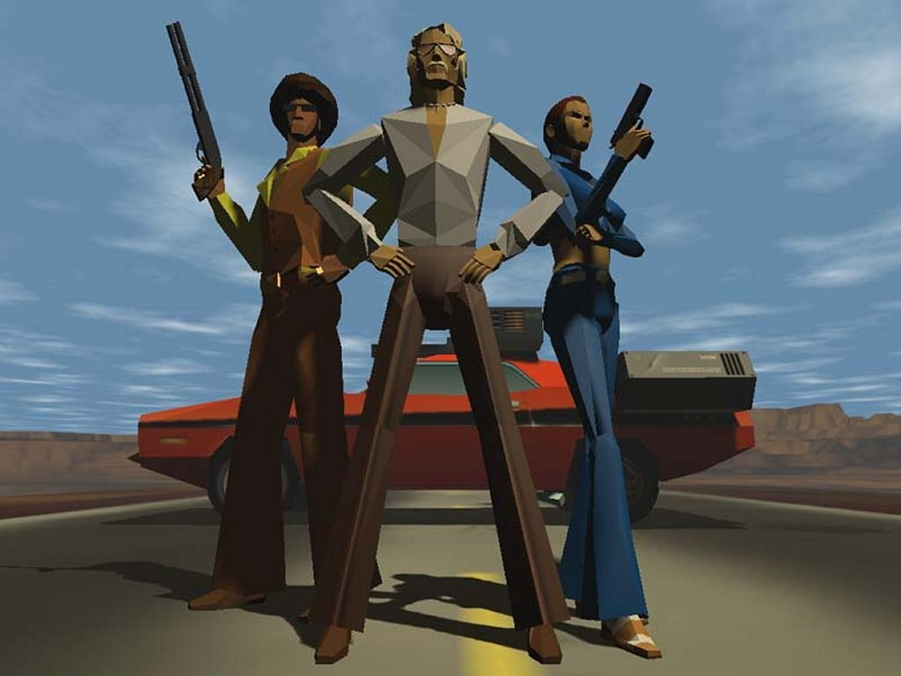

This chapter addresses the earliest stage of game design: getting and refining an idea for a game. Your goal at this point should be to write the high-concept document that we described in Chapter 1, “What Is Game Design?.” To do this, you don't have to have all the details worked out yet. But you do need a clear understanding of what your game is about, and you must answer certain essential questions. When you've answered those questions to your satisfaction and have written down the answers, you have turned your idea into a game concept. At the end of this chapter, we've included a worksheet to help you out.

本章讲述游戏设计的最初阶段：获得并完善游戏创意。此时，你的目标应该是写出我们在第一章，“什么是游戏设计？”中描述的高概念文档。要做到这一点，你不需要把所有细节都想好。但你确实需要清楚地了解你的游戏是关于什么的，而且你必须回答一些基本问题。当你满意地回答了这些问题并把答案写下来时，你就把你的创意变成了游戏概念。在本章末尾，我们提供了一份表格来帮助你。

# Getting an Idea 获取创意

Game ideas come from almost anywhere, but they don't walk up and introduce themselves. You can't sit around and wait for inspiration to strike. Creativity is an active, not a passive, process. You have to put yourself in an inquisitive frame of mind and then go out and look for game ideas. Look everywhere. Some of the most mundane things could be hiding a game idea. Even delivering newspapers provided the basis for a successful arcade game, [Paperboy](https://en.wikipedia.org/wiki/Paperboy_(video_game)), though developers spiced up the job by letting the player break windows with the newspapers and making him dodge cars on his bicycle.

游戏创意几乎无处不在，但它们不会自己走过来介绍自己。你不能坐等灵感来临。创意是一个主动而非被动的过程。你必须让自己保持好奇的心态，然后走出去寻找游戏创意。到处寻找。一些最平凡的事情都可能隐藏着游戏创意。即使是送报纸，也能为一款成功的街机游戏[《送报童》](https://en.wikipedia.org/wiki/Paperboy_(video_game))提供基础，不过开发者在游戏中加入了一些新的元素，如让玩家用报纸打破窗户，骑自行车躲避汽车等。

One idea isn't enough. It's a common misconception that a brilliant game idea will make you a fortune. In fact, this occurs extremely rarely. You might think you have the game idea of the century, but concentrating on it without bothering to think about other game ideas is a little like pinning all your hopes on a single lottery ticket and not bothering to get up for work while you wait to see if your numbers come up. Unlike lottery tickets, ideas are free, so think about new ones constantly. Make a note of them and go on. If one seems especially promising to you, then you can start to expand and refine it, but don't let that prevent you from thinking about other games as well. When thinking up game ideas, more is always better.

只有一个创意是不够的。一个绝妙的游戏创意会让你赚得盆满钵满，这是一个常见的误解。事实上，这种情况极少发生。你可能认为自己有了一个百年不遇的绝佳游戏创意，但只专注于这个创意而懒得去想其他游戏创意，就有点像把所有希望都寄托在一张彩票上，而懒得起床工作，等着看你的号码是否出现。与彩票不同，创意是免费的，所以要不断思考新创意。把它们记下来，然后继续。如果你觉得其中一个特别有前景，那么你就可以开始扩展和完善它，但不要因此而放弃对其他游戏的思考。在思考游戏创意时，多多益善。

## Dreaming the Dream 梦想

Many game ideas begin as dreams. Not real dreams, but daydreams, things you think about when you're staring out the window or watching the clouds on a summer afternoon—these are the thoughts that you have when you let your mind roam free.

许多游戏创意都始于梦想。这不是真正的梦，而是白日梦，是你在夏日午后凝视窗外或欣赏云彩时想到的事情——这些都是你放飞思想时产生的想法。

Computers can make dreams real. This is the unique characteristic of interactive entertainment that sets it apart from all other forms. Interactive entertainment can take you away to a wonderful place and there let you do an amazing thing. Books and movies can't do that. They can take you away to a wonderful place, but they can't let you do an amazing thing. Books and movies can create fantastic worlds and show them to you, but they can't let you be a part of them. Computer games create worlds, and they can let you live inside of them as well.

计算机可以让梦想成真。这就是互动娱乐区别于其他所有形式的独特之处。互动娱乐可以把你带到一个奇妙的地方，让你做一件不可思议的事情。书籍和电影做不到这一点。它们可以把你带到一个奇妙的地方，但不能让你做一件不可思议的事情。书籍和电影可以创造奇妙的世界并展示给你，但它们无法让你成为其中的一部分。电脑游戏可以创造世界，也可以让你身临其境。

A lot of computer games are light entertainment, designed to while away a few minutes with a puzzle or a simple challenge. But larger, richer games begin with a dream. If you've ever thought to yourself, “I wish I could…” or “Imagine what it would be like to…,” then you've taken the first step on the road to creating a computer game. The computer has the power to simulate reality (with varying degrees of accuracy), but, more important, it has the power to simulate dreams. Computers can create almost any sort of experience you can imagine visually, even experiences that are physically impossible in the real world. The design of a computer game begins with the question, “What dream am I going to fulfill?”.

许多电脑游戏都是轻松的娱乐，旨在通过拼图或简单的挑战来消磨几分钟的时间。但更大型、更丰富的游戏则始于梦想。如果你曾想过“我希望我能……”或“想象一下……会是什么样子”，那么你已经在创造电脑游戏的道路上迈出了第一步。计算机有能力模拟现实（精确度各不相同），但更重要的是，它有能力模拟梦境。计算机几乎可以创造出你所能想象的任何视觉体验，甚至是现实世界中不可能实现的体验。电脑游戏的设计始于“我要实现什么梦想”这个问题。

Perhaps it's a dream of exploring a dungeon infested with monsters. Perhaps it's a dream of coaching a football team. Perhaps it's a dream of being a fashion designer. But before you do anything else, you must dream the dream. Understand it. Feel it. Know who else dreams it and why.

也许是探索怪兽出没的地牢的梦想。也许是执教一支足球队的梦想。也许是当一名时装设计师的梦想。但在你做其他任何事情之前，你必须先梦想这个梦想。理解它。感受它。了解其他人的梦想和原因。

## Game Ideas from Other Media 来自其他媒体的游戏创意

Books, movies, television, and other entertainment media are a great source of inspiration for game ideas. The game [Interstate '76](https://en.wikipedia.org/wiki/Interstate_%2776) (see Figure 2.1) was inspired by 1970s cop shows. Movies such as the James Bond series often inspire games. Any story containing an exciting action with something important at stake can form the kernel of a game. Think over the books you've read and the movies you've seen, and ask yourself whether any of the scenes in them could serve as the basis for a game.

书籍、电影、电视和其他娱乐媒体是游戏创意的重要灵感来源。游戏[《76 号州际公路》](https://en.wikipedia.org/wiki/Interstate_%2776)（见图 2.1）的灵感就来自 20 世纪 70 年代的警察节目。《詹姆斯·邦德》系列等电影也经常给游戏带来灵感。任何包含精彩动作和重要事件的故事都可以成为游戏的内核。想想你读过的书和看过的电影，问问自己其中是否有场景可以作为游戏的基础。

Figure 2.1. [Interstate '76](https://en.wikipedia.org/wiki/Interstate_%2776) was a great game inspired by another medium. 图 2.1. [《76 号州际公路》](https://en.wikipedia.org/wiki/Interstate_%2776)是一款从另一种媒介中获得灵感的伟大游戏。

You can't, of course, go stealing other people's intellectual property. Even if the Pirates of the Caribbean ride at Disneyland seems like the basis for a great game, you can't go ahead and make it without Disney's approval. But you can certainly make a lighthearted game about pirates—as LucasArts did with its [Monkey Island](https://en.wikipedia.org/wiki/Monkey_Island) series.

当然，你不能窃取他人的知识产权。即使迪士尼乐园的“加勒比海盗”游乐设施看起来是一款伟大游戏的基础，你也不能在没有迪士尼公司批准的情况下就去制作它。但你当然可以制作一款轻松愉快的海盗题材游戏——就像 LucasArts 的[《猴岛》](https://en.wikipedia.org/wiki/Monkey_Island)系列那样。

You should also look beyond the usual science fiction and fantasy genres and beyond the usual sources. How about poetry? Beowulf's epic battle with the monster Grendel and then his even more terrible battle with Grendel's mother in a cave at the bottom of a lake sounds like the basis for a game. “The Charge of the Light Brigade” might make you wonder about cavalry tactics. What are the advantages and disadvantages? Would a game based on cavalry warfare be interesting to anyone? It's worth thinking about. The smash-hit game [The Sims](https://en.wikipedia.org/wiki/The_Sims) was partly inspired by a nonfiction book called A Pattern Language, which is about the way people's lives are affected by the design of their houses.

你还应将目光投向常见的科幻小说和奇幻小说之外，投向通常的资料来源之外。诗歌如何？贝奥武夫与怪物格伦戴尔的史诗般的战斗，以及他在湖底洞穴中与格伦戴尔的母亲进行的更可怕的战斗，听起来就像是游戏的基础。“轻骑兵的冲锋”可能会让你对骑兵战术产生好奇。它有哪些优缺点？以骑兵作战为基础的游戏会有人感兴趣吗？这值得思考。大热游戏[《模拟人生》](https://en.wikipedia.org/wiki/The_Sims)的部分灵感来源于一本名为《模式语言》的非虚构类书籍，该书讲述了人们的生活如何受到房屋设计的影响。

Game ideas can crop up in all sorts of unlikely places. Just as great scientists look at even the most common things in the world and ask how they work, great game designers are always looking at the world and wondering if it can be made into a game. The trick is to develop a game designer's instincts, to look for the fun and challenge even in things that don't sound like games at all.

游戏创意可能出现在各种不可能的地方。就像伟大的科学家会观察世界上最普通的事物，并询问它们是如何工作的一样，伟大的游戏设计师也总是在观察世界，并思考是否可以将其制作成游戏。诀窍在于培养游戏设计师的直觉，在听起来根本不像游戏的事物中寻找乐趣和挑战。

## Game Ideas from Other Games 来自其他游戏的游戏创意

A great many people who play computer games want to design them as well. Something about playing games stirs up people's creative juices. When you play a lot of games, you develop a sense of how they work and what their good and bad points are. Playing games is a valuable experience for a game designer. It gives insight and lets you compare and contrast the features of different games.

很多玩电脑游戏的人也想设计游戏。玩游戏能激发人们的创造力。当你玩了很多游戏之后，你就会对这些游戏的运作方式和优缺点有了一定的了解。玩游戏是游戏设计师的宝贵经验。它能让你深入了解不同游戏的特点，并进行比较和对比。

Sometimes we get game ideas through frustration. Most of us have had the experience, at one time or another, of playing a game that wasn't quite right somehow. The user interface was awkward, the game was too difficult, or the payoff was boring. We think, “If I had designed this game, I would have….” We have in our minds an imaginary ideal game, the one that would fix all those problems and the one that we would make if we had the chance.

有时，我们会在挫折中获得游戏创意。我们中的大多数人或多或少都有过这样的经历：玩过一款游戏，但总觉得不太合适。用户界面很别扭，游戏太难，或者奖励很无聊。我们会想：“如果是我来设计这个游戏，我会……”我们的脑海中有一个想象的理想游戏，一个可以解决所有这些问题的游戏，一个如果有机会我们就会制作的游戏。

To learn from other games, you have to pay attention as you play. Don't just play them for fun; look at them seriously and think about how they work. Take notes especially of things that you like or don't like and of features that seem to work particularly well or particularly badly. How do resources flow into the game? How do they flow out? How much is luck, and how much is skill?

要想从其他游戏中学习，就必须在玩的过程中注意观察。不要只是为了好玩而玩，而是要认真观察，思考它们是如何运作的。尤其要记下你喜欢或不喜欢的东西，以及看起来效果特别好或特别差的功能。资源是如何流入游戏的？如何流出？有多少是运气，有多少是技巧？

As creative people, our instinct is to devise totally new kinds of games that have never before been seen. Unfortunately, publishers want games that they are sure they can sell, and that usually means variants on existing genres, perhaps with a new twist that they can use in marketing. This is why we keep seeing sequels and thinly disguised copies of earlier games. As designers, we have to learn to balance the tension between our own desire to innovate and the publisher's need for the comfortably familiar. Leonardo da Vinci warned against persistent imitation, however, in his [Treatise on Painting]((https://en.wikipedia.org/wiki/A_Treatise_on_Painting)):

作为创意人员，我们的本能是设计出前所未有的全新游戏类型。不幸的是，发行商要的是他们有把握卖得出去的游戏，而这通常意味着对现有游戏类型进行改编，或许加入一些新元素用于营销。这就是为什么我们总是看到续作和换汤不换药的模仿作品。作为设计师，我们必须学会平衡自己的创新欲望与发行商对熟悉感需求之间的矛盾。然而，列奥纳多·达·芬奇在他的[《论绘画》](https://en.wikipedia.org/wiki/A_Treatise_on_Painting)中告诫我们不要一味模仿：

“The painter will produce pictures of little merit if he takes the work of others as his standard; but if he will apply himself to learn from the objects of nature he will produce good results. This we see was the case with the painters who came after the Romans, for they continually imitated each other, and from age to age their art steadily declined… It is safer to go directly to the works of nature than to those which have been imitated from her originals, with great deterioration and thereby to acquire a bad method, for he who has access to the fountain does not go to the water pot.”

“如果画家以他人的作品为标准，他的作品就不会有什么可取之处；但如果他愿意向大自然的对象学习，他就会有好的作品。我们看到，罗马人之后的画家就是这种情况，因为他们不断地相互模仿，从一个时代到另一个时代，他们的艺术不断衰退……直接去看大自然的作品要比去看那些从大自然的原作中模仿出来的作品安全得多，因为那些从原作中模仿出来的作品已经大不如前，从而获得了一种糟糕的方法，因为有泉源的人不会去看水壶。”

There is a downside to deriving game ideas from other games. It tends to result in games that look or work alike. It's an evolutionary, not a revolutionary, approach. Deriving game ideas from other games is an excellent way to learn about games and gameplay, but if pursued exclusively, it produces similarity and, ultimately, mediocrity. The greatest games break new ground. They're unlike anything seen on the store shelves before. To achieve that, you have to dream.

从其他游戏中汲取游戏创意也有弊端。它往往会导致游戏的外观或运行方式相似。这是一种进化而非革命的方法。从其他游戏中汲取游戏创意是了解游戏和游戏玩法的绝佳方式，但如果一味追求，就会产生雷同，最终导致平庸。最伟大的游戏都有新的突破。它们不同于之前在商店货架上看到的任何游戏。要做到这一点，就必须有梦想。

## From Dream to Game 从梦想到游戏

A dream or an idea alone is only a start; it is not enough to make a game. A dream is a fantasy that you have by yourself. You can make computer games purely for yourself if you like, but most of us don't have the money to do that. A computer game is something that you make for someone else. You'll also discover after you've built a few games that playing a game that you worked on is a very different experience from playing a game that someone else has created. When you know what's on the inside and how it works, some of the fantasy is lost. Just as actors often don't watch their own movies, some game developers don't play their own games. For one thing, of course, if it's a single-player game, they already know how to beat it. But the experience, the dream, isn't quite the same when it's a game you built yourself. In your heart, you know it's an artificial simulation.

仅仅有梦想或创意只是一个开始，还不足以制作一款游戏。梦想是你自己的幻想。如果你愿意，可以纯粹为自己制作电脑游戏，但我们大多数人都没钱这么做。电脑游戏是你为别人制作的东西。当你制作了几款游戏后，你还会发现，玩自己制作的游戏和玩别人制作的游戏是截然不同的体验。当你知道游戏的内部结构和工作原理时，就会失去一些幻想。就像演员通常不看自己的电影一样，一些游戏开发者也不玩自己的游戏。首先，当然，如果是单人游戏，他们已经知道如何通关。但如果是自己制作的游戏，体验和梦想就不一样了。在你的内心深处，你知道这是一个人工模拟的游戏。

The chief purpose of a computer game is to entertain someone else. This means that you and your development team are the performers, the people who create the entertainment. An essential part of your job is communication, transmitting your dream to your audience, the players. If the game is in a well-known genre and setting (for example, a World War II flight simulator), you can be pretty certain that a number of people already share your dream. But if your game is in a new setting (a futuristic city of your imagination, for example)—and especially if it's in a new genre—you have to be very careful and thorough in communicating your dream to others. Some of the very first questions a publishing executive is going to ask you are “Why would anyone want to play this game?” and “What's going to make someone buy this game instead of another?”.

电脑游戏的主要目的是娱乐他人。这意味着你和你的开发团队是表演者，是创造娱乐的人。你的工作的一个重要部分就是沟通，将你的梦想传递给你的受众——玩家。如果游戏的类型和背景众所周知（例如，二战飞行模拟器），那么可以肯定的是，已经有很多人认同你的梦想。但是，如果你的游戏是在一个新的环境中（比如你想象中的未来城市），尤其是如果它是在一个新的类型中，你就必须非常谨慎和彻底地向他人传达你的梦想。发行商首先会问你的一些问题是：“为什么会有人想玩这款游戏？”以及“是什么原因让别人购买这款游戏而不是另一款游戏？”。

But what does it mean to entertain someone? Many people think entertainment is synonymous with having fun, but even that isn't completely straightforward. People have fun in all kinds of ways. Some of those ways involve very hard work, such as gardening or building a new deck. Some of them involve frustration, such as solving a puzzle. Some, such as athletic competitions, even involve pain. One person's entertainment is another person's insufferable boredom. In building a computer game that entertains, it's important to understand how it entertains. And to do that, you have to know what a game really is.

但娱乐他人是什么意思呢？很多人认为娱乐就是找乐子，但这并不完全直截了当。人们有各种各样的娱乐方式。其中有些方式涉及非常艰苦的工作，比如园艺或建造新露台。有的则会遇到挫折，比如解谜。有些方式甚至会带来痛苦，比如体育比赛。一个人的娱乐就是另一个人难以忍受的无聊。在制作一款娱乐性电脑游戏时，了解它的娱乐方式非常重要。而要做到这一点，就必须知道游戏到底是什么。

# The Elements of a Game 游戏的要素

In this section, we give a formal definition of a game and describe the elements that comprise one. Remember that we're talking about any kind of game, computerized or not. We continue to use these terms throughout the book.

在本节中，我们将给出游戏的正式定义，并描述构成游戏的要素。请记住，我们谈论的是任何类型的游戏，不管是不是电脑游戏。我们将在本书中继续使用这些术语。

## Games, Toys, and Puzzles 游戏、玩具和拼图

A game is a form of participatory, or interactive, entertainment. Watching television, reading, and going to the theater are all forms of passive entertainment. In those media, the entertainment is presented to you, and you're not expected to participate. In some plays, the audience itself has a role, but even then the actors are in control. The content of the entertainment is the drama, and the way you perceive it is by watching it. This mode is fundamentally passive: They act, you watch.

游戏是一种参与式或互动式娱乐形式。看电视、阅读和看电影都是被动娱乐的形式。在这些媒体中，娱乐是呈现给你的，你无需参与。在某些戏剧中，观众本身也扮演了一个角色，但即便如此，演员还是掌控着全局。娱乐的内容就是戏剧表演，而你感知戏剧的方式就是观看。这种模式从根本上说是被动的：他们演，你看。

A game is a much more complicated thing. When people play a game, they are being entertained by actively participating. Although we use the term interactive entertainment to refer to computer and video games, any game is interactive if you're taking part in it, whether it's softball or postal chess. Active forms of entertainment are slowly gaining ground over passive forms; people are starting to play online role-playing games instead of watching TV. People love the feeling of involvement and empowerment that gaming gives.

游戏则要复杂得多。当人们玩游戏时，他们通过积极参与而获得乐趣。尽管我们用互动娱乐一词来指电脑和视频游戏，但只要你参与其中，无论是垒球还是国际象棋，任何游戏都是互动的。主动形式的娱乐正在慢慢取代被动形式；人们开始玩在线角色扮演游戏，而不是看电视。人们喜欢游戏带来的参与感和力量感。

A game takes place in an artificial universe that is governed by rules. The rules define the actions or moves that the players may make in the game, and also the actions that they may not make. In a computer game, most of these rules are hidden. Because you can interact with the game only through the machine's input devices, and the machine can ignore inappropriate inputs, you don't have to be told the rules explicitly. Computer games generally allow you to try anything you want; you can presume that anything you can do, you are allowed to do.

游戏发生在一个受规则约束的人造宇宙中。这些规则规定了玩家在游戏中可以采取的行动或动作，以及不可以采取的行动。在电脑游戏中，大部分规则都是隐藏的。因为你只能通过机器的输入设备与游戏互动，而机器可以忽略不恰当的输入，所以你不必被明确告知规则。电脑游戏通常允许你尝试任何你想尝试的东西；你可以假定任何你能做的事情，你都可以做。

When you're playing a game, especially board games and computer games, you're often playing a role of some sort. Defining the player's role is a key part of game design, and we'll discuss it in more detail later.

在玩游戏时，尤其是在玩棋盘游戏和电脑游戏时，你通常会扮演某种角色。确定玩家的角色是游戏设计的关键部分，我们稍后会详细讨论。

Other kinds of interactive entertainment are not games. A toy is an object that you play with without rules. You can play a game with a toy if you make up some rules to play by, but ordinarily a toy does not come with rules.

其他类型的互动娱乐并非游戏。玩具是一种没有规则的玩物。如果你制定了一些游戏规则，你就可以用玩具玩游戏，但通常玩具是没有规则的。

Unlike a toy, a puzzle does have one definite rule: It has a correct solution that you are trying to find. Puzzles are normally worked by one person. Typically, they require problem-solving skills and the ability to think ahead, but they don't involve any role-playing and are not set in an artificial universe.

与玩具不同的是，拼图有一个明确的规则：它有一个正确的解法，你要努力找到它。拼图通常由一个人完成。通常情况下，拼图游戏需要解决问题的技巧和超前思考的能力，但它们不涉及任何角色扮演，也不设定在人工宇宙中。

## Challenges, Gameplay, and the Victory Condition 挑战、游戏玩法和胜利条件

The rules also define the obstacles, or challenges, that the players must overcome to win the game. The challenges, together with the actions the players can take to meet them, make up the gameplay. Defining and tuning the gameplay is the largest and most difficult task in designing a game; this is discussed extensively in Chapter 7, “Gameplay.”

游戏规则还规定了玩家为赢得游戏必须克服的障碍或挑战。这些挑战以及玩家可以采取的应对行动构成了游戏玩法。定义和调整游戏玩法是设计游戏的最大也是最困难的任务；第七章“游戏玩法”将对此进行广泛讨论。

Included with the rules of most (but not all) games is a special rule that defines the victory condition: a state of affairs in which one or more players are said to be the winner. Usually, the first player to achieve the victory condition is the winner and the others are the losers. These kinds of games are said to be competitive—that is, the players are trying to achieve the victory condition for themselves while preventing the others from doing so. Some games define the rules in such a way that all players must work together to achieve the victory condition; these are called cooperative games. If groups of players work together against other groups of players, the game is a team game. Most noncomputerized games—and many computerized ones as well—are multi-player games; if a game is played by one player alone, it is a single-player or solitaire game. Many video games sold at retail offer several different play modes: single-player, two-player competitive, two-player cooperative, and so on. Sports games are particularly well suited to these kinds of variations.

大多数（但不是所有）游戏的规则中都包含一条定义胜利条件的专门规则：在这种状态下，一名或多名玩家被称为胜利者。通常，第一个达成胜利条件的玩家就是赢家，其他人就是输家。这类游戏被称为竞争性游戏，也就是说，玩家们都在努力为达成胜利条件，同时阻止其他玩家这样做。有些游戏的规则规定，所有玩家必须齐心协力才能达成胜利条件；这些游戏被称为合作游戏。如果一组玩家共同对抗另一组玩家，那么这个游戏就是团队游戏。大多数非电脑游戏和许多电脑游戏都是多人游戏；如果一个人单独玩游戏，那就是单人游戏或纸牌游戏。许多在售的电子游戏都提供几种不同的游戏模式：单人游戏、双人竞技游戏、双人合作游戏等。体育游戏尤其适合这类变化。

In addition to a victory condition, many games have one or more loss conditions. Sometimes the loss condition is implicit: If you aren't the first to achieve the victory condition, you lose. But in others, the loss conditions are explicit: Your character has died, for example, or you have run out of some vital resource.

除了胜利条件，许多游戏还有一个或多个失败条件。有时，失败条件是隐含的：如果你不是第一个达成胜利条件的人，你就输了。但在其他游戏中，失败条件是明确的：例如，你的角色已经死亡，或者你的某些重要资源已经耗尽。

Some computer games have no victory condition. These are often construction and management simulations such as [Sim City](https://en.wikipedia.org/wiki/SimCity). Rather than trying to “win” by achieving the victory condition, you can set your own goals for what you're trying to achieve. Or, you can just play around with the game without trying to achieve anything in particular. ([Sim City](https://en.wikipedia.org/wiki/SimCity) also has some scenarios with victory conditions.) These kinds of games are sometimes referred to as software toys.

有些电脑游戏没有胜利条件。这些游戏通常是建筑和管理模拟游戏，如[《模拟城市》](https://en.wikipedia.org/wiki/SimCity)。与其试图通过达成胜利条件来“获胜”，你不如给自己设定一定目标。或者，你也可以只是随意玩玩，不去尝试完成任何特定的目标。（[《模拟城市》](https://en.wikipedia.org/wiki/SimCity)中也有一些带有胜利条件的场景。）这类游戏有时被称为软件玩具。

Many single-player arcade games, such as Tetris, are peculiar in that they have no victory condition. They are effectively unwinnable; the game just gets harder and harder until eventually you must lose. You do, however, get a score based on your ability, and your goal is to be listed among the top players. In effect, the victory condition is to do better than other people who play the game, but you can never actually win the game itself.

许多单人街机游戏（如俄罗斯方块）都很特别，因为它们没有胜利条件。它们实际上是赢不了的；游戏会变得越来越难，直到最后你必须输掉。不过，你会根据自己的能力得到一个分数，你的目标是跻身顶尖玩家行列。实际上，胜利的条件是比其他玩游戏的人玩得更好，但你永远不可能真正赢得游戏本身。

## Setting, Interaction Model, and Perspective 场景、互动模式和视角

A game also takes place in a setting or world. A sport such as football, for example, takes place on a field with defined boundaries. A board game takes place on and around the board. Even simple games with cards, dice, or dominoes take place on a tabletop, and the players implicitly agree that the table is the only legitimate playing surface. Because a computer screen has the capacity to display anything, a computer game can take place in any setting imaginable. We talk more about game settings and worlds in Chapter 3, “Game Settings and Worlds.” For now, it's enough to know that a game's setting is part of its concept.

游戏也发生在一个环境或世界中。例如，足球等运动是在有明确边界的场地上进行的。棋盘游戏则在棋盘上和棋盘周围进行。即使是简单的纸牌、骰子或多米诺骨牌游戏也是在桌面上进行的，玩家们默认桌面是唯一合法的游戏场所。因为电脑屏幕可以显示任何东西，所以电脑游戏可以在任何想象的环境中进行。我们将在第三章“游戏场景和世界”中详细介绍游戏场景和世界。现在，我们只需知道游戏场景是游戏概念的一部分就足够了。

The way that the player interacts with the game world—takes actions to overcome the challenge—is called the game's interaction model. There are many different interaction models; some games have different models at different points in the game or allow the player to choose from a selection of models.

玩家与游戏世界互动的方式——采取行动克服挑战——称为游戏的互动模式。有许多不同的互动模式；有些游戏在游戏的不同阶段有不同的模式，或者允许玩家从多种模式中进行选择。

Two interaction models are particularly common in computer gaming. If the player plays in the game world by controlling a single character or piece that represents him, and if that character exists in a single place and can influence only the local area around him, that character is called his avatar. In Nintendo's Mario games, Mario is the player's avatar. On the other hand, if the player has the ability to view different parts of the game world, taking actions in many different places, the player is said to be omnipresent (even if parts of the world are hidden from him at times). This applies even if the player can act only by directing characters or units that belong to him; if he has the power to give directions to all of them independently, he is omnipresent. A good example of this kind of game is chess. The player can move any of his own pieces on the board, no matter where they are.

有两种交互模式在电脑游戏中尤为常见。如果玩家在游戏世界中通过控制一个代表他的角色或部件来进行游戏，而且该角色只存在于一个地方，只能影响他周围的局部区域，那么该角色就被称为他的化身。在任天堂的马里奥游戏中，马里奥就是玩家的化身。另一方面，如果玩家有能力查看游戏世界的不同部分，在许多不同的地方采取行动，那么玩家就可以说是无所不在的（即使世界的某些部分有时会被隐藏起来）。即使玩家只能通过指挥属于他的角色或单位来行动，如果他有能力独立指挥所有角色或单位，他也是无所不在的。国际象棋就是这类游戏的一个很好的例子。棋手可以在棋盘上移动自己的任何棋子，无论它们在哪里。

Perspective describes how the player actually sees the world on the screen. In war games, players usually have an aerial perspective above the battlefield. If the view is from directly above, like looking at a map, this is called a top-down perspective. Most old war games, as well as the original [Sim City](https://en.wikipedia.org/wiki/SimCity), used this perspective. Beginning with [Populous](https://en.wikipedia.org/wiki/Populous_(video_game)), however, many aerial-perspective games adopted a more dramatic viewpoint. In this the view is at a 30- or 45-degree angle from the vertical, looking slightly across the landscape and not just straight down. The landscape is also rotated 45 degrees with respect to the bottom of the screen, so the player is always looking at one corner of rectangular objects such as buildings. This is called an isometric perspective. This viewpoint makes the player feel closer and more involved with events than the top-down perspective. It has the disadvantage that, if it can be rotated in 90-degree steps, the art team has to draw four different versions of everything that can appear on the ground, from each of the four angles.

视角描述的是玩家在屏幕上看到的世界。在战争游戏中，玩家通常从空中俯瞰战场。如果视角是从正上方看，就像看地图一样，这就叫做俯视视角。大多数老式战争游戏以及最初的[《模拟城市》](https://en.wikipedia.org/wiki/SimCity)都采用这种视角。不过，从[《上帝也疯狂》](https://en.wikipedia.org/wiki/Populous_(video_game))开始，许多空中视角游戏都采用了一种更富戏剧性的视角。在这种视角下，视角与垂直方向成 30 度或 45 度角，视线略微穿过景观，而不是直接向下。景观也会相对于屏幕底部旋转 45 度，因此玩家看到的总是矩形物体（如建筑物）的一角。这就是所谓的等距视角。与自上而下的视角相比，这种视角让玩家感觉离事件更近、更投入。它的缺点是，如果可以以 90 度为单位旋转，美术团队就必须从四个角度为地面上可能出现的所有物体绘制四个不同的版本。

Many games offer different perspectives or camera angles that the user can change. Not all camera angles suit all games; perspectives that are visually stunning to watch from can turn out to be impractical during actual gameplay. [Madden NFL Football](https://en.wikipedia.org/wiki/Madden_NFL), for example, normally uses a perspective in which the camera is above and behind the ball carrier, looking somewhat downfield toward the goal. But it also provides a sideline camera, showing the field as it would appear to someone sitting in the stands. Although this is a very familiar perspective and is great for taking screenshots that look like real football on television, the game is quite difficult to play from this angle.

许多游戏都提供不同的视角或摄像机角度，用户可以随意更换。并不是所有的摄像机角度都适合所有的游戏；在实际游戏中，视觉效果很好的视角可能并不实用。例如，[《疯狂橄榄球》](https://en.wikipedia.org/wiki/Madden_NFL)通常使用的视角是，摄像头在持球者的上方和身后，并在一定程度上向球门方向俯视。但它也提供了一个边线摄像机，显示坐在看台上的人所看到的球场。虽然这是一个大家都很熟悉的视角，而且非常适合截图，看起来就像电视上的真实足球一样，但从这个角度玩游戏却相当困难。

You're probably familiar with many common perspectives: first person, in which you look through the eyes of your avatar (most commonly found in first-person shooters such as [Half-Life](https://en.wikipedia.org/wiki/Half-Life_(video_game))); third person, in which you follow behind your avatar in a three-dimensional world ([Tomb Raider](https://en.wikipedia.org/wiki/Tomb_Raider) is one of the best-known examples); and side-scrolling, commonly seen in older video games such as [Sonic the Hedgehog](https://en.wikipedia.org/wiki/Sonic_the_Hedgehog). With the introduction of 3D display engines, games can use any number of perspectives at no additional cost in art development time.

你可能对许多常见的视角并不陌生：第一人称视角，即通过你的化身的眼睛来观察（最常见于第一人称射击游戏，如[《半条命》](https://en.wikipedia.org/wiki/Half-Life_(video_game))）；第三人称视角，即在三维世界中跟在你的化身后面（[《古墓丽影》](https://en.wikipedia.org/wiki/Tomb_Raider)是最著名的例子之一）；以及卷轴视角，常见于老式视频游戏，如[《刺猬索尼克》](https://en.wikipedia.org/wiki/Sonic_the_Hedgehog)。随着 3D 显示引擎的引入，游戏可以使用任意数量的视角，而无需额外的美术开发成本。

## The Player's Role 玩家的角色

When you're playing a game, especially board games and computer games, you're often playing a role of some sort. In [Monopoly](https://en.wikipedia.org/wiki/Monopoly_(game)), you're playing a real estate tycoon. In [Goldeneye](https://en.wikipedia.org/wiki/GoldenEye_007_(1997_video_game)), you're playing James Bond. Defining the player's role in the game world is a key part of defining your game's concept. If the player's role is difficult to describe, it might be difficult for the player to grasp as well, and it might indicate that there is a conceptual problem with the game. This doesn't mean that the role always has to be simple. In [Madden NFL Football](https://en.wikipedia.org/wiki/Madden_NFL), for example, the player can be either a football player, a coach, or both. As the coach, he calls the plays that his team will run and makes player substitutions. As a player, he takes the snap, passes the ball, and runs with it. In fact, he's not controlling any single player; he's controlling whichever one happens to be in possession of the ball. On defense, he can switch from player to player to control whichever one has the best chance of tackling the ball carrier.

玩游戏时，尤其是玩棋盘游戏和电脑游戏时，你往往扮演着某种角色。在[《大富翁》](https://en.wikipedia.org/wiki/Monopoly_(game))中，你扮演的是一个房地产大亨。在[《黄金眼》](https://en.wikipedia.org/wiki/GoldenEye_007_(1997_video_game))中，你扮演的是詹姆斯·邦德。确定玩家在游戏世界中的角色是确定游戏概念的关键部分。如果玩家的角色很难描述，那么玩家可能也很难把握，这可能表明游戏在概念上存在问题。这并不意味着角色一定要简单。例如，在[《疯狂橄榄球》](https://en.wikipedia.org/wiki/Madden_NFL)中，玩家既可以是橄榄球运动员，也可以是教练，或者两者兼而有之。作为教练，他可以决定球队的战术，并替换球员。作为球员，他负责发球、传球和带球跑。事实上，他并不控制任何一名球员；他控制的是碰巧控球的球员。在防守时，他可以从一名球员切换到另一名球员，以控制最有可能抢断持球者的球员。

This works very well in a football game, where these roles, although different from one another in real life, are well understood by the game's audience and are exactly the ones they want to perform. But if a game takes place in a less familiar world with less familiar objectives, it's important for the roles to be clear. If the player's role changes from time to time—especially involuntarily—it's essential that the player know why it changed and be able to adapt quickly to the new circumstances.

这在足球游戏中非常奏效，因为这些角色虽然与现实生活中的角色不同，但游戏的受众非常了解，也正是他们想要扮演的角色。但如果游戏发生在一个不太熟悉的世界，目标也不那么熟悉，那么角色就必须明确。如果玩家的角色时常发生变化，尤其是非自愿的变化，那么玩家就必须知道角色变化的原因，并能迅速适应新的环境。

The player's role also helps the player to understand what he's trying to achieve and what rules he's playing by. In Sierra Online's [Police Quest](https://en.wikipedia.org/wiki/Police_Quest) series, for example, the player takes on the role of a real police officer. Real police officers can't just shoot anything that moves; they have to obey strict rules about when and how to use their guns. Tactical combat simulations such as [Rainbow Six](https://en.wikipedia.org/wiki/Tom_Clancy%27s_Rainbow_Six) and [Counter-Strike](https://en.wikipedia.org/wiki/Counter-Strike) also implement these sorts of rules, placing the player in the shoes of a real Special Forces soldier. By telling the player what role he'll be playing, the player knows that his actions will have to be more cautious than in the usual frenetic shooter.

玩家的角色还能帮助玩家了解他要达到的目的和遵守的规则。例如，在 Sierra Online 的[《警察任务》](https://en.wikipedia.org/wiki/Police_Quest)系列中，玩家扮演的是一名真正的警察。真正的警察不能随便射击任何会动的东西，他们必须严格遵守使用枪支的时间和方式规定。[《彩虹六号》](https://en.wikipedia.org/wiki/Tom_Clancy%27s_Rainbow_Six)和[《反恐精英》](https://en.wikipedia.org/wiki/Counter-Strike)等战术战斗模拟游戏也实行此类规则，让玩家扮演真正的特种部队士兵。通过告诉玩家他将扮演的角色，玩家知道他的行动必须比一般的狂热射击游戏更加谨慎。

## Modes and Structure 模式和结构

Some games, such as checkers, work the same way from beginning to end. The player is always trying to accomplish the same thing in the same way. Other games have distinct modes, in which the nature of the gameplay changes significantly from one mode to the next. War games, for example, might have a strategic mode in which you plan which battles you intend to fight and a tactical mode in which you actually fight the battles. Many things often change when the game switches modes: the interaction model, the perspective, the player's role, and some of the challenges.

有些游戏，如跳棋，从头到尾都是一样的。玩家总是试图以同样的方式完成同样的事情。其他游戏则有不同的模式，在不同的模式下，游戏的性质会发生很大的变化。例如，战争游戏可能有战略模式和战术模式，前者让玩家计划要打哪些仗，而后者则让玩家实际作战。当游戏切换模式时，很多东西都会发生变化：交互模式、视角、玩家的角色以及一些挑战。

In addition, many games have noninteractive modes that are interspersed with the interactive ones. War games, again, often have a briefing that occurs before the battle to explain to you what resources you have and what your objectives are, and a debriefing that occurs afterward to summarize what happened and tell you whether you won or lost.

此外，许多游戏的非互动模式与互动模式穿插在一起。同样，战争游戏通常在战斗前会有一个简报，向你解释你有哪些资源，你的目标是什么；战斗后会有一个汇报，总结发生了什么，告诉你是赢了还是输了。

The relationships between the modes and the rules determining when and why the game switches among them collectively form the structure of the game. The best way to document the structure of a game is with a flowchart, a series of boxes representing the modes with arrows from one to the next showing how the transitions occur. At the concept stage, this doesn't have to be detailed, but if you're designing a game with multiple modes, you should have at least a general idea of what modes you want and why.

模式之间的关系以及决定游戏何时以及为何在模式之间切换的规则共同构成了游戏的结构。记录游戏结构的最佳方式是使用流程图，即一系列代表模式的方框，以及从一个模式到下一个模式的箭头，以显示转换是如何发生的。在概念设计阶段，流程图不一定要很详细，但如果你要设计一款有多种模式的游戏，你至少应该大致了解你需要哪些模式以及为什么需要。

## Realism 现实

When a game depicts a world, even an imaginary one, in such a way that the principles of real-world logic and common sense apply, we say that the game is realistic. [Microsoft Flight Simulator](https://en.wikipedia.org/wiki/Microsoft_Flight_Simulator), which tries to model accurately the behavior of real aircraft, is a good example. On the other hand, when a game has quite arbitrary rules and you cannot count on real-world common sense, as in [Pac-Man](https://en.wikipedia.org/wiki/Pac-Man), for example, we say that the game is abstract. We discuss realism in more detail in Chapter 3.

当一款游戏描绘的世界，哪怕是想象中的世界，符合现实世界的逻辑原则和常识时，我们就可以说这款游戏是现实的。[《微软飞行模拟器》](https://en.wikipedia.org/wiki/Microsoft_Flight_Simulator)就是一个很好的例子，它试图准确模拟真实飞机的行为。另一方面，当一个游戏的规则非常随意，你无法依赖现实世界的常识时，比如在[《吃豆人》](https://en.wikipedia.org/wiki/Pac-Man)中，我们就说这个游戏是抽象的。我们将在第三章详细讨论现实主义。

At the concept stage, you don't have to decide exactly how realistic your game is going to be. For example, in designing a war game, you might defer decisions about whether to allow friendly fire to harm your own troops. In real life, the military goes to great lengths to prevent friendly fire incidents, but tragically, they still do happen. In a war game, in which the player rarely has precise control over how each weapon is aimed, it might be placing too much of a burden on the player to handle the friendly fire problem. On the other hand, this might be an issue that you want to focus on. Play-testing can tell you whether it's manageable, but an experienced designer can usually predict gameplay problems before the game gets that far. At the concept stage, it's not that important to know whether your simulation will include the effects of friendly fire. It is useful, however, to have a general idea of whether your game is going to be abstract or realistic.

在概念阶段，你不必确定游戏的逼真程度。例如，在设计一款战争游戏时，你可以推迟决定是否允许友军误伤自己的部队。在现实生活中，军队会不遗余力地防止友军误伤事件的发生，但不幸的是，这类事件还是时有发生。在战争游戏中，玩家很少能精确控制每种武器的瞄准方式，这可能会让玩家在处理友军误伤问题上负担过重。另一方面，这也可能是你需要关注的问题。游戏测试可以告诉你这个问题是否可以解决，但经验丰富的设计师通常可以在游戏进行到这一步之前就预测到游戏问题。在概念阶段，知道你的模拟是否会包括友军误击的影响并不那么重要。不过，大致了解游戏是抽象的还是现实的还是很有用的。

## A Word About Story 关于故事

Computer games lie in a peculiar middle ground between the purely passive, narrative media such as film and television and active, non-narrative games such as poker or dominoes. Some computer games, such as [Tetris](https://en.wikipedia.org/wiki/Tetris), have no narrative; others, such as the [Gabriel Knight](https://en.wikipedia.org/wiki/Gabriel_Knight) series, have a great deal. Some games tell linear, noninteractive stories interspersed with interactive episodes, others implement storylines that branch as the player makes decisions, and still others put their players in a setting where storylike adventures can take place and let them have at it. The relationship between the game and the story has been debated many times in the game industry.

电脑游戏处于一种奇特的中间地带，介于电影和电视等纯被动叙事媒体与扑克或多米诺骨牌等主动非叙事游戏之间。有些电脑游戏，如[《俄罗斯方块》](https://en.wikipedia.org/wiki/Tetris)，没有叙事；而另一些游戏，如[《狩魔猎人》](https://en.wikipedia.org/wiki/Gabriel_Knight)系列，则有大量的叙事。有些游戏讲述的是线性的、非交互式的故事，其中穿插着交互式的情节；有些游戏的故事情节会随着玩家的决定而发生分化；还有些游戏则将玩家置于一个可以发生故事般的冒险的环境中，让他们尽情发挥。游戏和故事之间的关系在游戏行业中已经争论了很多次。

It is our contention that, whether a game contains a great deal of narrative content or none at all, the player must ultimately live his own story through playing the game. The fundamental principle of computer gaming, its raison d'être, is interactivity: providing the player with something entertaining to do. It is not the business of the game designer to tell stories, but to create worlds in which stories take place around an active player.

我们的观点是，无论游戏是否包含大量叙事内容，玩家最终都必须通过玩游戏来讲述自己的故事。电脑游戏的基本原则，即存在的理由，是互动性：为玩家提供娱乐。游戏设计师的职责不是讲故事，而是创造一个世界，在这个世界里，故事围绕着一个主动活跃的玩家展开。

A common error made by beginning game designers is to concern themselves with the story too early in the design process. The first concern of the designer is not “What am I going to show or tell my player?” but “What is my player going to do?”. When conceptualizing your game, you don't have to know exactly what narrative content you want to include in your game. If you are working on it now, you are focusing your attention in the wrong place. All you need to know is whether you want a story and, if so, what its overall direction will be. You should be able to summarize it in a sentence or two, for example: “Jack Jones, leader of a secret DEA task force, will conduct a series of raids against the drug barons, ending in an apocalyptic battle in the cocaine fields of Colombia. Along the way, some of the people he encounters will not be quite what they seem.” Remember that errors in the storyline are much easier to correct than errors in the gameplay, and gamers will forgive them more easily as well. Make sure you understand your game first; then build your story into it.

初出茅庐的游戏设计师常犯的一个错误是在设计过程中过早地关注故事情节。设计师首先要考虑的不是“我要向玩家展示或讲述什么？”而是“玩家要做什么？”。在构思游戏时，你不必确切知道游戏中要包含哪些叙事内容。如果你现在就在做，那你就把注意力放在了错误的地方。你只需知道是否需要一个故事，如果需要，故事的总体方向是什么。你应该能够用一两句话来概括，例如：“杰克·琼斯是美国缉毒署秘密特遣部队的队长，他将对毒枭展开一系列突袭行动，最后在哥伦比亚的可卡因田里展开一场末日之战。一路上，他遇到的一些人并不像他们看起来的那样”。请记住，故事情节中的错误比游戏玩法中的错误更容易纠正，玩家也更容易原谅。首先确保你熟习你的游戏，然后在游戏中构建你的故事。

We discuss storytelling and narrative at length in [Chapter 4](chapter-4.md), “Storytelling and Narrative.”

我们将在[第四章](chapter-4.md)“讲故事和叙事”中详细讨论讲故事和叙事的问题。

# Understanding Your Audience 了解受众

In the previous section, we defined the elements of a game. But games don't exist in a vacuum; they're intended to be played by people. A common misconception among game designers is that all players enjoy the same things that the designer enjoys, so the designer only has to examine his own experience to know how to make a game entertaining. This is dangerous hubris. The reason for making a computer game is to entertain an audience. You have to think about who those people are and what they like.

在上一节中，我们定义了游戏的要素。但游戏并不是存在于真空中，它是要让人来玩的。游戏设计者的一个常见误解是，所有玩家喜欢的东西都和设计者喜欢的一样，因此设计者只需研究自己的经验就能知道如何让游戏具有娱乐性。这是一种危险的傲慢。制作电脑游戏的目的是为了娱乐观众。你必须考虑这些人是谁，他们喜欢什么。

Generalities are always risky, and misguided assumptions about players can result in games that no one will buy. Still, unless the game you're designing has been commissioned by a single individual, you are making it for a class of people, not for one person, and that class will be defined by common characteristics. Another important question a publisher will ask you is “Who will buy this game?”. Think carefully about the answer. What things do they have in common? What things set them apart from other gamers? What challenges do they enjoy? More important, what challenges do they not enjoy? What interests them, bores them, frustrates them, excites them, frightens them, and offends them? Answer these questions, and keep the answers close at hand as you design your game.

一概而论总是有风险的，对玩家的错误假设可能导致游戏无人问津。不过，除非你设计的游戏是受某个人委托制作的，否则你是在为某一类人制作游戏，而不是为某个人制作游戏，而这一类人将由共同的特征来定义。发行商会问你的另一个重要问题是“谁会购买这款游戏？”。请仔细思考答案。他们有哪些共同点？哪些事情让他们与其他游戏玩家不同？他们喜欢哪些挑战？更重要的是，他们不喜欢哪些挑战？他们对什么感兴趣、厌烦、沮丧、兴奋、害怕或反感？回答这些问题，并在设计游戏时将答案放在手边。

## Core Versus Casual 核心玩家与休闲玩家

In our opinion, the most significant distinction among player types is not between console-game players and computer-game players, not between men and women, and not even between children and adults. The most significant distinction is between core gamers and casual gamers.

我们认为，玩家类型之间最重要的区别不是主机游戏玩家和电脑游戏玩家，也不是男性和女性，甚至不是儿童和成人。最重要的区别在于核心玩家和休闲玩家。

Core gamers play a lot of games. Games are more than light entertainment to them; they're a hobby that demands time and money. Core gamers subscribe to game magazines, chat on game bulletin boards, and build fan web sites about their favorite games. Above all, core gamers play for the exhilaration of defeating the game. They tolerate frustration well because of the charge they get out of finally winning. The greater the obstacle, the greater the sense of achievement. Core gamers thrive on competition. They don't like games that are easy; they like games that are challenging.

核心玩家经常玩游戏。对他们来说，游戏不仅仅是一种轻松的娱乐，更是一种需要时间和金钱的爱好。核心玩家会订阅游戏杂志，在游戏公告板上聊天，并为自己喜欢的游戏建立粉丝网站。最重要的是，核心玩家玩游戏是为了征服游戏的快感。他们能很好地忍受挫折，因为最终获胜会让他们兴奋不已。障碍越大，成就感就越强。核心玩家在竞争中茁壮成长。他们不喜欢简单的游戏，而是喜欢具有挑战性的游戏。

By comparison, casual gamers play for the sheer enjoyment of playing the game. If the game stops being enjoyable or becomes frustrating, the casual gamer will stop playing. For the casual gamer, playing a game must be entertaining, whether it's competitive or not. A casual gamer is simply not willing to spend hours learning complex controls or getting killed again and again until he finds the one weak point in an otherwise invincible enemy. To design a game for casual gamers, you have to challenge their minds at least as much as their motor skills.

相比之下，休闲玩家玩游戏纯粹是为了享受游戏的乐趣。如果游戏不再令人愉快或令人沮丧，休闲玩家就会停止游戏。对于休闲玩家来说，无论游戏是否具有竞技性，都必须具有娱乐性。休闲玩家根本不愿意花几个小时去学习复杂的操作，也不愿意一次又一次地被杀死，直到找到原本不可战胜的敌人的弱点。要为休闲玩家设计游戏，你必须尽力挑战他们的思维能力，而不是操作技巧。

In reality, of course, there are as many types of gamer as there are gamers; everyone has their own reasons for playing computer games. But the casual/core distinction is a very powerful one. If you design a game specifically for one group, you almost certainly won't have a lot of sales to the other group. A few very well-designed games manage to appeal to both: [Goldeneye](https://en.wikipedia.org/wiki/GoldenEye_007_(1997_video_game)), for example, could be played happily by both core and casual gamers. Core gamers could set the game at the highest difficulty level and drive themselves crazy trying to cut 15 seconds off the last time it took to play a mission. Casual gamers could set the game at the easiest level and blast away, enjoying the game's smooth controls and visual detail.

当然，在现实生活中，玩家的类型和游戏玩家的数量一样多；每个人都有自己玩电脑游戏的理由。不过，休闲游戏和核心游戏的区别还是很明显的。如果你专门为一个群体设计游戏，那么几乎可以肯定的是，另一个群体的游戏销量不会很大。少数设计精良的游戏却能同时吸引这两类玩家：例如，[《黄金眼》](https://en.wikipedia.org/wiki/GoldenEye_007_(1997_video_game))既能让核心玩家玩得开心，也能让休闲玩家玩得开心。核心玩家可以把游戏设置为最高难度，并尝试在上一次完成任务的时间上再削减 15 秒，这可能会让他们疯狂。休闲玩家可以将游戏设置为最简单的难度，然后尽情享受游戏的流畅操控和视觉细节。

Even at the concept level, you must have some understanding of who will play your game and what they will enjoy about it. A game concept is not complete without a statement describing its intended audience.

即使是在概念层面，你也必须了解谁会玩你的游戏，他们会喜欢什么。没有对游戏目标受众的描述，游戏概念是不完整的。

# The Genres of Interactive Entertainment 游戏的类型

As we said in the introduction, each genre of interactive entertainment displays a common pattern of challenges. In later chapters, we'll look at these genres in detail, examining each to see what can be learned from it:

正如我们在序言中所说，每一类游戏都展现出一套挑战模式。在后面的章节中，我们将详细介绍这些类型，研究每一种类型，看看从中可以学到什么：

* Action games normally include physical challenges, puzzles, races, and a variety of conflict challenges, mostly at the personal level. They can also contain simple economic challenges, usually involving collecting objects. They seldom include strategic or conceptual challenges.

    动作游戏通常包括体力挑战、解谜、竞速和各种冲突挑战，主要是个人层面的挑战。它们也可能包含简单的经济挑战，通常涉及收集物品。它们很少包含战略或概念挑战。

* Strategy games tend to include strategic (naturally), tactical, and logistical challenges, in addition to the occasional economic ones. Once in a while, they have a personal conflict challenge thrown in for spice, but this often annoys strategically minded players.

    战略游戏往往包括战略（显然地）、战术和后勤挑战，偶尔也有经济挑战。偶尔也会加入个人冲突挑战作为调味剂，但这往往会惹恼具有战略头脑的玩家。

* Most role-playing games involve tactical, logistical, and exploration challenges. They also include economic challenges because the games usually involve collecting loot and trading it in for better weapons. They sometimes include puzzles and conceptual challenges, but rarely physical ones.

    大多数角色扮演游戏都涉及战术、后勤和探索方面的挑战。它们还包括经济挑战，因为游戏通常涉及收集战利品并用它们交易换取更好的武器。它们有时也包括解谜和概念挑战，但很少包括体力挑战。

* Real-world simulations include sports games and vehicle simulations, including military vehicles. They involve mostly physical and tactical challenges, but not exploration, economic, or conceptual ones.

    真实世界模拟包括体育游戏和赛车模拟，包括军用车辆。它们主要涉及体力和战术挑战，但不包括探索、经济或概念挑战。

* Construction and management games such as [Roller Coaster Tycoon](https://en.wikipedia.org/wiki/RollerCoaster_Tycoon) are primarily about economic and conceptual challenges. Only rarely do they involve conflict or exploration, and they almost never include physical challenges.

    [《过山车大亨》](https://en.wikipedia.org/wiki/RollerCoaster_Tycoon)等建筑和管理类游戏主要涉及经济和概念挑战。它们很少涉及冲突或探索，而且几乎从不包括体力挑战。

* Adventure games are chiefly about exploration and puzzle-solving. They sometimes contain conceptual challenges as well. These may include a physical challenge also, but only rarely.

    冒险游戏主要是探索和解谜。它们有时也包含概念挑战。这些游戏也可能包括体力挑战，但只是在极少数情况下。

* Puzzle games tend to be variations on a theme of some kind. [Sokoban](https://en.wikipedia.org/wiki/Sokoban) is about moving blocks around in a constricted space; [The Incredible Machine](https://en.wikipedia.org/wiki/The_Incredible_Machine) is about building Rube Goldberg contraptions to accomplish particular tasks. The challenges are almost entirely logical, although occasionally there's time pressure or an action element.

    益智游戏往往是某种主题的变体。[《推箱子》](https://en.wikipedia.org/wiki/Sokoban)是关于在有限空间内移动积木的游戏；[《不可思议的机器》](https://en.wikipedia.org/wiki/The_Incredible_Machine)是关于建造鲁布·戈德堡装置来完成特定任务的游戏。虽然偶尔会有时间压力或动作元素，但这些挑战几乎完全逻辑性的。

Some games cross genres for some reason, combining elements that are not typically found together. The adventure game [Heart of China](https://en.wikipedia.org/wiki/Heart_of_China), for example, included a small 3D tank simulator at one point. This is occasionally a design compromise between two people on the team who want the game to go in different directions. It's also sometimes an effort to appeal to a larger audience by including elements that both will like.

有些游戏出于某种原因跨越了游戏类型，将一些通常不会出现在一起的元素结合在一起。例如，冒险游戏[《中国之心》](https://en.wikipedia.org/wiki/Heart_of_China)包含了一个小型 3D 坦克模拟器。这有时是团队中希望游戏朝着不同方向发展的两个人在设计上的妥协。有时，这也是为了吸引更多的受众，加入一些双方都喜欢的元素。

Although it can add flavor and interest to a game, crossing genres is a risky move. Rather than appealing to two groups, you might end up appealing to neither. Many players (and game reviewers) prefer particular genres and don't want to be confronted by challenges of a kind that they normally avoid. The wholesale buyers, who are planning to purchase a certain number of games from each genre for their stores, might not know which pigeonhole to put the game into and might shy away from it entirely.

虽然这可以为游戏增添风味和趣味，但跨越类型是一种冒险之举。与其说你能吸引两类玩家，不如说你最终可能两类玩家都不喜欢你的游戏。许多玩家（和游戏评论员）喜欢特定的游戏类型，不希望面对他们通常回避的挑战。而那些计划为商店按类型进货的批发商，则可能会因为无法确定将游戏归入哪个类别而犹豫不决，最终选择放弃引进该款游戏。

However, you should not allow these genre descriptions to circumscribe your creativity—especially at the concept stage. If you have a wholly new, never-before-seen type of game in mind, design it as you see it in your vision; don't try to shoehorn it into a genre for the wrong reason. A game needs to be true to itself. But don't mix up genres purely for its own sake. A game should cross genres only if it genuinely needs to as part of the gameplay. A flight simulator with a logic puzzle in the middle of it, just to be different from other flight simulators, will only annoy flight sim fans.

但是，你不应该让这些类型描述限制你的创造力——尤其是在概念阶段。如果你有一个全新的、前所未见的游戏类型，那就按照你的愿景去设计它；不要为了迎合某个类型而削足适履。游戏需要忠于自身。但也不要为了标新立异而单纯混合类型。只有在玩法真正需要的情况下，游戏才应该跨越类型。如果一款飞行模拟器为了与其他飞行模拟器不同而在中间加入逻辑谜题，只会让飞行模拟器迷感到厌烦。

# The Types of Game Machines 游戏机的类型

Most game concepts should be fairly independent of the target platform. If you start thinking too early about the machine and its capabilities, you run the risk of designing a “technology-driven game,” a notion that is discussed a little later in the chapter. Still, some genres of game are better suited to one kind of machine than another. It's valuable to know the strengths and weaknesses of the different types of machines and, even more important, how they are used by their owners.

大多数游戏概念应该与目标平台无关。如果过早地考虑游戏机及其功能，就有可能设计出“技术驱动型游戏”，本章稍后将讨论这一概念。尽管如此，某些类型的游戏还是更适合某种类型的机器。了解不同类型游戏机的优缺点是很有价值的，更重要的是了解它们的使用者是如何使用它们的。

## Home Game Consoles 家用游戏机

A home game console is usually set up in the living room or a child's bedroom. The player sits on a couch holding a dedicated controller in both hands, 3 to 6 feet away from a relatively low-resolution display, the television. This means that games designed for the home console machine cannot be as intricate as the typical PC game. The graphics have to be simpler and bolder, and the control method and user interface must be manageable with the provided controller. The kind of precision pointing that's possible with a mouse is much more difficult with most controllers, even those with analog joysticks. However, you are guaranteed that every machine will ship with a standardized controller; you don't have to cope with the huge variety of controllers and joysticks that are available for the PC.

家用游戏机通常安装在客厅或孩子的卧室里。玩家坐在沙发上，双手握着专用手柄，距离分辨率相对较低的电视显示屏 3 到 6 英尺（ 90 到 180 厘米）。这就意味着，为家用游戏机设计的游戏不可能像典型的 PC 游戏那样复杂。游戏画面必须更简单、更大胆，控制方法和用户界面也必须能够通过提供的手柄进行操作。使用鼠标可以实现的那种精确指向，对于大多数手柄，甚至是带有模拟操纵杆的手柄来说，都要困难得多。然而，家用游戏机的一大优点是每台主机都会附带一个标准的手柄；你不必像 PC 那样去应对各种各样的手柄和摇杆。

Because the television is designed to be seen by several people at once, and because the console usually allows for at least two controllers, console machines are excellent for multiplayer games in which all the players look at the same screen. This means that every player can see what every other player is doing on the screen, which is a consideration in the design of some games. On the other hand, until recently, home consoles had no hard disk drives, so there was little space in which to store data between games. Games designed for consoles weren't very customizable and couldn't save complex states.

由于电视机的设计是供多人同时观看的，而且家用游戏机通常允许至少使用两个手柄，因此家用游戏机非常适合多人游戏，在这种游戏中，所有玩家都观看同一个屏幕。这意味着每个玩家都能看到其他玩家在屏幕上做什么，这也是某些游戏设计时需要考虑的因素。另一方面，直到最近，家用游戏机还没有硬盘驱动器，因此留给游戏存储数据的空间很小。为游戏机设计的游戏可定制性不强，无法保存复杂的状态。

Home consoles tend to have very powerful graphics-display chips but slower central processing units and less RAM than personal computers. Because they sell for $200–$300, the manufacturer has to cut the hardware design to the bone to keep the cost down. This means that as computing devices, they are less powerful than personal computers and more difficult to program. On the other hand, their low price means that there are far more of them around, and a larger market for their games.

家用游戏机往往拥有非常强大的图形显示芯片，但比起个人电脑，它的中央处理器更慢，内存更少。由于家用游戏机的售价在 200 美元到 300 美元之间，因此制造商必须在硬件设计上精益求精，以降低成本。这意味着，作为计算设备，它们的功能不如个人电脑强大，编程也更加困难。另一方面，低廉的价格意味着它们的数量更多，游戏市场更大。

## Personal Computers 个人电脑

A personal computer is usually set up away from the communal living space, on a computer desk. In this case, the player has a keyboard, a mouse, possibly a joystick, and (more rarely) a dedicated game controller like those on console machines. The player sits 12 to 18 inches away from a relatively small (compared to the television) high-resolution display. The high resolution means that the game can have subtle, detailed graphics. The mouse allows precision pointing and a more complex user interface. The keyboard enables the player to enter text conveniently and send messages to other players over a network, something that is nearly impossible with console machines.

个人电脑通常安装在远离公共生活空间的电脑桌上。在这种情况下，玩家有一个键盘、一个鼠标，可能还有一个摇杆，（更少见的是）一个像游戏机上的专用手柄。玩家坐在距离相对较小（与电视机相比）的高分辨率显示屏 12 至 18 英寸（ 30 到 45 厘米）的地方。高分辨率意味着游戏画面可以细腻入微。鼠标可实现精确的指向和更复杂的用户界面。通过键盘，玩家可以方便地输入文字，并通过网络向其他玩家发送信息，而这在家用游戏机上几乎是不可能实现的。

The personal computer is quite awkward for more than one person to use. The controls of a PC are all designed for one individual, and even the furniture it usually sits on—a desk—is intended for a solitary use. PC games are rarely designed for more than one person to play on a single machine. On the other hand, a PC is very likely to be connected to the Internet, while consoles are just now beginning to get this capability. The PC is still the machine of choice for multiplayer networked games, but this could change soon.

个人电脑在供多人使用时非常不便。个人电脑的所有控制装置都是为一个人设计的，甚至连它通常放置的家具——办公桌——也是为一个人使用而设计的。个人电脑游戏很少是为多人在一台机器上玩而设计的。另一方面，个人电脑很有可能连接到互联网，而家用游戏机才刚刚开始具备这项功能。个人电脑仍然是多人联网游戏的首选，但这种情况可能很快就会改变。

The great boon of PC development is that anyone can program one; you don't have to get a license from the manufacturer or buy an expensive development station. Consequently, PCs are at the cutting edge of innovation in computer gaming. They're the platform of choice for small-scale, low-demand projects; interactive art; and other experimental forms of interactive entertainment.

个人电脑开发的最大优势在于任何人都可以编程；你不必从制造商那里获得许可证，也不必购买昂贵的工作站。因此，个人电脑处于电脑游戏创新的最前沿。它们是小规模、低需求项目、互动艺术和其他实验性互动娱乐形式的首选平台。

The great bane of PC development is that no two machines are alike; because they're customizable, there are millions of possible configurations. In the early days of the game industry, this was a real nightmare for programmers. Fortunately, the Windows and Macintosh operating systems have solved many of these problems by isolating the programs from the hardware. Still, games tend to “push” the machine a lot harder than other applications, and configuration conflicts still occur.

个人电脑开发的最大弊端是没有两台机器是相同的；因为它们是可定制的，所以有数百万种可能的配置。在游戏行业的早期，这对程序员来说简直就是一场噩梦。幸运的是，Windows 和 Macintosh 操作系统将程序与硬件隔离开来，解决了许多问题。尽管如此，游戏对机器的“推动”往往比其他应用程序要大得多，配置冲突仍然时有发生。

## Handheld Game Machines 掌上游戏机

Handheld game machines are a hugely popular and very inexpensive form of entertainment, mainly used by children. A given model is absolutely standard; there's no room for customization at all. These machines normally have a very limited number of controls and a very small LCD screen. They have little or no capacity to store data between games. Their CPUs are weak and slow by modern standards.

掌上游戏机是一种非常流行且价格低廉的娱乐方式，主要供儿童使用。指定机型绝对是标准机型，没有任何定制空间。这些游戏机通常只有数量非常有限的控制器和一个非常小的液晶显示屏。它们几乎没有或根本没有存储游戏数据的能力。按照现代标准，它们的 CPU 性能很弱，运行速度很慢。

Many cheap handheld machines offer a fixed set of games that are built in, but the more versatile ones, such as the Game Boy Advance, accept games stored on ROM cartridges. Cartridges store far, far less data than the CD-ROMs or DVD discs that home consoles and computers use. Designing for a cartridge machine places severe limits on the amount of video, audio, graphics, and animation that you can include in the game. Because they're solid-state electronics, though, the data on a cartridge is available instantly. There's no delay for it to load the way there is with optical media devices.

许多廉价掌上游戏机内置了一套固定的游戏，但功能更多的掌上游戏机（如 Game Boy Advance）则接受存储在 ROM 卡带中的游戏。与家用游戏机和电脑使用的 CD-ROM 或 DVD 光盘相比，卡带存储的数据要少得多。卡带机的设计对游戏中的视频、音频、图形和动画数量有很大限制。不过，由于它们是固态电子设备，卡带上的数据可以立即使用。不会像光学媒体设备那样出现加载延迟。

The handheld game market is very lucrative, but creating a game for one will severely test your skills as a designer. With no room for fancy graphics or movies, you must rely on pure gameplay alone to provide the entertainment.

掌上游戏市场利润丰厚，但为掌上游戏制作游戏将对设计师的技能提出严峻考验。由于没有空间制作花哨的图形或电影，你必须依靠纯粹的游戏性来提供娱乐。

## Other Devices 其他设备

Games are showing up on all sorts of other devices these days. The more specialized the device is, the more important it is to have a clear understanding of its technical limitations and its audience. Text-based messaging on cellular telephones might breathe new life into a niche genre, the text MUD (multiuser dungeon or domain). Airlines are starting to build video games into their seats. Personal digital assistants (PDAs) are a great new platform for small, simple games. Video gambling machines are an entire industry unto themselves, one in which the random-number algorithms you use are closely monitored by state regulators. And, of course, there are arcade machines. Arcade games are subject to strange design limitations not seen on other devices. They have to maximize what the operators call “coin drop”—the amount of money that people put in through the front. Arcade operators care little for richness, depth, and the aesthetic qualities of a game as long as it makes a lot of money for them. This requires some fine balancing. If a game is too hard, people will abandon it in disgust, but if it is too easy, they will be able to play for a long time without putting any more money in.

如今，游戏出现在各种其他设备上。设备越专业，就越需要清楚了解其技术限制和受众群体。移动电话上的文本信息可能会为一种小众类型——文本 MUD（多用户地下城或域）——注入新的活力。航空公司开始在座位上安装视频游戏。个人数字助理（PDA）是小型、简单游戏的新平台。视频赌博机本身就是一个完整的产业，其中使用的随机数算法受到各州监管机构的密切监控。当然，还有街机。街机游戏受到其他设备所没有的奇怪设计限制。它们必须最大限度地提高经营者所谓的“投币量”——人们从正面投入的钱数。只要能赚大钱，商场经营者对游戏的丰富性、深度和美学品质并不在意。这就需要进行一些微妙的平衡。如果游戏太难，人们会厌恶地放弃它，但如果游戏太简单，人们就可以玩很长时间而不用再投入更多的钱。

Because these devices occupy niche markets with peculiar restrictions, we won't be addressing them in detail. This is a book about game design in general, so we concentrate on games for all-purpose game machines: home consoles and personal computers.

由于这些设备占据着具有特殊限制的小众市场，我们将不对其进行详细论述。这是一本关于一般游戏设计的书，因此我们将重点放在通用游戏机的游戏上：家用游戏机和个人电脑。

# Motivations That Influence Design 影响设计的动机

Why build a computer game? The answer probably seems obvious: because it's a fun thing to do, to sell the game for money, or both. That's why most people get into the game industry—and probably why you are reading this book. But, in fact, there are a variety of reasons for building a game, and motivation has a powerful effect on the way a game is designed. Sometimes a game is built for several different reasons at once, and they're not always compatible with one another. Different motivations tend to pull the design of the game in different directions, which requires someone (usually the designer or the producer) to make a decision about which reason is most important.

为什么要制作电脑游戏？答案似乎显而易见：因为这是件有趣的事情，可以把游戏卖掉赚钱，或者两者兼而有之。这就是大多数人进入游戏行业的原因，也可能是你阅读本书的原因。但事实上，制作游戏的原因多种多样，动机对游戏的设计方式有很大的影响。有时，设计一款游戏会同时出于几个不同的原因，而这些原因并不总是相互融洽的。不同的动机往往会将游戏的设计引向不同的方向，这就需要某个人（通常是设计师或制作人）来决定哪个原因最重要。

## Market-Driven Games 市场驱动型游戏

Most of the computer games in the world are built for sale. The publishing company wants to sell as many copies as it can. However, no one knows exactly what makes a game a hit, and unexpected hits such as [The Sims](https://en.wikipedia.org/wiki/The_Sims) continue to prove a lot of the conventional wisdom dead wrong. Still, certain genres and elements of games are generally thought to be popular with particular markets. Scantily clad women, big guns, and spectacular explosions, for example, are considered popular with teenage boys. Games with interesting characters, rich plots, and clever puzzles are thought to be popular with girls and women. These are, of course, stereotypes, but they are commonly held in the game industry. When a company chooses to build a game specifically for a particular market and to include certain elements in its design specifically to increase sales within that market, that game is said to be market-driven.

世界上大多数电脑游戏都是为了销售而制作的。发行公司希望尽可能多地卖出游戏。然而，没有人知道究竟是什么让一款游戏大受欢迎，[《模拟人生》](https://en.wikipedia.org/wiki/The_Sims)等意想不到的热门游戏不断证明许多传统观念是错误的。不过，某些类型和元素的游戏通常被认为会受到特定市场的欢迎。例如，衣着暴露的女性、大型枪支和壮观的爆炸场面被认为会受到青少年男孩的欢迎。而有趣的角色、丰富的情节和巧妙的谜题则被认为受女孩和妇女的欢迎。当然，这些都是刻板印象，但在游戏行业却很普遍。如果一家公司选择专门为某个特定市场制作游戏，并在设计中加入某些元素，以提高该市场的销售额，那么这款游戏就被称为市场驱动型游戏。

You might think that if publishers want to maximize sales, any game made for sale should be market-driven. Experience shows, however, that most market-driven games aren't very good. They do make a fair amount of money, but seldom enough to qualify as blockbuster hits. For one thing, the best games are expressions of the designer's vision and carry the designer's personal stamp, which makes them stand out from other games. Market-driven games do not reflect anyone's vision; instead, they reflect what the publishing company thinks the market wants. “Everybody knows” that boys like big explosions, so the publisher insists that the game include big explosions, whether they're really part of the designer's vision or not. As a result, market-driven games all tend to look alike because they're all designed according to the same stereotypes about the market. This results in a row of clone games on the store shelves. Because there isn't any particular reason to choose one over another, none of them becomes a blockbuster hit.

你可能会认为，如果发行商想要最大限度地提高销售额，那么任何供销售的游戏都应该以市场为导向。然而，经验表明，大多数市场驱动型游戏并不出色。它们确实赚了不少钱，但很少能成为畅销游戏。首先，最好的游戏是设计者愿景的表达，带有设计者的个人印记，这使它们从其他游戏中脱颖而出。市场驱动型游戏并不反映任何人的愿景，相反，它们反映的是发行公司认为市场需要的东西。“人人都知道”男孩喜欢大爆炸，所以发行商坚持游戏中必须有大爆炸，不管它们是否真的属于设计师的设想。因此，以市场为导向的游戏往往看起来都很相似，因为它们都是根据对市场的刻板印象设计出来的。这就导致商店货架上出现了一排克隆游戏。因为没有任何特别的理由去选择其中的一款，所以没有一款能成为畅销游戏。

Another reason most market-driven games aren't very good is that they lack harmony, a concept that we discuss in more detail in Chapter 3. You can't make a brilliant game by simply throwing in all the popular elements you can think of. If you try, you get a game that doesn't feel as if it's about anything in particular. It doesn't hang together; it's merely a collection of pieces. Games don't sell only because they contain the “right” pieces; they also sell because the pieces fit together synergistically to make a coherent whole.

大多数市场驱动型游戏不出色的另一个原因是它们缺乏和谐，我们将在第三章中详细讨论这一概念。如果只是简单地把你能想到的所有流行元素都扔进游戏里，你无法制作出一款出色的游戏。如果你尝试这样做，你得到的游戏就会让人觉得它没有任何特别之处。它没有组合在一起，只是一个碎片的集合。游戏之所以畅销，不仅仅是因为它们包含了“正确”的元素；它们之所以畅销，还因为这些元素相互配合，构成了一个连贯的整体。

Finally, because market-driven games are designed to appeal to a stereotypical kind of gamer, they won't appeal to anyone who doesn't match the stereotype. If you make a game that is explicitly intended for teenage boys, you will not only turn off most girls who might otherwise like to play your game, but you'll also turn off any teenage boys who don't fit your stereotype. And if your stereotype happens to be wrong, you could end up making a game that appeals to nobody at all.

最后，由于市场驱动型游戏的设计目的是吸引一种刻板印象中的游戏玩家，因此它们不会吸引任何不符合这种刻板印象的玩家。如果你制作了一款明确针对十几岁男孩的游戏，那么你不仅会把大多数可能喜欢玩你游戏的女孩拒之门外，而且还会把不符合你刻板印象的十几岁男孩拒之门外。如果你的刻板印象恰好是错误的，那么你最终可能会制作出一款谁都不喜欢的游戏。

As a designer, you will, of course, make decisions with your players in mind. You will try to include elements that they will enjoy and avoid elements that they won't. That's entirely appropriate, and generally it's what your publisher wants you to do. But those elements must be consistent with your own vision of the game. If you include extraneous elements purely to boost sales but that don't really feel as if they belong there, you could end up doing your game more harm than good.

当然，作为设计师，你在做决定时会考虑到玩家的感受。你会尽量加入玩家喜欢的元素，避免玩家不喜欢的元素。这是完全恰当的，一般来说，这也是发行商希望你做的。但这些元素必须与你自己对游戏的设想相一致。如果你纯粹是为了提高销量而加入了一些与你的游戏无关紧要的元素，那么最终会是弊大于利。

## Designer-Driven Games 设计师驱动型游戏

The opposite of a market-driven game is a designer-driven game. In designer-driven games, the designer retains all creative control and takes a personal role in every creative decision, no matter how small. Usually he does this because he's absolutely certain that his own creative instincts are the only right ones for the game and that his vision must rule supreme.

与市场驱动型游戏相反的是设计师驱动型游戏。在设计师驱动型游戏中，设计师保留了所有的创意控制权，并在每一个创意决定中扮演个人角色，无论这些决定多么微小。通常情况下，他之所以这样做，是因为他坚信自己的创意直觉是唯一适合游戏的正确选择，他的愿景必须占据主导地位。

Relatively few games are designed this way. Few major publishers will grant a designer this much power unless he can claim a strong track record; there's too much money at stake to allow a single person to dictate everything. In practice, the design of most games is a collaborative process. The design includes not only the work of the lead designer, but also the input of others on the team. Producers, level designers, programmers, artists, and sometimes testers play a role in shaping the game. On the other hand, a good many small self-published games are designer-driven. Designer-driven games tend to be rather idiosyncratic. This might be harmful or it might be helpful; it depends on whether the designer's instincts are good ones.

这样设计的游戏相对较少。很少有大型发行商会赋予设计师如此大的权力，除非他能创造出骄人的业绩；让单个设计师掌控一切对大量资金来说风险太高。实际上，大多数游戏的设计都是一个集体合作的过程。设计不仅包括首席设计师的工作，还包括团队中其他人的意见。制作人、关卡设计师、程序员、美工，有时还有测试人员，都会在游戏的设计过程中发挥作用。另一方面，很多小型自发行游戏都是由设计师主导的。设计师主导的游戏往往别具一格。这可能是有害的，也可能是有益的；这取决于设计师的直觉是否正确。

The main problem with designer-driven games is that they're usually designed according to the designer's own notions of what constitutes a fun game, regardless of what play-testing shows. The designer invests too much of his own ego in his creation to allow other people to change it, even if changes would be an improvement. Also, when the designer insists on personal control over every decision, he often becomes a bottleneck in the development process. Other people on the team end up waiting around for the designer to make decisions for them, which wastes time and money.

设计师主导型游戏的主要问题在于，它们通常是按照设计师自己对游戏乐趣的理解来设计的，而不管游戏测试的结果如何。设计师在自己的作品中投入了太多的自我，不允许其他人对其进行修改，即使修改会带来改进。此外，当设计师坚持个人控制每一个决定时，他往往会成为开发过程中的瓶颈。团队中的其他人最终只能等待设计师为他们做决定，这既浪费时间又浪费金钱。

A very small number of game designers—Will Wright and Sid Meier among them—have years of experience and proven track records, and can sell games on the strength of their names alone. They frequently turn out blockbusters even if the marketing department doesn't like or understand the idea. But even they are usually good at delegating. Micromanaging control freaks seldom make great designers. They're too busy cultivating one tree while the rest of the forest dies around them.

极少数游戏设计师——威尔·赖特和席德·梅尔就是其中之一——拥有多年的经验和良好的业绩记录，仅凭名字就能卖出游戏。即使市场营销部门不喜欢或不理解他们的创意，他们也能频频推出大作。但即使是他们，通常也善于授权。微操控制狂很少能成为出色的设计师。他们忙于培育一棵树，而森林的其他树却在他们身边枯死。

## License Exploitation 许可证开发

Another reason that people make games is to exploit a particular intellectual property, a license. These games, often tie-ins with movies or books that have a highly recognizable brand name, can be enormously lucrative. Which do you think will sell better, a game about a suave, well-dressed British spy, or a game about James Bond? A game about a brilliant young star pilot, or a game about Luke Skywalker?

人们制作游戏的另一个原因是开发特定的知识产权，即许可证。这些游戏通常与具有高知名度品牌名称的电影或书籍捆绑在一起，可以获得巨额利润。你认为哪一款游戏会更畅销，一款关于温文尔雅、衣冠楚楚的英国间谍游戏，还是一款关于詹姆斯·邦德的游戏？一款关于年轻有为的明星飞行员的游戏，还是一款关于天行者·卢克的游戏？

Working on a licensed game can be a lot of fun. As a designer, you will get to work creatively with characters and a world that you might already know and particularly like, and you'll be making a contribution to the canon of materials in that world. You might even get to meet some of the famous writers, directors, or actors who have brought that world to life in other media. When you say, “I designed a Star Wars game,” people will be a lot more impressed than if you say, “I designed a game about a brilliant young star pilot.”

从事授权游戏的设计工作可以给你带来很多乐趣。作为一名设计师，你可以创造性地使用你可能已经熟悉并特别喜欢的角色和世界，你还可以为该世界的资料库做出贡献。你甚至有可能结识一些著名的作家、导演或演员，他们曾在其他媒体中将这个世界演绎得栩栩如生。当你说“我设计了一款《星球大战》游戏”，会比你说“我设计了一款关于年轻有为明星飞行员的游戏”，更令人印象深刻。

One downside of designing licensed games is that you don't have as much creative freedom as you do designing a game entirely from your own imagination. You have to use the characters and settings provided by the license—but, more important, you have to conform to certain rules laid down by the original owners. They're usually very anxious to make sure their intellectual property isn't used in ways that conflict with their own marketing strategy or that would present their property in a negative light. The owners will almost certainly insist on the right to approve your game before it ships and to demand that you change things they don't like. If you had a license from the Walt Disney Corporation to make a Winnie the Pooh game, for example, Disney would never allow you to give Winnie the Pooh a machine gun. It would be a dumb thing to do, but it would also completely violate Disney's notions of what Winnie the Pooh is about—not to mention all the expectations buyers have when they see Winnie the Pooh on the box. Some intellectual property owners are lenient and don't really care what you do; most, however, are extremely strict and specify details right down to the precise vocabulary that you may use.

设计授权游戏的一个缺点是，你没有完全凭自己的想象力设计游戏时那么大的创作自由。你必须使用授权提供的角色和场景，但更重要的是，你必须遵守原作者制定的某些规则。他们通常非常希望确保自己的知识产权不会被用于与自身营销策略冲突或者有负面影响的地方。所有者几乎肯定会坚持要求你在游戏上市前进行审批，并要求你修改他们不喜欢的地方。例如，如果你从迪士尼公司获得了制作小熊维尼游戏的许可，迪士尼公司绝不会允许你给小熊维尼配一把机关枪。这样做很愚蠢，但也完全违背了迪士尼对小熊维尼的概念——更不用说当买家看到包装盒上的小熊维尼时的所有期望了。有些知识产权所有者比较宽松，并不在乎你做了什么；但大多数知识产权所有者都非常严格，会规定具体细节，甚至精确到你可以使用的词汇。

Licensed sports games have their own peculiarities. Usually, such games will have a license from the major league of the sport they are simulating—for example, Major League Baseball or the National Football League. These licenses will allow you to use the names and logos of teams in the league; they will also require you to display them properly and in the correct colors. The personal publicity rights of the players further complicate matters; some leagues do not have the right to license the players' names and images. We discuss these issues in more detail in Chapter 12, “Sports Games.”

授权体育游戏有其自身的特殊性。通常，这类游戏会获得所模拟体育项目的主要联盟——例如美国职业棒球大联盟或全国橄榄球联盟——颁发的许可证。这些许可证允许你使用联盟中球队的名称和标志，还要求你以正确的颜色正确显示这些名称和标志。球员的个人宣传权使问题更加复杂；有些联盟无权许可球员的姓名和图像。我们将在第十二章“体育游戏”中详细讨论这些问题。

A great license doesn't guarantee success, however. A bad game with a famous license is still a bad game. The word will get around, and the players won't buy it. The most infamous example of this is the ill-fated [E.T.](https://en.wikipedia.org/wiki/E.T._the_Extra-Terrestrial_(video_game)) game produced for the Atari 2600 machine during the summer of 1982. Atari manufactured millions and millions of cartridges in anticipation of huge sales, intending to take advantage of the success of the movie [E.T. The Extra-Terrestrial](https://en.wikipedia.org/wiki/E.T._the_Extra-Terrestrial). Unfortunately, it was a poor game, few people bought it, and, in the end Atari—which had paid an unheard-of $22 million for the license—ended up burying most of the cartridges in a landfill to take a tax write-off.

然而，好的授权并不能保证成功。拥有著名授权的糟糕游戏仍然是糟糕的游戏。消息会传开，玩家不会买账。最臭名昭著的例子就是 1982 年夏天为雅达利 2600 机器制作的[《E.T.》](https://en.wikipedia.org/wiki/E.T._the_Extra-Terrestrial_(video_game))游戏。雅达利公司生产了数以百万计的游戏卡带，打算利用电影[《E.T.外星人》](https://en.wikipedia.org/wiki/E.T._the_Extra-Terrestrial)的成功来获取巨大的销量。不幸的是，这款游戏很糟糕，很少有人购买，最后，雅达利为获得授权支付了前所未闻的 2200 万美元，结果将大部分卡带埋进了垃圾填埋场，只为了抵税。

In short, designing a game with a license is a somewhat different experience from designing a game from scratch. You'll have both the original owners of the intellectual property and your own marketing department looking closely over your shoulder. Your publisher will probably put a lot of money into development and, having spent a lot to get the license, will want to make sure the game is good enough to earn it back. Of course, this means there's more at risk. If you do well and the brand is a popular one, your company stands to make a fortune. If you do a poor job and turn out a bad game, the owner of the license might refuse to renew it and will give it to some other developer instead. You will have cost your company millions in potential future revenue and put that money in your competitor's pockets.

简而言之，使用授权设计游戏与从头开始设计游戏的体验有些不同。知识产权的原始所有者和你自己的市场部门都会密切关注你的工作。你的发行商可能会在开发过程中投入大量资金，在花费大量资金获得授权后，他们会希望确保游戏足够优秀，以赚回这些投资。当然，这也意味着风险更大。如果你做得好，而且这个品牌很受欢迎，那么你的公司就会赚得盆满钵满。如果你做得不好，推出了一款糟糕的游戏，许可证的所有者可能会拒绝续约，转而把许可证给其他开发商。你将使你的公司失去数百万的潜在未来收入，而这些钱却落入了竞争对手的口袋。

## Technology-Driven Games 技术驱动型游戏

A technology-driven game is one that is designed to show off a particular technological achievement, most often something to do with graphics. The original Quake was a technology-driven game. There wasn't much game there, but it helped to sell the Quake game engine to other developers. Sometimes the achievement is a piece of hardware instead of an algorithm. Console manufacturers often write technology-driven games when they release a new platform, to show everyone the features of their hardware.

技术驱动型游戏是一种旨在炫耀特定技术成就的游戏，通常与图形有关。最初的[《雷神之锤》](https://en.wikipedia.org/wiki/Quake_(video_game))就是一款技术驱动型游戏。虽然游戏内容不多，但它有助于向其他开发者推销 Quake 游戏引擎。有时，成就是硬件而不是算法。游戏机制造商在发布新平台时，往往会编写技术驱动型游戏，向大家展示他们的硬件性能。

Technology-driven games tend to sell well to hard-core gamers because those gamers are often technology-oriented themselves. Casual gamers can still recognize a big jump in image quality even though they're less impressed by performance statistics, and that will encourage them to buy a technology-driven game, too.

技术驱动型游戏往往在硬核游戏玩家中畅销，因为这些玩家往往本身就是技术导向型的。休闲游戏玩家虽然对性能数据印象不深，但仍能看到图像质量的大幅提升，这也会鼓励他们购买技术驱动型游戏。

The main risk in designing a technology-driven game is that you'll spend too much time concentrating on the technology and not enough on making sure your game is really enjoyable. As with a hot license, a hot technology alone is not enough to guarantee a hit. If you're the first to market with the new technique and it really is spectacular, you could well have a meteoric success in the first few months. To last longer than that, your game has to be really fun to play as well. After the novelty of the technology has worn off, the gameplay will continue to sell the game.

设计技术驱动型游戏的主要风险在于，你会把太多的时间放在技术上，而没有足够的精力确保你的游戏真正令人愉快。就像热门许可证一样，仅有热门技术并不足以保证一炮而红。如果你是第一个在市场上推出新技术的公司，而且新技术确实非常出色，那么你很可能会在最初几个月内取得流星般的成功。要想持续更长的时间，你的游戏还必须非常有趣。技术的新鲜感过去之后，游戏的可玩性仍将是游戏的卖点。

## Art-Driven Games 艺术驱动型游戏

Art-driven games are comparatively rare. Just as a technology-driven game exists to show off a technical feature or achievement, an art-driven game exists to show off someone's artwork. These games are often designed by artists who have a strong visual sense but are new to the game industry. Although such games are visually innovative, they're seldom very good because the designer has spent more time thinking about ways to show off his artwork than about the player's experience of the game. If you want to design games to showcase your artwork, you must be aware that you need enjoyable gameplay as well as great visuals. [Myst](https://en.wikipedia.org/wiki/Myst_(series)) is an example of a game that got this right; it is an art-driven game with strong gameplay.

艺术驱动型游戏相对比较少见。正如技术驱动型游戏的存在是为了炫耀某种技术功能或成就一样，艺术驱动型游戏的存在也是为了炫耀某个人的艺术作品。这类游戏通常是由视觉感很强但刚进入游戏行业的艺术家设计的。虽然这类游戏在视觉上很有创意，但它们很少是很好的游戏，因为设计者把更多的时间花在了如何炫耀自己的艺术作品上，而不是玩家的游戏体验上。如果你想设计游戏来展示你的艺术作品，你就必须意识到，你需要的是令人愉悦的游戏性和出色的视觉效果。[《神秘岛》](https://en.wikipedia.org/wiki/Myst_(series))就是一个很好的例子；它是一款艺术驱动型游戏，同时具有很强的游戏性。

## Entertainment and Integration 娱乐与整合

As we have shown, when a particular factor drives the development of a game, the result is often a substandard product. A good designer seeks not to optimize one characteristic at the expense of others, but to integrate them all in support of a higher goal: entertainment.

正如我们所展示的，当一个特定的因素驱动着游戏的开发时，其结果往往是一个不合格的产品。一个好的设计师不会牺牲其他特性来优化某一特性，而是将它们整合在一起，来共同支撑一个更高的目标：娱乐。

* A game must sell well, so the designer must consider the audience's preferences.\
  游戏必须畅销，因此设计师必须考虑观众的喜好。
* A game must present an imaginative, coherent experience, so the designer must have a vision.\
  游戏必须呈现富有想象力、连贯一致的体验，因此设计者必须有远见。
* A game with a license must pay back the license's cost, so the designer must understand what benefits it brings and exploit them to his best advantage.\
  获得授权的游戏必须收回授权成本，因此设计者必须了解授权带来的好处，并充分利用这些好处。
* A game must offer an intelligent challenge and a smooth, seamless experience, so the designer must understand the technology.\
  游戏必须提供智能挑战和流畅无缝的体验，因此设计师必须了解相关技术。
* A game must be attractive, so the designer must think about the aesthetic style.\
  游戏必须具有吸引力，因此设计师必须考虑美学风格。

In designing an entertaining game, every element and every feature are tested against the standard: Does this contribute to the player's enjoyment? Does it entertain him? If so, it stays; if not, it should be looked at closely. There are reasons for including features that don't directly entertain: They might be necessary to make other parts of the game work or might be required by the licensor. But you should regard them with great suspicion and do your best to minimize their impact on the player.

在设计娱乐游戏时，每个元素和每个功能都要按照上述标准进行测试：这是否有助于玩家享受游戏？能给玩家带来乐趣吗？如果是，就继续保留；如果不是，就应该仔细研究。加入非直接娱乐的功能是有原因的：它们可能是游戏其他部分运行所必需的，也可能是许可人所要求的。但你应该对它们抱有极大的怀疑，并尽最大努力减少它们对玩家的影响。

> **Game Concept Worksheet 游戏概念清单**
>
> To turn your game idea into a fully fledged game concept, you need to think about and answer for yourself the following questions. You don't have to be precise or detailed, but you should have a general answer for all of them.
>
> 要把你的游戏创意变成一个成熟的游戏概念，你需要思考并回答以下问题。你不必回答得很精确或详细，但应该对所有问题都有一个大致的答案。
>
> 1. What is the nature of the gameplay? That is, what challenges will the player face? What actions will the player take to overcome them?\
> 游戏的本质是什么？即，玩家将面临什么挑战？玩家将采取什么行动来克服这些挑战？
> 2. What is the victory condition for the game, if any? What is the player trying to achieve?\
> 游戏的胜利条件是什么？玩家要实现什么目标？
> 3. What is the player's role? Is the player pretending to be someone or something, and if so, what? How does the player's role help to define the gameplay?\
> 玩家的角色是什么？玩家是否在扮演某人或某物？玩家的角色如何帮助定义游戏玩法？
> 4. What is the game's setting? Where does it take place?\
> 游戏的背景是什么？游戏发生在哪里？
> 5. What is the player's interaction model? Omnipresent? Through an avatar? Something else? Some combination?\
> 玩家的互动模式是什么？无所不在？通过化身？其他方式？某种组合？
> 6. What is the game's primary perspective? How will the player view the game's world on the screen? Will there be more than one perspective?\
> 游戏的主要视角是什么？玩家如何在屏幕上观看游戏世界？是否会有多个视角？
> 7. What is the general structure of the game? What is going on in each mode, and what function does each mode fulfill?\
> 游戏的总体结构是什么？每种模式下会发生什么，每种模式有什么功能？
> 8. Is the game competitive, cooperative, team-based, or single-player? If multiple players are allowed, are they using the same machine with separate controls or different machines over a network?\
> 游戏是竞技型、合作型、团队型还是单人型？如果允许多人参与，他们是使用同一台机器进行分开控制，还是通过网络使用不同的机器？
> 9. Does the game have a narrative or story as it goes along? Summarize the plot in a sentence or two.\
> 游戏过程中是否有叙事或故事？用一两句话概括剧情。
> 10. Does the game fall into an existing genre? If so, which one?\
> 游戏是否属于现有类型？如果是，属于哪一种？
> 11. Why would anyone want to play this game? What sort of people would be attracted to this game?\
> 为什么会有人想玩这款游戏？什么样的人会被这款游戏吸引？

# Putting It Together 总结

Now your idea is no longer just an idea. You've devised the essential elements of a game, and you know the answers to the vital questions that a publisher will ask. You have a game concept down on paper, and you're ready to show it to someone else for an opinion. The skeleton is assembled. Now it's time to put meat on the bones.

现在，你的创意不再只是一个创意。你已经设计出游戏的基本要素，也知道发行商会问的重要问题的答案。你已经把游戏概念写在纸上，准备好向别人展示，征求意见。骨架已经搭好。现在是往骨头上加肉的时候了。
