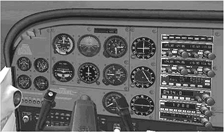

A game is more than just the sum of its rules. It must inter-act with the players to immerse them in the game world. To do this, it must project an aura of involvement that promotes Samuel Coleridge's "willing suspension of disbelief." Every element that the players' experience must contribute to the whole. From the moment the player loads the software and the first screen appears, he is in your world. Everything that he sees, hears, and feels from that point on—every audio, visual, and interactive element—must strive to convince him that the only thing that exists is the game. This is not the easiest of goals to achieve; any slight discord can jar the players out of their illusion. However, the best games generally achieve this level of perfection, or close to it, and the aim of this chapter is to discuss how you can attempt to account for deep player immersion in your designs.

游戏不仅仅是规则的总和。它必须与玩家互动，让玩家沉浸在游戏世界中。要做到这一点，游戏必须营造出一种参与的氛围，促进萨缪尔·柯勒律治的“心甘情愿地终止怀疑”。玩家体验的每一个元素都必须对整体有所贡献。从玩家加载软件和第一个屏幕出现的那一刻起，他就进入了你的世界。从那时起，他所看到、听到和感受到的一切，包括音频、视频和互动元素，都必须努力让他相信，唯一存在的就是游戏。这并不是最容易实现的目标；任何轻微的不和谐都会让玩家从幻觉中惊醒。然而，最好的游戏一般都能达到或接近这种完美的程度，本章的目的就是要讨论如何在你的设计中尝试让玩家深度沉浸其中。

This chapter discusses some of the most relevant aspects of user experience design (and note that by user experience, we're talking about the whole thing: audio, visual, and interaction methods) for games. Even though we have stressed the relative importance of flashy presentation as secondary to gameplay, we would be foolish to discard presentation entirely. The user interface is the first real glimpse the players will get of your game in action; it's your first chance to suck them into the world presented by your game.

本章将讨论与游戏用户体验设计（注意，我们所说的用户体验是指整个用户体验：音频、视觉和交互方法）最相关的一些方面。尽管我们已经强调华丽的外观相对于游戏性而言处于次要地位，但如果我们完全抛弃外观，那就太愚蠢了。用户界面是玩家真正了解游戏的第一印象，也是将玩家带入游戏世界的第一次机会。

The user interface can make or break your game: It can give it the perfect air of consummate professionalism or the shabby appearance of an amateur effort. Although we would prefer to believe that the gameplay is the most important factor in the success of a game, the majority of commercial evidence seems to indicate otherwise. With few exceptions, two games that are functionally equivalent, with equally effective marketing and differing only in the quality of their user interface layers, will not perform equally in the market. It would be tempting to say that the game with the most visually and technically stunning user interface would sell better—and we know that would please a lot of developers and artists out there—but, all things being equal, that is not the case. In fact, given these two functionally equivalent products, the one with the interface that is most fit for the purpose will be the most successful. (Of course, you can publish all manner of tripe if you have a big name license attached to it. Some things will never change.)

用户界面可以决定游戏的成败：它可以使游戏具有完美的专业水准，也可以使游戏看起来像业余爱好者的拙劣作品。尽管我们更愿意相信游戏的玩法是游戏成功的最重要因素，但大多数商业证据似乎表明并非如此。除了极少数例外情况，两款功能相当、营销效果相当、仅在用户界面层质量上存在差异的游戏，在市场上的表现并不相同。我们很容易说，用户界面视觉效果和技术含量最高的游戏会卖得更好——我们知道这会让很多开发者和艺术家感到满意——但在所有条件都相同的情况下，事实并非如此。事实上，在这两种功能相当的产品中，界面最符合目的的产品将是最成功的。(当然，只要有大牌授权，你就可以发布各种垃圾产品。有些东西永远不会改变）。

# What Is the User Experience? 什么是用户体验？

User experience: The term sounds suspiciously like a couple of strung-together buzzwords you'd expect to see on poor advertising copy. Obviously, that's an impression we'd rather dispel as quickly as possible, so let's attempt to "debuzzify" the term by describing exactly what we mean.

用户体验：这个术语听起来非常像是那种你在糟糕的广告文案中期望看到的一串流行术语的组合。显然，我们希望尽快消除这种印象，因此，让我们尝试通过描述我们的确切含义来“去流行化”这个术语。

We define the user experience as the total package presented to the player when she plays the game. It is the combination of three distinct areas of the design—the visual element, the audio element, and the interactive element—and is concerned with their impact on the user interface. The following sections give a brief précis of what we'll be covering in more detail.

我们将用户体验定义为玩家在玩游戏时所获得的整体体验。它是设计的三个不同领域——视觉元素、听觉元素和交互元素——的组合，并关注它们对用户界面的影响。以下章节简要介绍了我们将要详细介绍的内容。

> **NOTE 注意**
>
> To read more details on user experience, see The Elements of User Experience by Jesse James Garrett (© 2003 New Riders Publishing).
> 如需了解有关用户体验的更多详情，请参阅 Jesse James Garrett 所著的《用户体验要素》（© 2003 New Riders Publishing）。

## The Interactive Element 交互元素

The interactive part of the user experience is concerned with the way the player interacts with the game. This is tied in closely with the visual aspect but is more concerned with the "feel" part of "the look and feel." Here, we are concerned with the functional aspects of the user interface—the navigational pathways through the system—and the physical controller setup. How the interface looks is considered only as far as it affects the usability.

用户体验的互动部分涉及玩家与游戏的互动方式。这与视觉方面密切相关，但更关注“外观和感觉”中的 “感觉”部分。在这里，我们关注的是用户界面的功能方面——系统导航路径和物理控制器设置。界面的外观只有在影响可用性时才会被考虑。

## The Visual Element 视觉元素

The visual element concerns the "look" part of the "look and feel." Here, we consider the overall impact of the artwork and how it meshes and combines to present an overall consistent picture to the player. This is closely related to the interactive experience—one has a direct influence on the other—but we will attempt to discuss the areas separately and explain where there is crossover between the two.

视觉元素涉及“外观和感觉”中的“外观”部分。在这里，我们考虑美术作品的整体影响，以及它们如何相互融合，为玩家呈现出一个整体一致的画面。这与互动体验密切相关——一个直接影响另一个——但我们将尝试分别讨论这些领域，并解释二者之间的交叉点。

## The Audio Element 听觉元素

Often, the audio parts of a game are not considered in as much depth as the visual "in-your-face" areas of the game. However, audio is just as important for both atmosphere and player feedback as the visual components. Even though sound is often in third place after the visual and interactive elements, the fact that many games are unplayable without it clearly indicates the importance of sound. (Although, strictly speaking, no game should be designed that necessitates sound. That unfairly discriminates against the hearing impaired.)

通常情况下，人们对游戏声音部分的考虑不如对游戏“直观”部分的考虑那么深入。然而，声音对于游戏氛围和玩家反馈的作用与视觉部分同样重要。尽管声音往往排在视觉和互动元素之后，但许多游戏没有声音就无法玩下去，这清楚地表明了声音的重要性。(不过，严格来说，任何游戏的设计都不应该非要有声音不可。这是对听障人士的不公平歧视）。

# The Human-Computer Interface 人机接口

Designing a good user interface is not about how beautiful and whizzy you can make your buttons. In fact, the core essence of the user experience—enabling the player to interact with the game world—doesn't need any fancy graphics or sound. The functionality that allows a player to interact with the game effectively could theoretically be implemented using simple placeholder elements. In fact, while the interface is being designed, this is the recommended approach—it's faster, and more resource-efficient.

设计一个好的用户界面，并不在于你能把按钮做得多么漂亮、多么炫目。事实上，用户体验的核心本质——让玩家与游戏世界互动——并不需要任何华丽的图形或声音。理论上，只需使用简单的占位元素就能实现让玩家与游戏有效互动的功能。事实上，在设计界面时，我们推荐使用这种方法——它更快，也更节省资源。

As you may have already realized, we place more importance on the functional aspects of the user interface over the purely aesthetic aspects. Although we could argue that a perfectly functional user interface has a certain aesthetic appeal, we will not limit ourselves to this in our discussion. We would be foolish to completely disregard the aesthetic requirements—eye candy sells and certainly provides a more enjoyable, immersive experience—but they should be secondary to the functional aspects.

你可能已经意识到，我们更重视用户界面的功能性，而不是纯粹的美观性。虽然我们可以说，功能完善的用户界面也有一定的美感，但我们的讨论并不局限于此。如果我们完全无视美学方面的要求，那就太愚蠢了——眼球广告固然有卖点，固然能带来更愉悦、更身临其境的体验，但与功能方面相比，美学方面的要求应该是次要的。

> "When I am working on a problem, I never think about beauty. I only think about how to solve the problem. But when I have finished, if the solution is not beautiful, I know it is wrong."
> “当我研究一个问题时，我从不考虑美。我只考虑如何解决问题。但当我完成之后，如果解决方案不美，我就知道它是错的。”
> 
> —Buckminster Fuller, 1895-1983
> ——巴克敏斯特·富勒，1895-1983

The functionality of the user interface is the most important consideration. After all, what player is going to take the time to play a beautiful game if she can't figure out which exquisitely detailed picture is the button to start the game? Conversely, even with the most efficient user interface, few people will bother with the game if it's as ugly as sin.

用户界面的功能性是最重要的考虑因素。毕竟，如果玩家不知道哪张精致细腻的图片是启动游戏的按钮，又有哪个玩家会花时间去玩一款精美的游戏呢？反过来说，即使是最有效的用户界面，如果丑陋不堪，也很少有人会去玩这款游戏。

Consequently, the discussions in this chapter take on a dual aspect: First, and most important in our view, we will concentrate on the functionality of the user interface. After we have discussed the functional aspects, we will concentrate on the aesthetics, paying particular attention to making sure that the aesthetics do not impact the functionality. Note that pure physical beauty is not the primary meaning of aesthetics for a user interface. Fitness for purpose is a far more important aesthetic consideration. This doesn't necessarily exclude having a beautiful interface, but we do insist that there should be more to the beauty than mere appearances. A butterfly may be prettier than a rubber life raft, but which would you rather have with you on a stormy sea?

因此，本章的讨论具有双重意义：首先，也是我们认为最重要的一点，我们将集中讨论用户界面的功能。在讨论了功能方面的问题后，我们将集中讨论美观方面的问题，尤其要注意确保美观不会影响功能。请注意，纯粹的外形美并不是用户界面美学的主要含义。更重要的美学考虑因素是是否适合使用。这并不一定排除界面美观的可能性，但我们坚持认为，美观不应该仅仅停留在表面。蝴蝶可能比橡胶救生筏更漂亮，但在惊涛骇浪中，你更愿意选择哪一个呢？

## Evolution of the User Experience 用户体验的进化

In order to set a context for the discussion in this chapter, it will be worth our while to take a brief look at how the user experience has progressed over the last 20 or so years.

为了给本章的讨论提供一个背景，我们不妨简要回顾一下用户体验在过去 20 多年中的发展历程。

Twenty years ago, each game had a different interface, although usually there was some influence from other sources—console games, arcade games, and other games in the same genre. It wasn't until the advent of the windowed operating systems that any form of homogeny was achieved. Nowadays, we don't even think twice before using the mouse to navigate and clicking the mouse button to press an onscreen button. It's a de facto standard now (on the PC at any rate), but it used to be a novelty.

二十年前，每款游戏都有不同的界面，尽管通常会受到其他游戏来源——主机游戏、街机游戏和其他同类型游戏——的一些影响。直到窗口化操作系统的出现，才实现了任何形式的同质化。如今，我们在使用鼠标导航和点击鼠标键按下屏幕上的按钮之前，甚至都不会多想。现在，这已经成为一种事实上的标准（无论如何，在个人电脑上），但在过去，这是一种新鲜事物。

### Arcade Games 街机游戏

Initially, the game interface was simple. For arcade-style games, there would be a title screen with instructions (usually limited to a simple explanation of the controls) or a simple attract mode that cycled between two or three screens (title, instructions, and a high-score table). The game would remain in this state until the player pressed the Start button.

最初，游戏界面非常简单。对于街机类型的游戏，会有一个带说明的标题屏幕（通常仅限于简单的控制说明）或一个简单的吸引模式，在两个或三个屏幕（标题、说明和高分表）之间循环。游戏会一直保持这种状态，直到玩家按下“开始”按钮。

This soon evolved to include a fourth screen: the demo mode. For a small length of time (usually 30 seconds or so), a sequence was shown from the game in play, implemented either as a slide show of screens from various levels or as one of a selection of short snippets of gameplay.

这种模式很快发展到第四个屏幕：演示模式。在一段较短的时间内（通常为 30 秒左右），游戏会以不同关卡画面的幻灯片或精选的游戏片段的形式播放。

Once the game was started, the in-game interface was usually very simple (see Figure 6.1). The playing area would take up most of the screen. There would be a score display, a high-score display, a level display (if appropriate), and a "lives remaining" display. These would be placed at the top or bottom of the screen. And for many years, that was about the extent of the arcade game interface. Of course, there were subtle variations on this theme—for example, a power level meter in addition to or instead of a "lives remaining" display, and the odd bit of pertinent information specific to the game, such as "number of lines" in Tetris.

游戏开始后，游戏界面通常非常简单（见图 6.1）。游戏区域将占据屏幕的大部分。屏幕上会有分数显示、高分显示、关卡显示（如果合适）和“剩余生命”显示。这些都会放在屏幕的顶部或底部。多年来，这就是街机游戏界面的全部内容。当然，这个主题也有一些微妙的变化，例如，除了“剩余生命”显示外，还有一个能量等级表，以及一些游戏特有的相关信息，如俄罗斯方块中的“行数”。

Figure 6.1. The standard arcade game interface (Pac-Man Plus). 图 6.1. 标准的街机游戏界面（《吃豆人加强版》）

Williams's Defender (shown in Figure 6.2) was arguably the first game to enhance this core interface by adding a minimap; it was one of the first games with a playing area larger than the visible screen.

《威廉姆斯防卫者》（如图 6.2 所示）可以说是第一款通过添加小地图来增强核心界面的游戏；它也是第一批游戏区域大于可视屏幕的游戏之一。

Figure 6.2. Williams's Defender. 图 6.2. 《威廉姆斯防卫者》。

Without waxing too lyrically about the nostalgia value of this proto-interface, it has to be said that there was a certain purity of purpose present. All the information that the player needed to be able to play the game was there at a glance. Of course, it wasn't that difficult to achieve, either; the limitations of the format pretty much dictated that the games be fairly simple. Any homogeny of interface was the result of the fact that there were only a few sensible ways of displaying the same information. The real progress occurred when the player needed to be fed too much information to be displayed on the screen at once.

在不对这种原始界面的怀旧价值进行过多抒情的前提下，我们不得不说，它具有某种纯粹的目的性。玩家玩游戏所需的所有信息都一目了然。当然，要做到这一点也并不难；技术条件的限制几乎决定了游戏必须相当简单。界面的同质化是由于展示相同信息的方式本就寥寥无几。真正的进步发生在需要向玩家提供的信息量过多，无法一次性显示在屏幕上的时候。

Most arcade games are simple enough to be able to present all the necessary information on a single screen, and it's just as well that this is the case, because switching to an information screen in the middle of a fast-paced game is not a recipe for success. For those wanting to investigate some of these classic arcade games further, the MAME (Multiple Arcade Machine Emulator) web site, [www.mame.net](www.mame.net), is a good starting point.

大多数街机游戏都足够简单，能够将所有必要的信息展示在一个屏幕上，这种情况也正好合适，因为在快节奏游戏中间切换到信息屏幕并不是成功的做法。对于那些想要进一步探究这些经典街机游戏的人，[www.mame.net](www.mame.net)，是一个很好的起点。

Consider an example of interface evolution: the humble golf game. Presumably, you are familiar with the basics of golf: Take a stick, go for a walk, and hit a small ball toward a marginally larger hole with as much force as you possibly can. As enjoyable as that sounds, a good number of developers have injected even more fun into the sport by allowing you to simulate it while not moving from the front of your computer. Of course, golf has an element of skill in the aiming and timing of the swing. Walking from hole to hole is also an important part of real golf (socially speaking, anyway), but this would not translate well as a fun gameplay feature, and so it is usually skipped. Hence, it's a logical assumption that game designers made the actual swinging at and hitting of the ball the main focus of the game.

举一个界面进化的例子：不起眼的高尔夫球游戏。想必你对高尔夫球的基本原理并不陌生：拿着球杆，出去散步，然后用尽全力将一个小球击向一个稍大的洞。尽管这听起来很有趣，但许多开发者通过允许你在电脑前不移动就能模拟这项运动，为这项运动增添了更多乐趣。当然，高尔夫运动在瞄准和挥杆时机的把握上需要一定的技巧。从一个球洞走到另一个球洞也是真实高尔夫的重要组成部分（无论如何，从社交角度来说），但这并不能很好地转化为有趣的游戏功能，因此通常会被省略。因此，游戏设计者将实际挥杆击球作为游戏的重点也就顺理成章了。

In fact, taking a look at the rough lineage of golf games, it can be seen that this interface was perfected early on (around the time of the original Leaderboard golf game, shown in Figure 6.3) and has only had minor tweaks since then, ignoring the odd short-lived "revolution" that has occurred in the meantime. The first button click started the power meter rising, the second button click set the power (whereupon the meter indicator would begin to fall), and the third determined the accuracy of the shot; it had to be clicked when the indicator returned to the starting position. Getting it exactly right resulted in a perfect shot. Apart from the switch from keyboard to mouse or trackball, there has been very little modification to this system; it's the perfect interface for the golf game and has been relied upon since then. Even fairly recent games, such as the latest effort in the Links series of games, have stuck to this basic mechanic for gameplay. Even Golden Tee, the latest in a long series of golf games, uses a trackball-based evolution of this original interface.

事实上，纵观高尔夫游戏的发展历程，我们可以发现这种界面很早就已经完善（大约在最初的排行榜高尔夫游戏时期，如图 6.3 所示），此后只进行过微小的调整，而忽略了在此期间发生的短暂“革命”。第一个按钮点击后，力量表开始上升，第二个按钮点击后设置力量（此时力量指示器开始下降），第三个按钮点击后决定击球的准确性；必须在指示器回到起始位置时点击该按钮。准确无误的点击可获得完美的射击效果。除了从键盘到鼠标或轨迹球的转换之外，这个系统几乎没有任何改动；它是高尔夫游戏的完美界面，从那时起就一直沿用至今。即使是最近的游戏，如 Links 系列游戏中的最新作品，也一直沿用这一基本的游戏机制。即使是《黄金发球局》（Golden Tee）这款最新的高尔夫游戏，也使用了基于轨迹球的原始界面。

Figure 6.3. U.S. Gold's World Class Leaderboard. 图 6.3. 美国黄金协会的世界级排行榜。

This demonstrates an important point: Aside from the occasional flash of brilliance, the general progression of game interfaces has been an evolutionary, not revolutionary, one.

这说明了一个重要问题：除了偶尔的闪光点之外，游戏界面的总体发展一直是进化性的，而不是革命性的。

### Adventure Games 冒险游戏

Traditionally, adventure games were text-based. The player interacts with the system by reading a textual description of the location, and performing queries and actions based on that description.

传统上，冒险游戏以文本为基础。玩家通过阅读对地点的文字描述与系统互动，并根据描述进行提问和操作。

The first adventures took their input in a "verb-noun" format. That is, "Take Food" would work, whereas "Take the Food on the Table" would be rejected. Movement commands generally took the single-word form—Up, Down, North, East, South, West—and could be abbreviated to U, D, N, E, S, W, NW, NE, and so on.

最初的冒险游戏以“动词-名词”的格式输入。也就是说，“吃掉食物”可以，而“吃掉说张的食物”则会被拒绝。移动指令一般采用单字形式——上、下、北、东、南、西，也可以缩写为 U、D、N、E、S、W、NW、NE 等。

Adventure games used to be a popular and lucrative section of the games market. Over time, the sophistication of the parser allowed improvements in the nature of sentences usable with the games, and the quality of the writing correspondingly improved with the increasing capabilities of the target machines. Games such as The Hitchhiker's Guide to the Galaxy from Infocom (publishers of the original Zork series of games) and Fish! from Magnetic Scrolls are good examples. For the curious, a Java version of The Hitchhiker's Guide is available to play at Douglasadams.com (www.douglasadams.com/creations/infocomjava.html).

冒险游戏曾经是游戏市场上一个流行且利润丰厚的种类。随着时间的推移，解析器的复杂性使游戏中可使用的句子的性质得到了改善，而随着目标机器能力的不断提高，写作质量也相应提高。Infocom 公司（原 Zork 系列游戏的发行商）的《银河系漫游指南》和 Magnetic Scrolls 公司的《鱼！》就是很好的例子。对于好奇者来说，可以在 Douglasadams.com (www.douglasadams.com/creations/infocomjava.html) 上玩 Java 版本的《银河系漫游指南》。

Eventually, simple graphics appeared to help enliven the textual description. This improved the atmosphere to a degree, but also coincided with a general decrease in the quality of the writing. The designers relied more on the graphics (it's easier to draw a good picture than to craft good text) to tell the story, and the writing suffered correspondingly. The graphics tended to be presented in one of two forms: as either a full-screen image that was displayed briefly on entering a new location before clearing to allow the text to be displayed, or as a split-screen style, occupying a portion of the screen (usually the top half).

最终，简单的图形出现了，为文字描述增添了活力。这在一定程度上改善了气氛，但同时也导致了文字质量的普遍下降。设计者更多地依靠图形（画好图比写好文字更容易）来讲述故事，而文字则相应地受到了影响。图形往往以两种形式之一呈现：一种是全屏图像，在进入一个新地点时短暂显示，然后清除，以便显示文字；另一种是分屏样式，占据屏幕的一部分（通常是上半部分）。

Apart from general improvements to the parser, which is indirectly related to the quality of the game interface, this was the pinnacle of the adventure game interface. Today, text adventure games are not commercially viable, but they do live on in the form of MUDs (multiuser dungeons) and MUSHs (multiuser shared hallucinations). For those wanting to investigate MUDs and MUSHs further, a good place to begin is [www.mudcenter.com](www.mudcenter.com).

除了对解析器的一般改进（这间接关系到游戏界面的质量）外，这是冒险游戏界面的巅峰之作。如今，文字冒险游戏在商业上已经行不通了，但它们仍以 MUD（多用户地下城）和 MUSH（多用户共享幻觉）的形式存在着。如果你想进一步了解 MUD 和 MUSH，[www.mudcenter.com](www.mudcenter.com) 是一个不错的开始。

### Graphic Adventures 图形冒险

Graphic adventures are the spiritual successor to text adventures. Taking the maxim "a picture is worth a thousand words" as their rallying cry, designers began to take advantage of the increasing power of computers to create a fully graphical interface to the standard adventure game.

图形冒险是文字冒险的精神继承者。设计师们以“一图胜千言”为格言，开始利用日益强大的计算机功能，为标准的冒险游戏创建完全图形化的界面。

In many ways, this was unfortunate. We may lament the degradation of standards from the classic adventure game—similar to the preference of a significant portion of today's youth for watching cartoons over reading a good book—but we cannot argue with progress. Simply put, text adventures that required the player to type in their commands did not appeal to the consumer in the same way as a graphic adventure, which is, in effect, an interactive cartoon.

从很多方面来看，这都是不幸的。我们可能会感叹经典冒险游戏标准的退化——就像今天相当一部分年轻人喜欢看动画片而不是读一本好书一样——但我们不能反对进步。简而言之，需要玩家输入指令的文字冒险游戏对消费者的吸引力不如图形冒险游戏，后者实际上就是一部互动动画片。

That aside, the point-and-click interface of the graphic adventure has changed very little over the years since the first appearance of the genre. From the earliest Leisure Suit Larry games (shown in Figure 6.4) through the latest in the Monkey Island series (shown in Figure 6.5), the interface has remained pleasingly consistent. The interface to a graphic adventure is a fairly simple construct. Most graphic adventures are 2D or pseudo-3D (that is, they use 3D graphics in a 2D scene-oriented fashion, rather like a stage show), and consequently, only a relatively simple game interface is required.

撇开这一点不谈，图形冒险的点击式界面自该类型首次出现以来，多年来几乎没有什么变化。从最早的《休闲套装拉里》（如图 6.4 所示）到最新的《猴岛》系列（如图 6.5 所示），其界面一直保持着令人愉悦的一致性。图形冒险游戏的界面构造相当简单。大多数图形冒险游戏都是 2D 或伪 3D（即在 2D 场景中使用 3D 图形，就像舞台表演一样），因此只需要一个相对简单的游戏界面。

Figure 6.4. Leisure Suit Larry II. 图 6.4. 《休闲套装拉里二》。

Figure 6.5. Escape from Monkey Island. 图 6.5. 《逃离猴岛》。

There are two main paradigms for the interface that are currently in use. The first is the split-screen text- or icon-based interface, where the player selects actions in the selection area of the screen and watches the results in the results portion of the screen. An example of a game that uses this format is LucasArts's Maniac Mansion: Day of the Tentacle, shown in Figure 6.6.

目前使用的界面主要有两种模式。第一种是基于文本或图标的分屏界面，玩家在屏幕的选择区选择操作，并在屏幕的结果区观看结果。LucasArts 公司的《疯狂时代》就是采用这种形式的游戏，如图 6.6 所示。

Figure 6.6. Maniac Mansion: Day of the Tentacle. 图 6.6. 《疯狂时代》

The second paradigm, used by such games as Myst (shown in Figure 6.7), uses the whole screen as the interface. The player moves the cursor around the screen and clicks on objects or characters of interest. In this way, the story is visually progressed by player interaction. What this format loses in flexibility over the first system, it gains in atmosphere and immersion.

第二种模式在《神秘岛》等游戏中使用（如图 6.7 所示），它将整个屏幕作为界面。玩家在屏幕上移动光标，点击感兴趣的物体或人物。通过这种方式，玩家的互动使故事在视觉上得以推进。与第一种系统相比，这种形式在灵活性方面有所欠缺，但在氛围和沉浸感方面却有所增强。

Figure 6.7. Myst. 图 6.7. 《神秘岛》

We are not going to include games such as Ion Storm's Deus Ex in the category of adventure games. The action quotient in that game is too high to warrant inclusion, and we would prefer to class games of this type as a union of first/third-person shooters and role-playing games (even though it is a close call to make). Adventure games, on the other hand, are typically thought of as games that require pure thought and logic, and little in the way of reflexes. Thus, the game interface for the graphic adventure does not have speed as one of its main priorities, instead focusing on clarity of use.

我们不会将离子风暴公司的《杀出重围》等游戏列入冒险游戏类别。该游戏的动作性太高，不值得列入，我们更倾向于把这类游戏归类为第一/第三人称射击游戏和角色扮演游戏的结合体（尽管这是个很接近的决定）。另一方面，冒险游戏通常被认为是需要纯粹思考和逻辑的游戏，几乎不需要反应能力。因此，图形冒险游戏的游戏界面并不以速度为主要考虑因素，而是以清晰易用为重点。

### Role-Playing Games 角色扮演游戏

Role-playing games (RPGs), for the most part, have had roughly the same user interface since day one. This isn't necessarily a good thing. In fact, there is a lot about the standard role-playing game interface that we do not like, but aside from incremental improvements, it seems to be a case of using what works well enough, although a notable exception is the starting interface for Morrowind. Your character is defined by your responses to questions posed by interactive characters in the opening part of the game.

角色扮演游戏（RPG）从诞生之日起，其用户界面大多大致相同。这未必是件好事。事实上，标准的角色扮演游戏界面有很多我们不喜欢的地方，但除了渐进式的改进之外，似乎都是用什么好用就用什么，不过《摩罗大陆》的起始界面是个明显的例外。你的角色是由你对游戏开头部分互动角色所提问题的回答来定义的。

The generic role-playing game interface comes in three sections: the character generation screen, the in-game screen, and the inventory screen. These do not seem to have changed much since the inception of the genre, but their forms have been modified and refined somewhat.

一般的角色扮演游戏界面分为三个部分：角色生成界面、游戏内界面和物品界面。自这一类型游戏诞生以来，这些界面似乎没有太大变化，但其形式却有了一些修改和完善。

Take, for example, an early role-playing game. Out of the Shadows from Mizar Software was released for the Sinclair Spectrum in 1984. Figure 6.8 shows the main game and character generation screen of this game. Pay particular attention to the character attributes on the right of the screen.

以早期的角色扮演游戏为例。Mizar Software 公司的《走出阴影》于 1984 年在 Sinclair Spectrum 上发布。图 6.8 显示了这款游戏的主游戏和角色生成界面。请特别注意屏幕右侧的角色属性。

Figure 6.8. Out of the Shadows main game and character screen. 图 6.8. 《走出阴影》的主游戏和角色界面。

Now contrast this with the character generation screen from a more recent game, such as Black Isle Studio's Planescape: Torment, as shown in Figure 6.9.

现在将其与黑岛工作室的《异域镇魂曲》，如图 6.9 所示。

Figure 6.9. Planescape: Torment character generation screen. 图 6.9. 《异域镇魂曲》的角色生成界面。

Apart from the huge differences in the quality of the artwork and the capabilities of the target platforms, these screens are scarily similar in function. Sure, there are a few bells and whistles added to the latter example, but fundamentally, the functionality hasn't really changed in the 16 years between the two games. Note that we feel that Planescape: Torment is an excellent game, and we are not trying to imply otherwise by singling it out for our example. We merely want to illustrate how the basic character generation interface has not changed in functionality over the years.

除了美工质量和目标平台功能上的巨大差异外，这些屏幕在功能上的相似度也高得惊人。当然，后一个例子增加了一些功能，但从根本上说，两款游戏的功能在 16 年间并没有什么变化。请注意，我们认为《异域镇魂曲》是一款优秀的游戏，我们将它单独作为例子并不是想暗示其他方面。我们只是想说明，基本的角色生成界面多年来在功能上没有任何变化。

You may be of the school of thought that believes this lack of change is a good thing. After all, it's a system that's been in use since the advent of paper-and-pencil role-playing games in the '70s. However, our view is different. Why use numbers at all in the game interface? They were a necessity in the paper-and-pencil role-playing games, but what a computer is very good at is dealing with numbers. Why bother the player with them? Having "Saving Roll +1" flash up onscreen when we've just dealt a mighty blow to a zombie does nothing except remind us that we're playing a dry game of statistics with some pretty graphics slapped on top. We know that this argument has been used before, and that some players actually prefer to deal with numbers—after all, it does allow the players to know exactly where they stand in the game. However, wondering how high your hit-points are while smiting a zombie jars your suspension of disbelief. Let those players who want to deal with numbers have them, but make them an option in the game. If you need to display numbers (maybe for the sake of accuracy), then at least display them as labels on some sort of bar chart or other graphical representation. To be fair, though, the user interface of Planescape: Torment does allow some limited hiding of the numbers, borrowing the technique of displaying graphical power bars from other genres, which is a neat way of sidestepping the problem.

你可能会认为这种不改变是件好事。毕竟，这是自 70 年代纸笔角色扮演游戏问世以来就一直在使用的系统。然而，我们的观点有所不同。为什么要在游戏界面中使用数字？在纸笔角色扮演游戏中，数字是必需品，但电脑最擅长的就是处理数字。为什么要让玩家费心呢？当我们刚刚给僵尸致命一击时，屏幕上就会闪现“豁免检定+1”的字样，这只会提醒我们，我们在玩的是一个干巴巴的统计游戏，上面还加了一些漂亮的图形。我们知道，这种说法以前也有人用过，而且有些玩家实际上更喜欢与数字打交道，毕竟它能让玩家清楚地知道自己在游戏中的位置。然而，在打击僵尸的同时还想知道自己的生命值有多高，会让你的信任感大打折扣。让那些想与数字打交道的玩家拥有它们，但让它们成为游戏中的一个选项。如果需要显示数字（也许是为了准确），那么至少要在某种条形图或其他图形上以标签的形式显示。不过公平地说，《异域镇魂曲》的用户界面确实允许对数字进行有限的隐藏，借鉴了其他类型游戏中显示图形化能量条的技术，这是一种巧妙地规避问题的方法。


“Saving Roll +1”是龙与地下城中，角色进行豁免判定的计算规则。


### Strategy and War Games 策略和战争游戏

Like their cousin, the role-playing game, strategy and war games have their roots in board games. Hence, early efforts were often heavy on the numbers and played almost exactly like a computer-controlled board game. One of the first breakthrough titles that heralded the roots of the more accessible arcade-strategy genre was a title released for the Sinclair Spectrum back in 1984, called Stonkers (see Figure 6.10). This game presented simulated war in a more accessible arcade-influenced format and is arguably the very first RTS (real-time strategy) war game, introducing many of the concepts that are familiar in today's RTS and strategy games.

与角色扮演游戏一样，战略和战争游戏也源于棋盘游戏。因此，早期的游戏往往数字繁多，玩法几乎与电脑控制的棋盘游戏一模一样。早在 1984 年，一款名为《Stonkers》（见图 6.10）的游戏在 Sinclair Spectrum 上发布，这是第一款具有突破性意义的游戏，预示着更容易上手的街机策略类游戏的诞生。这款游戏以一种更容易上手的街机形式展示了模拟战争，可以说是第一款 RTS（即时战略）战争游戏，它引入了当今 RTS 和战略游戏中许多耳熟能详的概念。


Sinclair Spectrum是1982年由 Sinclair 公司生产的一款8位个人电脑。


Figure 6.10. Stonkers. 图 6.10. Stonkers

More recent RTS games (such as Sudden Strike, shown in Figure 6.11), classic strategy games (such as Civilization III, shown in Figures 6.12 and 6.13), and the more traditional war games (such as Sid Meier's Gettysburg, shown in Figure 6.14) have a similar user experience—at least at a superficial level. All games of this type are concerned with the same basic set of actions: controlling large groups of units to solve a goal that could not be achieved by one unit alone. Of course, once you go beyond this superficial level, there is some variance in the user interface; for example, Civilization III has a diplomatic and city control interface that handles specific decisions at a wider level than those simply concerned with unit- and group-level decisions.

较新的 RTS 游戏（如图 6.11 所示的《突袭》）、经典的策略游戏（如图 6.12 和 6.13 所示的《文明 III》）以及较传统的战争游戏（如图 6.14 所示的《盖茨堡战役》）都有类似的用户体验——至少在表面层面上是如此。所有这类游戏都涉及相同的基本操作：控制大群单位来实现一个单个单位无法实现的目标。例如，《文明 III》中的外交和城市控制界面就在更广的层面上处理具体的决策，而不仅仅是单位和群体层面的决策。

Figure 6.11. Sudden Strike. 图 6.11. 《突袭》

Figure 6.12. Civilization III in-game interface. 图 6.12. 《文明 III》游戏界面。

Figure 6.13. Civilization III foreign advisory interface. 图 6.13. 《文明 III》 外交顾问界面。

Figure 6.14. Sid Meier's Gettysburg. 图 6.14. 《盖茨堡战役》。

Because of its universal nature, the unit- and group-based interface has evolved to allow the player to control these groups easily. Games such as Blizzard's Warcraft and Westwood's Command and Conquer series have helped define the standard interface for RTS games that most games now follow. Left-clicking to select a unit, and then right-clicking on an object to select a context-sensitive action for the unit to perform on that object, have become familiar actions for most RTS gamers. More recently, the ability to click-drag select a group of units (a method borrowed directly from the Windows operating system) has been added to the repertoire.

由于其通用性，以单位和群体为基础的界面已经发展到可以让玩家轻松控制这些群体。暴雪公司的《魔兽争霸》和西木公司的《命令与征服》系列等游戏改良了 RTS 游戏的标准界面，现在大多数游戏都遵循这一标准。左键单击选择一个单位，然后右键单击一个对象，选择一个上下文相关的操作，让该单位对该对象执行操作，这已经成为大多数 RTS 游戏玩家熟悉的操作。最近，单击-拖动选择一组单位的功能（直接从 Windows 操作系统中借用的方法）也被加入到了游戏中。

However, as these games have become more complex, ways of managing that complexity become needed. This has prompted a divergence in the interfaces, especially with respect to the camera control mechanisms in those games that give the player control of the camera (although why the player would want to control the camera is beyond us—except in special situations, that should be a job for the computer).

然而，随着这些游戏变得越来越复杂，就需要有管理这种复杂性的方法。这就促使游戏界面出现了分化，尤其是那些让玩家控制摄像机的游戏中的摄像机控制机制（虽然我们不明白玩家为什么要控制摄像机——除非在特殊情况下，否则这应该是电脑的工作）。

Strategy games and war games are characterized by the strategic-level decisions the player is required to make. Consequently, the interface has to allow the player to make these strategic decisions. Note that a lot of these games (for better or worse) also include a fair amount of micromanagement of individual units, usually in the form of giving orders or training. This micromanagement is usually handled by a contextual iconic interface.

战略游戏和战争游戏的特点是要求玩家做出战略层面的决定。因此，游戏界面必须允许玩家做出这些战略决策。需要注意的是，很多这类游戏（无论好坏）还包括对单个单位的大量微观管理，通常是以下达命令或进行训练的形式。这种微观管理通常由上下文图标界面来处理。

In order to be an effective interface, it has to seamlessly handle three levels of abstraction: grand strategy (as in Figure 6.13), group and unit navigation (as in Figure 6.14), and unit micromanagement (as in Figure 6.15). Not all these levels are necessarily present, depending on the strategic slant of the game. As a general rule, RTS games tend to focus on the latter two levels, group and unit navigation and unit micromanagement. More serious war games tend to use all three levels, usually with a focus on the grand strategic and the group and unit navigation levels. Pure strategy games (akin to computer-controlled board games), such as Risk (shown in Figure 6.16), focus on the grand strategic level, with varying levels of usage of the latter two levels. Of course, the best of these games allow the player to choose to what level he wants to involve himself—from the overseeing dictator figure all the way down to the bean-counting micromanager, and anywhere in between. Sid Meier's Civilization series of games are excellent in their use of the computer to handle such menial tasks at the player's request.

为了成为一个有效的界面，它必须无缝处理三个抽象层次：大战略（如图 6.13）、群体和单位导航（如图 6.14）以及单位微观管理（如图 6.15）。根据游戏的战略倾向，不一定所有这些层次都会出现。一般来说，RTS 游戏往往侧重于后两个层次，即群体和单位导航以及单位微观管理。更严肃的战争游戏则倾向于使用所有三个层面，通常侧重于大战略层面以及群体和单位导航层面。纯战略游戏（类似于计算机控制的棋盘游戏），如《风险》（如图 6.16 所示），侧重于大战略层面，对后两个层面的使用程度各不相同。当然，这些游戏中的佼佼者可以让玩家选择让自己参与到哪个层次——从总揽全局的统治者一直到精打细算的微观管理者，以及两者之间的任何层次。席德·梅尔的《文明》系列游戏就很好地利用了电脑，按照玩家的要求处理这类琐碎的任务。

Figure 6.15. Starcraft's unit micromanagement interface. 《星际争霸》的单位微观管理界面。

Figure 6.16. Risk. 图 6.16. 风险

The more serious war games, which have traditionally been rather dry in their presentation, have started to use a number of these more "gamer-friendly" techniques. Previously, these games have focused on the accuracy of the war simulation, rather than any presentational niceties, and generally, that suited the players of these games perfectly. However, in order to attract new players, designers have learned lessons from the more accessible RTS-style games, which in turn were derived from the need to make war games more accessible to the average gamer. Nowadays, the hard-core war games are, in many cases, virtually indistinguishable from the RTS games that they initially inspired.

较严肃的战争游戏在表现形式上历来比较枯燥，现在已开始使用一些更“玩家友好”的技术。以前，这些游戏的重点是战争模拟的准确性，而不是任何精美的表现形式，一般来说，这非常适合这些游戏的玩家。然而，为了吸引新玩家，设计师们从更容易上手的 RTS 类型游戏中吸取了经验教训，而这些经验教训又是为了让普通玩家更容易上手战争游戏。如今，在许多情况下，硬核战争游戏与最初受其启发的 RTS 游戏几乎没有区别。

# Components of the User Experience 用户体验的组成部分

So far, we've briefly covered a potted history of the user experience and how it has been implemented in game development. The trend has been toward increasing complexity and detail scaling with the capabilities of the hardware and the increasing sophistication of the game design. As the games become more complex, the required interface for the game has also become more complex. The only games that are released nowadays that use the original up/down/left/right/fire paradigm tend to be remakes of the old classics, such as the remake of Ms. Pac-Man, shown in Figure 6.17.

到目前为止，我们已经简要介绍了用户体验的历史以及如何在游戏开发中实现用户体验。随着硬件能力的提高和游戏设计的日益复杂，游戏的复杂性和细节也呈上升趋势。随着游戏变得越来越复杂，游戏所需的界面也变得越来越复杂。现在发行的游戏中，只有一些使用原始的上/下/左/右/射击模式的游戏通常是经典老游戏的重制版，如图 6.17 所示的《吃豆人女士》的重制版。

Figure 6.17. Ms. Pac-Man: Quest for the Golden Maze. 图 6.17. 《吃豆人女士：探索黄金迷宫》。

This increase in complexity is not just limited to the software. As the presentation layer has become more complex, so has the equipment needed to control it. Take a look at Figure 6.18.

复杂性的增加不仅限于软件。随着演示层变得越来越复杂，控制演示层所需的设备也变得越来越复杂。请看图 6.18。

Figure 6.18. Past to present: The Atari 2600 joystick versus the GameCube controller (not to scale). 图 6.18. 从过去到现在：雅达利 2600 操纵杆与 GameCube 控制器的对比（未按比例）。

The left-hand picture shows an Atari 2600 joystick. This joystick (circa 1977) was the pinnacle of home entertainment controllers in its day. What you see is what you get: one eight-directional digital stick and a single fire button. Compare it to the Nintendo GameCube controller on the right. This is arguably the most advanced (and well-designed) game controller to date. Take a look at what you get: three directional sticks (two analog and one eight-directional digital) and eight fire buttons. Clearly the sort of games that you can play with the GameCube controller will allow for a much finer degree of finesse in control than possible with the old Atari joystick. Of course, as with all evolution, there were dead-end branches—anyone actually use the Nintendo Power Glove or the Cheetah R.A.T.?

左图是雅达利 2600 游戏杆。这款游戏杆（约 1977 年）是当时家庭娱乐控制器的巅峰之作。所见即所得：一个八方向数字摇杆和一个发射按钮。将其与右侧的任天堂 GameCube 控制器进行比较。这可以说是迄今为止最先进（设计最精良）的游戏控制器。看看你能得到什么：三个方向摇杆（两个模拟摇杆和一个八方向数字摇杆）和八个发射按钮。很明显，使用 GameCube 控制器玩的游戏比使用老式雅达利操纵杆玩的游戏要精细得多。当然，就像所有的进化一样，也会有死胡同——有人真正用过任天堂的“强力手套”或“猎豹 R.A.T.”吗？

With this increase in complexity—both in hardware and software—comes a need for a more sophisticated approach to the user experience. It's not like it was in the old days, where the game was the interface. Today's gamers call out for a higher degree of sophistication and complexity, but paradoxically they want it simpler and easier to use than ever before. And they want the whole experience: sound, visuals, and ease of use in a nice simple package. No longer will they accept simple beeps and blips and the odd screen flash. Now they want CD-quality sound, dynamic music, and visuals that could be exhibited in an art and design museum. And if we don't provide them with what they want, we're in big trouble. Of course, it's not always easy, but perseverance pays off. As Edison put it:

随着硬件和软件复杂性的增加，用户体验需要更复杂的方法。这与过去不同，过去游戏就是界面。今天的游戏玩家需要更复杂的界面，但矛盾的是，他们希望界面比以前更简单、更易用。他们希望获得完整的体验：声音、视觉效果和简单易用。他们不再接受简单的哔哔声、闪烁声和奇怪的屏幕闪光。现在，他们需要的是 CD 音质、动感音乐和可在艺术和设计博物馆展出的视觉效果。如果我们不能满足他们的需求，我们就会有大麻烦。当然，这并不总是那么容易，但坚持就会有回报。正如爱迪生所说：

> "I haven't failed. I've found 10,000 ways that won't work."
> “我没有失败过。我找到了一万种行不通的方法。”
> 
> \- Thomas Alva Edison, 1847-1931
> \- 托马斯·阿尔瓦·爱迪生，1847-1931 年

## The Interactive Element 互动元素

Aside from all the glitz and glamour, the main function of a user interface is to allow the player to play the game. From a purist point of view, that is its primary purpose. All else is secondary. We've lost count of the number of games we've played that have forgotten this simple rule. In these games, various interactivity problems prevent them from showing their true promise; the interface actually gets in the way of playing the game.

除了华丽的外表，用户界面的主要功能是让玩家玩游戏。从纯粹主义者的角度来看，这是它的主要目的。其他都是次要的。在我们玩过的游戏中，有多少忘记了这一简单规则，我们已经数不清了。在这些游戏中，各种交互性问题阻碍了它们展现真正的潜力；界面实际上妨碍了游戏的进行。

There are a couple of main ways in which this occurs. The first is that the interface is overly graphically obscure. The actual navigational pathways through the interface may be fine, and it may be a work of art by many standards, but if the player can't easily figure out how to perform the tasks required to play the game, that beauty is for nothing. Obscurity through artistic overenthusiasm is probably the most common reason for interface failure.

出现这种情况主要有几种途径。首先是界面的图形过于模糊。界面的实际导航路径可能很好，而且按照许多标准来说可能是一件艺术品，但如果玩家不能轻松地找到如何执行游戏所需的任务，那么这种美就白费了。过度追求艺术而导致的不完美可能是界面失败的最常见原因。

Another common problem that can occur in combination with or separately from the previous problem is an overly complex interface. Here, the player is overwhelmed by a vast wall of options and just does not know where to start. This problem occurs more often in the strategy end of the spectrum, rather than in the more "in-your-face" action games.

另一个常见问题是过于复杂的界面，它可能与前一个问题同时出现，也可能单独出现。在这种情况下，玩家会被大量的选项所淹没，不知从何下手。这种问题更多出现在策略类游戏中，而不是更“直面”的动作类游戏中。

The converse of this is the overly simplistic interface. The choices available to the player are so limited, it restricts the gameplay to an "on-rails" experience. This particular flaw is not restricted to any particular genre. It is more commonly found in products that have been underdesigned or rushed through production. Often, the initial design was well fleshed out, but omissions and shortcuts taken during development left a hollow skeleton of the original game. We will be discussing these—and other—problems in the next few sections.

与此相反的是过于简单的界面。玩家的选择非常有限，这就把游戏的玩法限制在了“轨道式”体验上。这种缺陷并不局限于任何特定类型的游戏。它更常见于设计不足或仓促生产的产品。通常情况下，最初的设计是很充实的，但在开发过程中出现的疏漏和走的捷径使最初的游戏骨架变得空洞。我们将在接下来的几节中讨论这些问题以及其他问题。

### Navigation 导航

Designing a user interface is not a trivial process. It's not just a simple matter of slapping a few buttons together and hoping for the best. The best approach (as with a lot of things) is to plan out everything on paper first.

设计用户界面并非易事。它不是简单地把几个按钮拼凑在一起，然后就能达到最佳效果。最好的办法（就像很多事情一样）是先在纸上规划好一切。

Using graph paper, plot out a rough design for the user interface. It does not need to be artistic, but it should be an accurate flowchart of the main elements and menus required.

用绘图纸绘制出用户界面的大致设计图。它不需要很精美，但应该是所需主要元素和菜单的精确流程图。

The important thing is to get it down on paper as early as possible in the game design process. Often, putting things on paper can crystallize your ideas and help stimulate new ones. Making sure everything works on paper can often help ensure consistency. When playing an otherwise good game, nothing jars more than interface non-sequiturs.

重要的是在游戏设计过程中尽早把想法写在纸上。通常情况下，把想法写在纸上可以使你的想法具体化，并有助于激发新的想法。在纸上确保一切正常通常有助于确保一致性。在玩一款原本很好的游戏时，没有什么比界面不连贯更让人头疼的了。

Bear in mind that you shouldn't feel that you are restricted to paper alone. There are plenty of good tools that allow decent interface prototyping, including graphics and sound, with minimal programming required. Macromedia Flash is one such tool, and—if you are willing to get your hands dirty with a little code—other game-making tools such as Blitz Basic ([www.blitzbasic.com](www.blitzbasic.com)) will let you knock up a prototype interface.

请记住，你不应该觉得自己只能在纸上进行创作。有很多好的工具可以让你用最少的程序设计出包括图形和声音在内的漂亮界面原型。Macromedia Flash 就是这样一种工具，如果你愿意动手写点代码，Blitz Basic ([www.blitzbasic.com](www.blitzbasic.com)) 等其他游戏制作工具也能让你制作出界面原型。


[Macromedia Flash](https://en.wikipedia.org/wiki/Adobe_Flash)，被 Adobe 公司收购，现在已停产。


### Screen Layouts 屏幕布局

Balancing between screen real estate and accessibility is a difficult but important task in user interface design. Ten years ago, technical issues were often a consideration; for example, Ultima Underworld had a relatively small game area, simply because the machines that it was designed to run on could not handle filling a full screen with texture-mapped polygons and scalable sprites. Thankfully, those days are behind us for the most part, and nowadays technical considerations are low on the list when we consider how much screen real estate to devote to the window on the game world. Except in the case where resolution is a fixed quantity, the only technical issue that rears its head nowadays is which screen resolution (or range of resolutions) to choose.

在屏幕空间和可访问性之间取得平衡是用户界面设计中一项困难而又重要的任务。十年前，技术问题往往是一个考虑因素；例如，《地下创世纪》的游戏区域相对较小，原因很简单，因为设计该游戏的机器无法用纹理映射多边形和可缩放精灵来填充整个屏幕。值得庆幸的是，那个时代已经离我们远去，如今，当我们考虑在游戏世界的窗口上占用多少屏幕空间时，技术方面的考虑已经不重要了。除了分辨率是一个固定量的情况外，如今唯一的技术问题就是选择哪种屏幕分辨率（或分辨率范围）。

The screen layout delineates the primary purpose of various regions of the screen at a high level. It's important to get this decided upon as quickly as possible and then stick to that format where applicable throughout the game. Switching between screen layouts during play—particularly if the actual world window is shifted around—adds nothing to a game except momentary disorientation for the players.

屏幕布局高度概括了屏幕各区域的主要用途。重要的是要尽快确定这一点，然后在整个游戏过程中坚持使用这种格式。在游戏过程中切换屏幕布局，尤其是如果实际的世界窗口发生了移动，除了会让玩家一时迷失方向外，不会给游戏带来任何好处。

The overriding guideline here is the KISS principle—or "Keep It Simple, Stupid." Keep the layout of the screen simple. Don't bother with lots of fiddly little overlays. Group all similar functionality together. That way, the player can take in the information she needs in a single glance, rather than having to roam all over the screen to gather the information she requires.

这里的首要准则是 KISS 原则，即“保持简单，傻瓜”。保持屏幕布局简单。不要使用大量繁琐的小叠加。将所有类似的功能组合在一起。这样，玩家只需扫视一眼，就能获得所需的信息，而不必为了收集所需的信息而满屏游走。

The human eye does not see consistently throughout its field of vision. There is an area immediately in the center of your field of vision where you see with the maximum amount of detail. This central vision area, the macula, is geared up to take in the visual information at the highest-possible resolution. The peripheral vision of a human does not sense the same amount of detail as the macula, but it is geared for detecting movement and change. If something changes in your peripheral vision, your first instinct is to turn and focus on the area concerned, to scrutinize it in more detail. This instinct can be exploited to focus the players' attention on an indicator if some important happening that they need to know about has occurred.

人眼在整个视野中的视力并不一致。在视野的中心，有一个区域能让你看到最多的细节。这个视觉中心区域，即黄斑区，以尽可能高的分辨率接收视觉信息。人的外围视觉感受不到与黄斑区相同的细节，但它可以检测运动和变化。如果你的外围视觉发生了变化，你的第一本能就是转动眼球来关注相关区域，仔细观察它的细节。如果玩家需要了解某些重要事件的发生情况，就可以利用这种本能将玩家的注意力集中到指示器上。

During our research for this chapter, we examined more than 2,000 screen captures of games, from the '80s right up to the present day. During that investigation, we noticed that there appear to be only nine main screen layouts used (not counting all of the symmetric variations thereof). These are shown in Figure 6.19. The gray area indicates status and other informational panels, and the white is the play area. Any one of these would make a good start for the layout of your user interface. We also noticed that the vast majority of screens we examined placed the most crucial information on the bottom-left quadrant of the screen. This is probably because the human eye is thought to focus on that particular area of the screen more than any other, which may have subconsciously influenced the layout design somewhat. Another important issue to consider is the changing demographic of game players. Older people are playing games now, and we hope this trend will increase as games become more accepted as a mainstream form of entertainment. As the human brain ages, it becomes less and less able to discern events that occur in the peripheral vision region, and becomes much slower at processing complex information too quickly. A too-complex interface will lose you an increasingly broad share of the market if you fail to find a way to appeal across the ever-widening demographic field.

在本章的研究过程中，我们检查了 2000 多张从 80 年代至今的游戏屏幕截图。在调查过程中，我们注意到似乎只有九种主要的屏幕布局（不包括所有的对称变体）。如图 6.19 所示。灰色区域为状态和其他信息面板，白色区域为游戏区域。其中任何一个都可以作为用户界面布局的良好开端。我们还注意到，我们检查的绝大多数屏幕都将最关键的信息放在屏幕的左下方。这可能是因为人们认为人眼会更多地关注屏幕的这一特定区域，这可能在一定程度上潜移默化地影响了布局设计。另一个需要考虑的重要问题是游戏玩家人口结构的变化。现在有老年人在玩游戏，我们相信随着游戏被更广泛地接受为主流娱乐方式，这一趋势会一直增长。随着年龄的增长，人脑分辨外围视觉区域事件的能力会越来越弱，处理复杂信息的速度也会越来越慢。如果你不能找到一种方法来吸引不断扩大的老年人群，过于复杂的界面将使你失去越来越多的市场份额。

Figure 6.19. Layouts. 图 6.19. 布局。

Note that we are certainly not claiming that these are the only layouts that have ever been used—if you find any other layouts in common use (not including those that are restricted because of technical considerations), feel free to email the authors, and we'll add them to the list.

请注意，我们当然不是说这些是唯一使用过的布局——如果你发现任何其他常用的布局（不包括因技术考虑而受限制的布局），请随时给作者发邮件，我们会将它们添加到列表中。

### Meeting Expectations 满足期望

Originality is an important consideration, but not at the expense of other considerations. In fact, originality in general is to be much applauded—there is precious little remaining in the industry at the moment. However, there is a time and a place for originality, and the user interface is generally neither.

原创性是一个重要的考虑因素，但不能以牺牲其他因素为代价。事实上，原创性在总体上是值得称赞的——目前该行业中的原创性已所剩无几。不过，原创也有其存在的时间和地点，而用户界面通常都不是。

Although you will want your player to be amazed by the stunning originality of your gameplay, you most certainly do not want him to be amazed by the stunning originality of the control method and user interface. This is one place where the player will be happy to see the "same old, same old." Stick to what the player knows. If the standard method for controlling a first-person shooter works well enough, then use it. Don't foist a new one on the unsuspecting player. The player has a lot to learn when beginning to play a new game, and only a limited amount of time he will be willing to spend on it.

虽然你希望玩家为你游戏的惊人创意而惊叹，但你肯定不希望他为控制方法和用户界面的惊人创意而惊叹。在这里，玩家会乐于看到“一成不变”。坚持玩家所熟悉的。如果第一人称射击游戏的标准控制方法足够好用，那就使用它。不要把新方法强加给毫无戒心的玩家。当玩家开始玩一款新游戏时，他需要学习的东西很多，而他愿意花在这上面的时间有限。

Our discussion will focus on the PC. Of course, there were games on other machines before then, but little progress was made in the development and design of user interfaces until the advent of Microsoft Windows and Mac OS (derived from the original Xerox research). Upon the rise of graphical operating systems, we started seeing some real progress in game interfaces and the beginning of the informal standardization efforts. Back in the bad old days of DOS, the interfaces for games differed radically from the interface for the more standard type of application, mainly because games had some form of graphics and business applications did not, but also because there was no standard for business application user interfaces. Every application (such as WordPerfect, QuickBasic, and so on) had a different way of interfacing with the user. There were no real standardization efforts and, consequently, no common ground on which to base a core game interface.

我们将重点讨论 PC。当然，在此之前其他机器上也有游戏，但在微软 Windows 和 Mac OS（源自施乐公司的原始研究）出现之前，用户界面的开发和设计几乎没有进展。随着图形操作系统的兴起，我们开始看到游戏界面取得了一些真正的进展，并开始了非正式的标准化工作。在 DOS 的糟糕时代，游戏界面与更标准类型的应用程序界面大相径庭，这主要是因为游戏有某种形式的图形，而商业应用程序没有，还因为商业应用程序用户界面没有标准。每个应用程序（如 WordPerfect、QuickBasic 等）都有不同的用户界面。没有真正意义上的标准化工作，因此也就没有核心游戏界面的共同基础。

Unless your game is one that the players have been specifically waiting for, they won't spend too much time trying to figure out an unintuitive or noncooperative interface. And in the event that you do feel the need to inflict a brand-new interface on players (maybe it genuinely is an improvement and is sufficiently different so as to create a whole new learning curve), make sure that you provide a fallback position so that the players can switch to the "classic" interface if they prefer. Another important thing related to user interface is to make sure it doesn't take too many steps to do things. Any game that requires you to click several times and type in something every time you need to save the game is really annoying.

除非你的游戏是玩家们翘首以盼的，否则他们不会花太多时间去琢磨一个不直观或不合作的界面。如果你觉得有必要给玩家带来一个全新的界面（也许它确实是一种改进，而且有足够的不同，以至于产生了一个全新的学习曲线），请确保你提供了一个后备位置，以便玩家可以根据自己的喜好切换到“经典”界面。与用户界面有关的另一个重要问题是，要确保做事情不需要太多步骤。任何一款游戏，如果每次需要保存游戏时都需要点击几次并输入一些内容，那就真的很烦人了。

Generally, the only case where an interface should break expectations is if a significant improvement on the status quo can be made. Interface improvements are evolutionary, not revolutionary, so they can be introduced pretty much with impunity. Small chunks of progress are much easier to swallow than the complete deal. An example would be the incremental improvements in the interface of the average RTS game, which, spookily enough, now has many similarities to standard drag-and-drop file handling operations in Windows.

一般来说，只有在可以对现状进行重大改进的情况下，界面才会打破人们的期望。界面的改进是进化性的，而不是革命性的，因此可以肆无忌惮地引入。一小块一小块的进步要比一刀切容易接受得多。例如，普通 RTS 游戏界面的渐进式改进，就与 Windows 中标准的拖放文件操作有很多相似之处。

For better or worse, the growth of the games industry has caused games to be released to conform to a range of defined genres. These genres have evolved over time, and informal standards have been established. To the game designer, this means that although a fighting game controlled with a mouse-based interface might be a bold experiment, the game with the tagline "Click and destroy!" will probably be a commercial flop. When it comes to how they control their games, people simply do not want change.

无论好坏，游戏产业的发展已经导致游戏的发布必须符合一系列定义的类型。随着时间的推移，这些类型也在不断演变，并建立了非正式的标准。对于游戏设计者来说，这意味着尽管用鼠标控制的格斗游戏可能是一个大胆的尝试，但标语为“点击并摧毁！”的游戏很可能是一个商业失败品。说到如何控制游戏，人们根本不想改变。

A concrete example: In the '80s, a renowned programmer of hit games produced a series of highly successful soccer games for 8-bit computers. The control method used in these games was highly exacting. Unlike the soccer games of today, the player was given little or no assistance in controlling the ball. When the player's team member touched the ball, it bounced off. Hence, dribbling the ball was a matter of literally chasing the ball with the player's team member—a very tricky process when surrounded by opposing team members. Kicking the ball was even harder; it went in the direction of the kick. If the player wanted to kick the ball to another team member, it was the player's responsibility to ensure that the recipient was in exactly the right location.

一个具体的例子： 80 年代，一位著名的热门游戏程序员为 8 位电脑制作了一系列非常成功的足球游戏。这些游戏使用的控制方法非常严格。与今天的足球游戏不同，玩家在控球时几乎得不到任何帮助。当玩家的队员触球时，球会弹开。因此，运球时需要球员与队员一起追球——在对方队员的包围下，这个过程非常棘手。踢球就更难了，球会顺着踢球的方向飞去。如果球员想把球踢给另一名队员，那么他就有责任确保接球人的位置准确无误。

In the late '90s, the programmer of this series was given an opportunity to produce an update of his classic soccer series for the PC and Sony PlayStation. Of course, in the meantime, the computerized soccer game interface had evolved, and certain interface features were considered standard (for example, autotargeted kicks, aftertouch, and autodribble). This meant that modern soccer games on the computer were less about controlling the ball, and more about the strategic flow of the game—more of "Are my players in the right formation to score a goal?" and less of "Argh! Where's the ball?".

到了 90 年代末，该系列游戏的程序员有机会将其经典足球游戏系列更新到 PC 和索尼 PlayStation 上。当然，在此期间，电脑足球游戏界面已经发生了变化，某些界面功能已被视为标准配置（例如，自动瞄准踢球、触后控制和自动运球）。这意味着，现代电脑足球游戏不再那么注重控球，而是更注重游戏的策略流程——更注重“我的球员是否保持正确的阵型来进球？”而不是“啊！球在哪里？”。


aftertouch，触后控制是一种技术，玩家能够操纵他们实际上无法控制的物体的路径，例如坠毁的汽车或者飞离脚的足球。


The reasoning behind the programmer's new update was to eschew this namby-pamby "make it easy on the player" approach and take things back to the old days, where learning to control the ball was a player skill in its own right. Unfortunately, the game bombed. It was too difficult to learn, and too far behind the times. The original games were successful because they were state-of-the-art when they were released. Attempting to update the game without substantially updating the control interface to match modern standards was a bad idea from the start, appealing to no one except fans of the original games (most of whom had grown up and gone on to other things) or die-hard soccer freaks.

这名程序员更新游戏的理论是摒弃这种“让玩家更轻松”的乏味做法，让游戏回到过去，让玩家学会控球本身就是一项技能。不幸的是，这款游戏惨败。它太难学了，也太落后于时代了。最初的游戏之所以成功，是因为它们在发布当时是最先进的。试图更新游戏而不对控制界面进行实质性更新以符合现代标准，从一开始就是个坏主意，除了原版游戏的粉丝（他们中的大多数已经长大成人并开始从事其他工作）或死硬派足球狂热分子外，没有人会喜欢。

In order to be successful, a game has to be accessible to more than the hard-core fans. If your game is hotly anticipated (for example, if you happen to be writing Doom III), then more people will expend effort trying to learn it. If not, you had better make sure it's as accessible as possible. The best way to start is with the user interface.

一款游戏要想取得成功，就必须让更多人接受，而不仅仅是铁杆粉丝。如果你的游戏备受期待（例如，你正在制作《毁灭战士 III》），那么就会有更多的人愿意费力去学习它。如果不是这样，你最好确保它尽可能容易上手。最好从用户界面入手。

### Hardware Considerations 硬件考量

Whether designing a computer, console, or multiplatform game, hardware considerations should be foremost in your mind. The capabilities of the hardware—and specifically of the available controllers—will have a profound effect on your game design.

无论是设计电脑游戏、主机游戏还是跨平台游戏，硬件考量都应放在首位。硬件的性能，特别是可用控制器的性能，将对游戏设计产生深远的影响。

Game designers do not need to be technical wizards, but they do need to be aware of the capabilities and limitations of their target platform.

游戏设计师不需要成为技术奇才，但他们确实需要了解目标平台的功能和限制。

In the case of the PC, there is a plethora of available controllers. This is, in fact, one of the problems with designing games for a platform that is so variable. There are so many different controller configurations that you have to provide support for the lowest common denominator: the keyboard and the mouse. You can't even count on many PC owners having joysticks, let alone joysticks with force-feedback capabilities. You can, of course, provide support for more specific controllers—for example, racing games can support steering wheel and pedal kits, and flight simulators can support the full yoke system—but the usual approach is to make them an option rather than the default.

就 PC 而言，有大量可用的控制器。事实上，这也是为千变万化的平台设计游戏的问题之一。控制器的配置千差万别，你不得不为最小公分母提供支持：键盘和鼠标。你甚至无法指望很多 PC 用户拥有手柄，更不用说具有力反馈功能的手柄了。当然，你也可以为更特殊的控制器提供支持——例如，赛车游戏可以支持方向盘和踏板套件，飞行模拟器可以支持完整的摇杆系统，但通常的做法是将它们作为一种选项而非默认设置。

If a game has sufficient "weight" behind it, it can set the recommended default as a specific type of controller that would require a secondary purchase. An example of a game (in this case, a series of games) with the required clout to be able to pull this off is the Madden series of football games. The default controller in the instructions for the 2001 edition (and also referenced in-game) is a six-button gamepad. The game can be controlled with the keyboard and the mouse, but that is definitely the secondary mode of control. Requiring a specific controller is certainly not a recommended approach. It will alienate some of your potential players (who may think that they actually need a gamepad to play the game, and may not be willing to buy one), and sales will suffer as a result.

如果一款游戏有足够的“影响力”，它就可以将推荐默认设置为需要二次购买的特定类型控制器。一个游戏（这里指的是一系列游戏）有足够的影响力来做到这一点的例子是麦登系列足球游戏。2001 年版游戏说明中的默认控制器（游戏中也有提及）是一个六键游戏手柄。游戏可以用键盘和鼠标控制，但这绝对是次要的控制模式。当然，我们并不推荐使用特定的控制器。这会疏远一些潜在玩家（他们可能会认为玩游戏确实需要游戏手柄，因此可能不愿意购买），销售额也会因此受到影响。

So let's consider the tools that we have available. On the PC, we have the keyboard and the mouse, and on the consoles, we have some form of gamepad-style controller. Obviously, the available controllers have an impact on the nature of the games that are created. On the consoles, you tend to get more action-oriented games. Those styles of games requiring more complex input—role-playing games, RTS games, adventure games, and simulation games—tend to appear on the PC, where the keyboard and mouse allow for more suitable input. That's not to say that crossover does not occur: Starcraft was released on the Nintendo 64, but it was not as easy to control—or indeed as successful—as the PC version because of the lack of a mouse. Of course, it would be naïve of us to insist that the sole reason for difference in game styles on consoles as compared to PCs is controller configuration—it also has a lot to do with player demographic (the sort of person who will buy a $200 console compared with a $1,500 computer).

因此，让我们考虑一下我们现有的工具。在个人电脑上，我们有键盘和鼠标，而在游戏机上，我们有某种形式的游戏手柄。显然，控制器的不同会影响游戏的性质。在游戏机上，往往会出现更多动作导向型游戏。那些需要更复杂输入的游戏——角色扮演游戏、即时战略游戏、冒险游戏和模拟游戏——往往出现在 PC 上，因为键盘和鼠标可以提供更合适的输入。但这并不是说没有交叉：《星际争霸》曾在任天堂 64 上发布，但由于没有鼠标，它并不像 PC 版那么容易控制，也确实没有那么成功。当然，如果我们坚持认为游戏机上的游戏风格与 PC 上的游戏风格不同的唯一原因是手柄配置不同，那就太天真了——这还与玩家的人口结构（购买 200 美元游戏机的人与购买 1500 美元电脑的人相比）有很大关系。

Even though most games can be played using the standard controllers, some games are indeed better played with specialist hardware. For example, the games Dance Dance Revolution, Sega's Bass Fishing, and Samba De Amigo are much more enjoyable when played with a dance pad, a fishing controller, and maracas, respectively (shown in Figure 6.20).

尽管大多数游戏都可以使用标准控制器来玩，但有些游戏使用专业硬件确实会更好。例如，《劲舞革命》、《世嘉钓鱼高手》和《欢乐桑巴》等游戏在分别使用舞蹈垫、捕鱼控制器和马拉卡斯鼓时就会更有趣（如图 6.20 所示）。

Figure 6.20. Specialized controllers. 图 6.20. 专用控制器。

Steel Battalions by Capcom costs about $200 for the game, with a huge custom dual-stick controller with more than thirty buttons and foot pedals. It is considered to be an amazing gaming experience, but the player must be at least a passing mechwarrior freak in order to appreciate it.

卡普空的《铁骑》游戏售价约为 200 美元，配有一个巨大的定制双摇杆控制器，上面有 30 多个按钮和脚踏板。它被认为是一种令人惊叹的游戏体验，但玩家必须至少是一个合格的机甲战士狂人，才能欣赏到它。

Designing games to use specialized controllers is not an opportunity that many of us will get. Usually, the specialized controllers start off in Japanese arcades, follow through to the consoles, and then in a few (very few) instances, filter through to the PC. One case where a particular genre (or more exactly, one or two stand-out titles from that genre) has spawned a specialized controller is the first-person shooter (FPS). All the effort spent on creating the specialized FPS controller appears to be for nothing, however—the best controller for this particular genre still seems to be a combination of mouse and keyboard.

设计使用专用控制器的游戏并不是我们很多人都能得到的机会。通常情况下，专用手柄从日本的街机厅开始，一直沿用到游戏机，然后在少数（极少数）情况下再传到 PC 上。第一人称射击游戏（FPS）就是一个特定类型（更确切地说，是该类型中的一两款杰出游戏）催生专用控制器的例子。然而，为创造专门的 FPS 控制器所做的一切努力似乎都是徒劳的——这种特殊类型游戏的最佳控制器似乎仍然是鼠标和键盘的组合。

For a specialized controller to take root and become a standard, a critical mass has to be achieved. This can occur in a number of ways. One such way is for an incredibly successful game to offer better playability with the controller, such as in the case of Dance Dance Revolution. This introduces the controller into a lot of homes. Provided that the programming details of the controller are authorized public knowledge, there is no reason why your game cannot use the new controller if it has achieved a suitable level of ubiquity.

专用控制器要想发展成为标准，必须达到临界量。这可以通过多种方式实现。其中一种方式是，一款非常成功的游戏通过控制器提供了更好的可玩性，例如《劲舞革命》。它将这个控制器引入了许多家庭。只要控制器的编程细节是经过授权的公共知识，如果新控制器的普及程度达到了适当的水平，你的游戏就没有理由不使用新控制器。

The effect of a controller on the user interface is profound. For example, controlling a pointer and clicking on buttons using a gamepad rather than a mouse always feels awkward. When a mouse is not available, a far better approach is to have the directional buttons on the gamepad highlight each button in turn. Obviously, there are many other ways that a controller can influence the usability of an interface. An interface suitable for keyboard or gamepad control needs modifications to be equally as usable with a mouse, and vice versa; hence, the capabilities of the selected controller must be taken into account when designing the interface. Again—as with many other aspects of user interface design—this task is made easier by informal genre standardization. You can take the root of your control system directly from other games that are similar in presentation to your design.

控制器对用户界面的影响是深远的。例如，使用游戏手柄而不是鼠标来控制指针和点击按钮，总会让人感觉很别扭。在没有鼠标的情况下，更好的办法是让游戏手柄上的方向键依次突出显示每个按钮。显然，手柄还可以通过许多其他方式影响界面的可用性。一个适合键盘或游戏手柄控制的界面需要经过修改才能与鼠标的可用性相媲美，反之亦然；因此，在设计界面时必须考虑到所选控制器的功能。同样，在用户界面设计的许多其他方面，非正式的流派标准化也使这项任务变得更加容易。你可以直接从与你的设计在表现形式上相似的其他游戏中获取控制系统的基础。

### Simple User Interface Elements 简单的用户界面元素

User interfaces serve a primary function—interacting with the user—which is split into two main tasks. One of these tasks is to accept the player's commands. The second task is to inform the player of her status within the game and display the options available in as graphically clear a format as possible. There is a large element of graphic design in user interface design—even with something as simple as an arcade game.

用户界面的主要功能是与用户互动，它分为两大任务。其中一项任务是接受玩家的指令。第二项任务是告知玩家她在游戏中的状态，并以尽可能清晰的图形显示可用选项。用户界面设计中包含了大量的图形设计元素，即使是像街机游戏这样简单的游戏也不例外。

There are certain standard elements of a user interface that we will discuss. These are divided into two broad classes: in-game elements and the shell interface, with the latter referring to the various menus and screens that allow the player to start, configure, and otherwise manage the game. The shell interface needs to provide functionality to allow the player to configure the video and audio settings and the controls; to provide access to a multiplayer lobby, where appropriate, and saved games; and to allow the player to exit the game. We will not discuss the design of shell interface in any great detail; suffice it to say that it should thematically and stylistically jell with the rest of the game and respond to the player quickly and smoothly. After all, there is no great secret to generic shell design—if you need inspiration, just look at another game, or even a standard Windows application, and base it on that. Make use of the millions of dollars Microsoft spent on user interface research, and don't bother reinventing the wheel.

我们将讨论用户界面的某些标准元素。这些元素分为两大类：游戏内元素和外壳界面，后者指的是允许玩家启动、配置和管理游戏的各种菜单和屏幕。外壳界面需要提供的功能包括：允许玩家配置视频和音频设置以及控制；提供进入多人游戏大厅（如适用）和保存游戏的途径；以及允许玩家退出游戏。我们将不详细讨论外壳界面的设计，只需说明它在主题和风格上应与游戏的其他部分相协调，并能快速、流畅地响应玩家。毕竟，通用外壳设计并没有什么秘诀——如果你需要灵感，只需看看其他游戏，甚至是标准的 Windows 应用程序，并以此为基础进行设计。利用微软在用户界面研究上花费的数百万美元，不要再费心去重新发明轮子了。

> "If you want to make an apple pie from scratch, you must first create the universe." 
> “如果你想从头开始做一个苹果派，你必须先创造宇宙”。
> 
> \- Carl Sagan, 1934-1996
> \- 卡尔·萨根, 1934-1996

One very important point, however: The player should not be forced to spend too much time in the shell interface. Players should be able to get right into the action (fast-track style) by one or two clicks of a button if they so desire.

不过，有一点非常重要：玩家不应被迫在外壳界面上花费太多时间。只要玩家愿意，只需点击一两下按钮，就能直接进入游戏（快速通道式）。

Now let's discuss the in-game interface. We will be concentrating on the tools and methods used to divulge information to the player while he is actually playing the game. We are going to try to assume nothing and start off by discussing the simplest constructs.

现在让我们来讨论一下游戏界面。我们将集中讨论在玩家实际玩游戏时向其透露信息的工具和方法。我们将尽量不做任何假设，从最简单的结构开始讨论。

The player in a game needs to be aware of his status. The indicators are present to provide the player with the information to be able to set goals, increase the thrill level, and provide rewards when the player does well. That's what they should do. What they should not do is distract the player from the game, clutter the screen, confuse the player with unnecessary or extraneous information, or obfuscate vital information.

游戏中的玩家需要了解自己的状态。指示器的存在是为了向玩家提供信息，以便设定目标、提高刺激程度，并在玩家表现出色时给予奖励。这是它们应该做的。它们不应该分散玩家对游戏的注意力，使屏幕变得杂乱无章，用不必要或无关的信息迷惑玩家，或混淆重要信息。

There are many indicators that are used to inform the player of his status, such as score, ammo count, power level, and level indicator. Some of these indicators are genre-specific, but many are pangenre. We'll cover a few of these here to give an example of the kind of things we are talking about. An exhaustive list isn't necessary, because in the first place, we'd be writing an entire book just on that subject, and in the second place, most of the elements are self-evident. Let's discuss some of them, and you'll see what we mean.

有许多指示器用于告知玩家自己的状态，如分数、弹药数量、能量水平和等级指示器。其中有些指示器是特定类型的，但也有很多是泛类型的。我们将在此介绍其中的几个，以举例说明我们正在谈论的那些东西。我们没有必要列出一个详尽无遗的清单，因为首先，这个主题足以写成一本完整的书；其次，大多数要素都是不言而喻的。让我们讨论其中一些，你就会明白我们的意思。

For example, the classic "score" indicator is virtually ever-present, especially on the console platforms. Although there have been many creative ways of displaying score, the usual approach is to display a numeric indicator. Of course, a score is a measure of success, and what use is a measure of success unless you have something to measure against? Hence, the high-score indicator—and associated high-score table—keep track of past scores and give players a yardstick by which to measure themselves. Sometimes, in order to add flavor, a score is accompanied by a rating. Thus, a low score may elicit a response of "You are pitiful!" while a more impressive score would give a slightly more encouraging response.

例如，经典的“分数”指示器几乎无处不在，尤其是在游戏机平台上。虽然有很多创造性的分数显示方式，但通常的做法是显示一个数字指标。当然，分数是衡量成功与否的标准，如果没有可以衡量的标准，分数又有什么用呢？因此，高分指示器和相关的高分表可以记录过去的分数，为玩家提供衡量自己的标准。有时，为了增加趣味性，分数会附带一个等级。因此，低分可能会引起 “你真可怜！”的反应，而较高的分数则会引起稍微鼓舞人心的反应。

The score indicator is the simplest of the basic indicators. If score is a primary concern in the game, it's usually shown onscreen at all times. (If this is the case, the high score is often shown too, to act as a spur on to greater things.) In some cases, the score isn't really important during the game and is only totted up at the end of the level or the game. How you choose to track the player's progress is up to you or the conventions of the particular genre, but bear in mind that players generally play for a reason; they do want some indication of success (or failure).

分数指示器是最简单的基本指示器。如果分数是游戏的主要关注点，那么它通常会一直显示在屏幕上。(如果是这种情况，高分通常也会显示出来，以激励玩家取得更好的成绩）。在某些情况下，分数在游戏过程中并不重要，只有在关卡或游戏结束时才会统计出来。至于如何跟踪玩家的游戏进度，则取决于你自己或特定类型游戏的惯例，但请记住，玩家玩游戏一般都是有原因的；他们确实希望获得一些成功（或失败）的标志。

Originally (and somewhat out of vogue nowadays), the score indicator was often accompanied by a "lives remaining" indicator. This would show how many chances the player has remaining, by showing either the correct number of miniature icons or a plain numerical display. Again, modern games seem to have eschewed the "number of lives" paradigm in favor of infinite respawns. Indeed, with the current trend of most games to allow saving of the game at almost any point, the concept of lives is pretty much irrelevant.

最初（现在有点过时了），分数指示器通常伴随着“剩余生命”指示器。这将通过显示正确的微型图标数量或简单的数字显示玩家还剩下多少机会。同样，现代游戏似乎已经摒弃了“剩余生命数”的模式，转而支持无限重生。事实上，由于目前大多数游戏都允许在几乎任何时候保存游戏，因此生命的概念几乎已经无关紧要了。

One small part of the "lives" concept that has managed to survive is the "power bar" indicator, shown in Figure 6.21. It usually takes the form of a horizontal bar that is colored in full. As the level decreases, the color drains from the right to the left. In this context, the player has only one life, but a limited amount of power. This power is drained until it is all gone, and then the player dies. The power indicator is still used in many other situations and can be found in many different types of games. In fact, it is often used in any situation where an attribute of the player's avatar has minimum and maximum values, and the value of that attribute can vary between them.

图 6.21 所示的“能量条”指示器是“生命”概念中幸存下来的一小部分。它通常是一个横条的形式，上面涂满了颜色。随着等级的降低，颜色会从右边向左边减少。在这种情况下，玩家只有一次生命，但能量有限。能量会被消耗，直到耗尽，然后玩家死亡。能量指示器在许多其他情况下仍有使用，在许多不同类型的游戏中都能找到。事实上，当玩家化身的某项属性有最小值和最大值，而该属性的值在这两个值之间变化时，就会经常用到能量指示器。

Figure 6.21. An example power bar. 图 6.21. 能量条示例。

Some games—particularly accurate flight or race car simulations or games that are aiming for a particular "analog" theme—use dials (see Figure 6.22). These are a variation on the power bar and are often modeled after the real thing, particularly in the case of accurate simulations.

有些游戏，尤其是精确的飞行或赛车模拟游戏，或者是以“模拟”为主题的游戏，会使用拨盘（见图 6.22）。这些转盘是能量条的一种变体，通常以实物为模型，尤其是在精确模拟的情况下。

Figure 6.22. Dials (Microsoft Flight Simulator 2002). 图 6.22. 拨盘（微软《飞行模拟器 2002》）。

As we've said, we're not going to go through an exhaustive list of the possible user interface elements. You can see that they are fairly self-evident, and that consequently describing all the possible elements would be next to impossible. Fortunately, it's also not necessary. Most of the possibilities are combinations of the few basic elements mentioned in this chapter, and the remainder are clearly visible in context elsewhere—for example, in other games, or in the standard Windows interface. The only required skill is in deciding how to use them, which is mainly a matter of common sense. When designing the interface, work out which information the player needs at hand quickly and which can be put out of immediate reach.

正如我们所说，我们不会详尽无遗地列出所有可能的用户界面元素。你可以看到，这些元素是不言而喻的，因此要描述所有可能的元素几乎是不可能的。幸运的是，这也没有必要。大多数可能的元素都是本章提到的几个基本元素的组合，其余的元素在其他地方——例如在其他游戏或标准 Windows 界面中——都可以清楚地看到。唯一需要的技巧就是决定如何使用它们，这主要是一个常识问题。在设计界面时，要想清楚哪些信息是玩家手头急需的，哪些信息是可以放在不那么触手可及的地方。

Another very important consideration is consistency. Consistency makes your interface simpler and more predictable. When a player is trying to figure her way around a new interface, consistency will be a great help. When designing an interface, pay attention to matters of consistency. Make sure that your interface is stylistically consistent throughout. For example, switching between steam-punk brass and hi-tech chrome within the same context breaks the consistency rule.

另一个非常重要的考虑因素是一致性。一致性能让界面更简单、更可预测。当玩家在一个新界面上摸索时，一致性将是一个很大的帮助。在设计界面时，要注意一致性问题。确保您的界面在风格上始终如一。例如，在同一上下文中，在蒸汽朋克的黄铜色和高科技的镀铬色之间切换，就会破坏一致性规则。

Apart from stylistic consistency, it's also important to maintain navigational consistency. That is, the methods of accessing information and navigation between screens should be similar across the interface. If a slider is used to set a variable value, it should be used consistently throughout the interface, unless there is a good reason not to. Difference solely for the sake of difference is never a good idea—especially in the case of interface design.

除了风格上的一致性，保持导航的一致性也很重要。也就是说，在整个界面中，获取信息和在屏幕间导航的方法应该是相似的。如果使用滑块来设置变量值，除非有充分的理由不这样做，否则整个界面都应一致使用滑块。仅仅为了不同而不同绝不是一个好主意，尤其是在界面设计中。

As a small example of specifics, designers should strive for button consistency. The same button (on a controller) should always be used to select a menu item (for example, the green button), and the same button should always be used to exit the menu (for example, the red button). As another example, the use of defaults should always be consistent. Whether you choose to set the last item selected by the player as the default, or always set the first list item as the default, it should be reflected consistently across the interface.

举个具体的小例子，设计人员应努力实现按钮的一致性。选择菜单项时应始终使用（控制器上的）同一个按钮（例如绿色按钮），退出菜单时也应始终使用同一个按钮（例如红色按钮）。再比如，默认值的使用应始终保持一致。无论是选择将播放器选择的最后一个项目设置为默认值，还是始终将第一个列表项目设置为默认值，都应在整个界面中保持一致。

### Words and Pictures 文字和图片

Probably the most important interactive element of the user interface—present in virtually all games—is the icon, which often appears as a button or a label, sometimes in combination with or in addition to text. Information has to be presented to the player, and the main way to do this is visually. The adage "a picture is worth a thousand words" comes into play here—often a visual image can be interpreted and understood much faster than the equivalent text.

There is another reason for minimizing the amount of text onscreen: localization. Different languages have different scripts, grammatical structures, and sentence lengths. If everything onscreen is displayed as text, your localization team will soon run into a lexicographical nightmare trying to resolve the issues that come up with localization.

Most games contain a fair amount of text, all of which has to be localized if the product is going to go on sale in countries where English is not the native tongue. It makes sense, therefore, to minimize the amount of extraneous text that goes into areas such as the user interface. This does not entirely preclude the possibility of text in your user interface. That would be patently ridiculous. However, it makes sense to minimize it for both of the reasons mentioned here—the difficulty of assimilating text compared to representative images, and the issues with text localization.

Another issue that is sometimes overlooked when dealing with text is distinguishing between what is a text asset and what is an art asset. As a rule, you should never call upon the artists to embed text in a picture. This converts an easily managed text asset into a far less manageable art asset. To change text in a text file is trivial. To modify text added to an image at the design phase is usually not. It makes far more sense to maintain all text strings within the game as external resources and overlay them as needed within the game. Believe us: When you come to localize your game, you cannot imagine the headaches that doing this proactively will save you.

If you are going to display any significant amount of onscreen text, you need to make sure that it is easily readable. As a rule of thumb, the minimum height of text displayed on a screen should be about 12 pixels. There are exceptions to this rule, of course, but for the most part, it should be treated as an absolute. If the height of the text is any less than 12 pixels, the resolution and definition of the glyphs suffer—particularly if you require localization to non-roman alphabets, where you simply will not be able to get the detail you need in less than 12 pixels.

The formatting of your text is also important. Take some tips from standard publishing. Use mixed uppercase and lowercase letters—if you use all one case, it makes words harder to pick out. Trying to read all uppercase text has two problems. The first is that it looks as though the writer is SHOUTING, and the second is that IT CAN MAKE INDIVIDUAL WORDS HARDER TO PICK OUT THAN IF THEY WERE WRITTEN IN NORMAL MIXED CASE. It's just plain harder to read and it's ugly. Don't do it.

When selecting a font for your game, try to pick one font and stick with it. If you feel that you do have to mix fonts, be careful in how you mix them. Try not to use wildly differing styles together—unless you're specifically looking for that "ransom note" effect. It looks amateurish and unprofessional. In particular, don't use serif and sans serif together. If you're mixing, try and stay within the same class of font.

The development of the icon was precisely due to the problems with the efficiency of text as a communication medium. A clear, descriptive graphical image is easier to comprehend than text, but (and there is always a but) an icon can only be understood if there is a common cultural ground between the designer and the player. Let us provide an example. Consider Figure 6.23: The icon in this image will be immediately recognizable to an American, or to anybody who has spent some time in America, but it will probably not be familiar to anyone else. It's the symbol for a pharmacy, but you have to be familiar with American culture to know that. Nothing in the picture gives any clue as to its meaning. For that reason, it's a bad choice as an icon, unless your product is restricted to within the continent of North America. A better choice of icon would be a red cross on a white background, known widely as the symbol of the International Red Cross organization (or it would be good to use if it wasn't trade marked; id Software's Doom fell foul to this particular snafu).

Figure 6.23. Pharmacy icon.

Another example is to use a picture of a duck (the fowl) to indicate that your avatar will duck (the action). That relies on a visual pun that only works if you have a good understanding of English. Again, it automatically cuts you off from foreign markets and creates unnecessary localization issues. That does not mean that you are restricted to strictly representative icons. There is nothing to say that an icon has to specifically represent its intended action. The aim of an icon is to give a visual clue that can be easily understood in the context of the situation. You don't need to stress out trying to make sure that your icon cannot be mistaken for anything else under some strange circumstance. Your players will be a little more forgiving than that. The only real concerns are that your icons cannot be mistaken for another in the same interface, and that there is at least some conceptual link between the icon and the action that it represents.

There are some pan-cultural images that have been developed over a period of time that are now considered de facto standards. Consider the icons shown in Figure 6.24. All these symbols should be instantly recognizable to you. Even if they're not, you could easily make a guess at their probable meaning. Bear in mind that if any of them seems vague or ambiguous in the diagram, it is to be expected. You are viewing them in the rarified atmosphere of the printed page. There is no immediate context to set them against.

Figure 6.24. Universal icons.

Try considering some of these icons in context. For example, if the hammer and wrench icon was displayed on the opening menu of a game, you could assume that it allowed you to access the game configuration screen. On the other hand, if it was displayed on the control panel of an in-game vehicle in a racing game, you could assume that it served as a pit-stop button or some other mechanical function. The important thing is that the context makes the difference. As long as the icon is the only one of that type, the meaning is unambiguous. For example, having a separate hammer and a separate wrench as two icons on the same screen would cause confusion and should be avoided, unless the game specifically calls for those two tools separately, and the player had already been made aware of the distinction.

One good use for text in a game interface that relies on icons in some capacity is for "tool tips." Most people who have used a computer are now familiar with these, but for the uninitiated, tool tips are small balloons of text that appear when the pointer is hovered over a button for a short period of time without actually clicking it. Tool tips can be visual or audio (the function of the button is audibly announced), but the ideal situation is to have a visual and audio cue. Make sure the players can turn off this aspect of the audio if they want to.

Having good icons and representative images within your interface is a great start, but it's only half of the story. After a player has clicked on a button, she will want instant feedback. This doesn't mean that the corresponding action should happen immediately—that wouldn't always make sense, depending on context—but there should be a visual and an audio indication that the button has actually been clicked. In other words, tell the players that their request has been acknowledged and will be acted upon presently.

As with tool tips, the best method of acknowledging a request is audibly and visibly. The audio can be anything from a simple "click" noise to a function-specific "request acknowledged"-style announcement. The usual method for indicating that a button is pressed is to highlight it in some way, either by making it appear in the down position or by changing its color or contrast. Be careful with color usage. Bear in mind that about 8 percent of men are color-blind to some degree. If you are varying color as an acknowledgement, be sure to vary the contrast noticeably too—particularly if your colors have a large red/green component. This will allow players with diminished ability to distinguish color to play your game on equal terms with all other players.

### Hiding Complexity 隐藏复杂性

One of the problems with the increasing capabilities of game machines, and the resulting increase in sophistication of game designs, is that the issue of managing complexity rears its ugly head.

Some games have literally hundreds of options available to a player at any one time. Without some sensible scheme for managing the presentation of these options, we end up with a game that is very difficult to play—either because no one can remember all the options (think in terms of flight simulators), or because the screen is so crammed with icons and controls (think in terms of badly designed strategy games), there is no room to play the game.

A specific example of a game that handled complexity badly (by the designer's own admission, so you can't blame us for slinging mud) is the original Dungeon Keeper.

"(Dungeon Keeper) taught me to think even harder about design issues before starting the process of implementation. It also taught me how not to design an interface—the complicated interface meant that Dungeon Keeper was a missed opportunity."

—Peter Molyneux, designer of Dungeon Keeper

The user interface of Dungeon Keeper (shown in Figure 6.25) contains a status panel that Molyneux described as "terrible" and containing "too many icons" in his 2001 GDCE (Game Developer's Conference Europe) "Essentials of Game Design" presentation. In the opinion of Molyneux, Dungeon Keeper was a missed opportunity because of the bad interface. It sold 700,000 copies, which for most designers would be considered a great success. But when compared to the sales of Populous, Theme Park, and Black and White (also mostly designed by Molyneux) at 3.5 million copies each for the first two and 1.5 million copies for the latter, it's fairly clear as to why he saw Dungeon Keeper as a failure.

Figure 6.25. Dungeon Keeper.

What could he have done to mitigate the poor design and boost those sales? There are a number of approaches he could have taken, and we will detail some of these here (but bear in mind that hindsight is always 20/20).

When designing an interface that has as many options and features, as were present in Dungeon Keeper, we need to use some type of method to reduce the complexity. One thing to consider is the depth versus the width of the interface. How do we define the depth and width? In this sense, the width of an interface is the number of top-level options available to the player. For example, a menu with five buttons would have a width of five. The depth corresponds to the number of menus below the top-level menu. As a general rule of thumb (which is most certainly not valid in all situations), it is a good idea to make these values roughly equal (at least to within plus or minus 50 percent). As a guideline, count the total number of options available to your player and take the square root of that. That's the number you should be aiming for.

An interface that is too wide will overwhelm the player, whereas an interface that is too deep will be difficult for the player to remember where everything is. This, of course, assumes a static structure for the menu.

When deciding how to structure your menus, a good starting approach is to categorize the options by frequency of access. The most frequently accessed elements should be one or two steps away from the player at most. The least frequently accessed elements can be farther down the hierarchy.

A good set of guidelines, adapted from interface theory research performed by the University of Alberta, is as follows:

* Be consistent. The player should only be required to perform consistent sequences of actions in similar situations. The terminology used in prompts, menus, and game-screens should be identical. The use of color, capitalization, font, and layout should be consistent throughout logically connected sections of the game.

* Enable hardcore players to use shortcuts. To cater for hardcore players, provide abbreviations, special keys, hidden commands, and macros to enable them to play faster. Try not to unduly affect the game balance by making these shortcuts too powerful.

* Give good feedback. For every user action, the game should respond in some way. This one is obvious: When the player interacts with something, he will expect the game to respond—at least with an acknowledgment—immediately.

* Design the interface to offer defined tasks. The sequences of actions the player is performing should be arranged into a conceptual group of smaller subtasks, each with a defined beginning, middle, and end. Each task completion should be punctuated with an acknowledgment, so the player knows that his task has been completed.

* Don't allow the player to make silly mistakes, and allow recovery from minor errors. The player should not be able to make a serious error simply by typing or clicking the wrong thing. Check and validate all player input. If the player does make an erroneous entry that the game could not anticipate, then the player should be guided to graceful recovery. If the game requires a complex input method try and break the input into smaller tasks where appropriate.

* Permit easy reversal of actions. If a player makes a silly mistake, allow the player to reverse the action, unless it would affect the game balance adversely.

* Remember that the player is the one in control. Players want to feel in charge of the game—at least in regard to control of their avatar. Don't throw random uncontrollable events, or tedious or difficult input sequences (such as pointless jumping puzzles).

* Don't strain the player's short-term memory. Short-term memory is a finite resource. The player should not be overwhelmed by the information the game is provided. Provide ways to hierarchically (or otherwise if appropriate) compartmentalize information.

Another more advanced method of managing complexity is to have a fluid menu structure. By employing context sensitivity, we can show the player only options that are relevant to his current situation. For example, consider a hypothetical graphic adventure. Let's assume that our character is in the bathroom. There are only certain actions available to a player in the bathroom (and we won't dwell on those here), but there are many actions that are impossible. It would make no sense at all to give our player the menu option to, for example, cook something, so useless options such as these (which would normally elicit a response of "You can't do that here") can be culled from the available options. The Sims uses this particular approach to manage complexity. The caveat to using this form of context sensitivity is that it can make the gameplay more transparent if it is done badly. If the only options left available on the menu are the only actions that can be performed, it makes the adventure easier by automatically eliminating dead ends in the investigative process of playing the game. Thinking up solutions to the presented problems is part of the challenge to an adventure game, and presenting only the available actions to a player will reduce the level of challenge. This can be a good thing, reducing frustrating elements of play, as long as the challenge is not reduced to the level where only the correct solution is available as an option.

A valuable addition to the previous scheme is to allow the user to configure the interface to some degree. Diablo and Diablo II handled this admirably, by allowing the player to assign her favorite spells to hotkeys so that they could be accessed quickly in the heat of battle.

A related method, often used in graphic adventures, role-playing games, and other mouse-controlled games, is the context-sensitive pointer. The pointer will change its form when it is pointing to an object of interest. In the case of an RTS, it may change into a pickax when a peasant is selected and the pointer is over a collectable resource; or, if a warrior is selected, it may turn into a red crosshair when over an enemy, a yellow crosshair when over a neutral character, and a green crosshair when over a friend.

Another approach is to implement a beginner's mode and an expert mode. The beginner's mode only presents a simplified set of options that encompass the core set of necessary actions available to a player. The expert mode provides the same options, but divides them into a finer grain. For example, an RTS in beginner's mode may provide the option to attack, but in expert mode, it may allow the player to tailor the attack by providing reckless, cautious, or normal attacks, with the difference being the amount of punishment the unit will take before retreating.

More recently, the concept of the "invisible interface" has been touted around the industry. Of course, the invisible interface is one of many holy grails that the industry strives for. The most literal example of the invisible interface can be found in Lionhead's Black and White, shown in Figure 6.26.

Figure 6.26. Black and White.

In this game, the player's avatar is a disembodied hand that responds directly to the movements of the mouse. There is virtually no other status information displayed on the screen. There are no icons or buttons for the player to click on; every action that can be performed in the game is done by moving the mouse. For example, in Figure 6.26, the mouse has been moved in a star configuration. The game recognizes that as the pattern required to cast a spell; hence, the glowing star in the image. Similarly, if you want to punish your creature, you move your hand up and down in a vigorous fashion when it is over your creature. This results in the creature being slapped. Moving your hand more slowly results in you tickling and caressing your creature, rewarding it. To move your hand around the landscape, you move the hand ahead of you, grab the landscape, and "pull" the view forward.

Because there is no other interface to speak of other than the hand, this approach has been dubbed the invisible interface. From the overstuffed icon-fest of Dungeon Keeper, we have now reached the opposite extreme—no icons at all. We are not sure which approach is best—Black and White sure is difficult to play with a trackball—but the aim of the closely mapped mouse-to-hand movements is to attempt to immerse the player in the game with only the thinnest layer of interface separating him from it.

Another approach that implements the invisible interface is that taken by Hasbro's Frogger 2. Here, the game configuration menu is controlled by actually guiding the frog from island to island in a small "main menu" level. To configure the sound, you jump onto an old style gramophone; to start the game, you jump through a doorway (or something similar); and to play the old-style Frogger, you jump onto a Frogger arcade machine. This is a great approach to the invisible interface problem—it actually makes configuring and starting the game part of the fun.

However, in our opinion, an interface does not need to be nonexistent to be invisible. Our definition of an invisible interface would be one that fits the game so well that the player forgets that it is there. Starcraft is such a game. The interface is so well designed that the player performs her actions subconsciously. The interface efficiently transfers the player's desires into actions within the game world. With practice and experience, the use of the interface becomes second nature. This example of an invisible interface lacks the gimmicky (although effective) approach of the first two examples.

When designing your interface, if you want to achieve the invisible effect, you have at least these options open to you (and any others you may be able to think of). However, we prefer the third approach, and our design leanings are toward making an interface invisible by hiding it in plain sight—making it so intuitive that the player forgets it is there. This is the minimalist approach. Display what is needed to make the game fun and easy to control. No less and no more.

A major factor that will influence the effectiveness of your interface is the information density. For example, consider Figure 6.27. In each of these two examples, the first example on the top and the second on the bottom, the same information is presented in two different forms. One of the forms is quicker to comprehend than the other, and hence is more suitable for an interface. The top example compares an icon with the equivalent text. Obviously, the smiley face icon will be recognized by the brain more quickly than the equivalent text. The second example shows three numbers. Clearly, the second format shows the relationship between the numbers at a glance far better than the first format.

Figure 6.27. Optimal presentation of information.

One last important consideration—specifically for the PC—is to make sure that whatever interface you provide has keyboard shortcuts where possible. As players become more advanced in their game skills, they will often prefer to access a game function directly rather than through a hierarchy of menus or options. This is one major advantage that PCs have over consoles, and it makes our task as a game designer that little bit simpler. It's important to take every advantage given to you in order to make your game shine above others. The ability to offer an alternate "fast-track" interface for experienced players is one of those small touches that makes a difference.

## The Visual Element 视觉元素

This chapter has focused on user interface, mainly from the functional and navigational point of view. However, we also have to consider the aesthetics. This will not be covered in as much detail as the navigational aspects, mainly because the topic is so large that to attempt to cover it all would be ineffectual.

Nowadays, the freedoms afforded by today's hardware—with millions of colors and high-resolution screens—allow the designer to let his imagination go with the visual appearance of a game. As with all freedoms, care must be taken to use it responsibly; the industry is littered with unsuccessful games that failed because of an inaccessibly beautiful interface. Consequently, we will discuss some of what we feel are the key issues surrounding the appearance of a game and its interface.

### The 3D Versus 2D Argument 3D与2D的争论

The 3D versus 2D argument is a contentious subject, and not everyone is likely to agree with our opinions. (That's why they are opinions—if everyone agreed with them, then life would become very boring.)

The industry has been moving toward more and more 3D games. Since the rise of 3D accelerator cards and consoles such as the PlayStation, Nintendo 64, and Dreamcast, there has been an inexorable increase in the use of 3D in every possible title. Even Monopoly Tycoon, a conversion of a board game, uses advanced 3D graphics. What's with this? Everybody is so caught up in the fact that they can that they haven't stopped to think whether they should.

We're not complete Luddites. We happen to play and enjoy a lot of 3D games, but we find ourselves wondering about some of the titles that appear to be released in 3D solely because 3D exists. Simply put, some games work better in 2D, and this is proved by the fact that these games usually have a default view that looks just like the old 2D view, except with the use of polygons. Polygons are pretty, to be sure, but we are not yet at the stage where polygons look prettier than well-drawn sprites. Compare a game such as Sudden Strike (shown earlier in Figure 6.11) to a polygon-based RTS game such as Starship Troopers: Terran Ascendancy (shown in Figure 6.28).

Figure 6.28. Starship Troopers: Terran Ascendancy.

Both games are similar in style, but the latter game, Starship Troopers, uses a polygon-based engine. It can be seen from the figure that the graphics are inferior to Sudden Strike: less detailed and more sparse. Of course, what you lose in detail you gain in flexibility—the player can rotate the camera view to get a different take on the action. The question is, "Why?" Does this improve the gameplay? The answer is probably not. The camera will just overcomplicate the interface, and most players will end up just playing it from the default overhead view anyway (in which case, sprites would look better).

Of course, if gameplay and clarity of interface were the only issues, most games would be in 2D. Obviously other factors, such as immersion and commercial expectations, influence the decision far more. Sometimes, however, the decision seems to be influenced by the commercial "because we can" instead of the practical "because we should."

What we are trying to say is don't use 3D for 3D's sake alone. Try to find some bona-fide justification for requiring that your title be 3D. (And, in case you are wondering, "because it sells better" is a valid response. It doesn't mean we have to like it, though.)

## The Audio Element 听觉元素

We have already spoken a little about sound in our discussion of player feedback. However, this is not the only place where it should be used, or the playing experience ends up being very flat indeed.

This section covers some of the other areas and issues associated with sound design in games. We'll split our discussion into two distinct areas. The first will discuss sound effects, and the second will discuss music.

### Sound Effects 音效

Originally, sound was limited by hardware to beeps used as minor spot effects. Now, we expect CD-quality soundtracks and environmental audio surround sound with our games. Not only do we expect to be entertained visually and cerebrally, we also expect an audio feast for our ears.

The most prevalent use for sound effects in games is in incidental effects. These sounds correspond to the actions and events that happen in the game world—for example, a burst of gunfire, or the tight squealing of tires as a car slides sideways around a corner. Bear in mind that in nature, sound is often our first warning of an incoming event. You will often hear danger before you actually see it. Hence, it is fitting to use sound as the first indicator that something needs attention paid to it. Be sure to back it up with a visual indicator too, so that the player has somewhere to look and see what is going on. It's much easier to interpret an event visually that it is by audio alone.

As audio capabilities improved, sound effects were also used to provide feedback to the player. There are many examples of how this is done, and we have already discussed audio interface feedback previously in the chapter. Some examples include the ability to judge the need to change gear in a racing game by listening to the pitch of the engine, or knowing that an enemy is approaching because the player can hear his footsteps and heavy breathing as he rounds a nearby corner.

Beyond this, there is the issue of dialog. Many games—particularly adventures and role-playing games—rely heavily on scripted dialog. This is usually recorded by experienced voice actors, and it helps the player get fully immersed into the game world. Or at least it should. Bad voice acting does more to destroy immersion that no voice at all. The original Diablo from Blizzard Entertainment was singled out for having particularly bad voice acting. However, computer games are a relatively new medium, and each new medium requires new techniques. It's entirely possible that these techniques remain to be discovered; in the years ahead, they might crack them, and we'll have convincing voice acting in games to look forward to.

Bear in mind that not all your players will have perfect hearing. Any time that a sound is used to notify a player of an event, a visual cue should be given, too. (This can be a configurable option, such as subtitles for spoken dialog.)

### Music 音乐

No discussion of sound would be complete without a brief sojourn into the subject of music. Ever since the first strangled warblings of early sound chips, developers have attempted (with varying degrees of success) to get music into their games.

Initially, the player would usually be treated to a shockingly bad rendition of a familiar tune on the title screen. The practice of using familiar tunes took a dive, however, when copyright lawyers for the music industry started sitting up and taking notice. That's when the rise of the computer musicians started. These guys specialized in making original music for games. Some, such as Rob Hubbard (www.robhubbard.co.uk), even achieved a substantial level of independent fame in their own right, solely through their game music. Some of the more extreme fans even bought games solely for the music.

Once the hardware capabilities increased, games began to include in-game music. This led us to where we are today, where literally every game is expected to have a CD-quality soundtrack. When deciding on a soundtrack for your game, make sure that it fits thematically with the rest of the game. For example, a pentatonic scale guitar composition might sit well with a medieval Japanese adventure game, but it would certainly sound out of place in a futuristic war game.

Of course, discordance may be just the effect that you want to achieve. One of the most striking moments in the introductory movie for Starcraft was the use of classical opera as the audio backdrop, set against fierce battle scenes when the admirals calmly discussed the war situation as they prepared to abandon the men on the surface to their fate. The juxtaposition between the opulent calm of the admiral's bridge and the hell of war on the surface was accented excellently by the choice of music. Music is arguably capable of eliciting emotion more effectively than any other medium—and in this case, it worked well.

The music in the introductory movie for Starcraft was so effective because the mechanism was not overused. As a designer, you will want to give the player a musically appropriate experience the majority of the time. That way, when you bend the rules, it will have a greater impact on the emotions of the player. Of course, you won't be designing the music yourself—in most cases—but it is the designer's responsibility to tell the composer the effects and the emotions that the designer wants the player to be feeling by listening to the music.

Another holy grail of the industry (and there are many) is dynamically variable music, otherwise known as interactive music. This is a slight misnomer. We don't really need interactive music—what we need is adaptive music. The use of the word "interactive" implies an explicit two-way relationship: The player affects the music, and the music in turn explicitly affects the player. That's not what we'd want at all. Of course, the music may affect the player's emotions, which may in turn affect the way she plays, but that is just a secondary side effect and not the intended effect at all.

The aim of adaptive music is to play a constantly varying tune in the background, correctly anticipating the player's actions and upcoming game events so that the tune always accents the actions—similar to the way that music in a movie rises to a crescendo when an exciting or emotional climax is approaching.

So, is adaptive music the holy grail or merely fool's gold? After all, sound effects can do just as well at evoking mood, and in any nontrivial game (excepting those with "on-rails" gameplay), we don't know what's going to happen in the game. The algorithm forsuccessfully predicting the future when an unpredictable element (the player) is involved hasn't been perfected yet. We think that adaptive music in its current limited capacity is (or more specifically, will become) a valuable tool, but as yet, it is not quite ready for the prime time.

> **User Interface Worksheet 用户界面工作表**
> 
> 1. Roughly sketch out the major elements of the game's shell interface; then move on to the in-game experience. For the in-game experience, define each of the gameplay modes the game will require to be playable (including the pause menu, if there is one). Don't forget non-interactive modes such as movies or mission briefings.
> 
> 2. Create a flowchart showing how the gameplay modes change from one to another, and what events (player actions or in-game events) cause each change.
> 
> 3. For each gameplay mode in the game:
> 
>       a. Create its screen layout.
> 
>       b. Determine its perspective on the game world (or, if more than one is possible, determine all its perspectives and choose one as the default).
> 
>       c. Select its interaction model.
> 
>       d. Define what will happen when each button on the controller or keyboard is pressed and—if the game includes a pointing device—what will happen when an object in the game world is pointed to and selected.
> 
> 4. If the interface includes multi-step actions (such as selecting units, and then giving them an order), create a flowchart indicating what happens in each step, and whether (and how) the sequence can be interrupted or cancelled.
> 
> 5. Does the gameplay require a pointing or steering device? Should these be analog, or will a D-pad suffice? What do they actually do in the context of the game?
> 
> 6. Does the function of one or more buttons on the controller change within a single gameplay mode? If so, are there visual cues to let the player know this is taking place?
> 
> 7. If the player has an avatar (whether a person, creature, or vehicle), how do the movements and other behaviors of the avatar map to the machine's input devices?
> 
> 8. Does the game's genre, if it has one, help to determine the user interface? What standards already exist that the player may be expecting the game to follow? Do you intend to break these expectations, and if so, how will you inform the player of that?
> 
> 9. Does the game include menus? What is the menu structure? Is it broad and shallow (quick to use, but hard to learn), or narrow and deep (easy to learn, but slow to use)?
> 
> 10. Does the game include text on the screen? If so, does it need provisions for localization?
> 
> 11. What icons are used in the game? Are they visually distinct from one another and quickly identifiable? Are they culturally universal?
> 
> 12. Does the player need to know numeric values (score, speed, health)? Can these be presented through non-numeric means (power bars, dials, brightness regions), or should they be shown as digits? If they are shown as digits, how can they be presented in such a way that they don't harm suspension of disbelief?
> 
> 13. Will it be possible for the player to control the game's perspective (camera position)? Will it be necessary for the player to do so in order to play the game? What controls will be available? Will they be available at all times, or from a separate menu or other mechanism?
> 
> 14. What is the aesthetic style of the game? How do the interface elements blend in and support that style?
> 
> 15. How will audio be used to support the player's interaction with the game? What audio cues will accompany player actions? Will the game include audio advice or dialog?
> 
> 16. How does music support the user interface and the game generally? Does it create an emotional tone or set a pace? Can it adapt to changing circumstances?

# Putting It Together 总结

In this chapter, we've covered a lot of diverse ground. By focusing on the functionality of the user interface, we've touched on a lot of other areas of game design.

This is not surprising in itself. The interface is the most important aspect of a computer game—it's the bottleneck between the player and the game world. It's the most important area of the game to get right. If anything goes wrong here, it doesn't matter what goodies you have hidden behind the interface. Your players won't even bother to go that far.