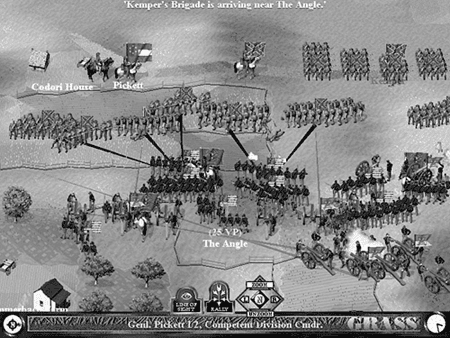

A game is more than just the sum of its rules. It must inter-act with the players to immerse them in the game world. To do this, it must project an aura of involvement that promotes Samuel Coleridge's "willing suspension of disbelief." Every element that the players' experience must contribute to the whole. From the moment the player loads the software and the first screen appears, he is in your world. Everything that he sees, hears, and feels from that point on—every audio, visual, and interactive element—must strive to convince him that the only thing that exists is the game. This is not the easiest of goals to achieve; any slight discord can jar the players out of their illusion. However, the best games generally achieve this level of perfection, or close to it, and the aim of this chapter is to discuss how you can attempt to account for deep player immersion in your designs.

游戏不仅仅是规则的总和。它必须与玩家互动，让玩家沉浸在游戏世界中。要做到这一点，游戏必须营造出一种参与的氛围，促进萨缪尔·柯勒律治的“心甘情愿地终止怀疑”。玩家体验的每一个元素都必须对整体有所贡献。从玩家加载软件和第一个屏幕出现的那一刻起，他就进入了你的世界。从那时起，他所看到、听到和感受到的一切，包括音频、视频和互动元素，都必须努力让他相信，唯一存在的就是游戏。这并不是最容易实现的目标；任何轻微的不和谐都会让玩家从幻觉中惊醒。然而，最好的游戏一般都能达到或接近这种完美的程度，本章的目的就是要讨论如何在你的设计中尝试让玩家深度沉浸其中。

This chapter discusses some of the most relevant aspects of user experience design (and note that by user experience, we're talking about the whole thing: audio, visual, and interaction methods) for games. Even though we have stressed the relative importance of flashy presentation as secondary to gameplay, we would be foolish to discard presentation entirely. The user interface is the first real glimpse the players will get of your game in action; it's your first chance to suck them into the world presented by your game.

本章将讨论与游戏用户体验设计（注意，我们所说的用户体验是指整个用户体验：音频、视觉和交互方法）最相关的一些方面。尽管我们已经强调华丽的外观相对于游戏性而言处于次要地位，但如果我们完全抛弃外观，那就太愚蠢了。用户界面是玩家真正了解游戏的第一印象，也是将玩家带入游戏世界的第一次机会。

The user interface can make or break your game: It can give it the perfect air of consummate professionalism or the shabby appearance of an amateur effort. Although we would prefer to believe that the gameplay is the most important factor in the success of a game, the majority of commercial evidence seems to indicate otherwise. With few exceptions, two games that are functionally equivalent, with equally effective marketing and differing only in the quality of their user interface layers, will not perform equally in the market. It would be tempting to say that the game with the most visually and technically stunning user interface would sell better—and we know that would please a lot of developers and artists out there—but, all things being equal, that is not the case. In fact, given these two functionally equivalent products, the one with the interface that is most fit for the purpose will be the most successful. (Of course, you can publish all manner of tripe if you have a big name license attached to it. Some things will never change.)

用户界面可以决定游戏的成败：它可以使游戏具有完美的专业水准，也可以使游戏看起来像业余爱好者的拙劣作品。尽管我们更愿意相信游戏的玩法是游戏成功的最重要因素，但大多数商业证据似乎表明并非如此。除了极少数例外情况，两款功能相当、营销效果相当、仅在用户界面层质量上存在差异的游戏，在市场上的表现并不相同。我们很容易说，用户界面视觉效果和技术含量最高的游戏会卖得更好——我们知道这会让很多开发者和艺术家感到满意——但在所有条件都相同的情况下，事实并非如此。事实上，在这两种功能相当的产品中，界面最符合目的的产品将是最成功的。(当然，只要有大牌授权，你就可以发布各种垃圾产品。有些东西永远不会改变）。

# What Is the User Experience? 什么是用户体验？

User experience: The term sounds suspiciously like a couple of strung-together buzzwords you'd expect to see on poor advertising copy. Obviously, that's an impression we'd rather dispel as quickly as possible, so let's attempt to "debuzzify" the term by describing exactly what we mean.

用户体验：这个术语听起来非常像是那种你在糟糕的广告文案中期望看到的一串流行术语的组合。显然，我们希望尽快消除这种印象，因此，让我们尝试通过描述我们的确切含义来“去流行化”这个术语。

We define the user experience as the total package presented to the player when she plays the game. It is the combination of three distinct areas of the design—the visual element, the audio element, and the interactive element—and is concerned with their impact on the user interface. The following sections give a brief précis of what we'll be covering in more detail.

我们将用户体验定义为玩家在玩游戏时所获得的整体体验。它是设计的三个不同领域——视觉元素、听觉元素和交互元素——的组合，并关注它们对用户界面的影响。以下章节简要介绍了我们将要详细介绍的内容。

> **NOTE 注意**
>
> To read more details on user experience, see The Elements of User Experience by Jesse James Garrett (© 2003 New Riders Publishing).
> 如需了解有关用户体验的更多详情，请参阅 Jesse James Garrett 所著的《用户体验要素》（© 2003 New Riders Publishing）。

## The Interactive Element 交互元素

The interactive part of the user experience is concerned with the way the player interacts with the game. This is tied in closely with the visual aspect but is more concerned with the "feel" part of "the look and feel." Here, we are concerned with the functional aspects of the user interface—the navigational pathways through the system—and the physical controller setup. How the interface looks is considered only as far as it affects the usability.

用户体验的互动部分涉及玩家与游戏的互动方式。这与视觉方面密切相关，但更关注“外观和感觉”中的 “感觉”部分。在这里，我们关注的是用户界面的功能方面——系统导航路径和物理控制器设置。界面的外观只有在影响可用性时才会被考虑。

## The Visual Element 视觉元素

The visual element concerns the "look" part of the "look and feel." Here, we consider the overall impact of the artwork and how it meshes and combines to present an overall consistent picture to the player. This is closely related to the interactive experience—one has a direct influence on the other—but we will attempt to discuss the areas separately and explain where there is crossover between the two.

视觉元素涉及“外观和感觉”中的“外观”部分。在这里，我们考虑美术作品的整体影响，以及它们如何相互融合，为玩家呈现出一个整体一致的画面。这与互动体验密切相关——一个直接影响另一个——但我们将尝试分别讨论这些领域，并解释二者之间的交叉点。

## The Audio Element 听觉元素

Often, the audio parts of a game are not considered in as much depth as the visual "in-your-face" areas of the game. However, audio is just as important for both atmosphere and player feedback as the visual components. Even though sound is often in third place after the visual and interactive elements, the fact that many games are unplayable without it clearly indicates the importance of sound. (Although, strictly speaking, no game should be designed that necessitates sound. That unfairly discriminates against the hearing impaired.)

通常情况下，人们对游戏声音部分的考虑不如对游戏“直观”部分的考虑那么深入。然而，声音对于游戏氛围和玩家反馈的作用与视觉部分同样重要。尽管声音往往排在视觉和互动元素之后，但许多游戏没有声音就无法玩下去，这清楚地表明了声音的重要性。(不过，严格来说，任何游戏的设计都不应该非要有声音不可。这是对听障人士的不公平歧视）。

# The Human-Computer Interface 人机接口

Designing a good user interface is not about how beautiful and whizzy you can make your buttons. In fact, the core essence of the user experience—enabling the player to interact with the game world—doesn't need any fancy graphics or sound. The functionality that allows a player to interact with the game effectively could theoretically be implemented using simple placeholder elements. In fact, while the interface is being designed, this is the recommended approach—it's faster, and more resource-efficient.

设计一个好的用户界面，并不在于你能把按钮做得多么漂亮、多么炫目。事实上，用户体验的核心本质——让玩家与游戏世界互动——并不需要任何华丽的图形或声音。理论上，只需使用简单的占位元素就能实现让玩家与游戏有效互动的功能。事实上，在设计界面时，我们推荐使用这种方法——它更快，也更节省资源。

As you may have already realized, we place more importance on the functional aspects of the user interface over the purely aesthetic aspects. Although we could argue that a perfectly functional user interface has a certain aesthetic appeal, we will not limit ourselves to this in our discussion. We would be foolish to completely disregard the aesthetic requirements—eye candy sells and certainly provides a more enjoyable, immersive experience—but they should be secondary to the functional aspects.

你可能已经意识到，我们更重视用户界面的功能性，而不是纯粹的美观性。虽然我们可以说，功能完善的用户界面也有一定的美感，但我们的讨论并不局限于此。如果我们完全无视美学方面的要求，那就太愚蠢了——眼球广告固然有卖点，固然能带来更愉悦、更身临其境的体验，但与功能方面相比，美学方面的要求应该是次要的。

> "When I am working on a problem, I never think about beauty. I only think about how to solve the problem. But when I have finished, if the solution is not beautiful, I know it is wrong."
> “当我研究一个问题时，我从不考虑美。我只考虑如何解决问题。但当我完成之后，如果解决方案不美，我就知道它是错的。”
> 
> —Buckminster Fuller, 1895-1983
> ——巴克敏斯特·富勒，1895-1983

The functionality of the user interface is the most important consideration. After all, what player is going to take the time to play a beautiful game if she can't figure out which exquisitely detailed picture is the button to start the game? Conversely, even with the most efficient user interface, few people will bother with the game if it's as ugly as sin.

用户界面的功能性是最重要的考虑因素。毕竟，如果玩家不知道哪张精致细腻的图片是启动游戏的按钮，又有哪个玩家会花时间去玩一款精美的游戏呢？反过来说，即使是最有效的用户界面，如果丑陋不堪，也很少有人会去玩这款游戏。

Consequently, the discussions in this chapter take on a dual aspect: First, and most important in our view, we will concentrate on the functionality of the user interface. After we have discussed the functional aspects, we will concentrate on the aesthetics, paying particular attention to making sure that the aesthetics do not impact the functionality. Note that pure physical beauty is not the primary meaning of aesthetics for a user interface. Fitness for purpose is a far more important aesthetic consideration. This doesn't necessarily exclude having a beautiful interface, but we do insist that there should be more to the beauty than mere appearances. A butterfly may be prettier than a rubber life raft, but which would you rather have with you on a stormy sea?

因此，本章的讨论具有双重意义：首先，也是我们认为最重要的一点，我们将集中讨论用户界面的功能。在讨论了功能方面的问题后，我们将集中讨论美观方面的问题，尤其要注意确保美观不会影响功能。请注意，纯粹的外形美并不是用户界面美学的主要含义。更重要的美学考虑因素是是否适合使用。这并不一定排除界面美观的可能性，但我们坚持认为，美观不应该仅仅停留在表面。蝴蝶可能比橡胶救生筏更漂亮，但在惊涛骇浪中，你更愿意选择哪一个呢？

## Evolution of the User Experience 用户体验的进化

In order to set a context for the discussion in this chapter, it will be worth our while to take a brief look at how the user experience has progressed over the last 20 or so years.

为了给本章的讨论提供一个背景，我们不妨简要回顾一下用户体验在过去 20 多年中的发展历程。

Twenty years ago, each game had a different interface, although usually there was some influence from other sources—console games, arcade games, and other games in the same genre. It wasn't until the advent of the windowed operating systems that any form of homogeny was achieved. Nowadays, we don't even think twice before using the mouse to navigate and clicking the mouse button to press an onscreen button. It's a de facto standard now (on the PC at any rate), but it used to be a novelty.

20 年前，每款游戏都有不同的界面，尽管通常会受到其他游戏来源--控制台游戏、街机游戏和其他同类型游戏--的一些影响。直到窗口操作系统的出现，才实现了任何形式的同质化。如今，我们在使用鼠标导航和点击鼠标键按下屏幕上的按钮之前，甚至都不会多想。现在，这已经成为一种事实上的标准（无论如何，在个人电脑上），但在过去，这只是一种新鲜事物。

### Arcade Games 街机游戏

Initially, the game interface was simple. For arcade-style games, there would be a title screen with instructions (usually limited to a simple explanation of the controls) or a simple attract mode that cycled between two or three screens (title, instructions, and a high-score table). The game would remain in this state until the player pressed the Start button.

最初，游戏界面非常简单。对于街机类型的游戏，会有一个带说明的标题屏幕（通常仅限于简单的控制说明）或一个简单的吸引模式，在两个或三个屏幕（标题、说明和高分表）之间循环。游戏会一直保持这种状态，直到玩家按下“开始”按钮。

This soon evolved to include a fourth screen: the demo mode. For a small length of time (usually 30 seconds or so), a sequence was shown from the game in play, implemented either as a slide show of screens from various levels or as one of a selection of short snippets of gameplay.

这种模式很快发展到第四个屏幕：演示模式。在一段较短的时间内（通常为 30 秒左右），游戏会以不同关卡画面的幻灯片或精选的游戏片段的形式播放。

Once the game was started, the in-game interface was usually very simple (see Figure 6.1). The playing area would take up most of the screen. There would be a score display, a high-score display, a level display (if appropriate), and a "lives remaining" display. These would be placed at the top or bottom of the screen. And for many years, that was about the extent of the arcade game interface. Of course, there were subtle variations on this theme—for example, a power level meter in addition to or instead of a "lives remaining" display, and the odd bit of pertinent information specific to the game, such as "number of lines" in Tetris.

游戏开始后，游戏界面通常非常简单（见图 6.1）。游戏区域将占据屏幕的大部分。屏幕上会有分数显示、高分显示、关卡显示（如果合适）和“剩余生命”显示。这些都会放在屏幕的顶部或底部。多年来，这就是街机游戏界面的全部内容。当然，这个主题也有一些微妙的变化，例如，除了“剩余生命”显示外，还有一个能量电量等级表，以及一些游戏特有的相关信息，如俄罗斯方块中的“行数”。

Figure 6.1. The standard arcade game interface (Pac-Man Plus). 图 6.1. 标准的街机游戏界面（《吃豆人加强版》）

Williams's Defender (shown in Figure 6.2) was arguably the first game to enhance this core interface by adding a minimap; it was one of the first games with a playing area larger than the visible screen.

《威廉姆斯防卫者》（如图 6.2 所示）可以说是第一款通过添加小地图来增强核心界面的游戏；它也是第一批游戏区域大于可视屏幕的游戏之一。

Figure 6.2. Williams's Defender. 图 6.2. 《威廉姆斯防卫者》。

Without waxing too lyrically about the nostalgia value of this proto-interface, it has to be said that there was a certain purity of purpose present. All the information that the player needed to be able to play the game was there at a glance. Of course, it wasn't that difficult to achieve, either; the limitations of the format pretty much dictated that the games be fairly simple. Any homogeny of interface was the result of the fact that there were only a few sensible ways of displaying the same information. The real progress occurred when the player needed to be fed too much information to be displayed on the screen at once.

在不对这种原始界面的怀旧价值进行过多抒情的前提下，我们不得不说，它具有某种纯粹的目的性。玩家玩游戏所需的所有信息都一目了然。当然，要做到这一点也并不难；技术条件的限制几乎决定了游戏必须相当简单。界面的同质化是由于展示相同信息的方式本就寥寥无几。真正的进步发生在需要向玩家提供的信息量过多，无法一次性显示在屏幕上的时候。

Most arcade games are simple enough to be able to present all the necessary information on a single screen, and it's just as well that this is the case, because switching to an information screen in the middle of a fast-paced game is not a recipe for success. For those wanting to investigate some of these classic arcade games further, the MAME (Multiple Arcade Machine Emulator) web site, [www.mame.net](www.mame.net), is a good starting point.

大多数街机游戏都足够简单，能够将所有必要的信息展示在一个屏幕上，这种情况也正好合适，因为在快节奏游戏中间切换到信息屏幕并不是成功的做法。对于那些想要进一步探究这些经典街机游戏的人，[www.mame.net](www.mame.net)，是一个很好的起点。

Consider an example of interface evolution: the humble golf game. Presumably, you are familiar with the basics of golf: Take a stick, go for a walk, and hit a small ball toward a marginally larger hole with as much force as you possibly can. As enjoyable as that sounds, a good number of developers have injected even more fun into the sport by allowing you to simulate it while not moving from the front of your computer. Of course, golf has an element of skill in the aiming and timing of the swing. Walking from hole to hole is also an important part of real golf (socially speaking, anyway), but this would not translate well as a fun gameplay feature, and so it is usually skipped. Hence, it's a logical assumption that game designers made the actual swinging at and hitting of the ball the main focus of the game.

举一个界面进化的例子：不起眼的高尔夫球游戏。想必你对高尔夫球的基本原理并不陌生：拿着球杆，出去散步，然后用尽全力将一个小球击向一个稍大的洞。尽管这听起来很有趣，但许多开发者通过允许你在电脑前不移动就能模拟这项运动，为这项运动增添了更多乐趣。当然，高尔夫运动在瞄准和挥杆时机的把握上需要一定的技巧。从一个球洞走到另一个球洞也是真实高尔夫的重要组成部分（无论如何，从社交角度来说），但这并不能很好地转化为有趣的游戏功能，因此通常会被省略。因此，游戏设计者将实际挥杆击球作为游戏的重点也就顺理成章了。

In fact, taking a look at the rough lineage of golf games, it can be seen that this interface was perfected early on (around the time of the original Leaderboard golf game, shown in Figure 6.3) and has only had minor tweaks since then, ignoring the odd short-lived "revolution" that has occurred in the meantime. The first button click started the power meter rising, the second button click set the power (whereupon the meter indicator would begin to fall), and the third determined the accuracy of the shot; it had to be clicked when the indicator returned to the starting position. Getting it exactly right resulted in a perfect shot. Apart from the switch from keyboard to mouse or trackball, there has been very little modification to this system; it's the perfect interface for the golf game and has been relied upon since then. Even fairly recent games, such as the latest effort in the Links series of games, have stuck to this basic mechanic for gameplay. Even Golden Tee, the latest in a long series of golf games, uses a trackball-based evolution of this original interface.

事实上，纵观高尔夫游戏的发展历程，我们可以发现这种界面很早就已经完善（大约在最初的排行榜高尔夫游戏时期，如图 6.3 所示），此后只进行过微小的调整，而忽略了在此期间发生的短暂“革命”。第一个按钮点击后，力量表开始上升，第二个按钮点击后设置力量（此时力量指示器开始下降），第三个按钮点击后决定击球的准确性；必须在指示器回到起始位置时点击该按钮。准确无误的点击可获得完美的射击效果。除了从键盘到鼠标或轨迹球的转换之外，这个系统几乎没有任何改动；它是高尔夫游戏的完美界面，从那时起就一直沿用至今。即使是最近的游戏，如 Links 系列游戏中的最新作品，也一直沿用这一基本的游戏机制。即使是《黄金发球局》（Golden Tee）这款最新的高尔夫游戏，也使用了基于轨迹球的原始界面。

Figure 6.3. U.S. Gold's World Class Leaderboard. 图 6.3. 美国黄金协会的世界级排行榜。

This demonstrates an important point: Aside from the occasional flash of brilliance, the general progression of game interfaces has been an evolutionary, not revolutionary, one.

这说明了一个重要问题： 除了偶尔的闪光点之外，游戏界面的总体发展一直是进化性的，而不是革命性的。

### Adventure Games 冒险游戏

Traditionally, adventure games were text-based. The player interacts with the system by reading a textual description of the location, and performing queries and actions based on that description.

传统上，冒险游戏以文本为基础。玩家通过阅读对地点的文字描述与系统互动，并根据描述进行提问和操作。

The first adventures took their input in a "verb-noun" format. That is, "Take Food" would work, whereas "Take the Food on the Table" would be rejected. Movement commands generally took the single-word form—Up, Down, North, East, South, West—and could be abbreviated to U, D, N, E, S, W, NW, NE, and so on.

最初的冒险游戏以“动词-名词”的格式输入。也就是说，“吃掉食物”可以，而“吃掉说张的食物”则会被拒绝。移动指令一般采用单字形式——上、下、北、东、南、西，也可以缩写为 U、D、N、E、S、W、NW、NE 等。

Adventure games used to be a popular and lucrative section of the games market. Over time, the sophistication of the parser allowed improvements in the nature of sentences usable with the games, and the quality of the writing correspondingly improved with the increasing capabilities of the target machines. Games such as The Hitchhiker's Guide to the Galaxy from Infocom (publishers of the original Zork series of games) and Fish! from Magnetic Scrolls are good examples. For the curious, a Java version of The Hitchhiker's Guide is available to play at Douglasadams.com (www.douglasadams.com/creations/infocomjava.html).

冒险游戏曾经是游戏市场上一个流行且利润丰厚的种类。随着时间的推移，解析器的复杂性使游戏中可使用的句子的性质得到了改善，而随着目标机器能力的不断提高，写作质量也相应提高。Infocom 公司（原 Zork 系列游戏的发行商）的《银河系漫游指南》和 Magnetic Scrolls 公司的《鱼！》就是很好的例子。对于好奇者来说，可以在 Douglasadams.com (www.douglasadams.com/creations/infocomjava.html) 上玩 Java 版本的《银河系漫游指南》。

Eventually, simple graphics appeared to help enliven the textual description. This improved the atmosphere to a degree, but also coincided with a general decrease in the quality of the writing. The designers relied more on the graphics (it's easier to draw a good picture than to craft good text) to tell the story, and the writing suffered correspondingly. The graphics tended to be presented in one of two forms: as either a full-screen image that was displayed briefly on entering a new location before clearing to allow the text to be displayed, or as a split-screen style, occupying a portion of the screen (usually the top half).

最终，简单的图形出现了，为文字描述增添了活力。这在一定程度上改善了气氛，但同时也导致了文字质量的普遍下降。设计者更多地依靠图形（画好图比写好文字更容易）来讲述故事，而文字则相应地受到了影响。图形往往以两种形式之一呈现：一种是全屏图像，在进入一个新地点时短暂显示，然后清除，以便显示文字；另一种是分屏样式，占据屏幕的一部分（通常是上半部分）。

Apart from general improvements to the parser, which is indirectly related to the quality of the game interface, this was the pinnacle of the adventure game interface. Today, text adventure games are not commercially viable, but they do live on in the form of MUDs (multiuser dungeons) and MUSHs (multiuser shared hallucinations). For those wanting to investigate MUDs and MUSHs further, a good place to begin is [www.mudcenter.com](www.mudcenter.com).

除了对解析器的一般改进（这间接关系到游戏界面的质量）外，这是冒险游戏界面的巅峰之作。如今，文字冒险游戏在商业上已经行不通了，但它们仍以 MUD（多用户地下城）和 MUSH（多用户共享幻觉）的形式存在着。如果您想进一步了解 MUD 和 MUSH，[www.mudcenter.com](www.mudcenter.com) 是一个不错的开始。

### Graphic Adventures 图形冒险

Graphic adventures are the spiritual successor to text adventures. Taking the maxim "a picture is worth a thousand words" as their rallying cry, designers began to take advantage of the increasing power of computers to create a fully graphical interface to the standard adventure game.

图形冒险是文字冒险的精神继承者。设计师们以“一图胜千言”为格言，开始利用日益强大的计算机功能，为标准的冒险游戏创建完全图形化的界面。

In many ways, this was unfortunate. We may lament the degradation of standards from the classic adventure game—similar to the preference of a significant portion of today's youth for watching cartoons over reading a good book—but we cannot argue with progress. Simply put, text adventures that required the player to type in their commands did not appeal to the consumer in the same way as a graphic adventure, which is, in effect, an interactive cartoon.

从很多方面来看，这都是不幸的。我们可能会感叹经典冒险游戏标准的退化——就像今天相当一部分年轻人喜欢看动画片而不是读一本好书一样——但我们不能反对进步。简而言之，需要玩家输入指令的文字冒险游戏对消费者的吸引力不如图形冒险游戏，后者实际上就是一部互动动画片。

That aside, the point-and-click interface of the graphic adventure has changed very little over the years since the first appearance of the genre. From the earliest Leisure Suit Larry games (shown in Figure 6.4) through the latest in the Monkey Island series (shown in Figure 6.5), the interface has remained pleasingly consistent. The interface to a graphic adventure is a fairly simple construct. Most graphic adventures are 2D or pseudo-3D (that is, they use 3D graphics in a 2D scene-oriented fashion, rather like a stage show), and consequently, only a relatively simple game interface is required.

撇开这一点不谈，图形冒险的点击式界面自该类型首次出现以来，多年来几乎没有什么变化。从最早的《Leisure Suit Larry》游戏（如图 6.4 所示）到最新的《猴岛》系列（如图 6.5 所示），其界面一直保持着令人愉悦的一致性。图形冒险游戏的界面构造相当简单。大多数图形冒险游戏都是 2D 或伪 3D（即在 2D 场景中使用 3D 图形，就像舞台表演一样），因此只需要一个相对简单的游戏界面。

Figure 6.4. Leisure Suit Larry II. 图 6.4. 休闲西装拉里 II

Figure 6.5. Escape from Monkey Island. 图 6.5. 逃离猴岛

There are two main paradigms for the interface that are currently in use. The first is the split-screen text- or icon-based interface, where the player selects actions in the selection area of the screen and watches the results in the results portion of the screen. An example of a game that uses this format is LucasArts's Maniac Mansion: Day of the Tentacle, shown in Figure 6.6.

目前使用的界面主要有两种模式。第一种是基于文本或图标的分屏界面，玩家在屏幕的选择区选择操作，并在屏幕的结果区观看结果。LucasArts 公司的《疯狂时代》就是采用这种形式的游戏，如图 6.6 所示。

Figure 6.6. Maniac Mansion: Day of the Tentacle. 图 6.6. 《疯狂时代》

The second paradigm, used by such games as Myst (shown in Figure 6.7), uses the whole screen as the interface. The player moves the cursor around the screen and clicks on objects or characters of interest. In this way, the story is visually progressed by player interaction. What this format loses in flexibility over the first system, it gains in atmosphere and immersion.

第二种模式在《神秘岛》等游戏中使用（如图 6.7 所示），它将整个屏幕作为界面。玩家在屏幕上移动光标，点击感兴趣的物体或人物。通过这种方式，玩家的互动使故事在视觉上得以推进。与第一种系统相比，这种形式在灵活性方面有所欠缺，但在氛围和沉浸感方面却有所增强。

Figure 6.7. Myst. 图 6.7. 《神秘岛》

We are not going to include games such as Ion Storm's Deus Ex in the category of adventure games. The action quotient in that game is too high to warrant inclusion, and we would prefer to class games of this type as a union of first/third-person shooters and role-playing games (even though it is a close call to make). Adventure games, on the other hand, are typically thought of as games that require pure thought and logic, and little in the way of reflexes. Thus, the game interface for the graphic adventure does not have speed as one of its main priorities, instead focusing on clarity of use.

我们不会将离子风暴的《杀出重围》等游戏列入冒险游戏类别。该游戏的动作性太高，不值得列入，我们更倾向于把这类游戏归类为第一/第三人称射击游戏和角色扮演游戏的结合体（尽管这是个很接近的决定）。另一方面，冒险游戏通常被认为是需要纯粹思考和逻辑的游戏，几乎不需要反应能力。因此，图形冒险游戏的游戏界面并不以速度为主要考虑因素，而是以清晰易用为重点。

### Role-Playing Games 角色扮演游戏

Role-playing games (RPGs), for the most part, have had roughly the same user interface since day one. This isn't necessarily a good thing. In fact, there is a lot about the standard role-playing game interface that we do not like, but aside from incremental improvements, it seems to be a case of using what works well enough, although a notable exception is the starting interface for Morrowind. Your character is defined by your responses to questions posed by interactive characters in the opening part of the game.

角色扮演游戏（RPG）从诞生之日起，其用户界面大多大致相同。这未必是件好事。事实上，标准的角色扮演游戏界面有很多我们不喜欢的地方，但除了渐进式的改进之外，似乎都是用什么好用就用什么，不过《摩罗大陆》的起始界面是个明显的例外。你的角色是由你对游戏开头部分互动角色所提问题的回答来定义的。

The generic role-playing game interface comes in three sections: the character generation screen, the in-game screen, and the inventory screen. These do not seem to have changed much since the inception of the genre, but their forms have been modified and refined somewhat.

一般的角色扮演游戏界面分为三个部分：角色生成界面、游戏内界面和物品界面。自这一类型游戏诞生以来，这些界面似乎没有太大变化，但其形式却有了一些修改和完善。

Take, for example, an early role-playing game. Out of the Shadows from Mizar Software was released for the Sinclair Spectrum in 1984. Figure 6.8 shows the main game and character generation screen of this game. Pay particular attention to the character attributes on the right of the screen.

以早期的角色扮演游戏为例。Mizar Software 公司的《走出阴影》于 1984 年在 Sinclair Spectrum 上发布。图 6.8 显示了这款游戏的主游戏和角色生成界面。请特别注意屏幕右侧的角色属性。

Figure 6.8. Out of the Shadows main game and character screen. 图 6.8. 《走出阴影》的主游戏和角色界面。

Now contrast this with the character generation screen from a more recent game, such as Black Isle Studio's Planescape: Torment, as shown in Figure 6.9.

现在将其与黑岛工作室（Black Isle Studio）的《毁灭战士》（Planescape： 折磨》，如图 6.9 所示。

Figure 6.9. Planescape: Torment character generation screen. 图 6.9. 《异域镇魂曲》的角色生成界面。

Apart from the huge differences in the quality of the artwork and the capabilities of the target platforms, these screens are scarily similar in function. Sure, there are a few bells and whistles added to the latter example, but fundamentally, the functionality hasn't really changed in the 16 years between the two games. Note that we feel that Planescape: Torment is an excellent game, and we are not trying to imply otherwise by singling it out for our example. We merely want to illustrate how the basic character generation interface has not changed in functionality over the years.

除了美工质量和目标平台功能上的巨大差异外，这些屏幕在功能上的相似度也高得吓人。当然，后一个例子增加了一些功能，但从根本上说，两款游戏的功能在 16 年间并没有什么变化。请注意，我们认为《Planescape： 折磨》是一款优秀的游戏，我们将它单独作为例子并不是想暗示其他方面。我们只是想说明，基本的角色生成界面多年来在功能上没有任何变化。

You may be of the school of thought that believes this lack of change is a good thing. After all, it's a system that's been in use since the advent of paper-and-pencil role-playing games in the '70s. However, our view is different. Why use numbers at all in the game interface? They were a necessity in the paper-and-pencil role-playing games, but what a computer is very good at is dealing with numbers. Why bother the player with them? Having "Saving Roll +1" flash up onscreen when we've just dealt a mighty blow to a zombie does nothing except remind us that we're playing a dry game of statistics with some pretty graphics slapped on top. We know that this argument has been used before, and that some players actually prefer to deal with numbers—after all, it does allow the players to know exactly where they stand in the game. However, wondering how high your hit-points are while smiting a zombie jars your suspension of disbelief. Let those players who want to deal with numbers have them, but make them an option in the game. If you need to display numbers (maybe for the sake of accuracy), then at least display them as labels on some sort of bar chart or other graphical representation. To be fair, though, the user interface of Planescape: Torment does allow some limited hiding of the numbers, borrowing the technique of displaying graphical power bars from other genres, which is a neat way of sidestepping the problem.

你可能会认为这种不改变是件好事。毕竟，这是自 70 年代纸笔角色扮演游戏出现以来就一直在使用的系统。然而，我们的观点有所不同。为什么要在游戏界面中使用数字？在纸笔角色扮演游戏中，数字是必需品，但电脑最擅长的就是处理数字。为什么要让玩家费心呢？当我们刚刚给僵尸致命一击时，屏幕上就会闪现 "蓄力翻滚+1 "的字样，这只会提醒我们，我们在玩的是一个干巴巴的统计游戏，上面还加了一些漂亮的图形。我们知道，这种说法以前也有人用过，而且有些玩家实际上更喜欢与数字打交道，毕竟它能让玩家清楚地知道自己在游戏中的位置。然而，在击杀僵尸的同时还想知道自己的命中率有多高，会让你的不信任感大打折扣。让那些想与数字打交道的玩家拥有它们，但让它们成为游戏中的一个选项。如果需要显示数字（也许是为了准确），那么至少要在某种条形图或其他图形上以标签的形式显示。不过公平地说，《Planescape： 不过公平地说，《星球大战：折磨》的用户界面确实允许对数字进行有限的隐藏，借鉴了其他类型游戏中显示图形化力量条的技术，这是一种巧妙地规避问题的方法。

### Strategy and War Games 策略和战争游戏

Like their cousin, the role-playing game, strategy and war games have their roots in board games. Hence, early efforts were often heavy on the numbers and played almost exactly like a computer-controlled board game. One of the first breakthrough titles that heralded the roots of the more accessible arcade-strategy genre was a title released for the Sinclair Spectrum back in 1984, called Stonkers (see Figure 6.10). This game presented simulated war in a more accessible arcade-influenced format and is arguably the very first RTS (real-time strategy) war game, introducing many of the concepts that are familiar in today's RTS and strategy games.

与角色扮演游戏一样，战略和战争游戏也源于棋盘游戏。因此，早期的游戏往往数字繁多，玩法几乎与电脑控制的棋盘游戏一模一样。早在 1984 年，一款名为《Stonkers》（见图 6.10）的游戏在辛克莱光谱（Sinclair Spectrum）上发布，这是第一款具有突破性意义的游戏，预示着更容易上手的街机策略类游戏的诞生。这款游戏以一种更容易上手的街机形式展示了模拟战争，可以说是第一款 RTS（即时战略）战争游戏，它引入了当今 RTS 和战略游戏中许多耳熟能详的概念。

Figure 6.10. Stonkers. 图 6.10. 石头人

More recent RTS games (such as Sudden Strike, shown in Figure 6.11), classic strategy games (such as Civilization III, shown in Figures 6.12 and 6.13), and the more traditional war games (such as Sid Meier's Gettysburg, shown in Figure 6.14) have a similar user experience—at least at a superficial level. All games of this type are concerned with the same basic set of actions: controlling large groups of units to solve a goal that could not be achieved by one unit alone. Of course, once you go beyond this superficial level, there is some variance in the user interface; for example, Civilization III has a diplomatic and city control interface that handles specific decisions at a wider level than those simply concerned with unit- and group-level decisions.

较新的 RTS 游戏（如图 6.11 所示的《Sudden Strike》）、经典的策略游戏（如图 6.12 和 6.13 所示的《文明 III》）以及较传统的战争游戏（如图 6.14 所示的《Sid Meier's Gettysburg》）都有类似的用户体验--至少在表面层面上是如此。所有这类游戏都涉及相同的基本操作：控制大群单位来实现一个单个单位无法实现的目标。例如，《文明 III》中的外交和城市控制界面就在更广的层面上处理具体的决策，而不仅仅是单位和群体层面的决策。

Figure 6.11. Sudden Strike. 图 6.11. 突袭

Figure 6.12. Civilization III in-game interface. 图 6.12. 《文明 III》游戏界面。

Figure 6.13. Civilization III foreign advisory interface. 图 6.13. 《文明 III》 外国顾问界面。

Figure 6.14. Sid Meier's Gettysburg. 图 6.14. 席德·梅尔的葛底斯堡。

Because of its universal nature, the unit- and group-based interface has evolved to allow the player to control these groups easily. Games such as Blizzard's Warcraft and Westwood's Command and Conquer series have helped define the standard interface for RTS games that most games now follow. Left-clicking to select a unit, and then right-clicking on an object to select a context-sensitive action for the unit to perform on that object, have become familiar actions for most RTS gamers. More recently, the ability to click-drag select a group of units (a method borrowed directly from the Windows operating system) has been added to the repertoire.

由于其通用性，以单位和群体为基础的界面已经发展到可以让玩家轻松控制这些群体。暴雪（Blizzard）的《魔兽争霸》（Warcraft）和西木（Westwood）的《命令与征服》（Command and Conquer）系列等游戏帮助定义了 RTS 游戏的标准界面，现在大多数游戏都遵循这一标准。左键单击选择一个单位，然后右键单击一个对象，选择一个上下文相关的操作，让该单位对该对象执行操作，这已经成为大多数 RTS 游戏玩家熟悉的操作。最近，单击-拖动选择一组单位的功能（直接从 Windows 操作系统中借用的方法）也被加入到了游戏中。

However, as these games have become more complex, ways of managing that complexity become needed. This has prompted a divergence in the interfaces, especially with respect to the camera control mechanisms in those games that give the player control of the camera (although why the player would want to control the camera is beyond us—except in special situations, that should be a job for the computer).

然而，随着这些游戏变得越来越复杂，就需要有管理这种复杂性的方法。这就促使游戏界面出现了分化，尤其是那些让玩家控制摄像机的游戏中的摄像机控制机制（虽然我们不明白玩家为什么要控制摄像机--除非在特殊情况下，否则这应该是电脑的工作）。

Strategy games and war games are characterized by the strategic-level decisions the player is required to make. Consequently, the interface has to allow the player to make these strategic decisions. Note that a lot of these games (for better or worse) also include a fair amount of micromanagement of individual units, usually in the form of giving orders or training. This micromanagement is usually handled by a contextual iconic interface.

战略游戏和战争游戏的特点是要求玩家做出战略层面的决定。因此，游戏界面必须允许玩家做出这些战略决策。需要注意的是，很多这类游戏（无论好坏）还包括对单个单位的大量微观管理，通常是以下达命令或进行训练的形式。这种微观管理通常由上下文图标界面来处理。

In order to be an effective interface, it has to seamlessly handle three levels of abstraction: grand strategy (as in Figure 6.13), group and unit navigation (as in Figure 6.14), and unit micromanagement (as in Figure 6.15). Not all these levels are necessarily present, depending on the strategic slant of the game. As a general rule, RTS games tend to focus on the latter two levels, group and unit navigation and unit micromanagement. More serious war games tend to use all three levels, usually with a focus on the grand strategic and the group and unit navigation levels. Pure strategy games (akin to computer-controlled board games), such as Risk (shown in Figure 6.16), focus on the grand strategic level, with varying levels of usage of the latter two levels. Of course, the best of these games allow the player to choose to what level he wants to involve himself—from the overseeing dictator figure all the way down to the bean-counting micromanager, and anywhere in between. Sid Meier's Civilization series of games are excellent in their use of the computer to handle such menial tasks at the player's request.

为了成为一个有效的界面，它必须无缝处理三个抽象层次：大战略（如图 6.13）、群体和单位导航（如图 6.14）以及单位微观管理（如图 6.15）。根据游戏的战略倾向，不一定所有这些层次都会出现。一般来说，RTS 游戏往往侧重于后两个层次，即群体和单位导航以及单位微观管理。更严肃的战争游戏则倾向于使用所有三个层面，通常侧重于大战略层面以及群体和单位导航层面。纯战略游戏（类似于计算机控制的棋盘游戏），如《风险》（如图 6.16 所示），侧重于大战略层面，对后两个层面的使用程度各不相同。当然，这些游戏中的佼佼者可以让玩家选择让自己参与到哪个层次--从总揽全局的独裁者一直到精打细算的微观管理者，以及两者之间的任何层次。席德-梅尔的《文明》系列游戏就很好地利用了电脑，按照玩家的要求处理这类琐碎的任务。

Figure 6.15. Starcraft's unit micromanagement interface. 《星际争霸》的单位微观管理界面。

Figure 6.16. Risk. 图 6.16. 风险

The more serious war games, which have traditionally been rather dry in their presentation, have started to use a number of these more "gamer-friendly" techniques. Previously, these games have focused on the accuracy of the war simulation, rather than any presentational niceties, and generally, that suited the players of these games perfectly. However, in order to attract new players, designers have learned lessons from the more accessible RTS-style games, which in turn were derived from the need to make war games more accessible to the average gamer. Nowadays, the hard-core war games are, in many cases, virtually indistinguishable from the RTS games that they initially inspired.

较严肃的战争游戏在表现形式上历来比较枯燥，现在已开始使用一些更 "玩家友好 "的技术。以前，这些游戏的重点是战争模拟的准确性，而不是任何精美的表现形式，一般来说，这非常适合这些游戏的玩家。然而，为了吸引新玩家，设计师们从更容易上手的 RTS 类型游戏中吸取了经验教训，而这些经验教训又是为了让普通玩家更容易上手战争游戏。如今，在许多情况下，硬核战争游戏与最初受其启发的 RTS 游戏几乎没有区别。

