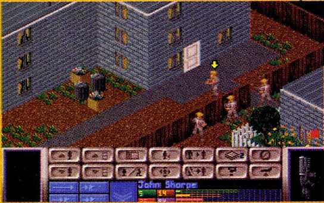

This chapter is an introduction to the tools and techniques that we will use in later chapters when discussing the balancing of specific game genres. Different genres require different modes of balance, but in many cases, the common thread that binds them is the same.

本章是对工具和技术的介绍，我们将在后面的章节中讨论特定游戏类型的平衡问题。不同类型的游戏需要不同的平衡模式，但在许多情况下，将它们联系在一起的共同点是相同的。

The methods discussed in this chapter provide a basis for us to examine the issue of balance in games:

本章讨论的方法为我们研究游戏平衡问题提供了基础：

* What exactly do we mean by balance?\
 我们所说的平衡到底是什么意思？
* How do we define balance?\
 我们如何定义平衡？
* How can we say that one game is well balanced where another is not?\
我们怎么确定一种游戏很平衡，而另一种游戏却不平衡呢？

These are not easy questions to answer; an answer that may be correct for one person may be completely incorrect for another. In some ways, there can be no definitive answers to the questions. Like so many other questions in game design, the answer contains an unknown quantity: the player.

这些问题并不容易回答；对一个人来说可能正确的答案，对另一个人来说可能完全不正确。从某种程度上说，这些问题不可能有最终确定的答案。就像游戏设计中的许多其他问题一样，答案包含了一个未知数：玩家。

Although we can attempt to anticipate what sort of people will play our game, we will never be able to satisfy all of them. However, as fallacious as it may seem, we have to start somewhere. In balancing a game, we have to assume the existence of an average player and target the balance to suit that player. Remember, however, that your average player will not be anywhere near as skilled at computer games as you and your team. Don't fall for the extremely common mistake of "making a game that you enjoy playing." This statement has been the epithet for many promising games. The danger of aiming to make a game that you enjoy playing is that you run the risk of making a game that only you enjoy playing. A significant level of "dumbing down" may be required to make your game as accessible as possible to the average player. Do not be alarmed by this; you can cater for extremes by providing different difficulty settings, as necessary. So with this in mind, let's explore the subject of game balancing in more detail.

尽管我们可以尝试预测什么样的人会玩我们的游戏，但我们永远无法满足所有的人。然而，尽管看起来有些谬误，但我们总得有个起点。在平衡游戏时，我们必须假定存在一个普通玩家，并针对这个玩家来平衡游戏。但请记住，普通玩家的电脑游戏水平远不及你和你的团队。不要陷入“做自己喜欢玩的游戏”这一极其常见的错误。这句话是许多有前途游戏的代名词。以制作自己喜欢玩的游戏为目标的危险在于，你有可能制作出只有你自己喜欢玩的游戏。为了让普通玩家也能玩到你的游戏，你可能需要进行相当程度的“简化”。对此不要惊慌；你可以根据需要提供不同的难度设置，以满足极端情况的需要。有鉴于此，让我们来详细探讨一下游戏平衡的问题。

# What Is Game Balance? 什么是游戏平衡？

Many games are released each year that commit fundamental game design errors. These games are fatally flawed from the outset, and short of a monumental marketing campaign and a small spate of miracles, they are doomed to failure. There are many obvious reasons for this kind of spectacular failure, such as bad coding, buggy software, poor quality control, and substandard graphics.

每年都有许多游戏在发布时犯了基本的游戏设计错误。这些游戏从一开始就存在致命的缺陷，如果没有巨大的营销活动和一连串的奇迹，它们注定要失败。造成这种重大失败的原因显而易见，如糟糕的编码、漏洞百出的软件、糟糕的质量控制和不合格的画面。

However, on many occasions, the cause of failure is not so immediately obvious. The game may look okay, sound okay, and even to some extent play okay, but it still fails commercially. One of the reasons for failure (and the one we are going to concern ourselves with here) is poor game design. In [Chapter 7](chapter-7.md), "Gameplay," we introduced the elements of gameplay that we expect to find in games. We also touched a little on the subject of game balance. Including all the expected elements in a game does no good if they are not in balance with one another and with the player.

然而，在许多情况下，失败的原因并不那么显而易见。游戏可能看起来还行，听起来还行，甚至在某种程度上玩起来还行，但在商业上仍然失败了。失败的原因之一（也是我们在这里要讨论的原因）是游戏设计不佳。在[第七章](chapter-7.md)“游戏性”中，我们介绍了我们期望在游戏中发现的游戏性要素。我们还略微谈到了游戏平衡的问题。如果游戏中的所有预期元素不能相互平衡，也不能与玩家平衡，那么在游戏中加入所有这些元素都是没有用的。

But what exactly do we mean by a balanced game? A balanced game is one where the main determining factor for the success of the player is the skill level of that player. That does not mean that random events cannot occur, but a better player should ordinarily be more successful than a poor one unless he has an unusually long run of bad luck.

但我们所说的平衡的游戏到底是什么意思呢？平衡的游戏是指决定玩家成败的主要因素是玩家的技术水平。这并不意味着随机事件不可能发生，但通常情况下，一个较好的玩家应该比一个较差的玩家更容易成功，除非他的运气异常糟糕。

Traditionally, game balance has been very much a trial-and-error process. The game is played, the game is tweaked, the game is played, the game is tweaked, and then finally, when time runs out, the game is released (and usually tweaked further in the form of patches).

传统上，游戏平衡在很大程度上是一个试错过程。游戏被玩，游戏被调整，游戏被玩，游戏被调整，最后，当时间耗尽时，游戏被发布（通常以补丁的形式进一步调整）。

So why are there no formalized, scientifically rigorous methods of game balancing? Well, for a start, it's an extremely difficult and complex process. Essentially, game balancing is a problem involving a fantastically large number of independent variables. It's an optimization problem in n-dimensional space where n is a very large number. No formal rules govern game balancing, except in a very small number of abstract mathematical scenarios.

那么，为什么没有正式的、科学严谨的游戏平衡方法呢？首先，这是一个极其困难和复杂的过程。从本质上讲，游戏平衡是一个涉及大量独立变量的问题。它是 n 维空间中的一个优化问题，其中 n 是一个非常大的数字。除了极少数抽象的数学场景之外，游戏平衡没有正式的规则可循。

Classical game theory is simply not suited to this kind of problem. Most areas of research concern themselves with games in which there are discrete player turns and a limited number of variables. This type of theory is ideal for analyzing games of chance, such as poker and coin-toss games, but it would be nearly impossible to use for the analysis of more complex games, such as computer games, which are more often continuous and have hundreds, if not thousands, of independent variables. Also, the majority of game theory is concerned with finding the optimum way to play a game. Using game theory to balance a game would be like playing a twisted version of Jeopardy—starting with the answer and working back to the best possible question. (It's possible that one day there might be some sort of "game calculus" invented to handle these problems, but we're not going to hold our collective breath. Besides, that still doesn't solve the problem of how to break down the game into a list of strategies and variables to fit into the equations.)

经典博弈论根本不适合这类问题。大多数研究领域关注的是玩家回合离散、变量数量有限的博弈。这类理论非常适合分析扑克牌和投掷硬币游戏等偶然性游戏，但几乎不可能用来分析电脑游戏等更复杂的游戏，因为电脑游戏通常是连续的，有成百上千个独立变量。此外，博弈论的大部分内容都与寻找最佳游戏方式有关。用博弈论来平衡一个游戏，就像是在玩一个改版的[危险边缘](https://en.wikipedia.org/wiki/Jeopardy!)——从答案开始，再回到最佳可能的问题。(也许有一天会发明出某种“游戏微积分”来处理这些问题，但我们不会集体屏息以待。此外，这仍然无法解决如何将游戏分解成一系列策略和变量来纳入方程的问题）。

This sort of n-dimensional optimization problem occurs in many areas of science, and it is from these areas that we can borrow techniques to help us solve the problem. This is not to say that all game-balancing problems can be solved by the blanket application of a sterile algorithm. A healthy measure of human finesse is still required in order to make a game feel "just right." Just because a result is mathematically correct does not automatically make it aesthetically pleasing.

这种 n 维优化问题出现在许多科学领域，我们可以从这些领域借鉴技术来帮助我们解决问题。这并不是说，所有的游戏平衡问题都可以一概采用无菌算法来解决。为了让游戏感觉“恰到好处”，仍然需要一定程度的人为技巧。一个结果在数学上是正确的，但并不意味着它在美学上也是令人愉悦的。

In fact, the tweak-play-tweak method of game balancing is a valid approach (and is pretty much the only approach so far). The only problem is that this method is time- and resource-intensive and is extremely prone to error. Worse still, balancing a game is a very difficult concept to grasp. After all, what are you balancing it against? Are you balancing it against itself? The player? And how exactly are you balancing it? Are you balancing it so that it is a fair game? Are you balancing it so that it provides a consistent experience to the player no matter what her ability? The answers to these questions are—at least to some degree—subjective and depend upon the nature of the game. For example, a historically accurate simulation of the Anglo-Zulu wars would not be a fair game. The Zulus would have to lose, which would be a bit depressing for the Zulu player.

事实上，“调整——游戏——调整”的游戏平衡方法是一种有效的方法（而且几乎是目前唯一的方法）。唯一的问题是，这种方法需要耗费大量时间和资源，而且极易出错。更糟糕的是，平衡游戏是一个很难掌握的概念。毕竟，你在平衡什么？是平衡游戏本身？还是玩家？你到底是如何平衡的？你是在平衡游戏的公平性？你是否在平衡它，以便无论玩家的能力如何，都能为其提供一致的体验？这些问题的答案至少在某种程度上是主观的，而且取决于游戏的性质。例如，一个符合历史的盎格鲁-祖鲁战争模拟游戏就不会是一个公平的游戏。祖鲁人必须输，这对祖鲁人玩家来说有点令人沮丧。

Even a nonrealistic game has to take some liberties in order to obtain balance. For example, a hypothetical game that simulates the invasion of modern-day Earth by a race of aliens has to give the humans a chance to win. And in spite of what you've seen in films like Independence Day, any race that is advanced enough to move huge ships across hundreds or thousands of light-years probably wouldn't have much difficulty mopping up a small planet like ours—and they certainly wouldn't have computers that interfaced with an Apple Macintosh, conveniently allowing us to destroy their whole operation. In order to base a game around such a scenario, we'd have to stretch credibility to the breaking point, in that with today's technology we could actually defeat a race of advanced aliens whose sole specialty is enslaving entire worlds. Human "pluck" will only take us so far.

即使是非现实主义的游戏，也必须进行一些改动以取得平衡。例如，一款模拟外星人入侵现代地球的假想游戏必须给人类以获胜的机会。尽管你曾在《独立日》等电影中看到过，但任何先进到可以移动巨大飞船穿越数百或数千光年的种族，在攻占像我们这样的小星球时可能毫不费力——而且他们肯定不会拥有能与苹果 Macintosh 电脑连接的电脑，方便我们摧毁他们的整个行动。如果要围绕这样的场景来制作游戏，我们就必须把可信度提高到极致，那就是以现在的技术，我们真的可以打败一个专门奴役整个世界的先进外星种族。人类的“勇气”只能到此为止。

Before we get into the gritty detail, we should briefly describe what it is that we are actually balancing. There are several ways of implementing balance in a game, centered around how the equilibrium is maintained. In particular, there are two broad classes of balance that we will be discussing: static balance and dynamic balance. Traditionally, balance has not been differentiated in this fashion; when game balance is referred to, it is usually referred to as a whole, comprising both the static and the dynamic balance. Often, you will hear discussion in terms of the opening, the midgame, and the endgame, much as you would in chess. This is a perfectly valid, if a little rudimentary, approach; it's fine for the discussion of a game that has already been written, but when we are designing a new game, we would like to be able to go to a finer grain of detail. It has often been said, however, that the degree of understanding of a subject is directly proportional to the sophistication of the available language used to describe it. For our discussion, referring to balance as a whole rather than distinguishing between the two areas of balance is an unnecessary handicap that we would rather avoid.

在深入探讨具体细节之前，我们应该简要介绍一下我们究竟要平衡什么。在游戏中实现平衡有几种方法，其核心是如何保持平衡。具体来说，我们将讨论两大类平衡：静态平衡和动态平衡。传统上，平衡并不是以这种方式区分的；当提到游戏平衡时，通常指的是由静态平衡和动态平衡组成的一个整体。你经常会听到关于开局、中盘和尾盘的讨论，就像在国际象棋中一样。这种方法完全正确，尽管有些粗略；对于讨论已经制作好的游戏来说，这种方法还不错，但当我们设计新游戏时，我们希望能对细节进行更精细的处理。不过，人们常说，对某一主题的理解程度与描述该主题的可用语言的复杂程度成正比。在我们的讨论中，将平衡作为一个整体来提及，而不是区分平衡的两个方面，是一种不必要的障碍，我们宁愿避免这种障碍。

# Static Balance 静态平衡

Static balance is concerned with the rules of the game and how they interact with each other. These are specifically time invariant. In other words, these are the rules of the game that can be written down and documented to aid play—the usual strategy guide fodder.

静态平衡关注的是游戏规则及其如何相互作用。这些规则不受时间变化影响。换句话说，这些游戏规则可以写下来并记录在案，以帮助玩家进行游戏——通常的策略指南的内容。

A concrete example would be a comparison of the relative strengths of units in a war game, or the average jumping distance of Mario in relation to the average distance between platforms. Generally, when game balance is spoken about, most people are unconsciously referring to the static balance (sometimes mixed with a little of the dynamic balance).

一个具体的例子就是比较战争游戏中各单位的相对实力，或者马里奥的平均跳跃距离与平台之间的平均距离的关系。一般来说，当谈到游戏平衡时，大多数人都会不自觉地提到静态平衡（有时会掺杂一点动态平衡）。

Static balance is the classic game balance that is talked about in other books, including Game Architecture and Design, also from New Riders (although we did delve somewhat into the subject of dynamic balance in that book, without specifically naming it as such). This is the process whereby we ensure that the game is fair and all elements interlock seamlessly to avoid dominant and recessive strategies that can ruin a game.

静态平衡是经典的游戏平衡，在其他书籍中也有提及，包括同样出自 New Riders 的《游戏架构与设计》（尽管我们在该书中也稍微探讨了动态平衡的主题，但并没有明确将其命名为如此）。在这个过程中，我们要确保游戏是公平的，所有元素都能无缝衔接，避免出现可能毁掉一个游戏的优势策略和劣势策略。

## Randomness and Average Values 随机性和平均值

In the following few sections, we are going to discuss balancing gameplay elements using payoff matrices to demonstrate some of the points. Payoff matrices are used to illustrate the balance between elements of the game.

在接下来的几节中，我们将使用回报矩阵来讨论平衡游戏元素的问题，以说明其中的一些要点。回报矩阵用于说明游戏元素之间的平衡。

For example, let's take a symmetrical game involving two players: red and blue. Each of these players has two strategies that it can use: R1, R2, B1, and B2.

例如，让我们以一个对称游戏为例，游戏中有两名玩家：红方和蓝方。每个玩家都有两种策略可以使用：R1、R2、B1 和 B2。

Let's say that R2 beats B1 with a payoff of 3, B2 beats R1 with a payoff of -2, B1 draws with R1, and R2 draws with B2, as shown in Table 8.1.

假设 R2 以 3 的回报击败 B1，B2 以 -2 的回报击败 R1，B1 与 R1 平局，R2 与 B2 平局，如表 8.1 所示。

Table 8.1. A Simple Net Payoff Matrix 表 8.1. 简单净收益矩阵

||B1|B2|
|---|---|---|
|R1|0|-2|
|R2|3|0|

Note that negative numbers indicate a win to blue, and positive numbers indicate a win to red.

注意，负数表示蓝方获胜，正数表示红方获胜。

This doesn't have to mean that for each play of the game, R2 beats B1—occasionally the converse could occur. It depends on the nature of the game. What it is generally taken to mean is that the net payoff is that value. In some cases, the strategy B1 could pay more or less against the strategy R1 (subject to the whims of chance), but the average value of the payoff over time would tend to the specified value.

这并不意味着每次下棋时，R2 都能击败 B1，偶尔也会出现相反的情况。这取决于游戏的性质。一般来说，这意味着净收益就是这个值。在某些情况下，策略 B1 对策略 R1 的收益可能多一些，也可能少一些（取决于偶然性），但随着时间的推移，收益的平均值会趋向于指定值。

This is especially important to realize when we are considering net payoff strategies for computer games. We have to deal with a large number of random events that do not necessarily all have the same result, but that will tend toward a certain value; hence, the net payoff tends toward a discrete value. If we were to attempt to examine each of the separate results as an individual strategy, rather than taking an average of all similar events (for example, knight versus archer combat), then the analysis would soon become unmanageable (and without meaning).

当我们考虑电脑游戏的净收益策略时，认识到这一点尤为重要。我们必须处理大量的随机事件，这些事件不一定都有相同的结果，但都会趋向于某个值；因此，净收益会趋向于一个离散值。如果我们试图把每个独立的结果都作为一个单独的策略来研究，而不是对所有类似事件（例如，骑士对弓箭手的战斗）进行平均，那么分析很快就会变得难以管理（而且没有意义）。

## Dominant Strategies 优势策略

Dominant strategy is a term from classic game theory. A dominant strategy is one that surpasses all others by being the best one to choose under any circumstances. That does not mean that it guarantees winning, but it should guarantee not losing. (To be exact, a strongly dominant strategy guarantees winning, while a weakly dominant strategy guarantees not losing.)

优势策略是经典博弈论中的一个术语。优势策略是指在任何情况下都能超越其他策略，成为最佳选择的策略。这并不意味着它一定能赢，但它应该能保证不输。(确切地说，强优势策略保证赢，而弱优势策略保证不输）。

A strongly dominant strategy is never desirable, but care should be taken when excising weakly dominant strategies—sometimes they can be valuable (for example, forcing a draw in chess). When eliminating a weakly dominant strategy, make sure you're not throwing the baby out with the bath water.

强优势策略从来都不是（设计者）想要的，但在剔除弱优势策略时应小心谨慎——有时它们可能很有价值（例如，在国际象棋中迫使对手和棋）。在剔除弱优势策略时，要确保不会把孩子和洗澡水一起倒掉。

The difficulty in applying these concepts from classic game theory to real games is the massive increase in complexity. A typical game theory example deals with a simple game with known parameters, such as the tossing of a coin, whereas a game such as Westwood's [Command and Conquer: Red Alert](https://en.wikipedia.org/wiki/Command_%26_Conquer:_Red_Alert) has many hundreds of variables—too many, in fact to be able to deal with rigorously—and the values that they take are effectively continuous, not discrete like the heads or tails of a coin toss. To us, this means that the labeling of strategies as dominant takes on a bit of fuzziness. There is no discrete boundary. What would be a dominant strategy in the hands of one player is a guaranteed loser in the hands of another.

将经典博弈论中的这些概念应用到现实游戏中的困难在于复杂性的大幅增加。一个典型的博弈论例子涉及的是一个已知参数的简单游戏，比如掷硬币，而西木的[《命令与征服：红色警戒》](https://en.wikipedia.org/wiki/Command_%26_Conquer:_Red_Alert)等游戏则有数以百计的变量，多到无法严格处理，而且这些变量的取值实际上是连续的，而不是像抛硬币的正反面那样离散。对我们来说，这意味着将策略标注为优势策略的做法有些模糊。没有离散的边界。在一个玩家手中是占优的策略，在另一个玩家手中就一定是输家。

The ideal solution to this would be to talk in terms of an idealized perfect player who only makes perfect decisions. Unfortunately, although that would result in mathematically correct games, they almost certainly would not be fun. The players of our games are real people, with different attitudes, abilities, likes, and dislikes, and we would be doing them (and ourselves) a great disservice by trying to shoehorn them into a particular box to fit some theory. And that's the biggest problem we have in balancing a game: No matter how much perfect math and science we can apply to the problem, it will only take us so far. The rest is up to us, as game designers. In fact, it's this final stage of game balancing that really distinguishes the greats of game design, such as Shigeru Miyamoto, Brian Reynolds, Sid Meier, and Dani Berry.

解决这个问题的理想办法是用理想化的完美玩家来说话，他只会做出完美的决定。不幸的是，虽然这样做会产生数学上正确的游戏，但几乎可以肯定它们不会有趣。我们游戏中的玩家都是真实的人，他们有着不同的态度、能力、喜好和厌恶，如果我们试图把他们塞进一个特定的框框里来迎合某些理论，那就是对他们（和我们自己）的极大伤害。这就是我们在平衡游戏时遇到的最大问题：无论我们能把多么完美的数学和科学应用到这个问题上，也只能做到这一步。剩下的就要靠我们游戏设计师自己了。事实上，正是游戏平衡的最后阶段让宫本茂、布莱恩·雷诺兹、席德·梅尔和丹妮·贝瑞等游戏设计大师脱颖而出。

Let's look at a trivial example of a dominant strategy and then look at some real-world games that also have dominant strategies.

让我们来看一个微小的优势策略的例子，然后再看看现实世界中也有优势策略的一些游戏。

You're returning home from a busy day at the office, when suddenly you wonder whether it's your wife's birthday today. Should you buy flowers or not?

在办公室忙碌了一天的你回到家，突然想知道今天是不是妻子的生日。到底要不要买花呢？

The risks you take are as follows: If it is your wife's birthday, and you buy flowers, you win 10 brownie points, because you remembered her birthday. If it's not her birthday, you will win 20 brownie points, because you have surprised her with your thoughtfulness.

你要承担的风险如下：如果今天是你妻子的生日，你买了花，你就赢得了 10 布朗尼分，因为你记得她的生日。如果不是她的生日，你会赢得 20 布朗尼分，因为你的体贴给了她一个惊喜。

Alternatively, you could decide that it is not her birthday and you don't need to buy any flowers. In this case, if you are wrong and it actually is her birthday, you take a big hit in brownie points—you lose 100 of them. If it's not her birthday and you don't buy her flowers, then everything is normal when you get home, and you neither gain nor lose any brownie points.

或者，你也可以认为今天不是她的生日，不需要买花。在这种情况下，如果你错了，今天确实是她的生日，你的积分就会大打折扣——失去 100 分。如果不是她的生日，你也没有给她买花，那么回家后一切正常，你既不会获得也不会失去任何布朗尼积分。


译者注：brownie points，布朗尼积分，用来描述在人际关系中通过做某些事情来赢得（通常是配偶）好感或优势的行为。


The net payoff matrix for this game is shown in Table 8.2.

该游戏的净收益矩阵如表 8.2 所示。

||Wife's Birthday 是妻子的生日|Not Wife's Birthday 不是妻子的生日|
|---|---|---|
|Buy Flowers 买花|10|20|
|Don't Buy Flowers 不买花|-100|0|

Quite clearly, the dominant strategy is to always buy flowers, because you will always get a positive payoff. (An even more obvious strategy, although outside the bounds of this example, is to make sure you remember your wife's birthday in the first place.)

很明显，优势策略是总是买花，因为你总是会得到正回报。(还有一个更明显的策略，虽然不在本例的讨论范围之内，那就是首先确保你记得你妻子的生日）。

The second strategy—don't buy flowers—would be immediately discounted by any rational game player; the strategy only guarantees a zero payoff at best, and a massive loss in the worst-case scenario.

第二种策略——不买花——会立即被任何理性的玩家所否定；这种策略最多只能保证零回报，而在最坏的情况下则会造成巨大损失。

Of course, to turn this example into a real game decision (by eliminating the dominant strategy), we would have to attribute some cost to the flowers so that buying flowers when it is not her birthday results in a negative payoff. We'd also have to figure out the exchange rate between dollars and brownie points.

当然，如果要把这个例子变成一个真实的博弈决策（通过消除优势策略），我们就必须为鲜花赋予一定的成本，这样在不是她生日的时候买花就会带来负收益。我们还必须计算出美元和布朗尼积分之间的汇率。

Unfortunately, only the most trivial examples can be broken down into a simple payoff matrix. For a more complicated example, we should examine the previously mentioned [Red Alert](https://en.wikipedia.org/wiki/Command_%26_Conquer:_Red_Alert) (see Figure 8.1). This game is famed for a particular dominant (or near dominant) strategy, which has become known as the tank rush (a name that has spread to similar strategies in other games).

遗憾的是，只有最微小的例子才能分解成一个简单的回报矩阵。对于更为复杂的例子，我们应该看看前面提到的[《红色警戒》](https://en.wikipedia.org/wiki/Command_%26_Conquer:_Red_Alert)（见图 8.1）。这款游戏因一种特别的优势（或接近优势）策略而闻名，这种策略被称为“坦克快攻”（这一名称已扩展到其他游戏中的类似策略）。

Figure 8.1. Red Alert. 图 8.1. 《红色警戒》。

An experienced player playing as the Soviet side could devote all of her energies to producing a large force of tanks in the early part of the game, and then use those tanks to attack the nascent enemy base en masse. Against an unprepared opponent, this almost always guarantees a victory. Of course, because of the immense number of variables involved, we cannot say with certainty that this is a dominant strategy—that is, it may not be the best strategy to play regardless of what the opponent does—but it is certainly near dominant.

一名经验丰富的苏联方玩家可以在游戏初期投入全部精力生产大量坦克，然后利用这些坦克大举进攻新生的敌方基地。面对毫无准备的对手，这样做几乎总能获胜。当然，由于其中涉及大量变量，我们不能肯定说这是一种优势策略，也就是说，无论对手怎么做，这都不一定是最佳策略，但肯定是接近占优势的策略。

Another real-world example, again from a real-time strategy game, occurred because of relative unit strength mismatches. In the original Warcraft game from Blizzard Entertainment, the Orc player was almost always guaranteed victory if he was able to produce warlocks (see Figure 8.2). Once a warlock was in play, it could be used to create an army of powerful demons. This almost always guaranteed a win for the Orc player and was a strategy worth playing, whatever the opposing player did. In fact, we found that the only way to guarantee a fair game in the original Warcraft was to explicitly agree to disallow any magical warfare.

另一个现实世界中的例子同样来自于即时战略游戏，这是因为相对的单位实力不匹配造成的。在暴雪娱乐公司最初推出的《魔兽争霸》游戏中，如果半兽人玩家能够生产术士，那么他几乎总是能保证取得胜利（见图 8.2）。一旦有了术士，它就可以用来组建一支强大的恶魔大军。这几乎总能保证半兽人玩家获胜，无论对方玩家做什么，这都是值得一试的策略。事实上，我们发现在最初的《魔兽争霸》中，保证游戏公平的唯一方法就是明确同意不允许任何魔法战。

Figure 8.2. Warcraft. 图 8.2. 《魔兽争霸》。

These examples are both from real-time strategy games. This type of game is often the easiest to analyze, because it so closely matches the areas of research in conventional military game theory. However, we don't want to give the impression that we are only concerned with real-time strategy games, so our last example of a dominant strategy is one that affected an old side-scrolling space shooter game on the Nintendo Super NES. In this game (which we will not name to prevent embarrassment on the part of the individuals responsible), it was possible to make your way through the entire game by upgrading your weapons to a certain level and then, going as low on the screen as possible, keeping your finger on the fire button. In this position, you were invulnerable to the enemy attacks and could finish the game on a single life. This is a clear example of a dominant strategy.

这些例子都来自即时战略游戏。这类游戏通常最容易分析，因为它与传统军事博弈论的研究领域非常吻合。不过，我们不想给人留下我们只关注即时战略游戏的印象，所以我们最后一个优势策略的例子是任天堂超级 NES 上的一款老式横向卷轴太空射击游戏。在这款游戏中（为避免相关责任人尴尬，我们就不点名了），只要把武器升级到一定级别，然后尽可能地降低屏幕高度，把手指放在开火按钮上，就可以通关整个游戏。在这种情况下，你对敌人的攻击无懈可击，并且可以用一条命完成游戏。这就是优势策略的一个明显例子。

All these examples show why dominant strategies are a bad thing, and why we must strive to avoid them in our games. They ruin gameplay. The presence of a single dominant strategy is enough to render a good portion of our intended gameplay obsolete. All other strategies that may potentially be used in the same circumstances are recessive strategies, and no rational player would choose to use them.

所有这些例子都说明了为什么优势策略是一件坏事，为什么我们必须在游戏中努力避免它们。它们会破坏游戏性。单单一个优势策略的存在足以使我们的大部分游戏玩法变得无效。在相同情况下可能使用的所有其他策略都是劣势策略，没有理性的玩家会选择使用它们。

An interesting point to examine is where to draw the line between a valid (but undesirable) dominant strategy and plain cheating. For example, some players may view the strategies mentioned earlier as cheating, whereas others would be of the view that if the game system allows it, it is a valid strategy. The question is, where does this leave the classic "God Mode" present in virtually all first-person shooters since the original [Wolfenstein 3D](https://en.wikipedia.org/wiki/Wolfenstein_3D) (see Figure 8.3)? Taken from a game theory purist point of view, the obvious dominant strategy is to use the God Mode when playing the game. Why? Because it guarantees that you will not lose and is consequently the best approach to take, regardless of what the opponent is doing. However, this extreme case also demonstrates effectively how a dominant strategy ruins gameplay: You are not experiencing the game as the designer intended (and it's also the reason why we disapprove of cheat modes in games, but that's another story entirely). Of course, this assumes that people play just to win. However, for most people, a major reason for playing is to have fun, not just to win.

一个值得研究的问题是，在有效（但不可取）的优势策略和纯粹的作弊之间，该如何划清界限。例如，一些玩家可能会把前面提到的策略视为作弊，而另一些玩家则认为，如果游戏系统允许，这就是有效的策略。问题是，自最初的[《德军总部 3D》](https://en.wikipedia.org/wiki/Wolfenstein_3D)（见图 8.3）以来，几乎所有第一人称射击游戏中都有经典的“上帝模式”，那么这种模式将何去何从？从游戏理论纯粹主义的角度来看，显而易见的优势策略就是在玩游戏时使用“上帝模式”。为什么呢？因为它能保证你不会输，因此无论对手在做什么，它都是最佳策略。然而，这种极端情况也有效地说明了优势策略是如何破坏游戏性的：你并没有按照设计者的意图来体验游戏（这也是我们不赞成在游戏中使用作弊模式的原因，但这完全是另一回事）。当然，这只是假设人们玩游戏只是为了赢。然而，对大多数人来说，玩游戏的主要目的是为了开心，而不仅仅是为了赢。

Figure 8.3. Wolfenstein 3D. 图 8.3. 《德军总部 3D》。

Occasionally, a bug in a game can be exploited to the benefit of the player. For example, in the game Super Turbo Street Fighter 2, the secret character Akuma is completely out of balance with the rest of the characters in the game (see Figure 8.4). This character has an unbeatable attack, the air fireball, which is so superior to the rest of the characters' attacks that they don't stand a chance. Using Akuma is the dominant strategy—if the opponent chooses any other character, she is pretty much assured a loss. If the opponent chooses Akuma also, then given equal skill levels, a draw is the likely outcome. The only option to ensure a fair result is to ban the use of that character in any serious competitive game. It's not that this is the only game that has an unbalanced character, but in other games, the superior character isn't so far out of balance that it ruins the game for other players.

有时，游戏中的错误会被玩家利用，使其获益。例如，在游戏《超级街头霸王 2》中，秘密角色豪鬼与游戏中的其他角色完全不平衡（见图 8.4）。这个角色有一种无敌的攻击方式——空中火球，比其他角色的攻击方式高出一筹，让他们毫无胜算。使用豪鬼是优势策略——如果对手选择了其他任何角色，她都会输得很惨。如果对手也选择豪鬼，那么在技能水平相当的情况下，很可能会出现平局。要确保结果公平，唯一的选择就是禁止在任何严肃的竞技游戏中使用该角色。这并不是说只有这款游戏中存在不平衡的角色，但在其他游戏中，优势角色还不至于失衡到毁了其他玩家的游戏。

Figure 8.4. Super Turbo Street Fighter 2. 图 8.4. 《超级街头霸王 2》。

Traditionally, the only way to remove dominant strategies in nontrivial examples is thorough play testing. Unfortunately, there is always some chance that flaws will slip through the net. This chapter covers some of the ways that we can try to prevent this from occurring.

传统上，在非微观实例中去除优势策略的唯一方法就是彻底的游玩测试。不幸的是，总有一些缺陷会漏网。本章将介绍一些防止这种情况发生的方法。

## Symmetry 对称

Symmetry is the simplest way of balancing a game. Each player (including the computer) is given the same starting conditions and abilities. This ensures that the outcome of the game is dependent only on the relative skill level of the players. Sounds ideal, doesn't it?

对称是平衡游戏的最简单方法。每个玩家（包括电脑）的起始条件和能力都相同。这样可以确保游戏结果只取决于玩家的相对技能水平。听起来很理想，不是吗？

Unfortunately, this approach only works in abstract games such as chess. Can you imagine simulating a real battle with the infantry, knights, and archers lined up facing each other over a perfectly symmetrical field? It would feel unnatural and would quickly become boring. Even though pure symmetry is limited in use to the abstract, there is a way that symmetry can be used to ensure balance without appearing to be contrived.

遗憾的是，这种方法只适用于国际象棋这样的抽象游戏。你能想象模拟一场真实的战斗，步兵、骑士和弓箭手在完全对称的场地上面对面排开吗？这会让人感觉不自然，而且很快就会变得无聊。尽管纯粹的对称仅限于抽象的应用，但有一种方法可以利用对称来确保平衡，而不会显得矫揉造作。

Pure symmetry works very well for sport simulations. You would expect that two teams playing the same game would be very similar to one another in both form and function. However, the highly standardized world of sport is about the only situation where this pure symmetry is appropriate. In a real-world situation, pure symmetry stands out like a sore thumb.

纯对称在体育模拟中非常有效。你可能会认为，进行同一场比赛的两支球队在形式和功能上都会非常相似。然而，高度标准化的体育世界是唯一适合采用纯对称的情况。在现实世界中，纯粹的对称会显得格外突兀。


译者注：a sore thumb，字面意思是“疼痛的大拇指”，实际使用中通常比喻为“不协调的部分”或“显眼的事物”。这个短语源自于当你的大拇指受伤时，它通常会肿胀并且变得比其它手指更显眼，因此更容易被注意到。


In Game Architecture and Design, we talked about functional symmetry. This is a form of symmetry where the abilities of the player are roughly—but not exactly—mirrored. That is, they are functionally equivalent, not exactly equivalent.

在《游戏架构与设计》中，我们谈到了功能对称。这是一种对称形式，即玩家的能力大致相同，但不完全相同。也就是说，它们在功能上是等同的，而不是完全等同的。

The example used in Game Architecture and Design concerns a real-time strategy game with various types of landmass—water, mountain, and plain. We can use this as the basis of our example here. All units can travel over the plain, but only air units can travel over mountains, and only water units can travel over water (assume that they are hovercraft that can travel over plain as well as water). Do you see the functional symmetry? Each side has units that are functionally equivalent, but depending on the layout of the level (one player could be surrounded by mountains, the other could be bordered by sea), the way and the proportions in which those units would be used would be different.

《游戏架构与设计》一书中使用的例子涉及一款即时战略游戏，游戏中有各种类型的陆地——水域、山地和平原。在这里，我们可以以此为基础来举例说明。所有单位都可以在平原上行驶，但只有空中单位可以在山地上行驶，只有水上单位可以在水面上行驶（假设它们是气垫船，既可以在平原上行驶，也可以在水面上行驶）。你看到功能对称了吗？每一方都有功能等同的单位，但根据关卡的布局（一方可能四面环山，另一方可能四面环海），这些单位的使用方式和比例会有所不同。

Symmetry is mainly useful in balancing n-player games. It can also be used in balancing single player games; it's a good starting point to ensure that the computer-controlled entities are roughly in balance with the player. However, symmetry is a fairly unsophisticated approach and leads to a limited number of directly confrontational strategies. The player runs the risk of being restricted to a simple game of tit-for-tat. The computer throws X at me, so I have to respond with Y, which encourages the computer to throw more X at me, and so on. This does not lead to particularly interesting gameplay, and it shuts out a number of the more interesting gameplay dynamics we could expect if we were to use a more advanced balancing technique in conjunction with functional symmetry.

对称性主要用于平衡多人游戏。它也可以用于平衡单人游戏；这是一个很好的起点，可以确保电脑控制的实体与玩家大致平衡。不过，对称是一种相当不成熟的方法，导致直接对抗的策略数量有限。玩家有可能被限制在简单的针锋相对游戏中。电脑向我扔 X，所以我必须用 Y 来回应，这样电脑就会向我扔更多的 X，以此类推。这并不会带来特别有趣的游戏玩法，而且如果我们将更先进的平衡技术与功能对称性结合起来使用，它还会屏蔽掉许多更有趣的游戏动态。

### Transitive Relationships 传递关系

In a nutshell, a transitive relationship defines a one-way relationship between two or more entities. A can beat B, B can beat C, and C cannot beat anyone (and hence, by implication, A can beat C), as shown in Figure 8.5 and Table 8.3.

简而言之，传递关系定义了两个或多个实体之间的单向关系。如图 8.5 和表 8.3 所示，A 可以打败 B，B 可以打败 C，而 C 不能打败任何人（因此，隐含地说，A 可以打败 C）。

Figure 8.5. Transitive relationships. 图 8.5. 传递关系

Table 8.3. Net Payoff Matrix for A, B, and C 表 8.3. A，B，C的净收益矩阵

|| A | B | C |
|---|---|---|---|
|A|0|1|1|
|B|-1|0|1|
|C|-1|-1|0|

Taken at face value, it would seem that transitive relationships are not very useful. Why would anyone want to use C when they could use A? That's where the balancing comes in. So how do you balance the relationship? The more effective entity comes at a higher cost. Note that we don't necessarily mean a direct dollar or points or score cost; the cost could be in the lives of the people sent to fetch the prized entity, or the trials and difficulties that the player has to endure to reach the entity. There is no way of directly quantifying these indirect costs—known as shadow costs—but they should be sufficiently high as to justify the reward. Note that shadow costs are the end result of a number of other factors. They can be measured, but cannot be directly modified.

从表面上看，传递关系似乎并没有什么用处。既然可以用 A，为什么还要用 C 呢？这就是需要平衡的地方。那么如何平衡这种关系呢？更有效的实体需要付出更高的代价。请注意，我们指的并不一定是直接的金钱、积分或分数成本；这种成本可能是派去获取珍贵实体的人的生命，也可能是玩家为获取实体所经历的考验和困难。我们无法直接量化这些间接成本，它们被称为“影子成本”，但它们应该足够高，以证明奖励的合理性。请注意，影子成本是许多其他因素的最终结果。它们可以衡量，但不能直接改变。

Pure transitive relationships, without shadow costs to balance them out, lead to trivial and undemanding gameplay choices, which serve to undermine balance. However, shadow costs, together with the possibility of being knocked back down the ladder, allow for an interesting progression/regression dynamic that can lead to some taut and suspenseful gameplay. Care should be taken to ensure that the player can reestablish her previous level. Games such as Diablo from Blizzard Entertainment do this by allowing the player to retrieve her possessions from the corpse of the previous incarnation.

如果没有影子成本来平衡纯粹的传递关系，就会导致琐碎和不费力的游戏选择，从而破坏平衡。然而，影子成本加上被受挫的可能性，可以产生一种有趣的进步/退步动态，从而带来一些紧张而充满悬念的游戏。应注意确保玩家能重新达到之前的水平。暴雪娱乐公司出品的《暗黑破坏神》等游戏就是这样做的，它允许玩家从上一个化身的尸体上取回自己的物品。

Transitive relationships are very common in games, especially games such as first-person shooters. Think back to the original Doom from id Software. The player starts the game with a relatively weak pistol. Sure, the player can get a little way with it, but each monster takes more than one shot to dispatch, and initial progress is tricky. A little way into the game, the player finds a shotgun, which is a much more effective weapon. The player can now dispatch the monsters with relative ease, allowing him to get further into the game. Now the monsters become harder to kill, and shotgun ammunition becomes scarce.

传递关系在游戏中非常常见，尤其是第一人称射击游戏。回想一下 id Software 公司出品的原版《毁灭战士》。游戏开始时，玩家只有一把相对较弱的手枪。当然，玩家可以用它走一段路，但每只怪物都需要一枪以上才能击退，初期的进展非常棘手。游戏开始后，玩家发现了一把霰弹枪，这是一种更有效的武器。现在，玩家可以相对轻松地击退怪物，从而在游戏中继续前进。现在，怪物变得更难杀死，霰弹枪的弹药也变得越来越少。

We're back where we started—with a relatively weak weapon—and we need to search for another stronger weapon to make the same progress we were making before. This is how the game draws us in and impels us to keep playing.

我们又回到了起点——使用相对较弱的武器——我们需要寻找另一种更强的武器，以取得与之前相同的进展。这就是游戏吸引我们并促使我们继续玩下去的方式。

Transitive relationships are mainly used in games with a need to continually drive the player forward toward a goal. The player responds to that need and is rewarded with upgrades and progress, until eventually she reaches the goal, and the game is over.

传递关系主要用于需要不断推动玩家向目标前进的游戏中。玩家对这种需求做出回应，并获得升级和进步的奖励，直到最终达到目标，游戏结束。

As such, transitive relationships are only really useful in games that have a definite end point (which is most of them). They are rarely (if at all) used in open-ended games without some way of closing the loop and returning the player back to square one. An example is in the multiplayer arenas of games such as Quake III and Unreal Tournament. Here, the loop is closed by the death of the player, as he is respawned with only the basic weaponry and has to fight his way back up the transitive relationship ladder.

因此，传递关系只有在有明确终点的游戏中才真正有用（大多数游戏都是如此）。在开放式游戏中，如果没有关闭循环并让玩家回到原点的方法，就很少（如果有的话）使用它们。《雷神之锤 III》和《虚幻竞技场》等游戏的多人竞技场就是一个例子。在这些游戏中，玩家的死亡是游戏循环的终结，因为玩家重生时只有基本的武器装备，并且必须在传递关系的阶梯上奋力向上攀登。

Any game that involves upgrading or augmenting the player's capabilities within the game makes use of transitive relationships. We can think of plenty of examples of games that operate in this fashion. For example:

任何涉及在游戏中升级或增强玩家能力的游戏都会用到传递关系。我们可以想到很多以这种方式运行的游戏。例如：

* Super Mario. A series of side-scrolling platform games (see Figure 8.6). The progression is of Mario's abilities. With the first mushroom, he doubles in size, and with subsequent items, his abilities improve further to include flying and invulnerability. These abilities are lost in stages when Mario collides with an enemy.\
《超级马里奥》。这是一系列卷轴平台游戏（见图 8.6）。马里奥的能力在不断进步。有了第一个蘑菇，他的体型就会增加一倍，有了随后的物品，他的能力就会进一步提高，包括飞行和无敌。当马里奥与敌人相撞时，这些能力就会分阶段丧失。

Figure 8.6. Super Mario Advance. 图 8.6. 《超级马里奥Advance》

* Legend of Zelda. A series of top-down arcade style role-playing games (except for the Nintendo 64 and GameCube versions, which were full 3D), as shown in Figure 8.7. Link (the hero) collects items to enhance his skills and stamina. The basis of the game is to solve the overall quest by adventuring through a series of dungeons. In general, the prize for each dungeon is a magical item that enhances Link's abilities. A nice little game design touch is that the ability upgraded is the ability that would have been most useful in traversing the dungeon in which it was secreted.\
《塞尔达传说》。这是一系列俯视视角街机风格角色扮演游戏（任天堂 64 和 GameCube 版本除外，这些是全 3D 版本），如图 8.7 所示。林克（主人公）通过收集物品来增强自己的技能和体力。游戏的基础是通过在一系列地牢中冒险来完成整个任务。一般来说，每个地下城的奖品都是能增强林克能力的魔法物品。游戏设计的一个小亮点是，所提升的能力正是在探索隐藏该物品的地下城时最有用的那种能力。

Figure 8.7. Legend of Zelda. 图 8.7. 《塞尔达传说》。

* R-Type. A side-scrolling space-based shoot 'em-up (see Figure 8.8). As the player defeats enemies, they drop pods containing weapons upgrades for the player's ship. The cumulative upgrades are lost when your ship is destroyed.\
《异形战机》。一款卷轴太空射击游戏（见图 8.8）。当玩家击败敌人时，敌人会掉落装有玩家飞船升级武器的吊舱。当你的飞船被摧毁时，累积的升级就会丢失。

Figure 8.8. R-Type. 图 8.8. 《异形战机》

* Diablo. An isometric 3D action-adventure game (see Figure 8.9). As the player battles through the dungeons, the innovative skill and leveling systems allow you to spend experience points, gained while adventuring, on improving your character.\
《暗黑破坏神》一款等视距 3D 动作冒险游戏（见图 8.9）。当玩家在地牢中战斗时，创新的技能和等级系统可以让你把冒险时获得的经验值用于提升角色。

Figure 8.9. Diablo. 图 8.9. 《暗黑破坏神》

* Doom, Quake, Half-Life, and so on. First-person shooters (see Figure 8.10). As you progress through the game, successively better weapons can be found that scale the player's firepower with that of the enemy. You lose the advanced weapons when your avatar is killed.\
《毁灭战士》，《雷神之锤》，《半条命》等。第一人称射击游戏（见图 8.10）。随着游戏进程的推进，玩家可以陆续找到更好的武器，使玩家的火力与敌人的火力相匹配。当你的化身被杀死时，你就会失去高级武器。

Figure 8.10. Doom. 图 8.10. 《毁灭战士》。

* The Sims. A "family simulator" that lets the player build and furnish a house and manage the family living within it (see Figure 8.11). For each household item you can purchase, there are upgrades available that function more efficiently. The more money you spend on an item, the more efficiently it does its job—it could take up less space, be prettier, or perform a double function.\
《模拟人生》是一款“家庭模拟器”，让玩家建造和布置房屋，并管理住在其中的家人（见图 8.11）。每购买一件家居用品，都可以升级以提高功能效率。你在一件物品上花的钱越多，它的工作效率就越高——它可以占用更少的空间，变得更漂亮，或者实现双重功能。

Figure 8.11. The Sims. 图 8.11. 《模拟人生》。

### Intransitive Relationships: Rock, Paper, Scissors 非传递关系：石头，布，剪刀

Almost everyone is familiar with the children's game Rock, Paper, Scissors (sometimes called Scissors, Paper, Stone). For those of you who managed to miss this one, the rules are basically summarized as follows: scissors cut paper, paper wraps stone, stone blunts scissors. Two players, the red player and the blue player, choose one of the three glyphs and score the game depending on the rules.

几乎每个人都熟悉儿童游戏“石头、布、剪子”（有时也叫 “剪刀、布、石头”）。对于那些错过了这个游戏的人来说，游戏规则基本上可以概括如下：剪刀剪纸，布包石头，石头砸剪刀。两名玩家，即红色玩家和蓝色玩家，从三个符号中选择一个，并根据规则得分。

This gives us a balanced, three-way intransitive relationship, as shown in Figure 8.12.

这样，我们就得到了一个平衡的三方非传递关系，如图 8.12 所示。

Figure 8.12. Three-way intransitive relationship in Rock, Paper, Scissors. 图 8.12. 石头、剪子、布中的三向不等式关系。

The net payoff matrix for Rock, Paper, Scissors is shown in Table 8.4.

剪刀石头布的净收益矩阵如表 8.4 所示。

Table 8.4. Rock, Paper, Scissors 表 8.4. 石头、剪子、布

|| Scissors 剪刀 | Paper 布 | Rock 石头|
|---|---|---|---|
|Scissors 剪刀|0|1|-1|
|Paper 布|-1|0|1|
|Rock 石头|1|-1|0|

Rock, Paper, Scissors is a zero sum game. That is, if the red player wins, the blue player has to lose. If the blue player wins, the red player has to lose. And if the blue player draws, then the red player has to draw as well (and vice versa). Most interesting games are zero sum: The player wins (or player team wins) and the computer (or opposing player/team) loses—or at least, that's the idea.

剪刀石头布是一个零和游戏。也就是说，如果红色玩家赢了，蓝色玩家就输了。如果蓝色玩家赢了，红色玩家必须输。如果蓝色玩家玩家平局，那么红色玩家也必须平局（反之亦然）。大多数有趣的游戏都是零和游戏：玩家赢（或玩家团队赢），电脑（或对方玩家/团队）输——或者至少是这样。

The three-way intransitive relationship of Rock, Paper, Scissors has been the model for most real-time strategy game balancing and has also been used in other game genres, such as racing games and role-playing games, for many years. Static intransitive relationships—although more aesthetically pleasing than transitive relationships—do not lead to innovative gameplay. It's far too easy for the player to learn the simple relationships between units and figure out the best strategy to use. The game becomes a one-trick pony. The solution to this is to dynamically vary the relationship.

多年来，“石头、剪子、布”的三方非传递关系一直是大多数即时战略游戏的平衡模式，也被用于其他类型的游戏，如赛车游戏和角色扮演游戏。静态的非传递关系虽然比传递关系更美观，但并不能带来创新的游戏玩法。玩家很容易就能学会单位之间的简单关系，并找出最佳策略。游戏变成了一招鲜。解决这个问题的办法就是动态地改变关系。

The other problem with the three-way intransitive relationship in its unmodified form that can lead to uninteresting gameplay is that each strategy tends to be used equally, and the pattern can become predictable. In order to make the decisions more interesting, we can vary the shadow costs to alter the likelihood that the particular strategy is chosen.

未经修改的三方非传递关系会导致游戏缺乏趣味性的另一个问题是，每种策略的使用率往往相等，而且这种模式变得可以预测。为了让决策更有趣，我们可以改变影子成本，从而改变选择特定策略的可能性。

Let's consider an example of altering shadow cost to affect the relationship. Imagine a confrontation between two craft, A and B. These craft are capable of operating as aircraft or submersibles. Craft A is optimized for flight and is more efficient in the air than in the water. Craft B is optimized for submersible operation and is not as maneuverable in the air. In an air combat situation, A can regularly defeat B. In a submerged combat situation, B regularly defeats A. By altering the environment (and hence, the shadow costs of operating the craft), we introduce an interesting dynamic in the relationship between them. Now, this is just a binary relationship (imagine it as a isolated link in an n-way intransitive relationship); that is, A beats B or B beats A. However, it is not difficult to imagine how this binary relationship could be stretched out over a continuum. For example, if we transferred both craft into a hypothetical semifluid environment that was neither air nor water, where the abilities of both craft cancelled out, we would get a stalemate between them. From here, we could vary the medium's properties one way or the other, giving one of the craft a variable advantage over the other.

让我们来看一个改变影子成本以影响关系的例子。想象一下 A 和 B 两艘飞船之间的对抗。这些飞行器能够作为飞机或潜水器运行。飞行器 A 针对飞行进行了优化，在空中比在水中更高效。飞行器 B 适合潜水作业，在空中的机动性较差。在空战情况下，A 可以经常击败 B；在水下战斗情况下，B 则经常击败 A。通过改变环境（从而改变操作飞船的影子成本），我们在它们之间的关系中引入了一种有趣的动态。现在，这只是一种二元关系（把它想象成 n 方非传递关系中的一个孤立环节）；也就是说，A 打败 B 或 B 打败 A。然而，不难想象这种二元关系如何可以延伸到一个连续体上。例如，如果我们将两艘飞船都转移到一个既非空气也非水的假想的半流体环境中，在那里两艘飞船的能力都被抵消了，我们将在它们之间得到一个僵局。从这里开始，我们可以改变介质的性质，向一个或另一个方向变化，给予其中一艘飞船相对于另一艘的可变优势。

## Trade-Offs 权衡取舍

Not all relationships between entities are a transition between an inferior and a superior entity. One entity might be better than another in some ways and not in others, but a general improvement can sometimes be gained by the transition, depending on the circumstances. (For example, a pistol is great on land compared with a harpoon, but the roles are reversed underwater.)

并非所有实体之间的关系都是劣势实体与优势等实体之间的过渡。一个实体可能在某些方面优于另一个实体，而在另一些方面则不然，但根据具体情况，可以通过过渡获得总体上的改进。(例如，手枪在陆地上比鱼叉好用，但在水下则相反）。

A good trade-off example can be found in [The Sims](https://en.wikipedia.org/wiki/The_Sims). When the player earns money and chooses to upgrade the living environment for her Sims, she has a choice of many items of household furniture. Some of these items are better than others in some areas and inferior in others. For example, an expensive couch could improve the appearance of a room (making it more aesthetically pleasing for the Sims), but could be less comfortable than a slightly cheaper and less beauteous couch. The player then has to decide which of the two parameters to maximize.

[《模拟人生》](https://en.wikipedia.org/wiki/The_Sims)中就有一个很好的取舍例子。当玩家赚到钱并选择升级模拟市民的生活环境时，她可以选择许多家具。其中一些物品在某些方面优于其他物品，而在另一些方面则逊色于其他物品。例如，一张昂贵的沙发可以改善房间的外观（让模拟市民更喜欢它），但舒适度可能不如一张稍便宜但不那么漂亮的沙发。这时，玩家就必须决定将这两个参数中的哪一个最大化。

This sort of balancing act (or stats juggling, as it's affectionately known) is very common in role-playing games. First, the player usually has to generate a character to play with. This is done with a combination of simulated dice rolls and the distribution of a number of points among a number of attributes, such as strength, stamina, and intelligence. After this is done, the player is normally allowed to shift points from one area to another in order to balance out the points.

在角色扮演游戏中，这种平衡行为（或称“统计调整”）非常常见。首先，玩家通常需要生成一个游戏角色。这需要通过模拟掷骰子以及在力量、耐力和智力等属性之间分配点数来完成。之后，通常允许玩家将点数从一个方面转移到另一个方面，以平衡点数。

As a method of achieving balance, point distribution has some merits. Note that it does not have to be restricted to role-playing games and other such number-crunching games. In fact, the player does not even need to know that there has been a point distribution system used. It can be hidden behind the scenes. In most games, there is no need for the player even to be aware (except at the most superficial level) that there is any such distribution of points in place. For example, consider a simple platform game where the player is pitched against a number of different enemies. For each level, the enemies could have a fixed number of points to divide between two attributes, speed and jumping power. This would give us a nice range of enemies of different abilities. In order to ramp up difficulty as the player progresses through the game, the fixed number of points available to distribute could increase with the level. Some of Nintendo's Mario platform games use something close to this approach: The player is given a choice of several characters to play—such as Mario, Luigi, Toad, and Peach—and each character has different levels of ability in jumping, running, and floating.

作为实现平衡的一种方法，点数分配有一些优点。需要注意的是，它并不局限于角色扮演游戏和其他此类数字计算游戏。事实上，玩家甚至不需要知道游戏中使用了点数分配系统。它可以隐藏在幕后。在大多数游戏中，玩家甚至不需要意识到（除了在最肤浅的层面上）有这样的点数分配。例如，考虑一个简单的平台游戏，玩家要对付许多不同的敌人。在每个关卡中，敌人都有固定数量的点数可以在速度和弹跳力这两种属性之间分配。这样我们就能得到一系列不同能力的敌人。为了随着玩家在游戏中的不断深入而增加难度，可供分配的固定点数可以随着关卡的增加而增加。任天堂的一些马里奥平台游戏就采用了类似的方法：玩家可以从马里奥、路易吉、蘑菇人和桃子公主等几个角色中进行选择，每个角色在跳跃、奔跑和漂浮等方面的能力水平各不相同。

A few caveats need to be considered, however. In order for the point distribution system to work effectively, all of the attributes must be orthogonal. That is to say, they must be independent attributes. An attribute should not affect the domain of another attribute. Having two closely related attributes, such as weight and floating ability, undermines the point system. The player (or designer) should not be able to gain the same effect by pumping points into one attribute as she could by pumping the points into another.

不过，需要考虑一些注意事项。为了让点分配系统有效工作，所有属性必须是正交的。也就是说，它们必须是互相独立的属性。一个属性不应影响另一个属性的领域。拥有两个密切相关的属性，比如体重和漂浮能力，会破坏点数分配系统。玩家（或设计者）将点数投入到不同属性时，不应该得到相同的效果。

You also want to make sure that spending a point on one attribute has a similar magnitude of effect as it would on any other attribute. This means that, for example, adding a point to strength should increase the character's strength by the same factor as spending the same amount on improving the character's intelligence.

此外，你也要确保在一项属性上投入一点所产生效果的大小，与其他任何属性上的投入是相似的。这意味着，例如，增加一点力量应该使得角色的力量提升，这个提升幅度应与花费相同数量点数提高角色智力所产生的提升幅度相当。

## Combination 组合

Transitive and intransitive relationships don't necessarily have to involve single entities. That is to say, you don't have to specify that one archer beats one unit of infantry. In some cases, two or more entities can be treated as a single entity when balancing a game. For example, even though one unit of infantry may not be enough to beat one archer, you might be able to use a unit of infantry in combination with another unit.

传递关系和非传递关系并不一定涉及单个实体。也就是说，你不必指定一个弓箭手击败一个步兵单位。在某些情况下，平衡游戏时可以将两个或多个实体视为一个实体。例如，尽管一个步兵单位可能不足以打败一个弓箭手，但你可以将一个步兵单位与另一个单位结合使用。

As a designer, you wouldn't necessarily be expected to explicitly design in all of the possible combinations of entities within your game. You do, however, have to be aware of them and to balance the more troublesome ones by modifying the entities themselves and using shadow costs to equalize them. The previously mentioned tank rush from Red Alert could have been avoided by modifying the shadow costs of tanks so that they were much more expensive to produce in the early stages of the game. In the single-player game, this was attempted by disallowing certain units in the earlier levels (a clumsy approach), but multiplayer games are a free-for-all, and the imbalance comes to the fore.

作为设计者，你不一定要明确设计游戏中所有可能的实体组合。但是，你必须意识到它们，并通过修改实体本身和使用影子成本来平衡那些比较麻烦的组合。之前提到的[《红色警戒》](https://en.wikipedia.org/wiki/Command_%26_Conquer:_Red_Alert)中的“坦克快攻”，本来可以通过修改坦克的影子成本，使其在游戏初期的生产成本大大提高来避免。在单人游戏中，可以通过在早期关卡中不允许使用某些单位来实现这一目的（这是一种笨拙的方法），但多人游戏是一种自由竞争的游戏，这种不平衡就会凸显出来。

In general, combinatorial effects in your game will not be a significant problem if you pay attention to the basic balance. If your foundation is strong and balanced, the chances are good that you won't run into any major difficulties with combinatorial effects and emergence.

一般来说，只要注意基本平衡，游戏中的组合效应就不会成为大问题。如果你的游戏基础扎实且平衡，那么你很有可能不会在组合效果和出现方面遇到任何重大困难。

## Emergence 涌现

Emergence is the action of simple rules combining to produce complex results. The classic example in the computer world is [Conway's Game of Life](https://en.wikipedia.org/wiki/Conway%27s_Game_of_Life). In this cellular automata simulation (which the majority of people will be familiar with), a few simple rules produce some astoundingly complex results.

涌现是简单规则结合产生出复杂结果的行为。计算机世界中的经典案例是[“康威生命游戏”](https://en.wikipedia.org/wiki/Conway%27s_Game_of_Life)。在这个细胞自动机模拟游戏中（大多数人都熟悉），一些简单的规则产生了一些令人震惊的复杂结果。

> "We ended up with a game that I didn't know how to win. I didn't know which were the best strategies or tactics, even though I designed all the game's systems. That is what makes a good strategy game."\
> “我们最终完成了一个我不知道如何取胜的游戏。尽管游戏的所有系统都是我设计的，但我不知道哪些是最好的战略或战术。这才是一款好的策略游戏。”
> 
> —Julian Gollop, referring to [X-Com: UFO Defense](https://en.wikipedia.org/wiki/X-COM:_UFO_Defense)\
> 朱利安·戈洛普在谈到[《幽浮：UFO 防御》](https://en.wikipedia.org/wiki/X-COM:_UFO_Defense)时说道

Of course, the phenomenon of emergence is not restricted to the domain of the computer. Emergence is ubiquitous in nature. Literally everything you see, touch, taste, hear, and feel is a direct result of emergence. From a few simple rules, the amazing complexity of the universe emerges. The motion of the planets is accurately predicted by the general theory of relativity, our genetic code determines our body shape and size, and a few simple electrochemical interactions in our brains produce our consciousness and personality.

当然，涌现现象并不局限于计算机领域。涌现现象在自然界无处不在。实际上，你所看到、触摸到、品尝到、听到和感受到的一切，都是涌现的直接结果。从一些简单的规则中，产生了宇宙惊人的复杂性。广义相对论准确地预测了行星的运动，我们的遗传密码决定了我们身体的形状和大小，我们大脑中一些简单的电化学相互作用产生了我们的意识和性格。

In Chapters 1, "What Is Game Design?" and 2, "Game Concepts," we encouraged you to look for inspiration from many diverse sources. The use (or more accurately, the taming) of emergence is a prime example of this directive. Emergence is a natural phenomenon in its own right. It occurs everywhere, and games that use it effectively are among the best of their type. A good reference work for this phenomenon is Steven Johnson's book [Emergence: The Connected Lives of Ants, Brains, Cities, and Software](https://en.wikipedia.org/wiki/Emergence:_The_Connected_Lives_of_Ants,_Brains,_Cities,_and_Software) (Touchstone Books).

在[第一章](chapter-1.md) “什么是游戏设计？”和[第二章](chapter-2.md)“游戏概念”中，我们鼓励大家从多种多样的来源中寻找灵感。对“涌现”的使用（或者更准确地说，驯服）就是这一指示的最好例证。涌现本身就是一种自然现象。它无处不在，而有效利用它的游戏则是同类游戏中的佼佼者。关于这一现象的一本好参考书是史蒂文·约翰逊的[《涌现：蚂蚁、大脑、城市和软件的互联生活》](https://en.wikipedia.org/wiki/Emergence:_The_Connected_Lives_of_Ants,_Brains,_Cities,_and_Software)（Touchstone Books）。

Let's consider a simple example to illustrate the point. Imagine that our character is on one side of a locked wooden door and wants to get to the other side of the door. There are a number of ways to approach this, ranging from the obvious to the obscure. First, we could find the key and open the door. That's the simplest solution. But let's say we cannot find the key. Let's try picking the lock—no luck there, because we're not skilled enough. Okay, another approach: We'll try and cast our magic Open Sesame spell and open the door magically. Nope—we're fresh out of magic.

让我们举一个简单的例子来说明这一点。想象一下，我们的角色在一扇上锁的木门的一侧，想要去到门的另一侧。有很多方法可以解决这个问题，从显而易见的到晦涩难懂的。首先，我们可以找到钥匙并打开门。这是最简单的办法。但假设我们找不到钥匙。让我们试试撬锁——运气不佳，因为我们技术不够。好吧，另一个办法：我们试着施展“芝麻开门”魔法，用魔法把门打开。不行，我们没有魔法了。

In most games, that would be as far as we get. If our progression in the game depended on our getting through that door, we would be stuck and consequently would be forced to go and search for the key, find some way of improving our lock-picking skills, or find a way to replenish our magic and try the spell again. (See the section "Avoiding Stagnation," later in this chapter.)

在大多数游戏中，我们只能走到这一步。如果我们在游戏中的进展取决于能否通过那扇门，那么我们就会被卡住，从而被迫去寻找钥匙，想办法提高撬锁技能，或者想办法补充魔力，再试一次咒语。(请参阅本章后面的“避免停滞”部分）。

However, in reality, we know that there would be other ways to get through the door. We could attempt to break it down with an axe or a mace. We could attempt to burn through it using fire or acid. We could try casting a spell to turn it to stone or glass and then shatter it. We could attempt to unscrew the hinges or the lock. We could attempt to use acid to burn through the hinges or the lock. We could try and break our way through the wall next to the door. We could attempt to cast a "ghost" spell on ourselves that lets us pass through solid objects. And these are just the first ideas that came to us—just imagine what else your players will think of.

然而，在现实中，我们知道还有其他方法可以穿过这扇门。我们可以尝试用斧头或狼牙棒把门砸开。我们可以尝试用火或酸烧开它。我们可以尝试施法把它变成石头或玻璃，然后打碎它。我们可以尝试拧开铰链或锁。我们可以尝试用酸烧开铰链或锁。我们可以尝试撞开门旁边的墙壁。我们可以尝试对自己施放“幽灵”咒语，让我们穿过坚固的物体。这些只是我们想到的第一个点子，想象一下你的玩家还会想到什么。

As game designers, we get away with allowing only a small range of free will for one main reason: The power of the world simulation is limited by hardware and software considerations. We're going to ignore the argument that restricting the range of gameplay choices can also improve gameplay; it's valid in some cases, but here it would be sophistry.

作为游戏设计者，我们之所以只允许很小范围的自由意志，主要原因只有一个：世界模拟的能力受到硬件和软件因素的限制。我们将忽略限制游戏玩法选择范围也能提高游戏性的论点；这种论点在某些情况下是成立的，但在这里则是诡辩。

So what does this have to do with emergence? Imagine that we designed our simulation so that we took into account a limited subset of fundamental properties of matter and handled our interactions between objects in that fashion. Then we would consider the door as a collection of connected objects: the hinge, the door itself, and the lock. The door is made of wood. Wood has a set of properties somewhat like this: flammability (high), resistance to acid (average), and strength (average). That takes care of the door. We've stated that it can be burnt, that it can be destroyed with acid, and that it's possible to smash through it, provided that the physics engine handles things at this level. Similarly, the lock and hinges would be made of metal. Metal would have the following properties: flammability (low), resistance to acid (poor), and strength (high). Hence, we could not burn the lock or hinges, but we could melt them with acid, and good luck trying to smash them. Similarly, you could assign properties to the stone wall holding the door that detail whether it could be broken through or not.

那么，这与涌现有什么关系呢？想象一下，我们在设计模拟时，只考虑了物质基本属性的有限子集，并以这种方式处理物体之间的相互作用。那么，我们就可以把门看作是一个由铰链、门本身和锁等相连物体组成的集合。门是木头做的。木头有这样一组属性：可燃性（高）、耐酸性（一般）和强度（一般）。这就解决了门的问题。我们已经说明它可以被烧毁，可以被酸液破坏，也可以被砸开，前提是物理引擎可以在这个级别上处理问题。同样，锁和铰链也将由金属制成。金属具有以下特性：可燃性（低）、耐酸性（差）和强度（高）。因此，我们无法将锁或铰链烧毁，但可以用酸将其融化，而想要将其砸碎，那就祝你好运了。同样，你也可以为固定门的石墙分配属性，详细说明它是否可以被砸开。

This is not a rigorous example, but it forms the basis of a workable system. What we are demonstrating here is the power of emergent properties. You don't need to go overboard trying to cover every conceivable property of matter—just choose a few that make sense within the bounds of your world model. We took three simple properties (flammability, resistance to acid, and strength) and showed how they could determine a wide range of behaviors. In fact, they would let us get to the other side of the door in a number of ways that we may not have even thought of. And that's the power of emergence: complex behaviors resulting from a simple model. Imagine if we had a model that had a few more properties—which would pretty much cover every conceivable way of getting through the door—including bombarding it with frozen marshmallows, if the fancy took us.

这不是一个严谨的例子，但它构成了一个可行系统的基础。我们在这里展示的是突发特性的能力。你不必过分追求物质的所有可想象属性——只需选择一些在你的世界模型范围内合理的属性即可。我们选取了三种简单的性质（可燃性、耐酸性和强度），展示了它们如何决定一系列广泛的行为。事实上，它们能让我们以许多我们可能想都没想过的方式到达门的另一边。这就是涌现的力量：简单的模型产生复杂的行为。想象一下，如果我们有一个拥有更多属性的模型——它几乎涵盖了所有可以想象到的通过这扇门的方法——包括用冰冻棉花糖轰炸它，如果我们突发其想的话。

As with all tools, emergence has to be used with care. In the prior example, the fact that the player could imagine ways that we haven't considered in order to get through the door makes it difficult for us to control the gameplay directly. If we wanted the door to be a particularly tricky puzzle, we risk undermining the gameplay by providing the player with the freedom to figure out his own way through the door. Emergence is both the bane and the savior of game design. In our opinion, it is the single most valuable tool for taking your game beyond the ordinary, but it can be a double-edged sword. Emergence has its dark side, and in the wrong place, it can undermine gameplay, leading to undesirable dominant strategies or, worse, fatal gameplay flaws.

与所有工具一样，涌现必须谨慎使用。在前面的例子中，玩家可以想象出我们没有设想到的通过这扇门的方法，这使得我们很难直接控制游戏的玩法。如果我们想让这扇门成为一个特别棘手的谜题，那么我们就有可能因为给玩家提供了自己想办法通过这扇门的自由而破坏游戏性。涌现既是游戏设计的祸根，也是游戏设计的救星。在我们看来，它是让你的游戏出类拔萃的最有价值的工具，但它也可能是一把双刃剑。涌现有其阴暗面，如果用在错误的地方，它可能会破坏游戏性，导致令人不快的优势策略，更有甚者，会造成致命的游戏缺陷。

For example, a series of artificial life games, the [Creatures](https://en.wikipedia.org/wiki/Creatures_(video_game_series)) series from CyberLife, relies heavily on emergence (see Figure 8.13). The behavior of the life-forms, the Norns, is determined by a neural network. Although this is a prime example of emergence, it also gives us an example of why emergence isn't the universal panacea it is claimed to be. The problem stems from the fact that Norns learn by positive and negative reinforcement: If something feels good, they'll keep doing it, and if something feels bad, they won't. There's nothing inherently wrong with this—in fact, it's probably the only sensible approach, because it seems to work well enough in the real world. However, within the simplified world of the Norns, it has some unfortunate side effects.

例如，CyberLife 公司推出的人工生命游戏[生物](https://en.wikipedia.org/wiki/Creatures_(video_game_series))系列就在很大程度上依赖于涌现（见图 8.13）。生命体“诺恩”的行为是由神经网络决定的。虽然这是涌现的一个典型例子，但它也给我们提供了一个例子，说明为什么涌现并不像人们所说的那样是万能的。问题源于诺恩通过正强化和负强化来学习：如果感觉良好，他们就会继续做，如果感觉不好，他们就不会做。这本身并没有什么问题，事实上，这可能是唯一合理的方法，因为它在现实世界中似乎足够有效。然而，在简化的诺恩世界中，它却有一些令人遗憾的副作用。

Figure 8.13. Creatures. 图 8.13. 生物

For example, in one of the games, there is a still that produces alcoholic beverages. The pleasure reward from drinking at the still is so immediate that all Norns who find their way to the still would simply stay there and get drunk. Unfortunately, this is not nearly as entertaining as it sounds (well, not for long anyway). They get drunk. They fall down. And that's about it. Clearly, this is an undesirable example of emergence. It does not add anything interesting to the game and, in fact, detracts from it.

例如，在其中一个游戏中，有一个生产酒精饮料的蒸馏酿酒厂。在酿酒厂里喝酒的快感是如此直接，以至于所有找到酿酒厂的诺恩都会呆在那里一醉方休。不幸的是，这并不像听起来那么有趣（好吧，反正不会持续太久）。他们喝醉了。他们摔倒。仅此而已。显然，这是一个不受欢迎的涌现例子。它并没有给游戏增添任何有趣的东西，事实上，它还减弱了游戏的趣味性。

### Feedback Loops 反馈循环

The basic progression of a game is that it starts statically and dynamically balanced and then gets out of balance, first one way and then the other. It goes backward and forward like a seesaw, with one player ahead and then the other, until someone eventually gets so far ahead that it is impossible for the other to catch up.

游戏的基本进程是，它从静态和动态平衡开始，然后失去平衡，先是偏向一方，然后又偏向另一方。它像跷跷板一样来回摆动，先是一个玩家领先，然后是另一个玩家领先，直到最终有人领先太多，以至于其他人不可能追赶上来。

Often, being ahead tends to make things easier for the player in that position and harder for the other. This is positive feedback that helps the leading player. That is, "the rich get richer and the poor get poorer," as in Monopoly. The more money you have, the more hotels you can put up, which produces more money, and so on. This is a desirable trait as long as it doesn't happen too fast and doesn't leave the player who's behind with no way to catch up. In chess, taking an opponent's piece gives the taker a slight advantage: The other side doesn't have that piece to play with anymore. But in Japanese chess, when you take an opponent's piece, you move it to your side of the board, and it becomes your piece (although it turns into a weaker piece). This confers an additional advantage: Not only does the enemy not have that piece, but you have an extra piece to play with. If you did this with Western chess, the games would be very short indeed.

通常情况下，领先的一方往往会让处于该位置的一方更轻松，而另一方则更困难。这是一种正反馈，有助于领先的玩家。这就是《大富翁》中的“富者愈富，穷者愈穷”。你的钱越多，你就可以开更多的酒店，从而产生更多的钱，如此循环。这是一种可取的特性，只要它不会发生得太快，也不会让落后的玩家无从追赶。在国际象棋中，吃掉对方的棋子会给吃棋者带来一点优势：因为对方再也没有那个棋子可以玩了。但在日本象棋中，吃掉对方的棋子后，就会把它移到棋盘的自己一方，成为自己的棋子（尽管它变成了一个较弱的棋子）。这就赋予了额外的优势：不仅敌方没有了这颗棋子，自己也多了一颗棋子。如果在西洋棋中这样做，棋局确实会很短。

Therefore, you want positive feedback so that the game will end eventually, but not too much. Most war games, for example Warcraft, don't let you take and use enemy factories; they only let you damage and destroy them. If you could use enemy factories to build armies, the game would become unbalanced too quickly.

因此，你需要积极的反馈，这样游戏最终会结束，但又不能过多。大多数战争游戏，例如《魔兽争霸》，都不允许玩家占领和使用敌人的工厂，而只允许玩家破坏和摧毁它们。如果你可以使用敌人的工厂来建造军队，那么游戏很快就会失去平衡。

You need the keep the players in the balance sweet spot for as long as is practical in order to keep the game fun and let the underdogs have a chance to catch up. A game where the slightest advantage leads to a runaway victory for one player would not be fun. In summary, if you are going to use positive feedback loops in your design, make sure they have a reasonable response time delay before they kick into action.

为了保持游戏的趣味性，并让弱者有机会迎头赶上，你需要尽可能长时间地让玩家处于平衡的甜蜜点。在游戏中，稍有优势就会导致某个玩家大获全胜，这样的游戏就不好玩了。总之，如果你要在设计中使用正反馈循环，确保它们在开始作用之前有一个合理的响应时间延迟。

Or you can counter positive feedback with negative feedback, as well. Suppose taking an enemy piece enables you to use it, but there is a price to be paid for it: It must be supported somehow. This means that taking it is not "free." This was found in [Dungeon Keeper](https://en.wikipedia.org/wiki/Dungeon_Keeper): You could torture enemy creatures to convert them to your side, but once you did, they had to have food and money and a place to sleep. The process of converting them also took time, and if you weren't careful, you might kill them without converting them. As a result, it wasn't a strongly dominant strategy. It was a weakly dominant one that was well worthwhile but not absolutely necessary (we won't comment on the morals of simulated torture of imaginary creatures).

你也可以用负反馈来对抗正反馈。假设夺取敌人的棋子能让你使用它，但要付出代价：必须以某种方式支持它。这就意味着，拿走它并不是“免费”的。在[《地下城守护者》](https://en.wikipedia.org/wiki/Dungeon_Keeper)中就有这种情况：你可以折磨敌方生物，让他们皈依你的阵营，但一旦你这样做了，他们就必须有食物、金钱和睡觉的地方。转化他们的过程也需要时间，如果你不小心，可能在没有转化他们的情况下就杀死了他们。因此，这并不是一种强优势战略。这是一种弱优势策略，虽然很有价值，但并非绝对必要（我们不评论模拟折磨虚构生物的道德问题）。

Another example is the venerable game of 8-ball pool: The more you get ahead, the more difficult it is to keep sinking shots because you have less balls to target and your opponent has more balls to get in the way.

另一个例子是古老的美式八球游戏：你越是领先，保持连续击球入袋就越困难，因为你能击打的目标球更少，而对手则有更多的球来阻碍你的击球。

Another solution to too much positive feedback is to include a random factor that gives the player who's behind a chance to catch up just through sheer luck: throwing double sixes in backgammon, for example. Of course, if the random factor is fair, it might put the player even further behind, too, but at least it adds variety and uncertainty to the game. But the random factor must not be too great, or it overrides the value of good play in the first place and discourages a good player. Why play well if the result amounts to flipping a coin anyway? Poker is a good example of a game with a well-balanced random factor: In any given game, randomness plays a large role, but smart players don't bet large amounts on a single game. Rather, they count on the cumulative effect of good play over many games to reward good players and take money from poor ones. The major factor that determines winners (averaged over a statistically significant number of games) is player skill.

解决正反馈过多问题的另一个办法是加入随机因素，让落后的玩家有机会凭借运气追赶上来：例如，在双陆棋中扔双六。当然，如果随机因素是公平的，也可能会让玩家落后得更多，但至少增加了游戏的多样性和不确定性。但随机因素不能太强，否则就会抵消玩得好的价值，打击优秀玩家的积极性。如果结果就像掷硬币一样，那为什么还要玩得好？扑克就是随机因素平衡的一个很好的例子：在任何特定的游戏中，随机性都起着很大的作用，但聪明的玩家不会在单局游戏中下大注。相反，他们依靠多场比赛的良好发挥所产生的累积效应来奖励优秀的玩家，并从差劲的玩家手中夺走奖金。决定胜负的主要因素（在统计意义上的大量游戏中的平均值）是玩家的技术。

## Summary of Static Balance 静态平衡总结

Static balance boils down to the fact that the balance in most games is simply a dynamic tension (by means of feedback loops) between the transitive and intransitive relationships and the shadow costs for obtaining and transitioning between entities.

静态平衡可以归结为，大多数游戏中的平衡只是实体间的传递关系和非传递关系以及获取和转换实体的影子成本之间的动态紧张关系（通过反馈回路）。

Static game balance is only half the story. Setting up the static balance ensures that the initial starting position for the game is in equilibrium. And then along comes a player whose sole aim is to destroy your carefully constructed balance by actually playing the game. So now it's time to set the machine in motion. The next section on dynamic balance covers how to handle balance issues while the player is interacting with the system.

静态游戏平衡只是故事的一半。设置静态平衡可以确保游戏的初始起始位置处于平衡状态。然后会出现一个玩家，他的唯一目的就是通过实际玩游戏来破坏你精心构建的平衡。所以，现在是时候让机器运转起来了。关于动态平衡的下一节将介绍如何在玩家与系统互动时处理平衡问题。

# Dynamic Balance 动态平衡

Dynamic balance covers the opening, midgame, and endgame of classic game analysis on a much finer scale. Rather than treating the game as three discrete phases, which is fine for postgame analyses, we have to consider the fully continuous spectrum of play, from start to end. This differs from the static balance, because we have to consider the interaction of the player or players with the statically balanced system. We are concerned with not only static balance, but also dynamic balance—how the balance changes with time and player interaction.

动态平衡涵盖了经典对局分析中的开局、中盘和尾盘，而且范围更广。我们不能将对局视为三个离散的阶段（这对棋局后的分析没有问题），而是要考虑从开始到结束的完全连续的对局。这与静态平衡不同，因为我们必须考虑玩家（们）与静态平衡系统之间的互动。我们不仅要考虑静态平衡，还要考虑动态平衡——平衡如何随着时间和玩家的互动而变化。

We have to consider passive balancing, that is, keeping the system in balance with the player, without actually moving the equilibrium point. We also need to consider active balancing, shifting the equilibrium dynamically in response to the player's actions, either to increase difficulty or to adapt the game to the abilities of the player.

我们必须考虑被动平衡，即保持系统与玩家的平衡，而不实际移动平衡点。我们还需要考虑主动平衡，即根据玩家的行为动态地改变平衡点，以增加难度或使游戏适应玩家的能力。

## What Are We Balancing? 我们在平衡什么？

The word balancing suggests the act of restoring a system to an equilibrium position. Consequently, our discussion of game balance revolves around the hypothesis that a game is a system (or collection of systems) that needs to be restored to equilibrium. This is, in fact, the case, but these systems need to be balanced in slightly different ways, depending on their nature and function.

平衡一词意味着将一个系统恢复到平衡位置的行为。因此，我们对游戏平衡的讨论围绕着这样一个假设：游戏是一个需要恢复平衡的系统（或系统集合）。事实上，情况的确如此，但这些系统需要平衡的方式略有不同，这取决于它们的性质和功能。

In some ways, this is a moot point—part of balance is the player herself—and we don't necessarily want to have to implement handicaps for a good player so that a rank newbie can hold her own. You can take play balancing too far. If a player is willing to work fairly within the bounds of the system in order to gain a competitive edge (such as those players of [Starcraft](https://en.wikipedia.org/wiki/StarCraft) who memorize statistics and use the user interface shortcuts to the fullest to gain an advantage, as shown in Figure 8.14), she should be allowed that privilege.

在某些方面，这是一个没有实际意义的问题——平衡的一部分在于玩家本身——我们并不一定要为一个优秀的玩家设置障碍，从而让一个新手能够与之匹敌。游戏平衡做得过头了也不好。如果玩家为了获得竞争优势，愿意在系统范围内公平游戏（如图 8.14 所示，[《星际争霸》](https://en.wikipedia.org/wiki/StarCraft)中那些记住统计数据并充分利用用户界面快捷键来获得优势的玩家），她应该被允许拥有这种特权。

Figure 8.14. Starcraft. 图 8.14. 《星际争霸》。

The objective of balancing a game is to provide a game that is internally consistent and fair, without allowing players to exploit flaws and weaknesses to gain advantages. The other aim (of course) is to make sure that the game is fun.

平衡游戏的目的是提供一个内部一致和公平的游戏，不让玩家利用缺陷和弱点来获得优势。另一个目的（当然）是确保游戏的趣味性。

A game system should initially be in a state of static balance, but once it is set in motion, a different form of balance, the dynamic balance, is maintained. The success or failure of the game designer to manage dynamic balance defines the gameplay. A good dynamic balance provides the impetus of the gameplay.

一个游戏系统最初应处于静态平衡状态，但一旦开始运行，就要保持另一种形式的平衡，即动态平衡。游戏设计者在动态平衡管理方面的成败决定了游戏的可玩性。良好的动态平衡为游戏提供了动力。

There are several ways that the player can interact with the dynamic balance, depending on the aims of the game. (Note that these interactions do not have to be at the global level; the player can be assigned different interaction models for different subgames.) The following three interaction models are available. The player can:

根据游戏的目的，玩家可以通过多种方式与动态平衡互动。(请注意，这些互动不一定要在全局层面上进行；玩家可以为不同的子游戏分配不同的互动模式）。有以下三种互动模式可供选择。玩家可以：

* Restore a balance.\
恢复平衡。

* Maintain a balance.\
维持平衡。

* Destroy a balance.\
破坏平衡。

### Restoring a Balance 恢复平衡

If the task of the player is to restore the balance, the object of the game is to move the game system back to an equilibrium point. The gameplay is derived from the player's attempt to restore the initial unbalanced state of the system back to a more ordered state.

如果玩家的任务是恢复平衡，那么游戏的目标就是让游戏系统回到平衡点。游戏的玩法来自于玩家试图将系统最初的不平衡状态恢复到更有序的状态。

The opposing unbalancing force is not strong enough to counteract the player's attempts to restore order. Either the force has stopped interacting with the system before the player intercedes, or else it interacts so weakly that the player is able to force the system back to a balanced state.

对立的不平衡力量不足以抵消玩家试图恢复秩序的努力。要么在玩家干预之前，该力量已经停止与系统的相互作用，要么它的相互作用非常微弱，以至于玩家能够迫使系统恢复平衡状态。

An example of a simple game that uses this particular interaction model is a sliding block puzzle. The system starts in a chaotic (unbalanced) state that must be restored to an ordered (balanced) state. The win condition is when the system has been restored.

滑动积木拼图就是一个使用这种互动模式的简单游戏。系统开始时处于混乱（不平衡）状态，必须将其恢复到有序（平衡）状态。系统恢复平衡即为获胜。

### Maintaining a Balance 维持平衡

If the task of the player is to maintain a balance, the object of the game is to prevent the opposing unbalancing force from overrunning the system.

如果玩家的任务是维持平衡，那么游戏的目标就是防止对立的不平衡力量破坏系统。

The difference between this interaction model and the previous one is that the unbalancing force is still very much active. For each action of the player, the opposing force attempts to provide an (at least) equal and opposite reaction to counteract and defeat the player's attempts to force the system back to an ordered state.

这种互动模式与前一种互动模式的不同之处在于，不平衡力量仍然非常活跃。对于玩家的每一次行动，对立力量都会试图提供（至少）相等和相反的反应，以抵消和击败玩家迫使系统回到有序状态的企图。

If the player was to stop interacting with the system, the unbalancing force would win. The gameplay is defined so that the ideal state is a position of equilibrium between the two opposing forces. There is no win condition in this sort of game. Given a steadily increasing opposing force, it is only a matter of time before the player loses.

如果玩家停止与系统互动，不平衡力量就会获胜。游戏的定义是，理想状态是两种对立力量之间的平衡位置。这种游戏没有获胜条件。如果对立力量持续增加，玩家迟早会输。

An example of a game that uses this interaction model is Tetris (see Figure 8.15). The player must attempt to keep the playing field clear of blocks, and the opposing force relentlessly tries to fill the playing field with blocks. Success depends on maintaining the balance between the opposing forces. As the difficulty level increases, the speed with which the opposing force attempts to fill the playing area with blocks increases, and the player must work faster and harder to maintain the balance.

《俄罗斯方块》（见图 8.15）就是使用这种互动模式的一个游戏实例。玩家必须努力使游戏场地上没有方块，而对方则毫不留情地用方块填满游戏场地。成功与否取决于能否保持双方力量的平衡。随着难度的增加，对方试图用方块填满游戏区域的速度也会加快，玩家必须更快、更努力地保持平衡。

Figure 8.15. Tetris. 图 8.15. 俄罗斯方块

### Destroying a Balance 破坏平衡

If the task of a player is to destroy a balance, the object is a reversal of the first interaction model. In this case, the player takes on the role of the unbalanced force, and the opposing force attempts to balance the system.

如果玩家的任务是破坏平衡，那么游戏对象就是第一种互动模式的翻转版。在这种情况下，玩家扮演不平衡力量的角色，而对立力量则试图平衡系统。

Actually, this is almost identical to the first interaction model. It's really just a matter of semantics. It depends on who is defining whether a system is balanced or not. It is, however, still useful to retain the distinction. Note that destroying a balance does not necessarily mean that the system has to be plunged into chaos—although that is a valid interpretation and has been used in a good number of games. Additionally, it could also mean that the player has to shift from one equilibrium point to another.

实际上，这与第一种互动模式几乎完全相同。这其实只是一个语义问题。这取决于由谁来定义一个系统是否平衡。不过，保留这种区别还是很有用的。需要注意的是，破坏平衡并不一定意味着系统必须陷入混乱——尽管这是一种有效的解释，而且在很多游戏中都曾使用过。此外，它也可能意味着玩家必须从一个平衡点转移到另一个平衡点。

An example of a game that uses this interaction model is [X-Com: Enemy Unknown](https://en.wikipedia.org/wiki/XCOM:_Enemy_Unknown) (see Figure 8.16). The Earth has been invaded by evil aliens (aren't they all?) who seem intent on using it for their own nefarious purposes. This is the first equilibrium point. The task of the player is to rid the Earth of the evil aliens, hence moving the system to a new alien-free equilibrium.

[《幽浮：未知敌人》](https://en.wikipedia.org/wiki/XCOM:_Enemy_Unknown)（见图 8.16）就是一个使用这种交互模式的游戏实例。邪恶的外星人入侵了地球（它们不都是邪恶的么？）这是第一个平衡点。玩家的任务是将邪恶的外星人赶出地球，从而使系统进入一个新的无外星人平衡点。

Figure 8.16. X-Com: Enemy Unknown. 图 8.16. 《幽浮：未知敌人》

As we've already hinted, this could also fit the description of the first interaction model. However, we prefer to use that for game systems where there is no discernible initial equilibrium point from which the player is transitioning.

正如我们已经暗示过的，这也符合第一种互动模式的描述。不过，我们更倾向于将其用于游戏系统，因为在这种系统中，玩家并不存在可辨认的初始平衡点。

## Balanced Systems 平衡系统

The aim of game balancing is to set up a balanced system for the player to experience. Consequently, gameplay should be set up to do the following:

游戏平衡的目的是建立一个平衡的系统供玩家体验。因此，游戏玩法的设置应做到以下几点：

* Provide a consistent challenge\
提供持续的挑战

* Provide the player with a perceivably fair playing experience\
为玩家提供可感知的公平游戏体验

* Avoid stagnation\
避免停滞

* Avoid trivialities\
避免琐事

* Allow setting of difficulty level (where appropriate)\
允许设置难度级别（适当时）

Let's examine how we can achieve these aims in our game design. The following sections describe each point in some detail and discuss methods of implementation.

让我们来看看如何在游戏设计中实现这些目标。下文将详细介绍每一点，并讨论实现方法。

### Providing a Consistent Challenge 提供持续的挑战

The game should scale in difficulty smoothly as the player progresses into it. A number of games seem to miss this particular point, and in some cases, the midgame experience turns out to be substantially more difficult than the endgame.

游戏的难度应该随着玩家的深入而平稳地递增。很多游戏似乎都忽略了这一点，在某些情况下，游戏中期的体验要比游戏末期难得多。

One of the major things to be checking for is that the game's difficulty increases smoothly and does not peak or spike irregularly. This is definitely something we need to avoid; the damage that it does to the pacing of the game is irreparable, because the player will feel that anything after that point is anticlimactic. In other words, if you show off your strongest hand too early in the game, anything after that is a disappointment. This highlights the importance of thorough play testing.

其中最重要的一点是，游戏难度的增加要平稳，不能出现峰值或无规律的飙升。这绝对是我们需要避免的；它对游戏节奏造成的破坏是无法弥补的，因为玩家会觉得之后的任何事情都是没劲的。换句话说，如果你在游戏中过早地展示了你最强的一手牌，那么之后的任何事情都会让人失望。这就凸显了全面游戏测试的重要性。

### Providing a Perceivably Fair Playing Experience 提供可感知的公平游戏体验

A major factor in whether a player enjoys a game is whether she perceives it to be fair or not. Note that it does not actually matter whether the game is fair. What is important here is the player's perception of fairness.

玩家是否喜欢游戏的一个主要因素是她是否认为游戏是公平的。请注意，游戏是否真的公平并不重要。重要的是玩家对公平性的感知。

For example, if you are going to allow the computer opponents to cheat, you should do it subtly. Blatant cheating is a throwback to the days of minimal processing power; the only way the player could expect a decent opponent was if the computer cheated, and there was not enough spare processing power to even attempt to hide it. Nowadays, of course, we cannot use this excuse. Blatant cheating by the computer is seen as a sign of laziness on the part of the designers and developers.

例如，如果你要允许电脑对手作弊，那么就应该做得隐蔽一些。公然作弊是一种过时的做法，在处理能力有限的年代，玩家获得一个势均力敌的对手的唯一方法就是让电脑作弊，并且当时的电脑根本没有足够的处理能力去掩盖作弊行为。如今，我们当然不能再用这个借口了。电脑明显的作弊行为会被视为设计师和开发者偷懒的表现。

A number of measures can be used to help ensure that a game is fair. This is integral to good design technique. For example, no good designer would knowingly design a game where a player destroys all chances of winning by taking an action earlier in the game and not finding out until later in the game.

可以采用多种措施来帮助确保游戏是公平的。这对良好的设计技术至关重要。例如，没有一个优秀的设计师会故意设计一个游戏，让玩家在游戏早期采取一个行动，结果直到游戏后期才发现这破坏了获胜的所有机会。

A classic example of this is [Monty on the Run](https://en.wikipedia.org/wiki/Monty_on_the_Run) by Gremlin Graphics (see Figure 8.17). This was a maze-based platform game for the 8-bit ZX Spectrum computer released back in the '80s. The object of the game was to guide the hero to freedom and to escape the long arm of the law. One of the unique selling points of this game was the "freedom kit." When the player started the game, he had to choose five items to take along. These items would help get past various obstacles throughout the game. The problem was that the player was given no clues as to which were correct and which were not. The only way to discover this was by trial and error. Thus, the player was effectively doomed from the start unless the correct choice was made at the beginning of the game. This is clearly not fair. This is an extreme example; not many games so blatantly flout fairness in this way. However, even though this is an old game, there are still more recent games that do similar things. How many times have you forgotten to pick up an item that is necessary later in the game? The only choice is to restart the game or to painfully pick your way back to retrieve the item.

Gremlin Graphics 公司的[《奔跑的蒙蒂》](https://en.wikipedia.org/wiki/Monty_on_the_Run)就是一个典型的例子（见图 8.17）。这是一款基于迷宫的平台游戏，于 80 年代在 8 位 ZX Spectrum 电脑上发布。游戏的目的是引导主人公获得自由，逃脱法律的制裁。这款游戏的独特卖点之一是“自由套装”。当玩家开始游戏时，他必须选择五件物品随身携带。这些物品可以帮助玩家通过游戏中的各种障碍。问题是，玩家并不知道哪些是正确的，哪些是错误的。发现问题的唯一方法就是反复试验。因此，除非在游戏开始时做出正确的选择，否则玩家实际上从一开始就注定要失败。这显然是不公平的。这是一个极端的例子，没有多少游戏会这样公然藐视公平。不过，尽管这是一款老游戏，但最近仍有一些游戏做了类似的事情。你有多少次忘记拾取游戏后期所需的物品？唯一的选择就是重新开始游戏，或者痛苦地一路返回去取回物品。

Figure 8.17. Monty on the Run. 图 8.17. 《奔跑的蒙蒂》。

This example also breaks another of the cardinal rules of game design fairness: informing the player of everything needed to play the game and not using unknowable or unguessable information. The choice of the freedom kit items is not intuitive. The player is given no information of which is the best choice to make. In fact, the only way to be sure of making the correct choice is to cheat—either by reading it in a magazine or finding out from friends. Any game that requires reading a strategy guide or searching on the web, rather than the player's natural ability to play it successfully, is fundamentally flawed.

这个例子还违反了游戏设计公平性的另一个基本原则：告知玩家游戏所需的一切，不使用不可知或不可猜测的信息。自由套装物品的选择并不直观。玩家不知道哪种选择是最好的。事实上，确保做出正确选择的唯一办法就是作弊——要么从杂志上读攻略，要么从朋友那里打听。任何游戏，如果需要阅读策略指南或上网搜索，而不是靠玩家的自身能力来成功游戏，那么这款游戏从根本上就是有缺陷的。

Another important consideration for ensuring fairness—particularly in multiplayer games—is to protect new players while they are finding their feet in the world. Here, we can take a lesson from nature. Most animals protect their young in some form or another. We need to ensure that our new players are protected in a similar manner. Nothing is more discouraging than joining a new game only to be slaughtered for fun or profit by an experienced player. This protection can be provided in a number of ways. The opportunity to practice in a single-player game is the best way to enable this. First-person shooters tend to implement this well; the single-player game provides a good training ground for players to prepare for joining the multiplayer online mêlée. Purely online games, such as [EverQuest](https://en.wikipedia.org/wiki/EverQuest) and [Ultima Online]((https://en.wikipedia.org/wiki/Ultima_Online)), need to take a different approach (see Figure 8.18). Here, special training areas should be set aside for new players. There should also be a guiding principle that says that an 8-foot 300-pound barbarian giant cannot be killed by an ordinary rat. Where's the balance in that? [Anarchy Online](https://en.wikipedia.org/wiki/Anarchy_Online) does provides specific training areas for new players—where you can get killed by a rat!

确保公平性的另一个重要考虑因素，尤其是在多人游戏中，是保护正在摸索世界的新玩家。在这方面，我们可以从大自然中吸取教训。大多数动物都会以某种形式保护自己的幼崽。我们需要确保以类似的方式保护我们的新玩家。没有什么比加入一个新游戏却被一个经验丰富的玩家屠杀取乐或牟利更令人沮丧的了。这种保护可以通过多种方式提供。在单人游戏中进行练习是最好的方法。第一人称射击游戏往往能很好地实现这一点；单人游戏为玩家提供了一个很好的训练场，让他们为加入多人在线混战做好准备。纯在线游戏，如[《无尽的任务》](https://en.wikipedia.org/wiki/EverQuest)和[《网络创世纪》](https://en.wikipedia.org/wiki/Ultima_Online)，则需要采取不同的方法（见图 8.18）。在这里，应该为新玩家留出专门的培训区域。还应该有一个指导原则，规定一只普通的老鼠不能杀死一个 8 英尺高、300 磅重的野蛮巨人。平衡在哪里？[《混乱》](https://en.wikipedia.org/wiki/Anarchy_Online)确实为新玩家提供了特定的训练区域——在那里你可能会被老鼠杀死！

Figure 8.18. EverQuest and Ultima Online. 图 8.18. 《无尽的任务》 和 《网络创世纪》。

The question of balance in an online game is an ongoing one, as you have the opportunity to respond to "real play" situation in a way that a standard single-player game can't—until the expansion pack, at any rate. [Asheron's Call](https://en.wikipedia.org/wiki/Asheron%27s_Call) does this on a regular basis—and yet it's still fundamentally unbalanced in favor of magic users. It seems to be that way because that's what the magic users want, and obviously the publishers want to hold their audience. Suddenly, game balance is more about ongoing sales and politics than it is about the game play—but it's something that you have to consider as a designer.

网络游戏中的平衡问题是一个持续的问题，因为你有机会应对“真实游戏”的情况，而标准的单人游戏却没有这种机会——至少在扩展包出现之前之前是这样。[《阿斯龙的召唤》](https://en.wikipedia.org/wiki/Asheron%27s_Call)经常这样做，但从根本上讲，它仍然是不平衡的，对魔法使用者有利。之所以会这样，似乎是因为魔法使用者想要这样，而发行商显然也想抓住他们的受众。突然之间，游戏平衡更多地与持续的销售和政治有关，而不是与游戏玩法有关——但这是作为设计师必须考虑的问题。

Nothing is more frustrating for a player than having to repeat actions over and over again. This is a cardinal (and unfortunately common) sin for a computer game. Surely everyone has screamed in frustration at the save-die-reload cycle that causes the player to replay a section of the game already completed. Worse still are those games that send you back to a distant "checkpoint" on death. Game designers need to learn an important lesson here. Nobody wants to be forced to repeat completed sections of the game. Give them the choice, by all means, but don't force it on them.

对于玩家来说，没有什么比一次又一次地重复操作更令人沮丧的了。这是电脑游戏的大忌（不幸的是，这也是电脑游戏的通病）。当然，每个人都曾对“保存-死亡-重载”的循环感到沮丧，这种循环会让玩家重玩一段已经完成的游戏。更糟糕的是，有些游戏会在玩家死亡后将其送回遥远的 “检查点”。在这方面，游戏设计者需要吸取一个重要的教训。没有人愿意被迫重复已完成的游戏部分。尽一切可能给他们选择，但不要强迫他们。

Last, but certainly by no means least, the concept of fairness extends to how the player's avatar dies. At no point in the game should the players feel as if events and their consequences are out of control. The players should be made to feel as if every event in the game is under their control. If they fail to control it, they should feel that it was a failure to act on their part, and not just a random arbitrary event that they had no way of avoiding. Instant death syndrome is the most concrete manifestation of this. [Deathtrap Dungeon](https://en.wikipedia.org/wiki/Deathtrap_Dungeon_(video_game)), published by Eidos, was guilty of this (see Figure 8.19). Many of the traps were completely unavoidable. The only way to even know that the traps were there was to trigger them and die. Then your next incarnation would know better. Good game design? Maybe not.

最后，但绝不是最不重要的一点是，公平的概念延伸到了玩家化身的死亡方式上。在游戏中，任何时候都不能让玩家感觉事件及其后果不受控制。应该让玩家感觉到游戏中的每一个事件都在他们的控制之下。如果他们没能控制住，他们应该觉得是自己的行为失误，而不仅仅是他们无法避免的随机任意事件。瞬时死亡综合症就是最具体的体现。由 Eidos 出版的[《死亡陷阱地牢》](https://en.wikipedia.org/wiki/Deathtrap_Dungeon_(video_game))就犯了这个毛病（见图 8.19）。许多陷阱是完全无法避免的。要想知道陷阱的存在，唯一的办法就是触发陷阱并死亡。然后你的下一个化身就会知道得更清楚了。好的游戏设计？也许不是。

Figure 8.19. Deathtrap Dungeon. 图 8.19. 《死亡陷阱地牢》。

The worst thing about fairness is that everyone has a different concept of what fair is. The task that the game designer faces is finding a common ground that will keep as many people happy as possible. The old adage is true: You can fool some of the people all of the time, and all of the people some of the time, but not all of the people all of the time. Harsh though it may be, as a game designer, you are trying to fool as many people as possible into thinking that your crude simulation of a real world cares enough about the players to ensure that they get a fair experience.

关于公平，最糟糕的是每个人对什么是公平都有不同的理解。游戏设计者面临的任务就是找到一个共同点，让尽可能多的人满意。有句老话说得好：你可以在所有时间里愚弄一部分人，也可以在某些时间里愚弄所有的人，但不可能在所有时间里愚弄所有的人。下面的话说起来可能不太好听，但作为游戏设计师，你要尽可能地愚弄更多的人，让他们认为你对真实世界的粗糙模拟足够关心玩家，保证他们都能获得公平的体验。

### Avoiding Stagnation 避免停滞

Stagnation is generally as unpleasant as it sounds and smells almost as bad in a game design as it does in water. Stagnation occurs when players are playing a game and reach a point where they appear to be stuck, with no way to go on. There is nothing worse than running round a level of the latest and greatest first-person shooter trying to find that last hidden switch that opens the level exit. Of course, it's not just that type of game that is guilty of this offense (although it is a persistent offender). Any game that leaves the players in a position where they simply do not know what to do next is stagnating.

在游戏设计中，“停滞”通常听起来令人不快，闻起来几乎和一潭死水一样糟糕。当玩家在玩游戏时到达一个点，似乎被卡住了，无路可走时，就会出现停滞现象。最糟糕的事情莫过于在最新、最棒的第一人称射击游戏关卡中跑来跑去，试图找到那个打开关卡出口的最后一个隐藏开关。当然，犯这种错误的不仅仅是这类游戏（虽然它是个惯犯）。任何让玩家不知下一步该做什么的游戏都是停滞不前的。

In some cases, this is very difficult to avoid. A sprawling action-adventure has so many different combinations and configurations that it is difficult to anticipate exactly what the player may or may not try and do. However, it is still possible to give the players positive and negative feedback as they progress. The problem of stagnation can be tackled passively; that is, the designer can make sure that the clues about how to proceed are hidden in plain sight. The other alternative is to tackle stagnation actively: Have the game work out whether the player has been wandering around aimlessly and provide a few gentle nudges to guide him in the right direction.

在某些情况下，这种情况很难避免。一个庞大的动作冒险游戏有如此多不同的组合和配置，以至于很难准确预测玩家可能会或可能不会尝试做什么。不过，还是有可能在玩家前进的过程中给予他们积极和消极的反馈。停滞不前的问题可以通过被动的方式来解决，也就是说，设计者可以确保将如何继续的线索隐藏在玩家的视线之内。另一种方法是主动解决停滞问题：让游戏判断玩家是否一直在漫无目的地游荡，并提供一些温和的提示，引导玩家朝着正确的方向前进。

The key point is never to let the player feel bewildered. The players should always feel as if they know what their next move should be. It is no fun to bang your head up against a brick wall simply because you are completely and utterly stuck in a game. This ties in with our earlier piece of advice about making sure the player is adequately provided with information. If a player has to resort to outside assistance—whether by cheating, reading a strategy guide, or looking up the answers on the web—the game designer should view that as a failure of the design.

关键是永远不要让玩家感到困惑。玩家应该始终感觉自己知道下一步该怎么走。因为在游戏中完全陷入了困境，只有不断碰壁，这样一点都不好玩。这与我们之前提出的确保玩家获得足够信息的建议相呼应。如果玩家不得不求助于外界帮助——无论是通过作弊、阅读攻略指南，还是在网上查找答案——游戏设计者应该将此视为设计的失败。

### Avoiding Trivialities 避免琐事

Not many players actually want to be bogged down in the minutiae of myriad trivial decisions when they can be directing the big decisions at a higher level. Forcing the player to decide where the gold is stored when she is trying to build an army and plan a grand strategy is a form of slow torture. Who cares where the gold is stored—just store it.

当玩家可以在更高的层面上指挥重大决策时，其实并没有多少玩家愿意被无数琐碎的决定所困扰。当玩家正试图组建一支军队并制定宏伟战略时，强迫他们决定黄金存放在哪里是一种难受的折磨。谁会在乎黄金存放在哪里，只管存放就是了。

A trivial decision is a no-brainer decision. Any decision that has only one logical outcome, or where the outcome has no real effect on the game world, is trivial. The player should not be bothered with these. Let the computer handle it and, if necessary, inform the player afterward.

琐碎的决定就是没有脑子的决定。任何只有一种逻辑结果的决定，或者结果对游戏世界没有实际影响的决定，都是琐事。玩家不应该被这些问题打扰。让电脑来处理，如有必要，事后再通知玩家。

Sid Meier's Alpha Centauri handled this magnificently (see Figure 8.20). In this game, the player can choose to handle every decision in the game, from grand strategy all the way down to unit production and direction. In addition, the player can let a computer-controlled manager control the bases, and the player's units can be set to automatic control. The player has the choice to micromanage every aspect of the game, from the movements of an individual unit all the way up to the overall control of the planet. The important thing here is that the player is given the choice. Other games force the player to do all the micromanagement, whether they want to or not.

《席德·梅尔的半人马座阿尔法》就很好地处理了这一点（见图 8.20）。在游戏中，玩家可以选择处理游戏中的每一个决策，从大战略一直到单位生产和方向。此外，玩家还可以让电脑控制的经理来控制基地，玩家的单位也可以设置为自动控制。玩家可以选择对游戏的方方面面进行微观管理，从单个单位的行动一直到对整个星球的控制。重要的是，玩家有选择权。而其他游戏则强迫玩家进行所有的微观管理，无论他们是否愿意。

Figure 8.20. Sid Meier's Alpha Centauri. 图 8.20. 《席德·梅尔的半人马座阿尔法》。

Worse still, there are games that force completely trivial decisions on the player. If the player wants to choose whether to wear the blue tunic or the red tunic, then fine, but don't force that decision on him as a gameplay choice, unless it has some sort of direct relevance to the gameplay. For example, if the player's avatar needs to be disguised as a guard in the enemies' Red Guards, the blue tunic wouldn't help matters.

更有甚者，有些游戏强迫玩家做出完全无关紧要的决定。如果玩家想选择穿蓝色外衣还是红色外衣，那没问题，但不要把这个决定强加给玩家作为游戏选择，除非它与游戏有某种直接关系。例如，如果玩家的化身需要伪装成敌人红卫兵中的一名卫兵，那么穿蓝色外衣就无济于事。

To be fair, this sort of trivial decision doesn't crop up as blatantly as this; usually it appears in a more subtle form, disguising the fact that the decision has no value. Note that if this is done well, the trivial decision can actually add to the gameplay. It can add depth and flavor to an otherwise shallow game. If you do choose to use it, though, make sure that you use it with care. If you are caught, it will undermine your gameplay.

公平地说，这种琐碎的决定不会像这样明目张胆地出现，通常会以一种更微妙的形式出现，掩盖该决定毫无价值的事实。需要注意的是，如果处理得当，琐碎的决定实际上可以增加游戏的可玩性。它可以为原本肤浅的游戏增添深度和韵味。不过，如果你真的选择使用它，一定要小心谨慎。如果被发现，就会破坏游戏性。

For an example of how you could use trivial decisions, consider a fictional cops and robbers game. Your officer is patrolling the city as usual, on the lookout for crime, when suddenly he spots a group of suspicious-looking characters on the corner. He stops the car and they immediately run down an alleyway and vanish. Behind the scenes, these people never had any part in the gameplay; they were just flavor to give the impression of a bustling city. The player is not led too far down the wrong path—she is just given the impression that there is more to the city than meets the eye.

关于如何使用琐碎决策的例子，请看一个虚构的警察与强盗游戏。你的警官像往常一样在城市里巡逻，提防犯罪，突然他在街角发现了一群形迹可疑的人。他停下车，这些人立刻跑进一条小巷消失了。在幕后，这些人从未参与过游戏，他们只是为了给人一种喧闹都市的印象。玩家并没有被引向错误的道路——她只是觉得这座城市比想象的要复杂得多。

### Setting the Difficulty Level 设置难度级别

The first time the players of your game come across balance is when they select the difficulty level. The standard for difficulty levels seems to have evolved into three (or sometimes four) distinct settings: easy, normal, hard, and nightmare (or similar assignations), popularized by the original Doom from id Software.

游戏玩家第一次接触到平衡的时候，就是他们选择难度级别的时候。难度级别的标准似乎已经演变成三种（有时是四种）不同的设置：简单、普通、困难和噩梦（或类似的分配），这在 id Software 公司的原版《毁灭战士》中得到了普及。

Traditionally, not all games have difficulty level settings. For example, adventure games tend to have only one difficulty level—for no good reason, as far as we can see—as do online-only games, although for more sensible reasons. After all, how do you assign a difficulty level to a world made up of avatars for real people? You could segregate players with different experience levels into different areas, graded according to their abilities with tougher monsters and tougher spells, but this doesn't really solve the problem—it just sidesteps it.

传统上，并非所有游戏都有难度设置。例如，冒险游戏往往只有一个难度级别，这没有什么好的理由，就我们所见，在线游戏也是如此，尽管理由更为合理。毕竟，如何为一个由真人化身组成的世界分配难度等级呢？你可以把不同经验等级的玩家分到不同的区域，根据他们对付更难的怪物和更难的法术的能力来划分等级，但这并不能真正解决问题，而只是回避了这个问题。

Other games have taken a more original approach to the difficulty level problem: self-adjusting games. These games tailor themselves to the player; the more skilled the player, the harder the game gets. Max Payne by Remedy Entertainment is a game that claims to implement this (see Figure 8.21). The only problem that we can see with dynamic difficulty level adjustment is the possibility of abuse of the system. After all, what is to stop a skilled player deliberately playing badly just before he gets to a really tough section of the game so the game will go easier on him when he gets there? After he's through the softened-up section, he can resume blasting with his prior skill level until he comes up to another tough section.

其他游戏采用了一种更新颖的方法来解决难度问题：自动调节。这些游戏会根据玩家的情况进行自我调整；玩家越熟练，游戏就越难。Remedy Entertainment 公司的《马克思·佩恩》就是一款声称实现了这一功能的游戏（见图 8.21）。我们认为，动态难度调整的唯一问题是系统可能被滥用。毕竟，有什么办法能阻止一个技术高超的玩家在进入游戏的真正难点之前故意打得很差，这样游戏就会在他进入难点时对他放松一些呢？当他通过了难度降低的部分后，他就可以继续以先前的技术水平进行横扫，直到进入另一个艰难的部分。

Figure 8.21. Max Payne. 图 8.21. 《马克思·佩恩》

Generally, the standard difficulty levels are implemented by making the enemies tougher, and they are usually applied as a global modifier for all enemies. Another commonly used approach (sometimes in tandem with increasing toughness) is to make the enemies more numerous. For example, on a normal level, the statistics and number for an enemy might be equivalent to the easy level plus 15 percent, the hard level might be equivalent to the easy level plus 30 percent, and the nightmare level might be equivalent to the easy level plus 50 percent. That is to say, on the normal, hard, and nightmare levels, the enemy toughness or density increases by 15, 30, and 50 percent, respectively. Bear in mind that these are just arbitrary numbers plucked out of thin air; they may not be suitable or even applicable to your game. If you are designing a quiz game, for example, the idea of making the opponents 50-percent tougher is absolutely meaningless. Your only option is to grade questions for difficulty—which is not as easy as you may think, because of subjectivity—and group them into sets based on the difficulty levels that they have been assigned.

一般来说，标准难度级别是通过提高敌人的韧性来实现的，而且通常是作为一种全局修改器应用于所有敌人。另一种常用的方法（有时与提高韧性同时使用）是增加敌人的数量。例如，在普通关卡中，敌人的统计数据和数量可能相当于简单关卡加 15%，困难关卡可能相当于简单关卡加 30%，而噩梦关卡可能相当于简单关卡加 50%。也就是说，在普通、困难和噩梦关卡中，敌人的韧性或密度会分别增加 15%、30% 和 50%。请注意，这些都是随便举例用到的数字，不一定适合或适用于你的游戏。例如，如果你正在设计一款智力竞赛游戏，那么将对手难度提高 50% 的想法是完全没有意义的。你唯一的选择就是对问题的难度进行分级——由于主观性，这并不像你想象的那么容易——然后根据所分配的难度级别将问题分成几组。

Yet another mechanism is to increase the intelligence of enemy creatures by one means or another. In AI research conducted by Dr. John Laird at the University of Michigan, he was able to demonstrate that shortening the intervals between "looking around" on the part of Quake-bots contributed more to their success as players than any other tactic. They didn't have to have smarter strategies; they just had to have faster reaction times.

另一种机制是通过某种方法提高敌方生物的智力。密歇根大学的约翰·莱尔德博士在人工智能研究中证明，缩短《雷神之锤》机器人“环顾四周”的时间间隔比其他任何战术都更有助于它们取得成功。它们不需要更聪明的策略，只需要更快的反应时间。

Usually, deciding how to design and implement difficulty level settings is not particularly tricky. In most cases, there is either a de facto standard set of guidelines in place that the game designer can draw on, or it's obvious to the designer based on her knowledge of the design. In any case, choosing how to implement difficulty level settings is by no means the most taxing task the game designer faces.

通常，决定如何设计和实施难度级别设置并不是一件特别棘手的事情。在大多数情况下，要么有一套事实上的标准准则可供游戏设计者借鉴，要么设计者根据自己的设计知识就能很明显地看出这一点。无论如何，选择如何实现难度级别设置绝不是游戏设计师面临的最繁重的任务。

# Tools for Balancing 平衡的工具

We have spoken at some length about the act of balancing games. In order to round off this chapter, we are now going to cover some of the techniques that the game designer can use to actually perform this balancing. We will also be exploring some new ideas for balancing games that, even though they are not currently in use, might be useful in the future.

我们已经花了一些篇幅来讨论游戏平衡的问题。在本章的最后，我们将介绍游戏设计者在实际平衡游戏时可以使用的一些技巧。我们还将探讨一些平衡游戏的新想法，尽管这些想法目前还没有被使用，但在将来可能会有用。

It is beyond the scope of this chapter to go into more than cursory details of these techniques. In some cases, however, they are adequately documented in other places and repeating that information here would be superfluous. Where this is the case, we will attempt to provide pointers to more information on the subject in the appendixes.

本章节的内容不包括对这些技术的深入细节进行详细讨论。然而，在某些情况下，它们已经在其他地方得到了充分的记录，因此在这里重复那些信息是多余的。在这种情况下，我们将尝试在附录中提供指向该主题更多信息的指引。

## Design for Modification 为了修改而设计

When designing a game, it is sensible to design a core set of rules that the game adheres to and then design the game entities to conform to those rules. This is often a simpler and more intuitive approach than designing entities that each requires its own special considerations. Not only does this make matters simpler when it comes to programming the game—the developers can concentrate on implementing the core rules and then adding entities on top of those core rules, rather than coding each entity separately—it also simplifies tweaking the design.

在设计游戏时，明智的做法是先设计一套游戏所遵守的核心规则，然后再设计符合这些规则的游戏实体。这通常比设计每个实体都需要特别考虑的方法更简单、更直观。这不仅使游戏编程变得更简单——开发人员可以集中精力实施核心规则，然后在核心规则的基础上添加实体，而不是单独为每个实体编码——而且还简化了设计的调整。

As long as the core rules are balanced, tweaking them slightly will probably not affect the balance in wild and unpredictable ways. However, if each entity adheres to a separate set of rules, then in all but the simplest games, modifying one entity is independent of any of the others, which could potentially cause balance problems.

只要核心规则是平衡的，对其稍作调整可能不会对平衡产生不可预测的影响。但是，如果每个实体都遵守一套独立的规则，那么除了最简单的游戏外，修改一个实体就会独立于其他任何实体，这就有可能导致平衡问题。

Take a game such as Ensemble's Age of Empires (see Figure 8.22). All the game entities are governed by the same rules; they have a large set of parameters used to configure those rules to distinguish each entity class. A change to one of these parameters does not require a corresponding code change. During development, the parameters were stored in a Paradox database. This allowed the designers to tweak parameters easily.

以 Ensemble 的《帝国时代》（Age of Empires）为例（见图 8.22）。所有的游戏实体都受相同规则的支配；它们有一大组参数用于配置这些规则，以区分每个实体类别。更改其中一个参数不需要修改相应的代码。在开发过程中，这些参数被存储在 Paradox 数据库中。这使得设计人员可以轻松调整参数。

Figure 8.22. Age of Empires.

This is an excellent technique to facilitate the easy modification of game balance. Describing implementation techniques is beyond the scope of this book, but this separation of code and data also helps to enforce good development technique. The parameters can be stored in a database during development and then migrated into a custom format for the final release.

这是便于修改游戏平衡的绝佳技术。对实现技术的描述超出了本书的范围，但代码和数据的分离也有助于执行良好的开发技术。在开发过程中，参数可以存储在数据库中，然后在最终发布时迁移到自定义格式中。

### Tweaking and Experimental Methods 调整和实验方法

One of the most important rules to bear in mind is that tweaking parameters randomly is an inefficient and wasteful way to modify balance. A brief digression into correct experimental method is required to ensure that you are making the best use of your time.

需要牢记的最重要的规则之一是，随意调整参数是一种低效、浪费的平衡修正方法。为了确保充分利用时间，我们需要对正确的实验方法做一个简短的介绍。

The first, and most important, point to remember is to modify only one parameter at a time. Although it may be tempting to tweak a whole bunch of parameters in order to force a result, unless you are extremely lucky, you won't get anything useful. And even if you do, you will have no idea which of the parameter tweaks got you there. Correct experimental method dictates that one parameter should be modified, and then the results should be checked. When initially modifying parameters, don't bother with small changes; Brian Reynolds (of Big Huge Games) suggests doubling or halving the parameter and seeing what it does. From there, you can iteratively move toward the ideal value as efficiently as possible. This makes sense. By changing by such a large factor, you can easily zero in on your optimum setting.

首先，也是最重要的一点是，每次只修改一个参数。虽然为了强迫得到一个结果而修改一大堆参数可能很诱人，但除非你非常幸运，否则你不会得到任何有用的东西。即使你得到了，你也不知道是哪个参数的调整让你达到了目的。正确的实验方法是先修改一个参数，然后检查结果。在最初修改参数时，不要在意小的变动；布赖恩·雷诺兹（Big Huge Games 的创始人）建议将参数加倍或减半，看看效果如何。在此基础上，你可以尽可能高效地向理想值迭代。这是有道理的。通过如此大的因素改变，你可以很容易地找到最优设置。

## Design Prototyping 设计原型

Developing a prototype of the gameplay in a simple yet powerful programming language such as Blitz Basic (www.blitzbasic.com) can act as a very useful test bed for new gameplay techniques.

用 Blitz Basic (www.blitzbasic.com) 这样一种简单但功能强大的编程语言开发游戏原型，可以作为新游戏技术非常有用的测试平台。

There are two main reasons for using a language such as Blitz Basic for prototyping gameplay instead of a more complex language such as C++. The first of these reasons is the ease of use: C++ is complicated and has a steep learning curve. Blitz Basic is simple and has a low-entry barrier. It's easy to learn and is fairly intuitive for the nonprogrammer. A designer could reasonably be expected to pick up the basics in less than a week, and the benefits of being able to test out gameplay concepts without taking time away from developers are incalculable.

使用 Blitz Basic 等语言而不是 C++ 等更复杂的语言来制作游戏原型有两个主要原因。第一个原因是易于使用：C++ 语言复杂，学习曲线陡峭。Blitz Basic 语言简单，入门门槛低。它易于学习，对非程序员来说相当直观。设计人员可以在一周内掌握基础知识，而无需占用开发人员的时间就能测试游戏概念，其好处是无法估量的。

The second reason is that it is always a dangerous practice to code any form of prototype in the same language as the main development. The temptation to incorporate the prototype code into the main project can sometimes be overwhelming and is, without fail, a recipe for disaster.

第二个原因是，用与主开发项目相同的语言编写任何形式的原型代码都是一种危险的做法。将原型代码并入主项目的诱惑有时会让人无法抗拒，而且必然会酿成大祸。

## Future Potential 未来潜力

We're going to finish this chapter with a little bit of a blue-sky wish list that we'd like to see. In the games industry, much effort is expended on new technology, but most of this effort is spent on producing in-your-face flashy results. Plumbing—the infrastructure and grunt work of development—just isn't considered as sexy.

在本章的最后，我们将列出一份我们希望看到的理想愿望清单。在游戏行业，我们在新技术上花费了很多精力，但大部分精力都花在了制作炫酷的表面效果上。基础设施和开发的艰苦工作（管道工作）则被认为不够吸引人。

Consider this: Manually tweaking parameters to balance a game is, at best, tedious and, at worst, an inefficient use of resources. Although we have not heard of any previous attempts to do so, we feel it would be worth considering the possibility of automating the process to some degree.

考虑一下这个问题：手动调整参数以平衡游戏，往好了说是乏味，往坏了说是资源利用效率低下。虽然我们以前没有听说过有人尝试过这样做，但我们认为值得考虑在一定程度上实现流程自动化的可能性。

In a number of cases, including most of the games that Blizzard Entertainment has produced, the patches for those games have addressed balance issues. One thing that we have considered—and we know of no companies that have tried this—is the possibility of collecting gameplay statistics from players and uploading them (with the player's permission, of course) to a central server, where the results from all the players can be analyzed to determine how well the game is balanced. A further feature could be the automatic downloading of any tweaks to the balance to the player's machine.

在许多情况下，包括暴雪娱乐制作的大多数游戏在内，这些游戏的补丁都解决了平衡性问题。我们考虑过的一个问题是，收集玩家的游戏统计数据，并将其上传到中央服务器（当然要征得玩家的同意），然后对所有玩家的数据进行分析，以确定游戏的平衡性。另一个功能是自动将任何平衡调整下载到玩家的机器上。

In a sense, half of the technology is already in place. Many games now feature auto-patching technology that automatically upgrades a game as soon as an update is available. It's not impossible to imagine that this technology could be implemented as a worthwhile investment if it were produced as a reusable module. There is certainly no reason why it couldn't even be used to customize the data downloaded for each player, based on a profile the player specifies: shift the balance to a harder position for the more advanced players, and vice versa for the novices.

从某种意义上说，一半的技术已经到位。现在，许多游戏都采用了自动补丁技术，一旦有更新，游戏就会自动升级。如果将这种技术作为可重复使用的模块来生产，那么将其作为一项值得投资的技术来实施也不是不可能。当然，也没有理由说它不能用于根据玩家指定的配置文件，为每位玩家定制下载的数据：将平衡移到较困难的位置，以适应更高级的玩家，反之亦然。

Whether any system such as this has been or will be implemented is not clear, but we feel that it would be a useful tool in the game designer arsenal. After all, it's very difficult to get game balance exactly right on the first few passes. A method by which we could continually tweak a game after release with minimal intervention would be an extremely exciting and useful development.

目前还不清楚这样的系统是否已经或将要实现，但我们认为这将是游戏设计者的一个有用工具。毕竟，游戏平衡很难在最初的几次尝试中就达到完全正确。如果有一种方法可以让我们在游戏发布后以最少的干预持续调整游戏，这将是一个非常令人兴奋和有用的开发技术。

> **Internal Economy Worksheet 内部经济工作表**
> 
> 1. If the game involves conflict between opposing forces, are the capabilities of the forces symmetric or asymmetric? If they are asymmetric, in what ways do they differ, and how will they be balanced? By adjusting costs? By changing rules or probabilities to compensate?\
> 如果游戏涉及对立力量之间的冲突，那么这些力量的能力是对称的还是不对称的？如果是不对称，它们在哪些方面存在差异，又将如何实现平衡？是通过调整成本？还是通过改变规则或概率进行补偿？
> 
> 2. Will the starting conditions be symmetric or asymmetric?\
> 起始条件是对称的还是不对称的？
> 
> 3. Are the relationships in the game largely transitive, intransitive, or a mixture? Do you intend to assign shadow costs to balance your transitive relationships?\
> 游戏中的关系主要是传递关系、非传递关系还是两者的混合？你是否打算分配影子成本来平衡横向关系？
> 
> 4. Try to devise a payoff matrix for your game, if possible. Do any dominant strategies appear?\
> 如果可能的话，试着为你的游戏设计一个收益矩阵。是否出现了优势策略？
> 
> 5. Are the challenges in the game solvable only by predefined means, or can they be solved by emergent means?\
> 游戏中的挑战是只能通过预定义的方法解决，还是可以通过涌现的方法解决？
> 
> 6. Does the game include positive feedback? If so, what features will it include to avoid runaway victory for the first player who gets ahead? A time delay? Negative feedback? A random factor?\
> 游戏是否包含正反馈？如果是，它将包括哪些功能以避免第一个领先的玩家获得压倒性胜利？时间延迟？负反馈？随机因素？
> 
> 7. Is the player's goal in the game to restore, maintain, or destroy a balance of some kind?\
> 玩家在游戏中的目标是恢复、维持还是破坏某种平衡？
> 
> 8. Do the game's challenges increase steadily in difficulty, or are there peaks and troughs, or spikes, in the difficulty level? If so, where are they?\
> 游戏中的挑战难度是稳步上升，还是会出现高峰和低谷，或者说是峰值？如果有，在哪里？
> 
> 9. Does the game contain any elements that the player might perceive to be unfair? If the game must cheat in order to provide a decent challenge, can you disguise the cheating in such a way that the player does not notice it?\
> 游戏中是否有玩家可能认为不公平的元素？如果游戏必须使用作弊手段才能提供像样的挑战，你能否将作弊伪装得让玩家察觉不到？
> 
> 10. How will the player know what to do next? What features does the game include to prevent stagnation?\
> 玩家如何知道下一步该做什么？游戏有哪些功能可以防止停滞？
> 
> 11. To what degree is the player required to micromanage the game? Is the player obliged to look after trivia? Are there mechanisms by which the player can delegate some of these responsibilities to an automated process? If so, can the player be confident the automated process will make intelligent choices?\
> 玩家需要在多大程度上对游戏进行微观管理？玩家是否有义务照顾琐事？是否有机制可以让玩家将其中一些责任委托给自动程序？如果有，玩家是否有信心自动程序会做出明智的选择？
> 
> 12. What mechanisms, if any, will there be for changing the game's difficulty level? Hints? Shortcuts? Cheats? A difficulty setting? How will the difficulty setting change the nature of the challenges offered? Will it make the enemies tougher or weaker, smarter or more stupid? Will it add or remove challenges entirely?\
> 如果有的话，有什么机制可以改变游戏的难度？提示？捷径？作弊？难度设置？难度设置将如何改变所提供挑战的性质？它会让敌人更强还是更弱，更聪明还是更愚蠢？会增加或完全删除挑战吗？

# Putting It Together 总结

Balancing a game is a complex and demanding task. This chapter has discussed a number of approaches to the problem of balancing gameplay. The following list summarizes these points.

平衡游戏是一项复杂而艰巨的任务。本章讨论了解决游戏平衡问题的多种方法。以下列表总结了这些要点。

A balanced game should:

一个平衡的游戏应该：

* Be internally consistent.\
具有内部一致性。

* Ensure that victory is determined by player skill, not random factors.\
确保胜利是由玩家的技能而不是随机因素决定的。

* Ensure that all players have access to the same or functionally equivalent core options.\
确保所有玩家都能使用相同或功能相当的核心选项。

* Ensure that attributes for which the player pays with points are orthogonal.\
确保玩家分配点数的属性是正交的。

* Ensure that combination and emergence don't destroy the balance.\
确保组合和涌现不会破坏平衡。

* Provide a consistent challenge.\
提供持续的挑战。
 
* Provide the player with a perceivably fair playing experience.\
为玩家提供可感知的公平游戏体验。

* Avoid stagnation.\
避免停滞。

* Avoid trivialities.\
避免琐事。

* Allow setting of difficulty level (where appropriate).\
允许设置难度级别（在适当的情况下）。

We're not even going to pretend that this chapter is an all-encompassing, thorough treatment of game balance. The subject could take up a whole book by itself. What we have put forth here is a brief summary of the areas that interest us. There is no guarantee that you will find them as valuable as we have—in fact, it's probable that you have other methods for game balancing that work just as well, if not better, or that cover different situations that we have not covered because of space considerations. Our main aim in this chapter (and, in fact, in this book) is to get you thinking about these issues. Then, even if you don't agree with our conclusions (and feel free to email us stating your case), our aims will have been achieved.

我们甚至不会假装本章是对游戏平衡的全面、深入的论述。这个主题本身就可以写一整本书。我们在此对我们感兴趣的领域进行了简要总结。我们并不保证你会发现这些方法和我们认为的一样有价值——实际上，你很可能有其他的游戏平衡方法，这些方法即使不是更好，也同样有效，或者涵盖了不同的情况，而由于篇幅的原因，我们没有涵盖这些方法。我们在本章（实际上也是本书）的主要目的是让你思考这些问题。然后，即使你不同意我们的结论（也欢迎通过电子邮件向我们陈述你的观点），我们的目标也已达成。