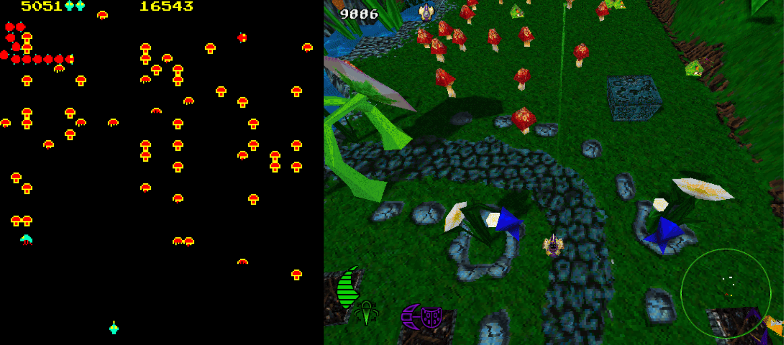

The designation "action game" covers a wide range of game styles, both 3D and 2D. But all games categorized under this label invariably have one aspect in common—they are all twitch games. The key skills tested by the gameplay are reaction time and hand-eye coordination under pressure. Action games tend to be simpler than most other types because there is only so much information and complexity that the average brain can interpret in unit time. As a general rule, this relationship can be stated as an inverse proportionality between the speed of a game and the complexity.

“动作游戏”这一名称涵盖了 3D 和 2D 两种游戏风格。但所有被归类到这一标签下的游戏都有一个共同点——它们都是反应类游戏。游戏考验的关键技能是压力下的反应时间和手眼协调能力。动作游戏往往比大多数其他类型的游戏简单，因为一般大脑在单位时间内所能解读的信息和复杂程度有限。一般来说，这种关系可以表述为游戏速度与复杂程度成反比。

Action games are the oldest genre—the very first arcade games were mainly action games, because the nature of the beast is exemplified in its simplicity. The game mechanics and gameplay are very simple and, provided the presentation layer is correspondingly simple, they are ideally suited to the lower spec (and older) machines.

动作游戏是最古老的游戏类型——最早的街机游戏主要是动作游戏，因为动作游戏的本质体现在其简单性上。游戏机制和玩法都非常简单，只要表现层也相应简单，它们就非常适合配置较低（和较老）的机器。

# Action Game Genres 动作游戏类型

For the purposes of discussion, the "action game" genre can be further divided into two sub-genres: those with shooting and those without. These sub-genres can be further divided, but at this point we would start to get into technology based distinctions—that is, the divisions are dependent on the technology used to present the game. For example, some people consider that the first-person shooter (FPS) is a genre in its own right. We can see this point of view, and it is a valid one under some circumstances. However, the key skill used in a FPS is reaction-based, and hence we'll be approaching all games that rely on reaction times as their key playing hook as a single genre. This is not as useless as it may seem. The fundamental patterns of action games—whether 2D, 3D, shooting, or non-shooting—are the same, no matter what the presentation layer.

为了便于讨论，“动作游戏”类型可进一步分为两个子类型：射击游戏和非射击游戏。这些子类型还可以进一步划分，但在这一点上，我们将开始进入基于技术的区分——也就是说，划分取决于用于呈现游戏的技术。例如，有些人认为第一人称射击游戏（FPS）本身就是一种类型。我们可以看到这种观点，而且在某些情况下也是合理的。然而，FPS 游戏中使用的关键技能是反应，因此我们将把所有以反应时间为主要玩法的游戏作为一个类型来看待。这并不像看起来那么无用。不管是 2D、3D、射击还是非射击，动作游戏的基本模式都是一样的，不管其表现层是什么。

So, given that we could argue that any distinctions within the action genre are pretty much arbitrary, we'll bravely soldier on with our basic division into shooters and non-shooters. Characteristically (and rather stereotypically) shooter games tend to appeal more to the male demographic, and non-shooters tend (although much more loosely) to appeal to female gamers more. (Consider that [Pac-Man](https://en.wikipedia.org/wiki/Pac-Man) was one of the first wildly successful games to have a roughly equal male/female player split. However, it's clear that this is not the only factor—[Centipede](https://en.wikipedia.org/wiki/Centipede_(1998_video_game)), a game that certainly involved violence, was also fairly successful with females.)

因此，我们可以说，动作类游戏中的任何区分都是非常武断的，我们将勇敢地继续把游戏分为射击类和非射击类。射击类游戏的特点是（相当刻板地）倾向于吸引男性玩家，而非射击类游戏则倾向于（尽管更宽泛地）吸引女性玩家。(考虑到[《吃豆人》](https://en.wikipedia.org/wiki/Pac-Man)是第一批大获成功的游戏之一，其男女玩家比例大体相当）。不过，这显然不是唯一的因素——[《蜈蚣》](https://en.wikipedia.org/wiki/Centipede_(1998_video_game))，一款当然涉及暴力的游戏，在女性玩家中也相当成功）。

Dividing the genre into shooters and non-shooters is useful, but it's still not quite fine-grained enough to be able to discuss the genre fully. The elements and rules can, for the most part, still be applied to just the two divisions, but there are certain issues that need to be covered in specific areas. Let's look at each of these divisions in a little more detail, and cover some of the types of game that are included in each of the divisions.

将这一类型划分为射击游戏和非射击游戏是有用的，但仍然不够精细，不足以全面讨论这一类型。在大多数情况下，这些元素和规则仍可适用于这两种类型，但有些问题需要在特定领域进行讨论。下面我们就来详细了解一下每个类别，并介绍每个类别中包含的一些游戏类型。

Almost all action games use a number of common elements that are covered in this chapter, such as lives, reaction tests, and hand-eye coordination tests. Many of them also use the levels, waves, and power-up design elements. Less common nowadays, but originally very common (possibly due to hardware limitations), is the single-screen element.

几乎所有的动作游戏都使用了本章所涉及的一些共同元素，如生命、反应测试和手眼协调测试。许多游戏还使用了关卡、波次和强化道具等设计元素。单屏元素如今已不常见，但最初却非常普遍（可能是由于硬件限制）。

We will be discussing all of these elements later in the chapter. Before we do that, we will examine each of our initial genre divisions in turn, starting with the shooters.

我们将在本章稍后部分讨论所有这些元素。在此之前，我们将从射击游戏开始，依次研究我们最初划分的每个类型。

## Shooters 射击游戏

Shooters make up the majority of action games. Shooter games (despite their designation) don't always involve explicit shooting, but they do focus on violence as a major game mechanic. Shooters generally—but not always—focus on the actions of the avatar using some sort of weapon. Usually, this weapon is a gun, or some other long-range weapon. A smaller portion of these makes use of local effect weapons, as in the case of fighting games, ranging from games such as the [Street Fighter](https://en.wikipedia.org/wiki/Street_Fighter) series to the modern tour de force of [Dead or Alive 3](https://en.wikipedia.org/wiki/Dead_or_Alive_3). Screens from both are shown in Figure 9.1.

射击游戏占动作游戏的大多数。射击游戏（尽管有这个名称）并不总是涉及明确的射击，但它们确实把暴力作为主要的游戏机制。射击游戏一般——但并不总是——侧重于化身使用某种武器的行动。这种武器通常是枪或其他远程武器。小部分射击游戏使用近战武器，如格斗游戏，从[《街头霸王》](https://en.wikipedia.org/wiki/Street_Fighter)系列到现代的[《死或生三》](https://en.wikipedia.org/wiki/Dead_or_Alive_3)。这两种游戏的画面如图 9.1 所示。

Figure 9.1. Fighting games. 图 9.1. 格斗游戏。

Usually, this particular class of game presents a similar interface, showing both fighters onscreen at once. Even if a fighting game is portrayed in 3D, the main playing region is the vertical 2D plane defined by drawing a straight line between the two fighters. Thus, almost without exception, the "3D" fighting game is still played in a 2D sense, no matter how much eye candy is thrown your way. Of course, 3D isn't the main area of innovation in fighting games, although the added realism it can provide is certainly worthwhile. For the most part, the area of innovation in fighting games is in the realism of the characters, (including their interactions with each other and their reactions to injury), and the methods used to control the fighters—especially when considering how to handle special moves and combos. The main elements found within fighting games are variants of rock-paper-scissors (to handle the outcomes of playing certain moves against another) and the combo move.

通常情况下，这种特殊类型的游戏会呈现类似的界面，在屏幕上同时显示两名格斗选手。即使格斗游戏采用了 3D 技术，主要的游戏区域也是在两个格斗者之间画一条直线所定义的垂直 2D 平面。因此，几乎无一例外的是，“3D”格斗游戏仍然是在 2D 的意义上进行的，无论有多么吸引眼球。当然，3D 并不是格斗游戏创新的主要领域，尽管它所带来的逼真度的提升肯定是值得的。在大多数情况下，格斗游戏的创新之处在于角色的逼真度（包括他们之间的互动和受伤后的反应），以及控制格斗者的方法，尤其是在考虑如何处理特殊动作和连击时。格斗游戏中的主要元素是“剪刀石头布”的变体（用于处理某些招式的对战结果）和连招。

Of course, the majority of games involving violence are actually "shooters." There are two broad classes that we will consider here: first-person shooters (FPS) such as [Quake III](https://en.wikipedia.org/wiki/Quake_III_Arena), [Unreal Tournament](https://en.wikipedia.org/wiki/Unreal_Tournament), and [Return to Castle Wolfenstein](https://en.wikipedia.org/wiki/Return_to_Castle_Wolfenstein), and 2D shooters such as [R-Type](https://en.wikipedia.org/wiki/R-Type), Space Tripper, [Commando](https://en.wikipedia.org/wiki/Commando_(video_game)), [Gauntlet Legends](https://en.wikipedia.org/wiki/Gauntlet_Legends), [Space Invaders](https://en.wikipedia.org/wiki/Space_Invaders), [Robotron](https://en.wikipedia.org/wiki/Robotron:_2084), [Defender](https://en.wikipedia.org/wiki/Defender_(1981_video_game)), [Uridium](https://en.wikipedia.org/wiki/Uridium), and [Centipede](https://en.wikipedia.org/wiki/Centipede_(1998_video_game)). Even though this list of games seems to include many that are not similar to the others, they all share the common attributes of an avatar, one or more ranged weapons, and a varying number of enemies. Each of the games take place in an arena designed to require a strategic use of the weapon(s) and of any other tools that the player's avatar may be provided with. Figures 9.2 to 9.5 show a selection of these games.

当然，大多数涉及暴力的游戏实际上都是“射击游戏”。在此我们将考虑两大类游戏：第一人称射击游戏（FPS），如[《雷神之锤三》](https://en.wikipedia.org/wiki/Quake_III_Arena)、[《虚幻竞技场》](https://en.wikipedia.org/wiki/Unreal_Tournament))和[《重返狼堡》](https://en.wikipedia.org/wiki/Return_to_Castle_Wolfenstein)；以及 2D 射击游戏，如[《异形战机》](https://en.wikipedia.org/wiki/R-Type)、《Space Tripper》、[《战场之狼》](https://en.wikipedia.org/wiki/Commando_(video_game))、[《圣铠传说》](https://en.wikipedia.org/wiki/Gauntlet_Legends)、[《太空入侵者》](https://en.wikipedia.org/wiki/Space_Invaders)、[《机器人大战》](https://en.wikipedia.org/wiki/Robotron:_2084)、[《防卫者》](https://en.wikipedia.org/wiki/Defender_(1981_video_game))、[《Uridium》](https://en.wikipedia.org/wiki/Uridium)和[《蜈蚣》](https://en.wikipedia.org/wiki/Centipede_(1998_video_game))。尽管这份游戏清单中似乎有许多游戏与其他游戏并不相似，但它们都有一个共同的属性，即一个化身、一种或多种远程武器以及数量不等的敌人。每个游戏都是在一个竞技场中进行的，竞技场的设计要求玩家战略性地使用武器和其他工具。图 9.2 至图 9.5 展示了其中的一些游戏。

Figure 9.2. Gauntlet and Gauntlet Legends. 图 9.2. 《Gauntlet》和《圣铠传说》

Figure 9.5. Uridium and Space Tripper. 图 9.5. 《Uridium》和《Space Tripper》

The reason that this particular range of 2D games has been chosen is that the gameplay has been enduring enough to have inspired modern updates. This implies that these games have some admirable qualities that we would do well to emulate. Of course, not all the updated versions have succeeded in capturing the gameplay of their parents as well as the designer might hope; in other cases, however, the gameplay matches or exceeds the original.

之所以选择这一系列 2D 游戏，是因为它们的玩法经久不衰，足以激发现代游戏的更新。这意味着，这些游戏具有一些值得钦佩的品质，值得我们效仿。当然，并不是所有的更新版本都能像设计者所希望的那样，成功地捕捉到原版游戏的玩法；但在其他情况下，游戏的玩法却能与原版相媲美，甚至超过原版。

The original versions of the games were all completely 2D, because they were all written way before the hardware to support advanced 3D graphics had even been conceived of. With so little hardware power, the focus couldn't really be on the graphics or flashy effects, so all the focus went into the gameplay. Fortunately, the developers of the updated versions realized this, and for the most part, they succeeded in the difficult task of preserving the gameplay while updating the appearance to keep up with modern standards.

原始版本的游戏都是完全 2D 的，因为它们都是在支持先进 3D 图形的硬件还没有出现之前就写好的。由于硬件能力有限，游戏的重点不可能真正放在画面或华丽的特效上，因此所有的重点都放在了游戏性上。幸运的是，更新版本的开发者们意识到了这一点，在大多数情况下，他们成功地完成了这一艰巨的任务：既保留了游戏性，又更新了外观以跟上现代标准。

The original [Gauntlet](https://en.wikipedia.org/wiki/Gauntlet_(1985_video_game)) was one of the first games that provided the option for cooperative multi-play (see Figure 9.2). Each player could take on one of four avatars (Warrior, Wizard, Valkyrie, and Elf), and adventure through an (almost) endless series of dungeons, searching for treasure and food. This game introduced (more or less) many of the common action game elements we will be discussing later, such as the locked door and key, monster generators, team play, and dungeon exit.

最初的[《Gauntlet》](https://en.wikipedia.org/wiki/Gauntlet_(1985_video_game))是最早提供多人合作游戏选项的游戏之一（见图 9.2）。每个玩家可以从四个化身（战士、巫师、女武神和精灵）中选择一个，在（几乎）无尽的地牢中冒险，寻找宝藏和食物。这款游戏引入了（或多或少）许多我们稍后将讨论的常见动作游戏元素，例如上锁的门和钥匙、怪物生成器、团队游戏和地牢出口。

There have been many updates for the classic [Gauntlet](https://en.wikipedia.org/wiki/Gauntlet_(1985_video_game)) , starting with the immediate sequel, [Gauntlet II](https://en.wikipedia.org/wiki/Gauntlet_II). Some have been more successful than others. The most recent of these updates, [Gauntlet Legends](https://en.wikipedia.org/wiki/Gauntlet_Legends), brings the graphics and environment up to date, adding a backstory and some extra features, but still manages to maintain the core of the old game mechanic.

从紧接着的续作[《Gauntlet II》](https://en.wikipedia.org/wiki/Gauntlet_II)开始，经典游戏[《Gauntlet》](https://en.wikipedia.org/wiki/Gauntlet_(1985_video_game))有了许多更新。其中有些更新比较成功。最近一次更新是[《圣铠传说》](https://en.wikipedia.org/wiki/Gauntlet_Legends)，它更新了图形和环境，增加了背景故事和一些额外功能，但仍设法保持了旧游戏机制的核心。

Similarly, the original [Robotron: 2084](https://en.wikipedia.org/wiki/Robotron:_2084) was a classic game when it was released into arcades back in 1982 (see Figure 9.3). The sole object of this game was to defend the last human family against wave upon wave of killing machines bent on their destruction. Another notable feature was the ability to shoot independently of the direction in which the avatar was moving. This was controlled by a second joystick.

同样，早在 1982 年，最初的[《机器人大战：2084》](https://en.wikipedia.org/wiki/Robotron:_2084)在街机厅发售时就已成为一款经典游戏（见图 9.3）。这款游戏的唯一目标就是保卫最后的人类家庭，抵御一波又一波一心想要毁灭他们的杀人机器。该游戏的另一个显著特点是可以独立射击，不受虚拟人移动方向的影响。这是由第二个操纵杆控制的。

Figure 9.3. Robotron 2084 and Robotron X. 图 9.3. 《机器人大战：2084》和《机器人大战：X》。

The strength of the Robotron gameplay meant that for many years, updates just didn't happen. In fact, you can still get pixel-perfect versions of Robotron 2084 for the PC, Gameboy Advance, and other consoles. The first updated version (that we know of) was more of a tribute to the original Robotron than an update—Super Smash TV, based around a TV show where the contestants battled hordes of attackers in single-screen arenas.

由于[《机器人大战：2084》](https://en.wikipedia.org/wiki/Robotron:_2084)的游戏性很强，多年来一直没有更新。事实上，你仍然可以在 PC、Gameboy Advance 和其他游戏机上买到像素完美的[《机器人大战：2084》](https://en.wikipedia.org/wiki/Robotron:_2084)。第一个更新版本（据我们所知）与其说是更新，不如说是向原版[《机器人大战：2084》](https://en.wikipedia.org/wiki/Robotron:_2084)致敬——《超级大乱斗 TV》，该游戏以一个电视节目为基础，参赛者在单屏竞技场上与成群的攻击者作战。

The first "official" update of this game, [Robotron X](https://en.wikipedia.org/wiki/Robotron_X), heralded the start of the "retro-gaming" fad, and updated the graphics to 3D. The gameplay (apart from a few extra bonus levels) was barely touched, but the shift to 3D negatively impacted the playability.

该游戏的第一个“官方”更新版[《机器人大战：X》](https://en.wikipedia.org/wiki/Robotron_X)预示着“复古游戏”热潮的开始，并将画面更新为 3D。游戏的玩法（除了几个额外的奖励关卡）几乎未作改动，但 3D 的转变对游戏的可玩性产生了负面影响。

The advantage of the original Robotron was that all the action could be viewed onscreen at one time (using the single-screen design element). The 3D update, with its swooping camera, often obscured parts of the playing area. This meant that occasionally you would be killed by an enemy that suddenly appeared from an off-camera region—an impossibility in the original game. This detracts from the playability because it is not the player's fault that he cannot see offscreen. In the original Robotron, if the player died, it was his fault—all the information was there to be interpreted, so he had no excuses if he failed to react to the situation quickly enough to avoid the danger.

原版[《机器人大战：2084》](https://en.wikipedia.org/wiki/Robotron:_2084)的优势在于可以在屏幕上同时观看所有动作（使用单屏设计元素）。3D 升级版的俯拍镜头经常会遮挡部分游戏区域。这意味着偶尔你会被突然从镜头外区域出现的敌人杀死——这在原版游戏中是不可能的。这降低了游戏的可玩性，因为看不到屏幕外并不是玩家的错。在最初的[《机器人大战：2084》](https://en.wikipedia.org/wiki/Robotron:_2084)中，如果玩家死了，那就是他的错——所有的信息都在那里等着玩家去解读，所以如果他没能对情况做出足够快的反应以避免危险，他就没有任何借口。

[Centipede](https://en.wikipedia.org/wiki/Centipede_(1998_video_game)) is yet another classic arcade game from the early days (see Figure 9.4). This game is often lauded as an example of near-perfect gameplay. The elements of the game are set up in such a way as to balance out perfectly and exhibit many interesting emergent properties. The player has to make informed choices about when and how to clear the mushrooms—too many, and the centipede has an easier time reaching you and is harder to hit; too few, and more enemies appear to add more mushrooms.

[《蜈蚣》](https://en.wikipedia.org/wiki/Centipede_(1998_video_game))是早期另一款经典街机游戏（见图 9.4）。这款游戏经常被称赞为近乎完美的游戏范例。游戏中的各个元素都设置得非常平衡，并表现出许多有趣的涌现特性。玩家必须对何时以及如何清除蘑菇做出明智的选择——蘑菇太多，蜈蚣就更容易接近你，也更难击中你；蘑菇太少，就会出现更多的敌人，增加更多的蘑菇。


译者注：[《蜈蚣》游玩视频](https://www.youtube.com/watch?v=V7XEmf02zEM&t=4s&ab_channel=KlausS.)。


Figure 9.4. Centipede and Centipede 3D. Figure 9.4. 《蜈蚣》和《蜈蚣3D》

Hasbro, flushed with the success of their [Frogger](https://en.wikipedia.org/wiki/Frogger) remake, which sold millions of copies, decided to try again with a new remake. The remake of Centipede added 3D graphics, and a story. Unfortunately, something was lost during the process, and the gameplay suffered as a consequence. Even the inclusion of a pseudo-3D version of the original arcade game failed to save this attempt at retro-chic. One of the keys behind the playability of the original Centipede (and, in fact, a consistent theme running through all successful action games) was that the player did not have to think in order to interpret what was on the screen. It was easy, and took place at a subconscious level: The centipede is one color, mushrooms are another color, and spiders are yet another color. Unfortunately, this use of color to provide information was lost in the update, where the emphasis was on the graphics appearing realistically textured and interesting. Unfortunately, that meant that the players' subconscious had to work that much harder to be able to determine what was happening onscreen. Combine this with the shift from a 2D fixed play-field to a fully scrolling 3D world, and it becomes fairly easy to understand why this update failed to maintain the standards set by the original.

孩之宝公司成功重制了[《青蛙过河》](https://en.wikipedia.org/wiki/Frogger)，销售量高达数百万份，于是他们决定再次尝试新的重制。《蜈蚣》的重制版加入了 3D 图形和故事。遗憾的是，在这个过程中失去了一些东西，游戏性也因此受到了影响。即使加入了原街机游戏的伪 3D 版本，也未能挽救这款复古时尚的尝试。原版[《蜈蚣》](https://en.wikipedia.org/wiki/Centipede_(1998_video_game))的可玩性背后的关键之一（事实上，这也是贯穿所有成功动作游戏的一贯主题）是玩家无需思考就能理解屏幕上的内容。这很容易，而且是在潜意识层面上进行的：蜈蚣是一种颜色，蘑菇是另一种颜色，蜘蛛又是另一种颜色。遗憾的是，这种利用颜色来提供信息的做法在更新版中消失了，因为更新版的重点是让画面呈现出逼真的质感和趣味性。不幸的是，这意味着玩家的潜意识必须付出更大的努力才能确定屏幕上发生了什么。再加上从 2D 固定游戏场地到全滚动 3D 世界的转变，我们就很容易理解为什么这次更新未能保持原版的标准了。


译者注：[《青蛙过河》游玩视频](https://www.youtube.com/watch?v=WNrz9_Fe-Us&ab_channel=OldClassicRetroGaming)。


As shown in Figure 9.5, the space shooter is one of the oldest styles of games. From the venerable [Space Invaders](https://en.wikipedia.org/wiki/Space_Invaders) through to modern masterpieces such as Space Tripper, this has been a class of game that is consistently popular. One of the fondly remembered classic games from the days of 8-bit computers is [Uridium](https://en.wikipedia.org/wiki/Space_Invaders), a game that puts the player in a Manta assault craft on a one-man attack run against a fleet of enemy space stations. As the Manta flies from left to right, waves of aliens and missiles launched from the stations converge on the player. The space stations were huge, spanning several screen-widths, and so the player had to be aware of what was happening not only on the visible screen he could see, but also in the much larger region that he could not. This was a mechanic lifted straight from Williams' Defender, although [Uridium](https://en.wikipedia.org/wiki/Space_Invaders) is played from a top-down view, not a side view. This class of game requires extremely good reflexes on the part of the player, and additionally, the ability to form a mental model of what was happening outside the bounds of the screen. There are two main classes of scrolling shooter—those with fixed scrolling, where the screen would continuously scroll in one direction such as Irem's [R-Type](https://en.wikipedia.org/wiki/R-Type), and those with variable scrolling, where the player had some degree of control over the scroll direction.

如图 9.5 所示，太空射击游戏是最古老的游戏类型之一。从古老的[《太空入侵者》](https://en.wikipedia.org/wiki/Space_Invaders)到现代杰作《Space Tripper》，这一类游戏一直深受玩家欢迎。[《Uridium》](https://en.wikipedia.org/wiki/Uridium)是 8 位电脑时代的经典游戏之一，这款游戏让玩家驾驶 Manta 突击艇对敌方空间站舰队发起单人攻击。当 Manta 从左向右飞行时，一波波外星人和从空间站发射的导弹就会向玩家聚拢。空间站非常巨大，横跨数个屏幕宽度，因此玩家不仅要注意自己能看到的屏幕上发生的事情，还要注意自己看不到的更大区域内发生的事情。这是从威廉姆斯的[《防卫者》](https://en.wikipedia.org/wiki/Defender_(1981_video_game))中直接借鉴过来的机制，尽管[《Uridium》](https://en.wikipedia.org/wiki/Uridium)是从俯视视角而非侧视视角进行游戏的。这类游戏要求玩家有极好的反应能力，此外，还要求玩家能对屏幕外发生的事情形成心理模型。滚动射击游戏主要分为两类——一类是固定滚动，即屏幕会沿着一个方向持续滚动，如 Irem 的[《异形战机》](https://en.wikipedia.org/wiki/R-Type)；另一类是可变滚动，即玩家可以在一定程度上控制滚动方向。


译者注：[《Space Tripper》游玩视频](https://www.youtube.com/watch?v=xXDg7nxHEOE&ab_channel=NinjaRyuPL)。


Usually the degree of control was limited. Common configurations included horizontal, vertical, 4-way, 8-way, and multi-way scrolling. For players to be able to form the mental model required for successful play, a different technique is required for each of these types. The fixed scrolling games relied more often than not on memory. As well as reaction-time challenges, they also used memory challenges. A player learned the game as she played; if she got killed in a particular spot once, then she would learn the pattern of enemies for the next time around and hopefully wouldn't suffer the same fate. This was also used (although not to the same all-encompassing extent) in the variably scrolling games. In most cases, it certainly did the player no harm to remember the rough order of enemy attack, but the gameplay was not centered on that as a core mechanism. Instead, this class of game often provided players with a mini-map that displayed the game world in miniature, giving them an idea of what to expect to appear next on the edge of their screens. Space Tripper, from PomPom (www.pompom.org.uk), is a modern update of the archetypal scrolling shooter using 3D graphics and focuses on the core gameplay of the genre. Similar in concept to [Uridium](https://en.wikipedia.org/wiki/Space_Invaders), it succeeds by using the 3D graphics solely as a presentation method. The actual game makes little use of the third dimension—except occasionally for dramatic effect—and remains, for the most part, a 2D game. This is what makes it so effective—the developers have not succumbed to the temptation to make 3D an important part of the gameplay. For this style of fast-action game, it's hard enough maneuvering in 2D—to do so in 3D would be an order of magnitude more difficult.

控制程度通常有限。常见的配置包括水平、垂直、4 向、8 向和多向滚动。为了让玩家能够形成成功游戏所需的心理模型，每种类型的游戏都需要不同的技巧。固定滚动游戏往往依赖于记忆。除了反应时间挑战外，它们还使用记忆挑战。玩家在玩游戏的过程中学习游戏；如果她在一个特定的地方被杀了一次，那么她下次就会学习敌人的模式，并希望不会重蹈覆辙。在可变卷轴游戏中也使用了这种方法（虽然没有达到同样的全面程度）。在大多数情况下，玩家记住敌人攻击的大致顺序当然没有坏处，但游戏玩法并不是以此为核心机制。相反，这类游戏通常会为玩家提供一个小地图，显示游戏世界的缩影，让玩家知道屏幕边缘下一步会出现什么。来自 PomPom 公司（www.pompom.org.uk）的《Space Tripper》使用 3D 图形对典型的滚动射击游戏进行了现代更新，并专注于这一类型游戏的核心玩法。该游戏的概念与[《Uridium》](https://en.wikipedia.org/wiki/Space_Invaders)相似，只是将 3D 图形作为一种表现手法。在实际游戏中，除了偶尔为了戏剧效果外，几乎没有使用三维空间，在大多数情况下，它仍然是一款 2D 游戏。这正是它的成功之处——开发者没有屈服于诱惑，让 3D 成为游戏的重要组成部分。对于这种类型的快速动作游戏来说，在二维空间中进行操作已经很困难了，如果在三维空间中进行操作，难度会增加一个数量级。

Figure 9.6 shows two examples of the logical extension of the 2D shooter—the 3D FPS. This is the ultimate expression of the shooter side of the genre. Fully 3D FPS games are an entirely different animal from their 2D ancestors. For a start, they are bound by hardware limitations to a much greater extent than 2D games. This can be clearly seen from the early 3D FPS games such as [Battlezone](https://en.wikipedia.org/wiki/Battlezone_(1980_video_game)), where there were no more than two or three enemies at one time. Even more recent games, such as [Quake III](https://en.wikipedia.org/wiki/Quake_III_Arena), have comparatively few enemies present. Of course, this is not just due to hardware issues (which will become much less of an issue over the next few years). It's also due to perspective issues. The player can only interpret and handle so much information at one time, and shifting the perspective to full 3D complicates this. This will be explained in more detail in the later section on game perspectives.

图 9.6 展示了 2D 射击游戏的逻辑延伸——3D FPS 的两个例子。这是射击类游戏的终极表现形式。全 3D FPS 游戏与 2D 游戏完全不同。首先，与 2D 游戏相比，它们受硬件限制的程度要大得多。早期的 3D FPS 游戏，如[《终极战区》](https://en.wikipedia.org/wiki/Battlezone_(1980_video_game))，一次只能有两三个敌人，就可以清楚地看到这一点。即使是较新的游戏，如[《雷神之锤三》](https://en.wikipedia.org/wiki/Quake_III_Arena)，出现的敌人也相对较少。当然，这不仅仅是硬件问题造成的（未来几年这个问题会大大减少）。这也是视角问题造成的。玩家一次只能解读和处理如此多的信息，而将视角转换为全 3D 会使问题变得更加复杂。这一点将在后面有关游戏视角的章节中详细说明。

Figure 9.6. Battlezone and Quake III. 图 9.6. 《终极战区》 和《雷神之锤三》。


译者注：[《终极战区》游玩视频](https://www.youtube.com/watch?v=Ctr54kopo8I&ab_channel=ShaneMcComas)。


## Non-Shooters 非射击游戏

Many games—particularly in the early years of the industry before commercial pressures intervened to the levels they have today—were non-violent. This proliferation of non-violent games with strange themes is often likened to the early days of the movie industry, where creativity was the highest driving force, before the big money moved in.

许多游戏——尤其是在商业压力尚未达到今天这种程度之前的游戏产业早期——都是非暴力的。这种题材奇特的非暴力游戏的泛滥常常被比作电影业的早期，在大笔资金进入之前，创意是电影业的最大驱动力。

Today, most games seem to be aimed at the typical male 25-35 demographic, but there are still notable exceptions. As we've already stated, the non-violent games seem to appeal more to the female demographic. One of the reasons for this, we feel, is that by removing the easy option of violence, the designer has to think a little bit harder about how to provide the gameplay hooks.

如今，大多数游戏似乎都针对 25-35 岁的典型男性人群，但也有明显的例外。正如我们已经说过的，非暴力游戏似乎更吸引女性群体。我们认为，造成这种情况的原因之一是，去掉了暴力这一简单的选项，设计者就必须在如何提供游戏性方面多花一点心思。

Notable "non-shooter" action games include [Marble Madness](https://en.wikipedia.org/wiki/Marble_Madness), [Lode Runner](https://en.wikipedia.org/wiki/Lode_Runner), [Pac-Man](https://en.wikipedia.org/wiki/Pac-Man), [Chuckie Egg](https://en.wikipedia.org/wiki/Chuckie_Egg), the Mario games, [Q*Bert](https://en.wikipedia.org/wiki/Q*bert), Super Monkey Ball [1](https://en.wikipedia.org/wiki/Super_Monkey_Ball) and [2](https://en.wikipedia.org/wiki/Super_Monkey_Ball_2), [Pong](https://en.wikipedia.org/wiki/Pong), [Donkey Kong](https://en.wikipedia.org/wiki/Donkey_Kong), and [Frogger](https://en.wikipedia.org/wiki/Frogger). All these games have the same non-violence motif running through them (although the latter two are arguable). The primary reason for this is because the games were (to a greater or lesser extent, depending on the game) designed to be appealing to children, particularly in the case of the Mario series of games.

著名的“非射击”动作游戏包括[《狂暴弹珠》](https://en.wikipedia.org/wiki/Marble_Madness)、[《淘金者》](https://en.wikipedia.org/wiki/Lode_Runner)、[《吃豆人》](https://en.wikipedia.org/wiki/Pac-Man)、[《偷鸡蛋》](https://en.wikipedia.org/wiki/Chuckie_Egg)、《马里奥》、[《Q伯特》](https://en.wikipedia.org/wiki/Q*bert)、《超级猴子球》 [1](https://en.wikipedia.org/wiki/Super_Monkey_Ball) 和 [2](https://en.wikipedia.org/wiki/Super_Monkey_Ball_2)、[《乓》](https://en.wikipedia.org/wiki/Pong)、[《大金刚》](https://en.wikipedia.org/wiki/Donkey_Kong)和[《青蛙过河》](https://en.wikipedia.org/wiki/Frogger)。所有这些游戏都贯穿着同样的非暴力主题（尽管后两款游戏还有待商榷）。主要原因是这些游戏（视游戏而定，或多或少）都是为了吸引儿童而设计的，尤其是马里奥系列游戏。

Frogger, shown in Figure 9.7, was originally a highly successful arcade game released back in 1981. The aim of the game was to get the world's only non-swimming frog family across a busy road and a logging river infested with crocodiles and fickle turtles. From these humble beginnings sprang one of the most successful series of remakes of all time. Hasbro's remake of Frogger (also shown in Figure 9.7) sold millions of copies, and was a mainstay of the software charts for many months after release. Interestingly enough, the developers focused on keeping the gameplay virtually unchanged, and just updated the presentation, increasing the variety of the levels available to the player. Frogger 2, released several years later, introduced a more structured game, while still remaining faithful to the core gameplay of the original.

如图 9.7 所示，[《青蛙过河》](https://en.wikipedia.org/wiki/Frogger)最初是一款非常成功的街机游戏，于 1981 年发行。游戏的目的是让世界上唯一不会游泳的青蛙一家穿过繁忙的公路和充满鳄鱼和善变乌龟的伐木河。从这个不起眼的小游戏开始，有史以来最成功的重制游戏系列之一诞生了。孩之宝公司重制的[《青蛙过河》](https://en.wikipedia.org/wiki/Frogger)（如图 9.7 所示）卖出了数百万份拷贝，在发布后的好几个月里一直是软件排行榜上的中流砥柱。有趣的是，开发商几乎没有改变游戏的玩法，只是更新了游戏的表现形式，增加了游戏关卡的多样性。几年后推出的《青蛙过河二》在忠实于原版核心玩法的基础上，引入了结构性更强的游戏。

Figure 9.7. Frogger and Frogger 3D. 图 9.7. 《青蛙过河》和《青蛙过河 3D》

Of course, the phenomenal success of the Frogger remake caused a scramble for licenses for further remakes, which the publishers viewed as a license to print money. Consequently, there have been a number of ill-advised and hastily conceived remakes released onto the market. [Pac-Man](https://en.wikipedia.org/wiki/Pac-Man) was one of the most successful games of its generation. Obviously, it could not escape being remade. One of the (many) remakes was [Pac-Man: Adventures in Time](https://en.wikipedia.org/wiki/Pac-Man:_Adventures_in_Time). This update brought new additions to the game, including a story and a set of themed levels. Unfortunately, much in the same way as with [Centipede](https://en.wikipedia.org/wiki/Centipede_(1998_video_game)), these additions diminished rather than added to the gameplay. However, [Pac-Man World 2](https://en.wikipedia.org/wiki/Pac-Man_World_2) on the Gamecube is an excellent use of the license.

当然，[《青蛙过河》](https://en.wikipedia.org/wiki/Frogger)重制版的巨大成功引发了对进一步重制版授权的争夺，出版商将此视为印钞许可证。因此，市场上出现了许多不明智、草率构思的重制版游戏。[《吃豆人》](https://en.wikipedia.org/wiki/Pac-Man)是那个时代最成功的游戏之一。显然，它也难逃被重制的命运。[《吃豆人：时空冒险》](https://en.wikipedia.org/wiki/Pac-Man:_Adventures_in_Time)就是（众多）重制版之一。这次更新为游戏增添了新内容，包括一个故事和一组主题关卡。遗憾的是，与[《蜈蚣》](https://en.wikipedia.org/wiki/Centipede_(1998_video_game))一样，这些新增内容不但没有增加游戏的可玩性，反而削弱了游戏的可玩性。不过，Gamecube 上的[《吃豆人世界二》](https://en.wikipedia.org/wiki/Pac-Man_World_2)则是对这一授权的出色运用。

Another phenomenally successful game was Q*Bert, initially released in 1982. This game placed a strange orange character on a pyramid of cubes, who was then chased by enemies including a cascade of balls and an evil snake named Coily. The object of the game was to change all the cubes to a target color by landing on them one or more times. The remake (shown on the right in Figure 9.8) followed the familiar pattern of adding a story and updating the presentation. Fortunately, due to the quasi-3D appearance of the original game, the gameplay translated well to the update, and the story doesn't affect the gameplay negatively, aside from minor issues caused by the entire playing area not being visible on the screen at one time.

另一款非常成功的游戏是 1982 年发行的[《Q伯特》](https://en.wikipedia.org/wiki/Q*bert)。这款游戏将一个奇怪的橙色角色放置在一个由方块组成的金字塔上，然后他就会被层层叠叠的球和一条名叫 Coily 的邪恶蛇等敌人追赶。游戏的目的是通过一次或多次落在方块上，将所有方块变为目标颜色。重制版（如图 9.8 右所示）沿用了我们熟悉的模式，即添加故事情节和更新表现形式。幸运的是，由于原版游戏的准三维外观，游戏玩法在更新后得到了很好的诠释，除了因屏幕上无法同时显示整个游戏区域而产生的小问题外，故事并没有对游戏玩法产生负面影响。

Figure 9.8. Q*Bert and Q*Bert 3D. 图 9.8. 《Q伯特》和《Q伯特 3D》。


译者注：[《Q伯特》游玩视频](https://www.youtube.com/watch?v=HKIbhaQfs-A&ab_channel=OldClassicRetroGaming)。


# Design Elements 设计元素

Action games are a good source of distinct design elements, mainly because their relative simplicity makes analysis of their game mechanics fairly easy compared to the more complex genres.

动作游戏是独特设计元素的良好来源，这主要是因为与更复杂的游戏类型相比，动作游戏的相对简单性使得对其游戏机制的分析变得相当容易。

What we are attempting to do when we are extracting design elements from games on a genre-by-genre basis is to form the basis of a genre-describing "meta-game." What we mean by meta-game is a description of an archetypal action game. Of course, such a construct is purely hypothetical. It would be pretty much impossible to actually produce a fully comprehensive document. So with this in mind, let's start with an analysis of the design elements that govern the rules of the game. These design elements are only a small subset of the whole, but the aim is to give a starting point for your own investigations into the gameplay mechanics of action games.

当我们从不同类型的游戏中提取设计元素时，我们所要做的就是形成一个描述类型的“元游戏”的基础。我们所说的元游戏就是对典型动作游戏的描述。当然，这种构建纯属假设。要想真正编写出一份全面的文件几乎是不可能的。因此，考虑到这一点，让我们从分析支配游戏规则的设计元素开始。这些设计元素只是整体中的一小部分，但目的是为你自己研究动作游戏的游戏机制提供一个起点。

## The Rules 规则

The rules of an action game describe the basic game mechanics. They are usually very simple because of the frenetic nature of the gameplay. Fundamentally, action games are games that require skill as the primary factor for play, not rote memorization of complex rules.

动作游戏的规则描述了基本的游戏机制。由于游戏的狂热性质，规则通常非常简单。从根本上说，动作游戏是一种需要以技巧为主要因素的游戏，而不是死记硬背复杂规则的游戏。

There are many design elements that we can examine here, and the following few sections will cover some of these. Note that words in bold indicate references to other design elements within this chapter.

在这里，我们可以研究许多设计元素，下面几节将介绍其中的一些。请注意，粗体字表示本章中提到的其他设计元素。

### Levels 关卡

Action games are often split into a succession of levels. A level is a specifically defined area in the game arena, in which the objective for the player is to complete a specific task. When the task is finished, the level is complete. Each level is played until complete, and upon completion the player's avatar is moved to the next level, and play continues. Generally, the difficulty will increase with each subsequent level.

动作游戏通常分为一系列关卡。关卡是游戏竞技场中一个特定的区域，玩家的目标是完成特定的任务。任务完成后，关卡也就结束了。每个关卡都要玩到完成为止，完成后，玩家的化身就会被移动到下一个关卡，游戏继续进行。一般来说，每过一关，难度就会增加。

Often, levels are grouped by theme. All the themed levels in the set will have a similar appearance and set of enemies. A set of themed levels usually ends with an encounter with a **big boss**. In some cases, the boss has to be defeated with the use of **power-ups** and/or skills that the player gained during the preceding level set.

关卡通常按主题分组。一组关卡中的所有主题关卡都会有相似的外观和敌人。一组主题关卡的最后通常会遇到一个**大首领**。在某些情况下，必须使用玩家在前一组关卡中获得的**强化道具**和/或技能才能打败首领。

### Checkpoints 检查点

If the nature of the game is such that the player progresses through a level, then the position that the player's avatar appears in after a life has been lost is often determined by the use of checkpoints.

如果游戏的本质是让玩家在关卡中不断前进，那么玩家的化身在失去生命后出现的位置通常是由检查点决定的。

The most straightforward form of checkpoint is that the avatar appears in the same location where it died, or in the case where that is impossible (for example, Mario falling into water), then it appears in the last safe location before it died (for example, the last platform that Mario was on before he fell in the water). The state of the level is unchanged—the avatar just reincarnates, and play continues.

最直接的检查点形式是化身出现在死亡时的同一位置，如果不可能出现在同一位置（例如马里奥掉进水里），则化身会出现在死亡前的最后一个安全位置（例如马里奥掉进水里前的最后一个平台）。关卡的状态保持不变，化身只是复活，游戏继续进行。

Other (more difficult) games, such as Space Tripper, simply restart the level from the beginning upon avatar death. This particular form is fairly rare, because it increases the game challenge significantly, and often causes player frustration. It requires that the player play a "perfect" level in order to progress to the next one.

其他（难度更大的）游戏，如《Space Tripper》，则会在化身死亡后直接从头开始重新启动关卡。这种形式相当少见，因为它大大增加了游戏的挑战性，常常会让玩家感到沮丧。它要求玩家表现“完美”才能进入下一关。

The final form of this design element is an amalgam between the first two. As the player progresses through the level, he reaches a number of predefined checkpoints. When the avatar dies, the level is reset to the last checkpoint that the player successfully achieved. An example of a classic game that uses this form is [Moon Patrol](https://en.wikipedia.org/wiki/Moon_Patrol), shown in Figure 9.9.

这一设计元素的最终形式是前两者的混合体。当玩家在关卡中前进时，他会到达一些预定义的检查点。当化身死亡时，关卡会重置到玩家成功到达的最后一个检查点。图 9.9 所示的[《月球巡逻队》](https://en.wikipedia.org/wiki/Moon_Patrol)就是采用这种形式的经典游戏的一个例子。

Figure 9.9. Moon Patrol. 图 9.9. 《月球巡逻队》。

### Lives 生命

The player's avatar is usually given a small number of reprieves from death. Initially, the number of lives provided usually ranges from between three and five. A life is lost by collision with an enemy or some other dangerous structure. Extra lives can be earned either by picking up a **power-up** or reaching a certain **score** threshold multiple. The player's avatar is usually invulnerable for a few seconds when reappearing after losing a life, in order for the player to gather his bearings. When all lives are lost, the game is over.

玩家的化身通常会有少量的免死金牌。最初提供的生命值通常在 3 到 5 之间。与敌人或其他危险建筑相撞会导致生命损失。额外的生命可以通过拾取**强化道具**或达到一定的**分数**阈值的倍数来获得。玩家的化身在失去生命后重新出现时通常会有几秒钟的无敌状态，以便玩家调整好状态。当玩家失去所有生命时，游戏就结束了。

Often, this design element appears in conjunction with the **energy** design element. If this occurs, then the avatar isn't destroyed immediately on contact with the enemy. Instead, energy is drained from the avatar. When all the energy is drained, a life is lost. When all lives are lost, the game is over.

这种设计元素通常与**能量**设计元素同时出现。如果这样，化身就不会在与敌人接触时立即被摧毁。相反，化身的能量会被消耗。当能量耗尽时，就会失去一条生命。生命耗尽后，游戏结束。

### Energy 能量

The player's avatar is given a limited amount of energy, some of which is depleted when the avatar is injured. It can often be partially, or even fully, replenished by the use of a **collectible** or a **power-up**. When the avatar's energy is depleted, the game is over.

玩家的化身拥有的能量有限，当化身受伤时，部分能量会被消耗。通常可以通过使用**收集品**或**强化道具**来补充部分甚至全部能量。当化身的能量耗尽时，游戏也就结束了。

This design element is sometimes used in conjunction with the **lives** design element. In this case, when the avatar's energy is depleted, one of the lives are lost. Sometimes the energy is spread over a number of physical features—for example, it can be a limited resource that is shuffled between shields and fuel, requiring the player to carefully balance resources.

这种设计元素有时会与**生命**设计元素结合使用。在这种情况下，当化身的能量耗尽时，就会失去一条生命。有时，能量会分散在一些物理特征上——例如，它可以是一种有限的资源，在护盾和燃料之间转换，要求玩家仔细平衡资源。

### Time Limit 时间限制

The time limit design element is indicated by the use of a timer that counts down from some initial value to zero. When the timer reaches zero, an action occurs that causes a major event in the game.

时间限制设计元素是通过使用一个从某个初始值倒计时到零的计时器来表示的。当计时器到达零时，游戏中就会发生重大事件。

The time limit is normally used in one of three ways. The first way is as a level timer. The player has a limited amount of time to complete the level, and if he fails to do so, the level is reset, and the player has to start again. Often, this is accompanied by a life loss and, if the level is finished with time left over, then this excess time is multiplied by a constant as a score bonus.

时间限制通常有三种使用方式。第一种方式是关卡计时器。玩家在有限的时间内完成关卡，如果失败，关卡就会重置，玩家必须重新开始。通常情况下，玩家会损失一条生命，如果完成关卡后还有剩余时间，那么多余的时间会乘以一个常数作为分数奖励。

The second use of the time limit design element is as the countdown to a catastrophe. The player has to achieve some task before the timer runs out, or the task will become much more difficult to achieve. This particular form is used in Sinistar. When the timer runs out, it means that the eponymous Sinistar has been built, and the player is in a lot of trouble.

时间限制设计元素的第二种用途是灾难倒计时。玩家必须在计时器耗尽之前完成某些任务，否则任务将变得更加难以完成。《Sinistar》中就采用了这种特殊形式。当计时器耗尽时，就意味着同名的 Sinistar 已经建成，玩家将面临巨大的麻烦。

The third use of the time limit design element is to limit the effectiveness of **power-ups**. When the timer runs out, the temporary power-up that it governed is removed, and the player's avatar reverts to the normal state. Pac-Man's power pellets, which allow the Pac-Man to eat the ghosts for a limited time, are good examples of this form.

时间限制设计元素的第三个用途是限制**强化道具**效果。当定时器耗尽时，它所支配的临时能力就会被移除，玩家的化身就会恢复到正常状态。吃豆人的能量丸可以让吃豆人在有限的时间内吃掉幽灵，就是这种形式的很好例子。

### Score 分数

One feature that is often specific to action games is the score indicator. Often in an action game, the only indicator of progress is a score. It is how the player is intended to measure her success against others. Many types of games do not use the score pattern, but action games are pretty much centered around it.

动作游戏通常有一个特有的功能，那就是分数指示器。在动作游戏中，分数往往是衡量游戏进度的唯一指标。玩家可以通过分数来衡量自己与他人的差距。许多类型的游戏都不使用分数模式，但动作游戏几乎都以分数模式为中心。

Scores are recorded in high-score tables for posterity, and to provide bragging rights for the very best players. Many games also reward skillful play with bonus scores and multipliers. The classic example of the score multiplier in action can be found in [Pac-Man](https://en.wikipedia.org/wiki/Pac-Man): After getting the power pill, the first ghost eaten earns 200 points, the next earns 400 points, then 800, and then 1600 respectively. Hence, skillful play is rewarded with higher and higher scores.

分数被记录在高分榜中，供后人瞻仰，并为最优秀的玩家提供炫耀的资本。许多游戏还通过奖励分数和加倍来奖励技术高超的玩家。在[《吃豆人》](https://en.wikipedia.org/wiki/Pac-Man)中可以找到分数加倍的经典例子：吃到能量药丸后，吃到的第一个幽灵可以获得 200 分，下一个可以获得 400 分，然后分别是 800 分和 1600 分。因此，玩得越熟练，分数就会越来越高。

### Power-Ups 强化道具

One of the staple design elements of action games is the power-up. As a reward for progress, the player is given the opportunity to increase the strength of his avatar. In the case of a shooter, this can come in the form of stronger weapons or shields.

强化道具是动作游戏的主要设计元素之一。作为对玩家进步的奖励，玩家有机会增强其化身的实力。在射击游戏中，玩家可以获得更强的武器或护盾。

Power-ups come in two main strains: permanent and temporary. A permanent power-up is one that remains with the avatar for the remainder of the game (or at least the current life or level). Space Tripper (and many other shoot 'em-ups) uses this model. Space Tripper is unique, however, in that when the avatar dies, only power-ups gained on that level are lost.

强化道具主要有两种：永久强化道具和临时强化道具。永久强化道具是指在游戏剩余时间内（或至少在当前生命或等级中）一直伴随着化身的装备。《Space Tripper》（以及许多其他射击游戏）都采用了这种模式。不过，《Space Tripper》的独特之处在于，当化身死亡时，只有在该关卡中获得的强化道具才会丢失。

Temporary power-ups are usually short lived (anything from a few seconds up to a couple of minutes) and provide the avatar with a powerful advantage for a short time (such as shields). The general rule is that the more powerful the advantage, the shorter the time it is available for. The Quad Damage power-up in [Quake III Arena](https://en.wikipedia.org/wiki/Quake_III_Arena) is a perfect example of this. An alternative to the time limit is to allow a certain amount of usage. For example, shields may be used up after they are powered on for a certain period of time, or after a certain number of hits.

临时强化道具通常持续时间很短（从几秒到几分钟不等），能在短时间内为角色提供强大的优势（如护盾）。一般规则是，优势越强大，可用时间越短。[《雷神之锤三》](https://en.wikipedia.org/wiki/Quake_III_Arena)中的四倍伤害强化功能就是一个很好的例子。时间限制的另一个替代方法是数量限制。例如，护盾可以在开启一段时间后用完，也可以在被击中一定次数后用完。

One interesting aspect of power-ups that is used in quite a few games is the concept of power points. The player is awarded a certain number of "points" to spend on an upgrade, and then to a certain degree, the player is allowed to decide how he wants to upgrade his avatar. Space Tripper has two main weapons; the weapon that is currently selected is the one that is upgraded. Successful play requires that the player balance the upgrade points between both weapons.

在很多游戏中都会用到强化道具，其中一个有趣的方面就是“能量点”的概念。玩家可以获得一定数量的 “点数”用于升级，然后在一定程度上，玩家可以决定如何升级自己的化身。《Space Tripper》有两种主要武器；当前选择的武器就是要升级的武器。要成功完成游戏，玩家需要在两种武器上合理分配升级点数。

A specialized case of the power-up is the **combo move**. This is more often found in fighting games, and is a power-up that relies on the skill of the player to execute a sequence of commands with exact timing. The reward for success is a special move that devastates the opponent's defenses. The effectiveness of the move is often related to the difficulty of execution—a period of time in which the avatar is open to attack. Thus, more difficult combos carry higher risk.

**连招**是一种特殊的强化道具方式。这在格斗游戏中比较常见，是一种依靠玩家的技能在准确的时间内执行一连串指令的强力技能。成功的奖励是一个能摧毁对手防御的特殊招式。招式的效果通常与执行的难度有关——即化身可以攻击的时间段。因此，难度越高的连招风险越大。

### Collectibles 收集品

Collectibles are bonus objects that allow the player to augment his score. They are not essential to the game, and are often used just to augment the player's score. The player is not penalized for failing to collect them, but if he can justify the risk, then the rewards are high.

收集品是让玩家增加得分的奖励物品。它们对游戏并不是必需的，通常只是用来增加玩家的得分。玩家不会因为没有收集到它们而受到惩罚，但如果他认为值得冒险，那么奖励是很高的。

In some cases, collectibles can unlock secret levels or cause special bonus events. For example, in Rainbow Islands, one means by which the player could kill enemies was by collapsing rainbows onto them. Enemies killed in this fashion deposited crystals that could be collected for bonus points. If these crystals were collected in the right order (red, orange, yellow, green, blue, indigo, violet), then a doorway to a secret level would be opened, which gave the player a huge score and a permanent secret power-up.

在某些情况下，收集品可以解锁秘密关卡或引发特殊奖励事件。例如，在《彩虹岛》中，玩家杀死敌人的一种方法是将彩虹坍塌到敌人身上。以这种方式杀死的敌人会沉积水晶，收集这些水晶可以获得奖励积分。如果按照正确的顺序（红、橙、黄、绿、蓝、靛、紫）收集到这些水晶，就会打开通往秘密关卡的大门，玩家就能获得高分和永久性的秘密强化道具。

### Smart Bombs 智能炸弹

Defender was the first game to introduce the concept of the smart bomb (see Figure 9.10). Smart bombs are used to get the player out of a difficult situation when no other options are available.

《保卫者》是第一个引入智能炸弹概念的游戏（见图 9.10）。在没有其他选择的情况下，智能炸弹可以帮助玩家摆脱困境。

Figure 9.10. Defender.

Usually, the player is given a strictly limited number of smart bombs, and opportunities to replace them are either extremely rare or non-existent. The function of the smart bomb is to clear the area immediately surrounding the player of enemies. Usually, this means that the visible area is cleared entirely of enemies, but the range cleared does vary dependent on the game. Smart bombs should be used by the player only in dire emergencies when there are no other options available. The scarcity of availability is the primary mechanism available to enforce this.

通常情况下，玩家获得的智能炸弹数量非常有限，更换炸弹的机会极少或根本不存在。智能炸弹的作用是清除玩家周围的敌人。通常情况下，这意味着可视区域内的敌人全部被清除，但清除范围因游戏而异。只有在走投无路的紧急情况下，玩家才能使用智能炸弹。可用性的稀缺性是实现这一点的主要机制。

### Hyperspace 超空间

Hyperspace is another mechanism for getting the player out of trouble. However, unlike the smart bomb, the hyperspace design element is just as likely to land the avatar in an equally difficult situation as it is to get it to safety.

超空间是另一种让玩家摆脱困境的机制。然而，与智能炸弹不同的是，超空间的设计元素很可能会让玩家陷入同样困难的境地，也很可能会把玩家带到安全的地方。

The first commonly known game to make use of the hyperspace element was Asteroids, shown in Figure 9.11. When the avatar was in immediate danger of being destroyed by an oncoming asteroid, the player could hit the hyperspace button, which would instantly move the player to another part of the screen. The amount of times the player can hyperspace is unlimited. This is because the usefulness of the hyperspace is balanced out by the chances that the avatar could appear in a worse situation than before. Hence, the choice of whether to use the hyperspace is tempered by the risks involved in doing so. Ironically, the more necessary it is to use it (the more debris of the playfield), the more risk there is to the player.

图 9.11 所示的《小行星》是第一个使用超空间元素的广为人知的游戏。当化身处于被迎面而来的小行星摧毁的直接危险时，玩家可以点击超空间按钮，这将使玩家立即移动到屏幕的另一部分。玩家超空间的次数是无限的。这是因为超空间的作用会被化身可能出现在比之前更糟糕情况的几率所抵消。因此，在选择是否使用超空间时，要考虑到这样做的风险。具有讽刺意味的是，越有必要使用超空间（游戏区域的碎片越多），玩家面临的风险就越大。

Figure 9.11. Asteroids.

### Waves 波次

During a level, the enemies that confront the player's avatar can be introduced in a number of ways (generally called waves). There are two common ways that this is achieved. The difference between these two methods is in how the enemies appear.

在一个关卡中，与玩家化身对抗的敌人可以通过多种方式（一般称为波）出现。有两种常见的方式。这两种方法的区别在于敌人是如何出现的。

With the first method, the layout and scheduled appearance times of the enemies are (for the most part) pre-scripted. There are very little (if any) random materializations of enemies. This has been used in games from the original [Space Invaders](https://en.wikipedia.org/wiki/Space_Invaders) to more recent games such as [Max Payne](https://en.wikipedia.org/wiki/Max_Payne_(video_game)) and many others. In these types of games, the points at which the enemies appear are predefined, and an integral part of the level design. Of course, once they do appear, they can either follow a previously scripted attack formation, or rely on their own AI to locate and attack the player.

在第一种方法中，敌人的布局和预定出现时间（大部分）都是预先设定好的。敌人很少（如果有的话）随机出现。从最初的[《太空入侵者》](https://en.wikipedia.org/wiki/Space_Invaders)到最近的[《马克思·佩恩》](https://en.wikipedia.org/wiki/Max_Payne_(video_game))等许多游戏都采用了这种方法。在这类游戏中，敌人出现的地点都是预先设定好的，是关卡设计不可或缺的一部分。当然，敌人一旦出现，既可以按照事先编排好的攻击队形进行攻击，也可以依靠自己的人工智能找到并攻击玩家。

The second way of approaching wave formation is to make the enemies materialize randomly. Usually, there is some sort of algorithm determining which sort of enemies will appear, in order to maintain some sort of smooth difficulty progression. Often, the location and type of the enemy is selected from a small pool of variants for the particular level, as defined by the designer.

第二种形成波次的方法是让敌人随机出现。通常，会有某种算法来决定哪种敌人会出现，以保持某种平稳的难度递增。通常情况下，敌人的位置和类型是从设计者为特定关卡设计的一小批变体中挑选出来的。

With both methods, the general usage is as follows. Throughout a level, the enemies arrive in some sort of formation. These formations will vary in composition to include a selection of enemies appropriate to the current challenge level. As the game progresses further, the formation composition will include stronger enemies. In some cases, the earlier weaker enemies will be phased out of the line-up, because they will no longer provide an effective challenge to the player. The enemies increase in difficulty and numbers as the player progresses in an environment, reaching a peaked frenzy at the end of the level. After this point, the environment changes and the intensity reduces to the initial point or somewhere just a bit higher.

这两种方法的一般用法如下。在整个关卡中，敌人会以某种队形出现。这些队形的组成会有所不同，包括与当前挑战级别相适应的敌人。随着游戏的深入，阵型的组成将包括更强大的敌人。在某些情况下，较早出现的弱小敌人会被淘汰出阵容，因为它们不再能给玩家带来有效的挑战。敌人的难度和数量会随着玩家在环境中的前进而增加，并在关卡结束时达到狂热的顶峰。在这之后，环境会发生变化，强度会降低到初始点或稍高一点的地方。

### The Big Boss 大首领

A traditional staple of action games are the boss characters. In many games, the end of a group of themed levels is guarded by a large enemy—the boss character—who is significantly harder to fight than any of the previously encountered enemies.

动作游戏的传统特色是首领角色。在许多游戏中，一组主题关卡的终点都有一个大型敌人——首领角色——他比之前遇到的任何敌人都要难打得多。

Defeating the boss takes the player to a new set of levels, with a different theme. Boss characters often can't be hurt by normal methods and require a special attack method to be damaged. For example, they could be invincible at certain times (i.e., Piranha Plants in Super Mario Sunshine can be hurt only when their mouths are open) or can be hurt only by certain weapons.

打败首领后，玩家将进入一组主题不同的新关卡。通常情况下，普通方法无法伤害首领，而需要使用特殊的攻击方法才能对其造成伤害。例如，他们可能在某些时候是无敌的（如《超级马里奥阳光》中的食人花只有在张开嘴巴时才能受到伤害），或者只能受到某些武器的伤害。

Often, the boss character is themed after the environment (or vice versa). For example, the first set of levels in Parasol Stars are themed after musical instruments. The left side of Figure 9.12 shows the first boss, which is in keeping with the musical theme.

通常情况下，首领角色是以环境为主题的（反之亦然）。例如，《伞星》中的第一组关卡就是以乐器为主题的。图 9.12 的左侧显示了与音乐主题一致的第一个首领。

Figure 9.12. The first bosses in Parasol Stars and Rainbow Islands. 图 9.12. Parasol Stars 和 Rainbow Islands 中的第一个老板。

Another boss design element that is used fairly frequently is to use a much bigger and stronger version of an enemy that the player has already encountered. The right side of Figure 9.12 shows a classic example, taken from Rainbow Islands. The first set of levels are garden themed (with the enemies being mainly insects and birds). One of the first enemies encountered is a spider. The boss character is simply a much larger version of that spider. This enhances the gameplay by allowing the player to predict some of the boss behavior, and gives him a small advantage in knowing what to expect—an advantage that would not be there if the boss was entirely unfamiliar, and the player had to learn his behavior from scratch.

另一个经常使用的首领设计元素是使用玩家已经遇到过的敌人的更大更强的版本。图 9.12 右侧显示的就是《彩虹岛》中的一个经典例子。第一组关卡以花园为主题（敌人主要是昆虫和鸟类）。首先遇到的敌人之一是一只蜘蛛。老板角色就是这只蜘蛛的放大版。这就增强了游戏的可玩性，让玩家可以预测首领的一些行为，并在知道该期待什么方面获得一点优势——如果首领完全不熟悉，玩家必须从头开始学习他的行为，就不会有这种优势了。

Of course, many games aren't suited for such an unsubtle set of themed levels, but even so, the themed level and big boss are one of the mainstay design elements of action games. The pattern of a succession of levels increasing in difficulty and challenge to a climax with the boss, before starting again at a slightly lower difficulty level, is present in virtually every level-based action-based game today. This is shown in Figure 9.13.

当然，许多游戏并不适合这样一套不含蓄的主题关卡，但即便如此，主题关卡和大首领仍然是动作游戏的主流设计元素之一。如今，几乎所有以关卡为基础的动作类游戏都采用了这样的模式：关卡的难度和挑战性不断增加，最后达到高潮，出现大首领，然后再从难度稍低的关卡开始。如图 9.13 所示。

Figure 9.13. The general progression of an action game. 图 9.13. 动作游戏的一般进程。

### Wildcard Enemies 意外敌人

In order to break up the predictability of predefined waves, many games use a randomly spawned wildcard enemy to provide a fresh challenge to the player, and break up the predictability of wave-based gameplay.

为了打破预定波次的可预测性，许多游戏都使用随机出现的意外敌人来为玩家提供新的挑战，并打破波次玩法的可预测性。

For example, the Atari game Asteroids has predictable waves because, once they have appeared, the movement of the asteroids are completely deterministic—except at the instance where they are shot and break up into smaller asteroids. However, at random points during the wave, an enemy UFO appears and follows a non-deterministic path, shooting at the player.

例如，雅达利游戏“小行星”中的波次是可以预测的，因为一旦小行星出现，它们的移动就完全确定了--除非它们被击中并碎裂成更小的小行星。然而，在波次中的某个随机时刻，一个敌对的 UFO 会出现，并沿着非确定的路径向玩家射击。

Another example is the [Galaxian](https://en.wikipedia.org/wiki/Galaxian) dive-bombers that break away from the main body of the wave and swoop down on the player's avatar. Wildcard enemies are usually a completely different class of enemy from level bosses, in that they are normally mixed in with normal enemies, and behave in a somewhat random or unexpected way.

另一个例子是[《小蜜蜂》](https://en.wikipedia.org/wiki/Galaxian)的俯冲轰炸机，它们会脱离波次的主体，向玩家的化身俯冲下来。意外敌人通常是与关卡首领完全不同的一类敌人，他们通常与普通敌人混杂在一起，行为方式有些随机或出人意料。

### Locked Door and Key 上锁的门和钥匙

The player encounters a locked door that requires a key to open it. The key (which is not necessarily a physical key) is hidden somewhere in the level, and must be found in order to open the door.

玩家会遇到一扇需要钥匙的上锁的门。钥匙（不一定是实体钥匙）藏在关卡的某个地方，必须找到钥匙才能打开门。

This is a common method used to partition levels, and to control the player's progress in order to manage the gameplay delivery. This particular design element is often strung together in a sequence of several overlapping instances, where a key is used to open a door to give access to another key, which in turn opens another door that the player encountered previously. [Doom](https://en.wikipedia.org/wiki/Doom_(1993_video_game)) is a particularly good example of this.

这是分隔关卡的常用方法，也是控制玩家进度以管理游戏交付的常用方法。这种特殊的设计元素通常由几个重叠的实例串联起来，用一把钥匙打开一扇门，就能获得另一把钥匙，而这把钥匙又能打开玩家之前遇到的另一扇门。[《毁灭战士》](https://en.wikipedia.org/wiki/Doom_(1993_video_game))
就是一个很好的例子。

This design element should be used with caution. If it is used too liberally, then it tends to make the gameplay feel clichéd, tedious, and old-fashioned. However, it can be very effective if some originality is applied to the design element, specifically in terms of how you implement the door/key mechanism. Remember, it doesn't have to be a traditional door and key. That would be boring, and has been done too many times. A door and key are just a conceptual representation of a construct that requires an effort (the key) on the part of the player to pass an obstacle (the door). A slightly more creative example is the use of this design element in [Grand Theft Auto III](https://en.wikipedia.org/wiki/Grand_Theft_Auto_III). To open up new cities for play, certain difficult missions must be completed first.

这一设计元素应谨慎使用。如果使用得过于随意，往往会使游戏感觉老套、乏味和过时。不过，如果在设计元素中运用了一些独创性，特别是在如何实现门/钥匙机制方面，它也会非常有效。记住，不一定非要用传统的门和钥匙。那样会很无聊，而且已经被用过太多次了。门和钥匙只是一种概念上的构造，需要玩家付出努力（钥匙）才能通过障碍（门）。稍有创意的例子是[《侠盗猎车手三》](https://en.wikipedia.org/wiki/Grand_Theft_Auto_III)中对这一设计元素的使用。要打开新的城市供玩家游玩，必须先完成某些困难的任务。

### Monster Generators 怪物生成器

[Gauntlet](https://en.wikipedia.org/wiki/Gauntlet_(1985_video_game)) (and its various sequels) was one of the first games to feature a monster generator. The concept of a monster generator is simple: It's an object that generates fresh enemies to confront the player.

[《Gauntlet》](https://en.wikipedia.org/wiki/Gauntlet_(1985_video_game))（及其各种续集）是最早采用怪物生成器的游戏之一。怪物生成器的概念很简单：怪物生成器的概念很简单：它是一个可以生成新敌人与玩家对抗的物体。

The monster generator isn't always visible: for example, enemy spawn points in games such as [Doom](https://en.wikipedia.org/wiki/Doom_(1993_video_game)) are not explicit objects. Instead, the monsters just appear out of thin air in a flash of green light—usually out of the sight of the player.

怪物生成器并不总是可见的：例如，[《毁灭战士》](https://en.wikipedia.org/wiki/Doom_(1993_video_game))等游戏中的敌人重生点并不是明确的物体。相反，怪物只是在绿光闪烁中凭空出现，通常不在玩家的视线范围内。

The difference between the use of monster generators in [Gauntlet](https://en.wikipedia.org/wiki/Gauntlet_(1985_video_game)) and [Doom](https://en.wikipedia.org/wiki/Doom_(1993_video_game)) is substantial. In [Gauntlet](https://en.wikipedia.org/wiki/Gauntlet_(1985_video_game)), monster generators are an integral part of the gameplay—destroy the monster generators, and no more monsters will appear. Hence, the player has two main strategies: Fight the monsters, or destroy the generator. In terms of survival, the dominant strategy is to destroy the monster generators before they can spawn too many monsters, but if players are aiming for the high score, then they may hold off on destroying the monster generator until they have boosted their scores sufficiently. You can see in this case that the monster generators are not only an integral part of the gameplay, but they can play a strategic role too.

在[《Gauntlet》](https://en.wikipedia.org/wiki/Gauntlet_(1985_video_game))和[《毁灭战士》](https://en.wikipedia.org/wiki/Doom_(1993_video_game))中，怪物生成器的使用差别很大。在[《Gauntlet》](https://en.wikipedia.org/wiki/Gauntlet_(1985_video_game))中，怪物生成器是游戏不可或缺的一部分——摧毁怪物生成器，就不会再有怪物出现。因此，玩家有两种主要策略：与怪物搏斗，或者摧毁生成器。就生存而言，优势策略是在怪物生成器产生过多怪物之前将其摧毁，但如果玩家的目标是获得高分，那么他们可能会暂缓摧毁怪物生成器，直到他们的分数得到足够的提升。由此可见，怪物发生器不仅是游戏不可或缺的一部分，而且还能发挥战略作用。

In [Doom](https://en.wikipedia.org/wiki/Doom_(1993_video_game)), however, the monster generators are much more behind the scenes. All players know is that monsters are appearing—they are not given the opportunity to destroy the generators to prevent this from happening. The only sensible strategy under these circumstances is to avoid or destroy the monsters, and get to the level exit as quickly as possible.

然而，在[《毁灭战士》](https://en.wikipedia.org/wiki/Doom_(1993_video_game))中，怪物生成器的却更加隐蔽。玩家只知道怪物正在出现，却没有机会摧毁生成器来阻止怪物出现。在这种情况下，唯一合理的策略就是避开或消灭怪物，并尽快到达关卡出口。

Monster generators—whether represented by a physical object or not—can have other attributes too. The most obvious of these is whether the generator will spawn an infinite number of monsters or just a limited amount before being spent. If the monster generator spawns infinitely, then you may want to consider the possibility of allowing the player to destroy it.

怪物生成器——无论是否由实物表示——还可以有其他属性。其中最明显的是，生成器会无限量地生成怪物，还是在耗尽之前只生成有限数量的怪物。如果怪物生成器可以无限生成怪物，那么你可能需要考虑让玩家摧毁它的可能性。

Another consideration is whether the monster generator will spawn only one type of enemy, or whether it has a range of enemies at its disposal. This can either be a static relationship or can be tied in with the difficulty level.

另一个考虑因素是怪物生成器是否只会生成一种类型的敌人，或者是否有一系列敌人供其使用。这可以是一种静态关系，也可以与难度级别挂钩。

### Dungeon Exits and Level Warps 地下城出口和关卡传送门

The dungeon exit signifies a transition within the game. Usually, this transition involves progressing to a new level, or a new area within the current level. The dungeon exit design element often is used as a goal or sub-goal of the current level. In other cases, it is merely an enabler, allowing the player to move between different areas while she attempts to complete other goals.

地下城出口标志着游戏中的一个过渡。通常，这种过渡涉及到进入一个新的关卡，或当前关卡中的一个新区域。地牢出口设计元素通常被用作当前关卡的一个目标或子目标。在其他情况下，它只是一个辅助工具，允许玩家在尝试完成其他目标的同时在不同区域之间移动。

The dungeon exit is usually guarded by enemies and/or is well-hidden. The strength of the guard force and the difficulty in locating an exit is usually in direct relationship to the benefits of locating it. A common variant on this element is to provide more than one exit to a certain level. One of these is the standard exit, which takes the player to the next level. The second is a warp exit, which will jump the player ahead several levels. This second exit (often visible when you find the first) is difficult to reach, and requires extra sacrifice on the part of the player. The reward is usually proportional to the level of sacrifice, and this particular variation has been used in many games—from Defender: Stargate (allowing experienced players to warp ahead to the more challenging levels) to Gauntlet (where alternative exits would jump the player ahead by a few levels for the same reasons as Stargate) to games such as Luigi's Mansion and the Super Mario series (where some levels have hidden exits that lead to secret areas). If there is a hidden exit, you may want to give the player a subtle clue. For example, in [Super Mario World](https://en.wikipedia.org/wiki/Super_Mario_World), levels with secret exits are shown as flashing red dots (rather than flashing yellow dots) on the world overview map.

地牢出口通常有敌人把守和/或隐藏得很好。守卫力量的强弱和找到出口的难度通常与找到出口的收益直接相关。这一元素的常见变体是在某一层提供不止一个出口。其中一个是标准出口，将玩家带入下一关。第二个是传送出口，它将玩家提前跳过几个关卡。第二个出口（通常在找到第一个出口时就能看到）很难到达，需要玩家做出额外的牺牲。奖励通常与牺牲程度成正比，许多游戏都采用了这种特殊的变体——从《守卫者：星际之门》（允许有经验的玩家通过传送到更具挑战性的关卡）到《Gauntlet》（其中替代出口会因为与星际之门相同的原因让玩家提前几个关卡），再到《路易吉洋楼》和《超级马里奥》系列等游戏（有些关卡有通往秘密区域的隐藏出口）。如果有隐藏出口，你可能需要给玩家提供一个微妙的线索。例如，在[《超级马里奥世界》](https://en.wikipedia.org/wiki/Super_Mario_World)中，有秘密出口的关卡在世界概览地图上会显示为闪烁的红点（而不是闪烁的黄点）。

### Mini-Maps 小地图

As action games became more complex, the play area began to span multiple screens of action, although the player still needed to be aware of what was going on in the game-world not visible onscreen.

随着动作游戏变得越来越复杂，游戏区域开始跨越多个屏幕，但玩家仍然需要了解屏幕上看不到的游戏世界中发生的事情。

The solution to this was to place a small dynamically updated map or radar display in the status display. There are several common configurations used for this. The original configuration was used in Defender and showed the entire game world to the player. Another configuration does not show the entire game world to the player, merely showing a zoomed-out view of the area surrounding the player. Williams' Sinistar used this approach, augmented with a text status line to notify the player of important events occurring outside of the scanner range.

解决这个问题的办法就是在状态显示中上放置一个动态更新的小地图或雷达显示屏。有几种常用的配置。最初的配置用于《捍卫者》，向玩家显示整个游戏世界。另一种配置并不向玩家显示整个游戏世界，只是显示玩家周围区域的缩小视图。威廉姆斯的《Sinistar》就采用了这种方式，并辅以文字状态行，通知玩家在扫描仪范围之外发生的重要事件。

A third configuration that we'll mention here—although it is used more often in other genres that are not so action oriented—is to have the map build up as the player explores. Areas that the player has not yet visited do not show up on the map. When the player visits them, they are drawn, and the map remains in the same form and is not updated further until the player revisits the area.

我们在这里要提到的第三种配置——尽管它更多地应用于其他不那么以动作为导向的类型——是让地图随着玩家的探索而不断扩大。玩家尚未访问的区域不会显示在地图上。当玩家访问这些区域时，地图上就会显示这些区域，而地图则保持原样，直到玩家再次访问该区域时才会进一步更新。

## Victory Conditions 胜利条件

Action games—being among the first of the genres—benefited well from the early experimental years of the industry. The plots and settings of the early action games were many and varied, usually very original, and with the amount of extraneous story kept to a minimum; consequently, the nature of the victory conditions were for the most part simple and clear. The vast majority of games have a clear set of victory conditions, which are made clear to the player from the outset. In some cases—particularly in the case of action games—these victory conditions are illusory. For example, the accompanying blurb for Space Invaders talks about the player saving the Earth from the evil alien invaders. However, as anyone who has played the game is aware, after you've saved the Earth from one wave of evil invaders, another appears to take their place. And so on, ad infinitum, with each wave getting faster and more aggressive, until the player is overwhelmed.

动作游戏是最早出现的游戏类型之一，在游戏业早期的试验阶段受益匪浅。早期动作游戏的情节和设置多种多样，通常都非常新颖，而且将无关故事的数量控制在最低限度；因此，胜利条件的性质大多简单明了。绝大多数游戏都有一套明确的胜利条件，玩家从一开始就能清楚地了解这些条件。在某些情况下，特别是在动作游戏中，这些胜利条件是虚幻的。例如，《太空入侵者》的附带说明中提到，玩家要从邪恶的外星入侵者手中拯救地球。然而，玩过这款游戏的人都知道，当你从一波邪恶入侵者手中拯救了地球之后，另一波邪恶入侵者又会取而代之。以此类推，无穷无尽，每波入侵者的速度越来越快，攻击性越来越强，直到玩家被淹没为止。

> **Case Study 9.1 A Flawed Victory Condition 案例研究 9.1 有缺陷的胜利条件**
> 
> In some games, the victory condition is a result of a bug that prevents the player from progressing any further. This is surprisingly common, due to the fact that the developers of such games usually didn't test that far into the game. The most well-known example of this is probably [Pac-Man](https://en.wikipedia.org/wiki/Pac-Man).\
> 
> 在有些游戏中，胜利条件是由于一个错误导致玩家无法继续前进。这种情况出奇地常见，因为这类游戏的开发者通常不会在游戏中测试那么深入。最著名的例子可能就是[《吃豆人》](https://en.wikipedia.org/wiki/Pac-Man)了。
> 
> For years, people have been attempting to get a perfect score on [Pac-Man](https://en.wikipedia.org/wiki/Pac-Man). In July of 1999, Billy Mitchell of Fort Lauderdale, Florida scored a perfect 3,333,360 points on a Pac-Man machine in Weirs Beach, New Hampshire. The perfect score is achieved by playing for six hours, through 256 levels of Pac-Man, eating every pellet, power-pill, blue ghost, and piece of fruit on every single level, without dying once. After the 256th level, the game freezes.\
> 
> 多年来，人们一直试图在[《吃豆人》](https://en.wikipedia.org/wiki/Pac-Man)中获得满分。1999 年 7 月，佛罗里达州劳德代尔堡的比利·米切尔（Billy Mitchell）在新罕布什尔州韦尔斯海滩（Weirs Beach）的吃豆人游戏机上取得了 3,333,360 分的满分。要想获得满分，就必须在 256 个关卡的吃豆人游戏中玩上 6 个小时，吃掉每个关卡中的所有颗粒、能量药丸、蓝色幽灵和水果，并且一次也不能死。玩到第 256 关后，游戏就会冻结。
> 
> When he stepped away from the game after beating it, he said "I never have to play that darn game again…".\
> 
> 当他打完游戏离开时，他说：“我再也不用玩那个该死的游戏了……”。
> 
> What can be derived from this is the observation that action games generally have one or zero victory conditions. They are split into two broad classes: those that are possible to win, and those where it is possible only to attain the highest score. Most early action games were of the latter class—mainly due to memory constraints. In later years, when the processing power and storage capabilities increased, developers began incorporating structured stories into their games—and with stories, come endings. Games such as [Golden Axe](https://en.wikipedia.org/wiki/Golden_Axe_(video_game)) (shown in Figure 9.14) had definite endings where, after the defeat of the big bad end-of-game boss (in this case, Death Adder), the players' avatars lived happily ever after (until the inevitable sequel comes along, of course).\
> 
> 由此可以看出，动作游戏一般都有一个或零个胜利条件。它们被分为两大类：一类是有可能获胜的游戏，另一类是只可能获得最高分的游戏。大多数早期的动作游戏都属于后一类，这主要是由于内存的限制。后来，随着处理能力和存储能力的提高，开发人员开始在游戏中加入结构化的故事——有了故事，也就有了结局。[《战斧》](https://en.wikipedia.org/wiki/Golden_Axe_(video_game))等游戏（如图 9.14 所示）都有明确的结局，在打败游戏末尾的大首领（在本例中是死亡蝰蛇）之后，玩家的化身就会永远过上幸福的生活（当然，直到不可避免的续集出现为止）。
> 
> Figure 9.14. Golden Axe.
> 
> 
> 
> As such, action games are unusual because the victory conditions are either crystal clear and known to the player in advance, or completely non-existent, being wrapped in an amorphous goal that can never be attained, such as the previously mentioned Space Invaders. Finding something between these two extremes is rare, mainly because it pushes the game away from being a pure action game into another genre entirely.\
> 
> 因此，动作游戏是不寻常的，因为其胜利条件要么是非常明确的，玩家事先就知道；要么是完全不存在的，被包裹在一个无定形的目标中，永远无法实现，比如前面提到的[《太空侵略者》](https://en.wikipedia.org/wiki/Space_Invaders)。找到介于这两种极端情况之间的游戏非常罕见，主要是因为这将游戏从纯粹的动作游戏推向了另一种完全不同的类型。

### Interaction Model 互动模式

The primary model in action games is based purely on fast interactions—hand-eye coordination and reaction speed. The ability to think quickly and analyze situations almost instantaneously is favored as well. The player is usually given direct control over a single avatar. In order to efficiently translate the player's intent into actions within the game, the control methods for action games are usually extremely simple. Even so, various action games have attempted to implement more complex control schemes. The success of these games depended on the lengths to which players were prepared to go to learn the system. Games that succeed in this are usually the games that set the standards for new genres. For example, the [Doom](https://en.wikipedia.org/wiki/Doom_(1993_video_game)) and [Quake](https://en.wikipedia.org/wiki/Quake_(video_game)) modes of interaction for FPS games are pretty much ubiquitous nowadays. Similarly, the [Super Mario 64](https://en.wikipedia.org/wiki/Super_Mario_64) control system has become the de facto standard control system for most console-based 3D platform games.

动作游戏的主要模式完全基于快速互动——手眼协调和反应速度。快速思考和几乎瞬间分析情况的能力也受到青睐。玩家通常可以直接控制一个化身。为了有效地将玩家的意图转化为游戏中的行动，动作游戏的控制方法通常极为简单。即便如此，各种动作游戏还是试图采用更复杂的控制方案。这些游戏的成功与否，取决于玩家愿意花多大力气来学习这个系统。在这方面取得成功的游戏通常都为新的游戏类型设定了标准。例如，FPS 游戏的[《毁灭战士》](https://en.wikipedia.org/wiki/Doom_(1993_video_game))和[《雷神之锤》](https://en.wikipedia.org/wiki/Quake_(video_game))交互模式如今几乎无处不在。同样，[《超级马里奥 64》](https://en.wikipedia.org/wiki/Super_Mario_64)的控制系统已成为大多数基于控制台的 3D 平台游戏的实际标准控制系统。

Often, the ability to analyze the situation in a particular game is a learned process developed through playing that particular game. In some cases, the skills learned playing one game can be applied to other games, with varying levels of transferability. For example, the skills learned when playing [Space Invaders](https://en.wikipedia.org/wiki/Space_Invaders) can be transferred wholesale over to other games such as [Galaxian](https://en.wikipedia.org/wiki/Galaxian) and, to a lesser extent, [Centipede](https://en.wikipedia.org/wiki/Centipede_(1998_video_game)). There are several levels to the nature of the skills developed by playing certain games, and these levels are linked to how domain-specific the skills are. For example, the skill of picking off the spider in Centipede is not that useful in many other action games. Conversely, the skill of navigating the player's avatar and picking off a target further up the screen is useful in a much wider range of games. Obviously, if similar games use similar control systems, then the cross-game transfer of these skills is that much easier.

通常情况下，分析特定游戏中局势的能力是在玩该特定游戏的过程中学会的。在某些情况下，玩一种游戏所学到的技能可以应用到其他游戏中，但可迁移性各不相同。例如，在玩[《太空侵略者》](https://en.wikipedia.org/wiki/Space_Invaders)时学到的技能可以全盘转移到其他游戏中，如[《小蜜蜂》](https://en.wikipedia.org/wiki/Galaxian)，其次是[《蜈蚣》](https://en.wikipedia.org/wiki/Centipede_(1998_video_game))。玩某些游戏所培养的技能的性质有几个层次，这些层次与技能的特定领域有关。例如，[《蜈蚣》](https://en.wikipedia.org/wiki/Centipede_(1998_video_game))中“干掉蜘蛛”的技能在许多其他动作游戏中并不那么有用。相反，在更多的游戏中，移动玩家的化身并击退屏幕上方目标的技能则有用得多。显然，如果同类游戏使用类似的控制系统，那么这些技能的跨游戏转移就会容易得多。

Of course, the ability to analyze a complex play-situation instantaneously is of limited use if the player has poor hand-eye coordination and reaction times. Studies tend to be conflicted on whether games improve or reduce these attributes in regular players. Common sense seems to indicate that exercising a skill tends to improve it, but what the official line is on this matter depends on the flavor of this month's study.

当然，如果玩家的手眼协调能力和反应速度较差，那么即时分析复杂游戏环境的能力就会受到限制。关于游戏是提高还是降低普通玩家的这些属性，研究结果往往相互矛盾。常识似乎表明，锻炼技能往往会提高技能，但官方在这个问题上的说法取决于本月研究的侧重点。

## Perspective 视角

Action games, whether directly or indirectly, are intended to be played from the viewpoint of the avatar. This is obvious when it comes to 3D FPS games such as [Quake](https://en.wikipedia.org/wiki/Quake_(video_game)). You are looking through the eyes of your character—there's no other way to interpret it. Unfortunately, despite protests to the contrary, the FPS 3D view is probably one of the most unrealistic views possible. We do not dispute the aesthetics of this viewpoint—in fact, we believe it is excellent for immersion in a game world, but in strictly purist terms, it is simply not realistic.

动作游戏，无论是直接的还是间接的，都是以化身的视角进行游戏的。这一点在 3D FPS 游戏（如[《雷神之锤》](https://en.wikipedia.org/wiki/Quake_(video_game))）中显而易见。你是通过角色的眼睛来观察的，没有其他解释方式。遗憾的是，尽管有人抗议，但 FPS 3D 视角可能是最不真实的视角之一。我们并不质疑这种视角的美感——事实上，我们认为它非常适合沉浸在游戏世界中，但从严格的纯粹主义角度来看，它根本就不现实。

The average human has 120 degrees of vision and can detect movement in the peripheral field at up to 180 degrees laterally. The average game of [Quake](https://en.wikipedia.org/wiki/Quake_(video_game)) shows a 30-degree view—not to mention the fact that your ability to control the character is solely provided via a keyboard/mouse interface. Compared to the freedom of view and subtle nuance of movement in the real world, in the game world, your avatar is a tunnel-visioned paraplegic in an electric wheelchair.

普通人拥有120度的视野，并且能够在侧向180度的周边视野中检测到运动。而[《雷神之锤》](https://en.wikipedia.org/wiki/Quake_(video_game))这类游戏平均只能显示 30 度的视野，更不用说你只能通过键盘/鼠标界面来控制角色。与现实世界中自由的视角和细微的动作相比，在游戏世界中，你的化身就像是一个坐在电动轮椅上、患有隧道视力障碍的截瘫患者。

Some 3D games, such as [Super Mario Sunshine](https://en.wikipedia.org/wiki/Super_Mario_Sunshine), [Max Payne](https://en.wikipedia.org/wiki/Max_Payne_(video_game)), and the [Tomb Raider](https://en.wikipedia.org/wiki/Tomb_Raider) series, offer a third-person view. The player can see her avatar onscreen. Aside from niggling issues with camera control, this is probably the closest perspective to natural vision. Players can see clearly ahead of them, and they also are provided with limited awareness of what is behind and to the side of them. The only fly in the ointment as far as this particular scheme goes is the camera. A good camera can make or break a third-person view game. If the player is to feel as if she is part of the action rather than a disjointed observer, then the camera must be as unobtrusive as possible. An obvious camera adds an extra degree of complexity for understanding the world—another obstacle in the way of gameplay. Giving the player control of the camera is not a solution—it's merely a quick patch of a broken feature.

一些 3D 游戏，如[《超级马里奥阳光》](https://en.wikipedia.org/wiki/Super_Mario_Sunshine)、[《马克思·佩恩》](https://en.wikipedia.org/wiki/Max_Payne_(video_game))和[《古墓丽影》](https://en.wikipedia.org/wiki/Tomb_Raider)系列，提供第三人称视角。玩家可以在屏幕上看到自己的化身。除了摄像头控制方面的小问题外，这可能是最接近自然视角的视角。玩家可以清楚地看到前方，也能有限地了解身后和身边的情况。就这一特殊方案而言，唯一的瑕疵就是摄像机。一个好的摄像头可以决定一款第三人称视角游戏的成败。如果要让玩家感觉自己是游戏的一部分，而不是一个不连贯的旁观者，那么摄像机就必须尽可能不显眼。一个明显的摄像头会增加玩家理解世界的复杂程度--游戏过程中的另一个障碍。让玩家控制摄像机并不是一种解决方案，它只是对损坏功能的快速修补。

For an action game, sometimes it's just not enough to give the player a view that is close to reality. In order to make the game manageable, it's necessary to give the player super-human vision. That sounds like a good justification for the 2D viewpoint, but really it is just a rationalization after the fact. 2D action games were often so frenetic simply because of the super-human viewpoint that they offered the player.

对于动作游戏来说，有时仅仅给玩家提供一个接近现实的视角是远远不够的。为了使游戏易于操作，有必要为玩家提供超人的视野。这听起来像是 2D 视角的一个很好的理由，但实际上只是一种事后的合理化解释。2D 动作游戏之所以如此狂热，往往就是因为它们为玩家提供了超人的视角。

Humans are creatures capable of thinking in three dimensions. Hence, displaying a representation of a system in 2D instantly confers an advantage. There is an order of magnitude less complexity for the player to cope with in terms of object positioning. This means that 2D action games can afford to throw a lot more at the player before overwhelming them than an equivalent 3D game.

人类是能够进行三维思考的生物。因此，以二维方式显示一个系统会立即带来优势。在物体定位方面，玩家需要应对的复杂性要低一个数量级。这就意味着，二维动作游戏可以比三维游戏向玩家投放更多的内容，而不会让玩家不知所措。

## User Interface Design 用户界面设计

In principle, user interface design for action games is extremely straightforward. It should follow the KISS (Keep It Simple, Stupid) principle to the letter. The user interface should be as minimalist as possible. In order for the player to be able to effectively play the game, he needs to able to accurately and quickly assess the play environment.

原则上，动作游戏的用户界面设计是非常简单的。它应严格遵循 KISS（Keep It Simple, Stupid）原则。用户界面应尽可能简约。为了让玩家能够有效地进行游戏，他需要能够准确、快速地评估游戏环境。

All the information that the player needs to be able to access in order to be effective at the game should be immediately present onscreen. Most action games require only a limited amount of information, so this isn't difficult to achieve. For example, the HUD (Heads-Up Display) for[Quake III](https://en.wikipedia.org/wiki/Quake_III_Arena) shows the minimum amount of information. Basically, it shows the player's current health, weapon, and amount of ammo. Don't try to show too much information to the player at one time. Not only does the player have to contend with the frantic action in the game, but he also has to pay attention to the indicators in the status panel. He should be able to do this at a glance, without having to work to interpret the information. Use simple schemes to get the required information across. One way you can do this is to use colors wherever possible to indicate changing situations, rather than textual or numerical methods. Another important situation to consider is when the player's attention needs to be attracted quickly to a changing status panel, especially when the panel is outside the main field of peripheral vision of the player; then he will be concentrating on the in-game action, not the status panel. If you need the player to notice something in the status panel, then you'll need to take appropriate measures. Within the main focus of view of the player, the eyes are sensitive to color and shape. Outside of this region, the eye is attuned to detect changes in contrast or color, so the easiest way to draw the attention of the player is to use a flashing or flickering indicator.

玩家为了有效地进行游戏而需要获取的所有信息都应立即显示在屏幕上。大多数动作游戏只需要有限的信息量，因此要做到这一点并不难。例如，[《雷神之锤三》](https://en.wikipedia.org/wiki/Quake_III_Arena)的 HUD（抬头显示器）就显示了最少量的信息。基本上，它会显示玩家当前的健康状况、武器和弹药数量。不要试图一次向玩家显示太多信息。玩家不仅要应对游戏中疯狂的动作，还要关注状态面板中的指示器。他应该能够一目了然地做到这一点，而不必费力去解读这些信息。使用简单的方案来传达所需的信息。其中一种方法是尽可能使用颜色来显示不断变化的情况，而不是使用文字或数字方式。另一个需要考虑的重要情况是，当玩家的注意力需要被快速吸引到不断变化的状态面板上时，尤其是当面板位于玩家的主要外围视野之外时；此时，玩家的注意力将集中在游戏中的操作上，而不是状态面板上。如果需要让玩家注意到状态面板中的某些内容，就需要采取适当的措施。在玩家的主要视线范围内，眼睛对颜色和形状非常敏感。而在这个区域之外，眼睛则能察觉到对比度或颜色的变化，因此吸引玩家注意力的最简单方法就是使用闪烁的指示灯。

In some cases, additional information (too much to appear comfortably in one small status panel) is required. This should be avoided whenever possible, but when it is not possible to avoid, it must be handled carefully so as not to disrupt the flow of the game to the detriment of the player. If the player loses out by having to switch to a secondary map or status screen, then the enjoyment of the game is impacted. For example, in many FPS games, the level map is shown on a separate screen that obscures the main view. This means that the player has to be in a safe position to look at the map safely. Other games use a transparent overlay to display the same map information. Often, this is the ideal presentation method, as it allows the player to clearly see both the surrounding environment and the map. However, its effectiveness is limited if the map is so complex that it obscures the main view too much.

在某些情况下，需要额外的信息（太多的信息无法在一个小的状态面板中显示）。这种情况应尽可能避免，但如果无法避免，则必须谨慎处理，以免扰乱游戏流程，对玩家造成损害。如果玩家不得不切换到辅助地图或状态屏幕，那么游戏的乐趣就会受到影响。例如，在许多 FPS 游戏中，关卡地图显示在一个单独的屏幕上，遮住了主视图。这意味着玩家必须处于安全位置才能安全地查看地图。其他游戏则使用透明覆盖层来显示相同的地图信息。通常，这是一种理想的显示方法，因为它能让玩家清楚地看到周围环境和地图。但是，如果地图过于复杂，遮挡了主视图，那么这种方法的效果就会受到限制。

Another golden rule for action games is that the player avatar must be extremely easy to pick out. In the case of FPS games, this is easy—the avatar is the player, looking out through the screen. This is the exception, however. In every other type of action game, the avatar is displayed onscreen. In almost all cases, the avatar looks unique—it has a unique shape or position onscreen. However, the most effective way of ensuring that an avatar is easily discernible is use of color. For example, Lara Croft is the only entity onscreen in [Tomb Raider](https://en.wikipedia.org/wiki/Tomb_Raider) wearing a light blue shirt. This means that if the player can see a splash of that particular light blue on the screen, then he is looking at Lara. This also means that Lara is immediately identifiable onscreen without any conscious thought process on the part of the player. In other games—for example, in the case of two-dimensional scrolling games—the avatar is often distinguished by position. It is always in the same absolute position—or at least on the same horizontal or vertical line—onscreen, and the world moves around it. This gives players a fixed point of reference about which to orient themselves.

动作游戏的另一个黄金法则是，玩家的化身必须非常容易辨认。在 FPS 游戏中，这一点很容易做到——化身就是玩家，通过屏幕向外看。但这是个例外。在其他所有类型的动作游戏中，化身都显示在屏幕上。几乎在所有情况下，化身都是独一无二的——它在屏幕上有独特的形状或位置。然而，确保化身易于辨认的最有效方法就是使用颜色。例如，在[《古墓丽影》](https://en.wikipedia.org/wiki/Tomb_Raider)中，劳拉是屏幕上唯一穿着浅蓝色衬衫的实体。这意味着，如果玩家能在屏幕上看到一抹特定的淡蓝色，那么他看到的就是劳拉。这也意味着，玩家无需任何有意识的思考过程，就能在屏幕上一眼认出劳拉。在其他游戏中，例如在二维卷轴游戏中，化身通常是通过位置来区分的。化身始终处于屏幕上的同一绝对位置，或至少处于同一水平线或垂直线上，而世界则围绕换身移动。这样，玩家就有了一个固定的参照点来确定自己的方向。

Not only is it important to be able to pick out the avatar, but it is also extremely important to be able to quickly identify enemies. There are several mechanisms in use for this. The majority of action games use color schemes to achieve this. As mentioned previously, the avatar is often a unique color. An extension of this scheme is to ensure that enemies follow a common scheme of color or appearance. Think of the film Tron—you can easily identify the bad guys because they're the ones in red. The good guys are in blue. This is a throwback to the old spaghetti westerns where the good guys wore white and the bad guys wore black. A similar scheme can also be used for collectible items. In fact, an often-used scheme is to have the avatar predominantly one color and all collectibles another color, with the majority of the background yet another color. Anything else is an enemy. Of course, this is mainly used in older games, and is often tied to hardware limitations (as in [Pac-Man](https://en.wikipedia.org/wiki/Pac-Man)). There is no reason to use this particular configuration, however, and it can be shuffled around, as long as it is consistent. For example, each level of Space Tripper uses unique color schemes for the enemies, collectibles, and avatar designed to have maximum contrast with the level scenery. In this way, it is easy for the player to analyze the playing environment as easily as possible. The only problem with this is the issue of color-blindness. Relying solely on color as a differentiating indicator excludes a significant section of potential game players. Use form and contrast in tandem with color to maximize the differentiation methods available to players. Of course, color blindness typically affects only 10% of males (and even fewer females), and usually only affects the ability to differentiate red from green (and dependent colors). Other colors (with little or no red/green component, such as shades of blue) are safe to use.

不仅要能认出化身，快速识别敌人也极为重要。有几种机制可用于此目的。大多数动作游戏都使用配色方案来实现这一点。如前所述，化身通常是一种独特的颜色。这种方案的延伸是确保敌人遵循一种共同的颜色或外观方案。想想电影《创战纪》——你很容易就能认出坏人，因为他们是穿红色衣服的。好人则穿蓝色衣服。这是对老式西部片的一种回溯，在老式西部片中，好人穿白色衣服，坏人穿黑色衣服。类似的方案也可用于收集品。事实上，一种经常使用的方案是，化身以一种颜色为主，所有收集品以另一种颜色为主，大部分背景则以另一种颜色为主。其他任何颜色都是敌人。当然，这主要是在老游戏中使用，而且往往与硬件限制有关（如[《吃豆人》](https://en.wikipedia.org/wiki/Pac-Man)）。不过，没有理由一定要使用这种特定配置，只要保持一致，也可以随意改变。例如，《Space Tripper》的每个关卡中的敌人、收藏品和化身都采用了独特的配色方案，旨在与关卡场景形成最大反差。这样，玩家就能轻松分析游戏环境。唯一的问题是色盲。仅仅依靠颜色作为区分指标，会将很大一部分潜在游戏玩家排除在外。将形式和对比度与颜色结合起来使用，可以最大限度地为玩家提供区分方法。当然，色盲通常只影响 10%的男性（女性则更少），而且通常只影响区分红色和绿色（以及从属色）的能力。其他颜色（很少或没有红/绿成分，如蓝色）可以放心使用。

Action games (with one notable exception) require simple controls. Because of the fast-action nature of these games, the controls should, wherever possible, directly translate to avatar actions—pushing left on the controls makes the avatar go left, pushing right makes the avatar go right, and so on. For 2D games, this is a fairly simple endeavor, but for first- or third-person 3D games, there is an additional complication caused by the third dimension. There will always be an extra level of indirection for the player to deal with, and the controls will not be as intuitive as a 2D game. [Quake](https://en.wikipedia.org/wiki/Quake_(video_game))-style games, even though they have standardized on a fairly logically consistent control system, are by no means simple for a complete beginner. Learning to use the Quake-style interface is the biggest barrier to mass-market success for first-person 3D games. For example, consider the success of the Mario series of games on the early Nintendo console systems. [Super Mario World](https://en.wikipedia.org/wiki/Super_Mario_World) on the SNES was a system-seller. On the strength of that game alone, Nintendo sold many SNES systems. However, the first 3D incarnation of the Mario series, [Super Mario 64](https://en.wikipedia.org/wiki/Super_Mario_64), was not as immediately successful, even though the control system was as close to optimal as could be hoped. It was helped somewhat by the sheer eye-candy and novelty value, but for the average player, it was nowhere near as "pick up and play" as the earlier games, partially due to the added complexity of managing the camera as well as Mario.

动作游戏（有一个明显的例外）需要简单的控制。由于这些游戏具有快速动作的性质，因此在任何可能的情况下，控制键都应直接转化为化身的动作——向左按控制键化身就会向左移动，向右按控制键化身就会向右移动，依此类推。对于 2D 游戏来说，这是一项相当简单的工作，但对于第一或第三人称 3D 游戏来说，三维空间带来了额外的复杂性。玩家需要处理的间接操作总是多了一层，控制也不如 2D 游戏直观。尽管[《雷神之锤》](https://en.wikipedia.org/wiki/Quake_(video_game))风格游戏采用了逻辑上相当一致的标准化控制系统，但对于初学者来说也绝不简单。学习使用[《雷神之锤》](https://en.wikipedia.org/wiki/Quake_(video_game))风格的界面是第一人称 3D 游戏成功进入大众市场的最大障碍。例如，早期任天堂游戏机系统上的马里奥系列游戏的成功。SNES 上的[《超级马里奥世界》](https://en.wikipedia.org/wiki/Super_Mario_World)是一款系统畅销游戏。仅凭这款游戏，任天堂就卖出了许多 SNES 系统。然而，马里奥系列的第一个 3D 版本——[《超级马里奥 64》](https://en.wikipedia.org/wiki/Super_Mario_64)并没有立即取得成功，尽管其控制系统已接近最佳状态。虽然这款游戏在一定程度上得益于它的炫目和新奇，但对于普通玩家来说，它远不如早期游戏那样“拿起来就能玩”，部分原因是要管理摄像头和马里奥的复杂性增加了。

The notable exception to the simple control systems mentioned previously is the specific sub-genre of fighting games. For these, moves such as walking, kicking, and punching are fairly straightforward to perform. But for the more complex and rewarding combo moves, those that can cause more damage to the opponent (and usually carry a correspondingly higher risk due to taking longer to perform), the player is expected to perform a long string of commands in the correct sequence in order to be able to pull off the advanced move.

先前提到的简单控制系统的一个显著例外是格斗游戏这一特定子类型。在这些游戏中，行走、踢腿和出拳等动作都相当简单。但对于那些更复杂、收益更高的连击动作，即那些能给对手造成更大伤害的动作（由于需要更长的时间来完成，风险通常也相应更高），玩家则需要按照正确的顺序执行一长串指令，才能完成高级动作。

At the other end of the spectrum are games in which the player's movements are directly emulated in the game. Without considering VR systems, a mass-market example of this is the arcade game [Dance Dance Revolution](https://en.wikipedia.org/wiki/Dance_Dance_Revolution). This is controlled by a set of footpads that the player has to dance upon in attempts to match the flashing icons that appear on the screen. Consequently, the player's avatar is controlled directly by the dancing (or more accurately, stomping) of the player.

另一类游戏是在游戏中直接模拟玩家的动作。在不考虑 VR 系统的情况下，街机游戏[《劲舞革命》](https://en.wikipedia.org/wiki/Dance_Dance_Revolution)就是一个大众化的例子。这款游戏由一组脚垫控制，玩家必须在脚垫上跳舞，以配合屏幕上出现的闪烁图标。因此，玩家的化身直接受控于玩家的舞蹈（更准确地说，是跺脚）。

# Special Design Considerations for Action Games 动作游戏的特殊设计考虑因素

We've already covered most of the design considerations for action games in this chapter, but there is one important point that we have not yet considered. If we compare a game such as [Defender](https://en.wikipedia.org/wiki/Defender_(1981_video_game)) with a game such as [Super Mario World](https://en.wikipedia.org/wiki/Super_Mario_World) (aside from the cutesy graphics of the latter), when just watching them being played, one would appear to be more difficult than the other.

在本章中，我们已经介绍了大部分动作游戏的设计注意事项，但有一点很重要，我们还没有考虑到。如果我们将[《防卫者》](https://en.wikipedia.org/wiki/Defender_(1981_video_game))这样的游戏与[《超级马里奥世界》](https://en.wikipedia.org/wiki/Super_Mario_World)这样的游戏进行比较（除了后者可爱的画面之外），在观看它们的游戏过程中，一个游戏似乎比另一个游戏更难。

[Defender](https://en.wikipedia.org/wiki/Defender_(1981_video_game)) is a very unforgiving game. It tolerates no mistakes on the part of the player. If the player makes a mistake, then the player loses a life. End of story.

[《防卫者》](https://en.wikipedia.org/wiki/Defender_(1981_video_game))是一款非常无情的游戏。它容不得玩家犯任何错误。如果玩家犯错，就会失去一条命。故事结束。

[Super Mario World](https://en.wikipedia.org/wiki/Super_Mario_World), however, is a lot more tolerant of player mistakes. The difficulty of some of the tougher levels are on a par with those of [Defender](https://en.wikipedia.org/wiki/Defender_(1981_video_game)), so it's not just a simple matter of the game being easier to play. No, the difference between these two games is the "perceived difficulty." Determining the perceived difficulty of a game is fundamentally the answer to the following two questions: What is the learning curve for the beginning player? How difficult is it for the player to recover from mistakes?

而[《超级马里奥世界》](https://en.wikipedia.org/wiki/Super_Mario_World)对玩家失误的容忍度要高得多。一些高难度关卡的难度与[《防卫者》](https://en.wikipedia.org/wiki/Defender_(1981_video_game))不相上下，因此这不仅仅是游戏更容易玩这么简单。不，这两款游戏的区别在于“感知难度”。确定一款游戏的感知难度，从根本上说就是要回答以下两个问题：初学者的学习曲线是怎样的？玩家从错误中恢复过来的难度有多大？

In [Defender](https://en.wikipedia.org/wiki/Defender_(1981_video_game)), the player is dropped into the thick of the action with no gentle introductions, and a mistake costs a life. In [Super Mario World](https://en.wikipedia.org/wiki/Super_Mario_World), the difficulty of the first few levels is gently ramped, and mistakes on the part of the player are tolerated. For example, if a player guides Mario too close to the edge of a platform, he has the chance to correct the error because Mario teeters on the edge for a second before dropping.

在[《防卫者》](https://en.wikipedia.org/wiki/Defender_(1981_video_game))中，玩家一进入游戏就会被带入紧张刺激的战斗中，没有任何温柔的开场白，一次失误就会付出生命的代价。而在[《超级马里奥世界》](https://en.wikipedia.org/wiki/Super_Mario_World)中，前几个关卡的难度是缓缓提升的，玩家犯错是可以被容忍的。例如，如果玩家操控马里奥太靠近平台边缘，他有机会纠正错误，因为马里奥会在边缘徘徊一秒钟才掉下来。

The target market for a game often decides which of these two extremes it will follow. [Defender](https://en.wikipedia.org/wiki/Defender_(1981_video_game)) was an arcade game, designed to generate maximum coin throughput. [Super Mario World](https://en.wikipedia.org/wiki/Super_Mario_World) was aimed at young players, and as such was designed to be easily accessible—the clichéd "easy to learn and difficult to master."

一款游戏的目标市场往往决定了它将遵循这两个极端中的哪一个。[《防卫者》](https://en.wikipedia.org/wiki/Defender_(1981_video_game))是一款街机游戏，旨在产生最大的硬币吞吐量（经济收益）。而[《超级马里奥世界》](https://en.wikipedia.org/wiki/Super_Mario_World)的目标市场是年轻玩家，因此设计得很容易上手——老生常谈的“易于上手，难于精通”。

> **Action Game Worksheet 动作游戏工作表**
>
> As you design an action game, consider the following questions:
> 在设计动作游戏时，请考虑以下问题：
>
> 1. Is this game a shooter or a non-shooter? If it is a non-shooter, what actions will the player take to defeat enemies?\
> 这款游戏是射击游戏还是非射击游戏？如果是非射击游戏，玩家将采取什么行动来打败敌人？
> 
> 2. Is the world (not the display mechanism) essentially 2D or 3D? If the world is 2D, should the display mechanism be 2D also, or would the gameplay benefit from 3D graphics?\
> 世界（不是显示机制）本质上是 2D 还是 3D 的？如果世界是 2D 的，那么显示机制也应该是 2D 的，还是说游戏会受益于 3D 图形？
> 
> 3. If the world is 2D, will the whole world be visible on the screen, or will it scroll? If it scrolls, in which direction(s) does it scroll?\
> 如果世界是 2D 的，整个世界在屏幕上是可见的，还是可以滚动的？如果可以滚动，滚动的方向是什么？
> 
> 4. Does the player need a mini-map to see key offscreen elements of the world before they arrive onscreen? What about an automap for allowing him to record where he has been?\
> 玩家是否需要一个小地图，以便在世界的关键元素出现在屏幕上之前就能看到它们？是否需要一个自动地图让玩家记录他去过的地方？
> 
> 5. What physical challenges will the game incorporate, and under what circumstances? Speed and reaction time? Accurate steering and aiming? Timing? Combo moves?\
> 游戏将包含哪些体能挑战，在什么情况下？速度和反应时间？准确转向和瞄准？时机把控？连击动作？
> 
> 6. Will enemies appear in waves? Will there be monster generators or wildcard enemies to break up the regular progression of the waves?\
> 敌人会一波一波地出现吗？是否会有怪物生成器或意外敌人来打破波次的常规进程？
> 
> 7. Will the game be broken into levels? What things will make one level different from another (landscape, enemies, speed, perspective, and so on)? Don't forget cosmetic items like music and architecture. Will levels end with a boss?\
> 游戏会分成几个关卡吗？哪些因素会使一个关卡与另一个关卡有所不同（景观、敌人、速度、视角等）？别忘了音乐和建筑等装饰性物品。关卡最后是否会出现首领？
> 
> 8. How will the avatar's life be managed: as fixed lives, energy bars, or some combination? Can the player obtain more lives? If so, how?\
> 如何管理化身的生命：固定生命、能量条还是某种组合？玩家能否获得更多生命？如果可以，如何获得？
> 
> 9. What power-ups will there be, if any? For each one you plan to incorporate, do the following: state what it does, what it looks like, what it sounds like when activated or how or where it is to be found or obtained, how common or rare it is, how long its effect lasts, and how the player will be able to identify it (by sight and the sound it makes).\
> 如果有的话，会有哪些强化道具？对于你计划加入的每一种道具，请做以下说明：说明它的作用、外观、激活时的声音、如何或在哪里找到或获得、常见或稀有程度、效果持续时间，以及玩家如何识别它（通过视觉和声音）。
> 
> 10. Will the game give the player clues that allow him to anticipate challenges, or must the player depend entirely on trial-and-error to learn his way through it?\
> 游戏是否会提供线索，让玩家预测挑战，还是玩家必须完全依靠试错来了解游戏？
> 
> 11. Does the game involve exploring unknown territory? If so, how linear or non-linear will it be? Traditional arcade and side-scrolling games gave little or no choice; games like [Spyro the Dragon](https://en.wikipedia.org/wiki/Spyro_the_Dragon) offer considerable freedom.\
> 游戏是否涉及探索未知领域？如果是，它的线性或非线性程度如何？传统的街机游戏和侧滚动游戏几乎没有选择余地，而像[《小龙斯派罗》](https://en.wikipedia.org/wiki/Spyro_the_Dragon)这样的游戏则提供了相当大的自由度。
> 
> 12. Is there a save-game or checkpoint mechanism that prevents the player from having to start over from the beginning?\
> 是否有保存游戏或检查点机制，以免玩家从头开始？
> 
> 13. Is the player going to collect anything, in either large or small numbers? Can collected items be "exchanged" for anything useful, or is the player awarded anything when particular thresholds are reached?\
> 玩家会收集大量或少量物品吗？收集到的物品是否可以“交换”任何有用的东西，或者当玩家收集到特定的数量门槛时是否会获得任何奖励？
> 
> 14. Is there a scoring mechanism? If so, how is it computed? Does it serve any function besides giving the player a record of achievement?\
> 是否有计分机制？如果有，如何计算？除了给玩家提供成就记录外，还有其他功能吗？
> 
> 15. What "locked doors" will there be, and what "keys" will open them?\
> 会有哪些“上锁的门”，用什么“钥匙”打开？
> 
> 16. Will the game have, or need, a tutorial mode? If not, how steep do you want the learning curve to be?\
> 游戏会有或需要教程模式吗？如果没有，你希望学习曲线有多陡峭？
> 
> 17. Does the game have a victory condition other than simple survival? What is it?\
> 除了简单的生存之外，游戏还有其他胜利条件吗？是什么条件？

# Putting It Together 总结

Even though many of the examples in this chapter have used "classic" action games for examples—some of them being nearly twenty years old—this is one genre of game in which the core "gameplay" has remained essentially unchanged since the outset. The lessons that can be learned from an old game such as [Pac-Man](https://en.wikipedia.org/wiki/Pac-Man) or [Gauntlet](https://en.wikipedia.org/wiki/Gauntlet_(1985_video_game)) are the same as can be learned from a more recent action game example such as [Quake III](https://en.wikipedia.org/wiki/Quake_III_Arena). Sure, the rules have changed a bit, the gameplay has become slightly more complex, and the structure of the game has shifted more from "eternal play" as in Robotron (where the player is assailed by wave upon wave of enemies) to a more story-oriented approach, such as the Mario series (where there is a well-defined beginning, middle, and end). Even with these developments, the core essence of the action game remains unchanged.

尽管本章中的许多示例都使用了“经典”动作游戏作为示例——其中一些已有近二十年的历史——但这是一种核心“玩法”从一开始就基本保持不变的游戏类型。从[《吃豆人》](https://en.wikipedia.org/wiki/Pac-Man)或[《Gauntlet》](https://en.wikipedia.org/wiki/Gauntlet_(1985_video_game))等老游戏中汲取的经验教训，与从[《雷神之锤三》](https://en.wikipedia.org/wiki/Quake_III_Arena)等较新的动作游戏中汲取的经验教训是一样的。当然，游戏规则发生了一些变化，游戏玩法也略微复杂了一些，游戏结构也从《机器人大战》中的“永恒游戏”（玩家被一波又一波的敌人攻击）转变为更注重故事的方式，如《马里奥》系列（有明确的开头、中间和结尾）。即使有了这些发展，动作游戏的核心本质仍然没有改变。

In fact, the biggest change in action games during their lifespan so far has been their graphical complexity. Of course, only those designers that have understood the fundamental nature of action games have made the transition successfully, and they have done this in spite of—not because of—the more sophisticated graphical capabilities of the newer platforms.

事实上，迄今为止，动作游戏最大的变化就是图形的复杂性。当然，只有那些了解动作游戏基本特性的设计者才能成功转型，他们之所有能成功，不是因为新平台拥有更复杂的图形能力，而是在新平台的支持下依然坚持游戏设计的核心原则和本质。