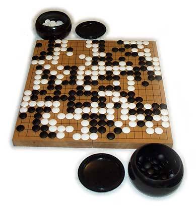
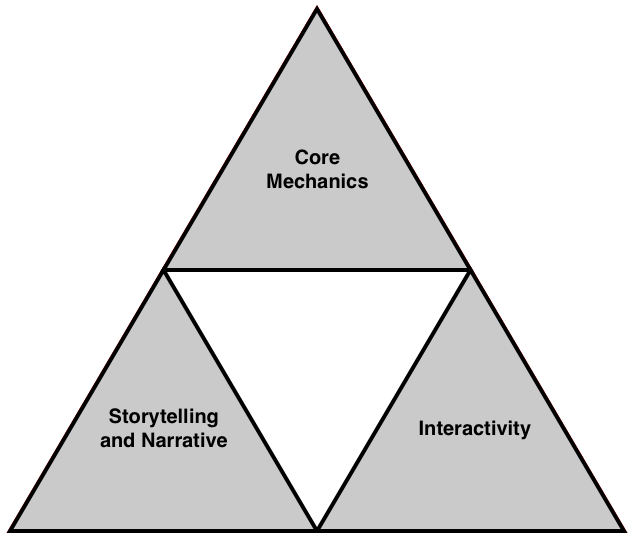

Humans have been devising and playing games for thousands of years. There is hot debate about which existing game is the oldest; some argue for Go (shown in Figure 1.1) and some for the African stone game Awari, but the first game ever devised is almost certainly lost to us today. The field of game design is as ancient as the human neocortex and is clearly related to our capacity to pretend, for pretending—that is, creating and playing in an artificial world—is at the heart of all games. Some, such as Go and chess, were perfected so long ago that their rules have not changed for centuries. Other games come on the market, enjoy a brief popularity, and fade away again. People are always interested in new games, so there is a constant demand for new game designs.

数千年来，人类一直在设计和玩游戏。关于现存的游戏中哪一款最为古老，人们争论不休；有人认为是围棋（如图 1.1 所示），有人认为是非洲的播棋，但是历史上第一款游戏几乎肯定是失传了。游戏设计领域与人类的大脑皮层一样古老，显然与我们假装的能力有关，因为假装——即创造和玩耍于一个人造世界中——是所有游戏的核心。有些游戏，如围棋和国际象棋，在很久以前就已经完善，其规则几百年来从未改变。而其他游戏则是在问世，风行一时之后逐渐消失。人们总是对新游戏感兴趣，因此对新游戏设计的需求始终如一。

Figure 1.1 Go. 图 1.1 围棋。

Game design is the process of:

* Imagining a game.
* Defining the way it works.
* Describing the elements that make up the game (conceptual, functional, artistic, and others)."
* Transmitting that information to the team that will build the game.

游戏设计是以下过程的总称：

* 构思一款游戏。
* 定义游戏的运作方式。
* 描述构成游戏的元素（概念、功能、艺术等）。
* 将这些信息传递给游戏制作团队。

A game designer's job includes all of these. In this chapter, we discuss what's involved in game design, why we do it, and what it takes to be a game designer.

游戏设计师的工作包括所有这些方面。在本章中，我们将讨论游戏设计所涉及的内容、我们为什么要做游戏设计以及成为一名游戏设计师需要具备哪些素质。

In spite of the long history of game design, surprisingly little study has been devoted to the subject. Indeed, game design has been taken seriously as a subject worthy of academic interest only in the last few decades. But study requires funding; consequently, most game theory research has been directed toward economic principles and military applications. Little of this work applies to games intended for the consumer, and most of it requires an advanced knowledge of statistics to decipher. We concentrate on practical game design rather than formal game theory.

尽管游戏设计的历史悠久，但对这一主题的研究却少得令人吃惊。事实上，游戏设计作为一门值得学术界关注的学科受到重视也只是最近几十年的事情。但是，研究需要资金；因此，大多数博弈论研究都集中在经济学原理和军事应用上。这些研究成果很少能应用于消费类游戏，而且大部分研究成果都需要高深的统计学知识才能理解。我们专注于实用游戏设计，而不是正式的博弈论。

## Art, Science, or Craft? 艺术、科学还是手艺？

Many people consider game design to be an art, drawing on a mysterious wellspring of creativity possessed only by a talented few. They think of the "big names" in the game industry—Peter Molyneux, Brian Moriarty, Roberta Williams—as artists, and they admire the vision and originality that such people bring to their games. They imagine that game designers spend their time indulging in flights of imagination, and they ignore or are not even aware of the long and painstaking work that real design requires.

许多人认为，游戏设计是一门艺术，它汲取了只有少数天才才能拥有的神秘的创造力源泉。他们把游戏行业中的“大腕”——彼得·莫利纽克斯、布莱恩·莫里亚蒂、罗伯塔·威廉姆斯——视为艺术家，钦佩他们为游戏带来的远见卓识和独创性。他们认为，游戏设计师的工作是让想象力天马行空，而忽略或者根本没有意识到真正的设计所需要的长期而艰苦的工作。

Other people who are more mathematically oriented see game design as a science. They concentrate on the methodology for determining the best rules of play, the intricate procedure of balancing a complex game. They think about equations, relationships, and the flow of resources. Game design to these people is a set of techniques, a process of thought.

另一些更注重数学的人则将游戏设计视为一门科学。他们专注于确定最佳游戏规则的方法，以及平衡复杂游戏的复杂程序。他们考虑的是方程式、关系和资源流动。对这些人来说，游戏设计是一套技术，是一个思考的过程。

We believe both of these views are wrong, or at least incomplete. Game design is not purely an art because it is not primarily a means of aesthetic expression. "Artistry" comes into envisioning the initial concepts and ideas, but once that is done, it's time for the real work of defining and refining how the game will function. Nor is game design purely a science; it doesn't posit hypotheses or seek truth. It's not bound by rigorous standards of logic or formal methods. The goal of a game is to entertain through play, and designing a game requires both creativity and careful planning.

我们认为这两种观点都是错误的，至少是不全面的。游戏设计并不纯粹是一门艺术，因为它主要不是一种美学表达方式。“艺术性”来自于对最初概念和想法的构思，但一旦构思完成，真正的工作就开始了，那就是定义和完善游戏的功能。游戏设计也不是一门纯粹的科学；它不提出假设，也不寻求真理。它不受严格的逻辑标准或形式方法的约束。游戏的目的是通过玩耍来取乐，而设计游戏既需要创造力，也需要精心策划。

Interactive entertainment is an art form, but like film, television, and theater, it is a collaborative art form, with no single person entitled to call himself the artist. In fact, most designers don't think of themselves as artists at all. Designing games is a craft, like cinematography or costume design in Hollywood. A game contains both artistic and functional elements: It must be aesthetically pleasing, but it also must work well and be enjoyable to play. The greatest games combine these attributes brilliantly, achieving a quality for which the only word is elegance. Elegance is the sign of craftsmanship of the highest order.

互动娱乐是一种艺术形式，而与电影、电视和戏剧一样，它也是一种协作性的艺术形式，没有任何一个人有资格称自己为唯一的艺术家。事实上，大多数设计师根本不认为自己是艺术家。设计游戏是一门手艺，就像好莱坞的电影摄影或服装设计一样。一款游戏既包含艺术元素，也包含功能元素：它必须赏心悦目，但也必须运行良好，玩起来令人愉快。最伟大的游戏将这些特性巧妙地结合在一起，达到了只有“优雅”才能形容的品质。优雅是最高级手艺的标志。

## The Anatomy of Game Design 剖析游戏设计

Game design cannot be reduced to a set of discrete instructions and processes. There is no formula that you can follow and produce a perfect game design, ready for your programming team to code into existence. However, you can take advantage of a set of common principles that apply to all successful games, and doing so can save you a fair amount of grunt work. Designing a successful game is not just random chance—although so many other factors besides design influence a game's success that it sometimes seems that way.

游戏设计不能简化为一套离散的指令和流程。没有什么公式可以让你按部就班地设计出一个完美的游戏，再让你的编程团队随时可以编写代码。但是，你可以利用适用于所有成功游戏的一系列共同原则，这样做可以为你节省大量的繁琐工作。设计一款成功的游戏并非偶然——尽管除开设计之外，还有很多其他因素影响着游戏的成功，有时看起来就是这样。

### The Importance of Game Design 游戏设计的重要性

Game design (at least for the computer and console) is a very young field, and there is still much to be discovered. The movie industry and even the advertising industry know more about invoking atmosphere and mood than any game designer out there—and more important, they know how to apply their techniques effectively.

游戏设计（至少是电脑和游戏机游戏设计）是一个非常年轻的领域，还有很多东西有待探索。电影业甚至广告业在营造氛围和情绪方面都比任何游戏设计师更胜一筹，更重要的是，他们知道如何有效地运用这些技巧。

Take McDonalds, for example: Have you ever wondered why they use a predominantly red-and-yellow color scheme? Psychologists report that the color yellow influences the perceived hunger level of the subject, while red increases anxiety and the need to hurry. The result, according to the psychologists, is that you order more food, eat it quickly, and leave. The reasons for this appear to be deep in our ancestry. Red is the color of blood, signifying danger, and yellow is a predominant color in foodstuffs. In his book ManWatching, Desmond Morris goes into this and many other aspects of human behavior in a lot more detail. It makes for interesting reading, and we recommend it to any serious game designer. It's useful for the game designer to consider the ways that humans interact with each other and the subconscious stimuli that influence them. This and other kinds of understanding will take game design to a new level, resulting in richer, subtler, and ultimately better games.

以麦当劳为例：你有没有想过为什么他们会使用红黄相间的配色方案？心理学家报告说，黄色会影响人们的饥饿感，而红色会增加焦虑感和匆忙感。心理学家认为，最终的结果是，人们会点更多的食物，快速吃完，然后离开。究其原因，似乎与我们的祖先颇有渊源。红色是血液的颜色，象征着危险，而黄色则是食品的常见颜色。德斯蒙德·莫里斯在他的著作《观察人类》中，对人类行为的这个方面和诸多其他方面进行了更详细的研究。这本书读起来很有意思，我们推荐给所有严肃的游戏设计师。对于游戏设计师来说，思考人类互动方式以及影响人类潜意识的刺激因素是非常有用的。这种理解和其他方面的理解将把游戏设计提升到一个新的水平，从而创造出更丰富、更微妙、最终更优秀的游戏。

Even though some people view game design as a mystical art, they can be peculiarly inconsistent in their attitudes: Nearly everybody who expresses an interest in the subject believes that he could be a game designer. The skill of game design is, so to speak, invisible. It looks as if anyone should be able to do it. After all, it's just a matter of writing a simple story, knocking up a design document or two, and telling the programmers what you want, right? No. That's about as realistic as expecting that anyone who can use a hammer and a saw should be able to produce a violin. Good game design is, as we said, a matter of craftsmanship.

尽管有些人认为游戏设计是一门神秘的艺术，但他们表现出的态度却恰恰相反：几乎所有对游戏设计感兴趣的人都认为自己可以成为游戏设计师。可以说，游戏设计的技巧是无形的。看起来似乎任何人都可以胜任。毕竟，这只用写一个简单的故事，敲定一两个设计文档，然后告诉程序员你想要什么，对吧？错，这就像认为任何会使用锤子和锯子的人都能制作出小提琴一样不现实。正如我们所说，好的游戏设计是一项手艺。

If you want proof, just check any magazine that reviews games and see how often it marks down games for poor design. Games might be technically superb and look wonderful, but if the gameplay isn't there, it's not a game; it's a pretty demo. Even the original [Quake](https://en.wikipedia.org/wiki/Quake_(video_game)), while lauded for its amazing technology, was slammed for the poor quality of its single-player gameplay (after the stunned awe had worn off). Sure, it looked great, but running around shooting poorly designed and badly placed enemies wore thin very quickly.

如果你想要证据，随便翻开任何一本游戏评论杂志，看看它们因为设计糟糕而给游戏扣分的频率。游戏在技术上可能无可挑剔，画面也精美绝伦，但如果没有游戏性，那就不是游戏，只是一个漂亮的演示样品。即使是初代的[《雷神之锤》](https://en.wikipedia.org/wiki/Quake_(video_game))，虽然因其精湛的技术而广受赞誉，但却因其单人游戏的低下质量而备受抨击（当最初的震惊消退后）。当然，它的画面很棒，但是在设计糟糕、安置不当的敌人中来回奔跑射击，很快就会让人感到乏味。

The creators of Quake, id software, acknowledged that the first Quake was just a technology demo. The gameplay was improved in [Quake II](https://en.wikipedia.org/wiki/Quake_II), which presented a good single-player game, but with [Quake III](https://en.wikipedia.org/wiki/Quake_III_Arena), we're back to the technology demo again. It was left to third parties (such as Valve, which developed [Half-Life](https://en.wikipedia.org/wiki/Half-Life_(video_game)) using the [Quake II](https://en.wikipedia.org/wiki/Quake_II) engine) to take the technology and make a game with it.

雷神之锤的制作者 id software 承认，第一代雷神之锤只是一个技术演示。在[《雷神之锤二》](https://en.wikipedia.org/wiki/Quake_II)中，游戏性得到改进，呈现出一款不错的单人游戏，但在[《雷神之锤三》](https://en.wikipedia.org/wiki/Quake_III_Arena)中，我们又回到技术演示的状态。只能由第三方公司（如使用[《雷神之锤二》](https://en.wikipedia.org/wiki/Quake_II)引擎开发[《半条命》](https://en.wikipedia.org/wiki/Half-Life_(video_game))的 Valve 公司）来利用这项技术制作游戏。

Given the amount of money routinely sunk into these technological powerhouse products, it seems amazing that more money is not spent on producing a decent game design. In many cases, the game design is an amalgamation of the "best" ideas of the development team. This works so rarely that when it is successful, the process is widely publicized and the publicity gives the impression that this is the best way to design a game. You might have heard the saying a camel is a horse designed by committee. Nowhere is this more applicable than the game industry.

这些技术标杆产品通常都投入大量资金，而钱却没有花在制作一个优秀的游戏设计上，这实在是不可思议。在许多情况下，游戏设计都是开发团队“最佳”想法的缝合体。这种方法成功的案例少之又少，一旦成功，其过程就会被广泛宣传，让世人误以为这是设计游戏最好的方式。你可能听说过这样一句话：骆驼是委员会设计出来的马。这句话用在游戏行业身上再贴切不过。

Of course, for every rule, you can find a high-profile exception (otherwise, life would be a lot simpler—and duller). The designers of [Half-Life](https://en.wikipedia.org/wiki/Half-Life_(video_game)), a truly excellent game, used a process like this, dubbed the cabal process. Valve was incredibly fortunate to have the right people in the right place at the right time. Most developers can't count on such luck. Valve can't even be certain that the cabal process will work again. History is on their side, but as they say in the financial industry, past performance is no guarantee of future success.

当然，对于每一条规则，你都能找到一个著名的反例（否则，生活就会简单——沉闷得多）。[《半条命》](https://en.wikipedia.org/wiki/Half-Life_(video_game))是一款非常出色的游戏，它的设计者们就采用了这样一种被称为“阴谋”的流程。Valve 非常幸运，在正确的时间、正确的地点拥有正确的人。大多数开发者都无法指望这样的运气。Valve 甚至无法确定，阴谋流程能否再次奏效。历史是站在他们这一边的，但正如金融业所言，过去的业绩并不能保证未来的成功。

So what's the upshot of this? Although game design is a creative process requiring the ability to dream and imagine amazing worlds populated by strange and wonderful denizens, a great many practical principles also can be extracted and analyzed. When you thoroughly understand the techniques of game design, your imagination and intellect will be free to work together and concentrate on what's really important: great gameplay. Of course, in an ideal world, original and innovative gameplay would be equally important. Unfortunately, most publishers don't want games that are too innovative; they want something just like a recent hit, with a few more twists.

那么，这样做的结果是什么呢？虽然游戏设计是一个创造性的过程，需要梦想和想象奇妙世界的能力，而这些世界里的居民千奇百怪，但我们也可以从中提炼和分析出许多实用的原则。当你彻底理解了游戏设计的技巧之后，你的想象力和智力就可以自由地结合起来，专注于真正重要的事情：出色的游戏性。当然，在理想的世界里，原创和创新的游戏玩法同样重要。遗憾的是，大多数发行商并不想要太有创意的游戏；他们想要的是与近期热门游戏类似的游戏，再加上一些新的变化。

### Seeking the Key Elements of Games 寻找游戏的关键要素

Our approach in teaching you how to design games centers on the idea that games are made up of certain key elements, and that the games in a given genre tend to have many of those elements in common. These elements include such things as the rules of the game, the player's role (pilot, athlete, general, spy, and so on), the challenges the player will face, and many others that we will introduce as we go along.

我们在教你如何设计游戏时所采用的方法基于这样一种理念，即游戏是由某些关键要素构成的，而且某一类型的游戏往往有许多共同的要素。这些元素包括游戏规则、玩家的角色（飞行员、运动员、将军、间谍等）、玩家将面临的挑战，以及我们将陆续介绍的许多其他元素。

This doesn't mean that we think all games in a particular genre should be alike—far from it. Among cars, for example, all minivans (a genre of car, you might say) include seating for five or more people, have a rear door rather than a trunk, and stand up fairly high off the ground. Yet not all minivans look alike or have the same performance characteristics. The same is true of games. Two war games can include many elements in common and still have completely different settings, units, and strategies, and be balanced in different ways.

这并不意味着我们认为某一类型的所有游戏都应该是一样的——远非如此。例如，在汽车中，所有的小型货车（可以说是汽车的一种类型）都能容纳五人或五人以上，都有后门而不是后备箱，而且离地相当高。然而，并不是所有的面包车外观都一样，性能也不尽相同。游戏也是如此。两款战争游戏可以包含许多共同的元素，但仍有完全不同的设置、单位和策略，并以不同的方式实现平衡。

We encourage you to adjust our elements as you see fit. The last thing we want to see is more games with different graphics but identical play mechanics; there are too many of those already. During the heyday of the Sega Genesis and the Super Nintendo, we saw too many side-scrollers, games about running and jumping on platforms; nowadays store shelves overflow with too many first-person shooters in which players run through a 3D world firing at anything that moves. The game industry and our players don't need more games that look a little different but are essentially the same. That leads to creative stagnation among developers and eventual boredom and disinterest among customers.

我们鼓励你们根据实际情况调整我们的元素。我们最不希望看到的是更多画面不同但玩法相同的游戏；这样的游戏已经太多了。在世嘉创世纪和超级任天堂的鼎盛时期，我们看到了太多的卷轴游戏，即在平台上奔跑和跳跃的游戏；如今，商店货架上充斥着太多的第一人称射击游戏，玩家在 3D 世界中奔跑，向任何移动的物体开火。游戏产业和我们的玩家都不需要更多看起来有点不同但本质上相同的游戏。这将导致开发者的创造力停滞不前，最终使消费者感到厌倦和失去兴趣。

The purpose of identifying common elements in a genre is not to encourage the development of cookie-cutter games, but to make sure that when you design a game, you have covered all the basics—the essential components that a game in a particular genre should have and without which is incomplete.

识别某一类型游戏中的共同要素并不是为了鼓励开发千篇一律的游戏，而是为了确保在设计游戏时，已经涵盖了所有基本要素——这些要素是某一类型游戏不可或缺的，否则游戏就不完整。

Okay, that's far enough. Before we continue, we need to discuss exactly what we mean by game design. After all, one of the most confusing aspects of the study of game design is that there's no official definition agreed on by the whole industry—different game designers might have different ideas of what comprises game design.

好了，到此为止。在继续之前，我们需要讨论一下游戏设计的确切含义。毕竟，游戏设计研究中最令人困惑的一点是，整个行业并没有达成一致的官方定义——不同的游戏设计师可能对游戏设计所包含的元素有不同的理解。

### Laying Down the Ground Rules 制定基本规则

For the purposes of this book, we have broken down game design into three specific areas: core mechanics, storytelling, and interactivity. Each is a distinct, complementary element of a game, and each makes up one part of a larger whole, as shown in Figure 1.2.

Figure 1.2. Core mechanics, interactivity, and storytelling. 图 1.2. 核心机制、互动性和故事性。

在本书中，我们将游戏设计分为三个具体领域：核心机制、故事讲述和互动性。如图 1.2 所示，每一个领域都是游戏中独特而互补的元素，并且每一个领域都是更大整体的一部分。

### Core Mechanics 核心机制

The rules that define the operation of the game world make up the core mechanics of the game, or the foundations of gameplay.

定义游戏世界运行的规则构成了游戏的核心机制，或者说是游戏的基础。

The core mechanics are the translation of the designer's vision into a consistent set of rules that can be interpreted by a computer—or, more accurately, rules that can be interpreted by the people who write the software that is interpreted by the computer. Defining the core mechanics is the "science" part of game design. It is important not to confuse this with the technology of computer gaming. Although the core mechanics are implemented by creation of a mathematical (or computational) model of the abstract game world, the core mechanics describe the way the game works, not the way the software operates. In a noncomputerized game, we would simply call these the rules, but the rules of computer games are far more complex than the rules of any board or card game.

核心机制是将设计者的构想转化为一套可由计算机解释的一致规则，或者更准确地说，是可由编写软件的人员解释的规则，而软件则由计算机解释。确定核心机制是游戏设计的“科学”部分。重要的是，不要将其与电脑游戏技术混为一谈。虽然核心机制是通过创建抽象游戏世界的数学（或计算）模型来实现的，但核心机制描述的是游戏的运行方式，而不是软件的运行方式。在非电脑游戏中，我们会简单地把这些称为规则，但电脑游戏的规则比任何棋盘游戏或纸牌游戏的规则都要复杂得多。

This is the heart and soul of the game—if the core mechanics aren't sound, you end up with a poor game. Unfortunately, this happens fairly frequently. It seems that the core mechanics are often the least-developed area in modern games. The reasons for this are many and varied, but the three most significant are as follows:

* Designer ignorance of game mechanics
* Marketing pressure
* Conflicting demands for impressive technology and good gameplay

这是游戏的核心和灵魂，如果核心机制不健全，游戏就会很糟糕。不幸的是，这种情况经常发生。核心机制似乎往往是现代游戏中开发最少的领域。造成这种情况的原因多种多样，但最重要的是以下三点：

* 设计者对游戏机制的无知
* 市场压力
* 对令人印象深刻的技术和良好游戏性的要求相互矛盾

Of these three, we can help with only the first and the third. Designer ignorance is what this book is intended to address. The second, marketing pressure, is beyond our control, much to our despair on a number of occasions in the past. We will also address the third, technology versus gameplay, in this book, although it's also partly brought on by market conditions. The technology race is analogous to the Cold War arms race: Technology produces eye candy, eye candy grabs customers' attention, and, in the viciously competitive arena of the software store and magazine page, attention is the most valuable commodity. Games have limited development budgets, and the money tends to go toward areas that will produce the most visible results. If technology sells products, then products will focus on technology. The core mechanics are often given short shrift in consequence.

在这三点中，我们只能帮助解决第一点和第三点。设计者的无知正是本书要解决的问题。第二点是市场压力，这是我们无法控制的，过去我们曾多次为此感到绝望。我们还将在本书中讨论第三点，即技术与游戏的竞争，尽管它也有一部分是由市场条件造成的。技术竞赛类似于冷战时期的军备竞赛：技术能吸引眼球，眼球能吸引顾客的注意力，而在竞争激烈的软件商店和杂志版面上，注意力是最有价值的东西。游戏的开发预算有限，资金往往会流向能产生最直观效果的领域。如果技术能卖出产品，那么产品就会把重点放在技术上。因此，核心机制往往被忽视。

### Storytelling and Narrative 讲故事和叙事

All games tell a story. The complexity and depth of that story depends on the game. At one extreme, in adventure games such as [Grim Fandango](https://en.wikipedia.org/wiki/Grim_Fandango), the game is the story. At the other extreme, it's the player who tells the story by the act of playing. Even [Tetris](https://en.wikipedia.org/wiki/Tetris) has a story—a story created by the player as she plays.

所有游戏都在讲述一个故事。故事的复杂程度和深度取决于游戏。一个极端是，在冒险游戏，如[《冥界狂想曲》](https://en.wikipedia.org/wiki/Grim_Fandango)中，游戏就是故事。另一个极端是，由玩家自己通过玩游戏来讲述故事。就连[《俄罗斯方块》](https://en.wikipedia.org/wiki/Tetris)也有一个故事——一个由玩家在游戏过程中创造的故事。

Narrative, as we use the term, means that part of the story that is told by you, the author and designer, to the player. Narrative is the noninteractive, presentational part of the story. [Tetris](https://en.wikipedia.org/wiki/Tetris) has a story, but it contains no narrative. Because playing games is an active process and listening to a narrative is a passive one, there is an inherent tension between interactivity and narrative. We discuss this tension in much more detail later.

我们所说的“叙事”是指由作者和设计者向玩家讲述的那部分故事。叙事是故事的非交互、呈现部分。[《俄罗斯方块》](https://en.wikipedia.org/wiki/Tetris)有故事，但不包含叙事。因为玩游戏是一个主动的过程，而听故事则是一个被动的过程，所以互动性和叙事性之间存在着内在的矛盾。我们将在后面更详细地讨论这一对立矛盾。

Without a story, or some way for a player to implicitly form his own story, the game simply will not interest the player. As you probably remember from high school English classes, all stories feature dramatic tension: an unresolved issue, problem, or conflict that keeps the reader's attention and makes him want to read on. This is no less true of games than it is of novels or short stories. In the case of games, the dramatic tension often, though not always, arises from a challenge in the game that the player has not yet overcome. Whether the player makes up his own "story" or whether he reads or watches a scripted narrative, it's the primary hook that keeps the player playing. Many games try to aim for a middle ground: They provide a back story and let the player fill in the details—quite often by completing missions that drive the plot along.

如果没有故事，或者没有某种方式让玩家隐含地形成自己的故事，游戏根本不会引起玩家的兴趣。你可能还记得高中英语课堂上的内容，所有故事都具有戏剧张力：一个悬而未决的问题、难题或冲突，能吸引读者的注意力，让他想读下去。游戏与小说或短篇故事同样如此。就游戏而言，戏剧张力往往，尽管不全是，来自游戏中玩家尚未克服的挑战。无论玩家是自己编造“故事”，还是阅读或观看剧本叙述，这都是吸引玩家继续玩下去的主要诱因。许多游戏都试图寻求中间地带：他们提供一个背景故事，让玩家填补细节——通常是通过完成任务来推动情节发展。

Narratives in games are often quite linear, unaffected by the player's actions and unchanging from one playing to the next. Many designers see this as a limitation, impeding the freedom of the player. In recent years, there has been a lot of discussion about nonlinearity in computer games and the improvements it would bring. As with many "new and improved" features of games, a certain amount of smoke and mirrors is involved in bringing nonlinearity to nontrivial narrative-based games. Automated storytelling is the holy grail of computer game design. Chris Crawford, designer of Balance of Power, has performed some work in this area with his Erasmatazz project (www.erasmatazz.com).

游戏中的叙事通常相当线性，不受玩家行为影响，在每一次游玩过程中都一成不变。许多设计者认为这是一种限制，妨碍了玩家的自由。近年来，关于电脑游戏中的非线性以及非线性带来的改进的讨论不绝于耳。与许多“新颖改进”的游戏特色一样，将非线性融入到非简单的叙事游戏中，需要一些障眼法。自动讲故事是电脑游戏设计的圣杯。《权力平衡》的设计者克里斯·克劳福德通过他的 Erasmatazz 项目（www.erasmatazz.com）在这方面做了一些工作。


译者注：圣杯是基督教中非常重要的圣物，也象征着人们对真理和完美的追求。


There is still a long way to go before we have (or can provide) fully dynamic computer-generated stories. In the meantime, we'll have to continue to use the old-fashioned methods and let humans write the stories. Unfortunately, the effort involved in creating a nonlinear story grows exponentially with the number of story threads and typically weakens the story's impact. Hence, games with strong storylines are usually fairly linear. In fact, some genres suffer from too much scripting. Examples are flight simulators and strategy games that attempt to give the player an illusion of freedom beyond the bounds set by the scripting and consequently fail when the player does something unexpected that breaks the linearity.

在我们拥有（或能够提供）完全动态的计算机生成故事之前，还有很长的路要走。在此期间，我们将不得不继续使用传统的方法，让人类来编写故事。遗憾的是，创作非线性故事的工作量会随着故事线索的增多而呈指数级增长，并且通常会削弱故事的影响力。因此，故事情节紧凑的游戏通常都非常线性。事实上，某些类型的游戏会因剧本文字过多而受到影响。例如飞行模拟器和策略游戏试图给玩家一种超出脚本限制的自由幻觉，但当玩家做出脚本之外的意外举动而打破线性时，就会失败。

A linear story does not have to be a disadvantage. The [Final Fantasy](https://en.wikipedia.org/wiki/Final_Fantasy) series of games allows little room for variation from the main story—the only way to complete the game is to allow the story to carry you along, but they are still good games. Certain scripted events that are completely unalterable by the player push the story along—and the main challenge for the player is to fit in with these events, to become part of the story. Although this makes the story feel a bit unrealistic, it is nonetheless convincing enough to enthrall the player. We don't yet have the technology to create engaging and fully self-consistent nonlinear stories. We'll probably start to see real generic story-telling systems at about the same time we can say, "Good morning, computer," and expect it to understand and answer us!

线性故事并不一定是缺点。[《最终幻想》](https://en.wikipedia.org/wiki/Final_Fantasy)系列游戏的主线故事几乎没有变化的余地——完成游戏的唯一方法就是让故事带着你走，但它们仍然是好游戏。玩家完全无法改变的某些剧本事件推动着故事的发展，而玩家面临的主要挑战就是如何融入这些事件，成为故事的一部分。虽然这让人感觉故事有点不真实，但却足以让玩家着迷。我们还不具备创造引人入胜、完全自洽的非线性故事的技术。也许在我们可以说“早上好，电脑”并期待它理解并回答我们的同时，才能看到真正的通用故事讲述系统！

### Interactivity 交互性

For our purposes, interactivity is the way that the player sees, hears, and acts within the game's world—in short, the way the player plays the game. This covers a lot of diverse topics: graphics, sounds, user interface—everything that comes together to present the gaming experience. As a game designer, you will not create all these items yourself, but you will specify how the interactivity will work. It's up to the specialized members of your team to make it happen.

就我们的目的而言，交互性是指玩家在游戏世界中看到、听到和行动的方式，简而言之，就是玩家玩游戏的方式。这涵盖了许多不同的主题：图形、声音、用户界面——所有这些都共同构成了游戏体验。作为一名游戏设计师，你不会亲自创建所有这些项目，但你会指定互动性如何运作。这就要靠你团队中的专业成员来实现了。

Interactivity has been a buzzword connected with computers and games for some time. It's often overused or used inappropriately. A few years back, some people thought that they could create a new kind of product by prefixing the word interactive to just about anything: interactive movies, interactive television, and so on. Don't let that turn you off: Interactivity is not just a buzzword in game design; it's the term used for making the game playable.

一段时间以来，交互性一直是与计算机和游戏相关的流行词汇。它经常被过度使用或使用不当。几年前，有些人认为，只要在任何东西前加上互动一词，就能创造出一种新的产品：互动电影、互动电视等等。不要因此而放弃：交互性不仅仅是游戏设计中的一个流行词，它还是使游戏具有可玩性的术语。

Poor interactive design ruins many products. For example, a badly designed user interface severely compromised [Warwind](https://en.wikipedia.org/wiki/War_Wind), an otherwise promising [Warcraft](https://en.wikipedia.org/wiki/Warcraft) derivative. Warwind required players to negotiate an impossibly nested series of icon-based menus using only right-clicks. We're sure you can come up with your own list of similar games in which you've found critical design flaws such as these.

糟糕的交互设计会毁掉许多产品。例如，设计糟糕的用户界面严重影响了[《魔兽争霸》](https://en.wikipedia.org/wiki/Warcraft)的衍生产品[《烽火连天》](https://en.wikipedia.org/wiki/War_Wind)。它要求玩家只能通过右键点击来操作一系列嵌套的图标菜单。我们相信，你一定能找出自己的类似游戏清单，发现其中存在着诸如此类的关键设计缺陷。

Interactivity (in the nonbuzz sense of the word) starts at the user interface. The user interface defines the "flavor" of your game. For example, the gameplay of [Mario 64](https://en.wikipedia.org/wiki/Super_Mario_64) on the Nintendo 64 console is virtually identical to that of a 2D platform game such as the [Sonic the Hedgehog](https://en.wikipedia.org/wiki/Sonic_the_Hedgehog) games on the Sega Genesis (or Megadrive, to those of you in Europe). You run, jump, collect goodies, and avoid the baddies. The user interface—the buttons you push to play the game—made Mario 64 stand out from its peers.

交互性（非流行词意义上的）始于用户界面。用户界面决定了游戏的“味道”。例如，任天堂 64 游戏机上的[《马里奥 64》](https://en.wikipedia.org/wiki/Super_Mario_64)与世嘉五代机上的[《刺猬索尼克》](https://en.wikipedia.org/wiki/Sonic_the_Hedgehog)等 2D 平台游戏的玩法几乎完全相同。你在游戏中奔跑、跳跃、收集奖品、躲避坏人。[《马里奥 64》](https://en.wikipedia.org/wiki/Super_Mario_64)的用户界面——你按下的游戏按钮——让它在同类游戏中脱颖而出。

Taking this to the extreme, there is nothing in [Mario 64](https://en.wikipedia.org/wiki/Super_Mario_64) that couldn't be implemented as a text-based game with type-in commands such as "run left," "jump right," and "take coin." Of course, it would be ridiculous to do this (even if the Nintendo 64 console had a keyboard)—the game would have sold close to zero copies. But the example shows that even though every other aspect of the game might be well designed (as it was in [Mario 64](https://en.wikipedia.org/wiki/Super_Mario_64)), a good game requires a good user interface. Derivative games that arrived on the scene after the release of [Mario 64](https://en.wikipedia.org/wiki/Super_Mario_64) didn't duplicate [Mario 64](https://en.wikipedia.org/wiki/Super_Mario_64)'s excellent user interface and control system. Although they were similar in concept, they didn't reach that golden standard.

更有甚者，[《马里奥 64》](https://en.wikipedia.org/wiki/Super_Mario_64)中没有任何东西不能以文字游戏的形式来实现，比如输入“向左跑”、“向右跳”和 “捡硬币”等命令。当然，这样做是非常荒谬的（即使任天堂 64 游戏机有键盘）——这样的游戏销量几乎为零。但这个例子说明，即使游戏的其他方面设计得再好（如[《马里奥 64》](https://en.wikipedia.org/wiki/Super_Mario_64)），一款好的游戏也需要一个好的用户界面。在[《马里奥 64》](https://en.wikipedia.org/wiki/Super_Mario_64)发布之后出现的衍生游戏并没有复制[《马里奥 64》](https://en.wikipedia.org/wiki/Super_Mario_64)出色的用户界面和控制系统。虽然它们的概念相似，但都没有达到黄金标准。

A game's graphics are also important parts of the interactive component, although designers disagree about how important they are. Unfortunately, the prevailing commercial pressure compels many designers to concentrate on appearances. In general, far too much time is spent on getting the look of a game right at the expense of tuning its gameplay. A lot of nostalgic gamers have called for a return to the values of the "golden age" of gaming—the 1980s, when hardware limitations forced developers to concentrate on gameplay. Nowadays, however, the capabilities of new machines require that more effort be spent on presentation. The more effort spent on presentation, the more the player expects to see in the next game, resulting in a vicious positive-feedback cycle of player expectations boosting emphasis on presentation, which, in turn, boosts player expectations, and so on.

游戏的图形也是交互要素的重要组成部分，尽管设计者们对图形的重要性有不同的看法。遗憾的是，普遍的商业压力迫使许多设计者把注意力集中在外观上。一般来说，人们花了太多的时间在游戏的外观上，而忽略了游戏性的调整。许多怀旧的游戏玩家呼吁回归游戏“黄金时代”的价值观——20 世纪 80 年代，当时硬件的限制迫使开发者将精力集中在游戏性上。但如今，新机器的性能要求开发者在表现形式上投入更多精力。在表现形式上花费的精力越多，玩家对下一款游戏的期望就越高，这就形成了一个恶性的正反馈循环：玩家的期望提高了对表现形式的重视程度，而表现形式又反过来提高了玩家的期望，如此循环往复。

We've all had the experience of playing an action game really well, getting into a sort of "groove" in which your eyes and hands seem to meld with the machine. The best user interfaces allow you to immerse yourself in the game so deeply that you are no longer aware of the user interface at all—the infamous Tetris Trance. That's what well-designed interactivity does for a game.

我们都曾有过玩动作游戏非常棒的经历，你的眼睛和双手似乎与机器融为一体，进入某种“入定”状态。最好的用户界面能让你深深地沉浸在游戏中，以至于你根本意识不到用户界面的存在——这就是臭名昭著的俄罗斯方块恍惚。这就是精心设计的互动性对游戏的作用。

## Documenting the Design 记录设计

As part of their job, game designers produce a series of documents to tell others about their game design. Exactly what documents they produce and what the documents are for varies from designer to designer and project to project—but they usually follow a common thread.

游戏设计师的工作之一就是制作一系列文档，向他人介绍自己的游戏设计。不同的设计师和不同的项目会产生不同的文档，但它们通常都遵循一些共同的原则。

### Why Do We Need Documents? 为什么需要文档？

Beginning programmers, especially those who want to get into the game industry, often make the mistake of thinking up a game and then diving in and starting to program it right away. Programming is an immensely rewarding activity because you get to see the results of your work within seconds, and those programmers are seeking that reward as soon as possible. They can't wait to see at least some portion of their game up on the screen.

初学编程的人，尤其是那些想进入游戏行业的人，经常会犯一个错误，那就是想好一个游戏，然后马上就开始编程。编程是一项非常有成就感的活动，因为你可以在几秒钟内看到自己的工作成果，而这些程序员都希望尽快获得这种成就感。他们迫不及待地想要在屏幕上看到他们游戏的一部分。

Back in the days when a single person designed and wrote an entire computer game, there wasn't really anything wrong with this. The programs were so small that even if the idea changed radically in the course of development, the programmer could modify the code within a few days. The games themselves were simple enough to be described in a page or two, so developers didn't feel any need for a formal design process.

在一个人设计和编写整个电脑游戏的时代，这种做法其实并没有什么不妥。当时的程序非常小，即使在开发过程中想法发生了根本性的改变，程序员也能在几天内修改代码。游戏本身也足够简单，一两页纸就能描述清楚，因此开发人员并没有觉得需要一个正式的设计流程。

In modern commercial game development, however, this kind of ad hoc approach is disastrous. Development teams often consist of 20 to 50 people. Millions of dollars are at stake. Critical release dates must be met to get the game on the shelves at a particular time—usually right before the Christmas shopping season. You can't build a game consisting of hundreds of megabytes of software, artwork, animations, movies, and sound files with a "let's try it and see" approach; a job of this scale calls for some sort of methodology. Different developers require different degrees of formality, but all serious game companies now insist on having some kind of written design before they start work.

然而，在现代商业游戏开发中，这种临时应变的方法是灾难性的。开发团队通常由 20 到 50 人组成，涉及数百万美元的资金投入。必须遵守关键的发布日期，使游戏在特定时间上架——通常是在圣诞节购物季之前。你不可能用“走一步看一步”的方法来制作一款由数百兆字节的程序、插画、动画、电影和声音文件组成的游戏；如此规模的工作需要某种方法论。不同的开发者对正规程度的要求不同，但现在所有严肃的游戏公司都坚持在开工前要有某种形式的书面设计。

As we said before, a key part of game design is transmitting the design to other members of the team. In practice, a lot of that communication takes place not through the documents themselves, but through team meetings, bull sessions, and conversations over lunch. That doesn't mean that there's no point in writing design documents, however. The documents record decisions made and agreed upon orally; they create a paper trail. More important, writing a document is a process of turning vague, unformed ideas into explicit plans. Even if no one reads it at all, an idea written down is a decision made, a conclusion reached. If a feature of a game is not described in writing, there's a good chance that it has been overlooked and that someone will have to make it up on the fly—or, worse, that each part of the team will work toward a different goal. It's far easier and cheaper to correct a design error before any code is written or artwork is created. Depending on the size of the game, wise developers will allot anywhere from one to six months for pure design work before starting on development, usually in combination with some throwaway prototype for testing out gameplay ideas.

正如我们之前所说，游戏设计的一个关键部分是将设计传递给团队的其他成员。在实践中，很多交流都不是通过文档本身进行的，而是通过团队会议、闲聊和午餐谈话进行的。但这并不意味着编写设计文档就没有意义了。这些文档记录了以口头方式做出的决定和达成的共识；它们创建了一个书面记录。更重要的是，撰写文档是一个将模糊、不成型的想法转化为明确计划的过程。即使根本没有人读过它，但写下的想法就是做出的决定、得出的结论。如果游戏的某项功能没有以书面形式描述出来，那么很有可能会被忽视，有人不得不临时编造，或者更糟糕的是，团队中的每个人都会朝着不同的目标努力。在编写代码或制作美术作品之前纠正设计错误要容易得多，成本也低得多。根据游戏规模的大小，明智的开发者会在开始开发前为纯粹的设计工作预留一到六个月的时间，通常还会结合一些一次性的原型来测试游戏的玩法。

> **Idea Versus Design Decision** 创意与设计决策
>
> Here's an idea: "Basilisks should protect their eggs."
>
> 这是一个想法："蛇怪应该保护它们的蛋。"
>
> Here's a design decision: "Whenever they have eggs in their nests, female basilisks will not move beyond visual range from the nest. If an enemy approaches within 50 meters of the nest, the basilisk will abandon any other activity and return to the nest to defend the eggs. She will not leave as long as a living enemy threatens the eggs, and will even defend the eggs to her own death."
>
> 这是一个设计决定：“只要巢中有卵，雌性蛇怪就不会离开巢的可视范围。如果有敌人接近巢穴 50 米范围内，蛇怪就会放弃任何其他活动，返回巢穴保护蛋。只要有活着的敌人威胁到鸟蛋，它就不会离开，甚至会拼死保护鸟蛋。”
>
> See the difference? This is what creating design documents is about.
>
> 看到区别了吗？这就是创建设计文档的意义所在。

### The Types of Design Documents 设计文档的类型

This section is a short introduction to the various types of documents a game designer might be asked to create. In chronological order, they are:

* High concept (2–4 pages)
* Game treatment (10–20 pages)
* Game script (50–200 pages)

本节简要介绍游戏设计师可能要创建的各类文档。按照时间顺序，它们是：

* 高概念（2-4 页）
* 游戏综述（10-20 页）
* 游戏脚本（50-200 页）

The following sections briefly discuss these documents. Appendix A, "Sample Design Documents," contains samples (or pointers to samples) of each one and discusses their contents and formatting in much more detail.

下文将简要讨论这些文档。附录 A“设计文档样本”包含每种文档的样本（或样本指向），并对其内容和格式进行了更详细的讨论。

#### The High Concept 高概念

Writing the high-concept document is the first step after scribbling down the initial idea. Its aim is to express the fundamental spirit of the game. Just as the purpose of a resumé is to get you a job interview, the purpose of a high-concept document is to get you a hearing from someone, a producer or publishing executive. It puts your key ideas down on paper in a bite-size chunk that he can read in a few minutes. Like a resumé, it should be short—not more than two to four pages long. The high-concept document should take, at most, a week to create, of which four days are spent thinking and one is spent writing.

撰写高概念文档是写下初步构思后的第一步。其目的是表达游戏的基本精神。正如简历的目的是让你获得面试机会一样，高概念文档的目的也是让你能获得制作人或发行商高管的青睐。它把你的主要想法写在纸上，一小块一小块的，让他能在几分钟内读完。就像简历一样，它应该简短——不超过两到四页。高概念文文最多需要一周的时间，其中四天用于思考，一天用于写作。

If possible, try to begin the document with a single, punchy sentence—the high concept itself—that describes the game in a nutshell. Unfortunately, publishing executives have notoriously short attention spans and a great many calls on their time. You need to grab them as quickly as possible. The high concept for [Interstate '76](https://en.wikipedia.org/wiki/Interstate_%2776) might have been, "Automotive vigilantes defend America's oil supply with heavily armed 1970s muscle cars in a high-octane, 3D action game."

如果可能的话，尽量在文件的开头用一个简洁有力的句子——高概念本身——概括地描述游戏。不幸的是，发行商的高管们都是出了名的注意力不集中，而且他们的时间很紧。你需要尽快抓住他们的注意力。[《76 号州际公路》](https://en.wikipedia.org/wiki/Interstate_%2776)的高概念可能是：“3D 动作游戏，汽车守夜人用全副武装的 20 世纪 70 年代高标号肌肉车保卫美国的石油供应。”

The high-concept document covers these details:

* The premise of the game
* Its intended audience
* Its genre (if it belongs to one)
* Its unique selling points
* The target platform(s)
* The overall storyline

高概念文件涵盖了这些细节：

* 游戏的前提
* 目标受众
* 游戏类型（如果属于某一类型的话）
* 独特卖点
* 目标平台
* 整体故事情节

It must also describe the gameplay—what the player is supposed to do, what type of environment or scenarios he will encounter, and a general overview of the game flow. You might also want to include a description of any special technologies that will be used to build the game and any special hardware it might require.

它还必须描述游戏的玩法——玩家应该做什么，会遇到什么类型的环境或场景，以及游戏流程的总体概况。你可能还需要说明制作游戏所使用的任何特殊技术以及可能需要的任何特殊硬件。

If you plan to use the high-concept document as part of a sales pitch to a publisher, you might want to include a section containing short profiles of the development team members, with details of relevant past experience. You'll need to explain why they are the right team to build your game. You might or might not also want to include a budget estimate, depending on who will see it and what your relationship is with them.

如果你打算将高概念文档作为向发行商推销的一部分，你可能需要在其中加入开发团队成员的简短介绍，并详细说明他们过去的相关经验。你需要解释为什么他们是制作游戏的最佳团队。你可能需要也可能不需要包括预算估计，这取决于谁会看到它以及你与他们的关系如何。

The high-concept document need not be a sales tool; it's also worthwhile to write one for yourself, just to record an idea that you might want to work on in the future.

高概念文件不一定是销售工具；也值得为自己写一份，只是为了记录下你将来可能想做的想法。

#### The Game Treatment 游戏综述

The purpose of the game treatment is to present the game in broad outline to someone who's already interested in it and wants to hear more about it. The treatment is designed both to satisfy initial curiosity and to stimulate real enthusiasm for the game. When you give a presentation about your game to a publisher, you should hand him the game treatment at the end so he'll have something to take away and look at, something that will float around his office and remind him of your game. Your goal at this point is to get funding of some sort, either to create a more thorough design or a prototype, or (preferably!) to develop the entire game.

游戏综述的目的是向已经对游戏感兴趣并希望进一步了解游戏的人大致介绍游戏。综述的目的既是为了满足最初的好奇心，也是为了激发对游戏的真正热情。当你向发行商介绍你的游戏时，你应该在最后把游戏综述交给他，这样他就可以带走一些东西看看，这些东西会在他的办公室里飘来飘去，让他想起你的游戏。此时，你的目标是获得一定资金，以便进行更全面的设计或制作原型，或者（最好！）开发整个游戏。

You shouldn't try to cover all aspects of the game in rigorous detail. This isn't the game's design script. It can be a tool for selling the game to a potential publisher or investor; if you're assembling a team of developers, it's a good way to explain it to potential candidates. The treatment should fill in a few of the gaps and answer some of the questions left by the high-concept document. This is the place for mocked-up screen shots, background on the key characters, a brief description of the overall story arc, and anything else that's crucial to understanding what the game will look and feel like to play. You should also include an analysis of the competition and indicate the ways in which your game will be different—and better.

你不应该试图详尽地介绍游戏的方方面面。这不是游戏的设计脚本。它可以是向潜在发行商或投资者推销游戏的工具；如果你正在组建开发团队，它也是向潜在候选人解释游戏的好方法。综述文档应填补一些空白，并回答高概念文件中留下的一些问题。这里可以展示模拟屏幕截图、关键角色的背景、整体故事弧线的简要描述，以及其他任何对了解游戏外观和游戏感受至关重要的内容。你还应该包括对竞争对手的分析，并指出你的游戏与众不同的地方——和更好的地方。

The initial treatment is still a simple document—almost a brochure that sums up the basic ideas in the game. A good way of picturing what to write in a treatment is to imagine that you are making a web site to help sell your game; then throw in some business and development details for good measure.

最初的综述仍然是一份简单的文档——几乎就像是一份总结游戏基本理念的小册子。

一个很好的比喻可以帮助你理清该如何撰写综述，那就是想象一下你要做一个网站来帮助销售你的游戏；为了完善内容，加入一些商业和开发细节即可。

#### The Game Script 游戏脚本

The game script (or "bible") is the largest and the last in this series. It's not a sales tool; it's much too large and comprehensive for that. It's intended to document design decisions, not to persuade anyone of anything. The game script is the definitive reference for all matters relating to the structure and organization of the game, what the player does and sees—the gameplay. It should also cover the game storyline, characters, user interface, and rules of play. It should answer all possible questions (except for technical ones) about the game.

游戏脚本（或“圣经”）是本系列中最大的，也是最后一个。它不是一个销售工具，因为它太庞大、太全面了。它的目的是记录设计决策，而不是说服任何人。游戏脚本是与游戏结构和组织、玩家所做所见——游戏玩法——相关的所有事项的权威参考资料。它还应涵盖游戏故事情节、角色、用户界面和游戏规则。游戏脚本应回答所有与游戏有关的问题（技术问题除外）。

The game script does not include the technical design. It documents the creative, conceptual, and functional aspects of the game, and it should include technical specifications where necessary. However, it does not address how the game is built or implemented in software. The technical design document, if there is one, is usually based on the game script and is written by the lead programmer or technical director for the game. Technical design is beyond the scope of this book. If you want to know more about technical design, read Game Architecture and Design (New Riders Publishing, 2004).

游戏脚本不包括技术设计。它记录了游戏的创意、概念和功能方面，必要时还应包括技术规格。但是，它并不涉及如何用软件构建或实现游戏。技术设计文档（如果有的话）通常以游戏脚本为基础，由首席程序员或游戏技术总监撰写。技术设计超出了本书的范围。如果你想了解更多关于技术设计的信息，请阅读《游戏架构与设计》（New Riders Publishing, 2004）。

As a good rule of thumb, the game script should enable you to "play" the game. That is, it should specify the rules of play in enough detail that you could, in theory, play the game without the use of computer—maybe as a (complicated) board game or table-top role-playing game. This doesn't mean you should actually sit down and play it as such, but it should theoretically be possible to do so, just based on the game script document. Sitting down and playing paper versions of game ideas is a very inexpensive way of getting valuable feedback on your game design. For designers without huge teams and equally huge budgets, we heartily encourage paper-play testing.

一个好的经验法则是，游戏脚本应能让你“玩”游戏。也就是说，游戏脚本应该足够详细地说明游戏规则，使你理论上可以不使用电脑玩游戏——也许是（复杂的）棋盘游戏或桌面角色扮演游戏。这并不意味着你真的要坐下来玩，但从理论上来说，仅凭游戏脚本文档就可以做到这一点。坐下来玩纸质版的游戏创意，是获得游戏设计宝贵反馈的一种非常廉价的方式。对于没有庞大团队和巨额预算的设计者来说，我们衷心鼓励纸质游戏测试。

## Anatomy of a Game Designer 剖析游戏设计师

Many of the people working in game development aspire to be game designers. It's a highly sought-after position, and for good reason. Of all the jobs on the development team, game design is the one that offers the greatest scope for creative expression. In most cases, it is also the designer who gets the credit for a successful game and who gets the media attention. And if the designer's name becomes well enough known, fame can lead to fortune. Sid Meier, the designer of [Civilization](https://en.wikipedia.org/wiki/Civilization_(video_game)) and many other titles, is now so famous that his name alone can increase the sales of a game. [Sid Meier's Alpha Centauri](https://en.wikipedia.org/wiki/Sid_Meier%27s_Alpha_Centauri) (Firaxis Software) was actually designed by an ex-employee of Firaxis, Brian Reynolds, yet the publisher put Sid Meier's name in the title.

许多从事游戏开发的人都渴望成为游戏设计师。这是一个非常抢手的职位，这是有道理的。在开发团队的所有工作中，游戏设计是最具创意表现空间的工作。在大多数情况下，成功游戏的功劳和媒体的关注也都归功于设计师。如果设计师的名字足够响亮，那么名声就会带来财富。[《文明》](https://en.wikipedia.org/wiki/Civilization_(video_game))和许多其他游戏的设计者席德·梅尔现在非常有名，单凭他的名字就能提高游戏的销量。[《席德·梅尔的半人马座阿尔法》](https://en.wikipedia.org/wiki/Sid_Meier%27s_Alpha_Centauri)（Firaxis Software）实际上是由 Firaxis 的前雇员布莱恩·雷诺兹设计的，但发行商却把席德·梅尔的名字写在了标题上。

Like all crafts, game design requires both talent and skill. Talent is innate, but skill is learned. Skilled craftsmen know everything about the requirements of their job, the tools of their trade, the material with which they work, and the result they are trying to produce. For an effective game designer, a wide base of skills is required.

与所有手艺一样，游戏设计需要天赋和技能。天赋是与生俱来的，而技能则是后天习得的。熟练的工匠对自己的工作要求、工作工具、工作材料和工作成果了如指掌。对于一个高效的游戏设计师来说，需要具备广泛的技能基础。

> "One of the most difficult tasks people can perform, however much others may despise it, is the invention of good games…"
>
> "无论别人如何鄙视，人们所能完成的最困难的任务之一，就是发明出好游戏……"
>
> —C.G. Jung
>
> ——卡尔·古斯塔夫·荣格

Perhaps because the ideal skill set for an effective game designer is so extensive, diverse, and poorly defined, the requirements for the position of game designer are frequently underestimated. Many development groups treat game design as just one more task for a technical project lead, or as a communal process performed by the entire team. In practice, the skills required for effective game design are much more wide-ranging than you'll find in your average technical lead. This doesn't mean that a programmer can't become a game designer; it just means that you need far more than programming skills to be one.

也许是因为高效游戏设计师的理想技能组合是如此广泛、多样和定义不清，游戏设计师职位的要求经常被低估。许多开发团队把游戏设计看作是项目技术负责人的又一项任务，或者是整个团队共同完成的一项工作。实际上，有效的游戏设计所需的技能要比一般的技术主管广泛得多。这并不意味着程序员不能成为游戏设计师；这只是说，要成为一名游戏设计师，你需要的远不止编程技能。

The following sections discuss some of the skills that are most useful for the professional game designer. Don't be discouraged if you don't possess all of them. That does not mean that game design is not for you. It's a wish list—the characteristics we would like to see in a hypothetical (but certainly nonexistent!) "perfect designer."

下文将讨论一些对专业游戏设计师最有用的技能。如果你不具备所有这些技能，也不要气馁。这并不意味着游戏设计不适合你。这是一份愿望清单——我们希望在假想的（但肯定不存在的！）“完美设计师”身上看到的特征。

### Imagination 想象力

A game exists in an artificial universe, a make-believe place governed by make-believe rules. Imagination is essential to creating this place. Fortunately, this is not a problem for most people. Even if you feel that your imagination isn't your strongest point, it's possible to develop and improve it. Of course, this isn't a new concept. It's been around for hundreds of years, as can be seen in the following extract:

游戏存在于一个人造宇宙中，一个由虚构规则支配的虚构世界。想象力对于创造这个地方至关重要。幸运的是，这对大多数人来说都不是问题。即使你觉得想象力不是你的强项，也有可能发展和提高想象力。当然，这并不是一个新概念。从下面的摘录中就可以看出，它已经存在了几百年：

"Thou shouldst regard various walls which are covered with all manner of spots, or stone of different composition. If thou hast any capacity for discovery, thou mayest behold there things which resemble various landscapes decked with mountains, rivers, cliffs, trees, large plains, hills and valley of many sort. Thou canst also behold all manner of battles, life-like positions of strange, unfamiliar figures, expressions of face, costumes, and numberless things which thou mayest put into good and perfect form…

“你应该看看各种污渍斑斑的墙壁或者五光十色的石头。如果你有发现的能力，你可以看到其中似乎真有各种风景，高山、河流、悬崖、树木、大片平原、丘陵和峡谷。你还能见到各种战争、陌生人物栩栩如生的姿势、表情、服饰以及无数可能组成完整形象的事物……

Do not despise this opinion of mine when I counsel thee sometimes not to let it appear burdensome to thee to pause and look at the spots on walls, or the ashes in the fire, or the clouds, or mud, or other such places; thou wilt make very wonderful discoveries in them, if thou observest them rightly... For through confused and undefined things the mind is awakened to new discoveries. But take heed, first, that thou understandest how to shape well all the members of the things that thou wishest to represent, for instance, the limbs of living beings, as also the parts of a landscape, namely the stones, trees, and the like."

切莫轻视我的意见，我得提醒你们，时时驻足凝视污墙、火焰余烬、云彩、污泥以及诸如此类的事物，于你并不困难，只要思索得当，你确能收获奇妙的发现……通过混乱和朦胧的事物的刺激，心灵会被唤醒，从而有新的发现。但你首先必须知晓如何将你希望表现的物体的各部分，比如动物的肢体，或风景画的各要素诸如岩石、树木等等画好才成。”

—Leonardo da Vinci, [Treatise on Painting](https://en.wikipedia.org/wiki/A_Treatise_on_Painting)

——列奥纳多·达·芬奇，[《论绘画》](https://en.wikipedia.org/wiki/A_Treatise_on_Painting)

The imagination is like a muscle; with regular exercise, it grows stronger and easier to flex. Imagination comes in various forms:

* Visual and auditory imagination enables you to think of new buildings, trees, animals, creatures, clothing, and people—how they sound and their strange ways of speaking.
* Dramatic imagination is required for the development of good characters, plots, scenes, motivation, emotions, climaxes, and outcomes.
* Conceptual imagination is about relationships between ideas, their interactions and dependencies.
* Lateral thinking is the process of looking for alternative answers, taking an unexpected route to solve a problem.

想象力就像肌肉，经常锻炼，它就会变得更加强壮，也更容易弯曲。想象有多种形式：

* 视觉和听觉想象力能让你想到新的建筑、树木、动物、生物、衣服和人——他们的声音和奇怪的说话方式。
* 戏剧想象力是发展好的人物、情节、场景、动机、情感、高潮和结果所必需的。
* 概念想象力是关于想法之间的关系、它们之间的相互作用和依赖关系。
* 横向思维是寻找其他答案的过程，采取意想不到的方式来解决问题。

A great example of a product that demonstrates all of these forms of imagination in abundance is Infogrames's [Outcast](https://en.wikipedia.org/wiki/Outcast_(video_game)).

Infogrames 公司的[《时空英豪》](https://en.wikipedia.org/wiki/Outcast_(video_game))就是一个很好的例子，它充分展示了所有这些形式的想象力。

Deduction isn't ordinarily thought of as imagination, but it can lead to new and unexpected ideas. Deduction is the process of reasoning from a creative decision you've made to its possible consequences. For example, if you design a preindustrial farming community with no beasts of burden, the size of the fields and the productivity of the agriculture must necessarily be limited. Horses and oxen can pull plows and carry loads much farther than humans can. The limited food supply, in turn, affects the population growth rate and so on. These details are arrived at by deduction.

演绎通常不被认为是想象力，但它能带来意想不到的新想法。演绎是从你做出的创意决定到其可能后果的推理过程。例如，如果你设计了一个没有牲畜的前工业化农业社区，那么田地的面积和农业生产率必然受到限制。马和牛可以比人类拉犁和运载更远的货物。有限的粮食供应反过来又会影响人口增长率，如此等等。这些细节都是通过推理得出的。

Nor does imagination consist only of the ability to think of things that are completely new. It's also valuable to be able to look at an old idea and apply a new spin to it, to breathe new life into it with a fresh approach. Too many people in the game industry see something old and familiar and dismiss it. Instead they should think, "How can this be made better? How might this be more interesting?" J.K. Rowling does this brilliantly in her Harry Potter novels. They're full of imaginative twists on old ideas about witches and wizards. She still has witches flying on broomsticks, but she invented the sport of Quidditch, which is played while flying on them.

想象力也不仅仅指创造全新事物的能力。审视一个旧有观念，赋予其新的诠释，用新颖的方式为其注入活力，这同样弥足珍贵。在游戏行业中，有太多的人看到熟悉的旧事物就不屑一顾。相反，他们应该思考：“如何把它做得更好？如何让它更有趣？”J.K.罗琳在她的《哈利·波特》小说中就巧妙地做到了这一点。她的小说充满了对女巫和巫师这个古老题材的奇思妙想。她保留了让女巫骑着扫帚飞行的设定，但却发明了魁地奇这项骑着扫帚进行的运动。

### Technical Awareness 技术意识

Technical awareness is a general understanding of how computer programs, particularly games, actually work. It isn't necessary to be a software engineer, but it is extremely valuable to have had a little experience programming, even if only in Blitz Basic (www.blitzbasic.com) or some other simple language. A computer game designer's delivery medium is the computer, so it behooves you to know how computers do what they do and also to have a general idea of what they're not good at doing. A designer with entirely unrealistic expectations of what a computer can do isn't going to get very far. For example, computers do not understand English well. If your game design requires that the machine be able to interpret complex sentences typed on the keyboard, your programmers are likely to throw things at you.

技术意识是对计算机程序（尤其是游戏）如何实际运行的一般理解。不需要成为软件工程师，但如果有过一点编程经验，哪怕只是用 Blitz Basic (www.blitzbasic.com) 或其他简单的语言编程，也是非常有价值的。电脑游戏设计师的交付媒介是电脑，因此了解计算机的运作方式以及它们不擅长做什么至关重要。如果对计算机能力抱有不切实际的期望，最终将难以如愿。例如，计算机听不懂英语。如果你的游戏设计要求机器能够理解键盘输入的复杂句子，那么你的程序员可能会抓狂。

You must also have a basic knowledge of the technical capabilities of your target platform. At a minimum, you need to know whether you're designing a product for a home console, desktop computer, handheld platform, or more than one of these. Every feature that you specify must be possible on the machine that you're designing for. If in doubt, ask the programmers. Knowing the limitations imposed by the selected platform will result in an achievable design.

你还必须对目标平台的技术性能有基本的了解。至少，你需要知道你是在为家用控制台、台式计算机、手持平台还是其中的多个平台设计产品。你指定的每个功能都必须适用在所有目标平台上。如有疑问，请询问程序员。了解目标平台的限制才能作出可行的设计。

### Analytical Competence 分析能力

No game design is perfect from the start. Game design is a process of iterative refinement, which progresses from a rough draft to the finished meisterwerk. Consequently, you must be able to recognize the good and bad parts of a design for what they are. This requires a keen logical and analytical mind, and the ability to manipulate nebulous concepts with a high level of mental agility and critical analysis.

没有一款游戏设计从一开始就是完美的。游戏设计是一个迭代改进的过程，从粗略的草稿到最终的成品。因此，你必须能够辨别设计中的好坏部分。这需要敏锐的逻辑思维和分析能力，以及以高度的思维敏捷性和批判性分析能力处理模糊概念的能力。

It is very difficult to effectively criticize your own work. You can be excessively hard on yourself and become convinced that all your work is worthless, or you can be blinded by familiarity and unable to analyze your own work in an unbiased fashion. Inexperienced designers often err in both directions, swinging wildly from one to the other.

对作品进行有效的自我评断是很难的。你可能会对自己过分苛刻，认为自己的所有作品都毫无价值；你也可能会被熟知的事物蒙蔽双眼，无法公正地分析自己的作品。缺乏经验的设计师往往会在这两个方向上犯错，从一个方向疯狂地转向另一个方向。

There is no easy solution to these problems. Good self-analysis skills come with practice. As a reality check, you can try peer reviews (which are always a good idea anyway). See what your colleagues and co-workers think of your design. Try to choose people who are likely to give you an unbiased opinion. Friends and family are usually not good choices. They will be either too easy on you—after all, they are close to you personally—or too hard on you because they don't want to be seen as biased and, consequently, overcompensate.

这些问题没有简单的解决办法。良好的自我分析能力需要练习。作为对现实的检验，你可以尝试同行评议（无论如何，这总是个好主意）。看看你的同事对你的设计有什么看法。尽量选择那些能给你公正意见的人。朋友和家人通常不是好的选择。他们要么会对你过于宽容——毕竟他们与你私交甚好；要么会对你过于苛刻，因为他们不希望被认为有偏见，因此会过度补偿。

A specific example of when analytical skills are particularly useful is in detecting dominant (that is, unbeatable or nearly unbeatable) strategies at the design phase and weeding them out before they get into the code, as in the infamous [Red Alert](https://en.wikipedia.org/wiki/Command_%26_Conquer:_Red_Alert) "tank rush." The tank effectiveness in [Red Alert](https://en.wikipedia.org/wiki/Command_%26_Conquer:_Red_Alert) was so out of balance that an experienced player could dedicate all production to cranking out a few tanks and then immediately storm the opposition base before the enemy had a chance to get a production line set up.

分析技能特别有用的一个具体例子是，在设计阶段发现占优势（即无敌或几乎无敌）的策略，并在它们进入代码之前将其剔除，比如臭名昭著的[《红色警戒》](https://en.wikipedia.org/wiki/Command_%26_Conquer:_Red_Alert)中的“坦克快攻”。[《红色警戒》](https://en.wikipedia.org/wiki/Command_%26_Conquer:_Red_Alert)中的坦克效能严重失衡，有经验的玩家可以把所有的产能都用于生产几辆坦克，然后在敌人建立生产线之前立即攻入对方基地。

### Mathematical Competence 数学能力

Designers must have basic math skills (particularly statistical math skills) because balancing a game is largely a matter of math and can be a difficult task. In the case of a real-time strategy game or a war game, the apparently simple problem of ensuring that there are no dominant strategies or fighting units to unbalance the game is actually quite math-intensive.

设计师必须具备基本的数学技能（尤其是统计数学技能），因为平衡游戏在很大程度上是一个数学问题，而且可能是一项艰巨的任务。对即时战略游戏或战争游戏而言，要确保没有支配性战略或战斗单位来破坏游戏平衡，这一问题看似简单，实际上相当依赖数学。

That's not to say that you need a Ph.D. in mathematics—you're not going to be deriving complex equations from scratch. The only thing you'll need above basic math is some knowledge of statistical methods. Even so, in some cases, the math can be handled computationally. It's entirely possible that you can handle the math requirement simply by being good with a spreadsheet program such as Microsoft Excel.

这并不是说你需要一个数学博士——你不需要从头开始推导复杂的方程式。在基础数学之上，你唯一需要的就是一些统计方法的知识。即便如此，在某些情况下，数学也可以通过计算来处理。你完全有可能只需熟练使用 Microsoft Excel 等电子表格程序，就能满足数学要求。

### Aesthetic Competence 审美能力

Although you need not be an artist, you should have a general aesthetic competence and some sense of style. Far too many games are visual clones of one another, depending on stereotypes and clichés rather than real imagination. It's up to you (along with your lead artist) to set the visual tone of the game and to create a consistent, harmonious look.

虽然你不必是一个艺术家，但你应该具备基本的审美素养和一些风格意识。太多的游戏在视觉上的千篇一律，依靠的是陈规滥调，而不是真正的想象力。你（与首席美术师）有责任确定游戏的视觉基调，并创造出和谐一致的外观。

Suppose you're designing a clever and calculating female assassin with nerves of steel. Many designers would clothe her in skin-tight black leather and give her a big, shiny automatic pistol; in other words, they'd opt for the stereotype, the easy way out. A slightly more imaginative designer might give her a miniskirt and a crossbow—still male-fantasy material, but marginally more interesting. A really good designer would realize that an assassin needs to blend in to her surroundings, to look like anybody else, yet still be visually identifiable to the player. He would think about her personality and create a unique visual style for her that is distinctive yet unobtrusive. Lara Croft is a good example of this kind of thing. Despite her ludicrous proportions, she's dressed appropriately but quite identifiably for her role as an explorer: shorts, tank top, hiking boots. More important, her shirt is a particular color that nobody else in the [Tomb Raider](https://en.wikipedia.org/wiki/Tomb_Raider) games wears, which makes her stand out on the screen. If you're seeing that color, you're seeing Lara.

假设你要设计一个聪明机智、心思缜密、具有钢铁般意志的女杀手。许多设计师会给她穿上紧身的黑色皮衣，配上一把又大又亮的自动手枪；换句话说，他们会选择刻板印象，选择简单的方法。稍有想象力的设计师可能会给她穿上迷你裙，配上十字弓——这仍然是男性幻想的材料，但稍微有趣一些。真正优秀的设计师会意识到，刺客需要融入周围的环境，看起来与其他人无异，但在视觉上仍能让玩家辨认出来。他会考虑她的个性，为她创造一种独特的视觉风格，既与众不同又不突兀。劳拉·克罗夫特就是一个很好的例子。尽管她的身材比例很夸张，但她的穿着打扮却非常得体，与她探险家的角色十分相配：短裤、背心、登山靴。更重要的是，她的衬衫是[《古墓丽影》](https://en.wikipedia.org/wiki/Tomb_Raider)游戏中其他人都不穿的特殊颜色，这让她在屏幕上格外显眼。如果你看到这个颜色，你就看到了劳拉。

We encourage you to expand your aesthetic horizons as much as you can. Learn a little about the fundamentals of art: the principles of composition, and which colors coordinate and which clash. Check out classic art books and visit art museums. Find out about famous art movements—Art Nouveau, Surrealism, Impressionism—and how they changed the way we see things. Watch movies that are famous for their visual style, such as [Metropolis](https://en.wikipedia.org/wiki/Metropolis_(1927_film)). Then move on to the more practical arts: architecture, interior decoration, industrial design. All these things can contribute to the look of your game. The more aesthetic experience you have, the more likely you are to produce an artistically innovative product.

我们鼓励你们尽可能扩大自己的审美视野。了解一些艺术的基本原理：构图原则、哪种颜色协调、哪种颜色冲突。阅读经典艺术书籍，参观艺术博物馆。了解著名的艺术运动——新艺术运动、超现实主义、印象派——以及它们如何改变了我们看待事物的方式。观看以视觉风格闻名的电影，如[《大都会》](https://en.wikipedia.org/wiki/Metropolis_(1927_film))。然后是更实用的艺术：建筑、室内装饰、工业设计。所有这些都能为你的游戏外观做出贡献。你的审美经验越丰富，就越有可能制作出具有艺术创意的产品。

### General Knowledge 常识

Some of the best game designers tend to be ex-programmers or people with at least some formal scientific training—as long as they have broadened their sphere of knowledge outside of their narrow field of specialist expertise. A base level of general knowledge is valuable for a game designer, as is the ability to research what you might not know. It helps to be well-versed in mathematics, logic, history, literature, art, science, and current affairs. The more source material a game designer can assimilate, the better the final game design will be.

一些优秀的游戏设计师往往是前程序员或至少接受过一些正规科学培训的人——只要他们在狭窄的专业领域之外拓宽了自己的知识领域。对于游戏设计师来说，基本的常识和研究未知事物的能力都是非常宝贵的。精通数学、逻辑、历史、文学、艺术、科学和时事都会有所帮助。游戏设计师能够吸收的知识资料越多，最终的游戏设计就越好。

Make sure you watch a lot of movies and documentaries (The History Channel and The Discovery Channel are excellent resources). Read books, too, both for direct research and background material. The encyclopedia is a good place to start for any given subject. The information it contains might be too general for any detailed design, but it will provide a launching point. From there, you can increase your knowledge of a particular area by investing in other, more specialized books. They don't have to be particularly advanced—unless you're aiming for something such as a historically accurate simulation, you can often use books aimed at children to bone up on the background. After all, you don't want to risk alienating your audience. A game that is too true-to-life (and, hence, is likely to require specialist knowledge) will disappoint its players.

确保观看大量电影和纪录片（历史频道和探索频道是极好的资源）。也可以阅读书籍，既可以直接进行研究，也可以作为背景材料。对于任何特定主题，百科全书都是一个很好的开始。它所包含的信息可能过于笼统，无法进行任何详细的设计，但它可以提供一个起点。在此基础上，你可以通过投入到其他更专业的书籍来增加对某一特定领域的了解。这些书不一定要特别高深——除非你的目标是做出史上最精确的模拟，否则你通常可以使用针对儿童的书籍来了解背景知识。毕竟，你不想冒险疏远受众。过于真实的游戏（因此很可能需要专业知识）会让玩家扫兴。

Let's take an example: Most people's idea of pirates comes from swashbuckling Errol Flynn movies, J.M. Barrie's (or even Disney's) Peter Pan, and the Muppets' Treasure Island.

让我们举个例子：大多数人对海盗的印象来自埃洛尔·弗林的传奇冒险电影，詹姆斯·马修·巴利（或者是迪士尼）的《彼得·潘》，以及芝麻街的《金银岛》。

If you're designing a game based on piracy on the high seas, then exact historical detail isn't going to be what they expect—a game based on venereal disease, scurvy, maggot-infested food that has to be eaten in the dark so the crew can't see what they're eating, starvation, brutality, and the "consequences" of dark and lonely nights on a female-free boat won't make a particularly interesting (or even tasteful) game.

如果你要设计一款以公海海盗为题材的游戏，那么准确的历史细节并不是他们所期望的——一款以性病、坏血病、必须在黑暗中吃的生蛆的食物——这样船员们就看不到他们吃的是什么、饥饿、残暴以及在没有女性的船上度过黑暗而孤独的夜晚的“后果”为题材的游戏并不会让人觉得特别有趣（甚至有品味）。

On the other hand, if you have a game design featuring colorful, eye-patch wearing, wooden-legged pirates, gold, running deck battles, the Black Spot, the Jolly Roger, and buried doubloons secreted away on remote desert islands, then you probably have the seed of an entertaining game. Though, of course, if you'd stuck to the historically accurate literature, you wouldn't use the Jolly Roger (pure mythology) or the Black Spot (invented by Robert Louis Stevenson, author of Treasure Island).

另一方面，如果你的游戏设计中包含了色彩斑斓、戴着眼罩、长着木腿的海盗、黄金、奔跑的甲板战、黑点、骷髅旗以及埋藏在遥远荒岛上的宝藏，那么你可能就拥有了一个有趣游戏的雏型。当然，如果你坚持使用符合历史的文学作品，你就不会使用骷髅旗（纯属神话）或黑点（由《金银岛》的作者罗伯特·路易斯·史蒂文森发明）。

Books aren't the only source of knowledge, of course. A game designer's first research stop is often the Internet, with its wealth of free information. It takes only a small amount of searching using a quality search engine, such as www.google.com, to unearth some useful information.

当然，书籍并不是唯一的知识来源。游戏设计师的第一站往往是互联网，因为互联网上有大量免费信息。只需使用高质量的搜索引擎（如 www.google.com）进行少量搜索，就能发现一些有用的信息。

### Writing Skills 写作技能

The professional game designer must have good writing skills. This means being clear, concise, accurate, unambiguous, and, above all, readable. Apart from having to write several detailed documents for each design, you might be expected to produce the story narrative or dialogue—especially if the budget won't stretch to a scriptwriter.

专业游戏设计师必须具备良好的写作技巧。这意味着要清晰、简洁、准确、鲜明，最重要的是要具有可读性。除了要为每个设计撰写几份详细的文档外，你可能还需要编写故事叙述或对话——尤其是在预算不足以聘请编剧的情况下。

Writing comes in several forms, and we briefly discuss some of these here. (We go into more detail in [Chapter 4](/part-1/chapter-4.md), "Storytelling and Narrative," and the appendixes.)

写作有多种形式，我们在此简要讨论其中的几种。(我们将在[第四章](/part-1/chapter-4.md)“讲故事与叙事”和附录中详细介绍）。

* Technical writing is the process of documenting the design in preparation for development. All possible questions on the game have to be answered unambiguously and precisely. For example, if a farm with one peasant produces one unit of food per week, does a farm with five peasants produce five units, or do the additional peasants consume additional food? Is the peasants' own food factored in? What is the maximum number of peasants that can work on a given farm? If all the peasants are killed in a raid, what happens to the farm? If it is not immediately destroyed, can the empty buildings be reoccupied by new peasants? How do farms get built anyway? Where do peasants come from anyway? At what rate? Does the player have to manage the farming process, or do the peasants just get on with it? Can peasants fight? And so on and so on.\
  技术写作是记录设计的过程，为开发做准备。游戏中所有可能出现的问题都必须有明确而精准的答案。例如，如果一个农场有一个农民，每周生产一个单位的食物，那么有五个农民的农场是生产五个单位的食物，还是额外的农民消耗额外的食物？农民自己消耗的食物会计算在内吗？一个农场最多能容纳多少农民？如果所有农民都在一次突袭中被杀，农场会怎样？如果农场没有立即被摧毁，空置的建筑是否可以被新的农民重新占用吗？农场到底是怎么建成的？农民从哪里来？速度如何？玩家需要管理耕种过程吗，还是农民会自行耕种？农民能战斗吗？等等等等。
* Fiction writing (narrative) is useful for the manual, background material; character descriptions; introductory, transitional, and finale material; as well as other bodies of text, such as mission briefings.\
  小说写作（叙事）适用于手册、背景材料、人物描写、开场、过渡和结尾材料，以及任务简报等其他文本。
* Dialogue writing (drama) is needed for audio voiceovers and cinematic material. Unfortunately, in most games the dialogue is even cornier than 1970s television shows, and the acting is as bad or worse. Try to avoid clichés, and use grammar and vocabulary that match each character's personality. If you have an ear for regional dialects, it can add real variety to your game, but, again, avoid stereotypes such as "dumb rednecks" or "brassy New Yorkers." The game [Starcraft](https://en.wikipedia.org/wiki/StarCraft) made excellent use of the subtle variety of southern American dialects, including proud aristocrats, gruff old generals, obnoxious bikers, and cheerful mechanics.\
  画外旁白和电影场景需要对白写作（戏剧）。遗憾的是，大多数游戏中的对话甚至比 20 世纪 70 年代的电视节目还要老套，演技也同样糟糕甚至更差。尽量避免陈词滥调，使用符合每个角色个性的语法和词汇。如果你能听懂各地方言，就能为你的游戏增添真正的多样性，但同样要避免“愚蠢的乡巴佬”或“粗鲁的纽约人”等刻板印象。[《星际争霸》](https://en.wikipedia.org/wiki/StarCraft)这款游戏就很好地利用了美国南部各种微妙的方言，包括骄傲的贵族、粗鲁的老将军、令人讨厌的摩托车手和开朗的机械师。

The greatest game design acumen in the world will be useless to you unless you can effectively communicate your ideas. As a designer, you will often need to evangelize your design at several different levels. In the professional setting, you will initially need to present your design to a publisher. Following that, you need to obtain buy-in from the team that will develop the game. This can be done in person or in writing, but the result is the same. You will need to be able to transmit your enthusiasm for the game as well as go into mind-boggling detail of its finer points to allow the development team to be able to create a game from your vision.

除非你能有效地传达你的想法，否则世界上最伟大的游戏设计智慧对你来说都是无用的。作为一名设计师，你通常需要在多个不同层面上宣传你的设计。在专业领域，你首先需要向发行商展示你的设计。之后，你需要获得游戏开发团队的支持。这可以当面进行，也可以书面进行，但结果都是一样的。你需要将自己对游戏的热情传递给开发团队，并详细介绍游戏的细节，让开发团队能够根据你的设想制作出一款游戏。

### Drawing Skills 绘画技能

Some skill at basic drawing and sketching is highly valuable, although not absolutely required for a designer if you have a concept artist to work with. The saying "A picture is worth a thousand words" is never more true than when you are trying to impart a game idea. The vast majority of computer games rely heavily on visual content, and drawings are essential when pitching a product to a third party. Game-publishing executives will be interested in a hot concept, a hot market, or a hot license, but only pictures get them excited. The images are the hook on which the executives will hang everything else that they hear. Otherwise, you can talk about concepts forever and they won't remember a thing when you leave the room because they don't have a visual hook to hang it on. The images will remain in their memories long after they forget the details.

虽然对于拥有概念美术师合作的游戏设计师来说，基本绘图和素描技巧并非绝对必要，但掌握一些这类技能仍然非常宝贵。俗话说“一图胜千言”，这句话在传达游戏创意时再正确不过了。绝大多数电脑游戏在很大程度上都依赖于视觉内容，在向第三方推销产品时，图画是必不可少的。游戏发行高管们会对热门概念、热门市场或热门授权感兴趣，但只有画面能让他们兴奋。图片就像一个挂钩，发行商会将他们听到的所有其他内容都挂在这个挂钩之上。否则，即便你滔滔不绝地谈论概念，但当你离开房间时，他们什么也记不住，因为他们没有视觉挂钩。在他们忘记细节之后，图像仍会留在他们的记忆中。

### The Ability to Compromise 妥协能力

Probably the most important skill for a professional game designer is the ability to compromise on details and integrate a variety of opinions while preserving a consistent, holistic vision of the game. In an ideal world, we would be able to design whatever suited us and never have to worry about the demands of a publisher or the interests of the customers. Unfortunately, these external needs and interests do have to be considered, and, more often than not, the game designer is constrained by genre or license.

对于专业游戏设计师来说，最重要的技能可能就是能够在细节上做出妥协，将各种意见融合在一起，同时保持对游戏的一致、全面的看法。在理想的世界里，我们可以设计任何适合自己的游戏，而不必担心发行商的要求或客户的利益。不幸的是，这些外部需求和利益确实必须考虑在内，而且游戏设计师往往会受到类型或许可证的限制。

Different people on the development team and at the publishing company will have concerns about their own areas of expertise (programming, art, music, and so on), and their opinions will pull and push the design in different directions. As the designer, it's tempting to seek sole ownership of the vision, to argue that things must be exactly as you imagined them and to ignore other considerations. After all, there are plenty of other voices in your company advancing points of view about the other areas. But you must resist the temptation to do that, for two reasons:

开发团队和发行公司的不同人员会对各自的专业领域（编程、美术、音乐等）有所关注，他们的意见会影响设计的方向。作为设计者，很容易就会想独占设计理念，认为设计必须与自己的想象完全一致，而忽略其他方面的考虑。毕竟，在你的公司里，还有很多人在就其他方面提出意见。但你必须抵制这种诱惑，原因有二：

* First, you must allow your team some ownership of the vision as well, or its members won't have any motivation or enthusiasm for the project. No one builds computer games solely for the money; we're all here so that we can contribute creatively.\
  首先，你必须让你的团队也拥有一些愿景，否则团队成员就不会对项目有任何动力或热情。没有人做电脑游戏只是为了赚钱；我们在这里都是为了做出创造性的贡献。
* Second, a designer who gets a reputation as a visionary but who can't deliver a buildable, marketable game doesn't stay employed for long. It's your job to deliver an integrated design.\
  其次，一个设计师如果被誉为有远见的人，但却无法交付一款可制作、可销售的游戏，那么他的工作也不会长久。你的工作就是提供一个整合的设计。

In many cases, you'll be given a brief that limits you to designing a genre clone or a heavily restricted licensed property. Being able to work within these limits to the satisfaction of the customer, whether your customer is the publisher, license holder, or end user, is essential. Unless you are one of the famous game designers who can guarantee success with your name alone, you are unlikely to be given a completely free rein. You may have designed the best text adventure game since [Colossal Cave](https://en.wikipedia.org/wiki/Colossal_Cave_Adventure), but if the style of game is out of favor with the public, you're probably not going to get your game made—let alone published.

在很多情况下，你会接到一份任务书，要求你设计一款克隆游戏或受严格限制的授权游戏。无论你的客户是发行商、许可证持有者还是最终用户，能够在这些限制范围内开展工作并让客户满意都是至关重要的。除非你是仅凭名字就能保证成功的著名游戏设计师，否则你不可能获得完全的自由。你可能设计出了[《巨洞冒险》](https://en.wikipedia.org/wiki/Colossal_Cave_Adventure)以来最好的文字冒险游戏，但如果这种游戏风格不受公众欢迎，你的游戏可能就无法制作出来，更不用说发行了。

## Putting It Together 总结

This chapter puts forward the view that game design is not an arcane art, but rather a craft, just like any other, that can be learned with application.

本章提出的观点是，游戏设计并不是一门神秘的艺术，而是一门手艺，就像其他手艺一样，可以通过应用来学习。

Games are not works of art created by a mysterious, hit-or-miss process. Instead, they are a discrete set of rules and a presentation layer for those rules. We believe that by examining and documenting the fundamental similarities and differences between games of all types—computer and board, mental and physical—we can identify a valuable set of common elements that can be used to understand and, consequently, improve how great games are constructed.

游戏不是通过神秘的、不成功便成仁的过程创造出来的艺术品。相反，游戏是一套离散的规则和这些规则的表现层。我们相信，通过研究和记录各种类型游戏——电脑游戏和棋盘游戏、脑力游戏和体力游戏——之间的基本相似点和不同点，我们可以发现一系列有价值的共同要素，这些要素可用于理解和改进优秀游戏的构建方式。

As we said before, no one person is likely to have all these skills. We are talking about a hypothetical ideal game designer—the Superman of game design. It's no coincidence, however, that the best professional game designers possess a high degree of competence in many of these skills. They weren't born with them; they educated themselves and worked to develop them. We encourage you to do the same.

正如我们之前所说，没有一个人可能具备所有这些技能。我们谈论的是一个假想的理想游戏设计师——游戏设计界的超人。然而，最优秀的专业游戏设计师拥有这些技能中的许多技能并不是巧合。他们并非与生俱来，而是通过自学和努力培养出来的。我们鼓励你也这样做。
