Any game designer should agree that gameplay is the core of the game. Given an ideal world, designers would probably claim that gameplay should be put above all other considerations. And in a lot of cases, were it not for external pressures, these same game designers would attempt to treat the gameplay with the level of importance that it deserves. There's just one problem with this: There is no universally accepted definition of gameplay. Gameplay is an important, if nebulous, concept. Many times during discussions of games, we have heard comments such as, "This has great gameplay," followed by a detailed description of the particular aspect of the game. However, if instead you were to ask the question, "What is gameplay?", most answers would attempt to explain by example. Indeed, explanation by example can be helpful, but it requires that you infer a definition of gameplay by induction. Describing gameplay without using self-reference is similar to trying to explain the concept of red without reference to color. It is difficult to conceive, but not impossible.

任何游戏设计师都应该同意，游戏性是游戏的核心。在一个理想的世界里，设计师们可能会声称游戏性应高于其他所有考虑因素。而且在很多情况下，如果不是迫于外部压力，这些游戏设计师也会努力把游戏性放在应有的重要位置。但这有一个问题：游戏性并没有一个公认的定义。游戏性是一个重要的概念，尽管它很模糊。在讨论游戏的过程中，我们经常会听到这样的评论：“这款游戏的游戏性很强”，然后是对游戏特定方面的详细描述。然而，如果反过来问“什么是游戏性？”，大多数答案都会试图通过举例来解释。的确，举例说明可能会有所帮助，但这需要你通过归纳来推断游戏性的定义。在不使用自我参照的情况下描述游戏性，就好比在不参照颜色的情况下试图解释“红色”的概念。这很难想象，但并非不可能。

There is a reason for this difficulty: The concept of gameplay is extremely difficult to define. Each designer has his or her own personal definition of gameplay, formed from exposure to many examples over the course of a career.

这种困难是有原因的：游戏性的概念极难界定。每个设计师都有自己对游戏性的个人定义，这些定义是在其职业生涯中接触到许多实例后形成的。

Gameplay is so difficult to define because there is no single entity that we can point to and say, "There! That's the gameplay." Gameplay is the result of a large number of contributing elements. The presence, or lack thereof, of gameplay can be deduced by examining a particular game for indications and contraindications of these elements. (These terms are borrowed from medical terminology: An indication is a positive sign that implies the existence of gameplay, and a contraindication is a negative sign that implies that gameplay does not exist.)

游戏性之所以难以定义，是因为没有一个实体可以让我们指着它说：“看！这就是游戏性”。游戏性是大量元素共同作用的结果。游戏性的存在与否，可以通过研究特定游戏中这些元素的适应症和禁忌症来推断。(这些术语借用自医学术语：适应症是指暗示游戏性存在的积极信号，禁忌症是指暗示游戏性不存在的消极信号）。

# Use of Language 语言的使用

In other fields, such as engineering, architecture, and mathematics, the spread of ideas is facilitated by the use of a common language. Each engineer or mathematician knows how to express ideas—even brand-new ideas—in the given language of the craft.

在其他领域，如工程、建筑和数学，思想的传播得益于共同语言的使用。每个工程师或数学家都知道如何用自己的专业语言表达想法，甚至是全新的想法。

The vocabulary and mechanism for expressing ideas is already there, formalized and developed over many years of practical use and theoretical study. As game designers, we do not have that luxury. Although there has been talk of defining a universal frame of reference for game designers, no such lexicon has been attempted in earnest. Any attempts that have so far been made have not gained major acceptance, and there is no real coordinated effort or cooperation between alternate factions (to the best of our knowledge).

表达想法的词汇和机制已经存在，并在多年的实际应用和理论研究中得到了正规化和发展。而作为游戏设计师，我们却没有这样的条件。虽然有人说要为游戏设计师定义一个通用的参考框架，但还没有人真正尝试过这样的词汇。据我们所知，迄今为止所做的任何尝试都没有得到广泛的认可，而且在不同派别之间也没有真正的协调努力或合作。

This chapter attempts to define gameplay without reference to itself or reliance on examples of itself for definition. That doesn't mean that we won't give examples, but those examples will not serve as definitions. Instead, they will be used in their traditional role to illustrate the definitions previously laid out. This will give us the beginnings of our lexicon of game design. This might or might not become a standard, but it is at least a starting point that we can use to explain our ideas in this book.

本章试图定义游戏性，但不涉及游戏本身，也不依靠游戏本身的例子来定义游戏性。这并不意味着我们不会举例说明，但这些例子并不能作为定义。相反，它们将以其传统的角色来说明之前阐述的定义。这将为我们提供游戏设计词汇的雏形。这也许会成为标准，也许不会，但至少是一个起点，我们可以用它来解释我们在本书中的想法。

# Defining Gameplay 定义游戏性

Although we briefly discussed (and loosely defined) gameplay in [Chapter 2](/part-1/chapter-2.md), "Game Concepts," we did so in terms of the player experience. To continue, we examine gameplay independent of the player experience. We examine the core concepts of gameplay, which are invariant with the player. To do this, we need to state a player-independent definition of gameplay. Sid Meier once defined gameplay as "a series of interesting choices." This is an excellent starting point and forms the basis of our definition of gameplay. We take this statement one step further with our formal definition of gameplay:

尽管我们在[第二章](/part-1/chapter-2.md)“游戏概念”中简要讨论了（并且粗略定义了）游戏性，但那是从玩家体验的角度出发的。下面，我们将继续探讨独立于玩家体验的游戏性。我们将研究游戏性的核心概念，这些概念是与玩家无关的。为此，我们需要对游戏性下一个与玩家无关的定义。席德·梅尔曾将游戏性定义为“一系列有趣的选择”。这是一个很好的出发点，也是我们定义游戏性的基础。我们在此基础上更进一步，提出了游戏性的正式定义：

> One or more causally linked series of challenges in a simulated environment.
> 模拟环境中一个或多个因果联系的系列挑战。

On the surface, this does not seem that far removed from Sid Meier's original definition (although it's not quite as good of a sound bite). However, our statement is more precise and rigorous. To be fair, it's unlikely that Mr. Meier expected his original definition to be used for anything more than the off-the-cuff comment it was probably intended to be—a statement designed to challenge and spur further thinking on the subject. If this was the case, it certainly had its intended effect and served as an excellent starting point for our definition.

表面上看，这似乎与席德·梅尔最初的定义相去不远（虽然不如后者朗朗上口）。不过，我们的表述更加准确和严谨。平心而论，梅尔先生可能并未期望他最初的定义会被用于超出即兴评论之外的更多用途——那可能只是一个旨在挑战并激发对该主题进一步思考的陈述。如果事实如此，那么它无疑达到了预期的效果，并为我们的定义提供了一个极好的起点。

In the original statement, the use of the word series implies a number of sequential events. Although these events follow one another chronologically, there is no implication that they can be linked. For example, lightning strikes tend to come in a rapid succession of bolts, but there is no evidence to suggest that the strike order is anything other than chance. Hence, we need to define specifically that our gameplay events are linked by causality. Note that we do not say anything about whether the multiple series are required to be interlinked. In most cases, they are—for example, the multiple plot threads in an adventure game—but this is not a specific requirement.

在原文中，“系列”一词的暗示了一系列相继发生的事件。虽然这些事件在时间上是相继发生的，但并不意味着它们之间存在联系。例如，闪电往往会接二连三地快速劈下，但没有证据表明劈下的顺序不是偶然的。因此，我们需要明确定义我们的游戏事件之间存在因果关系。请注意，我们并没有说明多个系列是否必须相互关联。在大多数情况下，它们是相互关联的，例如冒险游戏中的多条情节线索，但这并不是一个具体的要求。

The second half of the original definition uses the words "interesting choices." Although this is true, we feel that this is too broad of a definition. Choosing to visit the cinema, deciding what movie to watch, and thinking about whether to have caramel popcorn or salted popcorn is an example of a series of interesting choices, but it isn't an example of gameplay. So we replace this with "challenges in a simulated environment." The reason for the further restriction to a simulated environment should be self-evident: We stop playing when we quit the game.

原始定义的后半部分使用了“有趣的选择”这一表述。虽然这确实没错，但我们认为这个定义过于宽泛。选择去电影院、决定看什么电影、考虑是吃焦糖爆米花还是咸味爆米花，这是一系列有趣选择的例子，但这并不是游戏性的例子。因此，我们用“模拟环境中的挑战”来取代它。进一步限制在模拟环境中的原因不言自明：当我们退出游戏时，我们就停止了游戏。

Why are we using challenges in place of choices? Again, we feel that the word choices is too broad to be particularly useful. For example, we can make a decision to attempt to shoot the attacking robot, to avoid it, or to quit the game and play something else. All three of these are available choices, but only the first two are gameplay decisions. Consequently, we have chosen to use the word challenges because it more accurately describes the type of event that the player is subjected to.

为什么用“挑战”代替“选择”？同样，我们认为“选择”这个词过于宽泛，并不实用。例如，我们可以决定射击来袭的机器人、避开它或退出游戏玩别的。这三种选择都是可用的，但只有前两种是游戏决策。因此，我们选择使用“挑战”一词，因为它能更准确地描述玩家所面临的事件类型。

Another example of a choice that is not directly a part of the gameplay is the prevalence of user-defined "skins" in games such as the [Quake](https://en.wikipedia.org/wiki/Quake_(video_game)) series and [Half-Life](https://en.wikipedia.org/wiki/Half-Life_(video_game)). The player can choose any appearance, but it is purely a cosmetic choice and normally has little effect on gameplay (except when unscrupulous players use this to their advantage, either by deliberately choosing a skin that camouflages them too well—for example, in the extreme case, a moving, shooting crate—or by forcing all the opposing players to take on skins that make them more visible, such as pure white).

另一个不直接影响游戏性的选择是用户自定义“皮肤”在[《雷神之锤》](https://en.wikipedia.org/wiki/Quake_(video_game))系列和[《半条命》](https://en.wikipedia.org/wiki/Half-Life_(video_game))等游戏中的盛行。玩家可以选择任何外观，但这纯粹是一种外观上的选择，通常不会对游戏产生什么影响（除非不道德的玩家利用这一点为自己谋利，故意选择一种能很好地伪装自己的皮肤——例如，在极端的情况下，选择一个移动的、会射击的箱子——或者强迫所有敌对玩家穿上能让自己更显眼的皮肤，例如纯白色）。

Odysseus faced many challenges on his 20-year voyage to return home to his wife, Penelope, in Homer's Odyssey. Gordon Freeman (and, by proxy, the player) faces many challenges on his quest to escape from the Black Mesa Research Laboratory in Valve's [Half-Life](https://en.wikipedia.org/wiki/Half-Life_(video_game)). [Tetris](https://en.wikipedia.org/wiki/Tetris) players face challenges in their attempts to attain a higher score. Even [Pac-Man](https://en.wikipedia.org/wiki/Pac-Man) faces challenges in his attempts to eat all the pellets in the maze while avoiding the evil ghosts bent on his destruction.

在荷马史诗《奥德赛》中，奥德修斯为了回到妻子珀涅罗珀身边，在长达 20 年的航行中面临着许多挑战。在 Valve 的[《半条命》](https://en.wikipedia.org/wiki/Half-Life_(video_game))中，戈登·弗里曼（也就是玩家）在逃离黑梅萨研究实验室的过程中面临着许多挑战。[《俄罗斯方块》](https://en.wikipedia.org/wiki/Tetris)的玩家在试图获得更高分的过程中也面临着挑战。就连[《吃豆人》](https://en.wikipedia.org/wiki/Pac-Man)也面临着挑战，他既要吃掉迷宫中的所有豆子，又要避开一心想要消灭他的恶鬼。

The use of challenges is not perfect, but it'll do. An alternative to the use of the word challenges that we discussed in the past was ordeals, but this was found to be arguably too restrictive. Ideally, we'd like to use a word that indicates a concept somewhere between the two.

使用“挑战”一词并不完美，但也还凑合。我们过去曾讨论过“磨难”这个词，但发现这个词的限制性太强。理想的情况是，我们希望使用一个表示介于两者之间的概念的词。

## Pure Challenges 纯挑战

Pure challenges are the archetypal form of gameplay challenges. They are not often found in the wild in this form, but they form the basis for most, if not all, actual gameplay challenges. We first discuss the possible forms that pure challenges can take, and then we discuss how these can be applied to real gameplay situations.

纯挑战是游戏挑战的典型形式。这种形式在野外并不常见，但它们构成了大多数（如果不是全部的话）实际游戏挑战的基础。我们首先讨论纯挑战可能采取的形式，然后讨论如何将这些形式应用到实际游戏情况中。

Challenges come in many shapes and forms. Even within a genre, a good game presents a range of challenge types. The narrower the genre definition is, the narrower the range is, but this is usually not a problem. Game players who buy within genres tend to know what to expect. In fact, unless it is particularly well done and appropriate, they generally reject new forms of challenge as inappropriate to the genre in question.

挑战的形式多种多样。即使在一个类型中，好的游戏也会呈现出一系列的挑战类型。类型定义越窄，范围就越窄，但这通常不是问题。购买同一类型游戏的玩家往往知道自己会遇到什么。事实上，除非做得特别好、特别合适，否则他们一般都会拒绝接受新的挑战形式，认为它们与相关类型不相称。

An example is the inclusion of a fast-action, reflex-based arcade sequence in a traditional adventure game such as [Escape from Monkey Island](https://en.wikipedia.org/wiki/Escape_from_Monkey_Island) (see Figure 7.1). Handled properly, this can enhance the gameplay, giving a welcome break from the usual action. Handled badly, it can break the player's suspension of disbelief and effectively ruin the game.

例如，在[《逃离猴岛》](https://en.wikipedia.org/wiki/Escape_from_Monkey_Island)（见图 7.1）等传统冒险游戏中加入快速动作、基于反射的街机序列。如果处理得当，这可以增强游戏的可玩性，让玩家从通常的动作游戏中解脱出来。如果处理不当，就会打破玩家的信任感，从而毁掉游戏。

Figure 7.1. Escape from Monkey Island. 图 7.1. 《逃离猴岛》。

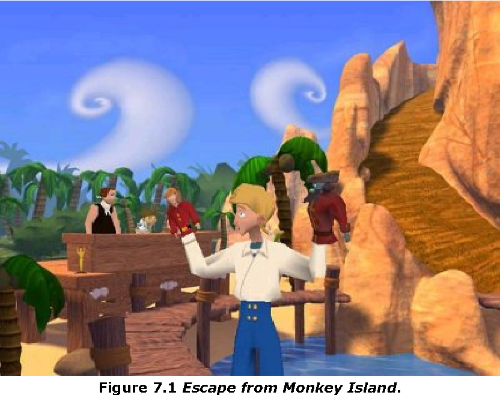

A more concrete example of this phenomenon is found in Valve's [Half-Life](https://en.wikipedia.org/wiki/Half-Life_(video_game)) (see Figure 7.2), an excellent game that has rightly won many awards for its original and innovative gameplay and story line. (However, I also need to point out that the story line is excellent only when compared to other games within the same genre; it wouldn't be a best-selling novel or a blockbuster movie.) For the most part, playing [Half-Life](https://en.wikipedia.org/wiki/Half-Life_(video_game)) is a joy. In the first two thirds of the game, the sense of immersion and of actually being there as Gordon Freeman is unparalleled. You can imagine yourself squeezing through the confining corridors of the Black Mesa Research Laboratory out in the middle of the desert, avoiding the unwanted attentions of both vicious aliens out for blood and hostile government troops sent in to clean up the transdimensional mess. Then, as the story reaches the first climax point, you are catapulted into the alien dimension to take the battle into their territory.

Valve 的[《半条命》](https://en.wikipedia.org/wiki/Half-Life_(video_game))（见图 7.2）就是这种现象的一个更具体的例子，这款优秀的游戏因其独创性和创新性的游戏玩法和故事情节而理所当然地赢得了许多奖项。(不过，我还需要指出的是，只有与同类型的其他游戏相比，该游戏的故事情节才算得上是优秀的；它不可能成为畅销小说或影片）。在大多数情况下，玩[《半条命》](https://en.wikipedia.org/wiki/Half-Life_(video_game))是一种享受。在游戏的前三分之二时间里，戈登·弗里曼的沉浸感和身临其境的感觉是无与伦比的。你可以想象自己在沙漠中央的黑梅萨研究实验室狭窄的走廊里挤来挤去，既要躲避穷凶极恶的外星人的追杀，又要躲避被派来收拾跨次元烂摊子的敌对政府军的骚扰。然后，当故事发展到第一个高潮点时，你被弹射到外星人空间，进入他们的领地展开战斗。

Figure 7.2. Half-Life. 图 7.2. 《半条命》。

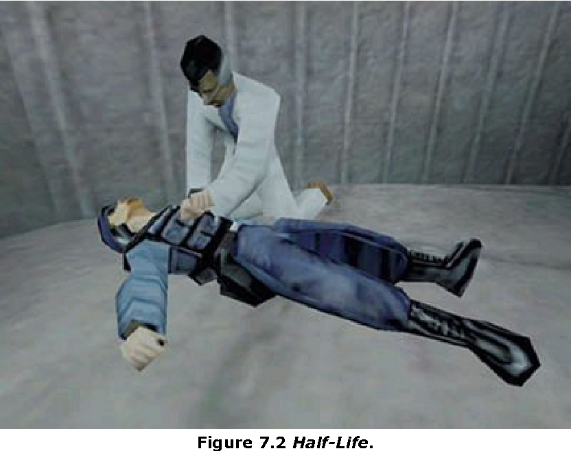

In the alien dimension, things take a turn for the worse—at least, in terms of gameplay. Although it's not a game breaker by any means, the story line experiences a significant lull here. Initially, Gordon is required to jump from platform to platform in a sub-Mario platform game style. This abrupt change in the gameplay is a showstopper as far as the suspension of disbelief, which the designers had worked so hard to cultivate, is concerned. And as if that didn't deal enough of a blow, the subsequent levels are practically straight out of the original [Quake](https://en.wikipedia.org/wiki/Quake_(video_game)), culminating in a showdown with the big, bad, end-of-game boss. Now, we don't mean to be unduly harsh on an otherwise excellent game, but the last third of the game is a real letdown in gameplay terms. All of the innovative and exciting features of the Black Mesa levels were replaced with a standard first-person jump'n'shooter. Even with the benefit of the intriguing and imaginative end sequence, the damage is done by this point: The suspension of disbelief is shattered and the player is left feeling somehow cheated. The inclusion of the platform-based level followed by the standard first-person fare is a classic nonsequitur that affects the enjoyment of the game.

在外星人空间中，情况急转直下——至少在游戏性方面是这样。虽然这绝不是一款破坏游戏的游戏，但故事线在这里经历了明显的停滞。一开始，戈登需要从一个平台跳到另一个平台，游戏风格近似于马里奥平台游戏。游戏玩法的这种突然改变，让设计者费尽心思培养信任感荡然无存。如果说这还不够打击玩家的话，那么接下来的关卡几乎就是原版[《雷神之锤》](https://en.wikipedia.org/wiki/Quake_(video_game))的翻版，最后还要与游戏末尾的大坏蛋一决高下。现在，我们并不想过分苛责这款出色的游戏，但游戏的最后三分之一在游戏性方面确实令人失望。黑梅萨关卡中所有令人兴奋的创新功能都被标准的第一人称跳跃射击游戏所取代。即使有引人入胜、充满想象力的结尾部分，但到了这一步破坏已经造成：玩家的信任感被打破了，感觉被欺骗了。在标准的第一人称关卡之后加入平台跳跃关卡，是影响游戏乐趣的典型不合理做法。

Many types of challenges can be included in a game. In the majority of cases, these challenges are purely mental. In a few games, there is some degree of physical challenge, but this is usually understated—a simple test of reflexes or hand-eye coordination. In any case, they are localized to the hands and wrists.

游戏中可以包含许多类型的挑战。在大多数情况下，这些挑战纯粹是智力上的。在少数游戏中，也有一定程度的体力挑战，但通常都很轻描淡写——只是简单的反应能力或手眼协调能力测试。无论如何，这些挑战都是针对手部和腕部的。

> **NOTE 注意**
> 
> A high-profile exception is the recent spate of Japanese dancing games, such as [Dance Dance Revolution](https://en.wikipedia.org/wiki/Dance_Dance_Revolution) (see Figure 7.3), which provide the player with a pressure-sensitive mat. The mat allows the player to dance in time to the music and dancers onscreen—an interesting gameplay innovation, but one that is hardly likely to amount to anything other than an amusing diversion.
> 
> 一个备受瞩目的例外是最近出现的一系列日本舞蹈游戏，如[《劲舞革命》](https://en.wikipedia.org/wiki/Dance_Dance_Revolution)（见图 7.3），这些游戏为玩家提供了一个压力感应垫。玩家可以在垫子上随着屏幕上的音乐和舞者的节奏起舞——这是一种有趣的游戏玩法创新，但除了能消遣之外，很难起到其他作用。

Figure 7.3. Dance Dance Revolution. 图 7.3. 《劲舞革命》。

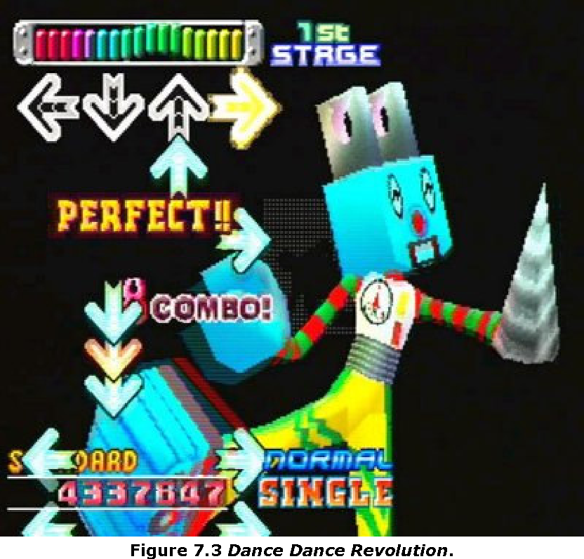

A game can contain many challenges of each different type. To save us the insanity of trying to analyze the challenge content of a whole slew of games and concluding that they all have all the challenge types, it will serve our purpose to define two classes of challenge: implicit and explicit.

一个游戏可以包含许多不同类型的挑战。为了避免试图分析一大堆游戏的挑战内容，并得出它们都包含所有挑战类型的疯狂尝试，我们将定义两种挑战类别：隐性和显性。

An explicit challenge is an intentional challenge specifically designed by the game designer. An example is the exact timing required to dodge the swinging pendulums in [Quake III Arena](https://en.wikipedia.org/wiki/Quake_III_Arena) (see Figure 7.4). This kind of challenge tends to be more immediate and intense than an implicit challenge.

显性挑战是游戏设计者专门设计的有意挑战。例如，在[《雷神之锤三竞技场》](https://en.wikipedia.org/wiki/Quake_III_Arena)中，躲避摆动的钟摆需要准确把握时机（见图 7.4）。这种挑战往往比隐性挑战更直接、更激烈。

Figure 7.4. Quake III Arena. 图 7.4. 《雷神之锤三竞技场》

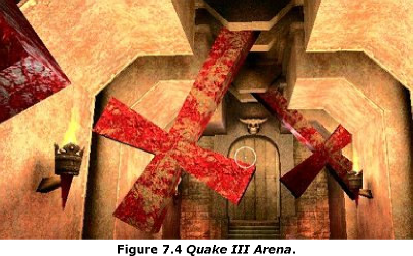

An implicit challenge is one that is not specifically designed in; in other words, it is an emergent feature of the game design. An example of an implicit challenge is figuring out the most efficient way to distribute items among your group in a traditional computer role-playing game (CRPG) such as [Black Isle](https://en.wikipedia.org/wiki/Black_Isle_Studios)'s [Baldur's Gate](https://en.wikipedia.org/wiki/Baldur%27s_Gate). Implicit challenges tend to be more drawn out and less focused than explicit challenges.

隐性挑战是指并非专门设计在内的挑战；换句话说，它是游戏设计中出现的衍生特性。隐性挑战的一个例子是在像[黑岛](https://en.wikipedia.org/wiki/Black_Isle_Studios)的[《博德之门》](https://en.wikipedia.org/wiki/Baldur%27s_Gate)这样的传统电脑角色扮演游戏（CRPG）中，找出将物品在团队成员之间分配的最有效率的方式。隐性挑战往往比显性挑战更加持久且不那么集中。

Having stated that the challenges present in games are mostly mental, let us take a closer look at the many forms these challenges can take. It's important to note that the following sections describe pure archetypal challenges; that is, they can be categorized as a simple challenge type, such as logic-based or reaction time-based. Not all challenges can be categorized so easily: The "challenge space" is not populated by a set of discrete points representing the archetypal pure challenge types, but instead is a smoothly varying continuum. Challenges can be hybridized (for example, a logic-based puzzle requiring a fast reaction time) and rarely—if at all—appear in their pure form.

在说明了游戏中的挑战主要是智力上的挑战之后，让我们来仔细看看这些挑战的多种形式。需要注意的是，以下部分描述的是纯粹的原型挑战；也就是说，它们可以被归类为一种简单的挑战类型，如基于逻辑的挑战或基于反应时间的挑战。并非所有挑战都能如此简单地归类：“挑战空间”并不是由一组离散的点组成的，这些点代表纯粹的原型挑战类型，而是一个平滑变化的连续体。挑战可以是混合型的（例如，需要快速反应的逻辑谜题），很少以纯挑战的形式出现。

### Logic and Inference Challenges 逻辑和推理挑战

Logic and inference challenges test the ability of the player to assimilate information and use that information to decide upon the best course of action.

逻辑和推理挑战考验的是选手吸收信息并利用这些信息决定最佳行动方案的能力。

Logic is primarily used when the player is presented with perfect information, as in chess. In classical game theory, there are two broad classes of game: those of perfect information, with the complete state of play known to each player at all times, and those of imperfect information, with each player knowing only a fraction of the state of play (and not necessarily the same fraction for each player). For example, chess is a game of perfect information because the player is at all times aware of the state of the board and the position of all the pieces—both his own and his opponent's. Theoretically, given enough time and processing power, it is possible to analyze the game of chess to produce a perfect strategy. A perfect strategy is one that yields the maximum benefit to the player at all times. In the case of chess, this means that a user of that strategy would never lose. Of course, with the number of possible permutations of the chessboard and the move sequences, it would be beyond any human to blindly commit that strategy to memory, just as it is currently beyond any computer to calculate it.

逻辑主要用于玩家面临完全信息的情况，如国际象棋。在经典博弈论中，有两大类博弈：一类是完全信息博弈，即每个棋手在任何时候都知道完整的棋局状态；另一类是不完全信息博弈，即每个棋手只知道部分棋局状态（而且每个棋手知道的部分不一定相同）。例如，国际象棋是一种完全信息游戏，因为棋手在任何时候都知道棋盘的状态和所有棋子的位置，包括自己和对手的棋子。从理论上讲，只要有足够的时间和处理能力，就有可能通过分析国际象棋游戏得出一个完美的策略。所谓完美策略，就是在任何时候都能为棋手带来最大利益的策略。就国际象棋而言，这意味着该策略的使用者永远不会输。当然，由于棋盘和棋步序列的可能排列组合数量众多，人类无法盲目地将该策略记入记忆，就像目前任何计算机都无法计算出该策略一样。

When played in its puzzle mode, [Chu Chu Rocket](https://en.wikipedia.org/wiki/ChuChu_Rocket!) (see Figure 7.5), by Sega, is an example of a game of perfect information. The player is given a clearly defined win condition, a known playing field, and a known set of pieces to lay on that playing field. Hence, the player has perfect information. Knowing the rules governing the cat and mouse movement allows the player to predict (a pattern-recognition challenge) the paths of the cat and the mice and to place the playing pieces accordingly. Then the game is started and the results can be seen. If the win condition is not met, the player can replay the level.

世嘉出品的[《咻咻火箭》](https://en.wikipedia.org/wiki/ChuChu_Rocket!)（见图 7.5）在解谜模式下是一个完全信息游戏的范例。玩家可以得到一个明确的获胜条件、一个已知的游戏场地和一组已知的棋子。因此，玩家拥有完美的信息。知道了猫和老鼠的移动规则，玩家就可以预测猫和老鼠的移动路径（这是一项模式识别挑战），并据此摆放棋子。然后开始游戏并查看结果。如果没有达到获胜条件，玩家可以重新玩这一关。

Figure 7.5. Chu Chu Rocket. 图 7.5. 《咻咻火箭》。

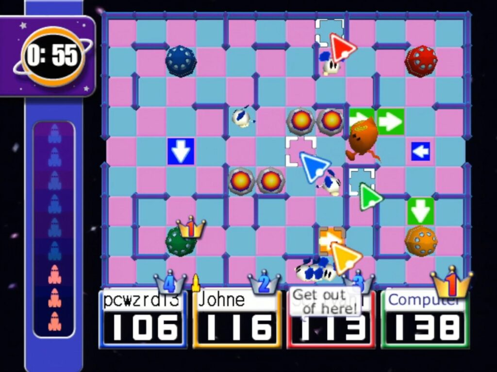

In games of imperfect information, logic is not sufficient. Logic cannot fully operate given an incomplete knowledge of the state of play. In these cases, the gaps in that knowledge must be filled using inference. In this context, inference is the ability to surmise, or guess, the incomplete knowledge based on extrapolation of the existing facts.

在不完全信息博弈中，逻辑是不够的。在不完全了解游戏状态的情况下，逻辑无法完全发挥作用。在这种情况下，必须通过推理来填补知识空白。在这种情况下，推理就是根据现有事实推断或猜测不完整知识的能力。

[Microsoft Hearts](https://en.wikipedia.org/wiki/Microsoft_Hearts) (see Figure 7.6) is an example of a game of imperfect information. Initially, you do not know the contents of the hands of the other players, but a skilled player can work them out to a reasonable degree of certainty by using the information revealed by which cards are passed and what tricks are laid during the course of the game.

[《微软红心大战》](https://en.wikipedia.org/wiki/Microsoft_Hearts)（见图 7.6）就是一个不完全信息游戏的例子。一开始，你并不知道其他玩家手中的牌的内容，但是熟练的玩家可以通过游戏过程中通过哪些牌被跳过和出了哪些组合牌所透露的信息，将其推测出合理的确定程度。

Figure 7.6. Microsoft Hearts. 见图 7.6. 《微软红心大战》

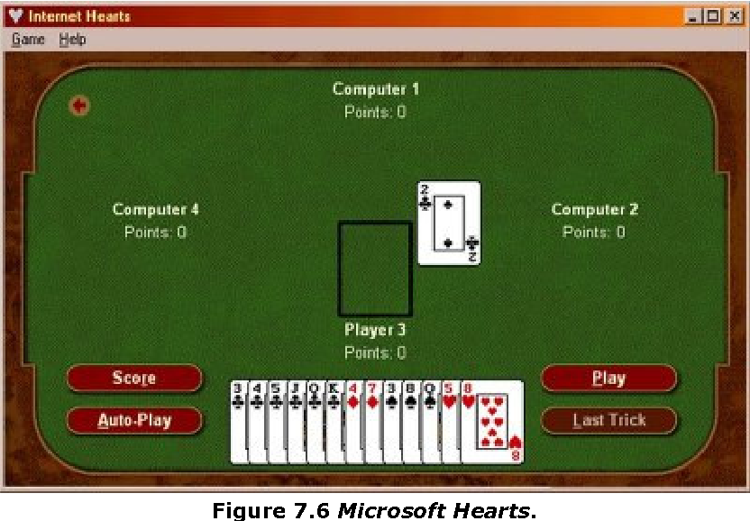

Bridge is another classic example of a game of imperfect information. A player does not know the contents of his partner's or his opponents' hands. He must use his knowledge of the game to calculate the best estimate during the course of the game.

桥牌是另一个信息不完全游戏的典型例子。玩家不知道同伴或对手手中的牌。他必须利用自己对游戏的了解，在游戏过程中计算出最佳估计。

The classic real-time strategy game staple, the "fog of war" shown in Figure 7.7, is a way of graphically representing imperfect information of a battlefield. The player can see only enemy units that are within the line of sight of any of his units. When an enemy unit goes into the fog of war (usually represented by a grayed-out area as the terrain was last seen, or a black area where the terrain has never been seen), the player can estimate where his enemies are and, based on his knowledge of the battlefield, attempt to draw conclusions about their intentions and plan his counterattack against them.

图 7.7 所示的“战争迷雾”是经典即时战略游戏的主要元素，它以图形的方式表现了战场的不完全信息。玩家只能看到在自己单位视线范围内的敌方单位。当敌方单位进入“战争迷雾”通常以灰色区域表示最后看到的地形，或黑色区域表示从未见过的地形）时，玩家可以估计敌人的位置，并根据自己对战场的了解，尝试得出敌人意图的结论，并计划对其进行反击。

Figure 7.7. The fog of war (right side of screen) in Warcraft II. 图 7.7. 《魔兽争霸 II》中的战争迷雾（屏幕右侧）。

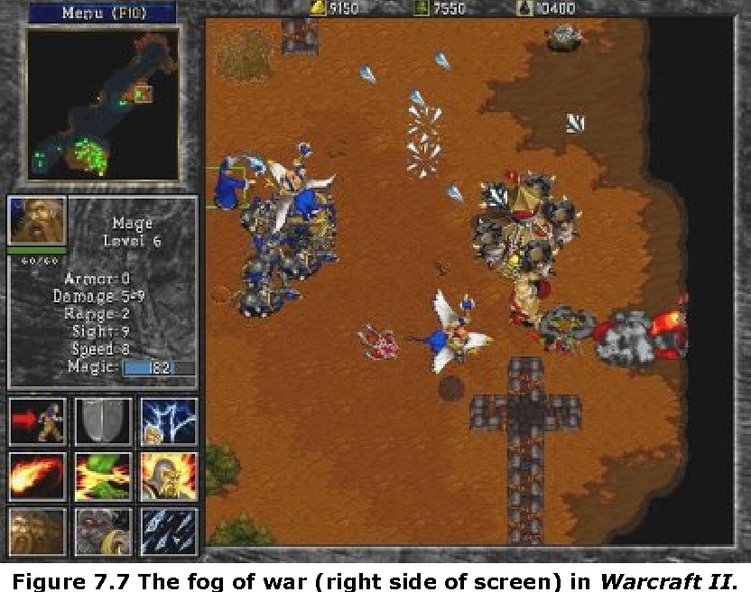

Games of imperfect knowledge are much more common than games of perfect knowledge. This is because one of the key elements of gameplay is challenging the player to hypothesize about the game worlds, forming her own internal picture. The degree to which this picture matches the real thing depends very much on the logic and inference skills of the player. It is much harder to design a good game without the element of mystery. Only a few designers can achieve this with any degree of success. Mystery can be viewed as the easy way out. There is no better way to hook a player than to get her involved in a compelling mystery story. Human curiosity is a very strong attractor, and any game that successfully taps into this provides a strong gameplay element. [Half-Life](https://en.wikipedia.org/wiki/Half-Life_(video_game)) did this extremely well, putting the player in the role of a new scientist trying to escape after a hideous cross-dimensional experimental error at his first day of work.

不完全信息游戏比完全信息游戏更为常见。这是因为游戏的关键要素之一是挑战玩家对游戏世界的假设，形成自己的内部图景。这个图景与真实情况的吻合程度在很大程度上取决于玩家的逻辑和推理能力。设计一款没有神秘元素的好游戏要难得多。只有少数设计者能成功地做到这一点。神秘感可以被视为一种简单的方法。吸引玩家的最好方法莫过于让她参与到一个引人入胜的神秘故事中。人类的好奇心是一种非常强大的吸引力，任何游戏只要能成功地利用这一点，就能提供强大的游戏元素。[《半条命》](https://en.wikipedia.org/wiki/Half-Life_(video_game))在这方面做得非常好，它让玩家扮演一名新科学家，试图在上班的第一天就因为一次可怕的跨维度实验错误而逃脱。

One problem with games of perfect information is that, because of the difficulty of designing an engaging playing experience without hiding anything from the player, they tend to be very simple. Usually, they are implemented as computer board games or simple arcade games. [Archon](https://en.wikipedia.org/wiki/Archon:_The_Light_and_the_Dark) (see Figure 7.8) is an excellent example of a computerized board game that was popular in the 1980s.

完全信息游戏的一个问题是，由于很难在不向玩家隐瞒任何信息的情况下设计出引人入胜的游戏体验，因此它们往往非常简单。通常，它们都是以电脑棋盘游戏或简单的街机游戏的形式来实现的。[《执政官》](https://en.wikipedia.org/wiki/Archon:_The_Light_and_the_Dark)（见图 7.8）就是 1980 年代流行的电脑棋盘游戏的一个很好的例子。

Figure 7.8. Archon. 图 7.8. 《执政官》。

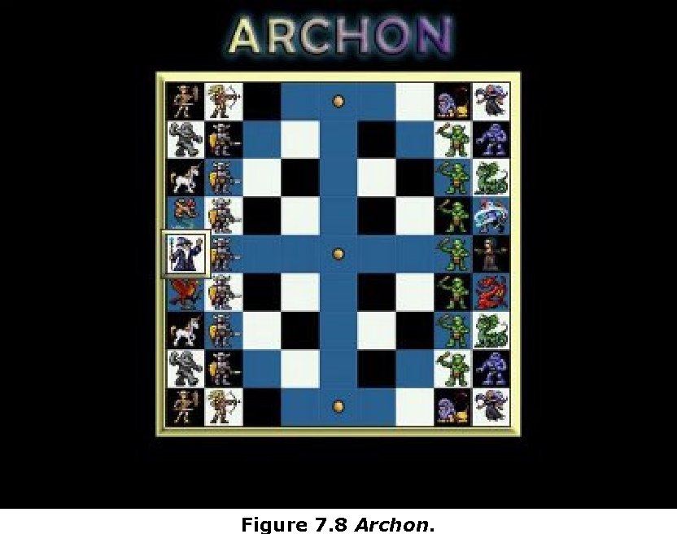

In [Archon](https://en.wikipedia.org/wiki/Archon:_The_Light_and_the_Dark) (and its sequels), the whole board was visible on the screen, and both players had full knowledge of the game state. In many ways, [Archon](https://en.wikipedia.org/wiki/Archon:_The_Light_and_the_Dark) was a computer-age successor to chess, combining elements of board-game strategy and arcade action in a single game.

在[《执政官》](https://en.wikipedia.org/wiki/Archon:_The_Light_and_the_Dark)（及其续集）中，整个棋盘都可以在屏幕上看到，双方都能完全了解游戏状态。在许多方面，[《执政官》](https://en.wikipedia.org/wiki/Archon:_The_Light_and_the_Dark)都是国际象棋在计算机时代的继承者，它将棋盘游戏的策略元素和街机游戏的动作元素融合在一款游戏中。

### Lateral-Thinking Challenges 横向思维挑战

In some ways, lateral-thinking challenges are an extension of inference challenges. Certainly, they draw on the same core skills, but taken to the extreme. A lateral-thinking challenge tasks the player to draw on her previous experience and knowledge and combine them in a new and unexpected way.

在某些方面，横向思维挑战是推理挑战的延伸。当然，它们利用了相同的核心技能，但却达到了极致。横向思维挑战的任务是让玩家利用以前的经验和知识，以一种新的、意想不到的方式将它们结合起来。

This knowledge can be intrinsic or extrinsic. Intrinsic means that the knowledge was gained from within the game world—for example, figuring out a new combination of runes to cast a previously unknown spell, as was the case with the "flux cage" in FTL's [Dungeon Master](https://en.wikipedia.org/wiki/Dungeon_Master_(video_game)) (see Figure 7.9). If the player figured out the meaning of the runes, it was possible to figure out roughly what purpose the unknown spell had, and the player needed to do that to win the game. No knowledge gained outside the game would have helped to figure out that particular problem (unless the player looked up the answer in a game magazine or on the Internet, but that's cheating).

这些知识可以是内在的，也可以是外在的。内在知识指的是玩家从游戏世界中获得的知识——例如，找出新的符文组合来施放以前未知的咒语，就像FTL的[《迷宫魔兽》](https://en.wikipedia.org/wiki/Dungeon_Master_(video_game))中的“通量牢笼”一样（见图 7.9）。如果玩家弄懂了符文的含义，就有可能大致猜出未知咒语的用途，而玩家需要做到这一点才能赢得游戏。在游戏之外获得的任何知识都无助于解决这个问题（除非玩家在游戏杂志或互联网上找到答案，但那是作弊）。

Figure 7.9. Dungeon Master. 图 7.9. 《迷宫魔兽》

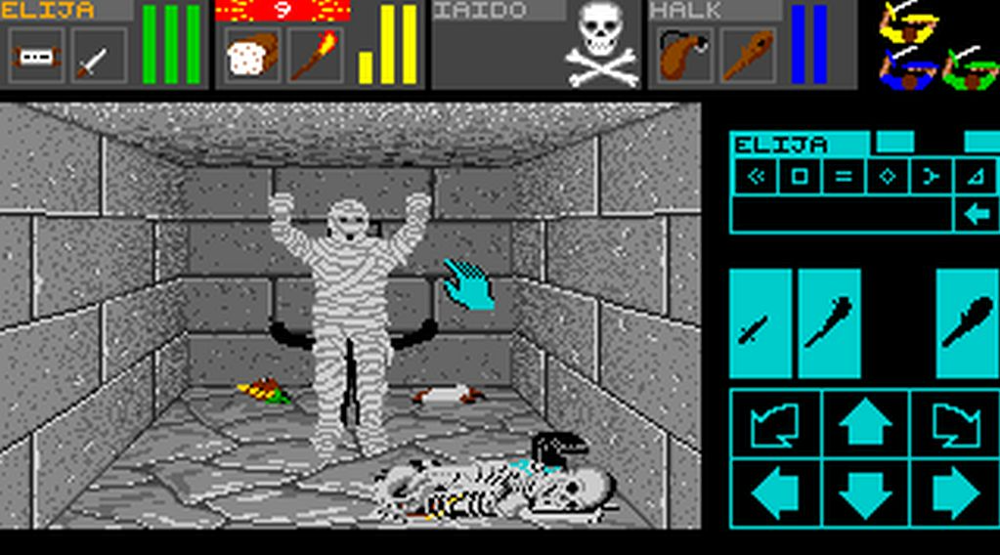

The converse of intrinsic knowledge is extrinsic knowledge. This means knowledge that was gained outside the game world, perhaps in real life. For example, a player could use his knowledge that wood floats to retrieve a key attached to a wooden block just beyond his reach at the bottom of a narrow container by filling the container with water. Or, for an example from a published role-playing game written many years ago by Dave Morris (co-author of Game Architecture and Design by New Riders Publishing, 2004), the player could use her knowledge that repeated rapid heating and cooling of a metal object causes it to become brittle. This was the required technique to break through a metal door, otherwise impervious to both weapons and magic. Of course, the player wasn't dropped into this situation unprepared. There were clues to guide the player toward this solution.

与内在知识相对应的是外在知识。这是指在游戏世界之外获得的知识，也许是在现实生活中获得的知识。例如，玩家可以利用木头会漂浮的知识，在狭窄的容器底部注满水，捞起木块上的钥匙。或者，以戴夫·莫里斯（《游戏架构与设计》合著者之一，新骑士出版社，2004 年）多年前出版的一款角色扮演游戏为例，玩家可以利用金属物体反复快速加热和冷却会变脆的知识。这就是攻破金属门所需的技术，否则金属门是无法被武器和魔法攻破的。当然，玩家并不是在毫无准备的情况下被丢到这里的。有一些线索可以引导玩家找到解决办法。

[Half-Life](https://en.wikipedia.org/wiki/Half-Life_(video_game)) made great use of extrinsic knowledge-based lateral-thinking problems. In one particularly memorable sequence, the player had to figure out that the giant tentacled monster was sensitive to sound and then could use that as a detection mechanism, necessitating extreme stealth or noisy diversionary tactics in its presence. Not only that, but the player also had to make the mental connection between the oxygen and fuel pipes running throughout the level and the ominous rocket poised directly over the seemingly invincible tentacle. There are many other such puzzles in [Half-Life](https://en.wikipedia.org/wiki/Half-Life_(video_game)), but these are particularly notable (and ingenious) examples.

[《半条命》](https://en.wikipedia.org/wiki/Half-Life_(video_game))大量使用了基于外在知识的横向思维问题。在一个特别令人难忘的情节中，玩家必须弄明白巨型触手怪对声音很敏感，然后可以利用声音作为一种探测机制，在它出现时必须采取极端的隐身或嘈杂的声东击西战术。不仅如此，玩家还必须将贯穿整个关卡的氧气和燃料管道与直接位于看似无敌的触手上方的不祥火箭联系起来。[《半条命》](https://en.wikipedia.org/wiki/Half-Life_(video_game))中还有许多其他类似的谜题，但这些都是特别显著（和巧妙）的例子。

### Memory Challenges 记忆挑战

Memory challenges tax the player's memory of recent (and sometimes not so recent) game events. They are also purely intrinsic. That is to say, they rely specifically on the player's memory of events that have happened in the context of the game and do not rely on, for example, the player's memory of what he had for dinner a week ago.

记忆挑战考验的是玩家对近期（有时是不太近期）游戏事件的记忆。它们也是纯粹的内在挑战。也就是说，它们完全依赖于玩家对游戏中发生的事件的记忆，而不是依赖于玩家对一周前晚餐吃了什么的记忆。

Probably the best-known and most obvious example of a game based around a memory challenge is Milton Bradley's Simon (see Figure 7.10), a simplified electronic version of the classic children's game Simon Says. This game was very popular back in the 1980s. It had four buttons, colored red, yellow, green, and blue. When the player started a game, the computer flashed the buttons in a random sequence, although usually the game started with a single flash. After each sequence, the player had to repeat the sequence. If successful, the computer repeated the sequence again, adding one flash each time. The game was lost if the player made a mistake remembering the sequence. Many games—in particular, adventure games, role-playing games, and first-person shooters—make use of this particular memory-based challenge.

米尔顿·布拉德利公司的“西蒙”（见图 7.10）可能是最著名、最明显的以记忆挑战为基础的游戏，它是经典儿童游戏“西蒙说”的简化电子版。这款游戏在 1980 年代非常流行。它有红、黄、绿、蓝四个按钮。当玩家开始游戏时，电脑会按随机顺序闪烁按钮，但通常游戏开始时只闪烁一次。每次闪光后，玩家必须重复闪光顺序。如果成功，电脑会再次重复该序列，每次增加一个闪光。如果玩家记错了顺序，游戏就失败了。许多游戏，尤其是冒险游戏、角色扮演游戏和第一人称射击游戏，都采用了这种基于记忆的特殊挑战。

Figure 7.10. Simon. 图 7.10. 西蒙。

Nowadays, memory-based challenges are commonly seen in children's software, and even then they are usually hybridized with other types of challenge.

如今，基于记忆的挑战通常出现在儿童软件中，即便如此，它们通常也与其他类型的挑战混合在一起。

In fact, at the most basic level, it could be said that memory challenges are present in virtually every game; for example, remembering the layout of the complex tunnels onboard the Borg cube in [Raven](https://en.wikipedia.org/wiki/Raven_Software)'s [Voyager: Elite Force](https://en.wikipedia.org/wiki/Star_Trek:_Voyager_%E2%80%93_Elite_Force) is an example of an implicit memory challenge.

事实上，在最基本的层面上，可以说几乎每款游戏中都有记忆挑战；例如，在[渡鸦](https://en.wikipedia.org/wiki/Raven_Software)公司的[《航海家：精英力量》](https://en.wikipedia.org/wiki/Star_Trek:_Voyager_%E2%80%93_Elite_Force)中记住博格立方体上复杂隧道的布局就是隐性记忆挑战的例子。

### Intelligence-Based Challenges 基于智力的挑战

Intelligence-based challenges rely purely on the intelligence quotient of the player. This is extremely difficult to quantify and define, and, as far as we can tell, intelligence-based challenges do not exist "in the wild" in their pure form—at least, not in games.

智力挑战完全依赖于玩家的智商。这一点极难量化和定义，而且据我们所知，基于智力的挑战并不以纯粹的形式存在于“野外（即现实世界）”——至少不是在游戏中。

In fact, the only place where this form of challenge exists in pure form is in official intelligence quotient (IQ) tests, such as those administered by Mensa, the organization for extremely intelligent people.

事实上，这种形式的挑战以纯粹的形式存在的唯一地方是官方智商（IQ）测试，例如由门萨组织实施的测试，门萨是一个为极度聪明的人设立的组织。

An example of an intelligence-based challenge, similar to those used by Mensa, is, given a sequence of similar shapes, to predict the next shape in the sequence from a choice of answers.

与门萨组织类似的智力挑战的一个例子是，给定一串相似的图形，从可供选择的答案中预测出该序列中的下一个图形。

Intelligence-based challenges are included here as an archetype because they often form part of other challenges. Usually a more intelligent player will do better when playing a game using the more cerebral challenges.

这里之所以将智力挑战作为一种原型，是因为智力挑战往往是其他挑战的一部分。通常情况下，智力较高的玩家在玩脑力挑战游戏时会表现得更好。

### Knowledge-Based Challenges 知识型挑战

Knowledge-based challenges rely on the knowledge of the player. As we have already touched upon, there are two types of knowledge to consider: intrinsic and extrinsic. Intrinsic challenges rely on knowledge from within the game world. Extrinsic challenges rely on knowledge external to the game world.

基于知识的挑战依赖于玩家的知识。正如我们已经提到的，有两类知识需要考虑：内在知识和外在知识。内在挑战依赖游戏世界中的知识。外在挑战则依赖于游戏世界外部的知识。

In the case of knowledge-based challenges, the ultimate real-world example is [Trivial Pursuit](https://en.wikipedia.org/wiki/Trivial_Pursuit) (see Figure 7.11). This board game, which most people are familiar with, relies on general knowledge to win. A player's progress is determined by his answers to a set of questions in various categories, the vast majority of which are simple and straightforward—provided that the player knows the answer. Of course, in some cases the player can attempt to answer questions that he isn't sure of by listening for the clue in the question—crossing over into the territory of a lateral-thinking challenge. Clearly, this is an example of a game relying on extrinsic knowledge-based challenges to provide the gameplay. [Trivial Pursuit](https://en.wikipedia.org/wiki/Trivial_Pursuit) has also been released in computer versions for various platforms since its debut in the mid-1980s.

就基于知识的挑战而言，现实世界的终极例子是[《棋盘问答》](https://en.wikipedia.org/wiki/Trivial_Pursuit)（见图 7.11）。这款大多数人都熟悉的棋盘游戏依靠常识取胜。玩家的进度取决于他对一系列不同类别问题的回答，其中绝大多数问题都简单明了——只要玩家知道答案。当然，在某些情况下，玩家可以通过倾听问题中的线索来尝试回答他不确定的问题，这就进入了横向思维挑战的领域。显然，这是一个依靠外在知识挑战来提供游戏性的例子。自 1980 年代中期问世以来，[《棋盘问答》](https://en.wikipedia.org/wiki/Trivial_Pursuit)还推出了各种平台的电脑版本。

Figure 7.11. Trivial Pursuit Millennium Edition. 图 7.11. 千禧版《棋盘问答》。

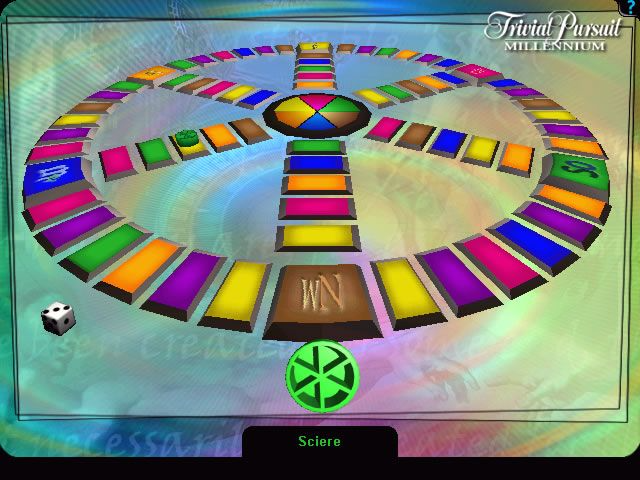

More recently, [You Don't Know Jack](https://en.wikipedia.org/wiki/You_Don%27t_Know_Jack_(franchise)) (see Figure 7.12) tests general (hence, extrinsic) knowledge in a quiz game format. However, this is an example that does not use knowledge-based challenges in their pure form. Instead, the questions are mostly phrased as a humorous lateral thinking problem and are set to a time limit so that players can—in most cases—figure out the answer with some (admittedly rapid) careful thought. In a lot of cases, knowledge-based challenges are inextricably linked with lateral thinking–based challenges. Except in certain rarified environments such as quiz games, knowledge-based challenges rarely appear in their archetypal form.

最近，[《你不了解杰克》](https://en.wikipedia.org/wiki/You_Don%27t_Know_Jack_(franchise))（见图 7.12）以问答游戏的形式测试一般知识（即外在知识）。不过，这个例子并没有纯粹地使用基于知识的挑战。相反，这些问题大多以幽默的横向思维问题的形式出现，并设置了时间限制，这样玩家在大多数情况下都可以通过仔细思考（当然是快速思考）找出答案。在很多情况下，基于知识的挑战与基于横向思维的挑战密不可分。除了在某些稀有的环境中，如问答游戏，基于知识的挑战很少以其原型形式出现。

Figure 7.12. You Don't Know Jack. 图 7.12. 《你不了解杰克》

Intrinsic knowledge–based challenges are found in practically all games. However, explicit, intrinsic knowledge–based challenges are more often found in role-playing or adventure games. Here, a good knowledge of the game world and the background story and characters is essential to progress in the game. In real terms, this means that if you were to start a new game of, for example, Warren Spector's [Deus Ex](https://en.wikipedia.org/wiki/Deus_Ex_(video_game)) by loading a saved game provided by someone else, and it started you halfway through the game, you would have a much harder time trying to progress through the game than you would if you had started from the beginning.

几乎所有游戏中都有基于内在知识的挑战。然而，在角色扮演游戏或冒险游戏中，显性的、基于内在知识的挑战更为常见。在这些游戏中，对游戏世界、背景故事和人物的充分了解对于游戏的进展至关重要。在现实中，这意味着如果你通过加载别人提供的游戏存档来开始一个新的游戏，例如，华伦·史佩特的[《杀出重围》](https://en.wikipedia.org/wiki/Deus_Ex_(video_game))，于是你从游戏的半中途开始进行游戏，那么你要想在游戏中取得进展就会比从头开始游戏困难得多。

### Pattern-Recognition Challenges 模式识别挑战

According to the theorists, the impressive abilities demonstrated by the human brain mainly stem from one basic ability: pattern recognition. In essence, our brain is a generalized pattern-recognition machine; our brain implicitly forms archetypes of objects and events and compares new experiences with these archetypes to recognize which category they fall under. For example, there are many different shapes and forms for tables, but somehow we always implicitly recognize a table when we see one, even if we have never seen that particular table.

理论家认为，人类大脑所表现出的惊人能力主要源于一种基本能力：模式识别。从本质上讲，我们的大脑是一个通用的模式识别机器；我们的大脑会隐性地形成物体和事件的原型，并将新的经验与这些原型进行比较，以识别它们属于哪一类。例如，桌子有许多不同的形状和形式，但不知何故，当我们看到一张桌子时，总会隐性地识别出它，即使我们从未见过那张特定的桌子。

According to some theories on learning, all types of learning are a form of pattern recognition and classification. When learning to speak, we are required to recognize and classify the sounds we hear as babies. In fact, to deal with everyday life, we are constantly recognizing patterns in events and using these to classify what is happening so that we can act according to past similar experiences. You know not to walk into a road without looking because you recognize the archetypal road, the archetypal event of walking across a road, and the possibility of the archetypal car or truck colliding with you and smearing you along several hundred yards of archetypal highway.

根据一些学习理论，所有类型的学习都是一种模式识别和分类。在学习说话时，我们需要对婴儿时期听到的声音进行识别和分类。事实上，在日常生活中，我们要不断地识别事件的模式，并利用这些模式对正在发生的事情进行分类，以便根据过去的类似经验采取行动。你知道不能不看车就走到马路上，因为你能辨认出原型道路、走过马路的原型事件，以及原型汽车或卡车与你相撞并把你拖行几百码长的原型高速公路上的可能性。

In this particular case, the human brain's ability to recognize patterns is sometimes overeager (for the technically minded, it uses a greedy algorithm) and can recognize patterns where there (arguably) are none. The name for this phenomenon is pareidolia, a type of illusion or misperception involving a vague or obscure stimulus being perceived as something clear and distinct. Human history is littered with examples of this: the constellations of stars in the night sky, the man in the moon, the whole field of astrology, and the articles that appear regularly in the National Enquirer proudly displaying the face of Jesus in a sesame seed bun. In fact, the Rorschach test, first published by Herman Rorschach in 1921, relies on the brain's overactive capacity for pattern recognition to attempt psychometric evaluation of the patient.

在这种特殊情况下，人脑识别模式的能力有时会过于急切（对于技术人员来说，它使用的是一种贪婪算法），可以识别出（可以说）不存在的模式。这种现象被称为“幻视”，是一种错觉或幻觉，即把模糊或晦涩的刺激感知为清晰明确的事物。人类历史上有很多这样的例子：夜空中的星座、月亮上的人、整个占星术领域，以及经常出现在《国家询问报》上的文章，这些文章自豪地把耶稣的脸放在芝麻面包里。事实上，由赫尔曼·罗夏（Herman Rorschach）于 1921 年首次发表的罗夏测验，就是依靠大脑过度活跃的模式识别能力来尝试对患者进行心理评估。

You can see this effect for yourself: Stare up at the clouds and see what they resemble (as an imaginative game designer, you should have no problem with this). For a slightly less subjective test, stare at the static on a television set for a minute or two, and you should begin to see imaginary structures pinwheeling about the screen. This is the brain attempting to find patterns where there are none.

你可以亲眼目睹这种效果：抬头凝视云朵，看看它们像什么（作为一个富有想象力的游戏设计师，你应该能够做到）。如果想做一个主观性稍弱的测试，盯着电视机上的雪花屏画面一两分钟，你就会开始看到想象中的结构在屏幕上旋转。这是大脑试图在没有模式的地方找到模式。

A Google search on "nature versus nurture" and "pareidolia" will turn up lots of useful links on these subjects.

在谷歌上搜索“先天与后天”和“视幻觉”，可以找到很多关于这些主题的有用链接。

Figure 7.13 is a collection of common optical illusions. These illusions work primarily because of the way the brain's pattern recognition ability works. The top-left image is merely a set of straight lines with right angles, but we perceive it as an octagon with a square in the center. The top-right image could be taken from a Pac-Man conference, but we also see a phantom white triangle. The bottom-left image conjures up ghostly gray spots at the intersections. The bottom-right image appears to spin in different directions as you focus on the black dot in the center and move the page toward you.

图 7.13 是一组常见的视力幻觉。这些幻觉之所以有效，主要是因为大脑的模式识别能力。左上方的图像只是一组直角直线，但我们却把它看成是一个中心有正方形的八边形。右上方的图像可能来自吃豆人大会，但我们也看到了一个幽灵般的白色三角形。左下方的图像在交叉点处出现了幽灵般的灰色斑点。右下角的图像，当你把注意力集中在中心的黑点，然后移动身体靠近页面时，它似乎在朝不同的方向旋转。

Figure 7.13. Pattern recognition: There is no spoon! 图 7.13. 模式识别：没有勺子！

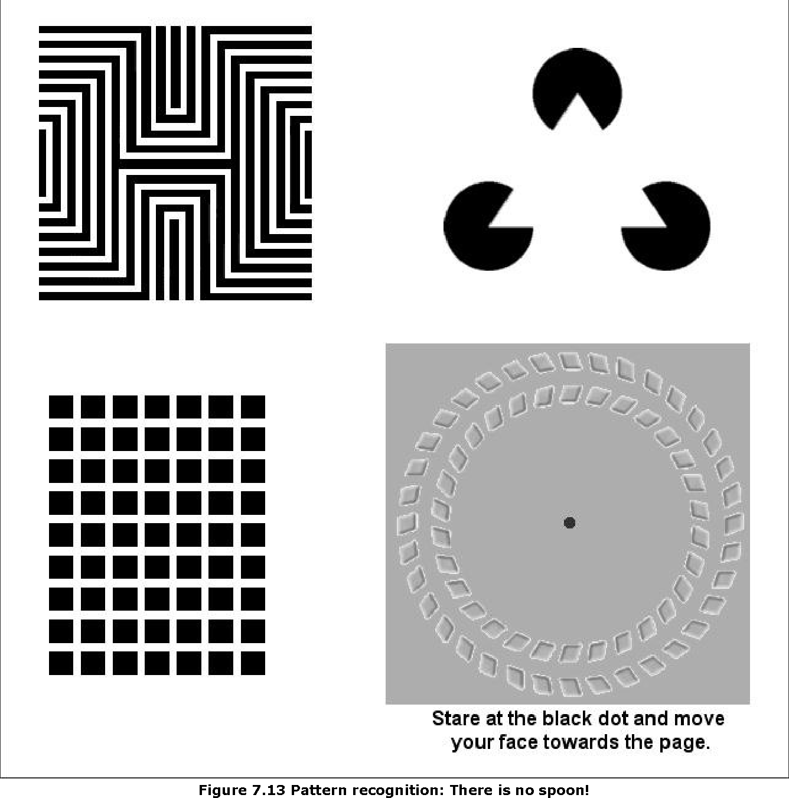

In some fairly unique games, the brain's ability to recognize patterns can be tuned into, to enhance the ability of the player. An example of this is Tetris. Tetris can be played consciously, examining each block as it falls and actively deciding where to stack the block for best effect. However, the best players don't seem to play like this, especially at the later levels, where blocks fall too fast to be able to make any conscious decision where to put them. Instead, these players seem to tune into the game at an almost subconscious level and enter what we call the "Tetris trance," a Zen-like state in which the players seem to lose all track of time and don't concentrate on the specifics of the game board. Instead the players defocus and appear to process the entire playing area as a whole, without considering the individual elements. In fact, if these players were in the Star Wars universe, the Force would be strong in them.

在一些相当独特的游戏中，可以调整大脑识别模式的能力，以提高玩家的能力。俄罗斯方块就是一个例子。俄罗斯方块可以有意识地玩，在每个方块落下时都要仔细观察，并积极决定将方块堆叠在哪里以达到最佳效果。然而，最好的玩家似乎并不是这样玩的，尤其是在后面的关卡，因为方块下落的速度太快，无法有意识地决定把它们放在哪里。相反，这些玩家似乎在几乎潜意识的层面上融入了游戏，并进入了我们所说的“俄罗斯方块恍惚”状态，这是一种类似于禅宗的状态，在这种状态下，玩家似乎完全忘记了时间，不再专注于游戏棋盘的具体细节。相反，玩家会分散注意力，将整个游戏区域作为一个整体来处理，而不考虑各个元素。事实上，如果这些玩家身处《星球大战》宇宙中，他们身上的原力一定会非常强大。

In reality, however, it appears that these players are tapping into their brain's subconscious pattern-recognition ability to improve their game. Tetris is not the only game in which this occurs. Pretty much any game that uses pattern-recognition challenges as the primary gameplay mechanism can be played in such a way, although we certainly believe that it helps if those games have a clear and simple presentation. Maybe that is because the area of the brain dealing with pattern recognition is quite primal and, to process information quickly at that level, needs the information to be presented clearly so that minimal preprocessing is required. Of course, this is pure speculation on our part, but it is no coincidence that many of the older games that are now considered classics are those that can be played in this fashion. The one thing that all of these games have in common (apart from their reliance on pattern-recognition challenges) is their simple presentation. Classic games such as [Robotron](https://en.wikipedia.org/wiki/Robotron:_2084), [Defender](https://en.wikipedia.org/wiki/Defender_(1981_video_game)), and [Sinistar](https://en.wikipedia.org/wiki/Sinistar) all exhibit this feature.

但实际上，这些玩家似乎是在利用大脑潜意识中的模式识别能力来提高自己的游戏水平。俄罗斯方块并不是唯一出现这种情况的游戏。几乎所有以模式识别挑战为主要游戏机制的游戏都可以这样玩，不过我们相信，如果这些游戏的表现形式简单明了，肯定会有所帮助。这也许是因为大脑中处理模式识别的区域是相当原始的，为了在这一层次上快速处理信息，需要将信息清晰地呈现出来，以便将所需的预处理减少到最低限度。当然，这纯粹是我们的猜测，但许多现在被视为经典的老游戏都是可以用这种方式玩的，这绝非巧合。所有这些游戏都有一个共同点（除了依赖模式识别挑战之外），那就是其简单的表现形式。经典游戏如[《机器人大战》](https://en.wikipedia.org/wiki/Robotron:_2084)、[《保卫者》](https://en.wikipedia.org/wiki/Defender_(1981_video_game))和[《Sinistar》](https://en.wikipedia.org/wiki/Sinistar)都体现了这一特点。

So, if the brain's primary cognitive function is to recognize patterns, what does this mean in terms of gameplay? Pattern-recognition challenges can make or break a game, depending on how they are used. If in an entirely deterministic game one or more of the players can determine the pattern of play, this allows them to make 100% accurate predictions about game world events before they actually occur. Although they should be commended on their acumen, this does not make the game fun for the other players. This could rapidly degenerate to the situation in which it is almost as if the predicting player is a god of the game world and the other players are mere pawns, with no free will of their own.

那么，如果大脑的主要认知功能是识别模式，这对游戏玩法意味着什么呢？模式识别挑战可以决定一个游戏的成败，这取决于如何使用它们。如果在一个完全确定性的游戏中，一个或多个玩家能够确定游戏模式，这就允许他们在游戏世界事件实际发生之前对其做出 100% 的准确预测。虽然他们的聪明才智值得称赞，但这并不会给其他玩家带来游戏乐趣。这可能会迅速演变成这样一种情况：能预测的玩家几乎就是游戏世界的神，而其他玩家只是棋子，没有自己的自由意志。

> **NOTE 注意**
> 
> Note that the opposing players can be either humans with limited play options or a computer opponent that has been programmed to respond in certain ways to specific inputs. We heard a story once about a game with an adaptive computer opponent; the opponent's skill level depended on the perceived level of skill of the player. Soon players discovered that the easiest way to progress past difficult levels in the game was to deliberately do badly in the levels immediately preceding the difficult level, whereupon the computer immediately eased up on the player, making the difficult level slightly easier. Although this is an ingenious and valid approach, it is probably not what the designer intended, even from emergent behavior. No battle in the field has ever been won by the enemy commander sympathizing with his opponents' lack of ability and "going easy on them." Note that in the context of gameplay, adaptive difficulty is a useful tool. Just don't make it so recognizable to the player that she can exploit it to progress in the game. This is one pattern that you do not want the player to recognize.
> 
> 需要注意的是，对手既可以是游戏经验有限的人类，也可以是被编程为对特定输入做出确定反应的电脑对手。我们曾经听说过这样一个故事：在一款游戏中，电脑对手具有自适应能力；电脑对手的技能水平取决于玩家的感知技能水平。很快，玩家们就发现，要想通过游戏中的难关，最简单的方法就是故意在难关之前的关卡中表现得很差，这样电脑就会立即对玩家放松，使难关变得稍微容易一些。虽然这是一种巧妙而有效的方法，但它可能并不是设计者的初衷，即使从突发行为的角度来看也是如此。在战场上，从来没有哪一场战斗是敌方指挥官同情对手能力不足而“对他们放松警惕”而取得胜利的。请注意，在游戏中，自适应难度是一种有用的工具。只是不要让玩家太容易察觉到，否则，她就可以利用它在游戏中取得进展。这是一种你不希望玩家识别出来的模式。

Plenty of basic pattern-recognition games exist. A simple example that combines pattern-recognition challenges with reflex/reaction time-based challenges is the card game Snap. In this game, the players take turns laying a card from their hands face up on the discard pile, making sure that it is unseen by any player until the last possible moment. When the card is turned face up, the players check to see if it matches the card underneath (and by match, we mean it is of the same face value). That's the pattern-recognition challenge. If there is a match, the first player to shout "Snap!" wins all the cards in the discard pile. That's the reflex/reaction time challenge. If any players run out of cards, they are out of the game. The winner is the last player remaining with any cards in his hand.

有很多基本的模式识别游戏。纸牌游戏《捉对儿》就是一个简单的例子，它将模式识别挑战与基于反射/反应时间的挑战结合在一起。在这个游戏中，玩家轮流将手中的一张牌正面朝上放在弃牌堆上，确保直到最后一刻都不会被任何玩家看到。当牌面朝上时，玩家要检查它是否与下面的牌匹配（所谓匹配，是指面值相同）。这就是图案识别挑战。如果匹配，最先喊出“啪！”的玩家将赢得弃牌堆中的所有牌。这就是反应时间挑战。如果任何玩家的牌用完了，他们就出局了。最后一名手中有牌的玩家即为获胜者。

In the early days of computer games, patterns were a lot more prevalent (or, at least, more obvious) in games than they are today. There could be any number of reasons for this. Maybe patterns were the most efficient way to code for an interesting game, given the limited processing power of the target platform. Another option is that the patterns are always there in games, but in the older games they stood out in stark relief against the simplicity of the gameplay. Games such as [Space Invaders](https://en.wikipedia.org/wiki/Space_Invaders) and [Galaxians](https://en.wikipedia.org/wiki/Galaxian) made heavy use of patterns. In many cases, playing effectively was simply a matter of memorizing the patterns and reacting accordingly. This play method persisted through most of the shoot 'em-ups that were produced until recently. However, even [Iridion 3D](https://en.wikipedia.org/wiki/Iridion_3D) released on the Game Boy Advance is a shoot 'em-up that defines attack wave patterns that can be learned and dealt with accordingly. This is a very transparent use of patterns and temporal pattern recognition, and it would be considered a bit simplistic and naive for unmodified use in a game design today. However, it is certainly a useful starting point for the inclusion of pattern-recognition challenges in your own game designs.

在电脑游戏的早期，游戏中的模式比现在要普遍得多（或者至少要明显得多）。原因可能有很多。也许在目标平台处理能力有限的情况下，模式是编写有趣游戏代码的最有效方法。另一种可能是，模式在游戏中一直存在，但在老游戏中，它们在简单的游戏玩法中显得格外突出。[《太空侵略者》](https://en.wikipedia.org/wiki/Space_Invaders)和[《银河战士》](https://en.wikipedia.org/wiki/Galaxian)等游戏大量使用了模式。在许多情况下，有效的游戏仅仅是记住模式并做出相应的反应。这种玩法一直延续到最近的大多数射击游戏中。不过，即使是在 Game Boy Advance 上发布的[《Iridion 3D》](https://en.wikipedia.org/wiki/Iridion_3D)也是一款定义了攻击波模式的射击游戏，玩家可以学习并相应地应对这些模式。这是对模式和时间模式识别的一种非常透明的使用，如果不加修改地用于今天的游戏设计中，会被认为有点简单和幼稚。不过，对于在自己的游戏设计中加入模式识别挑战来说，这无疑是一个有用的起点。

Slightly more advanced use of pattern recognition is evident in many games that involved exploration. For example, in [Doom](https://en.wikipedia.org/wiki/Doom_(1993_video_game)), secret doorways could be found by searching for an area of wall that looked slightly different from the norm. Also, games such as the previously mentioned Dungeon Master relied on pattern-recognition challenges for the player to decipher the complex systems of runes governing spells and spell casting.

在许多涉及探索的游戏中，模式识别技术的应用略显先进。例如，在[《毁灭战士》](https://en.wikipedia.org/wiki/Doom_(1993_video_game))中，玩家可以通过搜索墙壁上看起来与常规略有不同的区域来找到秘密通道。此外，前面提到的《迷宫魔兽》等游戏也是依靠模式识别挑战玩家来破解由符文组成的复杂法术和施法系统。

Platform games, such as the Mario series of games, often rely on pattern-recognition challenges quite heavily. Not only are the levels carefully scripted to be a repeatable (hence, learnable) experience, but the end-of-level bosses also tend to behave according to a certain pattern. Thus, in Super Mario Advance, you can defeat one of the end-of-level baddies by carefully counting how many flaming spit wads she ejects and then attacking in the interim. In this case, the pattern-recognition challenge is used to make the game more manageable. It is difficult enough to manipulate the player avatar on the platforms (an example of coordination, spatial awareness, and reflex/reaction time challenges), but trying to handle unpredictable enemies on top of this would detract from the gameplay. This is an example in which two distinct challenge types work together synergistically to improve the gameplay potential. The whole is more than the sum of the parts.

平台游戏，如马里奥系列游戏，通常也非常依赖模式识别挑战。不仅关卡经过精心编排，让玩家可以重复体验（因此可以学习），而且关卡末尾的头目也往往按照一定的模式行事。因此，在《超级马里奥进阶版》中，你可以通过仔细计算她喷出多少火球，然后在此期间进行攻击，从而打败其中一个关卡末尾的坏蛋。在这种情况下，模式识别挑战是为了让游戏更易于操作。在平台上操纵玩家化身已经够困难了（这是协调、空间意识和反应时间挑战的一个例子），如果还要在此基础上处理不可预知的敌人，游戏的可玩性就会大打折扣。这就是两种不同挑战类型协同合作，提高游戏潜力的一个例子。整体大于部分之和。

### Moral Challenges 道德挑战

A moral challenge is a high-level challenge that can operate at several levels. Without delving too deeply into the field of metaethics, we can define these levels as universal, cultural, tribal, and personal. These levels are ordered from the all-encompassing to the specific. Each successive level affects a smaller moral area than the previous one. Usually, the lower levels have precedence, but that is not always the case.

道德挑战是一种高层次的挑战，可以在多个层面上发挥作用。在不深入研究元伦理学的前提下，我们可以将这些层次定义为普遍、文化、部落和个人。这些层次的顺序是从全面到具体。每一个层级所影响的道德领域都小于前一个层级。通常情况下，较低层次的道德规范具有优先权，但情况并非总是如此。

Let us assume that there are no absolutes in morality. This implies that it is fundamentally incorrect to say that there is a definite right or wrong answer to a moral challenge; so much depends on context, emotional state, and past experience that an answer that might be correct for one individual would be totally wrong for another. An example: It is wrong to steal. But is it wrong to steal food if the only alternative is to starve? The answer to this depends on the individual.

让我们假设道德没有绝对性。这意味着，对道德挑战给出一个明确的对或错的答案，从根本上说是不正确的；这在很大程度上取决于情景、情绪状态和过去的经验，对一个人来说可能正确的答案，对另一个人来说会是完全错误。举个例子：偷窃是错误的。但是，如果不偷食物就会饿死，偷东西还是错误的么？答案因人而异。

But how does this example apply to games? In many games, the player is asked to make such choices. [Raven](https://en.wikipedia.org/wiki/Raven_Software)'s [Voyager: Elite Force](https://en.wikipedia.org/wiki/Star_Trek:_Voyager_%E2%80%93_Elite_Force) presents such a moral challenge early in the game: Should you save your teammate from the Borg and go against the captain's orders, jeopardizing the success of the mission?

但这个例子如何应用于游戏呢？在许多游戏中，玩家都需要做出这样的选择。[渡鸦](https://en.wikipedia.org/wiki/Raven_Software)公司的[《航海家：精英力量》](https://en.wikipedia.org/wiki/Star_Trek:_Voyager_%E2%80%93_Elite_Force)在游戏初期就提出了这样的道德挑战：你是否应该从博格人手中救出你的队友，哪怕这会违背船长的命令，甚至危及任务的成功？

We examine examples of the various forms that moral challenges can take in more detail. Before we can do this, however, we need to further define our various levels of moral challenge. Note that this is subjective: Exactly what defines the differences among universal, cultural, and tribal designations depends on context and the personal views of the observer. In the case of game design, it means that our definitions directly depend on the scope of the game. For example, a game set in America (with no mention of the rest of the world) would treat the whole of America as the universe. From here, the divisions of cultural and tribal entities would depend entirely on the game designers. They are under no compulsion to stick to reality—after all, it is their game.

我们将更详细地举例说明道德挑战的各种形式。不过，在此之前，我们需要进一步明确道德挑战的各种等级。请注意，这是主观的：究竟是什么定义了普遍、文化和部落定义之间的差异，这取决于环境和观察者的个人观点。就游戏设计而言，这意味着我们的定义直接取决于游戏的范围。例如，一款以美国为背景的游戏（未提及世界其他地区）会将整个美国视为宇宙。从这里开始，文化和部落实体的划分将完全取决于游戏设计者。游戏设计者并不强迫游戏贴近现实，毕竟这是他们的游戏。

A universal moral challenge is invariant no matter what the context is. By this, we mean that the correct moral outcome is independent of the entity making the choice. It would not matter if you were a human or a Zlerg from the planet Zlumpf—the correct choice would be the same. Universal moral challenges are concerned with the good of the universe as a whole. In the real world, they are most likely only a theoretical construct—a null container or superset for all the lower moral levels. They are extremely difficult to define and, as such, are a fairly rare form of challenge. In the limited context of a computer game, however, the cultural and universal morality levels are usually one and the same. (Often you will get a cultural moral challenge masquerading as a universal challenge; this is usually due to the game designer's inability to look outside her own backyard. This used to be a staple error in old sci-fi movies. Whenever the world was under threat, you'd see only America invaded—it was as if the rest of the world simply didn't exist.)

无论在什么情况下，普遍的道德挑战都是不变的。我们的意思是，正确的道德结果与做出选择的实体无关。无论你是人类还是来自兹伦普夫星球的兹勒格人，正确的选择都是一样的。普遍道德挑战关注的是整个宇宙的利益。在现实世界中，它们很可能只是一种理论建构——一种空容器或所有较低道德水平的超集。它们极难定义，因此是一种相当罕见的挑战形式。不过，在电脑游戏的有限环境中，文化道德等级和普遍道德等级通常是相同的。(通常情况下，文化道德挑战会被伪装成普遍挑战；这通常是由于游戏设计者无法跳出自己的生活背景。这曾经是老科幻电影中的主要错误。每当世界受到威胁时，你只能看到美国被入侵——就好像世界上其他地方根本不存在一样。）

One of the main difficulties in defining a universal moral challenge is to define the limits. Do you say that the population of the world defines the moral universe, or is there life elsewhere in the universe governed by these morals? These are difficult meta physical questions to answer, and the fact that games are set in a simulated universe does not make it any easier. Moral challenges are unusual in that they explicitly rely on the players' real-world experiences to provide their gameplay value. Hence, our views on the world directly affect our playing experience. For our purposes, we define the universal challenge as pertaining to all living beings in existence, within the confines of the game's simulated universe. With this definition in mind, we can infer that universal moral challenges are, at best, likely to be overly grandiose and, at worst, clichéd. As an example, imagine that the player is given a choice to go back in time to just before the birth of the universe and prevent it from happening. To simplify the choice, let's assume that the player's avatar is given amnesty from the effects of his choice: He would still exist and be able to live a (paradoxically) normal life, whatever the outcome. Given sufficient reasons for and against this would be a difficult moral choice to make. Should the player destroy all existence before it even comes into being, or should he allow things to happen as normal? (Obviously, you'd need a pretty good set of reasons for and against to make this into a difficult choice, but let's assume that the game designer has done a good job of setting that up for us.)

界定普遍道德挑战的主要困难之一是界定限度。你是说世界上的人口定义了道德宇宙，还是说宇宙中其他地方的生命受这些道德的支配？这些都是很难回答的元物理问题，而游戏设定在模拟宇宙中的事实并没有让问题变得简单。道德挑战的不寻常之处在于，它们明确依赖玩家的现实世界经验来提供游戏价值。因此，我们对世界的看法会直接影响我们的游戏体验。就我们的目的而言，我们将普遍挑战定义为在游戏的模拟宇宙范围内与所有存在的生物相关的挑战。考虑到这一定义，我们可以推断出，普遍的道德挑战往好里说可能过于宏大，往坏里说可能是陈词滥调。举个例子，假设玩家可以选择回到宇宙诞生之前，阻止宇宙诞生。为了简化选择，我们假设玩家的化身被赦免了他的选择所带来的影响：无论结果如何，他都将继续存在，并能够过上（自相矛盾的）正常生活。考虑到支持和反对的充分理由，这将是一个很难做出的道德选择。玩家是应该在所有存在还未出现之前就将其毁灭，还是应该让一切如常发生？(很显然，你需要有一系列充分的支持和反对理由，才能让这成为一个困难的选择，但让我们假设游戏设计者已经很好地为我们设置了这个问题）。

At a lower level than the universal challenge is the cultural challenge. Here we define a culture as a loosely affiliated collection of individuals all living by roughly the same standards; they do not necessarily have to be affiliated in any way other than their living standards and general lifestyle. For example, the Western world could be loosely viewed as a culture. If we wanted to take it down to a slightly finer grain, we could consider America as a culture. We could go further still and define Native American culture, Southern culture, Californian culture, and others.

比普遍挑战更低层次的是文化挑战。在这里，我们将文化定义为一个松散的个人集合，他们的生活标准大致相同；除了生活标准和一般生活方式之外，他们不一定有任何其他方面的联系。例如，西方世界可以被松散地视为一种文化。如果再细化一点，我们可以将美国视为一种文化。我们还可以更进一步，定义美洲土著文化、南方文化、加利福尼亚文化等。

Consequently, our definition of a cultural moral challenge is one that deals with the good of that culture as a whole. An example of dealing with the consequences of a moral challenge at the cultural level was provided in the 1988 film Alien Nation, directed by Graham Baker. In the opening scenes of this film, America (specifically, Los Angeles) is faced by a request for asylum from an escaped race of aliens genetically bred for slavery. The moral choice is whether to welcome the aliens into society, risking the dilution or destruction of human culture, or to turn the aliens away.

因此，我们对文化道德挑战的定义是涉及该文化整体利益的挑战。1988 年由格雷厄姆·贝克执导的电影《异形帝国》提供了一个在文化层面应对道德挑战后果的例子。在影片的开头，美国（具体来说，是洛杉矶）面临着一个外星种族的避难请求，他们在基因层面被培育为奴隶。道德选择是：要不要欢迎外星人进入社会，冒着人类文化被稀释或破坏的风险，还是将外星人拒之门外。

Fortunately for us, the smaller the scale of the moral choice is, the easier it is to define and give examples. Tribal moral choices are much smaller in scope. Note that the use of the word tribal is not intended to imply tribes in the full sense of the word; we use it here to mean any group of closely affiliated individuals. In a sense, a family unit can be considered a tribe, as can a role-playing adventure group and an American football team. Tribal moral choices are those that affect the well-being of the tribe. An example is the classic clichéd group decision in which all the group members have to decide which of them is going to have to perform some difficult—and, quite often, fatal—task to save the others. In fictional works, drawing lots usually solves this particular situation: a nonideal solution that avoids the difficult moral choice by abdicating the decision to the whims of chance.

幸运的是，道德选择的范围越小，就越容易界定和举例说明。部落道德选择的范围要小得多。需要注意的是，使用部落一词并不意味着现实意义上的部落；我们在这里用它来指任何关系密切的个人群体。从某种意义上说，一个家庭单位可以被视为一个部落，角色扮演冒险小组和美式足球队也可以被视为一个部落。部落的道德选择会影响部落的福祉。举例来说，在经典老套的群体决策中，所有成员都必须决定他们中的哪一位必须执行一些困难的任务——而且往往是致命的任务——以拯救其他人。在虚构作品中，抽签通常可以解决这种特殊情况：这是一种非理想的解决方案，通过将决定权交给偶然性来避免艰难的道德选择。

Easiest of all to define, and perhaps the most familiar, is the personal moral choice. This is a moral choice made by an individual that has a direct outcome on that individual's own well-being and state of mind. There are no repercussions other than at the personal level for the player making the choice.

最容易定义，并且也许也是最熟悉的是个人道德选择。这是由个人做出的道德选择，直接影响到个人的福祉和心态。对于做出选择的玩家来说，除了个人层面的影响之外，没有其他影响。

For example, in Will Wright's [The Sims](https://en.wikipedia.org/wiki/The_Sims), the characters can earn money in a number of ways. A character can get a job and earn money the hard way, or he can become a professional widow: marry other characters and then kill them for the inheritance. The onus of this moral choice is really on the individual player. There are no lasting repercussions in the game world for murdering your husband or wife, and so (apart from the individual morals of the player) these are both equally valid methods of making money. This also depends on the player's level of involvement. It could be rendered more effective if there were unavoidable consequences within the game world. (The ghost of the dead Sim does not count; it can be removed by selling the tombstone.)

例如，在威尔·赖特的[《模拟人生》](https://en.wikipedia.org/wiki/The_Sims)中，角色可以通过多种方式赚钱。一个角色可以找一份工作，通过艰苦的方式赚钱，或者他可以成为一个职业寡妇：与其他角色结婚，然后杀死他们来获得遗产。这种道德选择的责任完全在于玩家个人。在游戏世界中，杀夫或杀妻都不会有持久的影响，因此（除了玩家的个人道德之外）这两种赚钱方法都同样有效。这也取决于玩家的参与程度。如果游戏世界中存在不可避免的后果，那么这种方法就会更加有效。(死去的模拟市民的鬼魂不算，它可以通过出售墓碑来消除）。

Moral dilemmas do not have to reside fully within one level. In fact, dynamically altering the priorities of these levels to force the player to decide between solving a moral dilemma within each fork in a different level can often lead to interesting and challenging gameplay. For example, we could posit a moral choice around the validity of the statement "The needs of the many outweigh the needs of the few."

道德困境并不一定要完全停留在一个关卡中。事实上，动态改变这些关卡的优先级，迫使玩家在解决不同关卡中每个岔路口的道德难题之间做出决定，往往能带来有趣而富有挑战性的游戏玩法。例如，我们可以围绕“多数人的需求大于少数人的需求”这句话的有效性提出一个道德选择。

So now we need some examples of real games that use moral dilemmas—but there is a problem. Until now, games have not sufficiently explored this area. Dealing with moral dilemmas has not traditionally been an area in which games excel. Morality in games has barely been considered at any level above simple "black and white" (no pun intended) playground morality. One reason for this is the difficulty of involving the player in difficult emotional situations; the willing suspension of disbelief required for the player to actively participate and believe in difficult emotional decisions is greater than that required for simpler choices. Hence, games that have employed moral decisions as a gameplay factor have relied on the simple "this is good, that is bad" approach. More recently, a game that has attempted (to some success) to deal with moral decisions in a more adult fashion is Lionhead's [Black & White](https://en.wikipedia.org/wiki/Black_%26_White_(video_game)). Despite the title, the game attempts to deal with a moral spectrum. The player takes on the role of a god tending to the needs of her people. Aiding in the quest is a familiar, taking the form of a giant creature that can be trained to follow orders. The player is free to become any kind of god that she wants: from sickeningly good to terribly evil and any where in between. The nature of the god is reflected in the creature and the appearance of the land. How well this works in practice is open to discussion. So far, players have tended to gravitate directly toward total evil or total goodness. Although it cannot be strictly classed as a weakness or flaw, the cartoonlike nature of the game does undermine the seriousness of the moral decisions involved. This could be a good thing, of course—after all, you don't necessarily want your player to be racked by guilt for days after performing a questionable act. That would be going too far (if, indeed, it was possible).

因此，我们现在需要一些使用道德困境的真实游戏的例子——但有一个问题。到目前为止，游戏在这方面的探索还不够充分。处理道德困境历来不是游戏擅长的领域。除了简单的“黑和白”（不是双关语）游乐场道德之外，游戏中的道德问题几乎没有被考虑过。其中一个原因是让玩家参与到困难的情感情境中的难度很大；与简单的选择相比，让玩家积极参与并相信困难的情感决定所需的信任感程度更高。因此，将道德抉择作为游戏因素的游戏都依赖于简单的“这是好的，那是坏的”方法。最近，Lionhead 的[《黑与白》](https://en.wikipedia.org/wiki/Black_%26_White_(video_game))是一款尝试以更成人化的方式处理道德抉择的游戏（取得了一定的成功）。尽管游戏的标题是黑和白，但它却试图处理道德光谱。玩家在游戏中扮演一位神，照顾她的子民的需要。她有一个“熟人”来帮助她完成任务。“熟人”是一种巨大的生物，可以被训练成服从命令的样子。玩家可以自由选择成为任何一种神：从令人作呕的善良到令人发指的邪恶，以及介于两者之间的任何一种。神的性质会反映在生物和土地的外观上。实际效果如何还有待讨论。到目前为止，玩家往往直接倾向于全恶或全善。虽然严格来说，以下一点不能被归类为弱点或缺陷，但游戏的卡通性质确实削弱了道德抉择的严肃性。当然，这可能是件好事——毕竟，你并不一定希望玩家在做出有问题的行为后，会被罪恶感折磨好几天。那就太过分了（如果真的有可能的话）。

### Spatial-Awareness Challenges 空间意识挑战

Spatial-awareness challenges are usually implicit. Only a handful of games have relied on explicit spatial-awareness challenges, and, in most cases, they were 2D games, such as Tron (the light-cycles game) and Snakes. A 3D version on the Sinclair Spectrum (Sinclair Timex in the United States) was entitled Knot in 3D (shown in Figure 7.14) and was a 3D extension of the classic Tron-based game. A recent update of Tron is shown in Figure 7.15. Spatial-awareness challenges are a specialized hybrid of a memory challenge and an inference challenge.

空间感知挑战通常是隐性的。只有极少数游戏依赖于明确的空间感知挑战，而且在大多数情况下，它们都是 2D 游戏，如 Tron（光循环游戏）和 Snakes。Sinclair Spectrum（美国为 Sinclair Timex）上的 3D 版本名为 “Knot in 3D”（如图 7.14 所示），是经典 Tron 游戏的 3D 延伸。图 7.15 是《Tron》的最新版本。空间感知挑战是记忆挑战和推理挑战的专门混合体。

Figure 7.14. Knot in 3D.

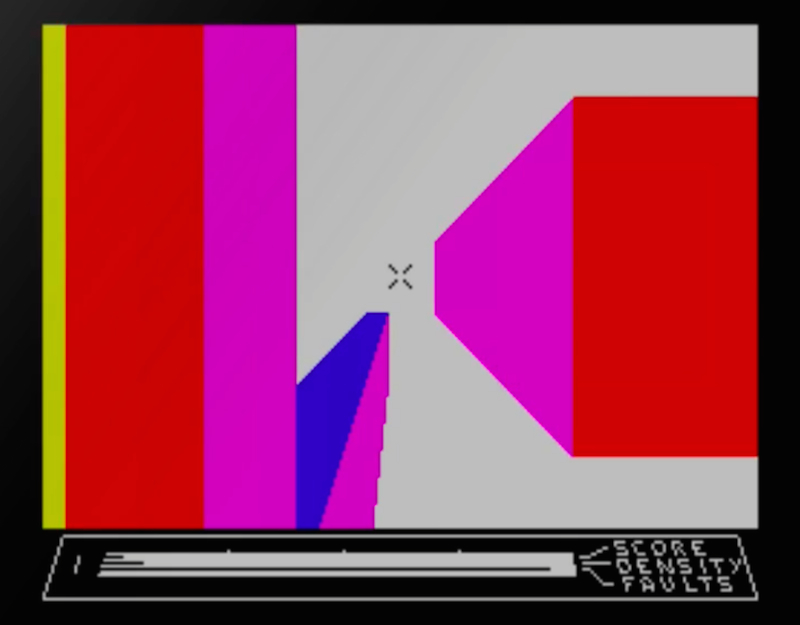

Figure 7.15. glTron.

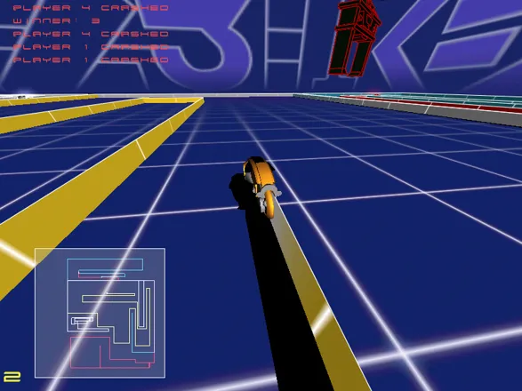

Games that rely on spatial awareness are usually 3D games. The challenge of representing a 3D world on a 2D surface, and the challenge to the player to make sense of that representation form the bulk of the spatial awareness problem. In many cases, the player receives aid in the form of a computer-generated map, but in other cases, such as [Quake III](https://en.wikipedia.org/wiki/Quake_III_Arena), the player is left to his own devices to find his way around the world.

依赖空间感的游戏通常都是三维游戏。在二维平面上表现三维世界的挑战，以及玩家如何理解这种表现形式的挑战，构成了空间感知问题的主要内容。在许多情况下，玩家会得到计算机生成的地图的帮助，但在其他情况下，例如在[《雷神之锤三》](https://en.wikipedia.org/wiki/Quake_III_Arena)中，玩家只能靠自己在世界中寻找方向。

The types of games that usually rely heavily on spatial-awareness challenges are flight simulators, space-flying games, and 3D combat games (particularly [Quake III](https://en.wikipedia.org/wiki/Quake_III_Arena) and [Unreal Tournament](https://en.wikipedia.org/wiki/Unreal_Tournament)). To a lesser extent, 2D games that involve large playing areas, such as Age of Kings, also use spatial-awareness challenges.

飞行模拟器、太空飞行游戏和 3D 战斗游戏（尤其是[《雷神之锤三》](https://en.wikipedia.org/wiki/Quake_III_Arena)和[《虚幻竞技场》](https://en.wikipedia.org/wiki/Unreal_Tournament)）通常是非常依赖空间感知挑战的游戏类型。在较小程度上，涉及较大游戏区域的 2D 游戏（如《王者世纪》）也使用空间感知挑战。

### Coordination Challenges 协调挑战

Pretty much any game uses coordination challenges. Coordination challenges basically test the ability of the player to perform many simultaneous actions. They are almost always found in combination with reflex/reaction time challenges and are usually tightly coupled with them.

几乎所有游戏都会使用协调挑战。协调性挑战主要测试玩家同时执行多个动作的能力。协调挑战几乎总是与反射/反应时间挑战结合在一起，而且通常与它们紧密相连。

In its pure form, a coordination challenge is not dependent on any time constraints, but it isn't often found in the pure form. An example of a game (and there are many) that uses the coordination challenge to good effect (in combination with reflex/reaction time challenges) is Super Mario. Here, the player is expected to finely time jumps across wide chasms while avoiding circling enemies, requiring a plethora of accurately timed button presses from the player.

在纯粹的形式下，协调挑战不依赖于任何时间限制，但这种纯粹的形式并不常见。《超级马里奥》就是一个很好地利用了协调性挑战（与反射/反应时间挑战相结合）的游戏（这样的游戏有很多）。在这款游戏中，玩家需要在避开盘旋的敌人的同时，把控时机，精准地跳过宽阔的深坑，这就要求玩家准确按下大量的按钮。

Shooting games of various sorts pose a challenge of accuracy: lining up a shot at a target, when the player or the target or both might be moving. Steering also requires accuracy. Flight simulators that properly model the behavior of aircraft, or racing simulators that accurately model the behavior of racing cars, require a high degree of precision. Airplanes, in particular, usually respond rather slowly to their controls. A player expecting an instant response will tend to overcompensate, pushing farther and farther forward on the joystick when the plane's nose doesn't drop right away, and then yanking it back in panic when it finally drops much farther than he intended in the first place.

各种射击游戏都对准确性提出了挑战：当玩家或目标或两者都在移动时，如何瞄准目标射击。转向也需要准确性。能够正确模拟飞机行为的飞行模拟器，或者能够准确模拟赛车行为的赛车模拟器，都需要很高的精确度。尤其是飞机，通常对控制的反应相当缓慢。如果玩家希望飞机能立即做出反应，就会过度补偿，当飞机机头没有立即下降时，就会将操纵杆向前推得越来越远；当飞机机头最终下降得比他一开始打算下降的距离还要远时，就会惊慌失措地将操纵杆向后拉。

Some games are forgiving about precision, allowing the player to be sloppy; others demand a delicate touch. Back before racing cars had airfoils to help hold them on the pavement, they flipped over very easily and required a much higher degree of skill from their drivers to keep them on the road. Papyrus Design Group accurately modeled this challenge in the game Grand Prix Legends.

有些游戏对精确度要求不高，允许玩家马马虎虎；而有些游戏则要求精细的操作。在赛车还没有气翼帮助它们紧贴路面之前，它们很容易翻车，需要驾驶员具备更高的技能才能让它们保持在道路上。莎草纸设计集团在游戏《GP赛车传奇》中准确地模拟了这一挑战。

Timing is the ability to overcome an obstacle by coordinating player moves with something else that is happening onscreen. Many video games present a weakness in an opponent's defenses for a limited period of time that, with practice, a player can learn to anticipate. Ducking under a constantly rotating hazard, for example, involves timing. Running and jumping across a chasm by pressing the Jump button at the last second is also an example of timing. It's related to reaction time, but instead of trying to do something as fast as possible, the player is trying to do something at exactly the right moment.

时机把握是指通过协调玩家的动作和屏幕上发生的其他事情来克服障碍的能力。许多电子游戏都会在有限的时间内展示对手的防御弱点，通过练习，玩家可以学会预测对手的弱点。例如，躲避不断旋转的危险就需要把握时机。在最后一秒按下“跳跃”键助跑跨越深坑也是时机把握的一个例子。它与反应时间有关，但玩家并不是要尽可能快地做某事，而是要在正确的时刻做某事。

Many fighting games require complex sequences of joystick moves and button presses that, once mastered, will allow a "special move"—a particularly devastating attack, for example. These take a long time to learn and require very good motor coordination to achieve consistently. This sort of challenge is best suited to a player who can tolerate a high degree of frustration, or to a game that gives ample reward for this kind of persistence. Games that rely heavily on such techniques are difficult to balance. It is difficult to balance games that are based purely on physical dexterity. What one player might find easy, a different player might find impossible.

许多格斗游戏需要复杂的操纵杆动作和按键序列，一旦掌握，就能使出“特殊招式”——例如特别具有破坏力的攻击。这些动作需要很长时间才能学会，而且需要很好的动作协调才能持续完成。这种挑战最适合能够承受高挫折感的玩家，或者是对这种坚持给予充分奖励的游戏。严重依赖这种技巧的游戏很难取得平衡。纯粹依靠身体灵活性的游戏很难取得平衡。一个玩家觉得容易的事情，另一个玩家可能会觉得不可能。

### Reflex/Reaction Time Challenges 反射/反应时间挑战

Reflex/reaction time challenges test the timing abilities of the player. The simplest example of a reaction time challenge (which we previously mentioned) is the children's card game Snap.

反射/反应时间挑战考验玩家的把控时机的能力。反应时间挑战最简单的例子（我们之前提到过）就是儿童纸牌游戏《捉对儿》。

However, reflex/reaction time challenges are usually not used in isolation in games and are often found in combination with coordination challenges. The types of games that most commonly exhibit this type of challenge are platform games, fast shoot 'em-ups, first-person shooters, and pure arcade games such as Tetris and Centipede.

不过，反射/反应时间挑战通常不会单独用于游戏中，而是经常与协调挑战结合在一起。最常见展现这种挑战类型的游戏是平台游戏、快速射击游戏、第一人称射击游戏以及《俄罗斯方块》和《大蜈蚣》这样的纯粹街机游戏。

This type of challenge is a factor of most action games. Only turn-based games, adventures, and role-playing games tend not to rely on reflex/reaction time challenges.

这类挑战是大多数动作游戏的一个因素。只有回合制游戏、冒险游戏和角色扮演游戏往往不依赖反射/反应时间挑战。

In an action game, the speed at which you operate the controls often maps directly to the speed at which your avatar reacts. This is not always exactly true because your avatar might be displayed by animations that require a certain length of time to execute, but in general, the faster a player can move and the better his reaction time is, the greater advantage he has. Good speed and reaction time are particularly valuable in fighting games.

在动作游戏中，你操作控制器的速度往往直接对应化身的反应速度。这并不总是完全准确，因为化身可能会通过需要一定时间执行的动画来显示，但一般来说，玩家移动得越快，反应速度越快，他的优势就越大。良好的速度和反应时间在格斗游戏中尤为重要

### Physical Challenges 体力挑战

Physical challenges are extremely rare in games. The input methods available for computer games do not lend themselves to physical activity—at least, not without the purchase of specialized hardware.

体力挑战在游戏中极为罕见。电脑游戏的输入方法并不适合体力活动——至少在不购买专门硬件的情况下是如此。

Games such as [Samba De Amigo](https://en.wikipedia.org/wiki/Samba_de_Amigo) and [Dance Dance Revolution](https://en.wikipedia.org/wiki/Dance_Dance_Revolution) provide custom controller hardware, such as a special dance pad that enables the player to control the game by dancing on the pad. Others, such as [Konami](https://en.wikipedia.org/wiki/Konami)'s [Hypersport](https://en.wikipedia.org/wiki/Hyper_Sports), don't use specialized hardware, relying on a standard joystick and, consequently, focusing the physical challenge to the hand and lower arm of the player.

[《欢乐桑巴》](https://en.wikipedia.org/wiki/Samba_de_Amigo)和[《劲舞革命》](https://en.wikipedia.org/wiki/Dance_Dance_Revolution)等游戏提供了定制的控制器硬件，例如一个特殊的跳舞毯，玩家可以通过在垫子上跳舞来控制游戏。还有一些游戏，如[科乐美](https://en.wikipedia.org/wiki/Konami)公司的[《超级运动会》](https://en.wikipedia.org/wiki/Hyper_Sports)，则不使用专门的硬件，而是使用标准的操纵杆，因此，将体力挑战集中在玩家的手和前臂上。

Physical challenges are not often found in their pure form, and because of the expense and difficulty of including them in games, they are not often found at all.

纯粹的体力挑战并不多见，而且由于在游戏中加入体力挑战的成本和难度，体力挑战也并不常见。

## Applied Challenges 应用挑战

You will recall from [Chapter 2](/part-1/chapter-2.md) that gameplay consists of the challenges the player faces, plus the actions she can take to overcome them. As we said previously, designing the gameplay is one of your most important design tasks. To some extent, the nature of the challenge suggests the nature of the player's response. The best games, however, allow the player to think creatively and use unconventional actions to meet the challenges.

大家应该还记得，在[第二章](/part-1/chapter-2.md)中，游戏玩法包括玩家所面临的挑战，以及玩家为克服这些挑战所能采取的行动。正如我们之前所说，设计游戏玩法是最重要的设计任务之一。在某种程度上，挑战的性质决定了玩家反应的性质。然而，最好的游戏能让玩家发挥创造性思维，使用非常规的操作来应对挑战。

At the concept stage, you don't have to define precisely what challenges the player will face, but it's good to have an idea of what kinds of challenges you want in the game. Applied challenges are the application and use of the pure challenge forms we have discussed thus far. An applied challenge is a combination of one or more pure challenge forms applied to a given gameplay situation or style.

在概念阶段，你不必精确定义玩家将面临哪些挑战，但最好对你想在游戏中包含哪些类型的挑战有个大致的想法。应用挑战是我们迄今为止讨论过的纯粹挑战形式的应用和使用。应用挑战是一种或多种纯挑战形式的组合，应用于特定的游戏玩法场景或风格。

### Races 竞赛

A race is an attempt to accomplish something before someone else does. It doesn't have to be a physical race through space; it can also be a race to construct something, to accumulate something, or to do practically anything else. Normally we think of races as peaceful, involving competition without conflict, but, of course, they can be combined with conflict as well. Because races put time pressure on the player, they discourage careful strategic thought and instead encourage direct, brute-force solutions. If the player has only 15 seconds to get through a host of enemies and disarm a bomb, he's not going to pick them off one by one with sniping shots; he's going to mow them down and charge through the gap, even if it means taking a lot of damage.

竞赛是在别人之前完成某事的尝试。它不一定是通过空间的体力竞赛，也可以是建造、积累或做其他任何事情的竞赛。通常我们认为竞赛是和平的，是没有冲突的竞争，但当然也可以与冲突相结合。由于竞赛会给玩家带来时间压力，因此不鼓励玩家进行缜密的战略思考，而是鼓励玩家直接、粗暴地解决问题。如果玩家只有 15 秒钟的时间穿过一大堆敌人并拆除炸弹，他就不会用狙击枪一个一个地把他们干掉，而是会把他们撂倒，然后冲过缺口，即使这意味着要承受很大的伤害。

### Puzzles 谜题

Far too many kinds of puzzles exist to list here, but a puzzle is primarily a mental challenge. Often a puzzle is presented as a sort of lock that, when solved, opens another part of the game. The player is presented with a series of objects—often objects that are related in ways that are not directly obvious—and he must manipulate them into a certain configuration to solve the puzzle. To solve the puzzle, it's necessary to understand the relationship among the objects, usually by trial and error and close observation.

谜题的种类繁多，这里就不一一列举了，但谜题主要是一种智力挑战。谜题通常以一种锁的形式出现，解开后就会打开游戏的另一部分。玩家会看到一系列物体——通常这些物体之间的关联并不明显——他必须将这些物体摆弄成特定的形状才能解开谜题。要解开谜题，就必须了解这些物体之间的关系，通常是通过尝试与错误和仔细观察。

Players normally get all the time they need to solve puzzles. Because different people have differing amounts of brainpower, requiring that a puzzle be solved within a time limit might make the game impossible for some players.

玩家通常有足够的时间来解谜。由于不同的人脑力不同，要求在限定时间内解开谜题可能会使某些玩家无法完成游戏。

A few games offer puzzles whose correct solution is not made clear at the outset. The player not only has to understand how the puzzle works, but also has to guess at the solution she is trying to achieve. We consider this a case of bad game design: It forces the player to solve the puzzle by trial and error alone because there's no way to tell when she's on the right track. [Infidel](https://en.wikipedia.org/wiki/Infidel_(video_game)) was one such game. In the final puzzle at the end of the game, to open a stone sarcophagus, the player had to find 1 of 24 possible combinations of objects. There were no hints about which combination was correct; the player simply had to try them all.

有几款游戏的谜题一开始就没有明确的正确答案。玩家不仅要了解谜题的工作原理，还要猜测自己想要得到的谜底。我们认为这是一种糟糕的游戏设计：它迫使玩家只能通过试错来解决谜题，因为玩家根本无法判断自己是否走在正确的道路上。[《异教徒》](https://en.wikipedia.org/wiki/Infidel_(video_game))就是这样一款游戏。在游戏结尾的最后一个谜题中，要打开石棺，玩家必须从 24 种可能的物体组合中找出一种。游戏中没有提示哪种组合是正确的，玩家只能尝试所有的组合。

### Exploration 探索

Exploration is a key element of many games and is often its own reward. Players enjoy moving into new areas and seeing new things, but exploration cannot be free of challenge or it will just become "sightseeing." Sightseers can exhaust the entertainment of your game in such a short time that they won't perceive the value in the game; it will fail to entertain them for long. To prevent this, we design obstacles that make the players work for their freedom to explore.

探索是许多游戏的关键要素，通常也是游戏本身的奖励。玩家喜欢进入新的区域，看到新的事物，但探索不能没有挑战性，否则就会变成“观光”。观光者会在很短的时间内耗尽游戏的娱乐性，以至于他们无法感知游戏的价值；游戏也无法长久地娱乐他们。为了避免这种情况，我们要设计一些障碍，让玩家为自由探索而努力。

The simplest sort of obstacle to exploration is the locked door. We don't literally mean a door with a lock in it, but any device that prevents the player from going on until he has done something to unlock it. You can require the player to do an infinite number of things: find a key elsewhere and bring it to the door; find and manipulate a hidden control (usually unmarked) that opens the door; solve a puzzle that is built into the door; discover a magic word; defeat the doorkeeper in a test of skill, either physical or mental; and so on. The trick is to make the challenge interesting and fresh.

最简单的探索障碍就是上锁的门。我们指的并不是字面上的带锁的门，而是指任何阻止玩家继续探索的装置，直到玩家做了某些事情将其解锁。你可以要求玩家做无限多的事情：在其他地方找到一把钥匙并把它带到门前；找到并操纵一个隐藏的控制装置（通常没有标记）来打开门；解开门上的谜题；发现一个魔法词；在体力或脑力的技能测试中打败守门人等等。诀窍在于让挑战变得有趣而新鲜。

Another common obstacle is the trap. A trap is a device that somehow harms the player's avatar when triggered—possibly killing her or causing damage—and, in any case, discouraging her from coming that way or using that move again. A trap is like a locked door with higher stakes: It poses an actual threat to the player. Traps can take a variety of forms:

另一个常见的障碍是陷阱。陷阱是一种装置，一旦触发就会对玩家的化身有害——可能会杀死她，也可能会造成伤害——无论如何，都会让她不敢再走那条路或使用那个动作。陷阱就像一扇上了锁的门，具有更高的风险：它对玩家构成实际威胁。陷阱的形式多种多样：

* Some fire off once and then are harmless.\
有些发射一次后就不会再造成危害。

* Others fire but require a certain recycle time before they can fire again.\
还有一些虽能发射，但需要一定的回收时间才能再次发射。

* Still others respond to particular conditions but not to others, like a metal detector at an airport.\
还有一些对特定条件有反应，但对其他条件没有反应，比如机场的金属探测器。

A player might simply withstand some traps if they don't do too much damage; other traps can be disarmed or circumvented in some way. If a player has no way of detecting a trap and can find it only by falling into it, it's really just the designer's way of slowing the player down. It's not much fun for the player. For players, the real fun comes in outwitting traps: finding and disabling them without getting caught in them. This gives players a pleasurable feeling of having outfoxed you, the designer, even as you were trying to outfox them.

如果一些陷阱不会对玩家造成太大伤害，玩家就可以简单地承受它们；而另一些陷阱则可以通过某种方式解除或规避。如果玩家无法发现陷阱，只能通过掉入陷阱来找到它，这实际上只是设计者拖慢玩家速度的一种方式。这对玩家来说并没有什么乐趣。对玩家来说，真正的乐趣在于智取陷阱：在不陷入陷阱的情况下找到并解除陷阱。这让玩家有一种愉悦的感觉，即他们智胜了你——设计师，即使当你试图智胜他们。

Yet another example is the maze. A maze is an area where every place looks alike, or mostly alike, and the player has to discover how the places are related to get out, usually by wandering around. Good mazes are implemented as a sort of puzzle, in which the player can deduce the organization of the maze from clues found in the rooms. Poor mazes simply put the player in an area and let her find the way out by trial and error.

另一个例子是迷宫。迷宫是指每个地方看起来都差不多，或者大部分都差不多的区域，玩家必须发现这些地方之间的联系，通常是通过四处游荡才能走出迷宫。好的迷宫是一种谜题，玩家可以根据房间里的线索推断出迷宫的组织结构。差劲的迷宫只是把玩家放在一个区域内，让她通过尝试与错误找到出路。

Illogical spaces are a variant on the maze theme. In old text adventure games, it was not uncommon that going north from area A took you to area B, but going south from area B did not take you back to area A. The relationships among the spaces were illogical. This challenge requires the player to keep a map, because he can't rely on his common sense to learn his way around. In modern games with 3D engines, illogical spaces are more difficult to implement than they were in text adventures. Illogical spaces are now considered an outdated technique, but they still crop up from time to time. If you're going to use them, do so sparingly, and only in places where there's an explanation for it: "Beware! There is a rip in the fabric of space-time!" or some similar excuse—although preferably more original than this one.

不合逻辑空间是迷宫主题的一种变体。在以前的文字冒险游戏中，从 A 区向北走能到达 B 区，但从 B 区向南走却回不到 A 区的情况并不少见。空间之间的关系毫无逻辑可言。这种挑战要求玩家保存地图，因为他不能依靠常识来了解周围的情况。在使用 3D 引擎的现代游戏中，不合逻辑的空间比在文字冒险游戏中更难实现。现在，不合逻辑空间已被认为是一种过时的技术，但它们仍不时出现。如果要使用它们，请尽量少用，而且只在有解释的地方使用：“当心！时空结构出现裂缝！"或类似的借口，但最好比这个更新颖。

Teleporters are the modern equivalent of illogical spaces. A teleporter is any mechanism that suddenly transports the player from where she is to someplace else. Teleporters are often hidden, which means that players trying to explore an area get caught in them and moved elsewhere without warning. If there are many hidden teleporters in an area, they can make it very difficult to explore. Teleporters can further complicate matters by not always working the same way, teleporting the player to one place the first time they are used, but to somewhere else the second time, and so on. They can also be one-way or two-way, teleporting players somewhere with no way to get back, or allowing them to teleport back again.

传送器相当于现代的非逻辑空间。传送器是指任何能将玩家从其所在位置突然传送到其他地方的装置。传送器通常都是隐藏的，这意味着玩家在试图探索某个区域时会被传送器卷入其中，并在毫无征兆的情况下被传送到其他地方。如果一个区域有很多隐藏的传送器，探索起来就会非常困难。传送器的工作方式并不总是相同，第一次使用时会将玩家传送到一个地方，但第二次使用时又会传送到另一个地方，以此类推，从而使问题变得更加复杂。传送器还可以是单向或双向的，前者将玩家传送到某个地方而无法返回，前者允许他们再次传送回来。

### Conflict 冲突

Conflict is a central element of a great many games because it seems almost inherent in the notion of winning and losing. To win a game, you have to beat the other players. The question is how you beat them. If you beat them by attacking them directly in some way, the game is about conflict. This doesn't necessarily mean combat or violence; checkers is a completely bloodless game, but it's still about conflict.

冲突是许多游戏的核心要素，因为它几乎是输赢概念的固有组成部分。要赢得游戏，你必须打败其他玩家。问题在于你如何打败他们。如果你通过某种方式直接攻击他们来打败他们，那么游戏就是关于冲突的。这并不一定意味着战斗或暴力；跳棋是一种完全不流血的游戏，但它仍然与冲突有关。

The challenges associated with conflict depend on the following:

与冲突相关的挑战取决于以下几点：

The scale of the action (from individuals to whole armies)

行动的规模（从个人到整个军队）

The speed at which the conflict takes place (from turn-based, allowing all the time you want, to frenetic activity)

冲突发生的速度（从回合制，让你有充足的时间，到快节奏的激烈活动）

The complexity of the victory conditions (from simple survival to complex missions with goals and subgoals)

获胜条件的复杂程度（从简单的生存到带有目标和次级目标的复杂任务）

Strategy is the mental act of planning: taking advantage of your situation and resources, anticipating your opponent's moves, knowing and minimizing your weaknesses. A strategic challenge is one in which the player must look carefully at the game and devise a plan of action. In a strategic game, the player's chance of winning depends greatly on the quality of her plan. Chance (luck) and missing information interfere with strategy. Chess is the classic strategy game because it contains no element of chance and offers complete information to both players. Nine Men's Morris and Tic-Tac-Toe are also pure, if simple, strategy games. Backgammon is a game with some strategy, but it also depends a great deal on luck.

策略是一种有计划的智力活动：利用自己的情况和资源，预测对手的行动，了解并尽量减少自己的弱点。在策略挑战中，棋手必须仔细观察游戏并制定行动计划。在战略游戏中，玩家的胜算很大程度上取决于计划的质量。机会（运气）和信息缺失会干扰策略。国际象棋是经典的策略游戏，因为它不包含任何偶然因素，而且能为双方提供完整的信息。直棋和井字棋也是纯粹的策略游戏，虽然很简单。双陆棋是一种具有一定策略性的游戏，但也在很大程度上取决于运气。

Pure strategy games favor the player with a certain type of talent, and they appeal most to the kinds of people who have that talent. Because computer games are usually aimed at a broader audience, relatively few offer pure strategy games. They tend to include elements of chance and missing information as well.

纯策略游戏偏爱具有某种天赋的玩家，并且最吸引具备这种天赋的人。由于电脑游戏通常面向更广泛的受众，所以相对较少提供纯策略游戏。它们倾向于包含偶然性和信息缺失等元素。

Tactics involve putting a plan into execution, the process of accomplishing the goals that strategy calls for. Tactics are also about responding to unexpected events or conditions, which can include new information or bad luck. Even chess has tactics: The unknown quantity is your opponent, and she might make moves that you did not anticipate. Responding to them requires tactical skill.

战术涉及将计划付诸实施，即实现战略要求的目标的过程。战术还涉及对突发事件或情况做出反应，其中可能包括新信息或坏运。即使是国际象棋也有战术：对手是一个未知数，她可能会下出你没有预料到的棋步。应对这些情况需要战术技巧。

It's possible to design a purely tactical game with no strategy. A small-squad combat game in which the soldiers are always moving into unknown territory contains no opportunities for strategy—you can't plan if you don't know where you're going or what you're up against—but many for tactics, such as keeping your soldiers covered, taking advantage of their particular skills, and so on.

设计一款没有策略的纯战术游戏是有可能的。在一个小队作战游戏中，士兵们总是要进入未知领域，这就没有机会制定战略——如果你不知道你要去哪里，或者你的对手是什么，你就无法制定计划，但却有很多机会制定战术，比如掩护你的士兵，利用他们的特殊技能等等。

The business of supporting troops in the field and bringing fresh troops to the front lines is called logistics. Most war games don't bother with logistical challenges such as transporting food and fuel to where they're needed. These activities are generally considered boring and distracting from the main purpose of the game, which is combat. Real armies have whole teams of people responsible for logistics and could never win without this support; computer games have only the player to handle everything, so it stands to reason that he should be concentrating on more exciting tasks such as attack and defense.

为战场上的部队提供支持并将生力军送上前线的工作称为后勤。大多数战争游戏都不考虑后勤方面的挑战，例如将食物和燃料运送到需要的地方。这些活动通常被认为是无聊的，会分散玩家对游戏主要目的（即战斗）的注意力。真实的军队有整整一队人负责后勤工作，如果没有这些支持，他们永远不可能取得胜利；而电脑游戏只有玩家一个人处理所有事情，所以按理说，玩家应该专注于攻防等更令人兴奋的任务。

However, modern real-time strategy (RTS) games have introduced one important logistical challenge: weapons production. Unlike board war games, in which the player commonly starts with a fixed number of troops, RTSs now require the player to produce weapons and to research new ones from a limited amount of available raw material. The production facilities themselves must be constructed and then defended. This has changed the entire face of war-gaming, adding a new logistical challenge to what was formerly a purely combat-oriented genre.

然而，现代即时战略（RTS）游戏引入了一个重要的后勤挑战：武器生产。在棋盘战争游戏中，玩家通常从固定数量的部队开始，而现在的实时战略游戏则不同，它要求玩家利用有限的原材料生产武器和研究新武器。生产设施本身也必须被建造并加以防守。这改变了整个战争游戏的面貌，为原本纯粹以战斗为导向的游戏类型增添了新的后勤挑战。

In role-playing games, the limited size of the characters' inventories presents another logistical challenge. The player must frequently decide what to carry and what to leave behind. Equipping and balancing a party of heterogeneous characters with all that they need to face a dangerous adventure occupies a significant amount of the player's time. Of course, sometimes this is the fault of a badly designed inventory system, in which an apple takes up the same amount of space as a single coin.

在角色扮演游戏中，角色背包的容量有限，这带来了另一个后勤挑战。玩家必须经常决定携带什么，留下什么。装备和平衡一个由不同角色组成的团队，让他们拥有面对危险冒险所需的一切，这占据了玩家大量的时间。当然，有时这也是设计糟糕的背包系统造成的，在这个系统中，一个苹果和一枚硬币所占的空间相同。

On a smaller scale, personal conflict, as a one-on-one or one-on-many challenge, is a key feature of many action games. The player controls an avatar who battles directly against one or more opponents, often at very high speeds. The challenge of personal combat is immediate, exciting, and visceral.

在较小的范围内，个人冲突作为一对一或一对多的挑战，是许多动作游戏的主要特点。玩家控制一个化身直接与一个或多个对手作战，通常速度非常快。个人对战的挑战是直接、刺激和直观的。

The fundamental challenge in any game based on conflict is survival. If characters can be removed from the field of play by death or any other means, it is essential to preserve their lives or effective playing time, or you cannot achieve the victory condition. In a few games, survival is itself the victory condition and no other achievements are required, but in most, survival is necessary but not sufficient to win.

任何基于冲突的游戏的基本挑战都是生存。如果游戏中的角色可以通过死亡或其他方式离开游戏场地，那么就必须保住他们的生命或有效游戏时间，否则就无法达成胜利条件。在少数游戏中，生存本身就是胜利条件，不需要其他成就，但在大多数游戏中，生存是获胜的必要条件，但不是充分条件。

Survival is about defending one's self, but many games require that the player defend other things as well, especially things that cannot defend themselves. In chess, this is, of course, the king. This challenge requires that the player know not only the capabilities and vulnerabilities of his units, but also those of the thing he is protecting. He must be prepared to sacrifice valuable units to protect the vital item. [Lemmings](https://en.wikipedia.org/wiki/Lemmings_(video_game)) was an excellent game about sacrificing some units to preserve others.

生存是为了保护自己，但许多游戏也要求玩家保护其他事物，尤其是无法保护自己的事物。在国际象棋中，这当然就是国王。这一挑战要求玩家不仅要知道自己单位的能力和弱点，还要知道他要保护的事物的能力和弱点。他必须做好牺牲宝贵单位来保护重要物品的准备。[《旅鼠》](https://en.wikipedia.org/wiki/Lemmings_(video_game))就是一款以牺牲某些单位来保护其他单位的优秀游戏。

Another important gaming challenge, first used extensively in [Thief: The Dark Project](https://en.wikipedia.org/wiki/Thief:_The_Dark_Project), is stealth—the ability to move undetected. This is an extremely valuable capacity in almost any kind of conflict, especially if the player is the underdog. War games occasionally pose challenges in which the victory condition cannot be achieved through combat but must be achieved through stealth. [Thief](https://en.wikipedia.org/wiki/Thief:_The_Dark_Project) was designed entirely around this premise. Players had to achieve their missions by stealth as much as possible and had to avoid discovery or combat if they could.

另一项重要的游戏挑战是潜行——在不被发现的情况下移动的能力，[《神偷：暗黑计划》](https://en.wikipedia.org/wiki/Thief:_The_Dark_Project)中首次广泛使用的是隐身术——不被察觉的行动能力。这在几乎所有冲突中都是一种极其宝贵的能力，尤其是当玩家处于劣势时。战争游戏偶尔会提出一些挑战，其中的胜利条件不能通过战斗来实现，而必须通过潜行来实现。[《神偷》](https://en.wikipedia.org/wiki/Thief:_The_Dark_Project)就是完全围绕这一前提设计的。玩家必须尽可能通过潜行的方式完成任务，并尽可能避免被发现或战斗。

The element of stealth introduces considerable complexity into the design and gameplay of war games. The simplest war games are traditionally games of "perfect information," in which both players know everything about one another. Imagine how difficult chess would be if there were an invisible piece somewhere on the board that could be discovered only by accident.

潜行元素给战争游戏的设计和玩法带来了相当大的复杂性。最简单的战争游戏传统上是“完全信息”游戏，在这种游戏中，双方都对彼此了如指掌。想象一下，如果棋盘上的某个地方有一个隐形棋子，只有在意外情况下才能被发现，那么国际象棋将会变得多么困难。

### Economies 经济

An economy is a system in which resources move around, either physically from place to place, or conceptually from owner to owner. This doesn't necessarily mean money; any sort of resource that can be created, moved, stored, earned, exchanged, or destroyed can be involved. Most games contain an economy of some sort. Even a first-person shooter has a simple economy: Ammunition is obtained by finding it or taking it from dead opponents, and it is consumed by firing your weapons. Health points are consumed by being hit and are restored by medical kits. The designer can make the game easier or harder by adjusting the amounts of ammunition and medical kits available, and a player who is running short must meet the challenge of obtaining more somehow.

经济是一个资源流动的系统，在这个系统中，资源可以在物理上从一个地方转移到另一个地方，也可以在概念上从一个所有者转移到另一个所有者。这并不一定意味着金钱；任何一种可以创造、移动、储存、赚取、交换或销毁的资源都可能涉及其中。大多数游戏都包含某种经济。即使是第一人称射击游戏也有一个简单的经济系统：弹药可以通过寻找或从死去的对手身上夺取来获得，并通过开火来消耗。被击中会消耗体力值，医疗包可以恢复体力值。设计师可以通过调整弹药和医疗包的数量使游戏变得更容易或更困难，而物资短缺的玩家必须以某种方式迎接获得更多物资的挑战。

Economic challenges are defined in terms of the flow of resources. Some games, such as [Theme Park](https://en.wikipedia.org/wiki/Theme_Park_(video_game)), consist only of economic challenges; others, such as first-person shooters, combine both economic and conflict challenges.

经济挑战是指资源流动方面的挑战。有些游戏（如[《主题公园》](https://en.wikipedia.org/wiki/Theme_Park_(video_game))）只包含经济挑战；有些游戏（如第一人称射击游戏）则同时包含经济挑战和冲突挑战。

In many games, the challenge is simply to accumulate something: wealth, points, or anything else of intrinsic value. The object of the game might be to accumulate more money, plutonium, or widgets than your opponents. This is the basis of [Monopoly](https://en.wikipedia.org/wiki/Monopoly_(game)), of course, and many other games. The game challenges the player to understand the mechanisms by which wealth is created and to optimize them to his own advantage. In the case of [Monopoly](https://en.wikipedia.org/wiki/Monopoly_(game)), it's helpful to mortgage low-rent properties and use the cash to purchase high-rent ones because high-rent properties are the real source of wealth toward the end of the game. Players who understand this are at an advantage over those who don't.

在许多游戏中，挑战仅仅是积累一些东西：财富、积分或其他任何有内在价值的东西。游戏的目标可能是积累比对手更多的金钱、钚或小部件。这当然是[《大富翁》](https://en.wikipedia.org/wiki/Monopoly_(game))和许多其他游戏的基础。游戏挑战玩家了解创造财富的机制，并将其优化为自己的优势。在[《大富翁》](https://en.wikipedia.org/wiki/Monopoly_(game))游戏中，抵押低租金的房产并用现金购买高租金的房产是很有帮助的，因为高租金的房产才是游戏结束时财富的真正来源。了解这一点的玩家比不了解这一点的玩家更有优势。

Requiring your players to achieve balance in an economy gives them a more interesting challenge than simply accumulating points, especially if you give them many different kinds of resources to manage. [The Settlers](https://en.wikipedia.org/wiki/The_Settlers) is a series of games involving complex interactions among resources: Wheat goes to the mill to become flour, which goes to the bakery to become bread. Bread feeds miners who dig coal and iron ore, which goes to the smelter to become iron bars, which then go to the blacksmith to become weapons, and so on. All of these resources have to be produced and transported to establish a balanced economy. Produce too little of a vital item, and the whole economy grinds to a halt; produce too much, and it piles up, taking up space and wasting time and resources that could be better used elsewhere.

要求玩家实现经济平衡会给他们带来比单纯积累分数更有趣的挑战，尤其是如果你给他们提供多种不同的资源来管理的话。[《工人物语》](https://en.wikipedia.org/wiki/The_Settlers)是一系列涉及资源间复杂互动的游戏：小麦到磨坊变成面粉，面粉到面包店变成面包。面包养活了挖煤和铁矿石的矿工，煤和铁矿石到冶炼厂变成铁条，铁条再到铁匠那里变成武器，等等。必须生产和运输所有这些资源，才能建立平衡的经济。重要物品生产太少，整个经济就会停滞不前；生产太多，就会堆积如山，占用空间，浪费时间和资源，而这些资源本可以更好地用于其他方面。

A peculiar sort of economic challenge involves looking after a person or creature, or a small number of them, as in [The Sims](https://en.wikipedia.org/wiki/The_Sims) and [Creatures](https://en.wikipedia.org/wiki/Creatures_(video_game_series)). Unlike a large-scale simulation such as [Caesar](https://en.wikipedia.org/wiki/Caesar_(video_game)), in which the player must build and manage an entire town, these smaller-scale simulations focus on individuals. The player must meet the needs of each individual and take into account the unique characteristics that differentiate each one from other individuals. The challenge is to make sure their needs are met and perhaps to improve their growth in various ways. The creatures often behave unpredictably, which adds both to the challenge and to the charm.

[《模拟人生》](https://en.wikipedia.org/wiki/The_Sims)和[《生物》](https://en.wikipedia.org/wiki/Creatures_(video_game_series))中有一种特殊的经济挑战，涉及到照顾一个人或生物，或一小部分人或生物。在[《凯撒》](https://en.wikipedia.org/wiki/Caesar_(video_game))等大型模拟游戏中，玩家必须建设和管理整个城镇，而这些小型模拟游戏则不同，它们的重点是个人。玩家必须满足每个人的需求，并考虑到每个人不同于其他个体的独特特征。挑战在于确保满足他们的需求，或许还能通过各种方式改善他们的成长。这些生物的行为往往难以预测，这既增加了挑战性，也增添了魅力。

### Conceptual Challenges 概念挑战

Conceptual challenges are those that require the player to understand something new. To the game designer, conceptual challenges are the richest and most interesting to design because they offer the broadest scope for innovation. They can also be difficult to design and even more difficult to program. Conceptual challenges often occur in construction and management simulations, in which the game is simulating processes that the player must come to understand. In [Sim City](https://en.wikipedia.org/wiki/SimCity), for example, there is a direct relationship between an efficient transportation system and economic prosperity. The player who does not deduce this will have difficulty with the game. Sim City challenges the player to comprehend this and many other relationships involved in town planning.

概念挑战是那些要求玩家理解新事物的挑战。对游戏设计者来说，概念性挑战是最丰富、最有趣的设计，因为它们提供了最广阔的创新空间。但它们也很难设计，更难编程。概念性挑战通常出现在建筑和管理模拟游戏中，游戏模拟的是玩家必须了解的过程。例如，在[《模拟城市》](https://en.wikipedia.org/wiki/SimCity)中，高效的交通系统与经济繁荣有着直接的关系。不了解这一点的玩家在游戏中会遇到困难。[《模拟城市》](https://en.wikipedia.org/wiki/SimCity)要求玩家理解这一点以及城市规划中涉及的许多其他关系。

Another sort of conceptual challenge occurs in mystery or detective games, in which the object is not merely to accomplish certain feats, but also to examine the evidence and deduce who committed the crime and how. The game [Eagle Eye Mysteries](https://en.wikipedia.org/wiki/Eagle_Eye_Mysteries) is an excellent example of this: Players follow clues, ignore red herrings, and arrive at a theory of the crime, assembling the relevant evidence to demonstrate proof. [Planescape: Torment](https://en.wikipedia.org/wiki/Planescape:_Torment) also offered significant conceptual challenges and had several different endings, depending on how the player interpreted a complex and bizarre series of events.

另一种概念上的挑战出现在悬疑或侦探游戏中，在这些游戏中，玩家的目标不仅仅是完成某些壮举，还要检查证据并推断出谁犯了罪以及如何犯罪。游戏[《鹰眼之谜》](https://en.wikipedia.org/wiki/Eagle_Eye_Mysteries)就是一个很好的例子：玩家追踪线索，忽略干扰，得出犯罪理论，并收集相关证据来证明案情。[《异域镇魂曲》](https://en.wikipedia.org/wiki/Planescape:_Torment)也提供了重大的概念挑战，并有几种不同的结局，这取决于玩家如何解释一系列复杂离奇的事件。


译者注：red herrings，红鲱鱼，被用来训练猎犬追踪气味，因为这种鱼的强烈气味可以分散猎犬的注意力。忽略红鲱鱼的意思是，忽略干扰信息。


> **Gameplay Worksheet 游戏性工作表**
> 
> 1. What types of challenges do you want to include in your game? Do you want to challenge the player's physical abilities, his mental abilities, or both?\
> 你想在游戏中加入哪些类型的挑战？你想挑战玩家的体力、脑力，还是两者兼而有之？
> 2. Game genres are defined in part by the nature of the challenges they offer. Have you selected a genre in advance, and if so, what does that imply for the gameplay? Do you intend to include any cross-genre elements, challenges that are not normally found in your chosen genre?\
> 游戏类型在一定程度上是由其所提供的挑战的性质所决定的。你是否事先选定了游戏类型，如果是，这对游戏玩法意味着什么？你是否打算加入你所选类型中通常没有的跨类型元素和挑战？
> 3. Does the game include implicit challenges (those that emerge from the design), as well as explicit challenges (those that you specify)?\
> 游戏是否包括隐性挑战（设计中出现的挑战）和显性挑战（你指定的挑战）？
> 4. If the game has a story, how does the story influence the gameplay, and vice versa? Do they operate in tandem, or are they effectively separate pieces?\
> 如果游戏有故事，故事是如何影响游戏性的，反之亦然？它们是同步进行，还是各自独立？
> 5. If the player has an avatar, how does the gameplay influence the avatar's appearance and capabilities?\
> 如果玩家有一个化身，游戏玩法如何影响化身的外观和能力？
> 6. Is the game's collection of challenges a related group, or is it a compilation of unrelated elements? If the latter, does that have any effect on the player's suspension of disbelief?\
> 游戏中挑战的集合是一组相关联的，还是一系列不相关的元素的汇总？如果是后者，这是否会影响玩家的信任感？
> 7. Given that not all players enjoy the same kinds of challenges, how does the game's target audience influence the challenges it includes? What challenges will you deliberately exclude?\
> 鉴于并非所有玩家都喜欢同类挑战，游戏的目标受众如何影响它所包含的挑战？你会故意排除哪些挑战？
> 8. Will the player be required to face more than one challenge at a time? Which ones?\
> 玩家需要同时面对多个挑战吗？哪些挑战？

# Putting It Together 总结

As we have discussed in this chapter, there is no single aspect of any game that we can point to and identify as the gameplay. That is because gameplay is not a singular entity. It is a combination of many elements, a synergy that emerges from the inclusion of certain factors. If all of those elements are present in the correct proportion and style, we can be fairly sure that the potential for good gameplay is there; consequently, we can presume (but not be certain) that we have a good game. The gameplay emerges from the interaction among these elements, much in the same way as complex automata emerge from the simple rules of [Conway's Game of Life](https://en.wikipedia.org/wiki/Conway%27s_Game_of_Life).

正如我们在本章中所讨论的，任何游戏都没有一个单一的方面可以让我们指出并认定为游戏性。这是因为游戏性并不是一个单一的实体。它是许多元素的组合，是包含某些因素后产生的协同效应。如果所有这些元素都以正确的比例和风格出现，我们就可以相当肯定地认为游戏具有良好玩法的潜力；因此，我们可以推测（但不能肯定）我们拥有一款好游戏。游戏性是从这些元素之间的互动中产生的，就像复杂的自动机是从[“康威生命游戏”](https://en.wikipedia.org/wiki/Conway%27s_Game_of_Life)的简单规则中产生的一样。

There is a particular paradox known as the [Sorites Paradox](https://en.wikipedia.org/wiki/Sorites_paradox) or Heap Paradox. It concerns a pile of sand. An observer is asked whether sand is a pile, and the answer is yes. Then a grain of sand is taken away. The question is repeated, and the answer is still in the affirmative. This process continues, and then at some point, the observer will say that it is no longer a pile. The question then posed is to ask why one grain of sand makes a difference between a pile and a nonpile. Can the observer state a specific number of grains of sand that define a pile? It's back to the familiar "argument of the beard": Why is the observer's definition any better than another observer's definition?

有一个特殊的悖论被称为[“连续体悖论”](https://en.wikipedia.org/wiki/Sorites_paradox)或“堆悖论”。它涉及一堆沙子。观察者被问到沙子是否是一堆，答案是肯定的。然后拿走一粒沙子。重复这个问题，答案仍然是肯定的。这个过程一直持续下去，到了某一时刻，观察者会说这不再是一堆沙子了。接下来的问题是，为什么一粒沙子就能区分成堆和不成堆？观察者能说出界定一堆沙子的具体沙粒数量吗？这又回到了我们熟悉的“胡子论证”：为什么观察者的定义比另一个观察者的定义更好？

The same applies to gameplay, although on a smaller and coarser-grained scale. In a gedanken experiment, we can look at a game and take away an element (or part thereof) of gameplay. (For example, we could disable Mario's ability to turn left in [Mario 64](https://en.wikipedia.org/wiki/Super_Mario_64).) We can then pose the question "Does it still have gameplay?" We can continue to remove elements or sub-elements and pose the same question. At some point, the game will be sufficiently crippled for the observer to say that it no longer has gameplay. This point will be different for every observer. Whose opinion is best? That's a question for the philosophers. In short, we cannot define exactly how many gameplay elements are required to make a game. We cannot even state with certainty which are required and which are superfluous. We can only state that, to have gameplay, we need some or all of these elements; to have a pile of sand, we need some or all of these grains.

同样的道理也适用于游戏性，只不过是在更小和更粗粒度的范围内。在一个思想实验中，我们可以观察一款游戏，然后去掉游戏中的一个元素（或其中的一部分）（例如，我们可以去掉[《马里奥 64》](https://en.wikipedia.org/wiki/Super_Mario_64)中马里奥向左转弯能力）。然后我们可以提出一个问题：“它还具有游戏性吗？“我们可以继续移除元素或子元素，并提出同样的问题。到了某一个点时候，游戏就会被削弱到足以让观察者说它不再具有游戏性的程度。对于每个观察者来说，这个点都是不同的。谁的意见最好？这是一个留给哲学家的问题。简而言之，我们无法准确定义制作一款游戏需要多少游戏性元素。我们甚至无法确定哪些是必需的，哪些是多余的。我们只能说，要有游戏性，我们需要这些元素中的一些或全部；要有一堆沙子，我们需要一些或者全部沙粒。


译者注：gedanken，德语，意思是“思想”。


Much the same way that we can expect to find elements indicating gameplay, we can expect to find opposing elements that indicate the absence of gameplay. By this, we mean that the inclusion of the particular element could be detrimental to the gameplay or, more rarely, that gameplay is not present at all. The game in question might have included all of the elements expected to indicate good gameplay, but it might have also muddied the mix by including extra unwelcome elements that detracted from the positive effects of the good. We have all played games that were almost perfect, apart from one or two annoying flaws: Maybe the difficulty level ramped too quickly, maybe the controls were unwieldy, or maybe the collision detection was slightly suspect. Whatever the cause, it has the overall effect of taking a potentially superb game and knocking it down a peg or two, reducing it to the rank of failed contender. This determines the difference between the excellent and the merely good.

就像我们可以找到表明游戏性的元素一样，我们也可以找到表明游戏性缺失的对立元素。我们的意思是，加入特定元素可能会损害游戏性，或者更罕见的是，游戏性根本不存在。这款游戏可能包含了游戏性良好的所有预期元素，但也可能因为包含了额外的不受欢迎的元素而混淆了游戏性，削弱了良好游戏性的积极效果。我们都玩过一些几乎完美的游戏，除了一两个恼人的缺陷：也许是难度升级太快，也许是操控不便，也许是碰撞检测略有问题。不管是什么原因造成的，它的总体效果都是把一款潜在的优秀游戏降低一两个档次，使其沦为失败的竞争者。这就决定了优秀与一般之间的差别。

It would seem fairly obvious to the game designer that she is including some suspect elements to the gameplay and, therefore, would make efforts to eliminate them from the design. This has happened. A particular case of note is Blizzard Entertainment's [StarCraft](https://en.wikipedia.org/wiki/StarCraft). This game was continually tweaked right up until the point of release, to ensure that the gameplay and unit/unit balance was as good as possible. Even so, they didn't quite get it right, and so the expansion pack, [Brood War](https://en.wikipedia.org/wiki/StarCraft:_Brood_War), made further changes to the unit/unit balance—the most notable being an increase in usefulness of the Terran marine and an overhaul of the air-air and air-ground combat units.

对于游戏设计者来说，很明显她在游戏中加入了一些可疑的元素，因此，她会努力在设计中消除这些元素。这种情况确实发生过。暴雪娱乐公司的[《星际争霸》](https://en.wikipedia.org/wiki/StarCraft)就是一个特别值得注意的案例。这款游戏在发布之前一直在不断调整，以确保游戏性和单位/单位的平衡性尽可能好。即便如此，他们还是没有完全做到位，因此在扩展包[《母巢之战》](https://en.wikipedia.org/wiki/StarCraft:_Brood_War)中对单位/单位的平衡性做了进一步的改动——最显著的改动是增加了人族机枪兵的实用性，并对空空和空地作战单位进行了全面调整。

The presence or absence of these elements of gameplay can often be inferred only by the existence of their indications or contraindications. We examine these in more detail in the genre-specific chapters.

这些游戏元素的存在与否，往往只能通过它们的适应症或禁忌症来推断。我们将在具体流派的章节中更详细地探讨这些问题。