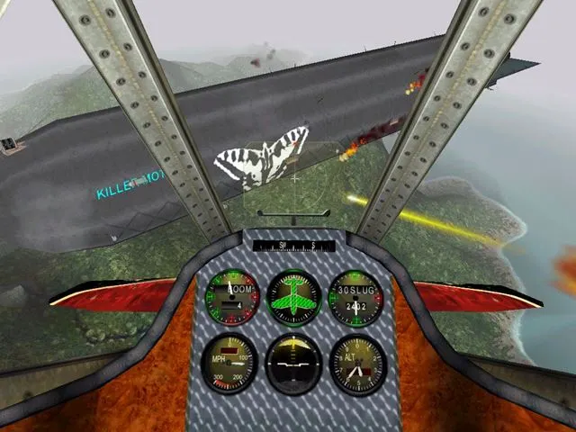
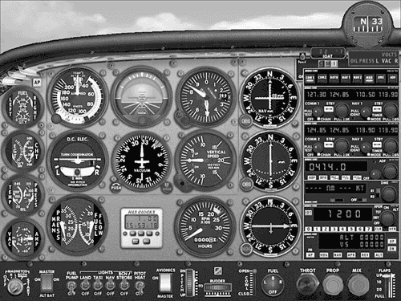
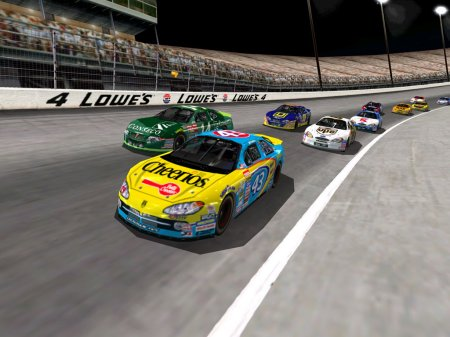
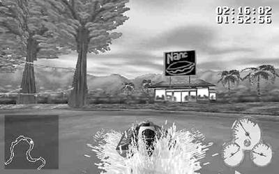
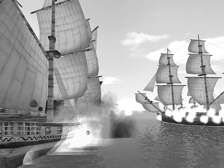
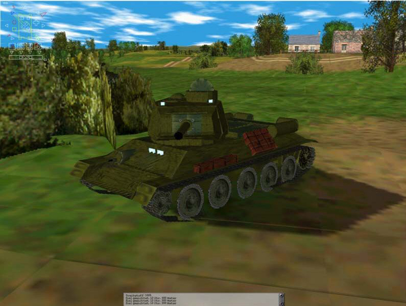
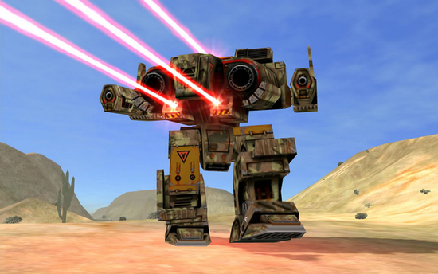

Vehicle simulations try to create the feeling of driving or flying a vehicle, real or imaginary. In simulations of real vehicles, one of the chief goals is verisimilitude, an (apparently!) close relationship to reality. You can expect your players to know a lot about these machines and to want an experience that is at least visually similar to that of really controlling one. The machine's gross performance characteristics (speed and maneuverability) should also be similar to reality, although its finer details probably can't be, for reasons we'll discuss in this chapter.

驾驶模拟游戏试图创造一种驾驶交通工具的感觉，无论是真实的还是想象的。在模拟真实交通工具时，主要目标之一是逼真度，即（显然！）与现实的密切关系。你可以预料，你的玩家会对这些机器有很多了解，并希望获得至少在视觉上与真正控制这些机器相似的体验。机器的总体性能特征（速度和可操作性）也应与现实相似，但由于本章将讨论的原因，机器的更多细节可能无法与现实相似。

If you're designing an imaginary vehicle, you're free to create any kind of driving experience that you like without being restricted by such things as gravity, G-forces, fuel capacity, and so on. Your game really needs to just create the feeling of movement; what limitations you place on that movement are up to you. In this chapter, we concentrate, for the most part, on simulating real vehicles because that's the bigger challenge. Also, because the vast majority of vehicle simulators are flight simulators and driving (usually car-racing) simulators, we devote most of our attention to those. A short section devoted to ships, tanks, and spacecraft is included at the end.

如果你设计的是一辆想象中的交通工具，那么你就可以自由地创造任何你喜欢的驾驶体验，而不必受到重力、G 力、燃料容量等因素的限制。你的游戏其实只需要创造出运动的感觉；至于对运动施加什么限制，则由你自己决定。在本章中，我们将主要集中在模拟真实交通工具上，因为这是更大的挑战。此外，由于绝大多数交通工具模拟器都是飞行模拟器和驾驶（通常是赛车）模拟器，因此我们将大部分精力放在这两类模拟器上。最后还有一小部分专门讨论船舶、坦克和航天器。

# The Common Elements of Vehicle Simulations 驾驶模拟游戏的共同要素

People play with flight simulators for one of two reasons. Either they want to experience the joy of flight in a variety of different aircraft, to see how the planes or helicopters look and perform, or they want to fight in aerial combat. In effect, they want to fly aircraft in either civilian or military roles, and that's how we refer to these roles here.

人们玩飞行模拟器有两个原因。要么是想体验各种不同飞机的飞行乐趣，看看飞机或直升机的外观和性能，要么是想进行空中格斗。实际上，他们想驾驶民用或军用飞机，这就是我们这里所说的这些角色。

Just as flight simulators tend to fall into military or civilian categories, driving simulators tend to fall into organized racing and imaginary racing categories. Organized racing simulators try to reproduce the experience of driving a racing car or motorcycle in an existing racing class: Indycar, NASCAR, Formula 1, and so on. Like sports games, they require a license to use the official name and indicia of the racing organization. Imaginary racing games are just that: games about racing in imaginary situations, driving madly through cities or the countryside or even fantasy environments.

正如飞行模拟器往往分为军用或民用两类一样，驾驶模拟器也往往分为有组织的赛车和想象中的赛车两类。有组织的赛车模拟器试图再现现有赛车类别中驾驶赛车或摩托车的体验：如 Indycar、NASCAR、F1 等。与体育游戏一样，这些游戏需要获得许可才能使用赛车组织的官方名称和标志。想象中的赛车游戏就是：在想象的场景中进行赛车比赛，在城市或乡村甚至幻想的环境中疯狂驾驶。

The vehicle-simulation market is sharply divided between the purists and the casual players. The purists demand highly accurate simulations of real vehicles with all their quirks and limitations. If a purist forgets to retract the flaps after takeoff, he wants those flaps to be damaged by excessive airspeed and to be stuck in the down position, with appropriate consequences for the plane's handling characteristics. The casual players don't care about the details as long as they can fly or drive around fast and (depending on the game) shoot at things.

驾驶模拟游戏的市场主要分为纯粹玩家和休闲玩家。纯粹主义者要求高度精确地模拟真实交通工具的所有怪癖和限制。如果一个纯粹主义者在飞机起飞后忘记收起襟翼，他希望襟翼能因过高的空速而受损，并被卡在向下的位置，从而对飞机的操控特性造成适当的影响。而休闲玩家则不会在意这些细节，只要他们能快速飞行或驾驶，并（根据游戏的不同）向物体射击就可以了。

> **An Extreme Case 一个极端案例**
> 
> The takeoff sequence in the game [Megafortress](https://en.wikipedia.org/wiki/Megafortress) had to be the longest for any consumer-level flight simulator ever made. The game simulated a hypothetical stealth-modified B-52 bomber. This is what you had to do to get the plane off the ground (fortunately, it was already lined up on the runway):
> 
> 游戏[《巨大要塞》](https://en.wikipedia.org/wiki/Megafortress)中的起飞序列是有史以来消费级飞行模拟器中最长的。游戏模拟了一架假想的隐形改装 B-52 轰炸机。你必须这样做才能让飞机起飞（幸运的是，飞机已经在跑道上排列好）：
> 
> 1. Switch on battery power.\
> 打开电池电源。
> 
> 2. Switch on interior lights.\
> 打开内部照明。
> 
> 3. Switch on power to all eight engines.\
> 打开所有八个发动机的电源。
> 
> 4. Fire starter cartridges for all eight engines.\
> 启动所有八个发动机的启动器。
> 
> 5. Switch off battery power after the engines are running.\
> 发动机运转后关闭电池电源。
> 
> 6. Switch on navigation lights.\
> 打开导航灯。
> 
> 7. Switch on landing lights.\
> 打开着陆灯。
> 
> 8. Pressurize the plane to noncombat levels.\
> 将飞机加压至非战斗水平。
> 
> 9. Tune radio to correct frequency (this also served as the game's copy protection).\
> 将无线电调到正确的频率（这也是游戏的复制保护功能）。
> 
> 10. Lower flaps.\
> 放下襟翼。
> 
> 11. Release brakes.\
> 松开刹车。
> 
> 12. Throttle up all eight engines (fortunately, this could be done simultaneously).\
> 调节油门，加速所有八个发动机（幸运的是，这可以同时进行）。
> 
> 13. Pull back on stick. (Plane takes off.)\
> 拉回操纵杆。(飞机起飞）。
> 
> 14. Raise landing gear.\
> 升起起落架。
> 
> 15. Raise flaps.\
> 升起襟翼。

This sequence involved moving back and forth from the pilot's seat to the co-pilot's seat a couple of times, too. Soon after you got into the air, you had to switch all the lights back off to avoid detection by enemy aircraft. If you forgot to pressurize the plane, the crew would complain of being cold. When you entered into combat, you were supposed to lower the air pressure to avoid a violent decompression if the plane was hit.

在这个过程中，还需要从驾驶员座位到副驾驶员座位来回移动几次。升空后不久，你必须把所有的灯都关掉，以免被敌机发现。如果你忘记给飞机加压，机组人员就会抱怨飞机很冷。进入战斗状态后，你应该降低气压，以免飞机被击中时发生剧烈减压。

[Megafortress](https://en.wikipedia.org/wiki/Megafortress) was a techno-geek's dream. It was not, however, a big financial success as flight simulators go.

[《巨大要塞》](https://en.wikipedia.org/wiki/Megafortress)是技术宅的梦想。然而，作为飞行模拟器，它在经济上并不成功。

## The Rules 规则

Some vehicle simulations aren't games at all, in the sense of being a contest or a competition. Their only goal is to let the player experience controlling the vehicle, so they don't have any rules other than the laws of physics. Most vehicle simulations, however, are set in a competitive context, either a race or a battle of some kind.

从竞赛或比赛的意义上讲，有些驾驶模拟游戏根本就不是游戏。它们的唯一目的是让玩家体验控制交通工具的过程，因此除了物理定律之外没有其他规则。然而，大多数驾驶模拟游戏都是在竞争背景下进行的，要么是比赛，要么是某种战斗。

One factor to consider is how you want to handle damage. Lightweight racing sims don't simulate any damage at all; if the car hits something, it simply bounces off, which tends to slow it down. This allows the driver to be much more careless. She can afford to hit a few things and still win the race—at least in the earlier, easier stages of the game. Other games model damage as a single variable, such as hit points in a role-playing game. When damage reaches a certain level, the vehicle simply stops running (which, in the case of an airplane, means that it crashes or explodes).

需要考虑的一个因素是你想如何处理损坏。轻量级赛车模拟根本不会模拟任何损坏；如果汽车撞上了什么东西，它只会弹开，这往往会减慢车速。这使得驾驶员可以更加粗心大意。她可以承受撞到一些东西，但仍能赢得比赛——至少在游戏的较早和较容易的阶段是这样。其他游戏将伤害作为单一变量建模，例如角色扮演游戏中的生命值。当伤害达到一定程度时，交通工具就会停止运行（对于飞机来说，这意味着飞机会坠毁或爆炸）。

Accurate modeling of damage requires dividing the vehicle into areas, determining which area has been damaged by a collision (or, in a military simulator, by enemy fire), and deciding how that damage affects the performance of the vehicle. For instance, a race car with minor damage to the airfoils or body can continue, although with a performance penalty, but a blown tire will force it to halt. With airplanes, the consequences can be dramatically different depending on what has been hit. A plane is still flyable if its tail has been destroyed, but it will be unstable and extremely difficult to handle.

要对损坏进行精确建模，需要将交通工具划分为若干区域，确定哪个区域因碰撞（或在军事模拟器中因敌方炮火）而损坏，并决定损坏对交通工具性能的影响。例如，如果赛车的空气动力学部件或车身受到轻微损坏，虽然会影响性能，但仍可继续行驶，但如果轮胎爆裂，则会被迫停驶。对于飞机来说，不同的撞击造成的后果可能大相径庭。如果飞机尾翼被毁，飞机仍然可以飞行，但会变得不稳定，而且极难操控。

## Competition Modes 竞赛模式

In military flight simulators, the competition modes are similar to those of first-person shooters: solitaire against artificial opponents, multi-player death matches (every player for himself), and team-based play. Civilian flight simulators usually have only a solitaire mode, although they can also allow races and follow-my-lead competitions. Driving simulators are generally solitaire games or multi-player races, and are seldom team-based.

在军用飞行模拟器中，竞赛模式与第一人称射击游戏类似：单人对抗人工智能对手、多人死亡竞赛（每个玩家为自己而战）以及团队游戏。民用飞行模拟器通常只有单人模式，但也可以进行比赛和“跟我学”竞赛。赛车模拟器一般是单人游戏或多人比赛，很少有团队游戏。

Both military flight simulators and organized race-driving simulators often include a career mode, in which you create a pilot or driver and follow his career (trying not to get him killed, of course), racking up victories and collecting performance statistics. They also include campaign modes, in which a race driver tries to win in a real racing circuit, collecting points according to the official rules of the circuit.

军事飞行模拟器和有组织的赛车驾驶模拟器通常都包含职业生涯模式，你可以创建一名飞行员或赛车手，并跟随他的职业生涯（当然要尽量避免让他送命），不断取得胜利并收集性能统计数据。它们还包括运动模式，在这种模式下，赛车手要努力在真实的赛车场上获胜，按照赛车场的官方规则收集积分。

In military flight simulators, the campaign mode can work in various ways. In one approach, the game offers a series of missions one at a time in which the player must achieve a specified victory condition before going on to the next mission; completing all the missions constitutes winning the campaign. In another approach, the player can play all the missions in order, whether she meets the mission objectives or not. However, if she plays through all of them without achieving enough mission objectives, she loses the campaign. This more closely approximates what happens in a real war. The better you fight on any given occasion, the more chance you have of winning the war in the long run, but you can still afford to lose the occasional battle. But as the designer, you have to provide clear feedback to the player about how she's doing as she goes along.

在军事飞行模拟器中，战役模式有多种运作方式。一种方式是，游戏一次提供一系列任务，玩家必须在完成指定的胜利条件后才能进入下一个任务；完成所有任务即为赢得战役。在另一种方式中，玩家可以按顺序完成所有任务，无论是否达到任务目标。但是，如果玩家完成了所有任务却没有达到足够的任务目标，那么她就会输掉这场战役。这更接近真实战争中的情况。在任何特定场合，你打得越好，从长远来看，你赢得战争的机会就越大，但偶尔输掉一场战斗，你还是可以承受的。但作为设计者，你必须向玩家提供清晰的反馈，让她知道自己的表现如何。

## Gameplay and Victory Conditions 玩法和胜利条件

The primary challenge in any vehicle simulator is in controlling the vehicle: learning to speed it up, slow it down, and steer it to where you want it to go without crashing it into something. In the case of flight simulators, you can make this challenge simple, requiring the player to know almost nothing about aerodynamics, or extremely difficult, modeling the behavior of an airplane accurately. Unlike a car, airplanes respond rather slowly to their controls, often beginning to execute a maneuver several seconds after the player has first moved the yoke or joystick. Because players are more used to driving a car, they will tend to overcontrol the plane: Finding that it doesn't respond immediately, they'll push the stick farther and then wildly overcompensate in the opposite direction when the plane finally does much more than they intended in the first place. If you want to present a realistic challenge, you can model this problem accurately.

任何交通工具模拟器的主要挑战都在于对交通工具的控制：学会加速、减速、将交通工具开到你想去的地方而不会撞上什么东西。就飞行模拟器而言，你可以将这一挑战变得简单，要求玩家对空气动力学几乎一无所知，也可以将其变得极其困难，精确模拟飞机的行为。与汽车不同，飞机对控制的反应相当缓慢，往往在玩家首次移动操纵杆或方向盘数秒后才开始执行动作。由于玩家更习惯于驾驶汽车，他们往往会过度控制飞机：当发现飞机没有立即做出反应时，他们就会把操纵杆推得更远，然后疯狂地向相反方向过度补偿，而飞机最终做出的动作远远超出了他们的预期。如果你想提出一个逼真的挑战，就可以准确地模拟这个问题。

In driving simulators, the chief challenge is staying on the road without crashing. Without being able to feel the G-forces on his body, the player has to depend on other cues to determine how fast he is going and how hard he is braking.

在驾驶模拟器中，主要的挑战是在不撞车的情况下保持在道路上行驶。由于无法感受到身体上的重力，玩家只能依靠其他线索来判断自己的速度和刹车力度。

### Military Flight Sims 军事飞行模拟

In military flight simulators, the player must not only fly the aircraft, but also achieve the mission's objectives, usually attacking enemy aircraft and ground installations. Modern air-to-air combat, conducted with long-range guided missiles and often directed by Airborne Warning and Control System (AWACS) planes, is something of a chess game—a rather cerebral exercise. Hence the continuing popularity of World War I and II flight simulators and fictional ones such as [Crimson Skies](https://en.wikipedia.org/wiki/Crimson_Skies) (see Figure 13.1). These let the players dogfight: twisting and turning through the sky, hiding behind clouds, diving out of the sun, and blasting away with bullets at short range. It's a much more action-packed experience.

在军事飞行模拟器中，玩家不仅要驾驶飞机，还要实现任务目标，通常是攻击敌机和地面设施。现代空对空作战使用远程制导导弹，通常由机载预警和控制系统（AWACS）飞机指挥，是一种棋类游戏——相当耗费脑力的练习。因此，一战和二战飞行模拟器以及[《血色苍穹》](https://en.wikipedia.org/wiki/Crimson_Skies)（见图 13.1）等虚构的模拟器一直很受欢迎。这些游戏让玩家进行狗斗：在天空中扭来扭去，躲在云层后面，从阳光下俯冲而下，在近距离用子弹扫射。这是一种更加刺激的体验。

Figure 13.1. A pilot's view in Crimson Skies. Note the very simple instrument panel. 图 13.1. 《血色苍穹》中飞行员的视角。请注意非常简单的仪表盘。

The gameplay in military flight simulators is defined by the role of the aircraft being simulated. Fighter planes are designed primarily to attack enemy aircraft and to protect friendly aircraft and ground units from air attacks. Attack planes are designed to attack moving ground targets; bombers are designed to attack stationary ones. Most military flight simulators offer a series of missions, often with primary and secondary objectives; achieving them constitutes victory. The objectives are usually to shoot down enemy fighters or to destroy ground targets, all without being shot down yourself, of course. Being killed or having your plane shot down constitutes a loss. You can also rate the success of a mission according to the number of objectives achieved, the length of time it took, and the amount of damage sustained by the aircraft, assigning extra points for a swift and safe return.

军事飞行模拟器中的游戏是由模拟飞机的角色决定的。战斗机主要用于攻击敌机，保护友机和地面部队免受空袭。攻击机用于攻击移动的地面目标；轰炸机用于攻击固定目标。大多数军事飞行模拟器都提供一系列任务，通常有主要目标和次要目标；完成这些任务即为胜利。这些目标通常是击落敌方战斗机或摧毁地面目标，当然，这一切都要在自己不被击落的情况下完成。被击毙或击落飞机即为失败。你还可以根据实现目标的数量、用时长短和飞机受损程度来评定任务的成功与否，并为迅速安全返回的飞机加分。

### Civilian Flight Sims 民用飞行模拟

Civilian flight simulators such as the venerable but excellent [Microsoft Flight Simulator](https://en.wikipedia.org/wiki/Microsoft_Flight_Simulator) (see Figure 13.2) seldom have any victory conditions, unless they implement racing or specific challenges, such as tests of speed and accuracy. Many of them are not really games in the competitive sense at all; their goal is to let the player fly and try different things with the aircraft rather than to present him with a specific mission to accomplish. However, civilian flight sims can present a wide variety of challenges: flying at night; flying in rain, fog, or strong winds; and using visual flight rules or instrument flight rules. Landing smoothly and safely, particularly in adverse weather conditions, is always the most dangerous moment in a flight and usually represents the toughest challenge that a civilian flight simulator has to offer. Most of them provide an autoland function that simply returns the plane to the ground without the player having to land it.

民用飞行模拟器，如古老而优秀的[微软飞行模拟器](https://en.wikipedia.org/wiki/Microsoft_Flight_Simulator)（见图 13.2），很少有任何胜利条件，除非它们实施了竞赛或特定的挑战，如速度和准确性测试。它们中的许多根本算不上真正意义上的竞技游戏；它们的目标是让玩家驾驶飞机，尝试不同的飞行方式，而不是让玩家完成特定的任务。然而，民用模拟飞行会带来各种各样的挑战：在夜间飞行；在雨雾或强风中飞行；使用目视飞行规则或仪表飞行规则。平稳安全地着陆，尤其是在恶劣天气条件下着陆，总是飞行中最危险的时刻，通常也是民用模拟飞行器所能提供的最严峻的挑战。大多数模拟器都提供了自动着陆功能，该功能可以在玩家无需亲自操作的情况下让飞机返回地面。

Figure 13.2. An instrument panel in Microsoft Flight Simulator 2002. This is a game for serious pilots. 图 13.2. 《微软飞行模拟器 2002》 中的仪表盘。这是一款适合严肃飞行员的游戏。

### Racing Sims 赛车模拟

Organized racing simulations, like sports games, take their gameplay from the real thing. The challenge is primarily to win races without crashing. Some games also include an economic element: The player wins prize money for doing well in a race, and the prize money enables her to buy better equipment. This produces positive feedback that must be counteracted to balance the game; as the player improves, her artificial opponents must also improve to offer her a worthy challenge.

有组织的赛车模拟游戏与体育游戏一样，都是从真实赛车中提取游戏玩法。挑战主要是在不撞车的情况下赢得比赛。有些游戏还包含经济元素：玩家在比赛中表现出色就能赢得奖金，而奖金又能让她购买更好的装备。这就产生了正反馈，为了平衡游戏，必须对正反馈加以抵消；随着玩家的进步，她的人工对手也必须进步，为她提供有价值的挑战。

## Setting 设置

The settings of flight simulators consist of the plane itself and the ground that it flies above. With a few exceptions, such as Microsoft Combat Flight Simulator, most flight sims don't offer interesting terrain. If your flight simulator has a historical setting, you can do a lot on the ancillary screens to set the mood. Electronic Arts' World War II flight simulator, [Jane's World War II Fighters](https://en.wikipedia.org/wiki/Jane%27s_WWII_Fighters), shows a hanger full of period aircraft and other gear, and it even plays Glenn Miller tunes in the background. Unfortunately, in the pursuit of historical accuracy, Electronic Arts set all its combat missions above the Ardennes mountains in the wintertime: a bleak, snowy landscape covered with leafless trees. The technical quality of the graphics was superb; it's too bad they weren't depicting something more interesting. Its competitor, Microsoft Combat Flight Simulator, was less historically accurate but more fun to fly around because you could buzz the Eiffel Tower or London's Houses of Parliament.

飞行模拟器的设置包括飞机本身和它飞过的地面。除了《微软战斗飞行模拟器》等少数例外，大多数飞行模拟器都不提供有趣的地形。如果你的飞行模拟器有历史背景，你可以在辅助屏幕上做很多事情来营造气氛。电子艺界的二战飞行模拟器[《简氏二战战斗机》](https://en.wikipedia.org/wiki/Jane%27s_WWII_Fighters)展示了一个满是当时飞机和其他装备的机库，甚至还播放格伦·米勒的背景音乐。遗憾的是，为了追求历史的准确性，Electronic Arts 将所有作战任务都设置在冬季的阿登山区：一片荒凉的雪景，覆盖着落叶的树木。画面的技术质量非常高，可惜没有描绘出更有趣的东西。它的竞争对手《微软战斗飞行模拟器》的历史准确性较差，但飞行乐趣更多，因为你可以低空掠过埃菲尔铁塔或伦敦国会大厦。

Driving simulators are set on either racetracks or roads, except for a few off-road simulators. Off-road driving offers the fun of bouncing all over interesting terrain without having to steer carefully. Narrow, twisting mountain roads are a popular choice for road-based games because they offer both an interesting challenge and pretty scenery.

除少数越野模拟器外，驾驶模拟器都设置在赛道或公路上。越野驾驶提供了在有趣的地形上颠簸的乐趣，而无需小心转向。狭窄曲折的山路是公路类游戏的热门选择，因为它们既能带来有趣的挑战，又能欣赏美丽的风景。

Weather is a critical factor to consider in designing the settings of both flight and driving simulators. Can the player drive or fly at night? In rain? In fog? Rain plays an important strategic role in automobile racing because the drivers need to make a pit stop to switch to rain tires, which hold the road better. The pit stop takes time, but if they don't do it, they run an increased risk of crashing.

在设计飞行和驾驶模拟器的设置时，天气是一个需要考虑的关键因素。玩家能否在夜间驾驶或飞行？在雨中？雾中？雨在汽车比赛中扮演着重要的战略角色，因为车手需要进站换上雨胎，雨胎能更好地抓紧路面。进站需要时间，但如果不进站，就会增加撞车的风险。

Because flight and driving simulators rarely show other people, their worlds can seem eerily devoid of life. Cities are depicted as collections of buildings with no pedestrians and (in flight simulators) no vehicles. Airports have only one plane, the player's, and no ground staff. Simulator designers often feel that because these things aren't critical to the gameplay, they're a waste of time to implement. Still, they add considerably to the sense of immersion.

由于飞行和驾驶模拟器中很少出现其他人的身影，因此它们的世界看起来毫无生气。城市被描绘成建筑物的集合体，没有行人，（在飞行模拟器中）也没有车辆。机场只有一架飞机，即玩家的飞机，没有地勤人员。模拟器设计者通常认为，由于这些东西对游戏性并不重要，因此实施起来很浪费时间。不过，它们还是大大增加了沉浸感。

## Interaction Model 交互模型

The interaction model in a flight simulator is quite straightforward: The player's plane is his avatar. The plane's controls are mapped onto the computer's input devices, and the player's view is normally that of the pilot, forward through the cockpit windows.

飞行模拟器中的交互模型非常简单直接：玩家的飞机就是他的化身。飞机的控制装置映射到计算机的输入设备上，玩家的视角通常是飞行员透过驾驶舱窗户向前看的视角。

## Perspective 视角

As with sports games, flight and driving simulations frequently offer a variety of camera perspectives. Although the game is not playable from all of them, they can be used for taking dramatic screenshots or instant replays of action.

与体育游戏一样，飞行和驾驶模拟游戏也经常提供多种视角。虽然游戏不能从所有视角进行，但它们可以用来拍摄精彩的截图或即时回放动作。

### Views Common to Driving and Flight Simulators 驾驶和飞行模拟器的常见视角

Both driving and flight simulators implement certain standard views:

驾驶和飞行模拟器都采用某些标准视角：

* **Pilot's/driver's view.** This is the "normal" view that most simulators offer by default. The player sees what the pilot or driver would see from that position in the cockpit or driver's seat. The vehicle's instruments take up the lower half of the screen, and the view out of the windshield is shown in the upper half, often partially obscured by parts of the canopy or the nose of the car or plane. Most sims offer separate "look left," "look right," and "look backward" views, as well as a mode in which the player can swivel the view smoothly through 360° as well as up, to see what's overhead, and down, to see instruments located below the pilot's normal line of sight.

    **飞行员/司机视图。** 这是大多数模拟器默认提供的“正常”视图。玩家看到的是飞行员或司机在驾驶舱或驾驶座上看到的景象。交通工具的仪表占据了屏幕的下半部分，挡风玻璃外的景象则显示在上半部分，通常会被飞机的做舱盖或汽车或飞机的机头遮挡住。大多数模拟器都提供单独的“向左看”、“向右看”和“向后看”视图，还有一种模式是玩家可以在 360° 范围内平滑旋转视图，还可以向上和向下旋转视图，向上可以看到头顶上的东西，向下可以看到位于飞行员正常视线下方的仪器。

* **Cockpit-removed view.** This is an unrealistic but dramatic perspective in which the pilot or driver's view out of the front of the vehicle is shown full-screen rather than being partially obscured by the cockpit. Critical instruments are shown as semitransparent overlays in the corners of the screen, so as not to interfere with the view too much. Even these can be removed, providing an unobscured view of the world outside, with no visible indication that the player is in a vehicle at all.

    **去除驾驶舱的视角。** 这是一种不现实但却很有戏剧性的视角，飞行员或司机从车辆前方看出去的视角是全屏显示的，而不是被驾驶舱部分遮挡。关键仪器以半透明的叠加形式显示在屏幕的角落，以免过多干扰视线。即使这些仪器可以移除，也能让玩家一目了然地看到外面的世界，完全看不出玩家身处车辆之中。

* **Chase view.** This is an exterior view of the player's vehicle, as if from another one following closely behind and mimicking its movements. In flight simulators, the plane always seems to be level and the world turns around it. For example, if the player banks her plane, the horizon tilts while the player's plane appears to be level in the middle of the screen. In driving simulators, the chase view is usually somewhat elevated so the car does not obscure the player's view of the road in front.

    **追逐视图。** 这是玩家车辆的外部视图，就像从紧跟其后并模仿其动作的另一辆车上看到的一样。在飞行模拟器中，飞机似乎总是处于水平状态，而世界则围绕着飞机转动。例如，如果玩家将飞机向左倾斜，地平线就会倾斜，而玩家的飞机则会在屏幕中间保持水平。在驾驶模拟器中，追逐视角通常会被抬高一些，这样汽车就不会遮挡玩家对前方道路的视线。

* **Rear, side, and front views.** These are exterior views of the player's vehicle from all four sides. If the player's plane banks, the view does not bank; the ground remains below.

    **后视图、侧视图和前视图。** 这些都是从四面观察玩家飞行器的外部视图。如果玩家的飞机倾斜，视角不会倾斜；地面仍在下方。

* **Free-roaming camera.** Used only in an instant-replay mode, this enables the camera to be moved anywhere in the world and tilted or rotated to look in any direction. This view is useful for players trying to analyze exactly what happened in a particular encounter.

    **自由漫游摄像机。** 仅在即时重玩模式下使用，它能让摄像机在世界任何地方移动，并倾斜或旋转以观察任何方向。这种视图对试图分析特定遭遇中发生的确切事件的玩家非常有用。

### Views Unique to Flight Simulators 飞行模拟器特有的视图

The following views are found only in flight simulators—and military ones, at that:

以下视图只有在飞行模拟器——而且是军用模拟器——中才能找到：

* **Ground target view.** This is a view of a target on the ground that is currently selected for attack. The camera is positioned at a nearby ground location, facing the target, and does not move. This view lets the player watch incoming missiles or bombs arrive and see if they hit the target accurately.

    **地面目标视图。** 这是当前选定要攻击的地面目标的视图。摄像机位于附近的地面位置，面向目标，不会移动。通过该视图，玩家可以观察来袭导弹或炸弹是否准确击中目标。

* **Bomb or missile view.** This is the point of view from a recently released bomb or missile, as if it had a camera in its nose (many modern weapons do). This allows a particularly dramatic perspective as the weapon approaches its target. This view usually disappears after the weapon detonates, and the perspective returns to the default view.

    **炸弹或导弹视图。** 这是最近释放的炸弹或导弹的视图，就像它的机头装有摄像头一样（许多现代武器都装有摄像头）。这样，当武器接近目标时，视角就会特别戏剧化。这种视图通常会在武器引爆后消失，视角会恢复到默认视图。

### Views Unique to Driving Simulators 驾驶模拟器特有的视图

The following views occur only in driving simulators. Obviously, the cars are not drivable from these perspectives, but they are great for instant replays.

以下视图仅出现在驾驶模拟器中。显然，从这些视角是无法驾驶汽车的，但它们非常适合即时回放。

* **Trackside view.** Many racetracks have cameras located at fixed points around the track. The camera can be either locked to a specific viewpoint or made to track the player's car as it moves past. It's also common to have a routine that switches from one trackside camera to another to follow the leaders as they go around. This gives a good simulation of watching television coverage of a race (see Figure 13.3).

    **赛道视图。** 许多赛道都在赛道周围的固定点安装了摄像头。摄像头可以锁定在一个特定的视角，也可以在玩家的赛车经过时进行跟踪。还有一种常见的做法是，在赛道边的摄像机切换到另一个摄像机，以跟随领跑者前进。这可以很好地模拟观看电视转播的比赛（见图 13.3）。

Figure 13.3. A typical trackside view in NASCAR Racing 4. 图 13.3. 《NASCAR 赛车四》中的典型赛道视图。

* **Grandstand view.** This is the traditional spectator's view of the finish line.

    **看台视角。** 这是终点线的传统观众视角。

* **Blimp view.** This is a high aerial view looking straight down onto the racetrack or course, letting you see all the cars at once.

    **飞艇视角。** 这是一种高空俯瞰视图，可直接俯瞰赛道或赛道，让你同时看到所有赛车。

## User Interface Design 用户界面设计

The biggest challenge in designing the user interface of a vehicle simulator is in mapping the vehicle's real controls to those available on the target machine. For serious simulations, analog controls are essential; the binary D-pads of older handheld controllers don't allow the kind of precision needed for accurate steering. It used to be that serious simulations simply weren't possible on console machines, but now that most console machines offer analog joysticks, mapping the controls of a race car to those of a home console machine isn't quite as much of a problem.

设计驾驶模拟器用户界面的最大挑战在于将车辆的实际控制与目标机器上的控制进行映射。对于严肃的模拟来说，模拟控制是必不可少的；老式手持控制器的二进制 D-pads 无法实现精确转向所需的精度。过去，在游戏机上根本无法进行严肃的模拟游戏，但现在大多数游戏机都提供模拟操纵杆，将赛车的控制映射到家用游戏机上已不再是难题。

Force-feedback joysticks, throttles, control yokes, steering wheels, and pedals (rudder for planes, and gas and brake for cars) all help immensely, and serious players will have them. You can greatly improve the quality of the simulation experience for such players by supporting them. However, don't design—and, more important, don't tune—your game with a presumption that your players will have this kind of hardware. It should be an enjoyable experience even with only a standard console controller or a mouse and keyboard. If it's not, you've severely limited your audience and your game is bound to be slammed in reviews.

力反馈操纵杆、油门、控制轭、方向盘和踏板（飞机的方向舵，汽车的油门和刹车）都有很大帮助，严肃的玩家都会拥有它们。你可以通过支持它们来大大提高这类玩家的模拟体验质量。但是，在设计游戏时，不要假定玩家会拥有这样的硬件，更重要的是，不要对游戏进行调整。即使只有一个标准的游戏机手柄或鼠标和键盘，也应该能带来愉快的体验。如果不是这样，你就严重限制了你的受众群体，你的游戏必然会在评论中大受打击。

Military flight simulators always require some simplification from the real thing; you will have to decide how much. Real military aircraft are flown only by special people who have had months or years of training, much of it spent sitting in classrooms. Because we want our players to be able to fly the planes within a few minutes of installing the software, we have to make considerable compromises in the realism of the game. You will almost certainly want to reduce the number of instruments in the cockpit and the number of functions that some of them perform.

军事飞行模拟器总是需要对实物进行一定程度的简化；你必须决定简化的程度。真正的军用飞机只能由受过数月或数年训练的特殊人员驾驶，其中大部分时间是坐在教室里度过的。因为我们希望玩家在安装软件后几分钟内就能驾驶飞机，所以我们必须在游戏的逼真度上做出相当大的妥协。你几乎肯定会希望减少驾驶舱内的仪表数量以及其中某些仪表所执行的功能数量。

One common simplification that almost all flight simulators make is to produce automatically coordinated flight. Ordinarily, the pilot of an airplane must coordinate the movements of the ailerons and rudder when turning, to prevent the plane from skidding sideways in the air, in the same way that a car skids sideways on wet pavement if it takes a turn too fast. Because the plane has no tires gripping pavement to control the direction it is facing, this can happen easily. However, most players have only one control mechanism, the joystick. To simplify flight, the left-right motion of the joystick controls both the rudder and the ailerons simultaneously, producing automatically coordinated flight.

几乎所有飞行模拟器都有一个共同的简化方法，那就是自动协调飞行。通常情况下，飞机驾驶员在转弯时必须协调副翼和方向舵的动作，以防止飞机在空中侧滑，就像汽车在湿滑的路面上转弯太快会侧滑一样。由于飞机没有轮胎抓紧路面来控制方向，这种情况很容易发生。然而，大多数玩家只有一个控制装置，即操纵杆。为了简化飞行，操纵杆的左右运动可同时控制方向舵和副翼，从而实现自动协调飞行。

Another common simplification for flight simulators is made in the navigation. Modern planes have global positioning systems, but World War I and II pilots still needed to know proper navigation, plotting their courses by the stars at night and by landmarks or [dead reckoning](https://en.wikipedia.org/wiki/Dead_reckoning) during the daytime. Because this isn't the most exciting thing about flying, just give the player a map.

飞行模拟器的另一个常见简化是在导航方面。现代飞机拥有全球定位系统，但一战和二战时期的飞行员仍然需要掌握正确的导航方法，在夜间根据星象绘制航线，在白天根据地标或[航位推算](https://en.wikipedia.org/wiki/Dead_reckoning)航线。因为这并不是飞行中最令人兴奋的事情，所以只需给玩家一张地图即可。

## The Player's Role 玩家的角色

The player's role in a flight simulator seems as if it should be quite straightforward: It's that of a pilot. In single-seat aircraft, that's all that is required. However, if you're going to simulate larger aircraft, such as bombers or two-seat fighters, you'll have to decide how you want to handle the varying roles available. In [LucasArts](https://en.wikipedia.org/wiki/Lucasfilm_Games)' excellent World War II simulator [Their Finest Hour](https://en.wikipedia.org/wiki/Their_Finest_Hour_(video_game)), the player could play any of the waist and tail gun positions of the Junkers JU-88 bomber while leaving the plane on autopilot, or he could set the guns to fire automatically at any target that came into view. To drop the bombs, however, he had to take over the bombardier's position personally. [Three-Sixty Pacific](https://en.wikipedia.org/wiki/Three-Sixty_Pacific)'s game [Megafortress](https://en.wikipedia.org/wiki/Megafortress) required the player to manage no fewer than five different stations: pilot, co-pilot, navigator, electronic warfare specialist, and offensive weapons officer. Each had its own instrument panel and responsibilities, and the player had to move constantly from one to another to check on conditions and respond to emergencies. At times when the player was away from the pilot's seat, the plane flew on autopilot toward the next waypoint.

玩家在飞行模拟器中的角色似乎非常简单：那就是飞行员。在单座飞机中，这就是全部要求。但是，如果你要模拟更大的飞机，如轰炸机或双座战斗机，你就必须决定如何处理不同的角色。在[卢卡斯艺术](https://en.wikipedia.org/wiki/Lucasfilm_Games)优秀的二战模拟器[《荣光时刻》](https://en.wikipedia.org/wiki/Their_Finest_Hour_(video_game))中，玩家可以扮演容克斯 JU-88 轰炸机的任何一个腰炮和尾炮位置，同时让飞机处于自动驾驶状态，也可以设置机炮自动向任何出现在视野中的目标开火。不过，要投掷炸弹，他必须亲自接替投弹手的位置。[三六十太平洋公司](https://en.wikipedia.org/wiki/Three-Sixty_Pacific)的游戏[《巨大要塞》](https://en.wikipedia.org/wiki/Megafortress)要求玩家管理不少于五个不同的岗位：飞行员、副驾驶员、导航员、电子战专家和攻击武器官。每个站台都有自己的仪表盘和职责，玩家必须不停地从一个站台转到另一个站台，查看情况并应对紧急情况。当玩家离开飞行员座位时，飞机会自动驾驶飞往下一个航点。

In racing-oriented driving games, the player's role is that of a racing driver most of the time, but the more serious simulations, such as Indycar Racing, also allow the player to be a mechanic, modifying the angle of the airfoils, changing tires to compensate for weather conditions, and so on.

在以赛车为导向的驾驶游戏中，玩家大部分时间扮演的是赛车手的角色，但更严肃的模拟游戏，如《Indycar Racing》，还允许玩家扮演机械师，调整空气动力学部件的角度、更换轮胎以适应天气条件等等。

# Other Vehicles 其他交通工具

Flight and driving simulators are by far the most popular kinds, but there are other sorts of vehicle simulators as well, usually in niche categories.

飞行和驾驶模拟器是目前最流行的模拟器类型，但也有其他类型的交通工具模拟器，通常属于小众类别。

## Boats and Ships 船只

Most boat simulations are of powerboats or jet skis, offering the same kinds of speed thrills that driving simulators do (see Figure 13.4). The handling characteristics of powerboats are different from cars; because they're in a fluid medium, they don't "hold the road" the way a car's tires do, so they can't turn as sharply as a car can. Powerboat simulations are usually races over a twisting course marked off by buoys. Jet ski or fantasy water vehicle simulations often have outrageous jumps and other challenges as well.

大多数船只模拟器都是动力艇或水上摩托艇，提供与驾驶模拟器相同的速度快感（见图 13.4）。汽艇的操控特性与汽车不同；由于它们处于流体介质中，不像汽车轮胎那样“紧紧抓住路面”，因此不能像汽车那样急转弯。汽艇模拟通常是在以浮标为标志的曲折赛道上进行比赛。水上摩托艇或幻想水上交通工具模拟通常也会有惊人的跳跃和其他挑战。

Figure 13.4. Power Boat Racing, in a third-person perspective. Note the semitransparent map overlay and instrument panel. 图 13.4. 第三人称视角下的汽艇竞赛。请注意半透明的地图叠加和仪表板。

There have been a few simulators of warships over the years, often fairly small craft with high speed and maneuverability, such as the PT boat of World War II fame. Larger vessels such as battleships and aircraft carriers move more slowly and deliberately, and, therefore, tend to be simulated not as individual vehicles, but as part of naval warfare simulations involving whole fleets, such as [Harpoon](https://en.wikipedia.org/wiki/Harpoon_(video_game)).

多年来，已有一些军舰模拟器，通常是具有高速度和高机动性的小型船只，如第二次世界大战中著名的 PT 艇。战列舰和航空母舰等大型舰艇的移动得更慢且小心翼翼，因此往往不是作为单个飞行器进行模拟，而是作为涉及整个舰队的海战模拟的一部分，如[《鱼叉》](https://en.wikipedia.org/wiki/Harpoon_(video_game))。

Submarine simulations such as [688 Attack Sub](https://en.wikipedia.org/wiki/688_Attack_Sub) are fairly popular because of the specialized nature of their situation and because they can move in three dimensions. They normally concentrate on rather old-fashioned submarine activities, such as looking through the periscope and firing torpedoes at surface ships. These are the sorts of things we associate with submarines from watching old war movies, and, of course, they're the most visually dramatic. Few games simulate the modern role of submarines, hunting and hiding from one another in total darkness, because it's too cerebral of an activity.

[《688 攻击潜艇》](https://en.wikipedia.org/wiki/688_Attack_Sub)等潜艇模拟由于其情况的特殊性和可以在三维空间中移动而相当受欢迎。它们通常集中于相当老式的潜艇活动，如通过潜望镜观察和向水面舰艇发射鱼雷。这些都是我们在观看老式战争电影时会联想到的潜艇活动，当然，这些活动也最具有视觉冲击力。很少有游戏能模拟潜艇的现代角色，即在完全黑暗的环境中狩猎和相互躲避，因为这太耗费脑力了。

Sailing ship simulations are another rarity. Although sailing a ship is a complex and interesting challenge, such games appeal only to a specialized market. Most people prefer simulations in which you can point the vehicle in the direction you want to go and push the gas pedal to get you there. Few ship simulations model the ocean in all its complexity, with shoals and currents, tides and storms. Rather, they tend to treat it the way driving simulations treat the ground: simply as an area over which ships move. Pirate games such as [Sea Dogs II](https://en.wikipedia.org/wiki/Pirates_of_the_Caribbean_(video_game)) (see Figure 13.5) and [Pirates: Legend of Black Kat are usually arcade or role-playing games rather than sailing simulations.

模拟帆船是另一种罕见的情况。虽然驾驶船只是一项复杂而有趣的挑战，但这类游戏只对专业市场有吸引力。大多数人更喜欢这样的模拟游戏：你可以将车辆指向你想去的方向，然后踩下油门就能到达目的地。很少有船舶模拟游戏能模拟海洋的复杂性，包括浅滩、洋流、潮汐和风暴。相反，它们倾向于像驾驶模拟器处理地面的方式一样处理海洋：仅仅将其视为船只移动的区域。[《海狗二》](https://en.wikipedia.org/wiki/Pirates_of_the_Caribbean_(video_game))（见图 13.5）和[《海盗：黑卡特琳娜传说》](https://en.wikipedia.org/wiki/Pirates:_The_Legend_of_Black_Kat)等海盗游戏通常是街机或角色扮演游戏，而不是航海模拟游戏。

Figure 13.5. Sea Dogs II. 图 13.5. 海狗二

## Tanks and Mechs 坦克和机甲

Tank simulations seldom implement the complexity of tank battles as they really happened in World War II, the Arab-Israeli wars, or the Gulf War. Real tanks don't move all that fast, have limited visibility, and carry only a few types of weapons, so they don't appeal much to the casual gamer. Like combat flight simulators, tank simulators are usually about a lone tank operating against other tanks and a variety of other enemies.

坦克模拟很少能实现二战、阿以战争或海湾战争中真实发生的复杂坦克战。真实的坦克移动速度并不快，能见度有限，而且只能携带几种武器，因此对休闲玩家来说吸引力不大。与战斗飞行模拟器一样，坦克模拟器通常也是让一辆坦克与其他坦克和各种敌人作战。

From a gameplay standpoint, the most interesting characteristic of a tank is its rotating turret, which enables it to shoot in directions other than the one in which it is facing. (Notice the example in Figure 13.6.) It can be difficult to design a good user interface for this. You will need to provide a mechanism for rotating the turret that is separate from the mechanism that steers the tank, and a separate view window for aiming and firing the gun. Real tanks have a commander and a gun crew as well as a driver, but as with bombers and other multi-seat aircraft, you will have to find a way to let a single player control everything.

从游戏的角度来看，坦克最有趣的特点是它的旋转炮塔，这使它可以向它所面对的方向以外的其他方向射击。(注意图 13.6 中的例子）为此设计一个好的用户界面可能会很困难。你需要提供一个与操纵坦克的机构分开的炮塔旋转机构，以及一个用于瞄准和发射火炮的单独视窗。真实的坦克除了驾驶员外，还有车长和炮组人员，但就像轰炸机和其他多座飞机一样，你必须想办法让单个玩家控制一切。

Figure 13.6. A tank in Panzer Elite. The turret is facing in a different direction from the tracks. 图 13.6. 《装甲精英》中的坦克。炮塔朝向与履带不同的方向。

A more popular alternative is the mech, a science-fiction cousin to the tank that is usually depicted as a large armed and armored walking machine (see Figure 13.7). Because mechs aren't restricted by reality, they can carry all sorts of imaginary weapons and hardware, and they can be optimized for single-player play.

机甲是科幻小说中坦克的表亲，通常被描绘成大型武装装甲行走机器（见图 13.7）。由于机甲不受现实限制，它们可以携带各种想象中的武器和硬件，而且可以针对单人游戏进行优化。

Figure 13.7. MechWarrior 4: Mercenaries. 图 13.7. 《机甲战士四：雇佣兵》。

## Spacecraft 航天器

There are almost no simulations of real spacecraft except for quasi-educational ones about the space shuttles because real spacecraft behave far too slowly and deliberately to make for an interesting game. The majority of spacecraft simulations, therefore, are science fiction, and they typically consist of either fighter planes in space, such as the [Wing Commander](https://en.wikipedia.org/wiki/Wing_Commander_(franchise)) series, or capital ship simulations, such as the many Star Trek games. The fighter types are simple action games with only a few variables to manage: Fuel, ammunition, damage, and shields are about it. Capital ship simulations are more strategic, giving the player control of a wide range of weapons and other equipment.

除了有关航天飞机的准教育类模拟游戏外，几乎没有真实航天器的模拟游戏，因为真实航天器的行动太缓慢、太小心，不足以构成有趣的游戏。因此，大多数航天器模拟游戏都是科幻题材的，通常包括太空战斗机（如[ 银河飞将》](https://en.wikipedia.org/wiki/Wing_Commander_(franchise))系列）或主力舰模拟游戏（如许多《星际迷航》游戏）。战斗机类型是简单的动作游戏，只需管理几个变量：燃料、弹药、伤害和护盾，就是这些。主力舰模拟更具战略性，玩家可以控制各种武器和其他设备。

# Special Design Considerations for Vehicle Simulations 驾驶模拟游戏的特殊设计考虑因素

Some design issues are particular to vehicle simulations and are described in the following sections.

有些设计问题是驾驶模拟游戏特有的，将在以下章节中加以说明。

## Creating the Sense of Speed 创造速度感

In a flight simulation, there's little need for a sense of speed because simply flying fast is rarely the point. Most players either are trying to fly accurately and aerobatically or are engaging in aerial combat. Although speed is an important factor in the game, conveying that sense to the player isn't critical to the experience.

在飞行模拟中，几乎不需要速度感，因为单纯的快速飞行并不是重点。大多数玩家不是在尝试准确的特技飞行，就是在进行空中格斗。虽然速度是游戏中的一个重要因素，但向玩家传达这种感觉对游戏体验并不重要。

In driving simulations, however, the sense of speed is all-important. Here are some ways to create it:

然而，在驾驶模拟中，速度感却是至关重要的。以下是一些营造速度感的方法：

Give the player a speedometer. This is the most obvious way to inform a player of his speed, but it creates a purely logical awareness, not a visceral one. It might also help to give him a tachometer so he can see that the engine is near its maximum potential.

给玩家一个速度表。这是最明显的让玩家了解自己速度的方法，但它产生的是一种纯粹的逻辑意识，而不是直观意识。给他一个转速表可能也会有帮助，这样他就能看到发动机已接近其最大潜能。

Vary the driving surface. Don't present a smooth ribbon of black, but make the road a series of continuously changing dark grays. (Look back at Figure 13.3, NASCAR 4, to see this done well.) The rate at which these move toward the car will help to create the feeling of speed. Don't just use a set of random dots, though, or at high speed they will just look like a static, flickering surface. It's better to implement them as a series of narrow strips parallel to the road's edges. Also, on roads (as opposed to racetracks), be sure to implement the dotted white line down the center. The sight of the lines flicking by gives a continuous visual cue to the speed, as well as a good way to tell when the vehicle is speeding up or slowing down.

改变行车路面。不要让路面呈现出光滑的黑色带状，而是要让路面呈现出一系列不断变化的深灰色。(回看图 13.3，NASCAR 4，就会发现这一点做得很好）这些点向汽车移动的速度将有助于营造速度感。但不要只使用一组随机的点，否则在高速行驶时，它们看起来就像一个静止的、闪烁的表面。最好将它们设计成一系列与道路边缘平行的窄条。此外，在道路上（而不是赛道上），一定要在中央设置白色虚线。这些线一闪而过的景象会给人一种持续的速度视觉提示，也是判断车辆何时加速或减速的好方法。

Include roadside objects. A continuous fence, guardrail, or strip of grass doesn't do much to give the player a feeling of motion. Make sure there are lots of trees, road signs, and bridges. Anything that is vertical beside the road, or that passes over or under the car, will help to create the impression.

包括路边物体。连续的栅栏、护栏或草地并不能给玩家带来太多的运动感。确保有很多树木、路标和桥梁。路边任何垂直的物体，或者从汽车上方或下方经过的物体，都有助于营造出运动的感觉。

Use sounds. The sound of the engine is the most obvious auditory cue, but there's also road noise (the sound the tires make on the pavement), wind noise, and tires squealing as they round corners. Another excellent cue is a Doppler shift as the car passes, or is passed by, some noise-making object.

利用声音。发动机的声音是最明显的听觉线索，但还有路噪（轮胎在路面上发出的声音）、风噪以及轮胎在转弯时发出的吱吱声。另一个极好的暗示是汽车经过或被经过某些产生噪音的物体时的多普勒频移。

## G-Forces G 力

The driver of any vehicle feels a variety of forces affecting her body: acceleration, deceleration, and centrifugal force. She can feel these forces as pressure driving her body in one direction or another, usually into the seat or against the belts holding her in. The forces give a lot of valuable feedback about the behavior of the vehicle. Unfortunately, in a simulator, we can't provide any of those feelings to the player, so we have to substitute other indicators. With driving simulators, it doesn't matter that much because automobiles seldom generate significant G-forces, and the player has plenty of other visual cues, as described in the previous section.

任何车辆的驾驶员都会感受到影响其身体的各种力：加速度、减速度和离心力。驾驶员可以感觉到这些力作为压力将其身体推向一个方向或另一个方向，通常是推向座椅或撞向固定其身体的安全带。这些力对车辆的行为提供了很多有价值的反馈。遗憾的是，在模拟器中，我们无法为玩家提供这些感受，因此只能用其他指标来替代。在驾驶模拟器中，这一点并不重要，因为汽车很少会产生巨大的重力，而且如上一节所述，玩家还有很多其他的视觉暗示。

Military aircraft can generate powerful G-forces, but because the player spends most of her time looking at the sky, there's nothing to indicate them. The engines of modern fighter planes are powerful enough to tear the plane apart if it is mishandled, and if you're doing a realistic simulation, you might want to include this deadly little detail. If so, you should include a G-force meter showing the amount of stress being applied to the plane (and pilot). Most aircraft are designed to sustain strong downward G-forces, but not upward ones. In addition, pilots undergoing strong downward G-forces can black out momentarily as all the blood drains out of their heads. They can also suffer an experience called redout if they encounter a strong upward G-force, as too much blood flows into their heads. Many games simulate these conditions by fading the screen to black or to red, which, in addition to preventing the player from seeing anything, gives a clear indication that something is wrong.

军用飞机会产生强大的重力，但由于玩家大部分时间都在仰望天空，没有东西可以表明它们。如果操作不当，现代战斗机的引擎足以将飞机撕成碎片，如果你要进行逼真的模拟，可能会想加入这个致命的小细节。如果是这样，你应该加入一个 G 力计，显示飞机（和飞行员）所受的压力大小。大多数飞机的设计都能承受强大的向下 G 力，但不能承受向上的 G 力。此外，飞行员在承受强大的向下重力时，会因头部血液全部流干而瞬间昏厥。如果遇到强大的向上重力，他们也会因为过多的血液流入头部而出现一种叫做“红视”的体验。许多游戏通过将屏幕变黑或变红来模拟这些情况，这样除了可以防止玩家看到任何东西外，还能清楚地显示出出了什么问题。

## Designing Opponents 设计对手

The easiest way to design a variety of opponents in a vehicle simulation is simply to vary the performance characteristics of their vehicles. One plane climbs slightly faster than another; one can turn more sharply. The player will experience different challenges in dealing with each one based on their design parameters. However, this kind of variety is static and, after the player has figured it out, is easily beaten. As soon as he discovers that a Supermarine Spitfire can consistently outrun a Messerschmitt BF 109 in level flight, it offers an obvious strategy for Spitfire pilots: "boom and zoom" (hitting and running away).

在驾驶模拟中设计各种对手的最简单方法就是改变其车辆的性能特点。一种飞机的爬升速度比另一种稍快；一种飞机可以更锐利地转弯。玩家将根据不同对手的设计参数来应对不同的挑战。不过，这种变化是一成不变的，在玩家摸索出来之后，很容易被打败。当玩家发现“超级海军喷火”战斗机在平飞时可以持续超越“梅塞施密特 BF 109”战斗机时，它就为“喷火”飞行员提供了一个显而易见的策略：即击中后逃跑。

To create further variety in the behavior of individual opponents, the AI for those opponents should be designed around getting perfect performance from the vehicle and then creating variations from perfection. For example, it's possible to create a "perfect" AI driver in a racing simulation. He always follows the most efficient line around the track, he always shifts gears at precisely the correct moment, and he knows the ideal speed at which to take each corner without spinning out. If such a driver has a better car than the player's, he will be unbeatable. The trick, then, is to modify the AI driver's judgment so that it isn't perfect—so that he doesn't always shift at exactly the right time or follow the most efficient line. It is the combination of factors, both vehicle characteristics and variable driver skill, that provides the variety among opponents in vehicle simulators.

为了使单个对手的行为更加多样化，这些对手的人工智能应该围绕车辆的完美性能进行设计，然后在完美的基础上进行变化。例如，可以在赛车模拟中创建一个“完美”的人工智能驾驶员。他总是按照最有效的路线在赛道上行驶，总是在最正确的时刻换挡，并且知道以最理想的速度通过每个弯道而不会打滑。如果这样的车手拥有比玩家更好的赛车，那么他将无敌于天下。因此，诀窍就在于改变人工智能车手的判断力，使其并非完美无缺——即他并不总是在准确的时间换挡或遵循最有效的路线。正是车辆特性和可变驾驶员技能这两种因素的结合，才使得车辆模拟器中的对手千变万化。

As you study the business of flying or driving, you will discover other tricks to incorporate into the AI: drafting behind other cars, for example, and diving out of the sun to surprise the enemy in a dogfight.

在你研究飞行或驾驶的过程中，你会发现可以将其他技巧融入到人工智能中：例如，在其他车辆后面利用尾流，以及从太阳方向俯冲出来，在狗斗中给敌人一个惊喜。

## Intellectual Property Rights 知识产权

As a general rule, you can model and simulate military equipment without obtaining permission from their manufacturers. Because such machines are not sold to the general public, nor are generally exploited in any other way, their appearance is in the public domain. Automobiles are another story, however. If you are going to simulate an existing car and use its real name and logo, you must have a license from the manufacturer. The manufacturer might not be willing to let you show the car crumpled and burning by the side of the road, either. This accounts for the large number of vehicle simulations in which the cars can flip over in an accident but never get damaged—they flip back upright a second or two later, as in [Beetle Adventure Racing](https://en.wikipedia.org/wiki/Beetle_Adventure_Racing). Or, you can do as [Interstate '76](https://en.wikipedia.org/wiki/Interstate_%2776) did and model cars that look rather like existing vehicles and have similar names, but don't actually use the manufacturer's indicia.

一般来说，你可以在没有获得制造商许可的情况下模拟军事装备。因为这类机器不会向公众出售，也不会以任何其他方式被利用，所以它们的外观属于公共领域。然而，汽车则是另一回事。如果你要模拟一辆现有的汽车，并使用它的真实名称和标识，你必须获得制造商的许可。制造商可能也不愿意让你展示汽车在路边被撞毁然后燃烧的样子。这就解释了为什么有那么多车辆模拟游戏中的汽车可以在事故中翻车，但永远不会损坏——它们在一两秒后又会翻正，就像[《甲壳虫冒险赛车》](https://en.wikipedia.org/wiki/Beetle_Adventure_Racing)中那样。或者，你也可以像[《76 号州际公路》](https://en.wikipedia.org/wiki/Interstate_%2776)那样，模拟一些看起来很像现有车辆、名字也很类似，但实际上并不使用制造商标志的汽车。

> **Vehicle Simulation Worksheet 驾驶模拟游戏工作表**
> 
> When beginning the design of a vehicle simulation, consider the following questions:
> 
> 在开始设计驾驶模拟游戏时，请考虑以下问题：
> 
> 1. What vehicle are we going to simulate? Is it an existing car, plane, boat, tank, and so on, or is it a fantasy-vehicle?\
> 我们要模拟什么交通工具？是现有的汽车、飞机、船、坦克等，还是幻想中的机器？
> 
> 2. If it is an existing vehicle, are we aiming for the purist player who knows all its technical specifications, or for the casual player who simply wants to enjoy using it? How detailed is the physics model going to be?\
> 如果是现有交通工具，我们的目标是了解其所有技术规格的纯粹玩家，还是只想享受使用乐趣的休闲玩家？物理模型的详细程度如何？
> 
> 3. How will the game handle damage to the vehicle? Can it be visually shown to be damaged? (Licenses for real vehicles sometimes forbid this.) Will damage be treated globally, like hit-points, or locally for individual parts of the machine?\
> 游戏将如何处理交通工具的损坏？能否直观地显示交通工具受损？(真实交通工具的许可证有时会禁止这样做。）损坏是像生命值一样全局处理，还是针对机器的个别部分进行局部处理？
> 
> 4. What are the competition modes and victory conditions in the game? If this is a military vehicle, what sort of missions are available for it? If it is a civilian one, what kinds of things can it do besides simply racing (if anything)?\
> 游戏中有哪些竞赛模式和胜利条件？如果是军用交通工具，有哪些任务？如果是民用交通工具，除了竞速之外还能做些什么（如果有的话）？
> 
> 5. What settings are available for the vehicle to travel through? Even a flight simulator needs ground to look at below.\
> 交通工具可以通过哪些背景行驶？即使是飞行模拟器，也需要看看下面的地面。
> 
> 6. What camera views are appropriate for this vehicle? If it is a military vehicle, are there special camera views that assist in fighting? Can the player record and even edit instant replays so as to re-live and show off his triumphs?\
> 什么样的摄像机视角适合这个交通工具？如果是军用交通工具，是否有协助战斗的特殊视角？玩家能否录制甚至编辑即时回放，以便重温和炫耀自己的胜利？
> 
> 7. How will we map the many controls of a plane or even a car onto the input devices available to the player? What aspects of the vehicle's controls will need to be simplified? Which can afford to have simple on-off buttons and which require analog controls?\
> 我们将如何把飞机甚至汽车的众多控制功能映射到玩家可用的输入设备上？机器控制的哪些方面需要简化？哪些可以使用简单的开关按钮，哪些需要线性控制？
> 
> 8. If a vehicle is capable of steering in a different direction from that in which it shoots, how can the player control both at once conveniently?\
> 如果交通工具的转向方向与射击方向不同，玩家如何才能同时方便地控制这两个方向？
> 
> 9. What navigational facilities is the player going to need to know where he is (radar screen, overlay map, separate map mode that pauses the game, and so on)?\
> 玩家需要哪些导航设施（雷达屏幕、叠加地图、暂停游戏的独立地图模式等）来了解自己所处的位置？
> 
> 10. What artificial intelligence is needed to create decent opponents in the game's competitive modes? What sorts of things will the artificial opponents need to manage? Will they be smart enough to take advantage of superior speed, acceleration, cornering ability, braking ability?\
> 在游戏的竞技模式中，需要什么样的人工智能来创造合适的对手？人工对手需要管理哪些事情？他们是否足够聪明，能利用出色的速度、加速度、转弯能力和制动能力？
> 
> 11. Do we want to create a sense of speed for the player? If so, how will we create it? (Remember, you can use both visual and audible cues.)\
> 我们是否希望为玩家创造速度感？如果是，我们将如何营造？(记住，你可以同时使用视觉和听觉暗示）。

# Putting It Together 总结

Designing a vehicle simulation is primarily a question of research and compromise. Unless your game is a lightweight simulation such as [Super Mario Kart](https://en.wikipedia.org/wiki/Super_Mario_Kart), vehicle simulation is the most technologically oriented of games. Much of the entertainment value comes from the feeling of controlling a real machine instead of meeting strategic challenges or taking part in a story. To provide that value, you will need to research your vehicles thoroughly. If you're designing a military vehicle, you can probably find much of what you need from the Jane's Information Group, publishers of such volumes as [Jane's All the World's Aircraft](https://en.wikipedia.org/wiki/Janes_All_the_World%27s_Aircraft), and, of course, from the vehicle's manufacturer. For automobiles, the various enthusiast magazines offer all the data you could want.

设计驾驶模拟游戏主要是一个研究和妥协的问题。除非你的游戏是轻量级的模拟游戏，如[《超级马里奥卡丁车》](https://en.wikipedia.org/wiki/Super_Mario_Kart)，否则车辆模拟游戏是最以技术为导向的游戏。游戏的娱乐价值很大程度上来自于控制真实机器的感觉，而不是应对战略挑战或参与故事情节。为了提供这种价值，你需要对车辆进行深入研究。如果你正在设计一个军用装备，你很可能可以从简氏信息集团找到所需的大部分信息，简氏集团出版了诸如[《简氏世界飞机大全》](https://en.wikipedia.org/wiki/Janes_All_the_World%27s_Aircraft)等书籍，当然，还可以从装备的制造商获取信息。对于汽车，各种爱好者杂志提供了你可能想要的所有数据。

The compromises occur when you start trying to control a simulated vehicle with a computer or console machine's I/O devices, especially a large, complicated vehicle such as a B-52 bomber. The kinds of compromises you make, and the places they take you, will depend mostly on whether your target audience is the purist or the casual player.

当你开始尝试用计算机或游戏机的输入/输出设备控制一个模拟的交通工具时，尤其是像 B-52 轰炸机这样的大型复杂飞行器，就会出现妥协。你会做出什么样的妥协，以及妥协会将你带向何方，这主要取决于你的目标受众是纯粹的玩家还是休闲玩家。