The term adventure game is a bit misleading because a lot of games about being adventurous aren't adventure games—and a lot of adventure games aren't about adventures, at least, in the fairy-tale sense of going forth to seek one's fortune. The reason for the odd term is historical. It's really short for Adventure-type game, meaning a game similar to the one named [Adventure](https://en.wikipedia.org/wiki/Colossal_Cave_Adventure) (although it was sometimes also called Colossal Cave, just to confuse things further).

冒险游戏这个词有点误导人，因为很多关于冒险的游戏并不是冒险游戏——而且很多冒险游戏也不是关于冒险的，至少不是童话故事中的去寻找财宝。之所以使用这个奇怪的术语，是有其历史原因的。它其实是冒险类型游戏的简称，意思是与名为[《魔幻历险》](https://en.wikipedia.org/wiki/Colossal_Cave_Adventure)的游戏类似的游戏（不过有时也叫《巨洞冒险》，这进一步混淆了事实）。

# What Is an Adventure Game? 什么是冒险游戏？

An adventure game isn't a competition or a simulation. An adventure game doesn't offer a process to be managed or an opponent to be defeated through strategy and tactics. Instead, an adventure game is an interactive story about a character who is controlled by the player. [Chapter 4](/part-1/chapter-4.md), "Storytelling and Narrative," discussed this idea in theoretical terms. The adventure game is the idea's practical application, although the way in which interactivity and narrative are handled varies considerably from game to game.

冒险游戏不是竞赛或模拟。冒险游戏不提供需要管理的过程，也不提供需要通过战略战术打败的对手。相反，冒险游戏是一个互动故事，讲述的是一个由玩家控制的角色。[第四章](/part-1/chapter-4.md)“讲故事和叙事”从理论上讨论了这一观点。冒险游戏是这一理念的实际应用，尽管不同游戏处理互动性和叙事性的方式大相径庭。

All adventure games are conceptual descendants of the original Adventure. Although the genre has changed considerably over the years, the games are characterized by certain qualities that they all share: exploration, collection or manipulation of objects, puzzle solving, and a reduced emphasis on combat and action elements. This doesn't mean that there is no conflict in adventure games (although many adventure games have none)—only that combat is not the primary activity.

所有冒险游戏都是原始冒险游戏的概念后裔。尽管多年来这一类型的游戏发生了很大变化，但它们都有一些共同的特点：探索、收集或操作物品、解谜，以及减少对战斗和动作元素的强调。这并不意味着冒险游戏中没有冲突（尽管许多冒险游戏都没有冲突），只是说战斗不是主要活动。

## The Original Adventure 最早的《冒险》游戏

[Adventure](https://en.wikipedia.org/wiki/Colossal_Cave_Adventure) was a text-only game. Its gameplay was simple but—at the time that it was written—completely novel. The player was an explorer, wandering around in an enormous cave filled with treasures and dangers. A variety of obstacles prevented her from getting into the deeper parts of the cave, but by cleverly using the things that she had found, the player could unlock these areas and continue exploring. The object of the game was to gather all the treasures and bring them out of the cave.

[《魔幻历险》](https://en.wikipedia.org/wiki/Colossal_Cave_Adventure)是一款纯文字游戏。它的玩法简单，但在它出现的时代却非常新颖。玩家是一名探险家，在一个充满宝藏和危险的巨大洞穴中四处游荡。各种障碍阻止她进入洞穴深处，但通过巧妙利用她找到的东西，玩家可以解锁这些区域并继续探索。游戏的目标是收集所有宝藏，并将它们带出山洞。

[Adventure](https://en.wikipedia.org/wiki/Colossal_Cave_Adventure) was the first computer game to give the player a real illusion of freedom, and this remains an important quality of adventure games today. Before [Adventure](https://en.wikipedia.org/wiki/Colossal_Cave_Adventure), computer games tended to ask specific questions and expect specific, often numeric answers ("How much money do you want to spend this year?"), or to present players with a fixed list of options and ask them to choose one. The player could type anything she wanted in Adventure, and game would try to respond appropriately. Of course, the game understood only a limited number of words, but because it didn't tell the player what they were, she never knew the full scope of what it would allow her to do.

[《魔幻历险》](https://en.wikipedia.org/wiki/Colossal_Cave_Adventure)是第一款给玩家带来真正自由错觉的电脑游戏，这一点至今仍是冒险游戏的重要品质。在《冒险》之前，电脑游戏往往会提出具体的问题，并要求玩家给出具体的、通常是数字式的答案（“你今年想花多少钱？”），或者向玩家提供一个固定的选项列表，要求玩家选择其中一个。玩家可以在[《魔幻历险》](https://en.wikipedia.org/wiki/Colossal_Cave_Adventure)中输入任何想要的内容，游戏也会尝试做出适当的回应。当然，游戏只能理解有限的几个单词，但因为游戏不会告诉玩家这些单词是什么，所以玩家永远不知道游戏能让她做什么。

Adventure also brought personality to computer gaming. Most of the games written at the time spoke to the player in a kind of programmerese. They gave prompts such as "Enter horsepower:" and printed error messages such as "Value too high, re-enter (5-500):". [Adventure](https://en.wikipedia.org/wiki/Colossal_Cave_Adventure) spoke to players as if it were a person rather than a machine, saying "I don't know how to do that" rather than "Invalid command." It could become sarcastic if the player tried to do something ridiculous or impossible, or even be funny occasionally, another rarity among games of its day. Comedy remains a major element of many adventure games because it discourages the player from taking the game too seriously. Breaches in suspension of disbelief don't bother the player as much in a comic setting as they do in a dramatic one because the player is less immersed in the story in the first place.

冒险游戏还为电脑游戏带来了个性。当时的大多数游戏都是用程序语言与玩家对话。它们会给出提示，如“输入马力：”，并打印出错误信息，如“数值太高，请重新输入（5-500）：”。[《魔幻历险》](https://en.wikipedia.org/wiki/Colossal_Cave_Adventure)与玩家对话时，就好像它是一个人而不是一台机器，它会说“我不知道该怎么做”，而不是“命令无效”。如果玩家试图做一些荒唐或不可能的事情，它还会讽刺玩家，甚至偶尔还会搞笑，这在当时的游戏中也是罕见的。喜剧仍然是许多冒险游戏的主要元素，因为它能阻止玩家过于严肃地对待游戏。在喜剧环境中，信任感的破绽不会像在戏剧环境中那样让玩家感到困扰，因为玩家一开始就没有那么深入地沉浸在故事中。

## The Growth of Adventure Games 冒险游戏的发展

Adventure games were highly popular in the early days of personal computers. Because they contained no graphics, they were inexpensive to develop and allowed great scope for both the designer's and the player's imaginations. A group of researchers at the MIT Artificial Intelligence Lab, inspired by the original [Adventure](https://en.wikipedia.org/wiki/Colossal_Cave_Adventure), wrote a much larger adventure game named Zork on the mainframe there. Soon afterward, they converted it to run on personal computers and founded a company, Infocom, devoted to developing text adventures. Infocom published games about all kinds of things: fantasy magic, film noir detective stories, exploration of an ancient Egyptian pyramid, and so on.

冒险游戏在个人电脑发展初期非常流行。由于冒险游戏不包含图形，因此开发成本低廉，而且设计者和玩家的想象空间都很大。麻省理工学院人工智能实验室的一组研究人员受到原始[《魔幻历险》](https://en.wikipedia.org/wiki/Colossal_Cave_Adventure)游戏的启发，在该实验室的大型机上编写了一款规模更大的冒险游戏，名为“Zork”。不久之后，他们将其转换为在个人电脑上运行，并成立了一家名为 Infocom 的公司，专门开发文字冒险游戏。Infocom 出版的游戏内容五花八门：奇幻魔法、黑白电影侦探故事、古埃及金字塔探险等等。

The original [Adventure](https://en.wikipedia.org/wiki/Colossal_Cave_Adventure) didn't have any plot; it just offered a space to explore and puzzles to solve. With minor exceptions, its world did not change as time passed. But it wasn't long before games began to explore the notion of "interactive fiction," an ongoing story in which the player was an active participant. Some games were sold along with books that players were supposed to read ahead of time. Of all the branches of computer game design, interactive fiction has been the subject of the most academic research because it challenges traditional conceptions of what narrative is and does.

最初的[《魔幻历险》](https://en.wikipedia.org/wiki/Colossal_Cave_Adventure)没有任何情节，它只是提供了一个可供探索的空间和可供解决的谜题。除了少数例外情况，它的世界并没有随着时间的流逝而改变。但不久之后，游戏开始探索“互动小说”的概念，即玩家积极参与的持续故事。有些游戏与书籍一起出售，玩家可以提前阅读。在计算机游戏设计的所有分支中，互动小说一直是学术研究最多的主题，因为它挑战了传统的叙事概念。

As soon as personal computers began to get graphics capability (the very earliest were text-only), developers began to add graphics to adventure games and the games really took off. LucasArts and Sierra On-Line dominated the genre, and for a while they produced the best-looking, highest-class games on the market: funny, scary, mysterious, and fascinating. Adventure games provided challenges and explored areas that other genres didn't touch. [Myst](https://en.wikipedia.org/wiki/Myst), a point-and-click graphic adventure, was for many years the best-selling personal computer game of all time. (It has recently been supplanted by The Sims.)

当个人电脑开始具备图形功能（最早的电脑只有文字功能）时，开发人员就开始在冒险游戏中加入图形，于是冒险游戏真正开始流行。LucasArts 和 Sierra On-Line 主导了这一类型的游戏，在一段时间内，他们制作了市场上最漂亮、最高级的游戏：有趣、恐怖、神秘、引人入胜。冒险游戏提供了挑战，探索了其他类型游戏没有涉足的领域。[《神秘岛》](https://en.wikipedia.org/wiki/Myst)是一款点击式图形冒险游戏，多年来一直是最畅销的个人电脑游戏。(最近被《模拟人生》取代）。

## Adventure Games Today 当今的冒险游戏

In the past few years, the market for adventure games has grown more slowly than the market for other genres. Adventure games depend less on display technology than fast-paced action games do; as a result, they get less attention from the gaming press, which has led to a misconception that the adventure game genre is "dead." In fact, adventure games are alive and well; they're just less highly publicized than their high-adrenaline cousins.

在过去的几年里，冒险游戏市场的增长速度比其他类型的游戏要慢。与快节奏的动作游戏相比，冒险游戏对显示技术的依赖程度较低；因此，冒险游戏较少受到游戏媒体的关注，这导致了冒险游戏类型“已死”的误解。事实上，冒险类游戏依然生机勃勃，只是比起那些令人肾上腺素飙升的游戏，它们的宣传力度要小一些。

The invention of 3D hardware accelerators has actually given adventure games a new lease on life. We usually think of dynamic three-dimensional worlds in the contexts in which they first appeared—vehicle simulations and first-person shooters—but 3D hardware has a lot to offer adventure games as well. The first graphical adventure games came with gorgeously painted but static backdrops for every scene. Players could see a lot of things but could touch very few of them. But when every object is rendered in three dimensions and it's possible to move freely among them, the world becomes much more immediate and alive.

三维硬件加速器的发明实际上为冒险游戏注入了新的活力。我们通常认为，动态三维世界最早出现在车辆模拟和第一人称射击游戏中，但三维硬件也能为冒险游戏带来很多乐趣。首批图形冒险游戏的每个场景都有华丽的背景，但都是静态的。玩家可以看到很多东西，但能触摸到的却很少。但是，当每个物体都以三维空间呈现，并且可以在其中自由移动时，世界就变得更加直接和生动。

The static-backdrop adventure game is still very much with us, but nowadays it is likely to use scenes created with 3D rendering software and raytracing rather than pixel painting. [Myst](https://en.wikipedia.org/wiki/Myst) was the first commercial game to use 3D rendered backgrounds, which contributed to its success.

静态背景的冒险游戏依然存在，但现在可能使用三维渲染软件和光线追踪技术制作场景，而不是像素绘画。[《神秘岛》](https://en.wikipedia.org/wiki/Myst)是第一款使用三维渲染背景的商业游戏，这为它的成功做出了贡献。

### Action-Adventure 动作冒险游戏

The arrival of 3D hardware also gave rise to a new sort of game, a combination of action game and adventure game called, unsurprisingly, an action-adventure. The action-adventure is faster paced than a pure adventure game, and it includes physical as well as conceptual challenges. [Indiana Jones and the Infernal Machine](https://en.wikipedia.org/wiki/Indiana_Jones_and_the_Infernal_Machine) is a good example of the type. [The Legend of Zelda: Ocarina of Time](https://en.wikipedia.org/wiki/The_Legend_of_Zelda:_Ocarina_of_Time) might be considered another, although, with its levels and bosses, it's closer to being a pure action game. Exactly when a game stops being an adventure game and becomes an action game is a matter of interpretation. By some interpretations, the Tomb Raider games are action-adventures because they do include puzzles, but the puzzles aren't all that clever, and the action is so continuous that we would classify it as an action game.

3D 硬件的出现也催生了一种新的游戏，一种动作游戏和冒险游戏的结合体，毫不奇怪，它被称为动作冒险游戏。与纯粹的冒险游戏相比，动作冒险游戏的节奏更快，它既包括物理挑战，也包括概念挑战。[《印第安纳·琼斯与恶魔机器》](https://en.wikipedia.org/wiki/Indiana_Jones_and_the_Infernal_Machine)就是一个很好的例子。[《塞尔达传说：时之笛》](https://en.wikipedia.org/wiki/The_Legend_of_Zelda:_Ocarina_of_Time)可能被认为是另一种类型的游戏，尽管它的关卡和头目更接近于纯粹的动作游戏。至于一款游戏何时不再是冒险游戏，而成为动作游戏，则是一个解释问题。根据某些解释，《古墓丽影》游戏属于动作冒险游戏，因为其中确实包含谜题，但谜题并不那么巧妙，而且动作非常连续，因此我们会将其归类为动作游戏。

Adventure game purists don't care for action-adventures; generally, they dislike any sort of physical challenge or time pressure. If you plan to make your game an action-adventure, you should be aware that although your design might appeal to some action gamers who might not otherwise buy your game, you might also discourage some adventure gamers who would.

冒险游戏纯粹主义者不喜欢动作冒险游戏；一般来说，他们不喜欢任何形式的体力挑战或时间压力。如果你打算把你的游戏做成动作冒险游戏，你应该意识到，虽然你的设计可能会吸引一些动作游戏玩家，否则他们可能不会购买你的游戏，但你也可能会让一些冒险游戏玩家望而却步。

### The Replayability Question 可重玩性问题

At first glance, it would seem that the greatest disadvantage of adventure games is their lack of replayability. Because most adventure games consist of puzzles with a single solution, when you know the solution, there's not much challenge in playing it again. An adventure game that requires 40 hours to finish the first time might take only 4 the second time.

乍一看，冒险游戏最大的缺点似乎就是缺乏可重玩性。因为大多数冒险游戏的谜题都只有一个解法，当你知道解法后，再玩一次就没有什么挑战性了。第一次需要 40 小时才能完成的冒险游戏，第二次可能只需要 4 小时。

In practice, however, this turns out not to be much of a problem. Research has shown that a great many players never finish their games at all; even if the game offers 30 or 40 hours of gameplay, many players play for only 15 or 20. This suggests that if they can't replay a 40-hour game for another 40 hours, it's unlikely to bother them. Provided that the game is good value for the money the first time around, it doesn't need to be replayable.

但实际上，这并不是什么大问题。研究表明，很多玩家根本没有玩完游戏；即使游戏提供了 30 或 40 个小时的游戏时间，很多玩家也只玩了 15 或 20 个小时。这表明，如果他们不能在 40 个小时的游戏中再玩 40 个小时，他们也不会感到困扰。只要游戏第一次玩得物有所值，就不需要可重玩性。

# The Common Elements of Adventure Games 冒险游戏的共同要素

In most adventure games, the player's avatar is presented with an explorable area containing a variety of puzzles or problems to be solved. Solving these problems opens up new areas for exploration or advances the story line in some way, giving the player new information and new problems to solve. Exploring the environment and manipulating items in it is a key element of most adventure games, although this is not an absolute requirement. It's theoretically possible to develop an adventure game that consists entirely of conversations with nonplayer characters (NPCs), but we haven't yet seen one.

在大多数冒险游戏中，玩家的化身都会出现在一个可探索的区域，该区域包含各种有待解决的谜题或问题。解决这些问题可以打开新的探索区域，或以某种方式推进故事情节，为玩家提供新的信息和需要解决的新问题。探索环境和操作其中的物品是大多数冒险游戏的关键要素，尽管这并不是绝对的要求。从理论上讲，开发一款完全由与非玩家角色（NPC）对话组成的冒险游戏是可能的，但我们还没有见过这样的游戏。

## Setting 设定

In some kinds of games, such as chess and [Quake](https://en.wikipedia.org/wiki/Quake_(video_game)), the setting is almost irrelevant. Serious players ignore the idea that chess is a medieval war game or that [Quake](https://en.wikipedia.org/wiki/Quake_(video_game)) is about space marines on an alien planet. They concentrate on the bare essentials of the gameplay: strategy in the former case and blazing action in the latter. If the setting intrudes, it is only a distraction.

在某些类型的游戏中，例如国际象棋和[《雷神之锤》](https://en.wikipedia.org/wiki/Quake_(video_game))，设定几乎无关紧要。认真的玩家会忽略国际象棋是中世纪的战争游戏，或者[《雷神之锤》](https://en.wikipedia.org/wiki/Quake_(video_game))是外星球上的太空海军陆战队。他们专注于游戏的基本要素：前者是策略，后者是激烈的动作。如果游戏设定出现问题，那也只是分散玩家的注意力而已。

In adventure games, this situation is reversed. The setting in an adventure game contributes more to its entertainment value than in any other genre. Whether it's grim and depressing, fantastic and outlandish, or funny and cheerful, the setting creates the world the player is going to explore and to live in, and it is for many players the reason for playing adventure games in the first place.

在冒险游戏中，这种情况恰恰相反。冒险游戏中的设定对其娱乐价值的贡献比任何其他类型的游戏都要大。无论是灰暗压抑、奇幻离奇，还是滑稽欢快，游戏设定都为玩家创造了一个探索和生活的世界，对许多玩家来说，这也是他们玩冒险游戏的初衷。

### Emotional Tone 情感基调

The majority of computer games have little emotional subtlety. Games of pure strategy have no emotional content at all; action games and war games have little more. Nor do they inspire complex emotions in the player. "Yippee!" and "Damn!" are about the limit of it—exhilaration and frustration, respectively. Role-playing games (RPGs), with their deeper stories, offer greater opportunities for emotional expression, but even when their designers take advantage of it, the emotion tends to get lost in a morass of bookkeeping. The players spend so much time buying and selling equipment and trying to optimize their combat effectiveness that the emotional content of the story is obscured.

大多数电脑游戏都没有什么微妙的情感。纯粹的策略游戏根本没有情感内容；动作游戏和战争游戏也几乎没有情感内容。它们也不会激发玩家的复杂情感。“耶！”和“该死！”已经是极限了——分别是兴奋和沮丧。角色扮演游戏（RPG）有更深刻的故事情节，提供了更多表达情感的机会，但即使设计者利用了这些机会，情感也往往会在繁杂的记录中消失。玩家花费大量时间购买和出售装备，努力优化战斗力，以至于故事的情感内容被掩盖了。

Adventure games do not have intricate strategy, high-speed action, or management details to entertain the player. The games move more slowly, which gives players the chance to create a world with a distinct emotional tone.

冒险游戏没有复杂的战略、高速的动作或管理细节来娱乐玩家。游戏的节奏更慢，这给了玩家机会去创造一个具有独特情感基调的世界。

## Interaction Model 互动模式

All adventure games are avatar-based because the player is being represented by someone who is inside a story. However, the nature of the avatar in adventure games has changed somewhat over the years. Both Adventure and [Myst](https://en.wikipedia.org/wiki/Myst) were careful to avoid ascribing characteristics to the avatar in the game—sex, age, and so on. The avatar wasn't a character with his or her own personal history; it was the player, but because the game didn't know anything about the player, it couldn't depict her or say much about her. A number of later text adventures asked for the player's name and sex when started up, using that information later in the game. They were trying to create the impression that it really was "you" in the game world, and they didn't want to offend players by assuming that they were the wrong sex. In [Myst](https://en.wikipedia.org/wiki/Myst), the world was shown from a first-person perspective, and there were no mirrors in which the player could catch sight of herself.

所有冒险游戏都以化身为基础，因为玩家由故事中的人物所代表。然而，多年来，冒险游戏中化身的性质发生了一些变化。[《魔幻历险》](https://en.wikipedia.org/wiki/Adventure_(1980_video_game))和[《神秘岛》](https://en.wikipedia.org/wiki/Myst)都很注意避免给游戏中的化身赋予性别、年龄等特征。化身并不是一个有自己个人经历的角色；它就是玩家，但因为游戏对玩家一无所知，所以无法对其进行描画，也无法对其进行过多描述。后来的一些文字冒险游戏在启动时会询问玩家的姓名和性别，并在游戏后期使用这些信息。他们试图给人一种印象，即在游戏世界中的真的是“你”，他们不想因为误判玩家性别而冒犯玩家。在[《神秘岛》](https://en.wikipedia.org/wiki/Myst)中，世界以第一人称视角展现，没有镜子可以让玩家看到自己。

Eventually, however, game designers began to find this model too limiting. They wanted to develop games in which the avatar was a character with a personality of his own, someone who belonged in the game world rather than being a visitor there. Two good examples of this approach are Sierra On-Line's [Leisure Suit Larry](https://en.wikipedia.org/wiki/Leisure_Suit_Larry) series and LucasArts's [Monkey Island](https://en.wikipedia.org/wiki/Monkey_Island) series. In these games, the player could see his avatar walking around interacting with the world. Both Larry and Guybrush Threepwood, the hero of the [Monkey Island](https://en.wikipedia.org/wiki/Monkey_Island) games, are comic figures, and the games are played primarily for laughs.

然而，游戏设计师们最终发现这种模式局限性太大。他们希望在开发的游戏中，化身是一个有自己个性的角色，一个属于游戏世界的人，而不是游戏世界的过客。Sierra On-Line 的[《情圣拉瑞》](https://en.wikipedia.org/wiki/Leisure_Suit_Larry)系列和 LucasArts 的[《猴岛小英雄》](https://en.wikipedia.org/wiki/Monkey_Island)系列就是这种方法的两个很好的例子。在这些游戏中，玩家可以看到自己的化身走来走去，与世界互动。拉瑞和[《猴岛小英雄》](https://en.wikipedia.org/wiki/Monkey_Island)的主人公盖布拉许‧崔普伍德都是漫画人物，游戏主要是为了搞笑。

There was initially some concern that male players would be unwilling to play female characters, but Lara Croft has demonstrated emphatically that this is not a problem. Female players quite justifiably get tired of playing male heroes because there are so many of them. We think the decision about whether to make your game's avatar male or female shouldn't be based on marketing considerations, but upon the needs of the story. In many cases, the avatar's sex really isn't important anyway, although it might influence the way other characters in the game react. Try to design an avatar who is interesting and likeable. Because this is someone the player will be seeing all the time, the avatar must be a person the player can identify with and must possess qualities he is likely to admire: bravery, intelligence, decency, and a sense of humor, for example. [Chapter 5](/part-1/chapter-5.md), "Character Development," discusses these issues in more detail.

起初有人担心男性玩家不愿意玩女性角色，但劳拉·克劳馥已经充分证明这不是问题。女性玩家有理由厌倦扮演男性英雄，因为男性英雄实在太多了。我们认为，决定游戏中的化身是男性还是女性不应该基于市场营销的考虑，而应该基于故事的需要。在很多情况下，化身的性别其实并不重要，尽管它可能会影响游戏中其他角色的反应。尽量设计一个有趣、讨人喜欢的化身。因为玩家会经常见到这个化身，所以化身必须是玩家能够认同的人，必须具备玩家可能钦佩的品质：例如勇敢、聪明、正直和幽默。[第五章](/part-1/chapter-5.md)“角色发展”详细讨论这些问题。

## Perspective 视角

The preferred camera perspective of graphic adventure games is changing. The context-sensitive approach is traditional, but third- and first-person games are becoming increasingly common. Here we examine their advantages and disadvantages.

图形冒险游戏的首选摄影视角正在发生变化。情境感应视角是传统视角，但第三人称和第一人称视角也越来越常见。下面我们就来看看它们的优缺点。

## Context Sensitive 情境感应

In the context-sensitive perspective, the game depicts the avatar over a (mostly) static background. When the avatar walks through a door or off the edge of the screen, the background changes to depict his new location. In the early days of graphic adventure games, the camera angles tended to be quite dull, as in Figure 15.1, from [Leisure Suit Larry in the Land of the Lounge Lizards](https://en.wikipedia.org/wiki/Leisure_Suit_Larry_in_the_Land_of_the_Lounge_Lizards).

在情境感应视角中，游戏描绘的是一个（大部分）静态背景上的化身。当化身穿过一扇门或离开屏幕边缘时，背景就会发生变化，描绘出他的新位置。在早期的图形冒险游戏中，摄像机的角度往往比较呆板，如图 15.1 所示，它来自[《情圣拉瑞：拉瑞在花花公子岛》](https://en.wikipedia.org/wiki/Leisure_Suit_Larry_in_the_Land_of_the_Lounge_Lizards)。

Figure 15.1. A scene in the original Leisure Suit Larry. 图 15.1. 初代版《情圣拉瑞》中的一个场景。

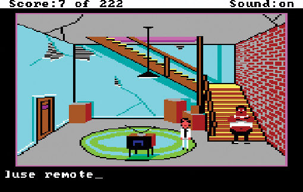

As display hardware improved, game development began to require more artists and the quality of the artwork improved considerably. The game's art director chose a camera position designed to show off each location to best effect. Compare Figure 15.1 with Figure 15.2 from [Grim Fandango](https://en.wikipedia.org/wiki/Grim_Fandango).

随着显示硬件的改进，游戏开发开始需要更多的美术师，美术质量也大大提高。游戏的艺术总监选择了一个摄像机位置，目的是将每个地点的效果展现得淋漓尽致。将图 15.1 与[《冥界狂想曲》](https://en.wikipedia.org/wiki/Grim_Fandango)中的图 15.2 进行比较。

Figure 15.2. A scene in Grim Fandango. Note the camera position. 图 15.2. 《冥界狂想曲》中的一个场景。注意摄像机的位置。

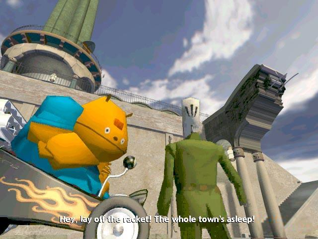

A context-sensitive perspective lets the designer (or art director) play cinematographer, using camera angles, composition, and lighting to enhance the story. Use these techniques with discretion, however. A light touch is best. If you watch movies closely, you'll notice that the majority of shots are pretty straightforward. Movie directors don't use unexpected angles just for the fun of it; they do so to make a deliberate point.

情境感应视角让设计师（或艺术总监）扮演电影摄影师的角色，利用摄像机角度、构图和照明来烘托故事情节。不过，要谨慎使用这些技巧。最好是轻描淡写。如果你仔细观察电影，你会发现大多数镜头都非常直白。电影导演不会为了好玩而使用意想不到的角度，他们一旦这样做一定是别有用意。

## First Person 第一人称

One of the most famous graphic adventure games of all, [Myst](https://en.wikipedia.org/wiki/Myst), used a first-person perspective. The player's avatar was not seen; in fact, like the earliest text adventures, the player didn't really have an avatar in the sense of a character who belonged in the story. Instead, it was the player himself who was in the game world. Unlike first-person shooters, however, [Myst](https://en.wikipedia.org/wiki/Myst) did not render a three-dimensional game world in real time. The game world consisted of a large number of prerendered still frames, which it showed one at a time as the player walked around. Being prerendered, these stills were finely detailed and highly atmospheric. On the other hand, they couldn't depict continuously moving objects or changes in the sunlight as time passed, and the player couldn't look at things from any angle. The world was rich but static.

最著名的图形冒险游戏之一[《神秘岛》](https://en.wikipedia.org/wiki/Myst)采用第一人称视角。游戏中看不到玩家的化身；事实上，与最早的文字冒险游戏一样，玩家并没有真正意义上的化身，也就是故事中的角色。相反，玩家自己才是游戏世界的主角。不过，与第一人称射击游戏不同的是，[《神秘岛》](https://en.wikipedia.org/wiki/Myst)并没有实时呈现三维游戏世界。游戏世界由大量预渲染的静止画面组成，当玩家在游戏中行走时，这些画面就会一帧一帧地显示出来。由于是预渲染，这些静态画面细节细腻，氛围浓厚。但另一方面，它们无法描绘持续运动的物体或随着时间流逝阳光的变化，玩家也无法从任意角度观察事物。世界是丰富的，但也是静态的。

A real-time 3D first-person perspective gives the player the best sense of being in the world himself, but it doesn't let the player see his avatar unless the game has a functioning reflective surface in it. It also tends to encourage a more action-oriented approach to playing the game, running around without paying much attention to the surroundings. Finally, 3D hardware is still not advanced enough to render extremely detailed scenes (a room crammed with hundreds of complex objects, for example) in real time.

实时三维第一人称视角能让玩家有身临其境的最佳感觉，但除非游戏中有一个可以用的反射面，否则玩家无法看到自己的化身。此外，这种视角往往会鼓励玩家在玩游戏时更注重动作，四处奔跑而不太注意周围的环境。最后，3D 硬件仍然不够先进，无法实时渲染极其精细的场景（例如，一个挤满数百个复杂物体的房间）。

## Third Person 第三人称

The third-person perspective keeps the player's avatar constantly in view, as in [Indiana Jones and the Infernal Machine](https://en.wikipedia.org/wiki/Indiana_Jones_and_the_Infernal_Machine) or in action games such as [Super Mario 64](https://en.wikipedia.org/wiki/Super_Mario_64). This perspective is common for action-adventures in which the player might need to react quickly (see Figure 15.3).

第三人称视角让玩家的化身始终保持在视野中，如[《印第安纳·琼斯与恶魔机器》](https://en.wikipedia.org/wiki/Indiana_Jones_and_the_Infernal_Machine)或[《超级马里奥 64》](https://en.wikipedia.org/wiki/Super_Mario_64)等动作游戏。这种视角常见于玩家需要做出快速反应的动作冒险游戏中（见图 15.3）。

Figure 15.3. Indiana Jones and the Infernal Machine. This is the typical action-adventure perspective. 图 15.3. 《印第安纳·琼斯与恶魔机器》。这是典型的动作冒险视角。

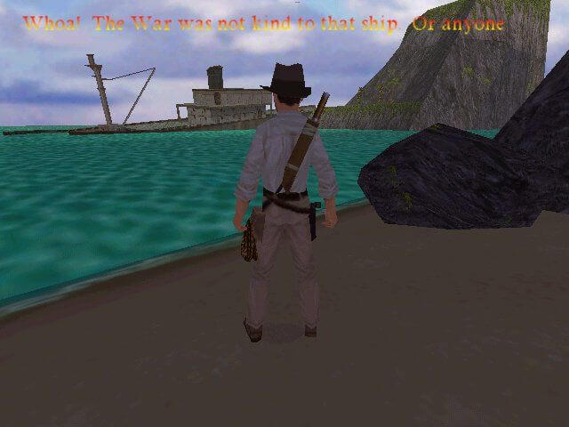

If the third-person perspective always remains behind the avatar's back, however, the view gets rather dull and doesn't let the player really appreciate the environment. And unlike pure action games in which the avatar's actions and motivations are simple, adventure games sometimes need camera perspectives that allow for more subtle situations. In Figure 15.4, from [Gabriel Knight 3](https://en.wikipedia.org/wiki/Gabriel_Knight_3:_Blood_of_the_Sacred,_Blood_of_the_Damned)
, Gabriel is hiding and watching to see when the maid is going to leave the room.

然而，如果第三人称视角始终保持在化身的背后，视角就会变得相当沉闷，无法让玩家真正欣赏环境。在纯动作游戏中，虚拟人物的行动和动机都很简单，而冒险游戏则不同，有时需要用摄像机视角来呈现更微妙的情况。图 15.4 来自[《狩魔猎人三》](https://en.wikipedia.org/wiki/Gabriel_Knight_3:_Blood_of_the_Sacred,_Blood_of_the_Damned)，加布里埃尔躲在一旁观察女仆何时离开房间。

Figure 15.4. Gabriel Knight 3 in a context-sensitive camera angle. 图 15.4. 《狩魔猎人三》中的情境感应摄像机视角。

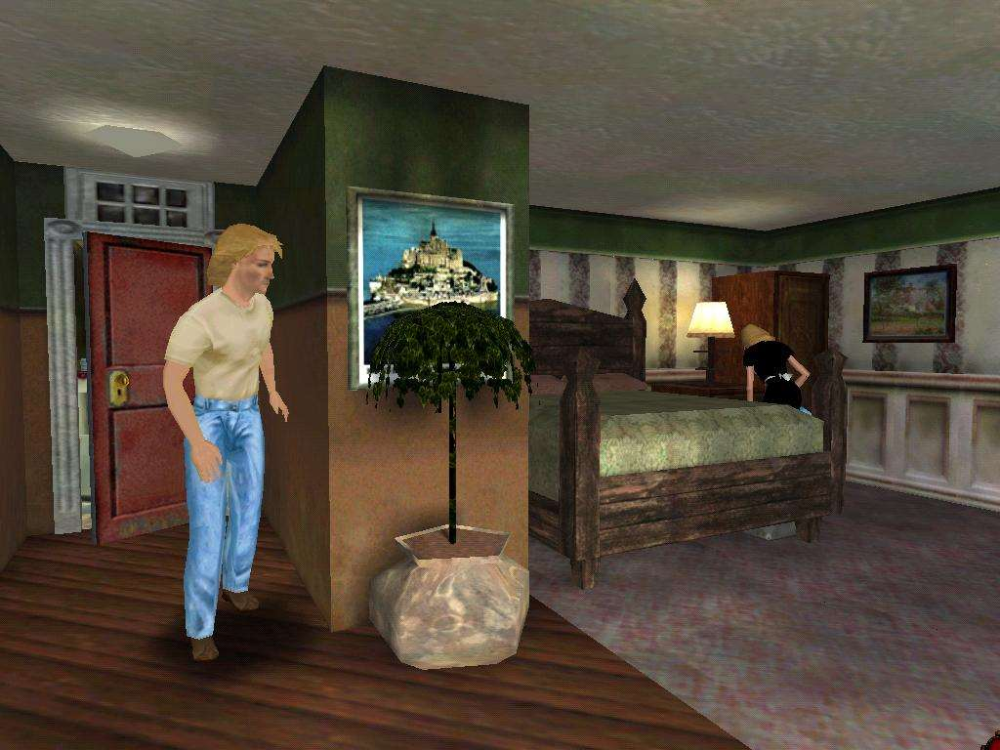

The later [Gabriel Knight](https://en.wikipedia.org/wiki/Gabriel_Knight) games also allowed the player to move the camera around somewhat—as do some of the better action games, such as [Spyro the Dragon](https://en.wikipedia.org/wiki/Spyro_the_Dragon) and [Toy Story](https://en.wikipedia.org/wiki/Toy_Story_(video_game)) (see Figure 15.5). This mimics how a real person can turn his head to look in a given direction without moving his whole body.

后来的[《狩魔猎人》](https://en.wikipedia.org/wiki/Gabriel_Knight)游戏也允许玩家在一定程度上移动镜头--一些更好的动作游戏也是如此，如[《小龙斯派罗》](https://en.wikipedia.org/wiki/Spyro_the_Dragon)和[《玩具总动员》](https://en.wikipedia.org/wiki/Toy_Story_(video_game))（见图 15.5）。这模仿了真人在不移动整个身体的情况下转头看指定方向的动作。

Figure 15.5. Gabriel Knight as seen from a player-adjusted camera position. The Volkswagen would not be visible if the camera were behind him.

图 15.5. 从玩家调整后的摄像机位置看到的《狩魔猎人》。如果摄像机在他身后，则无法看到大众汽车。

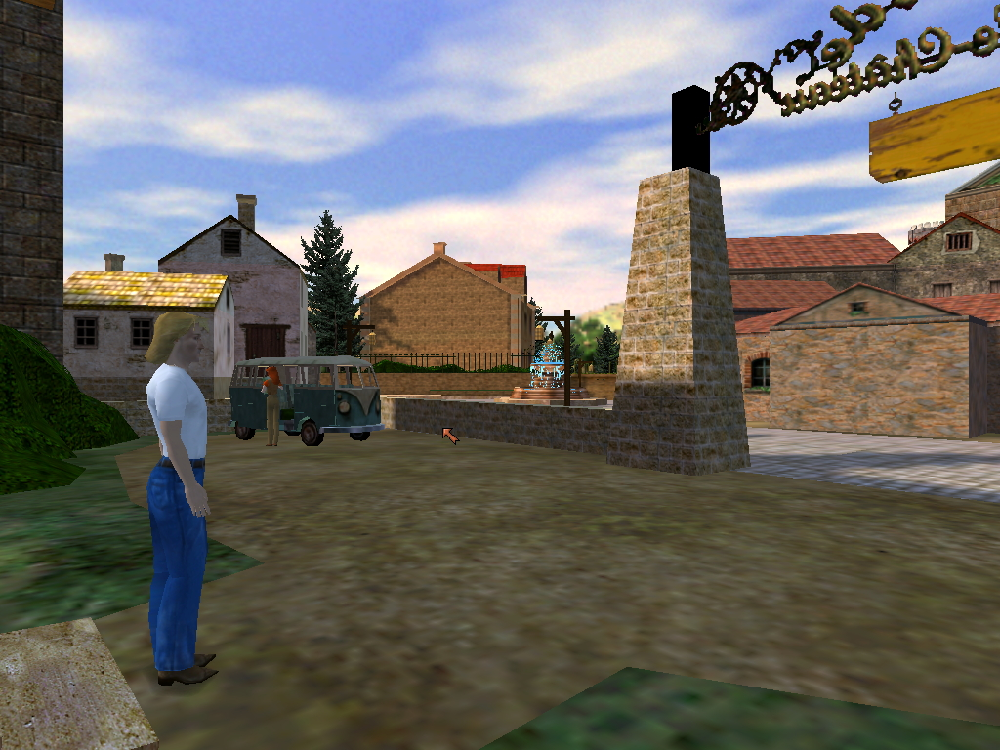

> **Case Study: The Secret of Monkey Island 案例研究：猴岛的秘密**
> 
> [The Secret of Monkey Island](https://en.wikipedia.org/wiki/The_Secret_of_Monkey_Island) is more than 10 years old now, but it's worth studying because it spawned a highly successful franchise with three more games to date. Although it was ostensibly set on a Caribbean island in the 1700s and was about a young man who wanted to be a pirate, it was full of anachronistic touches and was played for laughs. In that respect, it seemed a lot like certain Disney animated films—The Jungle Book, for example—although slightly edgier.
> 
> [《猴岛的秘密》](https://en.wikipedia.org/wiki/The_Secret_of_Monkey_Island)距今已有 10 多年的历史，但它仍值得研究，因为它催生了一个非常成功的系列，至今又推出了三款游戏。虽然它表面上是以 1700 年代的加勒比海岛为背景，讲述的是一个想当海盗的年轻人的故事，但其中充满了不合时宜的元素，而且还充满了笑料。在这方面，它似乎很像迪斯尼的某些动画片——比如《奇幻森林》——虽然略显前卫。
> 
> When Ron Gilbert, the designer of [The Secret of Monkey Island](https://en.wikipedia.org/wiki/The_Secret_of_Monkey_Island), started work on the game, he had already created an adventure game engine called [SCUMM](https://en.wikipedia.org/wiki/SCUMM). [SCUMM](https://en.wikipedia.org/wiki/SCUMM) stood for Script Creation Utility for [Maniac Mansion](https://en.wikipedia.org/wiki/Maniac_Mansion) (an earlier [LucasArts](https://en.wikipedia.org/wiki/Lucasfilm_Games) adventure game). [SCUMM](https://en.wikipedia.org/wiki/SCUMM) was an important innovation for graphic adventure games: It put the verbs on the screen so players no longer had to guess what their options were, and it did away with typing. More important for the developers, it enabled them to create new adventure games easily, without programming them from scratch each time. Three of the five [Monkey Island](https://en.wikipedia.org/wiki/Monkey_Island) games were made with [SCUMM](https://en.wikipedia.org/wiki/SCUMM), as well as [Maniac Mansion](https://en.wikipedia.org/wiki/Maniac_Mansion) itself and several other [LucasArts](https://en.wikipedia.org/wiki/Lucasfilm_Games) games.
> 
> 当[《猴岛的秘密》](https://en.wikipedia.org/wiki/The_Secret_of_Monkey_Island)的设计师罗恩·吉尔伯特开始制作这款游戏时，他已经创建了一个名为 [SCUMM](https://en.wikipedia.org/wiki/SCUMM) 的冒险游戏引擎。[SCUMM](https://en.wikipedia.org/wiki/SCUMM) 是“为[《疯狂大楼》](https://en.wikipedia.org/wiki/Maniac_Mansion)（[卢卡斯艺术](https://en.wikipedia.org/wiki/Lucasfilm_Games)公司早期的一款冒险游戏）设计的脚本创建工具”的缩写。[SCUMM](https://en.wikipedia.org/wiki/SCUMM) 是图形冒险游戏的一项重要创新：它将动词显示在屏幕上，这样玩家就不必再猜测他们的选项是什么了，而且还免去了打字的麻烦。对开发者来说，更重要的是，它使他们能够轻松创建新的冒险游戏，而不必每次都从头开始编程。五款[《猴岛小英雄》](https://en.wikipedia.org/wiki/Monkey_Island)游戏中有三款是用 [SCUMM](https://en.wikipedia.org/wiki/SCUMM) 制作的，[《疯狂大楼》](https://en.wikipedia.org/wiki/Maniac_Mansion)和其他几款[卢卡斯艺术](https://en.wikipedia.org/wiki/Lucasfilm_Games)的游戏也是如此。
> 
> [The Secret of Monkey Island](https://en.wikipedia.org/wiki/The_Secret_of_Monkey_Island) included a number of other innovations as well, most notably an insult-driven sword fight. This was a fight between the avatar, Guybrush Threepwood, and a master swordswoman. Rather than making the fight a physical challenge, which would have required a lot of additional programming and would have turned off some players, Gilbert chose to make use of (and make fun of) the way adversaries always insult one another in old swashbuckling movies. When your adversary insults you, you must choose an appropriate comeback quip. If you do, Guybrush advances in the fight; if you choose the wrong one, he is forced to retreat. If you make enough correct quips in a row, Guybrush wins the fight. The insults themselves contain cues as to which reply is correct, so you don't have to find out by trial and error.
> 
> [《猴岛的秘密》](https://en.wikipedia.org/wiki/The_Secret_of_Monkey_Island)中还有许多其他创新，其中最引人注目的是一场嘴炮斗剑。这是一场化身——盖布拉许‧崔普伍德与女剑王之间的格斗。吉尔伯特并没有让这场格斗成为一项体力挑战，因为这不仅需要大量的额外编程，而且会让一些玩家反感，他选择利用（并取笑）老式剑斗电影中对手之间相互辱骂的方式。当你的对手辱骂你的时候，你必须选择一个适当的答案骂回去。如果你选对了，盖布拉许就会在格斗中前进；如果你选错了，他就会被迫后退。如果你连续说出足够多的正确辱骂，盖布拉许就会赢得格斗。辱骂的备选项里面包含了正确回答的提示，因此你不必通过反复试验来找出答案。
> 
> It's this kind of humorous lateral thinking that separates great adventure games from merely good ones. The [Monkey Island](https://en.wikipedia.org/wiki/Monkey_Island) series belongs among the greats.
> 
> 正是这种幽默的横向思维将优秀的冒险游戏与一般的游戏区分开来。[《猴岛小英雄》](https://en.wikipedia.org/wiki/Monkey_Island)系列就是其中的佼佼者。

## Player Roles 玩家角色

In most computer games, the player's role is largely defined by the challenges she will be facing, whether it's as an athlete in a sports game, a pilot in a flight simulator, or a martial arts expert in a fighting game. But adventure games can be filled with all kinds of puzzles and problems that are unrelated to the player's stated role. Indiana Jones is supposedly an archaeologist, but we don't see him digging very much. The role arises not out of the challenges (unless you specifically want it to), but out of the story. In an adventure game, the player could still be a pilot, if that's what the story requires, but it doesn't necessarily guarantee that she'll get to fly a plane. And she might be anything else or nothing in particular—just an ordinary person living in an extraordinary situation.

在大多数电脑游戏中，无论是体育游戏中的运动员、飞行模拟器中的飞行员，还是格斗游戏中的武术高手，玩家的角色主要是由她将要面对的挑战来定义的。但冒险游戏中可能会出现各种与玩家角色无关的谜题和问题。印第安纳·琼斯据说是一位考古学家，但我们并没有看到他挖出多少东西。角色不是从挑战中产生的（除非你特别希望它产生），而是从故事中产生的。在冒险游戏中，如果故事需要，玩家仍然可以是一名飞行员，但这并不一定保证她会去驾驶飞机。她可能是其他任何角色，也可能什么都不是——只是一个生活在不寻常环境中的普通人。

A good many adventure games do connect the player's role with the game's activities, however. Players' roles often involve travel or investigation: explorer, detective, hunter, conquistador, and so on. The player can even be some kind of a scientist, if it's a branch of science that involves travel: geologist or zoologist, for example.

不过，很多冒险游戏确实将玩家的角色与游戏活动联系在一起。玩家的角色通常涉及旅行或调查：探险家、侦探、猎人、征服者等等。如果是涉及旅行的科学分支，玩家甚至可以是某种科学家：例如地质学家或动物学家。

Be sure that the challenges are not too disjoint from the role, however, or it could be frustrating for the player. [Heart of China](https://en.wikipedia.org/wiki/Heart_of_China), which was otherwise a straightforward adventure game, included a poorly implemented 3D tank simulator at one point. To continue the game, the player had to use the tank simulator successfully. This was a real problem; adventure game enthusiasts seldom play vehicle simulations, and many could not get past that point. It spoiled the game for them.

不过，要确保挑战不要与角色过于脱节，否则会让玩家感到沮丧。[《中国之心》](https://en.wikipedia.org/wiki/Heart_of_China)本来是一款简单明了的冒险游戏，但有一次却加入了一个效果不佳的 3D 坦克模拟器。玩家必须成功使用坦克模拟器才能继续游戏。这确实是个问题；冒险游戏爱好者很少玩交通工具模拟类游戏，很多人都无法通过这一关。这让他们对游戏大失所望。

## Structure 结构

Adventure games typically have only one gameplay mode. Unlike sports games, with all of their team-management functions, or war games, with their battle planning, adventure games don't need a lot of specialized screens. Apart from looking at a map or the inventory or examining objects close up, the player always sees and interacts with the world in the same way, and that doesn't change from one end of the game to the other.

冒险游戏通常只有一种游戏模式。与具有团队管理功能的体育游戏或具有战斗计划功能的战争游戏不同，冒险游戏不需要很多专门的屏幕。除了查看地图、库存或近距离观察物体外，玩家总是以相同的方式观察世界并与之互动，这一点从游戏的开始到结束都不会改变。

What adventure games do have, however, is a story structure: a relationship between different locations in the world and different parts of the story. Over the years, this has evolved. The earliest adventure games, including the original [Adventure](https://en.wikipedia.org/wiki/Colossal_Cave_Adventure), mostly emphasized exploration rather than allowing the player to participate in a narrative of some kind. The player perceived little sense of time passing—that is, of making progress through a story toward an ending. The game simply gave her a large space and told her to wander around in it. Structurally, it looked rather like the drawing in Figure 15.6.

然而，冒险游戏确实拥有的是一个故事结构：世界中不同地点与故事不同部分之间的关系。多年来，这种关系不断演变。最早的冒险游戏，包括最初的[《魔幻历险》](https://en.wikipedia.org/wiki/Colossal_Cave_Adventure)，大多强调探索，而不是让玩家参与某种叙事。玩家几乎感觉不到时间的流逝，也就是感觉不到通过故事走向结局。游戏只是给了她一个广阔的空间，让她在里面四处游荡。从结构上看，它很像图 15.6 中的图画。

Figure 15.6. The structure of early adventure games. Each circle represents a room. S is the starting room, and E is the end. 图 15.6. 早期冒险游戏的结构。每个圆圈代表一个房间。S 代表起始房间，E 代表终点。

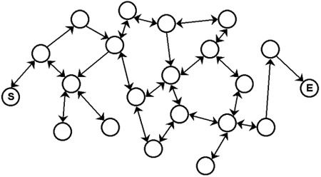

As adventure games got larger and began to include a story, designers started to break them up into chapters (see Figure 15.7). The player could wander around all he liked in the area devoted to a given chapter, but when he moved on to the next, the story advanced and there was no way back. If the player needed to take a particular object from one chapter to the next, the story would not let him progress until that object was in his inventory.

随着冒险游戏的规模越来越大，并开始包含故事情节，设计者开始将游戏分成若干章节（见图 15.7）。玩家可以在特定章节的区域内随意游荡，但当他进入下一个章节时，故事就会向前推进，并且不能回退。如果故事需要玩家把某个特定物品从一个章节带到下一个章节，那么玩家只有在找到这个物品后，才能继续前进。

Figure 15.7. The structure of story-driven adventure games. 图 15.7. 故事驱动型冒险游戏的结构。

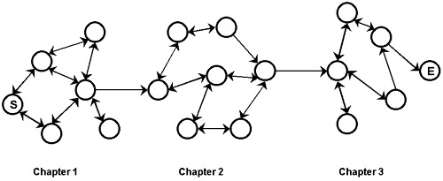

With the arrival of 3D graphics and the action-adventure, the stories began to be even more linear. Areas occasionally had simple side branches but few complex spaces or loops. The space in an action-adventure is structured more like that of an action game or a first-person shooter (see Figure 15.8).

随着 3D 图形和动作冒险游戏的出现，故事开始变得更加线性。一些区域偶尔会有简单的分支，但很少有复杂的空间或循环。动作冒险游戏的空间结构更像动作游戏或第一人称射击游戏（见图 15.8）。

Figure 15.8. The structure of action-adventure games. 图 15.8. 动作冒险游戏的结构。

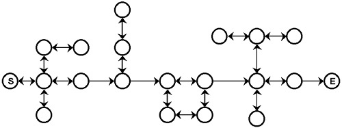

## Storytelling 讲故事

This subject is discussed at length in [Chapter 4](/part-1/chapter-4.md). In this section, we just reiterate a few of the key points and talk about their significance in adventure games. Adventure games rely on storytelling more than any other genre. We can't tell you in this book how to create a good story, but you can learn from innumerable other resources. A great many theories exist, beginning with Aristotle's [Poetics](https://en.wikipedia.org/wiki/Poetics_(Aristotle)) and continuing to postmodernist literature. If you're trying to make a game that's fun to play and, better yet, sells well, it's probably best to avoid some of the more outré literary theories and stick to what works for the vast majority of books, movies, and television. On the other hand, if you're trying to expand the boundaries of the interactive medium with a never-before-seen work of art, more power to you.

[第四章](/part-1/chapter-4.md)已经详细讨论过这个话题。在本节中，我们只是重申其中的几个要点，并谈谈它们在冒险游戏中的意义。冒险游戏比其他任何类型的游戏都更依赖于讲故事。我们无法在本书中告诉你如何创作一个好故事，但你可以从无数其他资源中学习。从亚里士多德的[《诗学》](https://en.wikipedia.org/wiki/Poetics_(Aristotle))开始，一直到后现代主义文学，存在着大量的理论。如果你想制作一款好玩的游戏，最好还能畅销，那么最好避开一些比较离经叛道的文学理论，坚持使用对绝大多数书籍、电影和电视都有效的理论。另一方面，如果你想通过一部前所未见的艺术作品来拓展互动媒体的边界，那就更值得一试了。

Here are a few pointers about storytelling as it applies to adventure games.

以下是一些关于冒险游戏讲故事的要点。

### Dramatic Tension 戏剧张力

The essence of any story, whether it's interactive or a fixed narrative, is dramatic tension: a situation or problem that is unresolved. This is what holds the reader's attention and keeps her around to see how it comes out. To create dramatic tension, you must begin by presenting the problem. In adventure games, this often happens in a cut scene right at the beginning of the game. The meaning of the scene doesn't always have to be clear; mystery and uncertainty are a common element of dramatic tension. For example, in [The Longest Journey](https://en.wikipedia.org/wiki/The_Longest_Journey), we begin by learning that April Ryan, the avatar and heroine of the game, has been having increasingly vivid nightmares whose meaning she does not understand. At the beginning of the game, she has no goal other than to find out why she's having nightmares. Later, more dramatic tension is added as we learn the source of those nightmares and new problems emerge.

任何故事，无论是互动式还是固定叙事，其本质都是戏剧张力：一种悬而未决的情况或问题。这才能吸引读者的注意力，让她继续关注故事的结局。要制造戏剧张力，首先必须提出问题。在冒险游戏中，这通常发生在游戏一开始的过场动画中。画面的含义并不一定要很明确；神秘感和不确定性是戏剧张力的常见元素。例如，在[《最长的旅程》](https://en.wikipedia.org/wiki/The_Longest_Journey)中，我们一开始就知道游戏的女主角艾普莉·瑞安做了越来越生动的噩梦，她不明白这些噩梦的含义。游戏开始时，她没有任何目标，只是想找出做噩梦的原因。后来，随着我们了解到这些噩梦的来源，新的问题也随之出现，游戏的戏剧张力也随之增加。

The resolution of dramatic tension occurs at a moment usually near the end of the story called the dramatic climax. Short stories frequently have only one source of dramatic tension and one dramatic climax; longer stories can have several in a row, of progressively increasing importance. A really long story can have several major dramatic climaxes at intervals, and what ties them together is a common theme, setting, or characters. Such stories are called epics or cycles. Richard Wagner's cycle of four operas, The Ring of the Nibelungs, is one such. Each opera is a self-contained story with its own dramatic climax, although some characters carry over from one opera to the next, and all of them concern the fate of the same magic ring.

戏剧张力的解决通常发生在故事接近结尾的时刻，称为戏剧高潮。短篇小说通常只有一个戏剧张力来源和一个戏剧高潮；长篇小说可以连续出现几个戏剧高潮，其重要性逐渐增加。一个真正的长篇小说可以间隔出现几个主要的戏剧高潮，将它们联系在一起的是一个共同的主题、背景或人物。这样的故事被称为史诗或循环。理查德·瓦格纳的四部歌剧《尼伯龙根的指环》就是这样一部作品。每部歌剧都是一个自足的故事，都有自己的戏剧高潮，尽管有些角色会从一部歌剧延续到下一部歌剧，但所有歌剧都与同一枚魔戒的命运有关。

As an adventure game designer, the puzzles create dramatic tension for you. However, they alone are not enough. They are small, individual problems. There must also be a larger problem that is the reason the player is playing the game in the first place.

作为冒险游戏的设计者，谜题为你营造了戏剧张力。然而，仅有谜题是不够的。它们只是个别的小问题。还必须有一个更大的问题，这才是玩家玩游戏的初衷。

### The Heroic Quest 英雄任务

The majority of adventure games are heroic quests of some kind, a mission by a single individual to accomplish some great (or, in the case of [Leisure Suit Larry](https://en.wikipedia.org/wiki/Leisure_Suit_Larry), not-so-great) feat. Although it's possible to write an adventure game that is a detailed character study, no one has done so as a commercial product, and the emphasis on a single person doesn't lend itself to a sweeping epic with a cast of thousands. It's also possible to create a game about a small group of people, but giving the player a group to manage interferes with her identification with one of them as her avatar. Games about groups are easier managed as RPGs because of the natural "party" structure of the quests. An adventure game is more like a novel written in the first person.

大多数冒险游戏都是某种英雄任务，即一个人完成某些伟大（或许多，在[《情圣拉瑞》](https://en.wikipedia.org/wiki/Leisure_Suit_Larry)中，不算伟大）的壮举。虽然冒险游戏也可以写成详细的人物研究报告，但还没有人把它作为商业产品来做，而且对单个人物的强调也不适合写成有成千上万人参与的宏大史诗。它也可以制作一个关于一小群人的游戏，但让玩家管理一个群体会影响她对其中一个人作为她的化身的认同。由于任务的天然“团队”结构，关于群体的游戏更容易作为角色扮演游戏来管理。冒险游戏更像是以第一人称写的小说。

Among the characteristics of the heroic quest is that it is always a movement from the familiar to the unfamiliar and from a time of low danger to a time of great danger. For example, if you have a big dramatic climax, it should be the last really major one in the game because anything that follows it is likely to feel irrelevant. This is why the boss enemies appear at the ends of levels in action games. If you defeat the Lord of Terror, it feels anticlimactic and rather unfair to have to fight his second-in-command afterward.

英雄探险的特点之一是，它总是从熟悉的地方走向陌生的地方，从低度危险走向高度危险。例如，如果你有一个戏剧性的大高潮，它应该是游戏中最后一个真正重要的高潮，因为它之后的任何事情都可能让人觉得无关紧要。这就是为什么在动作游戏中，头目敌人会出现在关卡的最后。如果你打败了恐怖之王，之后还得和他的副手战斗，就会让人觉得很反常，而且相当不公平。

Occasionally exceptions to this structure arise, such as in stories in which the hero is abducted at the beginning, escapes, and is trying to return to his home. However, in these stories, it doesn't get easier and easier until he just strolls in happily. He often returns home to find that things have changed for the worse and must be corrected, or that he must leave again to hunt down his abductor.

这种结构偶尔也会出现例外，比如在一些故事中，主人公一开始被绑架，后来逃了出来，并试图回到自己的家。然而，在这些故事中，事情并不会变得越来越简单，直到他快乐地漫步回家。他回到家后往往发现事情已经变得更糟，必须加以纠正，或者他必须再次离开去追捕绑架他的人。

Of course, none of this means that there can't ever be periods of quiet; in fact, there should be. In both of J.R.R. Tolkien's most famous books, The Hobbit and The Lord of the Rings, periods of great danger are interspersed with periods of safety and rest for the heroes, during which they can regain their strength. A long story that consists of nothing but action will feel unrealistic and silly after a while.

当然，这并不意味着不能有宁静期；事实上，宁静期是应该有的。在托尔金（J.R.R. Tolkien）最著名的两本书《霍比特人》（The Hobbit）和《魔戒》（The Lord of the Rings）中，巨大的危险期与英雄们的安全期和休息期穿插在一起，在此期间他们可以恢复体力。如果一个冗长的故事中只有动作，那么时间久了就会让人觉得不切实际和愚蠢。

The works of Joseph Campbell and Christopher Vogler discuss the heroic quest at length, and we encourage you to read them for inspiration (see Appendix B, "Bibliography," for details).

约瑟夫-坎贝尔（Joseph Campbell）和克里斯托弗-沃格勒（Christopher Vogler）的作品详细讨论了英雄的追求，我们鼓励你阅读他们的作品，从中获得灵感（详见附录 B “参考书目”）。

### The Problem of Death 死亡问题

For many years, game designers have debated the question of whether adventure games should allow the avatar to do something that kills him. Some adventure games have proudly noted on their boxes that you can't ever die; others have warnings in the manual that you might encounter dangerous situations. In some respects, this seems like a strange thing to worry about. After all, avatars routinely die in action games and get shot down in flight simulators, so why shouldn't they be able to die in adventure games?

多年来，游戏设计师们一直在争论这样一个问题：冒险游戏是否应该允许虚拟人物做一些会杀死他的事情。一些冒险游戏在包装盒上骄傲地写着 “你永远不会死”；另一些冒险游戏则在手册中警告玩家可能会遇到危险情况。从某些方面来说，这种担心似乎很奇怪。毕竟，化身在动作游戏中经常死亡，在飞行模拟器中经常被击落，为什么在冒险游戏中就不能死亡呢？

The reason has to do with the nature of the gameplay. In a first-person shooter or a military flight simulator, it's obvious that the avatar is in mortal peril all the time. In fact, in most genres of games, it's win or lose, kill or be killed, and the enemies are clearly marked. Adventure games are different because they seldom have an explicitly declared enemy and the player is encouraged to go everywhere and touch everything. If you tell the player to explore the world and then you fill it with deathtraps, he's in for a frustrating time. Nowadays, most adventure games adopt a "fair warning" approach, making it clear when something is dangerous and (usually) offering a way of neutralizing or circumventing the danger. If you put a dragon in a cave, it's a nice touch to litter the entrance with the bones of earlier adventurers. That ought to get the point across.

原因与游戏的性质有关。在第一人称射击游戏或军事飞行模拟器中，化身显然一直处于致命危险之中。事实上，在大多数类型的游戏中，要么赢要么输，要么杀人要么被杀，而且敌人都有明显的标记。冒险类游戏则不同，因为它们很少有明确的敌人，而且鼓励玩家到处走走，接触一切。如果你让玩家去探索世界，却又在世界里布满了死亡陷阱，那他就会很沮丧。如今，大多数冒险游戏都采用了 “公平警告 ”的方式，明确说明某些事物的危险性，并（通常）提供一种化解或规避危险的方法。如果你在洞穴里放了一条龙，在入口处堆满以前冒险者的尸骨也是一种不错的做法。这应该能让人明白这一点。

Most adventure games have a save-game feature, so death isn't necessarily catastrophic; on the other hand, stopping to save the game does tend to hurt suspension of disbelief. Adventure games shouldn't be so dangerous that the player has to save all the time because it ruins the storytelling. If you are going to include death in your game, we encourage you to autosave the game at intervals so that the player can restore it even if he hasn't explicitly saved it. You don't have to let the player know that you're doing it. Again, it helps to preserve the suspension of disbelief if you don't.

大多数冒险游戏都有保存游戏的功能，因此死亡并不一定是灾难性的；另一方面，停止保存游戏往往会伤害玩家的不信任感。冒险游戏不应该太危险，以至于玩家不得不一直保存游戏，因为这会破坏故事性。如果你要在游戏中加入死亡元素，我们鼓励你每隔一段时间自动保存一次游戏，这样即使玩家没有明确保存，也可以恢复游戏。你不必让玩家知道你在这样做。同样，如果你不这样做，也有助于保持玩家的不信任感。

## Challenges 挑战

The majority of challenges in an adventure game are conceptual: puzzles that require lateral thinking to solve. There are many types of puzzles; we list a few here to get you started:

冒险游戏中的大部分挑战都是概念性的：需要横向思维才能解决的谜题。谜题的类型有很多，我们在此列举几种，希望对你有所帮助：

Finding keys to locked doors. By doors and keys, we mean any obstruction that prevents progress and any object that removes the obstruction. Many adventure game puzzles are of this type. The challenge as a designer is to give players enough variety that they don't all seem the same.

找到锁门的钥匙。我们所说的门和钥匙指的是任何阻碍前进的障碍物和任何可以移开障碍物的物体。许多冒险游戏的谜题都属于这种类型。作为设计者，我们所面临的挑战就是要给玩家提供足够多的谜题，使它们看起来不那么千篇一律。

Figuring out mysterious machines. This is, in effect, a combination lock instead of a lock with a key. The player has to manipulate a variety of knobs to make a variety of indicators show the correct reading. Try to make their presence reasonably plausible—too many adventure games include mysterious machines that are clearly just a puzzle, not a realistic part of their world.

找出神秘的机器。实际上，这是一种密码锁，而不是带钥匙的锁。玩家需要操纵各种旋钮，让各种指示器显示正确的读数。尽量让它们的存在合理可信--太多冒险游戏中的神秘机器显然只是一个谜题，而不是游戏世界的真实组成部分。

Obtaining inaccessible objects. In this kind of puzzle, there's an object—whether it's a treasure or something needed for some other purpose—that the player can see but not reach. The solution is often to find a clever way of reaching the object, perhaps by building some device that will give access to it.

获取无法获取的物品。在这类谜题中，玩家可以看到一个物品--无论是宝藏还是其他用途所需的物品--但却无法触及。解决的办法通常是找到一种巧妙的方法来获取该物品，或许是通过建造一些装置来获取该物品。

Manipulating people. Sometimes an obstruction is not a physical object, but a person, and the trick is to find out what will make the person go away or let the player pass. If it's a simple question of giving him something he wants, then it's really just a lock-and-key puzzle. A more creative approach is to create a puzzle in which the person must be either defeated or distracted. The player should have to talk to him to learn what his weakness is.

操纵人。有时，障碍物不是实物，而是人，而诀窍就在于找出能让人走开或让玩家通过的方法。如果只是简单地给他一些他想要的东西，那么这其实只是一个锁和钥匙的谜题。更有创意的方法是设计一个谜题，在这个谜题中，这个人要么必须被打败，要么必须分散玩家的注意力。玩家应该通过与他交谈来了解他的弱点。

Navigating mazes. This is an area that's deliberately confusing to move around in so that it's hard to know where you are and to get where you want to go. Use mazes sparingly. They're easy to make badly but difficult to make interesting. A maze should always contain cues that an observant player can notice and use to help her learn her way around.

迷宫导航。这是一个刻意制造混乱的区域，玩家很难知道自己身在何处，也很难到达自己想去的地方。少用迷宫。迷宫很容易做得糟糕，但很难做得有趣。迷宫中应始终包含一些线索，让善于观察的玩家能够注意到，并利用这些线索来帮助自己辨别方向。

Decoding cryptic messages. Many players enjoy decoding messages, as long as there are sufficient clues to help out.

解密信息。只要有足够的线索，很多玩家都喜欢破解信息。

Solving memorization puzzles. These puzzles require the player to remember where something is—a variant of concentration. She can usually defeat these by taking notes, but that's reasonable enough; it's how we remember things anyway. The real challenge for you as the designer is to create a realistic reason for the puzzle to be in the game.

解决记忆谜题。这些谜题要求玩家记住某样东西的位置--这是注意力集中的一种变体。玩家通常可以通过记笔记来破解这些谜题，不过这也很合理；反正我们也是这么记东西的。作为设计者，真正的挑战在于为游戏中的谜题创造一个现实的理由。

Collecting things. This is really a compound version of other puzzles; the player's job is to find all five of the pieces of the magic whatchamacallit.

收集物品。这其实是其他谜题的复合版；玩家的任务是找到魔法锄头的全部五块碎片

Doing detective work. The basis for lots of police-procedure games, detective work is great fun. Instead of solving a "puzzle" per se, the player has to figure out a sequence of events from clues and interviews with witnesses. It doesn't necessarily have to be a crime; it could be any unknown event.

做侦探工作。侦探工作是许多警察程序游戏的基础，非常有趣。玩家要做的不是解决 “谜题 ”本身，而是根据线索和与目击者的访谈找出一系列事件。不一定是犯罪，也可以是任何未知事件。

Understanding social problems. No, we don't mean inflation or unemployment. The challenges of understanding, and perhaps influencing, the relationships between people is a little-explored aspect of adventure game design. Most of the people in adventure games have very simple, mechanical states of mind. If we devote a little more effort to it, people, rather than objects, could become the primary subject of adventure games, and this would make the games much more interesting.

了解社会问题。不，我们指的不是通货膨胀或失业问题。理解并影响人与人之间的关系是冒险游戏设计中一个鲜为人知的挑战。冒险游戏中的大多数人都有着非常简单、机械的心理状态。如果我们在这方面多花一点心思，人而不是物体就会成为冒险游戏的主要主题，而这也会让游戏变得更加有趣。

Only playtesting can tell you whether a puzzle is too hard or too easy, and unlike other genres, you can't adjust an adventure game's difficulty by tweaking some numbers. When designing puzzles, we encourage you to try to allow for lateral thinking of the players. If there's more than one way to solve a puzzle, don't arbitrarily restrict the player to your preferred method. Obviously, you can't build in multiple solutions to every puzzle, but if the player tries something entirely logical and there's no good reason why it doesn't work, she's going to be frustrated.

只有游戏测试才能告诉你一个谜题是太难还是太容易，而且与其他类型的游戏不同，你不能通过调整一些数字来调整冒险游戏的难度。在设计谜题时，我们鼓励你尝试让玩家进行横向思考。如果有不止一种解谜方法，不要武断地将玩家限制在你喜欢的方法上。显然，你不可能为每个谜题都设计多种解法，但如果玩家尝试了完全符合逻辑的解法，却没有充分的理由证明其行不通，那么她就会感到沮丧。

# User Interface Design 用户界面设计

Adventure games, more than most other genres, try to hide the fact that the player is using a computer. By comparison to vehicle simulators, sports games, or RPGs, the user interfaces of adventure games are very simple. The player needs to move through the world, talk to NPCs, and manipulate or collect objects in an intuitive way that does not interfere with his sense of immersion in the story.

与大多数其他类型的游戏相比，冒险类游戏试图掩盖玩家使用电脑的事实。与汽车模拟器、体育游戏或 RPG 相比，冒险游戏的用户界面非常简单。玩家需要在世界中移动，与 NPC 对话，并以直观的方式操作或收集物品，而这种方式不会影响玩家对故事的沉浸感。

## Avatar Movement 化身移动

The movement interface that you design depends considerably on the perspective you choose. In first-person and third-person perspectives, the player needs a way of steering her avatar around the world, as in an action game. We suggest that you look at [Chapter 9](/part-2/chapter-9.md), "Action Games," for a discussion of avatar movement in first- and third-person perspectives.

你所设计的移动界面在很大程度上取决于你所选择的视角。在第一人称和第三人称视角中，玩家需要一种方法来引导她的化身在世界中移动，就像在动作游戏中一样。建议阅读[第九章](/part-2/chapter-9.md)“动作游戏”，了解第一人称和第三人称视角下的化身移动。

In a context-sensitive perspective, there are two common user interfaces: point-and-click and direct control.

在上下文相关视角中，有两种常见的用户界面：点击和直接控制。

### Point-and-Click Interfaces 点选式界面

In this user interface, the player clicks somewhere on the screen. If the corresponding location in the game is accessible, the avatar walks to it. If the player clicks an active object, the avatar walks to it and picks it up or manipulates it in an appropriate way. Object management is discussed more extensively in the "Manipulating Objects" section later in this chapter. The disadvantage of point-and-click is that the player can easily point to areas that aren't accessible to the avatar (halfway up a wall, for example), and sometimes an area that looks as if it should be perfectly accessible isn't. This can be frustrating for the player. Nevertheless, the point-and-click interface is the de facto standard for adventure games.

在这种用户界面中，玩家点击屏幕上的某处。如果可以到达游戏中的相应位置，化身就会走到那里。如果玩家点击了一个活动物体，化身就会走到该物体前，并以适当的方式拾取或操作该物体。本章后面的 “操作物体 ”部分将对物体管理进行更广泛的讨论。点选式操作的缺点是玩家很容易指向化身无法到达的区域（例如墙壁的一半），有时看起来似乎完全可以到达的区域却无法到达。这可能会让玩家感到沮丧。尽管如此，点击式界面仍然是冒险游戏的事实标准。

### Direct Control Interfaces 直接控制界面

In a direct control user interface, the player's commands say "Walk in this direction" rather than "Walk to this point," as they do in a point-and-click interface. In these kinds of games, such as Grim Fandango, from LucasArts, the player "steers" the avatar around the screen. Direct control can be awkward in a context-sensitive perspective because the camera angle changes from scene to scene.

在直接控制用户界面中，玩家的命令是 “朝这个方向走”，而不是像在点击界面中那样 “走到这一点”。在这类游戏（如 LucasArts 公司出品的《Grim Fandango》）中，玩家在屏幕上 “操纵 ”虚拟人物。在上下文相关的视角中，直接控制可能会很笨拙，因为摄像机的角度会随着场景的变化而变化。

### Movement Speed 移动速度

No matter what perspective or user interface you choose, we strongly suggest that you implement both a "walk" and a "run" movement mode so the player can move slowly through unfamiliar spaces and quickly through familiar ones. If the game requires the player to move repeatedly through areas he already knows well, it gets very boring to watch the avatar walk deliberately from place to place. On the other hand, if your world is rich and detailed and your game expects the player to examine everything closely for clues, the user interface must make it possible to move around slowly and accurately.

无论你选择哪种视角或用户界面，我们都强烈建议你同时采用 “走 ”和 “跑 ”两种移动模式，这样玩家就可以在不熟悉的空间缓慢移动，也可以在熟悉的空间快速移动。如果游戏要求玩家在他已经熟悉的区域反复移动，那么看着化身从一个地方故意走到另一个地方就会非常无聊。另一方面，如果你的世界丰富而细致，你的游戏希望玩家仔细观察一切以寻找线索，那么用户界面就必须能让玩家缓慢而准确地移动。

## Manipulating Objects 操作物体

One of the great challenges in designing an adventure game is in determining how the player should manipulate objects in the world. In many games, the player must figure out what to do with particular objects to solve puzzles and advance the game. In text adventures, this amounted to guessing the correct verb. You often got interchanges that looked like this:

设计冒险游戏的一大挑战是确定玩家应如何操作世界中的物体。在许多游戏中，玩家必须想出如何操作特定的物体来解决谜题和推进游戏。在文字冒险游戏中，这相当于猜测正确的动词。你经常会听到这样的对话：

> OPEN DOOR 开门
The door is locked, but it looks pretty flimsy. 门锁上了，但看上去不太结实。
> BREAK DOOR 破门
I don't know how to do that. 我不知道怎么做。
> SMASH DOOR 砸门
I don't know how to do that. 我不知道怎么做。
> HIT DOOR 敲门
I don't know how to do that. 我不知道怎么做。
> KICK DOOR 踢门
The door flies open. 门飞开了。

Sometimes this was fun; a lot of the time it wasn't. In graphic adventure games, in which the player is using the mouse or a handheld controller, designers can solve this problem in a variety of different ways.

有时这很有趣，但很多时候并不好玩。在图形冒险游戏中，玩家使用鼠标或手持控制器，设计者可以通过各种不同的方法来解决这个问题。

### Identifying Active Objects 识别活动对象

Not every object in the game world can be manipulated or picked up; some are just part of the background scenery. The player needs a way of recognizing the active objects in a particular location. Text adventures used to print a list of them. Graphic adventures have typically used one of four mechanisms:

在游戏世界中，并不是每个物体都可以操作或拾取；有些物体只是背景场景的一部分。玩家需要一种方法来识别特定地点的活动物体。文字冒险通常会打印出一个列表。图形冒险通常使用四种机制中的一种：

Hunt and click. Active objects don't look any different from anything else; the player simply has to click everything in the scene to see if it's active. This makes the scene look realistic, but it's annoying for the player, especially if some of the objects are small or partially hidden. This mechanism has generally been abandoned in favor of the following ones.

狩猎和点击。活动物体看起来与其他物体没有任何区别；玩家只需点击场景中的所有物体，查看其是否处于活动状态。这使得场景看起来很逼真，但对玩家来说却很烦人，尤其是在一些物体很小或部分隐藏的情况下。这种机制已被普遍放弃，转而采用以下机制。

Permanently highlighted objects. The active objects in a scene are permanently highlighted in some way—either they're slightly brighter than the rest of the scene or they're surrounded by a line of light or dark pixels, to make them stand out against the background. The moment the scene appears on the screen, the player can tell which objects are active. It's convenient, if artificial.

永久高亮物体。场景中的活动物体会以某种方式永久突出显示--要么比场景的其他部分稍亮，要么被一条或明或暗的像素线包围，使其在背景中显得格外突出。当场景出现在屏幕上时，玩家就能知道哪些物体是活动的。虽然有些矫揉造作，但还是很方便的。

Dynamically highlighted objects. The active objects in a scene normally look like part of the background, but they are highlighted when the mouse cursor passes over them. Either the object lights up or the cursor changes shape. It still means that the player has to do some hunting, but it's much easier than hunting and clicking; a quick wave of the cursor tells the player if there's an active object nearby.

动态突出显示物体。场景中的活动物体通常看起来像是背景的一部分，但当鼠标光标经过它们时，它们就会被突出显示。要么物体亮起，要么光标改变形状。这仍然意味着玩家需要做一些搜寻工作，但这比搜寻和点击要容易得多；光标的快速移动会告诉玩家附近是否有活动物体。

Focus-of-attention highlighting. This mechanism is typically used with hand held controllers when the player doesn't have a mouse cursor. As the avatar moves around in a scene, his focus of attention changes depending on the direction he is looking. Whatever active object is directly in front of him is the focus of his attention and is highlighted. When he turns away, its highlighting disappears again. The disadvantage of this mechanism is that if two active objects are close together, it can be tricky to point the avatar in exactly the right direction to put the focus of attention on the desired object.

突出显示焦点。当玩家没有鼠标光标时，这种机制通常用于手持控制器。当虚拟人在场景中移动时，他的注意力焦点会根据他所看的方向发生变化。在他正前方的任何活动物体都是他的注意力焦点，并会突出显示。当他转过身去时，突出显示又会消失。这种机制的缺点是，如果两个活动物体靠得很近，那么要将虚拟化身指向正确的方向，使注意力集中在所需的物体上就会很麻烦。

### One-Button Actions 单键操作

In a graphic adventure game played with a handheld controller, designers often assign one button of the controller to a generic "use" or "manipulate" function: The player moves the avatar near the object and presses the "use" button for obvious functions such as opening a door or throwing a switch. The player can always count on the button to do the right thing with an object, whatever that might be. Some mouse-based games use a similar mechanism: Clicking an object does something appropriate with it. This makes the game very easy to play because there's no guessing about what you should do. The disadvantage of this system is that there can be only one action per object, so it doesn't allow the designer to challenge the player's lateral thinking.

在使用手持控制器的图形冒险游戏中，设计者通常会将控制器上的一个按钮指定为通用的 “使用 ”或 “操作 ”功能：玩家将化身移动到物体附近，然后按下 “使用 ”按钮来实现开门或开关等显而易见的功能。玩家总是可以依靠这个按钮对物体做出正确的操作，不管是什么。一些基于鼠标的游戏也使用类似的机制：点击一个物体，它就会做出相应的动作。这让游戏变得非常容易上手，因为不用猜测你应该做什么。这种系统的缺点是每个物体只能有一个动作，因此设计者无法挑战玩家的横向思维。

### Menu-Driven Actions 菜单驱动的操作

A number of games use a menu to allow the player to select the action he wants to take and the object that he wants to manipulate (see Figure 15.9). This gives the player a clear picture of his choices, but it does feel a little "computery."

许多游戏都使用菜单让玩家选择要采取的行动和要操作的对象（见图 15.9）。这让玩家对自己的选择一目了然，但确实有点“电脑化”的感觉。

Figure 15.9. The action menu in The Secret of Monkey Island. 图 15.9. 《猴岛的秘密》中的动作菜单。

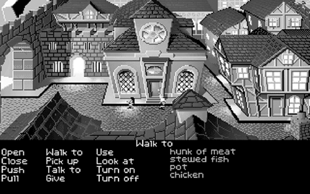

In another variant, the player places the mouse cursor over the desired object and right-clicks it. A pop-up menu appears, showing a series of icons that represent the actions "take," "use," "examine," and possibly others (see Figure 15.10). The player left-clicks one of the icons, and the desired action is performed. This mechanism, in effect, shows the player all the available verbs that can be used with that particular object and lets him pick one.

在另一种变体中，玩家将鼠标光标放在所需的对象上并右击它。这时会弹出一个菜单，显示一系列图标，分别代表 “采取”、“使用”、“检查 ”等操作（见图 15.10）。玩家左键单击其中一个图标，就可以执行所需的操作。这种机制实际上是向玩家展示了所有可用于特定对象的动词，并让他从中选择一个。

Figure 15.10. The pop-up menu in The Longest Journey (at right, under tent). Note that the icons are an eye, a mouth, and a hand, meaning "look at," "talk to," and "manipulate."

图 15.10. 最长的旅程》中的弹出菜单（右图，帐篷下）。请注意，图标是一只眼睛、一张嘴和一只手，分别表示 “看”、“交谈 ”和 “操作”。

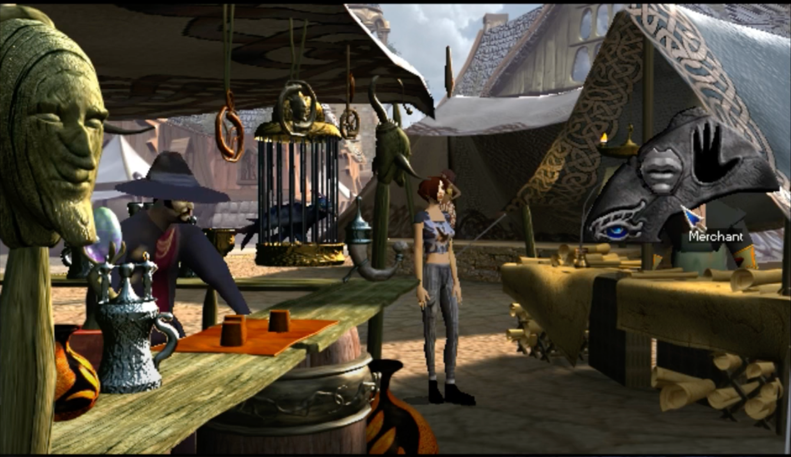

### Managing Inventory 管理库存

Picking things up and carrying them around until they're needed later has been a major feature of adventure gaming since its beginning. Most games implement a limit on the amount of stuff the player can carry. (However, a few did not, for humorous effect: In Haunt, a noncommercial text adventure, the player could be walking through a haunted house wearing a wetsuit and carrying around a stereo, an antique chair, and an oil painting, along with an unlimited number of other items.) With the arrival of graphics, the inventory is usually handled as a pop-up box that shows everything the player is carrying whenever she asks to see it. If the box has a fixed size on the screen, it creates a natural limit on the amount a player can carry. When the box is full, she can't put anything else in it unless she takes something out first.

从一开始，捡起东西并随身携带，直到以后需要它们时为止，这一直是冒险游戏的一大特色。大多数游戏都会限制玩家可以携带的物品数量。(不过，也有少数游戏没有这样做，以达到幽默的效果：在非商业性的文字冒险游戏《Haunt》中，玩家可以穿着潜水衣在鬼屋中穿行，并随身携带音响、古董椅子和油画，以及数量不限的其他物品）。随着图形技术的发展，库存通常被处理成一个弹出框，只要玩家要求查看，它就会显示出玩家携带的所有物品。如果箱子在屏幕上有固定的大小，就会对玩家可携带的物品数量产生自然的限制。当箱子装满后，除非玩家先取出一些东西，否则就无法再放入其他东西。

Inventory management is something the player will need to do frequently, so you should make it as easy as possible. One possibility is to devote a part of the screen to the inventory all the time. This is very easy to work with, although it tends to remind the player that he's using a computer. Its biggest disadvantage is that, unless you sacrifice a lot of screen area or implement a scrollbar, it can't be very big.

库存管理是玩家需要经常做的事情，所以应该尽可能简化。一种方法是在屏幕上划出一部分区域，一直显示库存。这种方法虽然容易让玩家联想到自己在使用电脑，但操作起来还是非常简单的。它的最大缺点是，除非牺牲大量屏幕面积或使用滚动条，否则它不可能很大。

The more common solution is to give the player an inventory menu that she can open and close on demand. She should be able to do this with a single keystroke or button click. It should not obscure the whole screen—that feels like a mode change and tends to destroy suspension of disbelief. Instead, the box, bag, or whatever the inventory looks like should allow the player to drag objects in and out of it, from the game world to the inventory, and vice versa, quickly and efficiently. [The Longest Journey](https://en.wikipedia.org/wiki/The_Longest_Journey) included shortcut keys that allowed players to change the object currently being held in the avatar's hand without opening the inventory box, which was very convenient. Managing the inventory this way also means that you won't have to create animations of the avatar picking up and dropping every possible item in the game. Asheron's Call, an online RPG, includes "pick up" and "drop" animations, but they don't actually show the object in the avatar's hand.

更常见的解决方案是为玩家提供一个可按需打开和关闭的库存菜单。玩家只需敲击一下键盘或点击一下按钮就能完成操作。它不应该遮住整个屏幕--那感觉就像是模式转换，容易破坏悬浮感。取而代之的是，不管是盒子、袋子还是其他什么样子的库存，都应该让玩家能够快速有效地将物品拖进拖出，从游戏世界拖到库存，反之亦然。[《最长的旅程》](https://en.wikipedia.org/wiki/The_Longest_Journey)中的快捷键可以让玩家在不打开库存箱的情况下改变化身手中当前拿着的物品，非常方便。用这种方式管理库存还意味着你不必制作动画，让化身在游戏中拿起和放下每一件可能的物品。在线 RPG 游戏《Asheron's Call》中就有 “拿起 ”和 “放下 ”的动画，但这些动画实际上并不显示在化身手中的物品。

One design error to avoid in adventure games is requiring the player to pick up every thing she sees. Early adventure games listed the "live" objects in a room separately from the room's description, and there was a common tendency to give every object in a game a particular function. This meant that players had to pick up everything they could, often carrying it around for hours without having any idea what it was for. With the advent of 3D-modeled objects, everything in the whole world is (theoretically) available for the player to pick up.

在冒险游戏中要避免的一个设计错误就是要求玩家拿起她看到的每一样东西。早期的冒险游戏将房间中的 “活 ”物品与房间描述分开列出，而且普遍倾向于为游戏中的每件物品赋予特定功能。这就意味着玩家必须捡起所有能捡起的东西，而且往往要随身携带好几个小时，却不知道这些东西有什么用。随着三维建模物体的出现，整个世界的所有东西（理论上）都可以让玩家捡起来。

The inventory is a typical feature of adventure games, but it is not absolutely required. One game, in particular—the LucasArts adventure Loom—was designed without an inventory. The player performed all actions in the game by "spinning" musical spells on a distaff, which was the only thing he carried (see Figure 15.11). Loom was designed to be especially accessible to people who were not already familiar with adventure games. Although it was short and considered by die-hard adventurers to be too easy, it was one of the most imaginative and beautifully executed adventure games ever created.

库存是冒险游戏的典型特征，但并非绝对必要。LucasArts 公司的一款冒险游戏《织布机》在设计时就没有库存。玩家在游戏中的所有操作都是通过在 “纺锤 ”上 “旋转 ”音乐咒语来完成的，而 “纺锤 ”是玩家唯一携带的东西（见图 15.11）。Loom 的设计特别适合不熟悉冒险游戏的人。虽然游戏时间不长，而且冒险游戏的忠实玩家认为游戏过于简单，但它却是有史以来最富想象力、最精美的冒险游戏之一。

Figure 15.11. Loom. Note the musical distaff at the bottom of the screen, used for all actions other than movement. 图 15.11. 织布机。请注意屏幕底部的音乐锤，它用于除移动以外的所有操作。

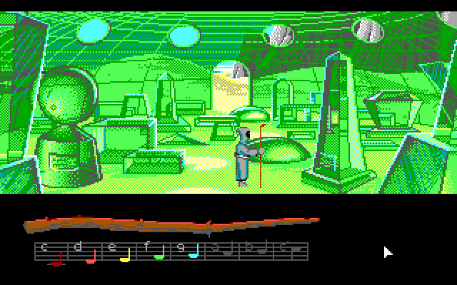

### Special Design Considerations 特殊设计考虑因素

The following special considerations apply especially to adventure games, although there is some crossover with RPGs as well.

以下特别注意事项尤其适用于冒险游戏，不过也与 RPG 有一些交叉。

## Conversations with NPCs 与 NPC 对话

From the original Adventure onward, adventure games have always faced the problem of how to create realistic NPCs in the game world. RPGs have this problem, too, but in most of them, the NPC's conversation is defined by the role to which he's assigned: blacksmith, healer, tavern keeper, and so on. The player doesn't expect to be able to discuss arms and armor with a tavern keeper (although the games might be more interesting, and certainly less formulaic, if he could). But because adventure games are interactive stories, players expect the characters in them to be more human and less mechanical.

从最初的[《魔幻历险》](https://en.wikipedia.org/wiki/Adventure_(1980_video_game))开始，冒险游戏就一直面临着如何在游戏世界中创造真实的 NPC 的问题。RPG 游戏也有这个问题，但在大多数 RPG 游戏中，NPC 的对话是由他所扮演的角色决定的：铁匠、治疗师、酒馆老板等等。玩家并不指望能与酒馆老板讨论武器和盔甲（尽管如果能这样的话，游戏可能会更有趣，当然也不会那么公式化）。但由于冒险游戏是互动故事，玩家希望游戏中的角色更人性化，而不是机械化。

A good many games have tried to sidestep the problem entirely by setting the game in a world where there are extremely few people or none at all. This certainly creates a mysterious atmosphere, but it's suitable only for a limited range of stories. Imagine how Rick's bar in Casablanca would feel if it weren't full of people drinking and gambling. A world with no people in it is artificial and sterile.

很多游戏都试图完全避开这个问题，将游戏设定在一个人迹罕至或根本没有人的世界。这当然能营造出一种神秘的氛围，但只适合于有限的故事。试想一下，如果卡萨布兰卡的里克酒吧里没有人喝酒和赌博，会是什么感觉？一个没有人的世界是人造的，没有生气的。

A few early text-based games tried to implement parsers that could understand limited English sentences as typed by the player, but these seldom succeeded. You got either an NPC saying "I don't understand that" when you had asked a perfectly reasonable question, or an NPC whose answers weren't quite to the point, giving the impression that he was drugged or mentally ill.

早期有几款基于文本的游戏尝试使用解析器来理解玩家输入的有限的英语句子，但很少成功。当你提出一个完全合理的问题时，你得到的要么是一个 NPC 说 “我不明白”，要么是一个 NPC 的回答不完全切题，给人一种他被下药或精神不正常的印象。

### Scripted Conversations 脚本对话

In the end, most adventure game designers gave up on trying to create the impression that you could talk to anyone about anything and devised the scripted conversation, a mechanism that has become the de facto standard for both adventure games and RPGs. A scripted conversation is a branching-tree structure in which each node represents an opportunity for the player to select one of several fixed lines to say from a menu of choices (see Figure 15.12). Depending on which line the player chooses to say, the NPC responds appropriately, and the conversation moves on to a new node in the tree. The contents of the menu change as the conversation progresses; as the NPC says things the player hasn't heard before, the player gets opportunities to ask for elaboration, end the conversation, or switch the subject to a different topic. Another common choice is "Tell me again about…," which enables the player to return to an earlier point in the conversation and go through it again, if he didn't pay close enough attention the first time.

最后，大多数冒险游戏的设计者都放弃了试图营造一种 “你可以和任何人谈论任何事情 ”的印象，而是设计了脚本对话，这种机制已经成为冒险游戏和 RPG 的事实标准。脚本对话是一种分支树结构，其中的每个节点都代表着一个机会，玩家可以从选择菜单中选择几句固定的台词之一（见图 15.12）。根据玩家选择的对话内容，NPC 会做出适当的回应，然后对话会进入树中的新节点。菜单的内容会随着对话的进行而改变；当 NPC 说出玩家以前没听过的话时，玩家就有机会要求详细说明、结束对话或将话题切换到另一个主题上。另一个常见的选择是 “再跟我说一遍......”，如果玩家第一次没有注意听，可以通过这个选项返回到对话的前一个点，再听一遍。

Figure 15.12. The conversation menu in The Lost Files of Sherlock Holmes. 图 15.12. 福尔摩斯探案集》中的对话菜单。

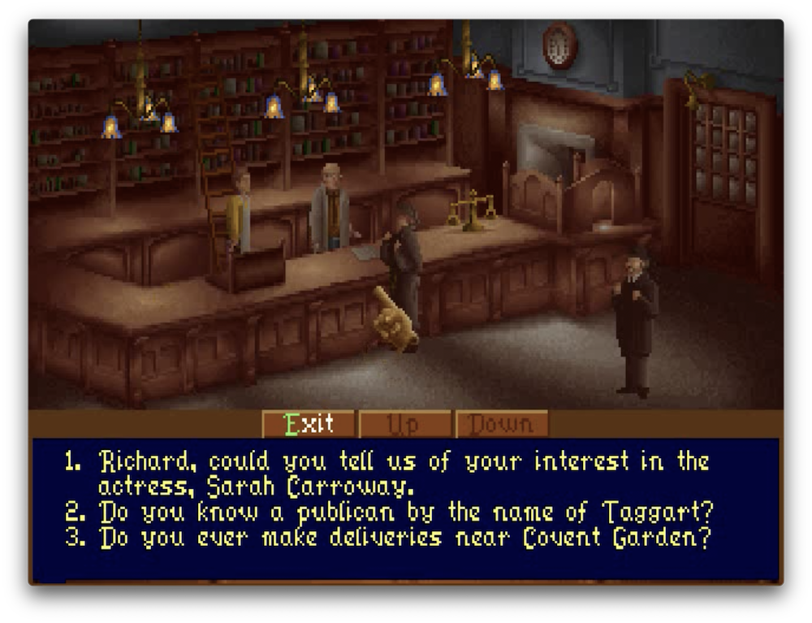

### Benefits of Scripted Conversations 脚本对话的优势

Although the scripted conversation forces the player to say only the things in the script, it does produce natural-sounding conversations, in which the sequence of remarks and replies is plausible. It also gives you, the designer, a way to illustrate both the avatar's and the NPC's character through something other than their appearances. You can write their lines in such a way that you give them distinct personalities of their own. For example, Guybrush Threepwood, the hero of the Monkey Island games, is a wise guy type who seldom takes anything seriously. The character's vocabulary, grammar, dialect, and—if the game has recorded audio of the conversation—tone of voice and accent are all important cues.

虽然脚本对话迫使玩家只能说脚本中的内容，但它确实能产生听起来自然的对话，其中的发言和回答顺序都是可信的。它还为设计者提供了一种方法，让你可以通过化身和 NPC 的外表以外的东西来说明他们的性格。你可以在编写台词时赋予他们自己鲜明的个性。例如，《猴岛小英雄》游戏的主人公盖布拉许‧崔普伍德是一个聪明人，他很少认真对待任何事情。角色的词汇、语法、方言以及（如果游戏录制了对话音频）语音语调和口音都是重要的线索。

In addition to letting the player discuss a variety of topics with a given NPC, the menu system allows the player to choose a variety of different attitudes in which she says the same thing: aggressive, deferential, formal, or flippant, for example. The NPC can then respond to each of these in whatever way his character dictates. For example, a powerful character who brooks no nonsense might be offended by wisecracks and refuse to talk to the player anymore. (If you do this and the NPC's information is vital to the plot, make sure that either the NPC gets over his snit after a while or there's some other way for the player to obtain the information.)

除了让玩家与特定的 NPC 讨论各种话题外，菜单系统还允许玩家选择 NPC 说同一件事时的各种不同态度：例如，咄咄逼人、恭敬、正式或轻浮。然后，NPC 可以根据自己的性格做出相应的反应。例如，一个不喜欢废话的强大角色可能会被俏皮话冒犯，并拒绝再与玩家交谈。(如果你这样做了，而该 NPC 的信息对剧情又至关重要，那么要确保该 NPC 过一段时间就会恢复正常，或者玩家可以通过其他方式获得信息）。

The scripted conversation is not merely a mechanism for giving the player information, however. It's a real part of the gameplay, and the player's choices can have a distinct effect on the progress of the game. For example, an NPC could ask the player to entrust him with a valuable secret. The player's decision, whether to tell or not to tell, could have far-reaching consequences. The player has to choose based on her assessment of the NPC's character—to which you, the designer, must provide clues.

然而，脚本对话不仅仅是向玩家提供信息的机制。它是游戏的真正组成部分，玩家的选择会对游戏进程产生明显的影响。例如，一个 NPC 可能会要求玩家将一个宝贵的秘密托付给他。玩家的决定--告诉还是不告诉--可能会产生深远的影响。玩家必须根据自己对 NPC 性格的评估来做出选择，而作为设计者，你必须提供线索。

## Mapping 绘制地图

When playing text adventures, players usually needed to make a map for themselves as they went along. Because the rooms were not physically modeled but were only described, it was difficult for the players to remember how the rooms were related to one another. A lot of text adventure worlds were also purposefully illogical, so a map was really important for keeping track of the relationships between different areas.

在玩文字冒险游戏时，玩家通常需要边玩边为自己绘制地图。因为房间没有实体模型，只有描述，玩家很难记住房间之间的关系。很多文字冒险世界也是故意不符合逻辑的，因此地图对于掌握不同区域之间的关系非常重要。

With the arrival of graphic adventures, mapping became less critical because the graphics provided cues about where the player was and how his current location related to other areas in the world. However, we think it's a good idea to give the player a map. A few games deliberately deny the player a map to make the game more difficult, but this is usually poor design—an obstacle that slows down the player without providing any entertainment value. There's not a lot of fun in being lost. If you force the player to make his own map, he has to constantly look away from the screen to a sketch pad at his side; that's a tedious business that rapidly destroys suspension of disbelief.

随着图形冒险的出现，地图变得不那么重要了，因为图形会提示玩家所在的位置，以及他当前的位置与世界中其他区域的关系。不过，我们认为给玩家提供地图是个好主意。有一些游戏故意不给玩家提供地图，以增加游戏难度，但这通常是拙劣的设计--这种障碍会拖慢玩家的速度，却不会带来任何娱乐价值。迷失方向并没有什么乐趣可言。如果你强迫玩家自己绘制地图，他就必须不断地把目光从屏幕移到身边的草稿纸上；这是一件乏味的事情，会迅速破坏玩家的不信任感。

The map that you give the player doesn't have to be complete at the beginning of the game; it can start out empty and be filled in as the player moves around, a process called automapping. The player should be able to refer to his map conveniently at any time. It's also a good idea to give the player a compass to tell him which direction he's facing.

在游戏开始时，你给玩家的地图并不一定是完整的；它可以一开始是空的，然后随着玩家的移动逐渐填满，这个过程称为自动映射。玩家应该能够随时方便地参考自己的地图。最好还能给玩家一个指南针，告诉他所处的方向。

Automapping destroys the challenge imposed by mazes, but we think mazes are one of the most overused and least-enjoyed features of adventure games. Unless you have a good reason for including a maze and can construct one that's really clever and fun to be in, don't do it.

自动映射破坏了迷宫所带来的挑战，但我们认为迷宫是冒险游戏中最常用、最不受欢迎的功能之一。除非你有充分的理由在游戏中加入迷宫，而且迷宫设计得非常巧妙有趣，否则就不要加入迷宫。

## Journal Keeping 记日记

Another common feature of adventure games—one that is conceptually similar to automapping—is automatic journal keeping. The game fills in a journal with text as the player goes along, recording important events or information she has learned. If the plot is convoluted or there are large numbers of characters in the game, the journal is an invaluable reference tool for the player. Let her call it up and look at it at any reasonable time (though not, perhaps, while hanging over the edge of a cliff or being interrogated by a mean bad guy). As with conversations with NPCs, the journal gives you an opportunity to define the avatar's character through her use of language.

冒险游戏的另一个共同特点--在概念上与自动映射类似--是自动记日记。游戏会在玩家前进的过程中用文字填写日志，记录重要事件或玩家了解到的信息。如果情节错综复杂，或者游戏中的角色数量众多，那么日志对玩家来说就是非常宝贵的参考工具。让她在任何合理的时间调出并查看日记（不过在悬崖边或被凶恶的坏人审问时可能不行）。就像与 NPC 对话一样，日记让你有机会通过化身的语言来定义她的性格。

## A Few Things to Avoid 应避免的几件事

As adventure games have evolved, their designers have created many different kinds of puzzles and experiences for the player. Some of these are extremely clever, such as the insult-driven sword fight in [The Secret of Monkey Island](https://en.wikipedia.org/wiki/The_Secret_of_Monkey_Island). A good many others, however, proved to be only tiresome time wasters, obstacles that added no entertainment value to the game.

随着冒险游戏的发展，设计师们为玩家设计了许多不同类型的谜题和体验。其中有些非常巧妙，比如[《猴岛的秘密》](https://en.wikipedia.org/wiki/The_Secret_of_Monkey_Island)中的嘴炮斗剑。然而，很多其他的谜题都被证明是令人厌烦的浪费时间的障碍，没有给游戏增添任何娱乐价值。

### Puzzles Solvable Only by Trial and Error 谜题只能通过尝试和错误来解决

If you give the player a puzzle that has a fixed number of possible solutions of equal probability (in effect, a combination lock), but no hints about which one is right, then the player simply has to try them all. The Infocom text adventure Infidel included a puzzle like this: Four statues of Egyptian goddesses had to be lined up in the correct order, but there were no clues about what it might be. The player simply had to try all 24 possible combinations and keep track of the ones she had already done. There's not much fun in that.

如果给玩家一个谜题，它有固定数量的概率相等的可能解法（实际上就是一把密码锁），但没有提示哪一种解法是正确的，那么玩家就必须尝试所有的解法。Infocom 文字冒险游戏《Infidel》中就有这样一道谜题：四座埃及女神像必须按照正确的顺序排列，但没有任何提示。玩家只需尝试所有 24 种可能的组合，并记录已经完成的组合。这样做并没有什么乐趣。

### Conceptual Non Sequiturs 概念性非连续谜题

This is a variant of the trial-and-error puzzle, a problem whose solution requires thinking so lateral that it's completely irrational. A conceptual nonsequitur is something along the lines of "Put the lampshade on the bulldozer" or "Sharpen the headphones with the banana." A few games try to get away with this by claiming that it's surrealism, but true surrealism is informed by some kind of underlying point; it's not just random weirdness.

这是 “试错谜题 ”的一种变体，是一种需要进行横向思考，以至于完全不合理的问题。概念性无序问题就是 “把灯罩放在推土机上 ”或 “用香蕉削耳机 ”之类的问题。一些游戏试图通过声称这是超现实主义来摆脱这种情况，但真正的超现实主义是有某种基本观点的；它并不只是随机的怪异现象。

A variant of this is the opposite-reaction puzzle, one whose solution turns out to be the exact opposite of what you'd expect. You could give the player a rubber dagger and then have it turn out to be a deadly weapon after all. In the original Adventure, the player could drive away a menacing snake by releasing a little bird from its cage. Fortunately, at this point in the game, the player didn't have many options, so he usually found the solution soon. But unless you design an entire game on this principle, it's just an annoying gimmick.

相反反应谜题是这种谜题的一种变体，它的谜底与你的预期完全相反。你可以给玩家一把橡胶匕首，然后让它变成致命武器。在最初的[《魔幻历险》](https://en.wikipedia.org/wiki/Adventure_(1980_video_game))中，玩家可以通过从笼子里放出一只小鸟来驱赶一条来势汹汹的蛇。幸运的是，在游戏的这个阶段，玩家没有太多选择，所以通常很快就能找到解决办法。但是，除非你根据这一原则设计整个游戏，否则这只是一个恼人的噱头。

### Illogical Spaces 不合逻辑空间

Illogical spaces were a classic challenge in text adventures. If you went north from room A, you got to room B, but if you went south from room B, you didn't go back to room A. Their modern equivalent is teleporters that give you no idea of where you have teleported to. The player simply has to wander around taking notes until she can figure out the relationships among the various locations. Unless you offer some clues, this is another problem that can be solved only by trial and error.

不合逻辑的空间是文字冒险游戏中的一个经典挑战。如果你从 A 房间向北走，就能到达 B 房间，但如果你从 B 房间向南走，就回不到 A 房间。玩家只需四处游荡，做笔记，直到弄清各个地点之间的关系。除非你提供一些线索，否则这又是一个只能通过反复试验才能解决的问题。

### Puzzles Requiring Outside Knowledge 需要外部知识的谜题

Many adventure games rely on some occasional oddities, especially for comic effect, but the player must have a realistic chance of figuring them out. If a game requires information from a source other than itself, it's unfair to the player. For example, Haunt had puzzles that could be solved only if the player was familiar with the 1960s-era cartoon series Beany and Cecil ("Help, Cecil, help!") and with the movie Monty Python and the Holy Grail. It didn't really matter because Haunt was distributed for free and was mostly a joke anyway, but in a commercial game, such puzzles would be unreasonable unless you explicitly made it clear that knowledge of trivia was required. If you want to make humorous references to popular TV shows, movies, and so on, do them in narrative or in an NPC's conversation rather than as solutions to puzzles. Beware, though: Cultural references age very quickly and will make the game seem dated after a few years.

许多冒险游戏都会偶尔出现一些怪事，尤其是为了达到喜剧效果，但玩家必须有现实的机会去解开它们。如果一款游戏需要玩家从游戏本身以外的渠道获取信息，这对玩家是不公平的。例如，《Haunt》中有一些谜题，只有当玩家熟悉 20 世纪 60 年代的卡通系列片《Beany 和 Cecil》（“救命啊，Cecil，救命啊！”）和电影《巨蟒与圣杯》（Monty Python and the Holy Grail）时才能解开。其实这并不重要，因为《Haunt》是免费发行的，而且主要是个玩笑，但在商业游戏中，除非明确说明需要了解琐事，否则这样的谜题是不合理的。如果你想幽默地引用流行的电视节目、电影等，可以在叙述中或在 NPC 的对话中引用，而不是作为谜题的答案。不过要注意：文化引用会很快老化，几年后就会让游戏显得过时。

You have to be even more careful when developing games for foreign markets because other countries don't always have the same idioms. For example, the action "Wear the lampshade on my head" could cause other characters in the game to assume that the player's avatar is drunk, which might be desirable in the context of the story. However, wearing a lampshade as a sign of drunkenness is an American cultural idiom that might not be understood in Japan, for example. Again, it's okay to make cultural references in your game; just be careful about requiring the user to understand them to win.

在为国外市场开发游戏时，你必须更加小心，因为其他国家的习惯用语并不总是一样的。例如，“Wear the lampshade on my head”（把灯罩戴在头上）这一动作可能会让游戏中的其他角色认为玩家的化身喝醉了，这在故事情节中可能是可取的。然而，把灯罩戴在头上表示醉酒是美国的文化习惯用语，日本人可能无法理解。再次强调，在游戏中引用文化典故是可以的，但在要求用户理解这些文化典故以赢得游戏时要小心谨慎。

### Click-the-Right-Pixel Puzzles 点击正确像素谜题

A few adventure games with point-and-click user interfaces require you to click on a tiny and inconspicuous area of the screen to advance the story, for no particular reason except that it's difficult to find. This is lazy design—a cheap way of creating an obstacle for the player without any entertainment value.

一些采用点击式用户界面的冒险游戏要求你点击屏幕上一个不起眼的小区域来推进故事情节，除了这个区域很难找到之外，没有其他特别的原因。这是一种懒惰的设计--一种为玩家制造障碍的廉价方法，没有任何娱乐价值。

### Backward Puzzles 逆向谜题

A backward puzzle is one in which you find the solution before you find the puzzle itself. For example, you find a key, but you don't know of any locked doors. However, you carry it around with you all the time, just in case. When you do eventually find a locked door, you immediately have the solution, which means it's not much of a puzzle. It's not always possible to prevent the player from finding a solution before he finds a puzzle because the solution has to be available, but it can be inconspicuous—for example, a poster on a wall full of posters, or an object in a trash can. Be aware, however, that "inconspicuous" is not the same as "obscure" or "nonsensical." If the key to a puzzle involves finding a live monkey, the monkey shouldn't turn out to be locked in a freezer.

逆向谜题是指在找到谜题本身之前，先找到谜底。例如，你找到了一把钥匙，但你不知道有什么锁着的门。但是，为了以防万一，你还是一直带着它。当你最终找到一扇上锁的门时，你马上就能找到答案，这就意味着这并不是什么谜题。在玩家找到谜题之前，并不总能阻止他找到谜底，因为谜底必须是可用的，但它可以是不起眼的--例如，满墙的海报上的一张海报，或者垃圾桶里的一件物品。但是要注意，“不起眼 ”并不等于 “晦涩难懂 ”或 “毫无意义”。如果谜题的关键是要找到一只活猴子，那么这只猴子就不应该被锁在冰箱里。

### Too Many "FedEx" Puzzles 联邦快递 "谜题太多

A FedEx puzzle is one that you solve by picking up an object from one place and bringing it to a different place, as if you were a Federal Express driver. Of course, carrying objects around until you find a place to use them is a common feature of adventure games, but some games consist of little else. This gets dull after a while, especially if the solution to a puzzle consists only of fetching and carrying without any lateral thinking or other activity. Liven up the game with a variety of puzzles and tasks. It's fun to include objects that have a variety of different uses, such as Indy's bullwhip in [Indiana Jones and the Infernal Machine](https://en.wikipedia.org/wiki/Indiana_Jones_and_the_Infernal_Machine), or objects that are left over from one puzzle but have a part to play in another.

联邦快递（FedEx）谜题是指玩家通过从一个地方拾取一个物品并将其带到另一个地方来解决谜题，就好像你是一名联邦快递司机一样。当然，带着物品到处跑，直到找到可以使用它们的地方是冒险游戏的一个共同特点，但有些游戏几乎没有其他内容。这样的游戏玩久了就会变得枯燥乏味，尤其是如果谜题的解答仅仅是取物和搬运，而没有任何横向思维或其他活动的话。用各种谜题和任务来活跃游戏气氛。在游戏中加入一些有多种不同用途的物品，比如《夺宝奇兵与无间道》中印第的牛鞭，或者在一个谜题中遗留下来但在另一个谜题中发挥作用的物品，都会很有趣。

> **Adventure Game Worksheet 冒险游戏工作表**
> 
> When beginning the design of an adventure game, consider the following questions:
> 
> 开始设计冒险游戏时，请考虑以下问题：
> 
> 1. Who is the central character in the game, the player's avatar? What is the avatar's sex? (For the purposes of this worksheet, we'll assume that the player is male and the avatar is female.) What does she look and sound like? What are her personal qualities, strengths, weaknesses, interests, likes, and dislikes? What sort of vocabulary and grammar does she use? What are her ethnic, social, religious, political, and educational backgrounds? What is her personal history? What is her family like?\
> 游戏中的中心人物，即玩家的化身是谁？化身的性别是什么？ 在本工作表中，我们假设玩家是男性，化身是女性。她的长相和声音是怎样的？她有哪些个人品质、优点、缺点、兴趣、喜好和厌恶？她使用什么样的词汇和语法？她的种族、社会、宗教、政治和教育背景是什么？她的个人经历如何？她的家庭情况如何？
> 
> 2. What is the story of the game? What is the avatar's ultimate goal? What will occur at the dramatic climax? What things must she collect, learn, or achieve for the dramatic climax to take place?\
> 游戏的故事是什么？化身的最终目标是什么？戏剧性的高潮会发生什么？要达到戏剧性的高潮，她必须收集、学习或实现哪些东西？
> 
> 3. Where does the game take place? What sort of a world is this? Is the player free to move around these areas continuously throughout the story, or do one-way elements prevent him from returning to earlier areas?\
> 游戏发生在哪里？这是一个怎样的世界？玩家是否可以在整个故事中不断地在这些区域自由移动，还是单向元素会阻止他返回之前的区域？
> 
> 4. What other characters are in the game? What functions do they serve? How do they look and act? How do they respond to the avatar? Can she affect their moods and attitudes?\
> 游戏中还有哪些角色？他们有什么功能？他们的外表和行为如何？他们如何回应化身？她能影响他们的情绪和态度吗？
> 
> 5. How is conversation implemented? What consequences can arise from it? Can the player choose a variety of attitudes in which to speak?\
> 如何进行对话？对话会产生什么后果？玩家可以选择不同的对话态度吗？
> 
> 6. What kinds of puzzles are in the game? What obstacles will the player encounter, and what actions will he be able to take to overcome them? Is this a pure adventure game or an action-adventure? If it's an action-adventure, what are the action elements like?\
> 游戏中有哪些谜题？玩家会遇到哪些障碍，可以采取哪些行动来克服这些障碍？这是一款纯粹的冒险游戏还是动作冒险游戏？如果是动作冒险游戏，动作元素是什么？
> 
> 7. What graphics technology will be used to display the world? 2D backgrounds? Real-time 3D? How will this affect the look and richness of the world?\
> 将使用什么图形技术来显示世界？2D 背景？实时三维？这将如何影响世界的外观和丰富性？
> 
> 8. What perspective will the player have on the game setting? Context sensitive? First person? Third person?\
> 玩家将以何种视角来观察游戏场景？情境感应？第一人称？第三人称？
> 
> 9. What is the user interface for moving the avatar around the game world? Will it be point-and-click, direct control, or some other mechanism?\
> 在游戏世界中移动化身的用户界面是什么？是点击、直接控制还是其他机制？
> 
> 10. How does the player recognize active objects in the world? How does he command the game to manipulate them? What verbs are available for each object?\
> 玩家如何识别世界中的活动物体？如何命令游戏操纵它们？每个物体有哪些动词？
> 
> 11. Is there an inventory, and, if so, how is it displayed and used? How does the player pick things up and put them down again? Can objects be combined or used together? How is this handled?\
> 是否有库存，如果有，如何显示和使用？玩家如何取放物品？物体可以组合或一起使用吗？如何处理？
> 
> 12. Does the player need a map? If so, will it be static or maintained automatically?\
> 玩家需要地图吗？如果需要，它是静态的还是自动维护的？
> 
> 13. Should the game keep a journal to help the player remember things?\
> 游戏是否应该写日记帮助玩家记忆？

# Putting It Together 总结

Adventure games are seldom a technological challenge to build unless you're trying to include powerful artificial intelligence techniques—natural language recognition or generation, for example. They rarely demand a lot of CPU power. But what they lack in technological challenges they make up for in creative ones. As the designer of an adventure game, it's your job to bring not just a story, but a world to life—a world in which a story is taking place. Your talents at creating places, characters, plots, dialogue, and puzzles will be tested as in no other genre. Because the adventure game is not bound to flying or shooting or commanding troops in battle—indeed, not to any particular mode of interaction at all—it has the greatest potential for design creativity of any genre.

冒险游戏在开发上很少构成技术挑战，除非你试图融入强大的人工智能技术——例如自然语言识别或生成。它们通常并不需要大量的 CPU 运算能力。但它们在技术挑战上的缺乏，却在创意挑战上得到了弥补。作为冒险游戏的设计者，你的任务不仅是呈现一个故事，而是要让一个世界活起来——一个故事正在发生的世界。你在创造场景、角色、情节、对话和谜题方面的才能，在这一类型游戏中将受到前所未有的考验。因为冒险游戏并不局限于飞行、射击或指挥战斗中的部队——实际上，它不受限于任何特定的交互模式——它拥有所有游戏类型中最大的设计创意潜力。

All computer games are made to realize dreams. Adventure games realize the strangest dreams of all.

所有电脑游戏都是为了实现梦想而制作的。冒险游戏实现的是最奇特的梦想。