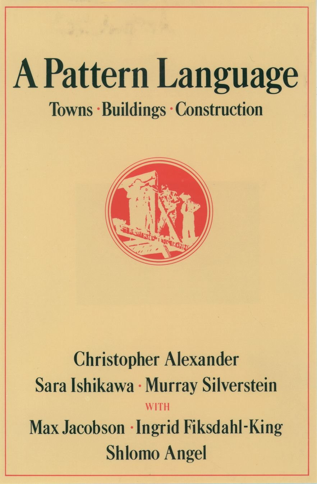
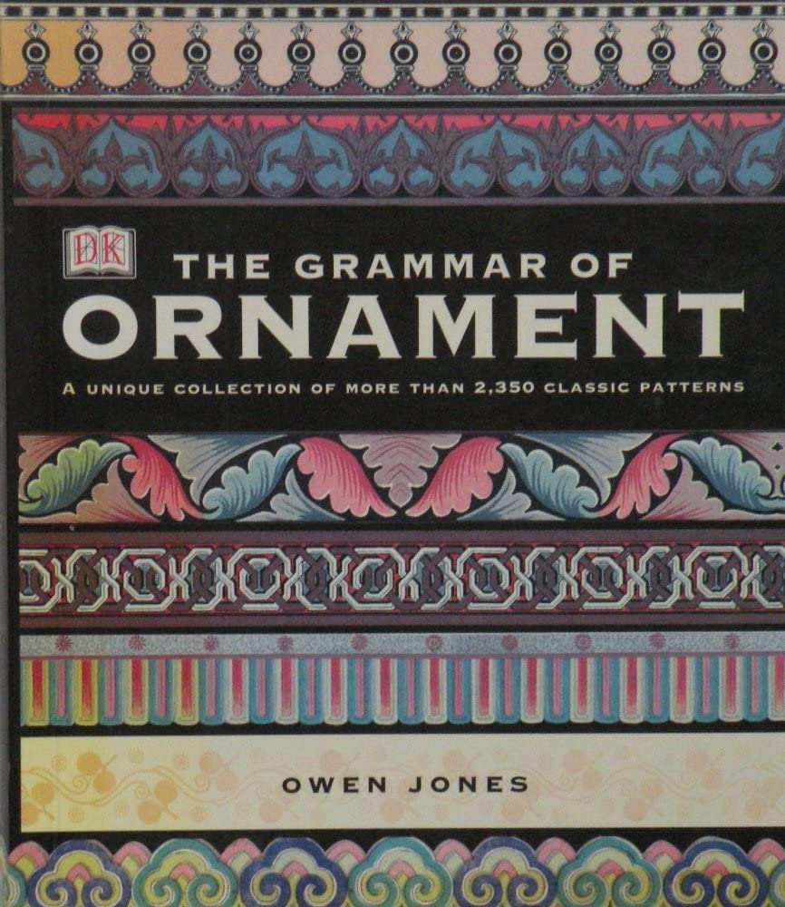

# Architecture and Graphic Design

Not being artists or graphic designers ourselves, we don't have an extensive list of suggestions; but we have found the following useful or inspiring:

我们自己既不是艺术家也不是平面设计师，因此没有广泛的建议清单；但我们发现以下书籍很有用或很有启发性：

Cover 封面 | Book 书名 | Author 作者 | Publisher 出版社 | ISBN | Comment 评论
:---: | --- | --- | --- | --- | --- 
 | A Pattern Language: Towns, Buildings, Construction 模式语言：城镇，建筑，结构	 | Christopher Alexander, et al. | Oxford University Press | [0195019199](https://www.amazon.com/dp/0195019199) | This work created something of a revolution in architectural theory when it appeared, adopting a practical/psychological approach to the way people use buildings. Some of its ideas formed the basis for [The Sims](https://en.wikipedia.org/wiki/The_Sims).  这部作品一经问世就在建筑理论界掀起了一场革命，它采用了一种实用的/心理学的方法来研究人们使用建筑物的方式。其中一些观点构成了[《模拟人生》](https://en.wikipedia.org/wiki/The_Sims)的基础。 
 |The Grammar of Ornament 装饰的语法 | Owen Jones | DK Pub |[0789476460](https://www.amazon.com/dp/0789476460) | Various editions exist, including one on CD-ROM. A massive collection of decorative elements.  有多种版本，包括一个光盘版本。收集了大量装饰元素。
 |L'Ornement Polychrome 多彩的装饰 | Albert Racinet | HACHETTE BNF | [2329986009](https://www.amazon.com/dp/2329986009) |  Various editions. Another massive collection of decorative elements. Don't worry about the fact that it's in French—just look at the pictures.  有多种版本。另一本大量装饰元素的作品集。别担心这是法文版，看看图片就行。

The next three books comprise a series and should be read in this order. Don't be put off by the long-winded titles. They are invaluable tools for learning to express numeric quantities visually, something every game designer must do:

接下来的三本书是一个系列，应该按照这个顺序阅读。不要被冗长的书名所迷惑。它们是学习直观表达数字量的宝贵工具，是每个游戏设计师都必须做的：

Book 书名 | Author 作者 | Publisher 出版社 | ISBN
--- | --- | --- | ---
The Visual Display of Quantitative Information 量化信息的视觉展示	 |  Edward R. Tufte | Graphics Press | [0961392142](https://www.amazon.com/dp/0961392142)
Envisioning Information 设想信息 |  Edward R. Tufte | Graphics Press | [0961392118](https://www.amazon.com/dp/0961392118)
Visual Explanations: Images and Quantities, Evidence and Narrative 视觉解释：图像与数量、证据与叙述	 |  Edward R. Tufte | Graphics Press | [0961392126](https://www.amazon.com/dp/0961392126)