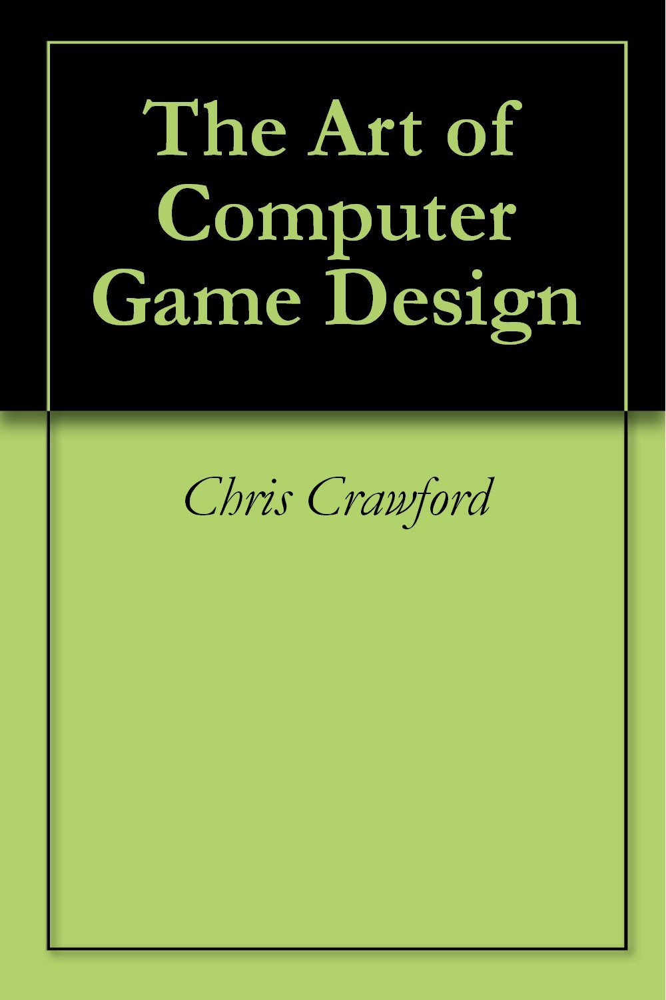
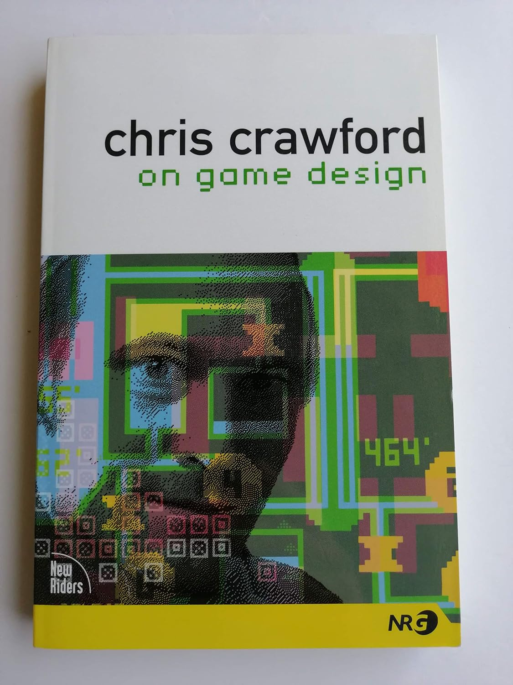
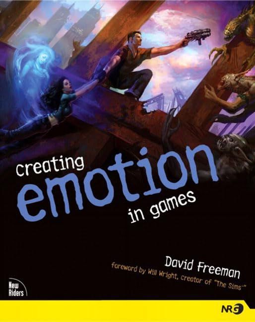
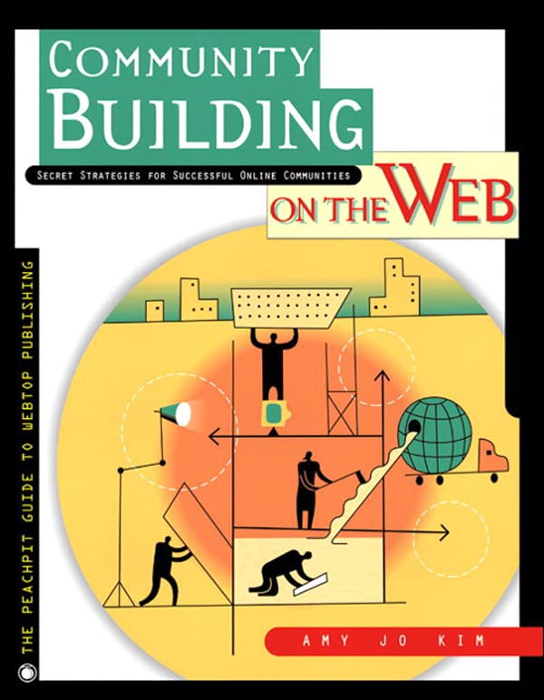
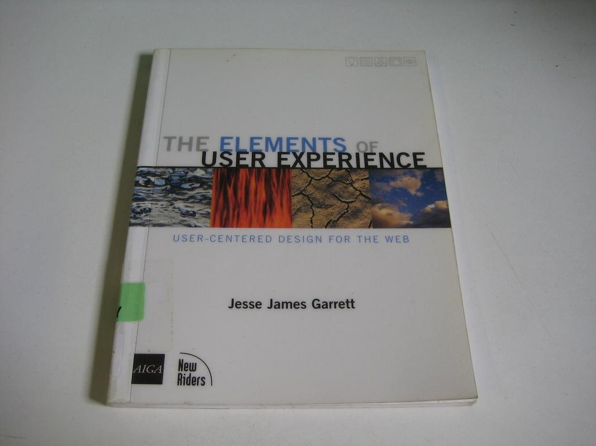
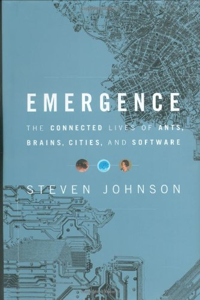
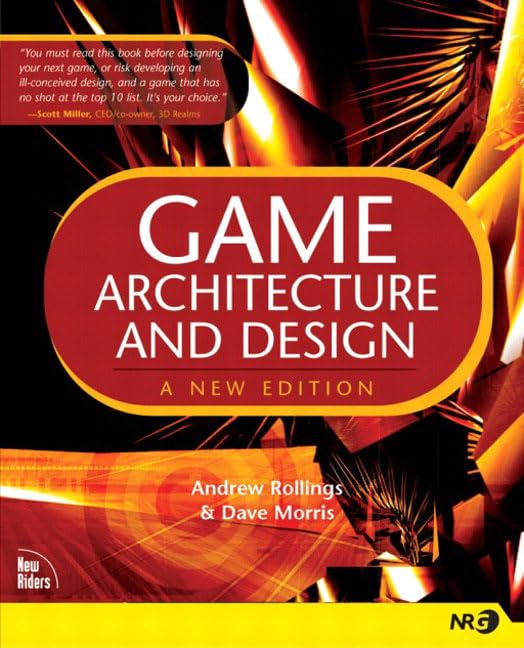
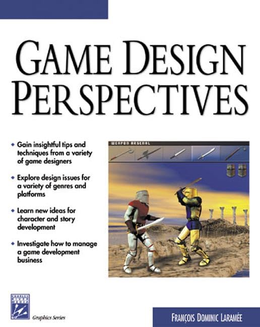
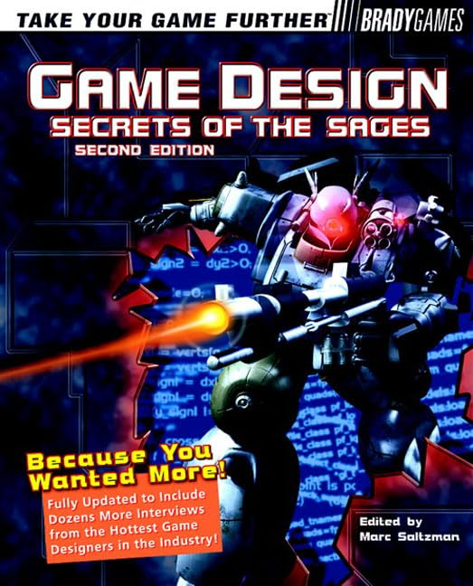
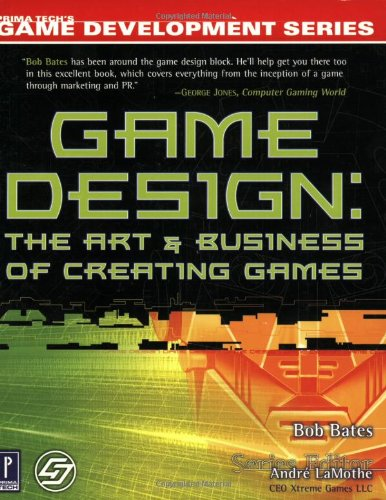

# Game Design 游戏设计

There aren't a great many other books on game design (that's part of why we wrote this one), but we think some of the following offer useful perspectives:

关于游戏设计的其他书籍并不多（这也是我们写这本书的部分原因），但我们认为以下一些书籍提供了有用的视角：

Cover 封面 | Book 书名 | Author 作者 | Comment 评论
:---: | --- | --- | ---
 | [The Art of Computer Game Design 电脑游戏设计艺术](https://www.amazon.com/dp/B0052QA5WU) | Chris Crawford  | Probably the first book in the field, and a classic. This book is no longer in print. Crawford will also soon be publishing a new work, Chris Crawford on Game Design (©2004, New Riders Publishing), to which we look forward with interest.  这可能是该领域的第一本书，也是一本经典之作。这本书已不再印刷。克劳福德不久还将出版新作《克里斯·克劳福德谈游戏设计》（©2004，新骑士出版社），我们对此充满期待。
 | [Chris Crawford on Game Design 克里斯·克劳福德谈游戏设计](https://www.amazon.com/dp/0131460994) | Chris Crawford |  
 | [Creating Emotion in Games: The Art and Craft of Emotioneering 在游戏中创造情感：情感设计的艺术与工艺](https://www.amazon.com/dp/1592730078) | David Freeman | 
 | [Community Building on the Web: Secret Strategies for Successful Online Communities 网络社区建设：成功网络社区的秘密策略](https://www.amazon.com/dp/B004SHDFH6) | Amy Jo Kim |Although this isn't technically a game design book, it is a highly regarded work on online communities and should be considered required reading for anyone who wants to build an online game or persistent world.  虽然从严格意义上讲，这不是一本游戏设计书籍，但它是一本备受推崇的网络社区著作，应该被视为任何想要构建网络游戏或持久世界的人的必读书。
 | [The Elements of User Experience 用户体验的要素](https://www.amazon.com/dp/0735712026)	 | Jesse James Garrett |
 | [Emergence: The Connected Lives of Ants, Brains, Cities, and Software 涌现：蚂蚁、大脑、城市和软件的互联生活](https://www.amazon.com/dp/068486875X) | Steve Johnson | 
 | [Game Architecture and Design 游戏架构与设计](https://www.amazon.com/dp/0735713634) | Andrew Rollings/Dave Morris | Originally published by The Coriolis Group and soon to be reissued by New Riders. A giant tome on designing and building computer and video games from start to finish. It is the companion volume to this one.  最初由科里奥利集团出版，不久将由 New Riders 再版。这是一本从头到尾介绍如何设计和制作电脑游戏和视频游戏的巨著。它是这本书的配套书籍。
 | [Game Design Perspectives 游戏设计视角](https://www.amazon.com/dp/1584500905) | Francois Dominic Laramee | This is an extensive collection of essays by a variety of people on different topics, not all of them game design.  这是一本内容广泛的论文集，收录了不同人士关于不同主题的文章，但并非都是游戏设计方面的文章。
 | [Game Design Secrets of the Sages 圣人的游戏设计秘诀](https://www.amazon.com/dp/1566869870/) | Marc Saltzman (editor) | | A collection of interviews with some of the top people in the business. In this form, it's more useful as background reading than how-to material, but it's a good way to see inside the heads of some of the industry's best designers.  一些业内顶尖人物的访谈集。在这种形式下，它更适合作为背景读物，而不是如何操作的材料，但它是了解业内最优秀设计师内心世界的好方法。
 | [Game Design: The Art & Business of Creating Games 游戏设计：创作的艺术与商业](https://www.amazon.com/dp/0761531653) | Bob Bates | More of an introduction to the entire game business than a game design book. It's easy to read and nicely illustrated, and Bob Bates' credentials are impeccable.  与其说它是一本游戏设计书，不如说它是对整个游戏行业的介绍。这本书通俗易懂，图文并茂，鲍勃·贝茨的资历也无可挑剔。
 | [Swords & Circuitry: A Designer's Guide to Computer Role-Playing Games 剑与电：电脑角色扮演游戏的设计师指南](https://www.amazon.com/dp/0761532994) | Neal Hallford/Jana Hallford |  