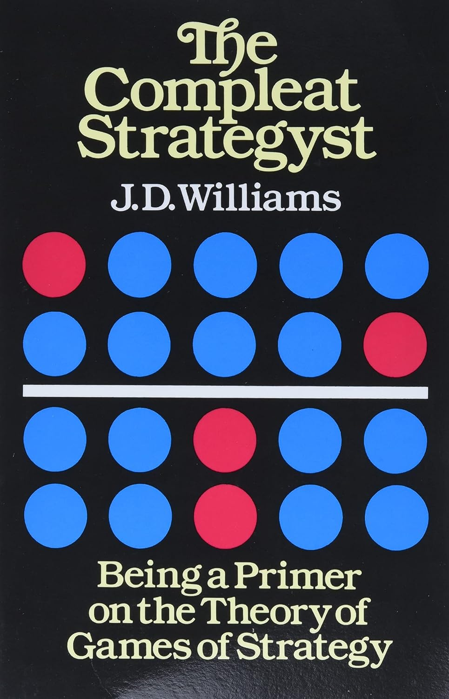
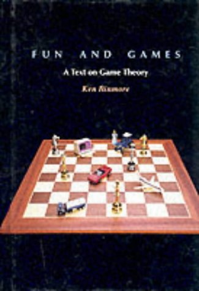
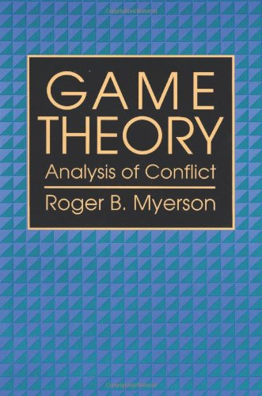

# Game Theory 游戏理论

Formal game theory is too abstruse for day-to-day use in game design, but some of the following works offer a lighter analysis:

正式的博弈论过于深奥，不适合游戏设计的日常使用，但以下一些作品提供了浅显易懂的分析：

Cover 封面 | Book 书名 | Author 作者
:---: | --- | ---
 | [The Compleat Strategyst: Being a Primer on the Theory of Games of Strategy 全能策略家：策略博弈理论入门](https://www.amazon.com/dp/0486251012) | J. D. Williams |
 | [Fun and Games: A Text on Game Theory 乐趣与游戏：博弈论导论](https://www.amazon.com/dp/0669246034) | Ken Binmore
 | [Game Theory: Analysis of Conflict 博弈论：冲突分析](https://www.amazon.com/dp/0674341163) | Roger B. Myerson