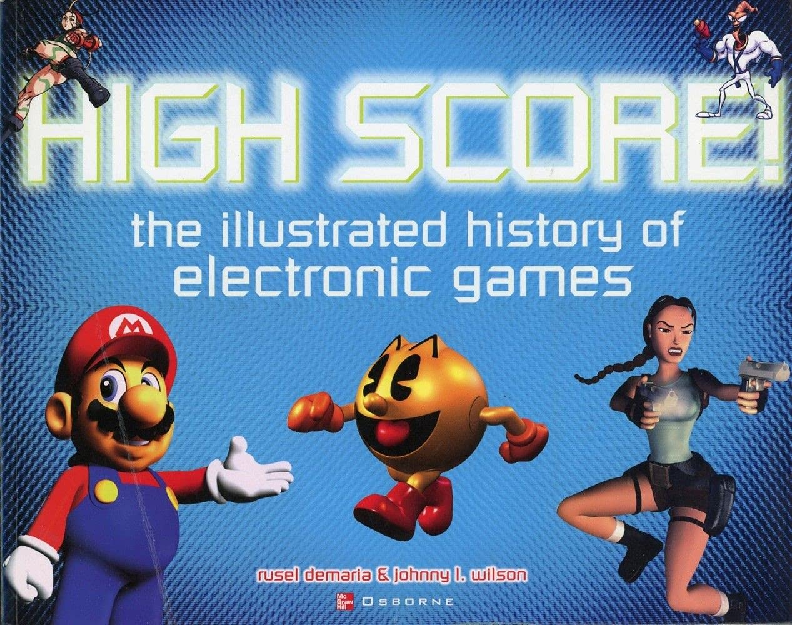
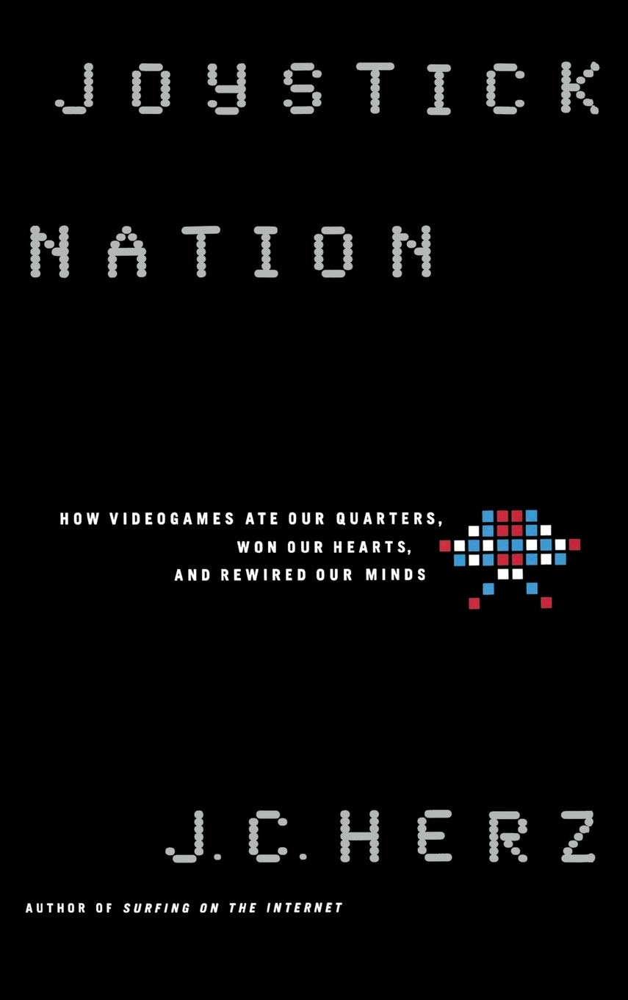
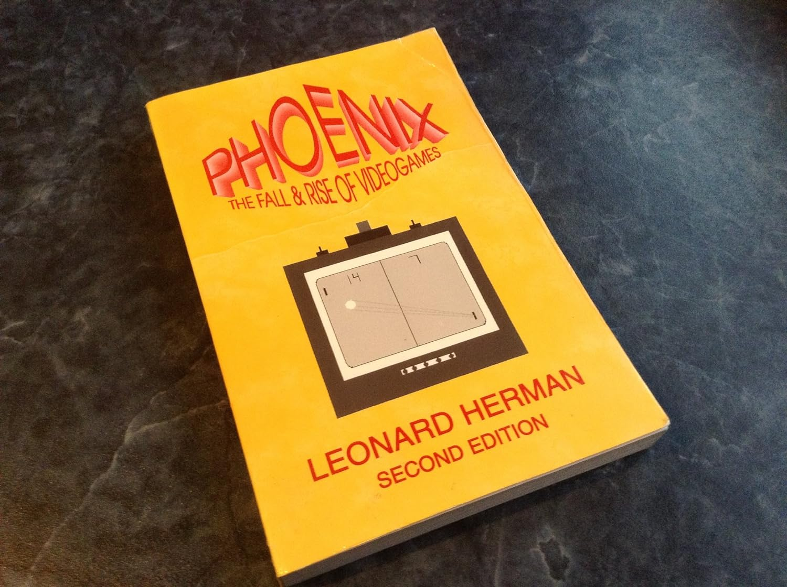
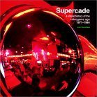
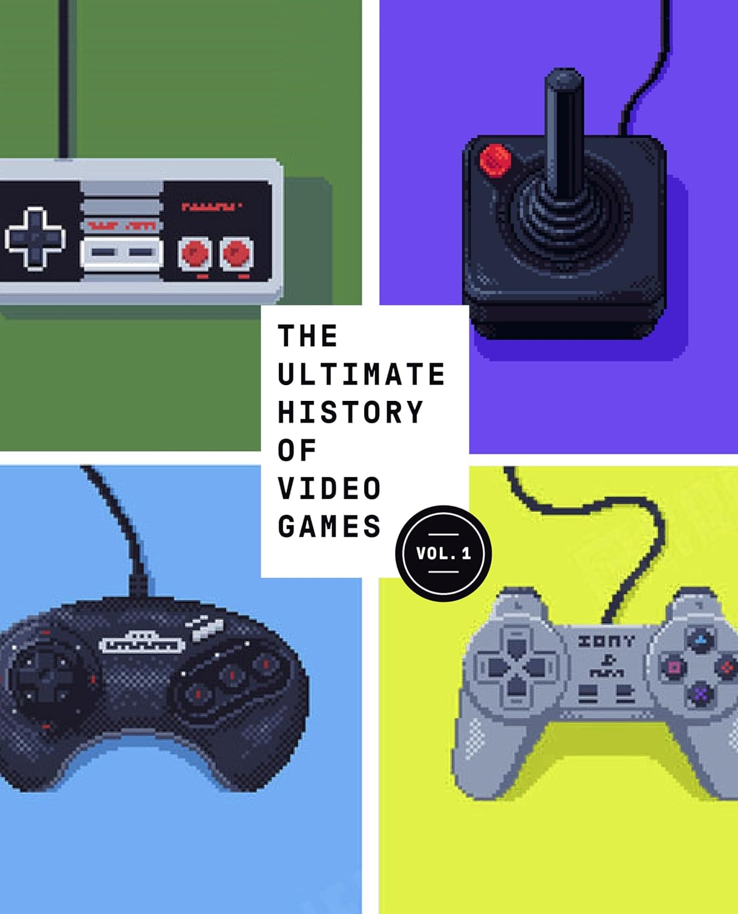

# History and Sociology of Video Games 电子游戏的历史和社会

Video games are currently the fastest-growing form of entertainment in America. They've permanently redefined the way we use our leisure time. The following books are good background reading on the video game phenomenon, if you want to understand not only the games, but their place in the world:

电子游戏是目前美国增长最快的娱乐方式。它们永久性地重新定义了我们利用闲暇时间的方式。如果你不仅想了解电子游戏，还想了解它们在世界上的地位，以下几本书是了解电子游戏现象的背景读物：

Cover 封面 | Book 书名 | Author 作者
:---: |--- | ---
 | [Arcade Fever The Fan's Guide To The Golden Age Of Video Games 街机狂热：电子游戏黄金时代粉丝指南](https://www.amazon.com/dp/0762409371) | John Sellers
 | [Game Over: Press Start to Continue 游戏结束：按“开始”继续](https://www.amazon.com/dp/0966961706) | David Sheff
 | [High Score! The Illustrated History of Electronic Games 高分！图解电子游戏史](https://www.amazon.com/dp/0072224282) | Rusel DeMaria/Johnny Lee Wilson
 | [Joystick Nation: How Videogames Ate Our Quarters, Won Our Hearts, and Rewired Our Minds 摇杆国度：电子游戏如何吃掉我们的硬币、赢得我们的心并重塑我们的思想](https://www.amazon.com/dp/0316360074) | J. C. Herz
 | [Killing Monsters: Why Children Need Fantasy, Super Heroes, and Make-Believe Violence 杀死怪物：为什么儿童需要幻想、超级英雄和虚构的暴力？](https://www.amazon.com/dp/0465036953) | Gerald Jones/Gerard Jones
 | [Phoenix: The Fall & Rise of Videogames 凤凰：电子游戏的衰落与崛起](https://www.amazon.com/dp/0964384825) | Leonard Herman 
 | [Supercade: A Visual History of the Videogame Age 1971-1984 超级街机：1971 - 1984年电子游戏时代视觉史](https://www.amazon.com/dp/0262024926) | Van Burnham
 | [Trigger Happy: Videogames and the Entertainment Revolution 触发快乐：电子游戏与娱乐革命](https://www.amazon.com/dp/1559705396) | Steven Poole
 | [The Ultimate History of Video Games: From Pong to Pokemon—The Story Behind the Craze That Touched Our Lives and Changed the World 电子游戏终极史：从乒乓到宠物小精灵——影响我们生活和改变世界的热潮背后的故事](https://www.amazon.com/dp/0761536434) | Steve L. Kent