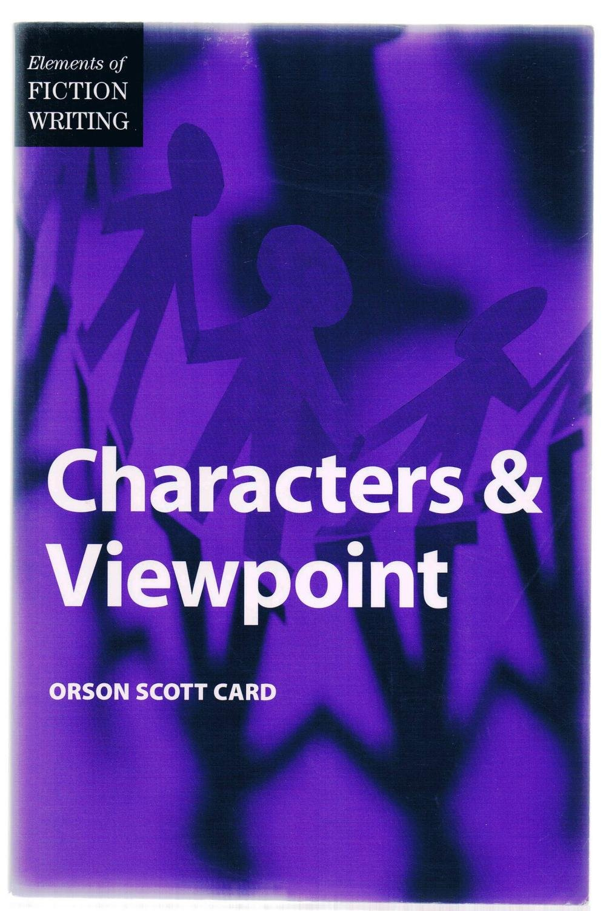
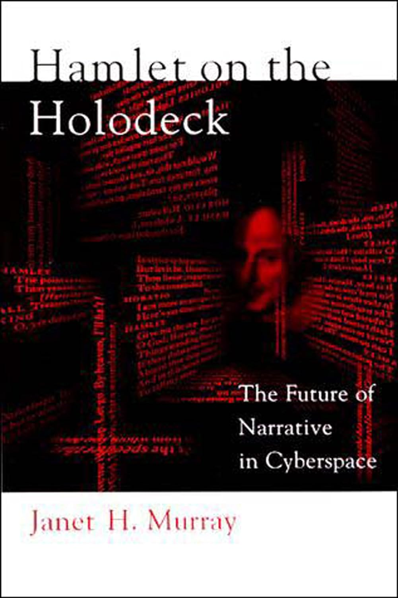
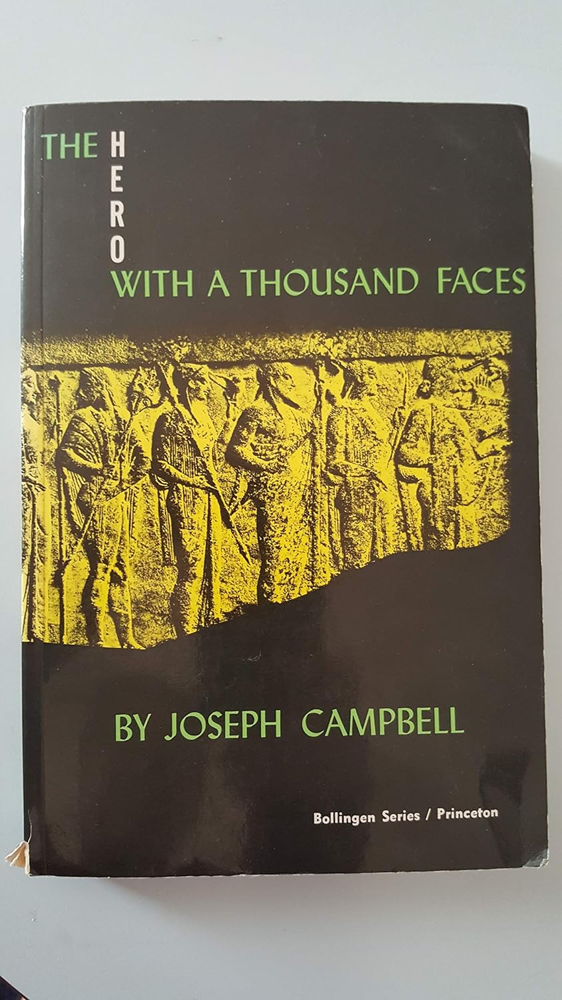
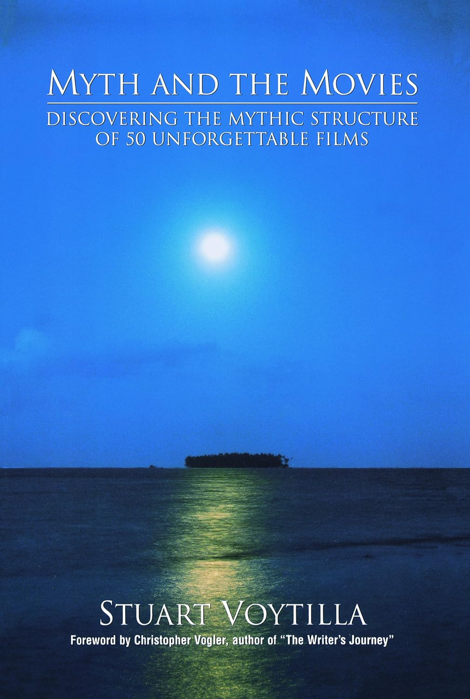
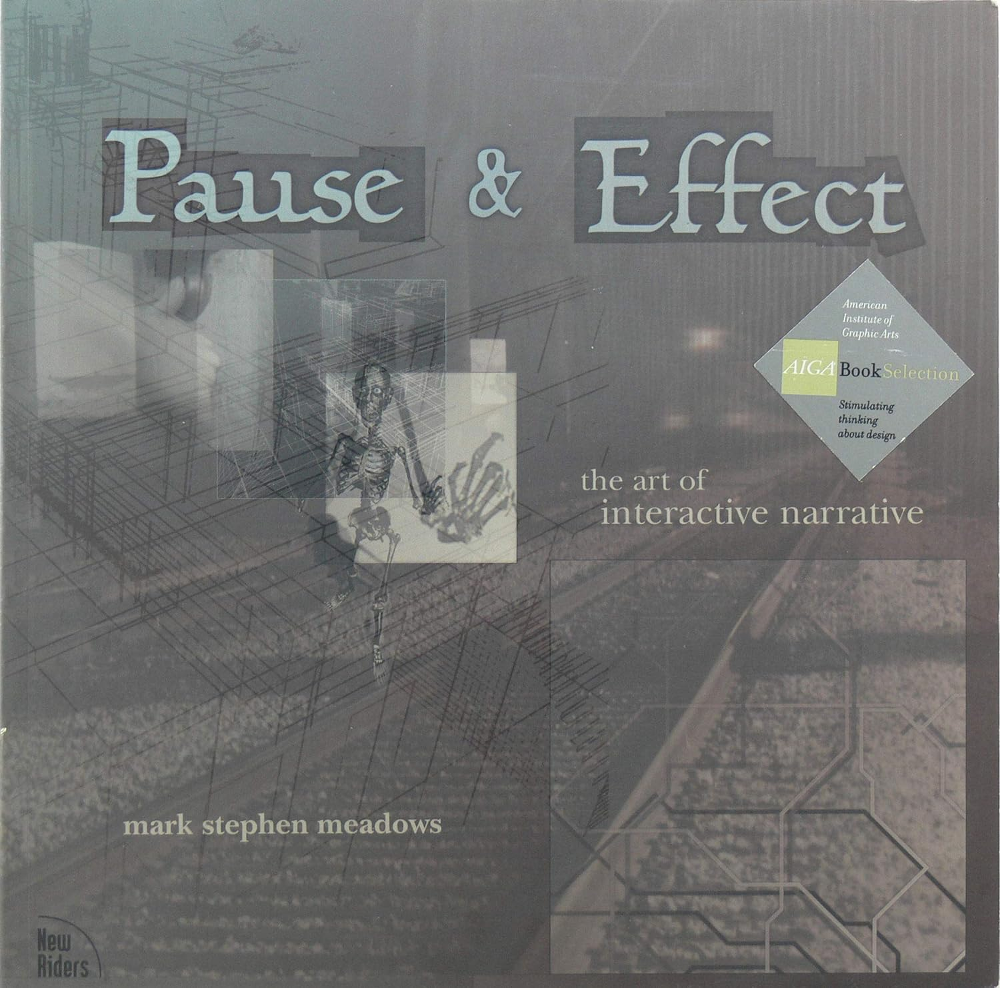
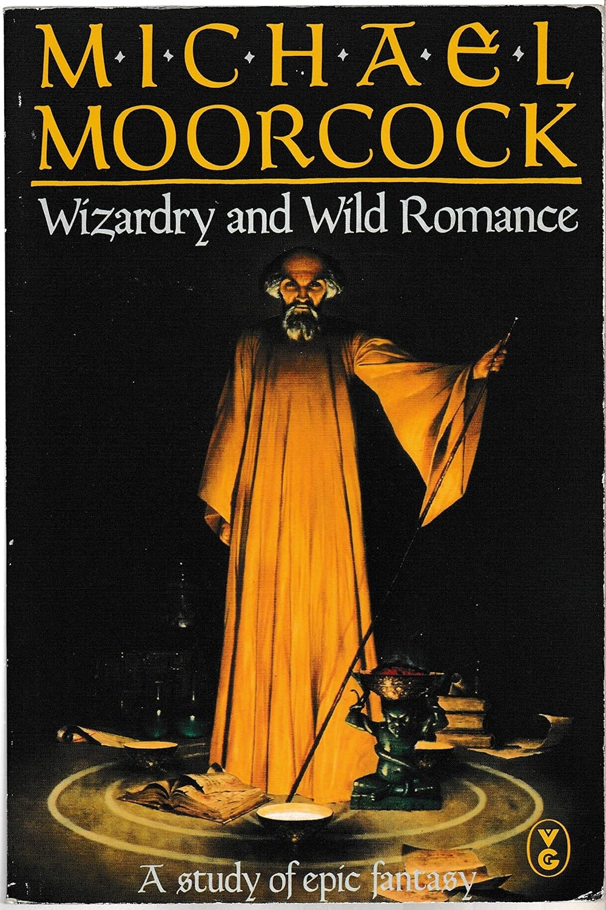

# Writing and Narrative 写作与叙事

Game designers spend most of their time writing, and they have the primary responsibility for creating a game's story if it has one. Most of the stories in games at the moment are pretty mediocre, but we think some of the following can help to correct that situation.

游戏设计师的大部分时间都花在写作上，他们的主要职责是创作游戏故事（如果有的话）。目前，大多数游戏的故事都很平庸，但我们认为以下的书可以帮助纠正这种情况。

Cover 封面 | Book 书名 | Author 作者
:---: |--- | ---
 | [Elements of Fiction Writing - Characters & Viewpoint 小说写作要素：人物与视角](https://www.amazon.com/dp/0898799279) | Orson Scott Card | [0898799279]
 | [Hamlet on the Holodeck: The Future of Narrative in Cyberspace 全息甲板上的哈姆雷特：网络空间叙事的未来](https://www.amazon.com/dp/0262631873) |  Janet H. Murray
 | [The Hero with a Thousand Faces 千面英雄](https://www.amazon.com/dp/0691017840) | Joseph Campbell 
 | [Myth and the Movies: Discovering the Mythic Structure of 50 Unforgettable Films 神话与电影：发现 50 部难忘电影的神话结构](https://www.amazon.com/dp/0941188663) | Stuart Voytilla |
 | [Pause & Effect: The Art of Interactive Narrative 暂停与效果：互动叙事的艺术](https://www.amazon.com/dp/0735711712) | Mark Stephen Meadows 
 | [Wizardry and Wild Romance: A Study of Epic Fantasy 魔法与野性浪漫：史诗奇幻研究](https://www.amazon.com/dp/0575041471) | Michael Moorcock 
 | [The Writer's Journey: Mythic Structure for Writers 作家之旅：作家的神话结构](https://www.amazon.com/dp/0941188701) | Christopher Vogler